# 第39章：データ連携の実装パターン

本章では、基幹業務システム間のデータ連携を実現するための具体的な実装パターンについて解説します。バッチ連携とリアルタイム連携の両方のアプローチを理解し、適切な連携テーブル設計とエラーハンドリングの方法を学びます。

---

## 39.1 バッチ連携

### バッチ連携の概要

バッチ連携は、定期的なスケジュールでまとめてデータを転送する方式です。大量データの処理や、リアルタイム性が不要な業務に適しています。

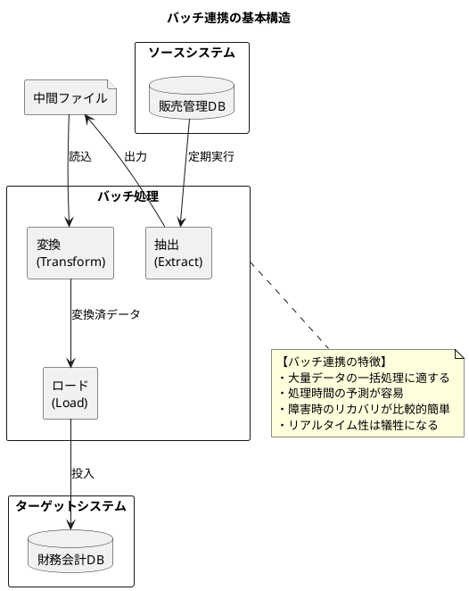

### ファイル連携（CSV / XML / JSON）

基幹業務システム間のデータ連携では、ファイル形式でのデータ交換が広く使われています。

#### ファイル形式の比較

| 形式 | 特徴 | 適用場面 | 注意点 |
|-----|-----|---------|-------|
| CSV | 軽量・シンプル | 定型データ、レガシー連携 | 文字コード、区切り文字 |
| XML | 構造化、スキーマ定義 | 複雑な階層データ | ファイルサイズ大 |
| JSON | 軽量・可読性高 | Web API 連携 | スキーマ検証が必要 |
| 固定長 | 高速処理 | 大量データ、メインフレーム | 柔軟性に欠ける |

#### ファイル連携の設計

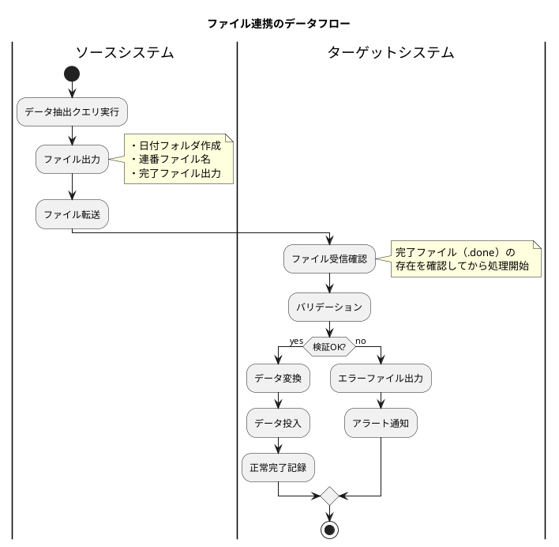

<details>
<summary>Java 実装例 - CSV 出力</summary>

```java
// 売上データ CSV 出力サービス
@Service
public class SalesCsvExportService {
    private final SalesRepository salesRepository;
    private final FileStorageService fileStorage;

    @Transactional(readOnly = true)
    public ExportResult exportSalesData(LocalDate targetDate) {
        // 出力ディレクトリ
        String directory = String.format("sales/%s",
            targetDate.format(DateTimeFormatter.ofPattern("yyyyMMdd")));

        // データ取得
        List<SalesData> salesList = salesRepository.findByDate(targetDate);

        // CSV 出力
        String fileName = String.format("sales_%s_%s.csv",
            targetDate.format(DateTimeFormatter.ofPattern("yyyyMMdd")),
            LocalDateTime.now().format(DateTimeFormatter.ofPattern("HHmmss")));

        try (CsvWriter writer = new CsvWriter(
                fileStorage.getOutputStream(directory, fileName),
                StandardCharsets.UTF_8)) {

            // ヘッダー出力
            writer.writeHeader(
                "売上番号", "売上日", "得意先コード", "得意先名",
                "商品コード", "商品名", "数量", "単価", "金額", "消費税"
            );

            // データ出力
            for (SalesData sales : salesList) {
                writer.writeRow(
                    sales.getSalesNumber(),
                    sales.getSalesDate().toString(),
                    sales.getCustomerCode(),
                    sales.getCustomerName(),
                    sales.getProductCode(),
                    sales.getProductName(),
                    sales.getQuantity().toString(),
                    sales.getUnitPrice().toString(),
                    sales.getAmount().toString(),
                    sales.getTaxAmount().toString()
                );
            }
        }

        // 完了ファイル出力
        String doneFileName = fileName.replace(".csv", ".done");
        fileStorage.createEmptyFile(directory, doneFileName);

        return new ExportResult(
            fileName,
            salesList.size(),
            ExportStatus.SUCCESS
        );
    }
}

// CSV ライター
public class CsvWriter implements AutoCloseable {
    private final BufferedWriter writer;
    private final String delimiter = ",";
    private final String lineEnding = "\r\n";

    public CsvWriter(OutputStream outputStream, Charset charset) {
        this.writer = new BufferedWriter(
            new OutputStreamWriter(outputStream, charset)
        );
    }

    public void writeHeader(String... columns) throws IOException {
        writeLine(columns);
    }

    public void writeRow(String... values) throws IOException {
        String[] escapedValues = Arrays.stream(values)
            .map(this::escapeField)
            .toArray(String[]::new);
        writeLine(escapedValues);
    }

    private void writeLine(String[] fields) throws IOException {
        writer.write(String.join(delimiter, fields));
        writer.write(lineEnding);
    }

    private String escapeField(String field) {
        if (field == null) return "";
        if (field.contains(",") || field.contains("\"")
                || field.contains("\n")) {
            return "\"" + field.replace("\"", "\"\"") + "\"";
        }
        return field;
    }

    @Override
    public void close() throws IOException {
        writer.close();
    }
}
```

</details>

<details>
<summary>Java 実装例 - CSV 取込</summary>

```java
// 仕訳データ CSV 取込サービス
@Service
public class JournalCsvImportService {
    private final JournalRepository journalRepository;
    private final FileStorageService fileStorage;
    private final ImportLogRepository importLogRepository;

    @Transactional
    public ImportResult importJournalData(String directory, String fileName) {
        ImportLog log = ImportLog.start(fileName);

        try {
            // 完了ファイル確認
            String doneFileName = fileName.replace(".csv", ".done");
            if (!fileStorage.exists(directory, doneFileName)) {
                throw new ImportException("完了ファイルが見つかりません: " + doneFileName);
            }

            // CSV 読込
            List<JournalImportRow> rows = new ArrayList<>();
            List<ImportError> errors = new ArrayList<>();

            try (CsvReader reader = new CsvReader(
                    fileStorage.getInputStream(directory, fileName),
                    StandardCharsets.UTF_8)) {

                int lineNumber = 1;
                reader.skipHeader();
                lineNumber++;

                String[] line;
                while ((line = reader.readLine()) != null) {
                    try {
                        JournalImportRow row = parseRow(line, lineNumber);
                        validateRow(row);
                        rows.add(row);
                    } catch (ValidationException e) {
                        errors.add(new ImportError(lineNumber, e.getMessage()));
                    }
                    lineNumber++;
                }
            }

            // エラーがある場合は中断
            if (!errors.isEmpty()) {
                log.fail(errors);
                importLogRepository.save(log);
                return new ImportResult(ImportStatus.VALIDATION_ERROR, 0, errors);
            }

            // データ投入
            int insertedCount = 0;
            for (JournalImportRow row : rows) {
                JournalEntry journal = convertToEntity(row);
                journalRepository.save(journal);
                insertedCount++;
            }

            log.success(insertedCount);
            importLogRepository.save(log);

            return new ImportResult(ImportStatus.SUCCESS, insertedCount, List.of());

        } catch (Exception e) {
            log.fail(e.getMessage());
            importLogRepository.save(log);
            throw new ImportException("取込処理でエラーが発生しました", e);
        }
    }

    private JournalImportRow parseRow(String[] fields, int lineNumber) {
        if (fields.length < 10) {
            throw new ValidationException("フィールド数が不足しています");
        }
        return new JournalImportRow(
            fields[0],  // 伝票番号
            LocalDate.parse(fields[1]),  // 伝票日付
            fields[2],  // 借方勘定科目
            fields[3],  // 借方補助科目
            new BigDecimal(fields[4]),  // 借方金額
            fields[5],  // 貸方勘定科目
            fields[6],  // 貸方補助科目
            new BigDecimal(fields[7]),  // 貸方金額
            fields[8],  // 摘要
            fields[9]   // 部門コード
        );
    }

    private void validateRow(JournalImportRow row) {
        // 貸借一致チェック
        if (row.debitAmount().compareTo(row.creditAmount()) != 0) {
            throw new ValidationException("貸借金額が一致しません");
        }
        // その他のバリデーション...
    }
}
```

</details>

### ETL 処理の設計

ETL（Extract-Transform-Load）は、データ連携の標準的なアプローチです。

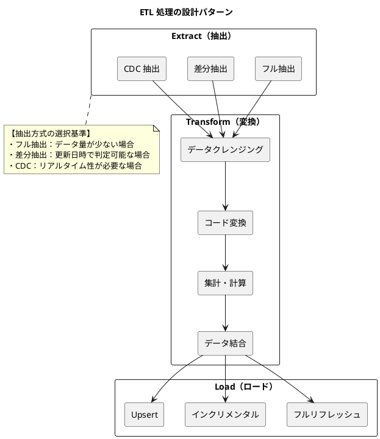

#### ETL ジョブ設計

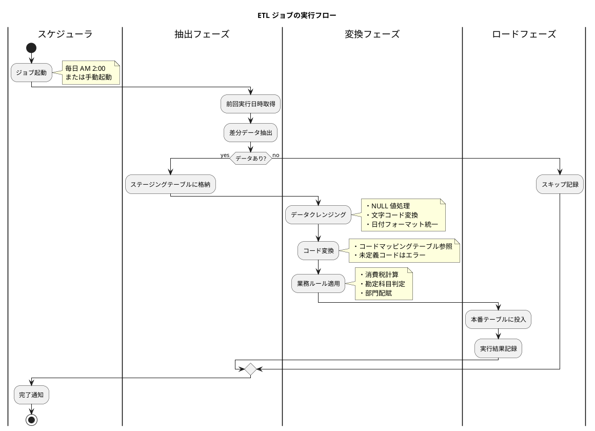

<details>
<summary>Java 実装例 - ETL ジョブ</summary>

```java
// ETL ジョブ基底クラス
public abstract class EtlJob<S, T> {
    protected final Logger log = LoggerFactory.getLogger(getClass());

    public EtlJobResult execute(EtlJobContext context) {
        EtlJobResult result = new EtlJobResult(getJobName());
        result.start();

        try {
            // 抽出フェーズ
            log.info("抽出フェーズ開始");
            List<S> sourceData = extract(context);
            result.setExtractedCount(sourceData.size());
            log.info("抽出完了: {} 件", sourceData.size());

            if (sourceData.isEmpty()) {
                result.complete(EtlJobStatus.SKIPPED, "対象データなし");
                return result;
            }

            // 変換フェーズ
            log.info("変換フェーズ開始");
            TransformResult<T> transformResult = transform(sourceData, context);
            result.setTransformedCount(transformResult.successCount());
            result.setErrorCount(transformResult.errorCount());
            result.addErrors(transformResult.errors());
            log.info("変換完了: 成功 {} 件, エラー {} 件",
                transformResult.successCount(), transformResult.errorCount());

            // エラー閾値チェック
            if (exceedsErrorThreshold(transformResult, context)) {
                result.complete(EtlJobStatus.FAILED, "エラー閾値超過");
                return result;
            }

            // ロードフェーズ
            log.info("ロードフェーズ開始");
            int loadedCount = load(transformResult.data(), context);
            result.setLoadedCount(loadedCount);
            log.info("ロード完了: {} 件", loadedCount);

            result.complete(EtlJobStatus.SUCCESS, null);
            return result;

        } catch (Exception e) {
            log.error("ETL ジョブでエラー発生", e);
            result.complete(EtlJobStatus.FAILED, e.getMessage());
            return result;
        }
    }

    protected abstract String getJobName();
    protected abstract List<S> extract(EtlJobContext context);
    protected abstract TransformResult<T> transform(List<S> data, EtlJobContext context);
    protected abstract int load(List<T> data, EtlJobContext context);

    private boolean exceedsErrorThreshold(
            TransformResult<T> result, EtlJobContext context) {
        double errorRate = (double) result.errorCount()
            / (result.successCount() + result.errorCount());
        return errorRate > context.getErrorThreshold();
    }
}

// 売上→仕訳 ETL ジョブ
@Component
public class SalesToJournalEtlJob extends EtlJob<SalesData, JournalEntry> {
    private final SalesRepository salesRepository;
    private final JournalRepository journalRepository;
    private final JournalPatternService patternService;

    @Override
    protected String getJobName() {
        return "売上仕訳連携";
    }

    @Override
    protected List<SalesData> extract(EtlJobContext context) {
        LocalDateTime lastRunTime = context.getLastRunTime();
        LocalDateTime currentTime = context.getCurrentTime();

        return salesRepository.findByUpdatedAtBetween(lastRunTime, currentTime);
    }

    @Override
    protected TransformResult<JournalEntry> transform(
            List<SalesData> salesList, EtlJobContext context) {

        List<JournalEntry> journals = new ArrayList<>();
        List<TransformError> errors = new ArrayList<>();

        for (SalesData sales : salesList) {
            try {
                // 自動仕訳パターン取得
                JournalPattern pattern = patternService.findPattern(
                    sales.getProductGroup(),
                    sales.getCustomerGroup()
                );

                if (pattern == null) {
                    errors.add(new TransformError(
                        sales.getSalesNumber(),
                        "仕訳パターンが見つかりません"
                    ));
                    continue;
                }

                // 仕訳生成
                JournalEntry journal = createJournal(sales, pattern);
                journals.add(journal);

            } catch (Exception e) {
                errors.add(new TransformError(
                    sales.getSalesNumber(),
                    e.getMessage()
                ));
            }
        }

        return new TransformResult<>(journals, journals.size(), errors.size(), errors);
    }

    @Override
    @Transactional
    protected int load(List<JournalEntry> journals, EtlJobContext context) {
        int count = 0;
        for (JournalEntry journal : journals) {
            journalRepository.save(journal);
            count++;
        }
        return count;
    }

    private JournalEntry createJournal(SalesData sales, JournalPattern pattern) {
        return JournalEntry.builder()
            .journalDate(sales.getSalesDate())
            .debitAccountCode(pattern.getDebitAccountCode())
            .debitAmount(sales.getAmount())
            .creditAccountCode(pattern.getCreditAccountCode())
            .creditAmount(sales.getAmount())
            .description("売上計上: " + sales.getSalesNumber())
            .sourceType("SALES")
            .sourceId(sales.getSalesNumber())
            .build();
    }
}
```

</details>

### 差分抽出と全件抽出

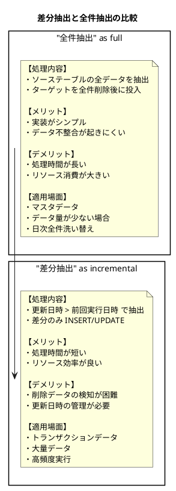

#### 差分抽出の実装パターン

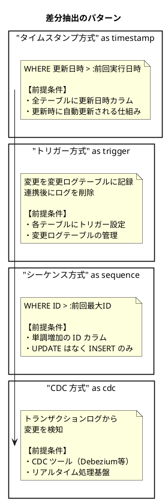

<details>
<summary>Java 実装例 - 差分抽出</summary>

```java
// 差分抽出サービス
@Service
public class IncrementalExtractService {
    private final JdbcTemplate jdbcTemplate;
    private final ExtractCheckpointRepository checkpointRepository;

    /**
     * タイムスタンプ方式による差分抽出
     */
    public <T> List<T> extractByTimestamp(
            String tableName,
            String timestampColumn,
            RowMapper<T> rowMapper) {

        // 前回実行日時取得
        ExtractCheckpoint checkpoint = checkpointRepository
            .findByTableName(tableName)
            .orElse(new ExtractCheckpoint(tableName, LocalDateTime.MIN));

        LocalDateTime lastExtractTime = checkpoint.getLastExtractTime();
        LocalDateTime currentTime = LocalDateTime.now();

        // 差分抽出
        String sql = String.format(
            "SELECT * FROM %s WHERE %s > ? AND %s <= ? ORDER BY %s",
            tableName, timestampColumn, timestampColumn, timestampColumn
        );

        List<T> result = jdbcTemplate.query(sql, rowMapper,
            lastExtractTime, currentTime);

        // チェックポイント更新
        checkpoint.setLastExtractTime(currentTime);
        checkpointRepository.save(checkpoint);

        return result;
    }

    /**
     * シーケンス方式による差分抽出
     */
    public <T> List<T> extractBySequence(
            String tableName,
            String sequenceColumn,
            RowMapper<T> rowMapper) {

        ExtractCheckpoint checkpoint = checkpointRepository
            .findByTableName(tableName)
            .orElse(new ExtractCheckpoint(tableName, 0L));

        Long lastSequence = checkpoint.getLastSequence();

        // 差分抽出
        String sql = String.format(
            "SELECT * FROM %s WHERE %s > ? ORDER BY %s",
            tableName, sequenceColumn, sequenceColumn
        );

        List<T> result = jdbcTemplate.query(sql, rowMapper, lastSequence);

        // 最大シーケンス取得と更新
        if (!result.isEmpty()) {
            Long maxSequence = jdbcTemplate.queryForObject(
                String.format("SELECT MAX(%s) FROM %s WHERE %s > ?",
                    sequenceColumn, tableName, sequenceColumn),
                Long.class, lastSequence
            );
            checkpoint.setLastSequence(maxSequence);
            checkpointRepository.save(checkpoint);
        }

        return result;
    }

    /**
     * 削除データの検知（論理削除方式）
     */
    public List<String> extractDeletedIds(
            String tableName,
            String idColumn,
            String deleteFlagColumn) {

        ExtractCheckpoint checkpoint = checkpointRepository
            .findByTableName(tableName + "_DELETE")
            .orElse(new ExtractCheckpoint(tableName + "_DELETE", LocalDateTime.MIN));

        String sql = String.format(
            "SELECT %s FROM %s WHERE %s = true AND 更新日時 > ?",
            idColumn, tableName, deleteFlagColumn
        );

        List<String> deletedIds = jdbcTemplate.queryForList(
            sql, String.class, checkpoint.getLastExtractTime()
        );

        checkpoint.setLastExtractTime(LocalDateTime.now());
        checkpointRepository.save(checkpoint);

        return deletedIds;
    }
}

// 抽出チェックポイント
@Entity
@Table(name = "抽出チェックポイント")
public class ExtractCheckpoint {
    @Id
    private String tableName;
    private LocalDateTime lastExtractTime;
    private Long lastSequence;

    public ExtractCheckpoint(String tableName, LocalDateTime lastExtractTime) {
        this.tableName = tableName;
        this.lastExtractTime = lastExtractTime;
    }

    public ExtractCheckpoint(String tableName, Long lastSequence) {
        this.tableName = tableName;
        this.lastSequence = lastSequence;
    }

    // getters, setters...
}
```

</details>

---

## 39.2 リアルタイム連携

### Change Data Capture（CDC）

CDC は、データベースの変更をリアルタイムで検知し、他システムに伝播するパターンです。

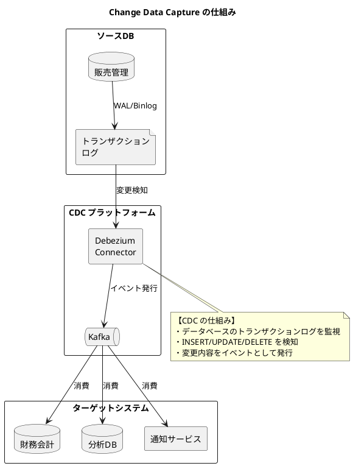

#### CDC イベントの構造

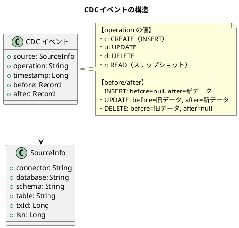

<details>
<summary>Java 実装例 - CDC コンシューマー</summary>

```java
// CDC イベントコンシューマー
@Component
public class SalesCdcConsumer {
    private final ObjectMapper objectMapper;
    private final JournalSyncService journalSyncService;

    @KafkaListener(topics = "sales.public.売上")
    public void consume(String message) {
        try {
            CdcEvent event = objectMapper.readValue(message, CdcEvent.class);

            switch (event.getOperation()) {
                case "c" -> handleInsert(event.getAfter());
                case "u" -> handleUpdate(event.getBefore(), event.getAfter());
                case "d" -> handleDelete(event.getBefore());
                default -> log.warn("Unknown operation: {}", event.getOperation());
            }

        } catch (Exception e) {
            log.error("CDC イベント処理エラー", e);
            throw new CdcProcessingException(e);
        }
    }

    private void handleInsert(JsonNode after) {
        SalesData sales = objectMapper.convertValue(after, SalesData.class);
        journalSyncService.createJournalFromSales(sales);
    }

    private void handleUpdate(JsonNode before, JsonNode after) {
        SalesData oldSales = objectMapper.convertValue(before, SalesData.class);
        SalesData newSales = objectMapper.convertValue(after, SalesData.class);

        // 赤黒処理で訂正
        journalSyncService.reverseJournal(oldSales);
        journalSyncService.createJournalFromSales(newSales);
    }

    private void handleDelete(JsonNode before) {
        SalesData sales = objectMapper.convertValue(before, SalesData.class);
        journalSyncService.reverseJournal(sales);
    }
}

// CDC イベント
@Data
public class CdcEvent {
    private SourceInfo source;
    private String operation;  // c, u, d, r
    private Long tsMs;
    private JsonNode before;
    private JsonNode after;
}

@Data
public class SourceInfo {
    private String connector;
    private String db;
    private String schema;
    private String table;
    private Long txId;
    private Long lsn;
}
```

</details>

### データベーストリガーの活用

トリガーを使用した変更検知は、CDC ツールなしでも実装できるシンプルな方式です。

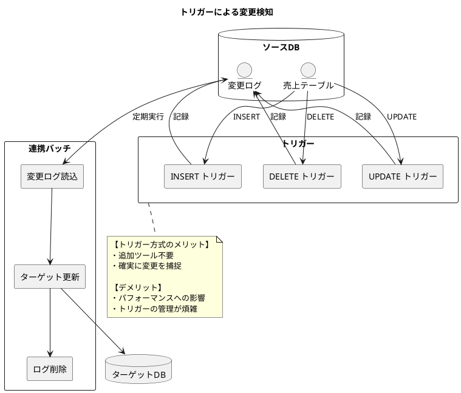

<details>
<summary>SQL 定義 - 変更ログトリガー</summary>

```sql
-- 変更ログテーブル
CREATE TABLE 変更ログ (
    ログID SERIAL PRIMARY KEY,
    テーブル名 VARCHAR(100) NOT NULL,
    操作種別 VARCHAR(10) NOT NULL,  -- INSERT, UPDATE, DELETE
    レコードID VARCHAR(100) NOT NULL,
    変更前データ JSONB,
    変更後データ JSONB,
    変更日時 TIMESTAMP DEFAULT CURRENT_TIMESTAMP,
    処理済フラグ BOOLEAN DEFAULT FALSE,
    処理日時 TIMESTAMP
);

CREATE INDEX idx_変更ログ_未処理 ON 変更ログ (処理済フラグ, 変更日時)
    WHERE 処理済フラグ = FALSE;

-- 売上テーブル用トリガー関数
CREATE OR REPLACE FUNCTION fn_売上変更ログ()
RETURNS TRIGGER AS $$
BEGIN
    IF TG_OP = 'INSERT' THEN
        INSERT INTO 変更ログ (テーブル名, 操作種別, レコードID, 変更後データ)
        VALUES ('売上', 'INSERT', NEW.売上番号, row_to_json(NEW)::JSONB);
        RETURN NEW;

    ELSIF TG_OP = 'UPDATE' THEN
        INSERT INTO 変更ログ (テーブル名, 操作種別, レコードID, 変更前データ, 変更後データ)
        VALUES ('売上', 'UPDATE', NEW.売上番号,
            row_to_json(OLD)::JSONB, row_to_json(NEW)::JSONB);
        RETURN NEW;

    ELSIF TG_OP = 'DELETE' THEN
        INSERT INTO 変更ログ (テーブル名, 操作種別, レコードID, 変更前データ)
        VALUES ('売上', 'DELETE', OLD.売上番号, row_to_json(OLD)::JSONB);
        RETURN OLD;
    END IF;
END;
$$ LANGUAGE plpgsql;

-- トリガー設定
CREATE TRIGGER trg_売上変更ログ
AFTER INSERT OR UPDATE OR DELETE ON 売上
FOR EACH ROW EXECUTE FUNCTION fn_売上変更ログ();
```

</details>

<details>
<summary>Java 実装例 - 変更ログ処理</summary>

```java
// 変更ログ処理サービス
@Service
public class ChangeLogProcessingService {
    private final JdbcTemplate jdbcTemplate;
    private final Map<String, ChangeLogHandler> handlers;

    @Scheduled(fixedDelay = 5000)  // 5秒ごと
    @Transactional
    public void processChangeLogs() {
        // 未処理ログを取得（ロック付き）
        String selectSql = """
            SELECT ログID, テーブル名, 操作種別, レコードID, 変更前データ, 変更後データ
            FROM 変更ログ
            WHERE 処理済フラグ = FALSE
            ORDER BY 変更日時
            LIMIT 100
            FOR UPDATE SKIP LOCKED
            """;

        List<ChangeLog> logs = jdbcTemplate.query(selectSql,
            (rs, rowNum) -> new ChangeLog(
                rs.getLong("ログID"),
                rs.getString("テーブル名"),
                rs.getString("操作種別"),
                rs.getString("レコードID"),
                rs.getString("変更前データ"),
                rs.getString("変更後データ")
            )
        );

        for (ChangeLog log : logs) {
            try {
                // テーブル別ハンドラーで処理
                ChangeLogHandler handler = handlers.get(log.tableName());
                if (handler != null) {
                    handler.handle(log);
                }

                // 処理済みマーク
                markAsProcessed(log.logId());

            } catch (Exception e) {
                // エラーログ記録（処理は継続）
                recordError(log.logId(), e.getMessage());
            }
        }
    }

    private void markAsProcessed(Long logId) {
        jdbcTemplate.update(
            "UPDATE 変更ログ SET 処理済フラグ = TRUE, 処理日時 = CURRENT_TIMESTAMP WHERE ログID = ?",
            logId
        );
    }

    private void recordError(Long logId, String errorMessage) {
        jdbcTemplate.update(
            "UPDATE 変更ログ SET エラー内容 = ? WHERE ログID = ?",
            errorMessage, logId
        );
    }
}

// 変更ログハンドラーインターフェース
public interface ChangeLogHandler {
    void handle(ChangeLog log);
}

// 売上変更ログハンドラー
@Component("売上")
public class SalesChangeLogHandler implements ChangeLogHandler {
    private final ObjectMapper objectMapper;
    private final JournalSyncService journalSyncService;

    @Override
    public void handle(ChangeLog log) {
        switch (log.operation()) {
            case "INSERT" -> {
                SalesData sales = parseJson(log.afterData(), SalesData.class);
                journalSyncService.createJournalFromSales(sales);
            }
            case "UPDATE" -> {
                SalesData oldSales = parseJson(log.beforeData(), SalesData.class);
                SalesData newSales = parseJson(log.afterData(), SalesData.class);
                journalSyncService.reverseJournal(oldSales);
                journalSyncService.createJournalFromSales(newSales);
            }
            case "DELETE" -> {
                SalesData sales = parseJson(log.beforeData(), SalesData.class);
                journalSyncService.reverseJournal(sales);
            }
        }
    }

    private <T> T parseJson(String json, Class<T> clazz) {
        try {
            return objectMapper.readValue(json, clazz);
        } catch (JsonProcessingException e) {
            throw new RuntimeException("JSON パース失敗", e);
        }
    }
}
```

</details>

### メッセージキューによる非同期連携

メッセージキューを使用した非同期連携は、システム間の疎結合を実現します。

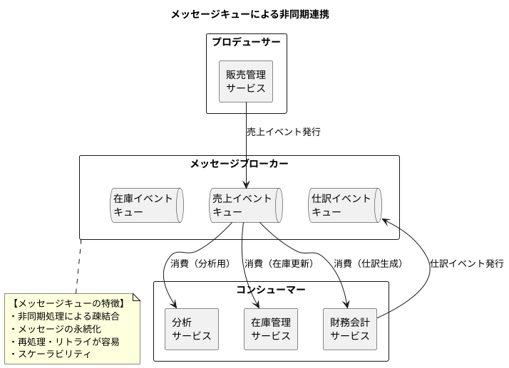

#### メッセージ配信パターン

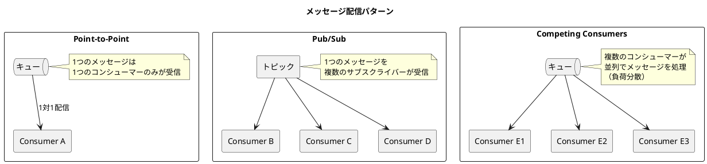

<details>
<summary>Java 実装例 - メッセージキュー連携</summary>

```java
// メッセージプロデューサー
@Service
public class SalesEventPublisher {
    private final RabbitTemplate rabbitTemplate;
    private final ObjectMapper objectMapper;

    private static final String EXCHANGE = "sales.events";

    public void publishSalesCreated(SalesData sales) {
        SalesCreatedEvent event = new SalesCreatedEvent(
            UUID.randomUUID().toString(),
            Instant.now(),
            sales.getSalesNumber(),
            sales.getCustomerCode(),
            sales.getSalesDate(),
            sales.getTotalAmount()
        );

        publish(event, "sales.created");
    }

    public void publishSalesCancelled(String salesNumber, String reason) {
        SalesCancelledEvent event = new SalesCancelledEvent(
            UUID.randomUUID().toString(),
            Instant.now(),
            salesNumber,
            reason
        );

        publish(event, "sales.cancelled");
    }

    private void publish(Object event, String routingKey) {
        try {
            String json = objectMapper.writeValueAsString(event);
            rabbitTemplate.convertAndSend(EXCHANGE, routingKey, json);
            log.info("イベント発行: {} -> {}", routingKey, event);
        } catch (Exception e) {
            log.error("イベント発行失敗", e);
            throw new EventPublishException(e);
        }
    }
}

// メッセージコンシューマー
@Component
public class SalesEventConsumer {
    private final ObjectMapper objectMapper;
    private final JournalService journalService;
    private final InventoryService inventoryService;

    @RabbitListener(queues = "accounting.sales.queue")
    public void handleSalesCreatedForAccounting(String message) {
        SalesCreatedEvent event = parseEvent(message, SalesCreatedEvent.class);

        try {
            // 仕訳生成
            journalService.createFromSales(event);
            log.info("売上仕訳生成完了: {}", event.salesNumber());

        } catch (Exception e) {
            log.error("売上仕訳生成失敗: {}", event.salesNumber(), e);
            throw new AmqpRejectAndDontRequeueException(e);
        }
    }

    @RabbitListener(queues = "inventory.sales.queue")
    public void handleSalesCreatedForInventory(String message) {
        SalesCreatedEvent event = parseEvent(message, SalesCreatedEvent.class);

        try {
            // 在庫引当解除
            inventoryService.releaseAllocation(event.salesNumber());
            log.info("在庫引当解除完了: {}", event.salesNumber());

        } catch (Exception e) {
            log.error("在庫引当解除失敗: {}", event.salesNumber(), e);
            throw new AmqpRejectAndDontRequeueException(e);
        }
    }

    private <T> T parseEvent(String message, Class<T> clazz) {
        try {
            return objectMapper.readValue(message, clazz);
        } catch (JsonProcessingException e) {
            throw new EventParseException(e);
        }
    }
}

// RabbitMQ 設定
@Configuration
public class RabbitMqConfig {

    @Bean
    public TopicExchange salesEventsExchange() {
        return new TopicExchange("sales.events");
    }

    @Bean
    public Queue accountingSalesQueue() {
        return QueueBuilder.durable("accounting.sales.queue")
            .withArgument("x-dead-letter-exchange", "sales.events.dlx")
            .withArgument("x-dead-letter-routing-key", "accounting.sales.dead")
            .build();
    }

    @Bean
    public Queue inventorySalesQueue() {
        return QueueBuilder.durable("inventory.sales.queue")
            .withArgument("x-dead-letter-exchange", "sales.events.dlx")
            .withArgument("x-dead-letter-routing-key", "inventory.sales.dead")
            .build();
    }

    @Bean
    public Binding accountingBinding() {
        return BindingBuilder
            .bind(accountingSalesQueue())
            .to(salesEventsExchange())
            .with("sales.*");
    }

    @Bean
    public Binding inventoryBinding() {
        return BindingBuilder
            .bind(inventorySalesQueue())
            .to(salesEventsExchange())
            .with("sales.*");
    }

    // Dead Letter Queue 設定
    @Bean
    public DirectExchange deadLetterExchange() {
        return new DirectExchange("sales.events.dlx");
    }

    @Bean
    public Queue deadLetterQueue() {
        return QueueBuilder.durable("sales.events.dead").build();
    }
}
```

</details>

---

## 39.3 連携テーブルの設計

### 連携ステータス管理

データ連携の状態を追跡するためのテーブル設計は、運用上非常に重要です。

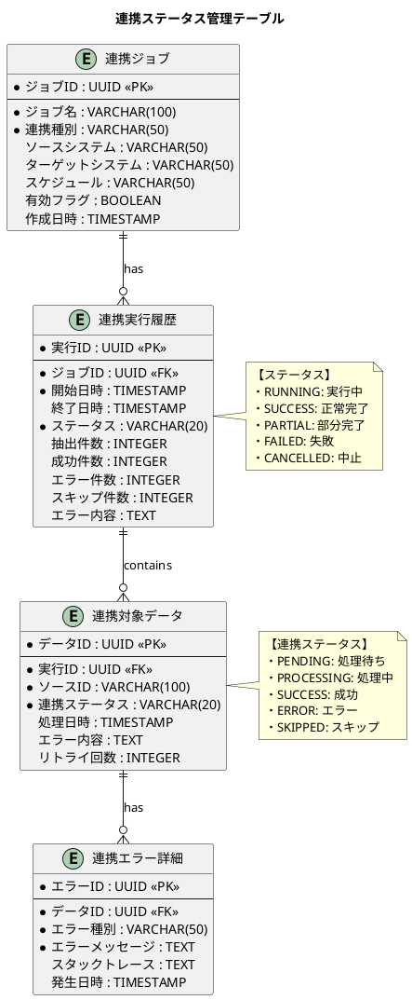

<details>
<summary>SQL 定義</summary>

```sql
-- 連携ジョブマスタ
CREATE TABLE 連携ジョブ (
    ジョブID UUID PRIMARY KEY DEFAULT gen_random_uuid(),
    ジョブ名 VARCHAR(100) NOT NULL UNIQUE,
    連携種別 VARCHAR(50) NOT NULL,  -- BATCH, REALTIME, CDC
    ソースシステム VARCHAR(50),
    ターゲットシステム VARCHAR(50),
    スケジュール VARCHAR(50),  -- cron 式
    設定JSON JSONB,
    有効フラグ BOOLEAN DEFAULT TRUE,
    作成日時 TIMESTAMP DEFAULT CURRENT_TIMESTAMP,
    更新日時 TIMESTAMP DEFAULT CURRENT_TIMESTAMP
);

-- 連携実行履歴
CREATE TABLE 連携実行履歴 (
    実行ID UUID PRIMARY KEY DEFAULT gen_random_uuid(),
    ジョブID UUID NOT NULL REFERENCES 連携ジョブ(ジョブID),
    開始日時 TIMESTAMP NOT NULL DEFAULT CURRENT_TIMESTAMP,
    終了日時 TIMESTAMP,
    ステータス VARCHAR(20) NOT NULL DEFAULT 'RUNNING',
    抽出件数 INTEGER DEFAULT 0,
    成功件数 INTEGER DEFAULT 0,
    エラー件数 INTEGER DEFAULT 0,
    スキップ件数 INTEGER DEFAULT 0,
    エラー内容 TEXT,
    実行パラメータ JSONB,
    CONSTRAINT chk_ステータス CHECK (
        ステータス IN ('RUNNING', 'SUCCESS', 'PARTIAL', 'FAILED', 'CANCELLED')
    )
);

CREATE INDEX idx_連携実行履歴_ジョブ日時
    ON 連携実行履歴 (ジョブID, 開始日時 DESC);

-- 連携対象データ
CREATE TABLE 連携対象データ (
    データID UUID PRIMARY KEY DEFAULT gen_random_uuid(),
    実行ID UUID NOT NULL REFERENCES 連携実行履歴(実行ID),
    ソースID VARCHAR(100) NOT NULL,
    連携ステータス VARCHAR(20) NOT NULL DEFAULT 'PENDING',
    処理日時 TIMESTAMP,
    エラー内容 TEXT,
    リトライ回数 INTEGER DEFAULT 0,
    ソースデータ JSONB,
    CONSTRAINT chk_連携ステータス CHECK (
        連携ステータス IN ('PENDING', 'PROCESSING', 'SUCCESS', 'ERROR', 'SKIPPED')
    )
);

CREATE INDEX idx_連携対象データ_実行ステータス
    ON 連携対象データ (実行ID, 連携ステータス);

-- 連携エラー詳細
CREATE TABLE 連携エラー詳細 (
    エラーID UUID PRIMARY KEY DEFAULT gen_random_uuid(),
    データID UUID NOT NULL REFERENCES 連携対象データ(データID),
    エラー種別 VARCHAR(50) NOT NULL,
    エラーメッセージ TEXT NOT NULL,
    スタックトレース TEXT,
    発生日時 TIMESTAMP DEFAULT CURRENT_TIMESTAMP
);

-- 連携サマリービュー
CREATE VIEW v_連携サマリー AS
SELECT
    j.ジョブ名,
    j.連携種別,
    e.実行ID,
    e.開始日時,
    e.終了日時,
    e.ステータス,
    e.抽出件数,
    e.成功件数,
    e.エラー件数,
    CASE
        WHEN e.抽出件数 > 0
        THEN ROUND(e.成功件数::NUMERIC / e.抽出件数 * 100, 2)
        ELSE 0
    END AS 成功率
FROM 連携ジョブ j
JOIN 連携実行履歴 e ON j.ジョブID = e.ジョブID
ORDER BY e.開始日時 DESC;
```

</details>

### エラーハンドリングとリトライ

データ連携におけるエラーハンドリングは、システムの信頼性を確保するために重要です。

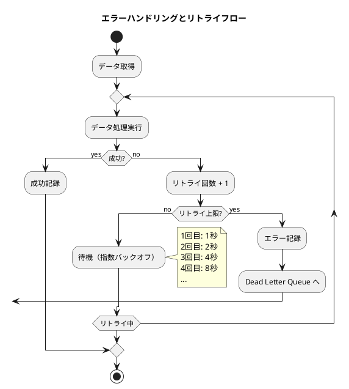

#### リトライ戦略

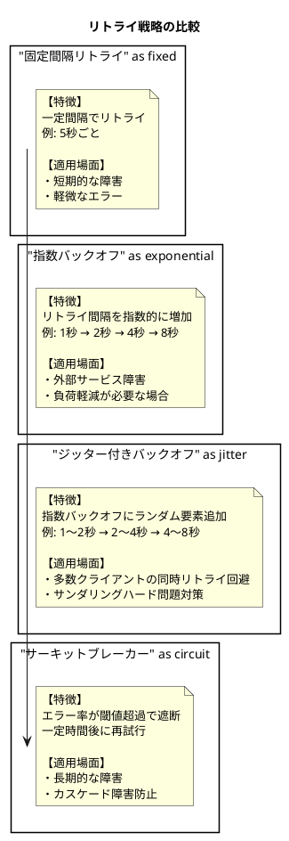

<details>
<summary>Java 実装例 - リトライ機構</summary>

```java
// リトライ設定
@Configuration
public class RetryConfig {

    @Bean
    public RetryTemplate retryTemplate() {
        RetryTemplate template = new RetryTemplate();

        // 指数バックオフ設定
        ExponentialBackOffPolicy backOffPolicy = new ExponentialBackOffPolicy();
        backOffPolicy.setInitialInterval(1000);  // 1秒
        backOffPolicy.setMultiplier(2.0);
        backOffPolicy.setMaxInterval(30000);  // 最大30秒
        template.setBackOffPolicy(backOffPolicy);

        // リトライポリシー
        Map<Class<? extends Throwable>, Boolean> retryableExceptions = new HashMap<>();
        retryableExceptions.put(TransientDataAccessException.class, true);
        retryableExceptions.put(TimeoutException.class, true);
        retryableExceptions.put(ConnectException.class, true);

        SimpleRetryPolicy retryPolicy = new SimpleRetryPolicy(
            5,  // 最大5回
            retryableExceptions
        );
        template.setRetryPolicy(retryPolicy);

        // リスナー
        template.registerListener(new RetryListenerSupport() {
            @Override
            public <T, E extends Throwable> void onError(
                    RetryContext context, RetryCallback<T, E> callback, Throwable throwable) {
                log.warn("リトライ {} 回目: {}",
                    context.getRetryCount(), throwable.getMessage());
            }
        });

        return template;
    }
}

// リトライ付き連携サービス
@Service
public class RetryableIntegrationService {
    private final RetryTemplate retryTemplate;
    private final IntegrationDataRepository dataRepository;
    private final DeadLetterService deadLetterService;

    @Transactional
    public void processWithRetry(IntegrationData data) {
        try {
            retryTemplate.execute(context -> {
                // 処理実行
                processData(data);

                // 成功記録
                data.setStatus(IntegrationStatus.SUCCESS);
                data.setProcessedAt(LocalDateTime.now());
                dataRepository.save(data);

                return null;
            });

        } catch (Exception e) {
            // リトライ上限超過
            handleMaxRetriesExceeded(data, e);
        }
    }

    private void processData(IntegrationData data) {
        // 実際の連携処理
        // ...
    }

    private void handleMaxRetriesExceeded(IntegrationData data, Exception e) {
        // エラー記録
        data.setStatus(IntegrationStatus.ERROR);
        data.setErrorMessage(e.getMessage());
        data.setRetryCount(data.getRetryCount() + 1);
        dataRepository.save(data);

        // Dead Letter Queue へ
        deadLetterService.send(data);

        // アラート通知
        alertService.notify(
            "連携エラー: " + data.getSourceId(),
            e.getMessage()
        );
    }
}

// サーキットブレーカー付きサービス
@Service
public class CircuitBreakerIntegrationService {
    private final CircuitBreaker circuitBreaker;
    private final ExternalSystemClient externalClient;

    public CircuitBreakerIntegrationService() {
        CircuitBreakerConfig config = CircuitBreakerConfig.custom()
            .failureRateThreshold(50)  // 50%以上でオープン
            .waitDurationInOpenState(Duration.ofSeconds(30))
            .slidingWindowSize(10)
            .build();

        this.circuitBreaker = CircuitBreaker.of("external-system", config);
    }

    public void sendToExternalSystem(IntegrationData data) {
        Try.ofSupplier(
            CircuitBreaker.decorateSupplier(circuitBreaker, () -> {
                return externalClient.send(data);
            })
        ).recover(CallNotPermittedException.class, e -> {
            log.warn("サーキットブレーカーオープン中");
            // フォールバック処理
            queueForLater(data);
            return null;
        }).get();
    }

    private void queueForLater(IntegrationData data) {
        // 後で再処理するためキューイング
        pendingQueue.add(data);
    }
}
```

</details>

### 冪等性の確保

データ連携において冪等性を確保することで、重複実行による問題を防ぎます。

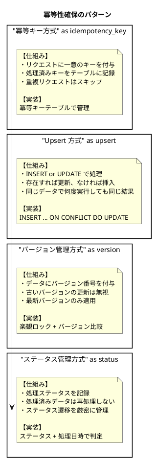

<details>
<summary>SQL 定義 - 冪等性テーブル</summary>

```sql
-- 冪等キーテーブル
CREATE TABLE 冪等キー (
    冪等キー VARCHAR(100) PRIMARY KEY,
    処理種別 VARCHAR(50) NOT NULL,
    ソースID VARCHAR(100) NOT NULL,
    処理結果 JSONB,
    処理日時 TIMESTAMP DEFAULT CURRENT_TIMESTAMP,
    有効期限 TIMESTAMP NOT NULL
);

CREATE INDEX idx_冪等キー_有効期限 ON 冪等キー (有効期限);

-- 期限切れキーの自動削除
CREATE OR REPLACE FUNCTION fn_冪等キー_クリーンアップ()
RETURNS void AS $$
BEGIN
    DELETE FROM 冪等キー WHERE 有効期限 < CURRENT_TIMESTAMP;
END;
$$ LANGUAGE plpgsql;

-- 冪等処理の実行関数
CREATE OR REPLACE FUNCTION fn_冪等処理(
    p_冪等キー VARCHAR,
    p_処理種別 VARCHAR,
    p_ソースID VARCHAR,
    p_有効期間_日数 INTEGER DEFAULT 7
) RETURNS TABLE (
    処理可能 BOOLEAN,
    既存結果 JSONB
) AS $$
DECLARE
    v_existing RECORD;
BEGIN
    -- 既存キーを検索（ロック付き）
    SELECT * INTO v_existing
    FROM 冪等キー
    WHERE 冪等キー = p_冪等キー
    FOR UPDATE;

    IF v_existing IS NOT NULL THEN
        -- 既に処理済み
        RETURN QUERY SELECT FALSE, v_existing.処理結果;
    ELSE
        -- 新規キーを登録
        INSERT INTO 冪等キー (冪等キー, 処理種別, ソースID, 有効期限)
        VALUES (
            p_冪等キー,
            p_処理種別,
            p_ソースID,
            CURRENT_TIMESTAMP + (p_有効期間_日数 || ' days')::INTERVAL
        );
        RETURN QUERY SELECT TRUE, NULL::JSONB;
    END IF;
END;
$$ LANGUAGE plpgsql;

-- 処理結果の記録関数
CREATE OR REPLACE FUNCTION fn_冪等結果記録(
    p_冪等キー VARCHAR,
    p_処理結果 JSONB
) RETURNS void AS $$
BEGIN
    UPDATE 冪等キー
    SET 処理結果 = p_処理結果
    WHERE 冪等キー = p_冪等キー;
END;
$$ LANGUAGE plpgsql;
```

</details>

<details>
<summary>Java 実装例 - 冪等性サービス</summary>

```java
// 冪等性サービス
@Service
public class IdempotencyService {
    private final JdbcTemplate jdbcTemplate;

    /**
     * 冪等処理を実行
     * @return true: 処理可能, false: 既に処理済み
     */
    @Transactional
    public IdempotencyResult checkAndLock(
            String idempotencyKey,
            String processType,
            String sourceId) {

        // 既存キーをチェック
        Map<String, Object> result = jdbcTemplate.queryForMap(
            "SELECT * FROM fn_冪等処理(?, ?, ?)",
            idempotencyKey, processType, sourceId
        );

        boolean canProcess = (Boolean) result.get("処理可能");
        String existingResult = (String) result.get("既存結果");

        return new IdempotencyResult(canProcess, existingResult);
    }

    /**
     * 処理結果を記録
     */
    @Transactional
    public void recordResult(String idempotencyKey, Object result) {
        try {
            String jsonResult = new ObjectMapper().writeValueAsString(result);
            jdbcTemplate.update(
                "SELECT fn_冪等結果記録(?, ?::JSONB)",
                idempotencyKey, jsonResult
            );
        } catch (JsonProcessingException e) {
            throw new RuntimeException("結果のJSON変換に失敗", e);
        }
    }
}

// 冪等性デコレーター
@Aspect
@Component
public class IdempotencyAspect {
    private final IdempotencyService idempotencyService;

    @Around("@annotation(idempotent)")
    public Object ensureIdempotency(
            ProceedingJoinPoint joinPoint,
            Idempotent idempotent) throws Throwable {

        // 冪等キーを取得
        String idempotencyKey = extractIdempotencyKey(joinPoint, idempotent);
        String processType = joinPoint.getSignature().getName();
        String sourceId = extractSourceId(joinPoint, idempotent);

        // 冪等チェック
        IdempotencyResult check = idempotencyService.checkAndLock(
            idempotencyKey, processType, sourceId
        );

        if (!check.canProcess()) {
            log.info("冪等スキップ: {} (既存結果: {})",
                idempotencyKey, check.existingResult());
            return check.existingResult();
        }

        try {
            // 処理実行
            Object result = joinPoint.proceed();

            // 結果記録
            idempotencyService.recordResult(idempotencyKey, result);

            return result;

        } catch (Exception e) {
            // エラー時は冪等キーを削除（再試行可能に）
            idempotencyService.removeKey(idempotencyKey);
            throw e;
        }
    }

    private String extractIdempotencyKey(
            ProceedingJoinPoint joinPoint, Idempotent idempotent) {
        // アノテーションの keyExpression から冪等キーを抽出
        // SpEL で引数から動的に取得
        // ...
    }
}

// 冪等アノテーション
@Target(ElementType.METHOD)
@Retention(RetentionPolicy.RUNTIME)
public @interface Idempotent {
    String keyExpression();  // SpEL式: "#args[0].id"
    String sourceIdExpression() default "";
}

// 使用例
@Service
public class JournalIntegrationService {

    @Idempotent(keyExpression = "'SALES_JOURNAL_' + #sales.salesNumber")
    @Transactional
    public JournalEntry createJournalFromSales(SalesData sales) {
        // この処理は同じ売上番号に対して1回だけ実行される
        return journalService.createFromSales(sales);
    }
}

// Upsert による冪等性
@Repository
public class JournalRepository {

    @Transactional
    public void upsertFromIntegration(JournalEntry journal) {
        String sql = """
            INSERT INTO 仕訳 (
                伝票番号, 伝票日付, 借方勘定, 借方金額,
                貸方勘定, 貸方金額, 摘要, ソース種別, ソースID
            ) VALUES (?, ?, ?, ?, ?, ?, ?, ?, ?)
            ON CONFLICT (ソース種別, ソースID) DO UPDATE SET
                伝票日付 = EXCLUDED.伝票日付,
                借方勘定 = EXCLUDED.借方勘定,
                借方金額 = EXCLUDED.借方金額,
                貸方勘定 = EXCLUDED.貸方勘定,
                貸方金額 = EXCLUDED.貸方金額,
                摘要 = EXCLUDED.摘要,
                更新日時 = CURRENT_TIMESTAMP
            """;

        jdbcTemplate.update(sql,
            journal.getJournalNumber(),
            journal.getJournalDate(),
            journal.getDebitAccount(),
            journal.getDebitAmount(),
            journal.getCreditAccount(),
            journal.getCreditAmount(),
            journal.getDescription(),
            journal.getSourceType(),
            journal.getSourceId()
        );
    }
}
```

</details>

### 連携監視ダッシュボード

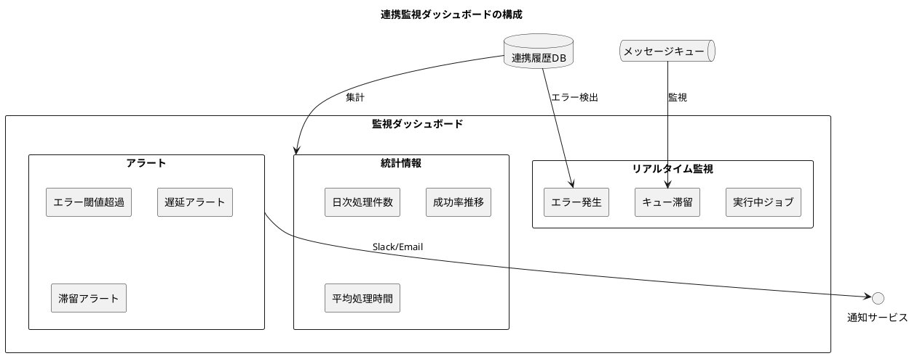

<details>
<summary>SQL 定義 - 監視用ビュー</summary>

```sql
-- 日次連携サマリービュー
CREATE VIEW v_日次連携サマリー AS
SELECT
    DATE(e.開始日時) AS 実行日,
    j.ジョブ名,
    COUNT(*) AS 実行回数,
    SUM(CASE WHEN e.ステータス = 'SUCCESS' THEN 1 ELSE 0 END) AS 成功回数,
    SUM(CASE WHEN e.ステータス = 'FAILED' THEN 1 ELSE 0 END) AS 失敗回数,
    SUM(e.抽出件数) AS 総抽出件数,
    SUM(e.成功件数) AS 総成功件数,
    SUM(e.エラー件数) AS 総エラー件数,
    ROUND(
        SUM(e.成功件数)::NUMERIC / NULLIF(SUM(e.抽出件数), 0) * 100, 2
    ) AS 成功率,
    AVG(EXTRACT(EPOCH FROM (e.終了日時 - e.開始日時))) AS 平均処理時間_秒
FROM 連携実行履歴 e
JOIN 連携ジョブ j ON e.ジョブID = j.ジョブID
WHERE e.開始日時 >= CURRENT_DATE - INTERVAL '30 days'
GROUP BY DATE(e.開始日時), j.ジョブ名
ORDER BY 実行日 DESC, j.ジョブ名;

-- リアルタイム監視ビュー
CREATE VIEW v_リアルタイム監視 AS
SELECT
    j.ジョブ名,
    e.実行ID,
    e.ステータス,
    e.開始日時,
    EXTRACT(EPOCH FROM (CURRENT_TIMESTAMP - e.開始日時)) AS 経過時間_秒,
    e.抽出件数,
    e.成功件数,
    e.エラー件数,
    ROUND(
        e.成功件数::NUMERIC / NULLIF(e.抽出件数, 0) * 100, 2
    ) AS 進捗率
FROM 連携実行履歴 e
JOIN 連携ジョブ j ON e.ジョブID = j.ジョブID
WHERE e.ステータス = 'RUNNING'
ORDER BY e.開始日時;

-- エラー傾向分析ビュー
CREATE VIEW v_エラー傾向 AS
SELECT
    j.ジョブ名,
    ed.エラー種別,
    COUNT(*) AS 発生件数,
    MIN(ed.発生日時) AS 初回発生,
    MAX(ed.発生日時) AS 最終発生
FROM 連携エラー詳細 ed
JOIN 連携対象データ d ON ed.データID = d.データID
JOIN 連携実行履歴 e ON d.実行ID = e.実行ID
JOIN 連携ジョブ j ON e.ジョブID = j.ジョブID
WHERE ed.発生日時 >= CURRENT_DATE - INTERVAL '7 days'
GROUP BY j.ジョブ名, ed.エラー種別
ORDER BY 発生件数 DESC;

-- アラート条件チェック関数
CREATE OR REPLACE FUNCTION fn_連携アラートチェック()
RETURNS TABLE (
    アラート種別 VARCHAR,
    ジョブ名 VARCHAR,
    メッセージ TEXT,
    重要度 VARCHAR
) AS $$
BEGIN
    -- エラー率アラート
    RETURN QUERY
    SELECT
        'エラー率超過'::VARCHAR,
        j.ジョブ名,
        FORMAT('エラー率 %.1f%% (閾値: 10%%)',
            e.エラー件数::NUMERIC / e.抽出件数 * 100),
        'HIGH'::VARCHAR
    FROM 連携実行履歴 e
    JOIN 連携ジョブ j ON e.ジョブID = j.ジョブID
    WHERE e.ステータス IN ('PARTIAL', 'FAILED')
    AND e.開始日時 >= CURRENT_TIMESTAMP - INTERVAL '1 hour'
    AND e.抽出件数 > 0
    AND e.エラー件数::NUMERIC / e.抽出件数 > 0.1;

    -- 長時間実行アラート
    RETURN QUERY
    SELECT
        '長時間実行'::VARCHAR,
        j.ジョブ名,
        FORMAT('実行時間 %s 分 (閾値: 30分)',
            EXTRACT(EPOCH FROM (CURRENT_TIMESTAMP - e.開始日時)) / 60),
        'MEDIUM'::VARCHAR
    FROM 連携実行履歴 e
    JOIN 連携ジョブ j ON e.ジョブID = j.ジョブID
    WHERE e.ステータス = 'RUNNING'
    AND e.開始日時 < CURRENT_TIMESTAMP - INTERVAL '30 minutes';

    -- 未実行アラート
    RETURN QUERY
    SELECT
        'スケジュール遅延'::VARCHAR,
        j.ジョブ名,
        FORMAT('最終実行: %s',
            COALESCE(MAX(e.開始日時)::TEXT, '実行履歴なし')),
        'MEDIUM'::VARCHAR
    FROM 連携ジョブ j
    LEFT JOIN 連携実行履歴 e ON j.ジョブID = e.ジョブID
    WHERE j.有効フラグ = TRUE
    GROUP BY j.ジョブID, j.ジョブ名
    HAVING MAX(e.開始日時) < CURRENT_TIMESTAMP - INTERVAL '1 day'
        OR MAX(e.開始日時) IS NULL;
END;
$$ LANGUAGE plpgsql;
```

</details>

---

## 39.4 まとめ

本章では、データ連携の具体的な実装パターンについて解説しました。

### 学んだこと

1. **バッチ連携**

   - ファイル連携（CSV / XML / JSON）の設計と実装
   - ETL 処理のパターン（Extract-Transform-Load）
   - 差分抽出と全件抽出の使い分け

2. **リアルタイム連携**

   - Change Data Capture（CDC）による変更検知
   - データベーストリガーの活用
   - メッセージキューによる非同期連携

3. **連携テーブルの設計**

   - 連携ステータス管理の重要性
   - エラーハンドリングとリトライ戦略
   - 冪等性の確保方法

### 連携パターンの選択指針

| 要件 | バッチ連携 | リアルタイム連携 |
|-----|----------|----------------|
| データ量 | 大量 | 少〜中量 |
| 即時性 | 不要 | 必要 |
| 複雑な変換 | 適している | 向かない |
| システム負荷 | 集中（定期実行） | 分散（常時） |
| 障害復旧 | 容易 | やや複雑 |
| 実装コスト | 低 | 中〜高 |

### 信頼性確保のチェックリスト

- [ ] 冪等性が確保されているか
- [ ] リトライ機構が実装されているか
- [ ] Dead Letter Queue が設定されているか
- [ ] 監視・アラートが設定されているか
- [ ] エラー発生時の通知が設定されているか
- [ ] 手動リカバリ手順が文書化されているか

### Part 5 の総括

第5部「エンタープライズインテグレーション」では、基幹業務システム間の統合について体系的に学びました。

- **第33章**：システム統合の概要と境界づけられたコンテキスト
- **第34章**：メッセージングパターン（EIP）
- **第35章**：システム間連携パターン（販売・財務・生産）
- **第36章**：マスタデータ管理（MDM）
- **第37章**：イベント駆動アーキテクチャ
- **第38章**：API 設計とサービス連携
- **第39章**：データ連携の実装パターン

これらの知識を活用することで、疎結合で保守性の高い基幹業務システムの統合を実現できます。
