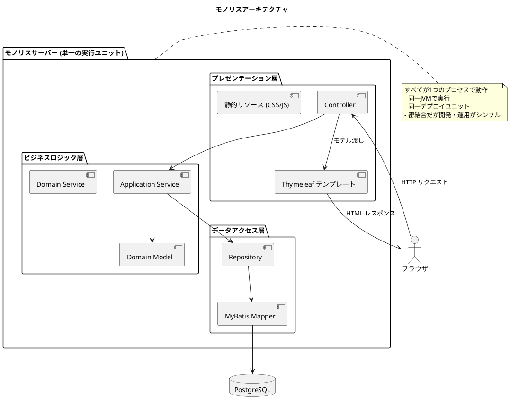
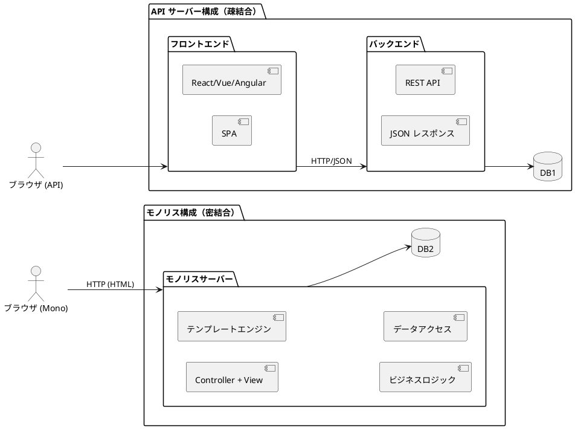
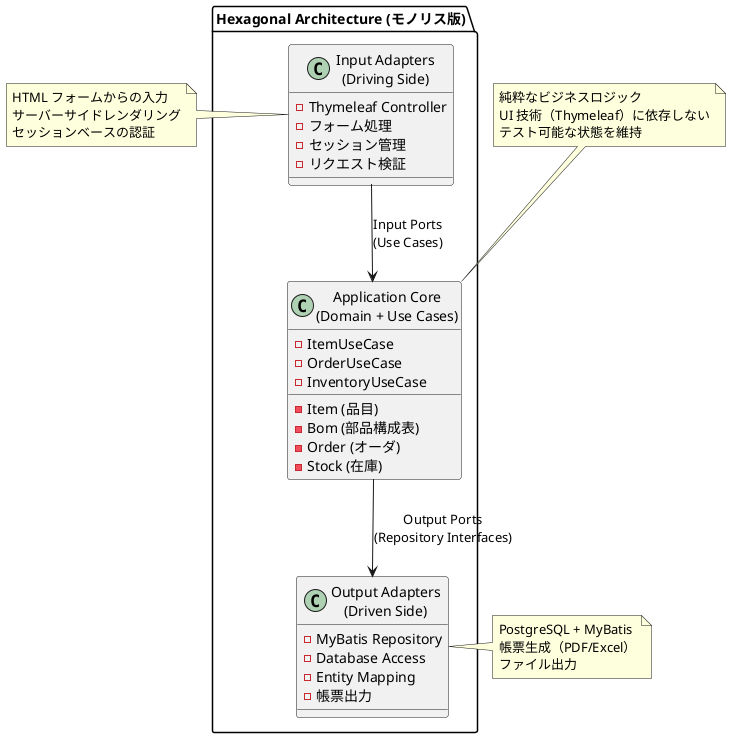
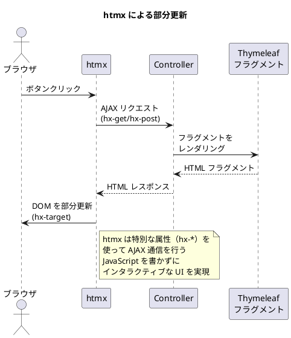

# 第33章：モノリスアーキテクチャの基礎

## 33.1 モノリスアーキテクチャとは

**モノリス（Monolith / Monolithic Architecture）**とは、「API」と「UI」と「ビジネスロジック」が **1つの実行ユニット**（1つのプロジェクトやバイナリ）にまとまっているアーキテクチャを指します。



**モノリスの主な特徴：**

| 特徴 | 説明 |
|------|------|
| **単一デプロイ** | アプリケーション全体が1つのアーティファクト（JAR/WAR）としてデプロイ |
| **同一プロセス** | UI、ビジネスロジック、データアクセスが同じ JVM で動作 |
| **テンプレートエンジン** | サーバーサイドで HTML を生成してブラウザに返却 |
| **セッション管理** | サーバーサイドでユーザーセッションを管理 |
| **トランザクション境界** | 単一プロセス内でのローカルトランザクション |

---

## 33.2 API サーバー vs モノリス



| 観点 | API サーバー構成 | モノリス構成 |
|------|-----------------|-------------|
| **結合度** | 疎結合（フロントエンドとバックエンドが分離） | 密結合（すべてが同一サーバー） |
| **フロントエンド** | SPA（React/Vue/Angular） | テンプレートエンジン（Thymeleaf） |
| **通信方式** | REST API（JSON） | サーバーサイドレンダリング（HTML） |
| **開発チーム** | フロント/バックエンドで分業可能 | フルスタックで開発 |
| **デプロイ** | 別々にデプロイ可能 | 単一アーティファクトをデプロイ |
| **スケーリング** | 個別にスケール可能 | 全体をスケール |
| **複雑さ** | API 設計・認証・CORS などが必要 | シンプル、設定が少ない |
| **初期開発速度** | 環境構築に時間がかかる | 素早く開発開始できる |
| **SEO** | SSR/SSG が必要な場合あり | サーバーサイドレンダリングで SEO フレンドリー |

### モノリスを選択すべき場面

**モノリスが適している状況：**

1. **小〜中規模のチーム**：専門のフロントエンドチームがいない場合
2. **社内システム**：SEO 不要、限られたユーザー数
3. **業務アプリケーション**：複雑な業務フローをサーバーサイドで処理
4. **迅速な開発**：MVP やプロトタイプの素早い構築
5. **運用コスト重視**：インフラ構成をシンプルに保ちたい場合

**生産管理システムにおけるモノリスのメリット：**

```
生産管理システムの特性
├── 社内利用が中心 → SEO 不要、SPA 不要
├── 複雑な業務フロー → サーバーサイドで制御が容易
├── 帳票出力 → サーバーサイドで PDF/Excel 生成
├── 大量データ処理 → MRP などバッチ処理との親和性
└── 運用担当者のスキル → シンプルな構成が望ましい
```

---

## 33.3 モノリスにおけるヘキサゴナルアーキテクチャ

モノリスであっても、ヘキサゴナルアーキテクチャ（Ports and Adapters）を採用することで、保守性の高い設計を実現できます。



**モノリスでもヘキサゴナルアーキテクチャを適用する理由：**

1. **テスト容易性**：ドメインロジックを UI から分離してテスト可能
2. **将来の移行**：必要に応じて API 層を追加可能
3. **保守性**：関心の分離により変更影響を局所化
4. **再利用性**：ドメインロジックを複数の UI で共有可能

---

## 33.4 ディレクトリ構成

```
src/main/java/com/example/pms/
├── domain/                     # ドメイン層（API版と共通）
│   ├── model/
│   │   ├── item/
│   │   ├── bom/
│   │   ├── order/
│   │   └── inventory/
│   └── exception/
│
├── application/               # アプリケーション層（API版と共通）
│   ├── port/
│   │   ├── in/               # Input Port（ユースケース）
│   │   └── out/              # Output Port（リポジトリ）
│   └── service/
│
├── infrastructure/
│   ├── config/               # 設定クラス
│   ├── in/                   # Input Adapter
│   │   ├── rest/             # REST API Controller
│   │   ├── web/              # Thymeleaf Controller
│   │   └── seed/             # シードデータ
│   └── out/
│       └── persistence/      # Output Adapter（DB実装）
│           ├── mapper/
│           ├── repository/
│           └── typehandler/
│
└── resources/
    ├── templates/            # Thymeleaf テンプレート
    │   ├── layout/           # 共通レイアウト
    │   ├── items/            # 品目マスタ画面
    │   ├── bom/              # BOM 画面
    │   ├── orders/           # オーダ画面
    │   └── inventory/        # 在庫画面
    ├── static/               # 静的リソース
    │   ├── css/
    │   ├── js/
    │   └── images/
    └── messages.properties   # メッセージリソース
```

---

## 33.5 技術スタックの導入

<details>
<summary>build.gradle.kts</summary>

```kotlin
plugins {
    id("java")
    id("org.springframework.boot") version "3.2.0"
    id("io.spring.dependency-management") version "1.1.4"
}

dependencies {
    // Spring Boot Web（REST APIではなくMVCとして使用）
    implementation("org.springframework.boot:spring-boot-starter-web")
    implementation("org.springframework.boot:spring-boot-starter-validation")

    // Thymeleaf（テンプレートエンジン）
    implementation("org.springframework.boot:spring-boot-starter-thymeleaf")
    implementation("nz.net.ultraq.thymeleaf:thymeleaf-layout-dialect:3.3.0")

    // Thymeleaf + Spring Security（認証機能を使う場合）
    implementation("org.thymeleaf.extras:thymeleaf-extras-springsecurity6")

    // htmx（モダンなインタラクティブUI）
    // CDN から読み込むため依存関係は不要

    // MyBatis
    implementation("org.mybatis.spring.boot:mybatis-spring-boot-starter:3.0.3")

    // PostgreSQL
    runtimeOnly("org.postgresql:postgresql")

    // Flyway
    implementation("org.flywaydb:flyway-core")
    implementation("org.flywaydb:flyway-database-postgresql")

    // Webjars（Bootstrap等のフロントエンドライブラリ）
    implementation("org.webjars:bootstrap:5.3.2")
    implementation("org.webjars:webjars-locator-core:0.55")

    // 帳票出力
    implementation("org.apache.poi:poi-ooxml:5.2.5")  // Excel
    implementation("com.itextpdf:itext7-core:8.0.2")  // PDF

    // Test
    testImplementation("org.springframework.boot:spring-boot-starter-test")
    testImplementation("org.testcontainers:postgresql:1.19.3")
    testImplementation("org.testcontainers:junit-jupiter:1.19.3")

    // Lombok
    compileOnly("org.projectlombok:lombok")
    annotationProcessor("org.projectlombok:lombok")
}
```

</details>

**パッケージの説明：**

| パッケージ | 用途 |
|-----------|------|
| spring-boot-starter-thymeleaf | サーバーサイドテンプレートエンジン |
| thymeleaf-layout-dialect | レイアウト継承（共通ヘッダー・フッター） |
| webjars:bootstrap | CSS フレームワーク（サーバーから配信） |
| poi-ooxml | Excel ファイル出力 |
| itext7-core | PDF ファイル出力 |

---

## 33.6 基本的な Spring Boot + Thymeleaf アプリケーション

<details>
<summary>Application.java</summary>

```java
package com.example.pms;

import org.springframework.boot.SpringApplication;
import org.springframework.boot.autoconfigure.SpringBootApplication;

@SpringBootApplication
public class Application {

    public static void main(String[] args) {
        SpringApplication.run(Application.class, args);
    }
}
```

</details>

<details>
<summary>application.yml</summary>

```yaml
spring:
  datasource:
    url: jdbc:postgresql://localhost:5432/pms
    username: postgres
    password: postgres

  thymeleaf:
    cache: false  # 開発時はキャッシュ無効
    prefix: classpath:/templates/
    suffix: .html
    encoding: UTF-8
    mode: HTML

  messages:
    basename: messages
    encoding: UTF-8

mybatis:
  mapper-locations: classpath:mapper/*.xml
  configuration:
    map-underscore-to-camel-case: true

server:
  servlet:
    session:
      timeout: 30m  # セッションタイムアウト
```

</details>

<details>
<summary>layout/default.html（共通レイアウト）</summary>

```html
<!DOCTYPE html>
<html xmlns:th="http://www.thymeleaf.org"
      xmlns:layout="http://www.ultraq.net.nz/thymeleaf/layout"
      lang="ja">
<head>
    <meta charset="UTF-8">
    <meta name="viewport" content="width=device-width, initial-scale=1.0">
    <title layout:title-pattern="$CONTENT_TITLE - $LAYOUT_TITLE">生産管理システム</title>

    <!-- Bootstrap CSS -->
    <link rel="stylesheet" th:href="@{/webjars/bootstrap/css/bootstrap.min.css}">

    <!-- カスタム CSS -->
    <link rel="stylesheet" th:href="@{/css/style.css}">

    <!-- htmx（部分更新用） -->
    <script src="https://unpkg.com/htmx.org@1.9.10"></script>
</head>
<body>
    <!-- ナビゲーションバー -->
    <nav class="navbar navbar-expand-lg navbar-dark bg-primary">
        <div class="container-fluid">
            <a class="navbar-brand" th:href="@{/}">生産管理システム</a>
            <button class="navbar-toggler" type="button" data-bs-toggle="collapse"
                    data-bs-target="#navbarNav">
                <span class="navbar-toggler-icon"></span>
            </button>
            <div class="collapse navbar-collapse" id="navbarNav">
                <ul class="navbar-nav">
                    <li class="nav-item dropdown">
                        <a class="nav-link dropdown-toggle" href="#" role="button"
                           data-bs-toggle="dropdown">マスタ</a>
                        <ul class="dropdown-menu">
                            <li><a class="dropdown-item" th:href="@{/items}">品目マスタ</a></li>
                            <li><a class="dropdown-item" th:href="@{/bom}">部品構成表</a></li>
                            <li><a class="dropdown-item" th:href="@{/suppliers}">取引先マスタ</a></li>
                            <li><a class="dropdown-item" th:href="@{/locations}">場所マスタ</a></li>
                        </ul>
                    </li>
                    <li class="nav-item dropdown">
                        <a class="nav-link dropdown-toggle" href="#" role="button"
                           data-bs-toggle="dropdown">計画</a>
                        <ul class="dropdown-menu">
                            <li><a class="dropdown-item" th:href="@{/mps}">基準生産計画</a></li>
                            <li><a class="dropdown-item" th:href="@{/mrp}">MRP実行</a></li>
                            <li><a class="dropdown-item" th:href="@{/orders}">オーダ照会</a></li>
                        </ul>
                    </li>
                    <li class="nav-item dropdown">
                        <a class="nav-link dropdown-toggle" href="#" role="button"
                           data-bs-toggle="dropdown">購買</a>
                        <ul class="dropdown-menu">
                            <li><a class="dropdown-item" th:href="@{/purchase-orders}">発注</a></li>
                            <li><a class="dropdown-item" th:href="@{/receiving}">入荷・検収</a></li>
                        </ul>
                    </li>
                    <li class="nav-item dropdown">
                        <a class="nav-link dropdown-toggle" href="#" role="button"
                           data-bs-toggle="dropdown">製造</a>
                        <ul class="dropdown-menu">
                            <li><a class="dropdown-item" th:href="@{/work-orders}">作業指示</a></li>
                            <li><a class="dropdown-item" th:href="@{/completions}">完成実績</a></li>
                            <li><a class="dropdown-item" th:href="@{/labor-hours}">工数実績</a></li>
                        </ul>
                    </li>
                    <li class="nav-item dropdown">
                        <a class="nav-link dropdown-toggle" href="#" role="button"
                           data-bs-toggle="dropdown">在庫</a>
                        <ul class="dropdown-menu">
                            <li><a class="dropdown-item" th:href="@{/inventory}">在庫照会</a></li>
                            <li><a class="dropdown-item" th:href="@{/issues}">払出</a></li>
                            <li><a class="dropdown-item" th:href="@{/stocktaking}">棚卸</a></li>
                        </ul>
                    </li>
                </ul>
            </div>
        </div>
    </nav>

    <!-- フラッシュメッセージ -->
    <div class="container mt-3">
        <div th:if="${successMessage}" class="alert alert-success alert-dismissible fade show" role="alert">
            <span th:text="${successMessage}"></span>
            <button type="button" class="btn-close" data-bs-dismiss="alert"></button>
        </div>
        <div th:if="${errorMessage}" class="alert alert-danger alert-dismissible fade show" role="alert">
            <span th:text="${errorMessage}"></span>
            <button type="button" class="btn-close" data-bs-dismiss="alert"></button>
        </div>
    </div>

    <!-- メインコンテンツ -->
    <main class="container mt-4">
        <div layout:fragment="content">
            <!-- 各ページのコンテンツがここに挿入される -->
        </div>
    </main>

    <!-- フッター -->
    <footer class="footer mt-5 py-3 bg-light">
        <div class="container text-center">
            <span class="text-muted">生産管理システム &copy; 2025</span>
        </div>
    </footer>

    <!-- Bootstrap JS -->
    <script th:src="@{/webjars/bootstrap/js/bootstrap.bundle.min.js}"></script>

    <!-- ページ固有のスクリプト -->
    <th:block layout:fragment="scripts"></th:block>
</body>
</html>
```

</details>

<details>
<summary>HomeController.java</summary>

```java
package com.example.pms.infrastructure.in.web;

import org.springframework.stereotype.Controller;
import org.springframework.ui.Model;
import org.springframework.web.bind.annotation.GetMapping;

import java.time.LocalDate;

/**
 * ホーム画面 Controller.
 */
@Controller
public class HomeController {

    /**
     * ホーム画面を表示.
     *
     * @param model モデル
     * @return テンプレート名
     */
    @GetMapping("/")
    public String home(Model model) {
        LocalDate today = LocalDate.now();
        model.addAttribute("currentDate", today);
        return "index";
    }
}
```

</details>

<details>
<summary>templates/index.html</summary>

```html
<!DOCTYPE html>
<html xmlns:th="http://www.thymeleaf.org"
      xmlns:layout="http://www.ultraq.net.nz/thymeleaf/layout"
      layout:decorate="~{layout/default}"
      lang="ja">
<head>
    <title>ホーム</title>
</head>
<body>
    <div layout:fragment="content">
        <!-- ページタイトル -->
        <div class="d-flex justify-content-between align-items-center mb-4">
            <h1>ダッシュボード</h1>
            <span class="text-muted"
                  th:text="${#temporals.format(currentDate, 'yyyy年MM月dd日 (E)')}">
                2025年01月11日 (土)
            </span>
        </div>

        <!-- クイックアクセス -->
        <div class="row mb-4">
            <div class="col-12">
                <h5 class="mb-3">クイックアクセス</h5>
            </div>
            <div class="col-md-3 col-sm-6 mb-3">
                <a th:href="@{/items}" class="card text-decoration-none h-100">
                    <div class="card-body text-center">
                        <i class="bi bi-box-seam fs-1 text-success mb-2"></i>
                        <h6 class="card-title">品目マスタ</h6>
                        <p class="card-text text-muted small">製品・部品・材料の管理</p>
                    </div>
                </a>
            </div>
            <div class="col-md-3 col-sm-6 mb-3">
                <a th:href="@{/bom}" class="card text-decoration-none h-100">
                    <div class="card-body text-center">
                        <i class="bi bi-diagram-3 fs-1 text-primary mb-2"></i>
                        <h6 class="card-title">部品構成表</h6>
                        <p class="card-text text-muted small">BOM管理</p>
                    </div>
                </a>
            </div>
            <div class="col-md-3 col-sm-6 mb-3">
                <a th:href="@{/orders}" class="card text-decoration-none h-100">
                    <div class="card-body text-center">
                        <i class="bi bi-clipboard-data fs-1 text-warning mb-2"></i>
                        <h6 class="card-title">オーダ一覧</h6>
                        <p class="card-text text-muted small">製造・購買オーダ管理</p>
                    </div>
                </a>
            </div>
            <div class="col-md-3 col-sm-6 mb-3">
                <a th:href="@{/stocks}" class="card text-decoration-none h-100">
                    <div class="card-body text-center">
                        <i class="bi bi-archive fs-1 text-success mb-2"></i>
                        <h6 class="card-title">在庫照会</h6>
                        <p class="card-text text-muted small">在庫数量・状態の確認</p>
                    </div>
                </a>
            </div>
        </div>

        <!-- システム情報 -->
        <div class="row">
            <div class="col-12">
                <div class="card">
                    <div class="card-header">
                        <h6 class="mb-0">システム情報</h6>
                    </div>
                    <div class="card-body">
                        <table class="table table-sm mb-0">
                            <tr>
                                <th style="width: 200px;">アプリケーション</th>
                                <td>生産管理システム (PMS)</td>
                            </tr>
                            <tr>
                                <th>アーキテクチャ</th>
                                <td>モノリス（Spring Boot + Thymeleaf）</td>
                            </tr>
                        </table>
                    </div>
                </div>
            </div>
        </div>
    </div>
</body>
</html>
```

</details>

---

## 33.7 htmx による部分更新

モノリスアプリケーションでも、**htmx** を使用することで SPA のような操作性を実現できます。ページ全体をリロードせず、必要な部分だけを更新します。



<details>
<summary>htmx による品目検索（部分更新）</summary>

```html
<!-- 品目検索（部分更新） -->
<div class="mb-3">
    <input type="text"
           class="form-control"
           name="keyword"
           placeholder="品目コードまたは品名で検索"
           hx-get="/items/search"
           hx-trigger="keyup changed delay:300ms"
           hx-target="#search-results"
           hx-indicator="#loading">
    <span id="loading" class="htmx-indicator">検索中...</span>
</div>

<!-- 検索結果がここに挿入される -->
<div id="search-results">
    <!-- Controller から返される HTML フラグメント -->
</div>
```

</details>

<details>
<summary>検索エンドポイント（htmx 用 Controller）</summary>

```java
@Controller
@RequestMapping("/items")
public class ItemController {

    private final ItemUseCase itemUseCase;

    // ... コンストラクタ省略

    /**
     * htmx 用の検索エンドポイント（フラグメントを返す）
     */
    @GetMapping("/search")
    public String search(
            @RequestParam(required = false) String keyword,
            Model model) {

        List<Item> items = itemUseCase.searchItems(keyword);
        model.addAttribute("items", items);

        // フラグメントのみを返す
        return "items/search-results :: results";
    }
}
```

</details>

<details>
<summary>items/search-results.html（検索結果フラグメント）</summary>

```html
<!DOCTYPE html>
<html xmlns:th="http://www.thymeleaf.org">
<!-- フラグメント定義 -->
<div th:fragment="results">
    <table class="table table-striped" th:if="${not #lists.isEmpty(items)}">
        <thead>
            <tr>
                <th>品目コード</th>
                <th>品名</th>
                <th>品目区分</th>
                <th>操作</th>
            </tr>
        </thead>
        <tbody>
            <tr th:each="item : ${items}">
                <td th:text="${item.itemCode}"></td>
                <td th:text="${item.itemName}"></td>
                <td th:text="${item.category.displayName}"></td>
                <td>
                    <a th:href="@{/items/{code}(code=${item.itemCode})}"
                       class="btn btn-sm btn-primary">詳細</a>
                    <button class="btn btn-sm btn-danger"
                            hx-delete="/items/{code}"
                            th:attr="hx-delete=@{/items/{code}(code=${item.itemCode})}"
                            hx-confirm="本当に削除しますか？"
                            hx-target="closest tr"
                            hx-swap="outerHTML">削除</button>
                </td>
            </tr>
        </tbody>
    </table>
    <div th:if="${#lists.isEmpty(items)}" class="alert alert-info">
        該当する品目が見つかりませんでした。
    </div>
</div>
</html>
```

</details>

---

## 33.8 API サーバー版との Controller の違い

### API サーバー版（REST Controller）

<details>
<summary>ItemApiController.java（API サーバー版）</summary>

```java
@RestController  // JSON を返す
@RequestMapping("/api/items")
public class ItemApiController {

    @GetMapping
    public ResponseEntity<List<ItemResponse>> getAllItems() {
        List<Item> items = itemUseCase.getAllItems();
        return ResponseEntity.ok(items.stream()
            .map(ItemResponse::from)
            .toList());
    }

    @PostMapping
    public ResponseEntity<ItemResponse> createItem(
            @Valid @RequestBody CreateItemRequest request) {  // JSON リクエスト
        Item item = itemUseCase.createItem(request.toCommand());
        return ResponseEntity.status(HttpStatus.CREATED)
            .body(ItemResponse.from(item));
    }
}
```

</details>

### モノリス版（MVC Controller）

<details>
<summary>ItemController.java（モノリス版）</summary>

```java
@Controller  // HTML を返す
@RequestMapping("/items")
public class ItemController {

    @GetMapping
    public String list(Model model) {
        List<Item> items = itemUseCase.getAllItems();
        model.addAttribute("items", items);
        return "items/list";  // Thymeleaf テンプレート
    }

    @PostMapping
    public String create(
            @Valid @ModelAttribute("form") ItemForm form,  // フォームデータ
            BindingResult bindingResult,
            RedirectAttributes redirectAttributes) {

        if (bindingResult.hasErrors()) {
            return "items/new";  // バリデーションエラー時は入力画面に戻る
        }

        itemUseCase.createItem(form.toCommand());
        redirectAttributes.addFlashAttribute("successMessage", "品目を登録しました");
        return "redirect:/items";  // PRG パターン
    }
}
```

</details>

**主な違い：**

| 観点 | API サーバー版 | モノリス版 |
|------|--------------|-----------|
| アノテーション | `@RestController` | `@Controller` |
| 戻り値 | `ResponseEntity<T>` | テンプレート名（String） |
| リクエスト | `@RequestBody`（JSON） | `@ModelAttribute`（フォーム） |
| バリデーション | 例外ハンドラで処理 | `BindingResult` で処理 |
| レスポンス | JSON | HTML（Thymeleaf） |
| リダイレクト | 不要 | PRG パターン |

---

## 33.9 まとめ

モノリスアーキテクチャは、以下の場合に適した選択肢です：

1. **社内業務システム**：生産管理、販売管理、在庫管理など
2. **小〜中規模チーム**：フルスタックで開発できる体制
3. **迅速な開発**：MVP やプロトタイプを素早く構築
4. **運用コスト重視**：インフラ構成をシンプルに維持

ヘキサゴナルアーキテクチャを採用することで、モノリスでも保守性の高い設計を実現できます。また、htmx を活用すれば、SPA のようなインタラクティブな操作性も実現可能です。

次章では、このモノリスアーキテクチャを基にマスタ画面の実装を進めます。
