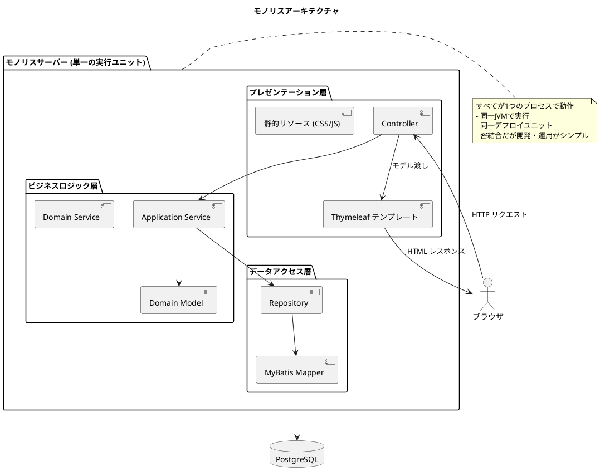
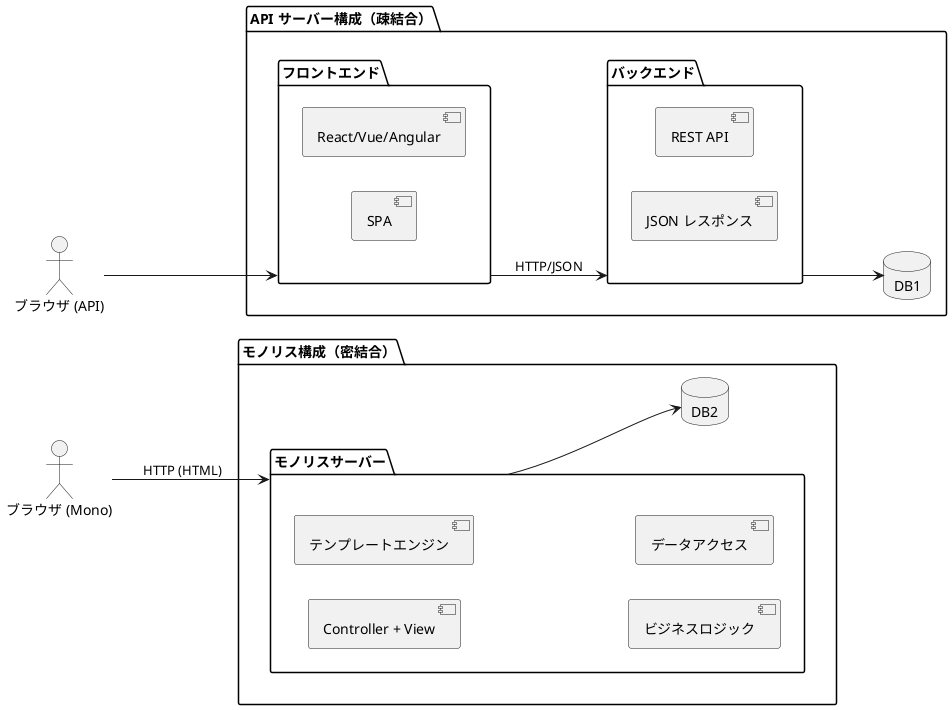
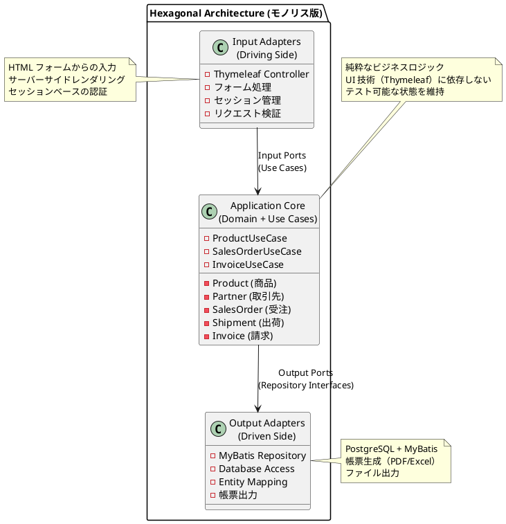
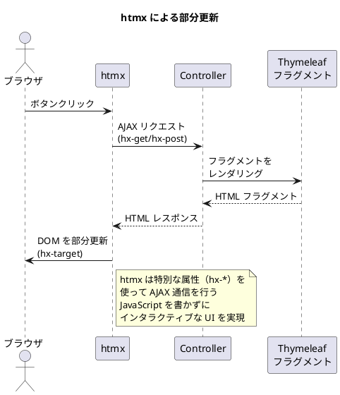
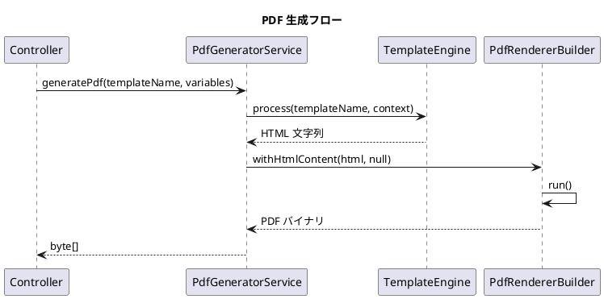
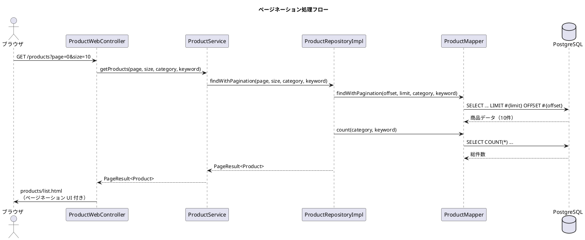
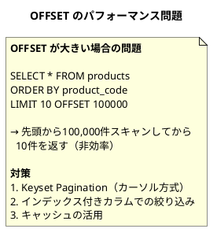

# 実践データベース設計：販売管理システム 研究 1 - モノリスサービスの実装

## はじめに

本研究では、API サーバー構成（第13章）とは異なるアプローチとして、**モノリスアーキテクチャ**による販売管理システムを実装します。UI（テンプレートエンジン）、ビジネスロジック、データベースアクセスがすべて同一サーバー内で動作する、伝統的かつ堅実なアーキテクチャです。

---

## 第14章：モノリスアーキテクチャの基礎

### 14.1 モノリスアーキテクチャとは

**モノリス（Monolith / Monolithic Architecture）**とは、「API」と「UI」と「ビジネスロジック」が **1つの実行ユニット**（1つのプロジェクトやバイナリ）にまとまっているアーキテクチャを指します。



**モノリスの主な特徴：**

| 特徴 | 説明 |
|------|------|
| **単一デプロイ** | アプリケーション全体が1つのアーティファクト（JAR/WAR）としてデプロイ |
| **同一プロセス** | UI、ビジネスロジック、データアクセスが同じ JVM で動作 |
| **テンプレートエンジン** | サーバーサイドで HTML を生成してブラウザに返却 |
| **セッション管理** | サーバーサイドでユーザーセッションを管理 |
| **トランザクション境界** | 単一プロセス内でのローカルトランザクション |

---

### 14.2 API サーバー vs モノリス



| 観点 | API サーバー構成 | モノリス構成 |
|------|-----------------|-------------|
| **結合度** | 疎結合（フロントエンドとバックエンドが分離） | 密結合（すべてが同一サーバー） |
| **フロントエンド** | SPA（React/Vue/Angular） | テンプレートエンジン（Thymeleaf） |
| **通信方式** | REST API（JSON） | サーバーサイドレンダリング（HTML） |
| **開発チーム** | フロント/バックエンドで分業可能 | フルスタックで開発 |
| **デプロイ** | 別々にデプロイ可能 | 単一アーティファクトをデプロイ |
| **スケーリング** | 個別にスケール可能 | 全体をスケール |
| **複雑さ** | API 設計・認証・CORS などが必要 | シンプル、設定が少ない |
| **初期開発速度** | 環境構築に時間がかかる | 素早く開発開始できる |
| **SEO** | SSR/SSG が必要な場合あり | サーバーサイドレンダリングで SEO フレンドリー |

### 14.3 モノリスを選択すべき場面

**モノリスが適している状況：**

1. **小〜中規模のチーム**：専門のフロントエンドチームがいない場合
2. **社内システム**：SEO 不要、限られたユーザー数
3. **業務アプリケーション**：複雑な業務フローをサーバーサイドで処理
4. **迅速な開発**：MVP やプロトタイプの素早い構築
5. **運用コスト重視**：インフラ構成をシンプルに保ちたい場合

---

### 14.4 モノリスにおけるヘキサゴナルアーキテクチャ

モノリスであっても、ヘキサゴナルアーキテクチャ（Ports and Adapters）を採用することで、保守性の高い設計を実現できます。



---

### 14.5 ディレクトリ構成

```
apps/sms/backend/src/main/java/com/example/sms/
├── domain/                       # ドメイン層（API版と共通）
│   ├── model/
│   │   ├── product/
│   │   ├── partner/
│   │   ├── sales/
│   │   ├── shipping/
│   │   ├── invoice/
│   │   └── receipt/
│   └── exception/
│
├── application/                  # アプリケーション層（API版と共通）
│   ├── port/
│   │   ├── in/                  # Input Port（ユースケース）
│   │   └── out/                 # Output Port（リポジトリ）
│   └── service/
│
├── infrastructure/
│   ├── out/
│   │   └── persistence/         # Output Adapter（DB実装）
│   │       ├── mapper/
│   │       ├── repository/
│   │       └── typehandler/
│   └── in/
│       └── web/                 # Input Adapter（Web実装）
│           ├── controller/      # Thymeleaf Controller
│           ├── form/            # フォームオブジェクト
│           └── helper/          # ビューヘルパー
│
└── config/

apps/sms/backend/src/main/resources/
├── templates/                    # Thymeleaf テンプレート
│   ├── layout/                   # 共通レイアウト
│   ├── products/                 # 商品マスタ画面
│   ├── partners/                 # 取引先マスタ画面
│   ├── orders/                   # 受注画面
│   ├── shipments/                # 出荷画面
│   └── invoices/                 # 請求画面
├── static/                       # 静的リソース
│   ├── css/
│   ├── js/
│   └── images/
├── mapper/                       # MyBatis Mapper XML
└── messages.properties           # メッセージリソース
```

---

### 14.6 技術スタックの導入

#### build.gradle.kts

<details>
<summary>コード例: build.gradle.kts</summary>

```kotlin
plugins {
    id("java")
    id("org.springframework.boot") version "3.4.1"
    id("io.spring.dependency-management") version "1.1.7"
}

java {
    toolchain {
        languageVersion = JavaLanguageVersion.of(21)
    }
}

dependencies {
    // Spring Boot Web（REST APIではなくMVCとして使用）
    implementation("org.springframework.boot:spring-boot-starter-web")
    implementation("org.springframework.boot:spring-boot-starter-validation")

    // Thymeleaf（テンプレートエンジン）
    implementation("org.springframework.boot:spring-boot-starter-thymeleaf")
    implementation("nz.net.ultraq.thymeleaf:thymeleaf-layout-dialect:3.4.0")

    // htmx（モダンなインタラクティブUI）
    // CDN から読み込むため依存関係は不要

    // MyBatis
    implementation("org.mybatis.spring.boot:mybatis-spring-boot-starter:3.0.4")

    // PostgreSQL
    runtimeOnly("org.postgresql:postgresql")

    // Flyway
    implementation("org.flywaydb:flyway-core")
    implementation("org.flywaydb:flyway-database-postgresql")

    // Webjars（Bootstrap等のフロントエンドライブラリ）
    implementation("org.webjars:bootstrap:5.3.3")
    implementation("org.webjars:webjars-locator-core:0.59")

    // 帳票出力
    implementation("org.apache.poi:poi-ooxml:5.3.0")  // Excel
    implementation("io.github.openhtmltopdf:openhtmltopdf-pdfbox:1.1.22")  // PDF（Thymeleaf + HTML/CSS）
    implementation("io.github.openhtmltopdf:openhtmltopdf-slf4j:1.1.22")

    // Test
    testImplementation("org.springframework.boot:spring-boot-starter-test")
    testImplementation("org.testcontainers:postgresql:1.20.4")
    testImplementation("org.testcontainers:junit-jupiter:1.20.4")

    // Lombok
    compileOnly("org.projectlombok:lombok")
    annotationProcessor("org.projectlombok:lombok")
}
```

</details>

---

### 14.7 共通レイアウト（layout/default.html）

<details>
<summary>コード例: layout/default.html</summary>

```html
<!DOCTYPE html>
<html xmlns:th="http://www.thymeleaf.org"
      xmlns:layout="http://www.ultraq.net.nz/thymeleaf/layout"
      lang="ja">
<head>
    <meta charset="UTF-8">
    <meta name="viewport" content="width=device-width, initial-scale=1.0">
    <title layout:title-pattern="$CONTENT_TITLE - $LAYOUT_TITLE">販売管理システム</title>

    <!-- Bootstrap CSS -->
    <link rel="stylesheet" th:href="@{/webjars/bootstrap/css/bootstrap.min.css}">

    <!-- カスタム CSS -->
    <link rel="stylesheet" th:href="@{/css/style.css}">

    <!-- htmx（部分更新用） -->
    <script src="https://unpkg.com/htmx.org@1.9.12"></script>
</head>
<body>
    <!-- ナビゲーションバー -->
    <nav class="navbar navbar-expand-lg navbar-dark bg-primary">
        <div class="container-fluid">
            <a class="navbar-brand" th:href="@{/}">販売管理システム</a>
            <div class="collapse navbar-collapse" id="navbarNav">
                <ul class="navbar-nav">
                    <li class="nav-item dropdown">
                        <a class="nav-link dropdown-toggle" href="#" data-bs-toggle="dropdown">マスタ</a>
                        <ul class="dropdown-menu">
                            <li><a class="dropdown-item" th:href="@{/products}">商品マスタ</a></li>
                            <li><a class="dropdown-item" th:href="@{/partners}">取引先マスタ</a></li>
                        </ul>
                    </li>
                    <li class="nav-item dropdown">
                        <a class="nav-link dropdown-toggle" href="#" data-bs-toggle="dropdown">販売</a>
                        <ul class="dropdown-menu">
                            <li><a class="dropdown-item" th:href="@{/orders}">受注</a></li>
                            <li><a class="dropdown-item" th:href="@{/shipments}">出荷</a></li>
                        </ul>
                    </li>
                    <li class="nav-item dropdown">
                        <a class="nav-link dropdown-toggle" href="#" data-bs-toggle="dropdown">債権</a>
                        <ul class="dropdown-menu">
                            <li><a class="dropdown-item" th:href="@{/invoices}">請求</a></li>
                            <li><a class="dropdown-item" th:href="@{/receipts}">入金</a></li>
                        </ul>
                    </li>
                </ul>
            </div>
        </div>
    </nav>

    <!-- フラッシュメッセージ -->
    <div class="container mt-3">
        <div th:if="${successMessage}" class="alert alert-success alert-dismissible fade show">
            <span th:text="${successMessage}"></span>
            <button type="button" class="btn-close" data-bs-dismiss="alert"></button>
        </div>
        <div th:if="${errorMessage}" class="alert alert-danger alert-dismissible fade show">
            <span th:text="${errorMessage}"></span>
            <button type="button" class="btn-close" data-bs-dismiss="alert"></button>
        </div>
    </div>

    <!-- メインコンテンツ -->
    <main class="container mt-4">
        <div layout:fragment="content"></div>
    </main>

    <!-- Bootstrap JS -->
    <script th:src="@{/webjars/bootstrap/js/bootstrap.bundle.min.js}"></script>
    <th:block layout:fragment="scripts"></th:block>
</body>
</html>
```

</details>

---

### 14.8 htmx による部分更新

モノリスアプリケーションでも、**htmx** を使用することで SPA のような操作性を実現できます。



#### htmx の基本的な使い方

<details>
<summary>コード例: htmx による商品検索</summary>

```html
<!-- 商品検索（部分更新） -->
<input type="text" class="form-control"
       hx-get="/products/search"
       hx-trigger="keyup changed delay:300ms"
       hx-target="#search-results"
       hx-indicator="#loading">
<span id="loading" class="htmx-indicator">検索中...</span>

<div id="search-results">
    <!-- Controller から返される HTML フラグメント -->
</div>
```

</details>

---

## 第15章：マスタの実装

### 15.1 商品マスタ画面の設計

| 画面 | URL | メソッド | 説明 |
|------|-----|---------|------|
| 商品一覧 | /products | GET | 商品の検索・一覧表示 |
| 商品詳細 | /products/{productCode} | GET | 商品の詳細表示 |
| 商品登録 | /products/new | GET | 登録フォーム表示 |
| 商品登録処理 | /products | POST | 登録処理 |
| 商品編集 | /products/{productCode}/edit | GET | 編集フォーム表示 |
| 商品更新処理 | /products/{productCode} | POST | 更新処理（PUT 代替） |
| 商品削除処理 | /products/{productCode}/delete | POST | 削除処理（DELETE 代替） |

### 15.2 フォームオブジェクトの設計

<details>
<summary>コード例: ProductForm.java</summary>

```java
package com.example.sms.infrastructure.in.web.form;

import com.example.sms.application.port.in.CreateProductCommand;
import com.example.sms.domain.model.product.ProductCategory;
import jakarta.validation.constraints.NotBlank;
import jakarta.validation.constraints.NotNull;
import jakarta.validation.constraints.Positive;
import jakarta.validation.constraints.Size;
import lombok.Data;

import java.math.BigDecimal;

/**
 * 商品登録・編集フォーム
 */
@Data
public class ProductForm {

    @NotBlank(message = "商品コードは必須です")
    @Size(max = 20, message = "商品コードは20文字以内で入力してください")
    private String productCode;

    @NotBlank(message = "商品名は必須です")
    @Size(max = 100, message = "商品名は100文字以内で入力してください")
    private String productName;

    @NotNull(message = "商品区分は必須です")
    private ProductCategory category;

    @Positive(message = "単価は正の数で入力してください")
    private BigDecimal unitPrice;

    /**
     * フォームをコマンドに変換
     */
    public CreateProductCommand toCommand() {
        return CreateProductCommand.builder()
            .productCode(this.productCode)
            .productName(this.productName)
            .category(this.category)
            .unitPrice(this.unitPrice)
            .build();
    }

    /**
     * エンティティからフォームを生成
     */
    public static ProductForm from(Product product) {
        ProductForm form = new ProductForm();
        form.setProductCode(product.getProductCode());
        form.setProductName(product.getProductName());
        form.setCategory(product.getCategory());
        form.setUnitPrice(product.getUnitPrice());
        return form;
    }
}
```

</details>

### 15.3 商品 Controller の TDD 実装

<details>
<summary>コード例: ProductControllerTest.java</summary>

```java
@SpringBootTest
@AutoConfigureMockMvc
@Testcontainers
@DisplayName("商品マスタ画面")
class ProductControllerTest {

    @Container
    static PostgreSQLContainer<?> postgres = new PostgreSQLContainer<>("postgres:16")
            .withDatabaseName("sms_test");

    @DynamicPropertySource
    static void configureProperties(DynamicPropertyRegistry registry) {
        registry.add("spring.datasource.url", postgres::getJdbcUrl);
    }

    @Autowired
    private MockMvc mockMvc;

    @Test
    @DisplayName("商品一覧画面を表示できる")
    void shouldDisplayProductList() throws Exception {
        mockMvc.perform(get("/products"))
            .andExpect(status().isOk())
            .andExpect(view().name("products/list"))
            .andExpect(model().attributeExists("products"));
    }

    @Test
    @DisplayName("商品を登録できる")
    void shouldCreateProduct() throws Exception {
        mockMvc.perform(post("/products")
                .param("productCode", "NEW-001")
                .param("productName", "新規商品")
                .param("category", "FINISHED_GOODS")
                .param("unitPrice", "1000"))
            .andExpect(status().is3xxRedirection())
            .andExpect(redirectedUrl("/products"))
            .andExpect(flash().attribute("successMessage", containsString("登録")));
    }
}
```

</details>

### 15.4 商品 Controller

<details>
<summary>コード例: ProductController.java</summary>

```java
@Controller
@RequestMapping("/products")
public class ProductController {

    private final ProductUseCase productUseCase;

    public ProductController(ProductUseCase productUseCase) {
        this.productUseCase = productUseCase;
    }

    @GetMapping
    public String list(@RequestParam(required = false) ProductCategory category, Model model) {
        List<Product> products = category != null
            ? productUseCase.findByCategory(category)
            : productUseCase.findAll();
        model.addAttribute("products", products);
        model.addAttribute("categories", ProductCategory.values());
        return "products/list";
    }

    @GetMapping("/new")
    public String newForm(Model model) {
        model.addAttribute("form", new ProductForm());
        model.addAttribute("categories", ProductCategory.values());
        return "products/new";
    }

    @PostMapping
    public String create(
            @Valid @ModelAttribute("form") ProductForm form,
            BindingResult bindingResult,
            RedirectAttributes redirectAttributes,
            Model model) {

        if (bindingResult.hasErrors()) {
            model.addAttribute("categories", ProductCategory.values());
            return "products/new";
        }

        productUseCase.createProduct(form.toCommand());
        redirectAttributes.addFlashAttribute("successMessage", "商品を登録しました");
        return "redirect:/products";
    }

    @GetMapping("/{productCode}/edit")
    public String editForm(@PathVariable String productCode, Model model) {
        Product product = productUseCase.findByCode(productCode)
            .orElseThrow(() -> new ProductNotFoundException(productCode));
        model.addAttribute("form", ProductForm.from(product));
        model.addAttribute("categories", ProductCategory.values());
        return "products/edit";
    }

    @PostMapping("/{productCode}")
    public String update(
            @PathVariable String productCode,
            @Valid @ModelAttribute("form") ProductForm form,
            BindingResult bindingResult,
            RedirectAttributes redirectAttributes,
            Model model) {

        if (bindingResult.hasErrors()) {
            model.addAttribute("categories", ProductCategory.values());
            return "products/edit";
        }

        productUseCase.updateProduct(productCode, form.toCommand());
        redirectAttributes.addFlashAttribute("successMessage", "商品を更新しました");
        return "redirect:/products/" + productCode;
    }

    @PostMapping("/{productCode}/delete")
    public String delete(@PathVariable String productCode, RedirectAttributes redirectAttributes) {
        productUseCase.deleteProduct(productCode);
        redirectAttributes.addFlashAttribute("successMessage", "商品を削除しました");
        return "redirect:/products";
    }
}
```

</details>

---

## 第16章：トランザクションの実装

### 16.1 受注業務画面の実装

#### 受注 Controller

<details>
<summary>コード例: OrderController.java</summary>

```java
@Controller
@RequestMapping("/orders")
public class OrderController {

    private final OrderUseCase orderUseCase;
    private final ProductUseCase productUseCase;
    private final PartnerUseCase partnerUseCase;

    @GetMapping
    public String list(
            @RequestParam(required = false) String status,
            @RequestParam(required = false) String customerCode,
            Model model) {

        List<Order> orders = orderUseCase.getOrders(status, customerCode);
        model.addAttribute("orders", orders);
        model.addAttribute("customers", partnerUseCase.getCustomers());
        return "orders/list";
    }

    @GetMapping("/new")
    public String newForm(Model model) {
        model.addAttribute("form", new OrderForm());
        model.addAttribute("customers", partnerUseCase.getCustomers());
        model.addAttribute("products", productUseCase.getAllProducts());
        return "orders/new";
    }

    @PostMapping
    public String create(
            @Valid @ModelAttribute("form") OrderForm form,
            BindingResult bindingResult,
            Model model,
            RedirectAttributes redirectAttributes) {

        if (bindingResult.hasErrors()) {
            model.addAttribute("customers", partnerUseCase.getCustomers());
            model.addAttribute("products", productUseCase.getAllProducts());
            return "orders/new";
        }

        Order order = orderUseCase.createOrder(form.toCommand());
        redirectAttributes.addFlashAttribute("successMessage",
            "受注「" + order.getOrderNumber() + "」を登録しました");
        return "redirect:/orders";
    }

    @PostMapping("/{orderNumber}/confirm")
    public String confirm(@PathVariable String orderNumber, RedirectAttributes redirectAttributes) {
        orderUseCase.confirmOrder(orderNumber);
        redirectAttributes.addFlashAttribute("successMessage",
            "受注「" + orderNumber + "」を確定しました");
        return "redirect:/orders/" + orderNumber;
    }

    @PostMapping("/{orderNumber}/cancel")
    public String cancel(@PathVariable String orderNumber, RedirectAttributes redirectAttributes) {
        orderUseCase.cancelOrder(orderNumber);
        redirectAttributes.addFlashAttribute("successMessage",
            "受注「" + orderNumber + "」を取り消しました");
        return "redirect:/orders";
    }
}
```

</details>

### 16.2 動的フォーム（明細行の追加・削除）

htmx を使用して、ページをリロードせずに明細行を追加・削除できます。

<details>
<summary>コード例: 動的フォーム（明細行）</summary>

```html
<!-- 明細追加ボタン -->
<button type="button" class="btn btn-sm btn-outline-primary"
        hx-get="/orders/add-detail-row"
        hx-target="#detail-rows"
        hx-swap="beforeend"
        hx-vals='js:{"index": document.querySelectorAll("#detail-rows tr").length}'>
    <i class="bi bi-plus"></i> 行追加
</button>

<!-- 明細行フラグメント -->
<tr th:fragment="detailRow" th:id="'row-' + ${index}">
    <td>
        <select class="form-select product-select"
                th:name="'details[' + ${index} + '].productCode'" required
                onchange="updatePrice(this)">
            <option value="">選択</option>
            <option th:each="product : ${products}"
                    th:value="${product.productCode}"
                    th:text="${product.productCode + ' - ' + product.productName}"
                    th:data-price="${product.unitPrice}"></option>
        </select>
    </td>
    <td>
        <input type="number" class="form-control quantity-input"
               th:name="'details[' + ${index} + '].quantity'" min="1" value="1" required
               onchange="calculateAmount(this)">
    </td>
    <td>
        <input type="number" class="form-control price-input"
               th:name="'details[' + ${index} + '].unitPrice'" step="1" min="0"
               onchange="calculateAmount(this)">
    </td>
    <td>
        <input type="text" class="form-control amount-display" readonly value="0">
    </td>
    <td>
        <button type="button" class="btn btn-sm btn-outline-danger"
                onclick="this.closest('tr').remove(); calculateTotal()">削除</button>
    </td>
</tr>
```

</details>

### 16.3 出荷業務画面の実装

<details>
<summary>コード例: ShipmentController.java</summary>

```java
@Controller
@RequestMapping("/shipments")
public class ShipmentController {

    private final ShipmentUseCase shipmentUseCase;
    private final OrderUseCase orderUseCase;

    @GetMapping
    public String list(
            @RequestParam(required = false) String status,
            @RequestParam(required = false) @DateTimeFormat(iso = DateTimeFormat.ISO.DATE) LocalDate shipmentDate,
            Model model) {

        List<Shipment> shipments = shipmentDate != null
            ? shipmentUseCase.getShipmentsByDate(shipmentDate)
            : shipmentUseCase.getShipments(status);

        model.addAttribute("shipments", shipments);
        model.addAttribute("today", LocalDate.now());
        return "shipments/list";
    }

    @PostMapping("/{shipmentNumber}/execute")
    public String execute(@PathVariable String shipmentNumber, RedirectAttributes redirectAttributes) {
        try {
            shipmentUseCase.executeShipment(shipmentNumber);
            redirectAttributes.addFlashAttribute("successMessage",
                "出荷「" + shipmentNumber + "」を実行しました");
        } catch (InsufficientInventoryException e) {
            redirectAttributes.addFlashAttribute("errorMessage",
                "在庫不足のため出荷できません: " + e.getMessage());
        }
        return "redirect:/shipments/" + shipmentNumber;
    }
}
```

</details>

---

## 第17章：エラーハンドリングと帳票出力

### 17.1 グローバル例外ハンドラ

<details>
<summary>コード例: GlobalExceptionHandler.java</summary>

```java
@ControllerAdvice
public class GlobalExceptionHandler {

    private static final Logger logger = LoggerFactory.getLogger(GlobalExceptionHandler.class);

    /**
     * 業務エラー（リソース未検出）
     */
    @ExceptionHandler(ResourceNotFoundException.class)
    public String handleResourceNotFound(ResourceNotFoundException ex, Model model) {
        logger.warn("リソース未検出: {}", ex.getMessage());
        model.addAttribute("errorMessage", ex.getMessage());
        return "error/404";
    }

    /**
     * 業務エラー（バリデーション）
     */
    @ExceptionHandler(BusinessValidationException.class)
    public String handleBusinessValidation(BusinessValidationException ex, Model model) {
        logger.warn("業務バリデーションエラー: {}", ex.getMessage());
        model.addAttribute("errorMessage", ex.getMessage());
        model.addAttribute("errorCode", ex.getErrorCode());
        return "error/business";
    }

    /**
     * システムエラー
     */
    @ExceptionHandler(Exception.class)
    public String handleGeneralException(Exception ex, Model model) {
        logger.error("システムエラー", ex);
        model.addAttribute("errorMessage", "システムエラーが発生しました。管理者にお問い合わせください。");
        return "error/500";
    }
}
```

</details>

### 17.2 Excel 帳票出力

<details>
<summary>コード例: ReportController.java（Excel 出力）</summary>

```java
@Controller
@RequestMapping("/reports")
public class ReportController {

    private final ReportUseCase reportUseCase;

    @GetMapping("/inventory/excel")
    public void exportInventoryExcel(HttpServletResponse response) throws IOException {
        response.setContentType("application/vnd.openxmlformats-officedocument.spreadsheetml.sheet");
        response.setHeader("Content-Disposition",
            "attachment; filename=inventory_" + LocalDate.now() + ".xlsx");

        try (Workbook workbook = new XSSFWorkbook()) {
            Sheet sheet = workbook.createSheet("在庫一覧");

            // ヘッダー行
            Row headerRow = sheet.createRow(0);
            CellStyle headerStyle = createHeaderStyle(workbook);
            String[] headers = {"商品コード", "商品名", "現在在庫", "安全在庫", "過不足"};
            for (int i = 0; i < headers.length; i++) {
                Cell cell = headerRow.createCell(i);
                cell.setCellValue(headers[i]);
                cell.setCellStyle(headerStyle);
            }

            // データ行
            List<InventoryData> inventoryList = reportUseCase.getInventoryReport();
            int rowNum = 1;
            for (InventoryData data : inventoryList) {
                Row row = sheet.createRow(rowNum++);
                row.createCell(0).setCellValue(data.getProductCode());
                row.createCell(1).setCellValue(data.getProductName());
                row.createCell(2).setCellValue(data.getCurrentStock());
                row.createCell(3).setCellValue(data.getSafetyStock());
                row.createCell(4).setCellValue(data.getDifference());
            }

            // 列幅自動調整
            for (int i = 0; i < headers.length; i++) {
                sheet.autoSizeColumn(i);
            }

            workbook.write(response.getOutputStream());
        }
    }
}
```

</details>

### 17.3 PDF 帳票出力（Thymeleaf + OpenHTMLtoPDF）

PDF 帳票は **Thymeleaf テンプレート + OpenHTMLtoPDF** を使用して実装します。この方式により、HTML/CSS で帳票のレイアウトを定義でき、デザインの自由度が高く保守性も向上します。



#### PDF 生成サービス

<details>
<summary>コード例: PdfGeneratorService.java</summary>

```java
package com.example.sms.infrastructure.in.web.service;

import com.openhtmltopdf.pdfboxout.PdfRendererBuilder;
import org.springframework.core.io.ClassPathResource;
import org.springframework.stereotype.Service;
import org.thymeleaf.TemplateEngine;
import org.thymeleaf.context.Context;

import java.io.ByteArrayOutputStream;
import java.io.File;
import java.io.IOException;
import java.util.Map;

/**
 * PDF生成サービス.
 * ThymeleafテンプレートからPDFを生成する.
 */
@Service
public class PdfGeneratorService {

    private static final String FONT_FAMILY = "Japanese";

    /** Windowsのシステムフォントパス. */
    private static final String[] WINDOWS_FONTS = {
        "C:/Windows/Fonts/YuGothM.ttc",   // Yu Gothic Medium
        "C:/Windows/Fonts/YuGothR.ttc",   // Yu Gothic Regular
        "C:/Windows/Fonts/msgothic.ttc",  // MS Gothic
        "C:/Windows/Fonts/meiryo.ttc"     // Meiryo
    };

    private final TemplateEngine templateEngine;
    private final File japaneseFontFile;

    public PdfGeneratorService(TemplateEngine templateEngine) {
        this.templateEngine = templateEngine;
        this.japaneseFontFile = findJapaneseFont();
    }

    /**
     * ThymeleafテンプレートからPDFを生成する.
     */
    public byte[] generatePdf(String templateName, Map<String, Object> variables) {
        Context context = new Context();
        context.setVariables(variables);
        String html = templateEngine.process(templateName, context);

        try (ByteArrayOutputStream outputStream = new ByteArrayOutputStream()) {
            PdfRendererBuilder builder = new PdfRendererBuilder()
                .useFastMode();

            // 日本語フォントを登録
            if (japaneseFontFile != null) {
                builder = builder.useFont(japaneseFontFile, FONT_FAMILY);
            }

            builder.withHtmlContent(html, null)
                .toStream(outputStream)
                .run();

            return outputStream.toByteArray();
        } catch (IOException e) {
            throw new PdfGenerationException("PDF生成に失敗しました", e);
        }
    }

    /** 日本語フォントを検索する. */
    private File findJapaneseFont() {
        // クラスパスからフォントを検索
        ClassPathResource fontResource = new ClassPathResource("fonts/NotoSansJP-Regular.ttf");
        if (fontResource.exists()) {
            try {
                return fontResource.getFile();
            } catch (IOException e) {
                // クラスパスからの読み込み失敗時はシステムフォントを試す
            }
        }

        // Windowsのシステムフォントを検索
        for (String fontPath : WINDOWS_FONTS) {
            File fontFile = new File(fontPath);
            if (fontFile.exists()) {
                return fontFile;
            }
        }
        return null;
    }
}
```

</details>

**日本語フォント対応のポイント：**

| ポイント | 説明 |
|---------|------|
| **フォント登録** | `builder.useFont(fontFile, fontFamily)` でフォントを登録 |
| **CSS でフォント指定** | `font-family: Japanese, sans-serif;` で登録したフォントを参照 |
| **システムフォント** | Windows は Yu Gothic、macOS はヒラギノなどを自動検出 |
| **カスタムフォント** | `resources/fonts/` に TTF ファイルを配置して使用可能 |

#### PDF 用 HTML テンプレート

<details>
<summary>コード例: reports/invoice-pdf.html</summary>

```html
<!DOCTYPE html>
<html xmlns:th="http://www.thymeleaf.org" lang="ja">
<head>
    <meta charset="UTF-8"/>
    <title>請求書</title>
    <style>
        @page {
            size: A4;
            margin: 20mm;
        }
        body {
            /* "Japanese" は PdfGeneratorService で登録したフォントファミリー名 */
            font-family: Japanese, "Noto Sans JP", "Hiragino Sans", sans-serif;
            font-size: 10pt;
            line-height: 1.5;
        }
        .header {
            text-align: center;
            margin-bottom: 30px;
        }
        .header h1 {
            font-size: 24pt;
            margin: 0;
        }
        .amount-box {
            border: 2px solid #333;
            padding: 15px;
            margin-bottom: 30px;
            text-align: center;
        }
        .amount-box .value {
            font-size: 20pt;
            font-weight: bold;
        }
        table {
            width: 100%;
            border-collapse: collapse;
            margin-bottom: 20px;
        }
        th, td {
            border: 1px solid #333;
            padding: 8px;
        }
        th {
            background-color: #f0f0f0;
            text-align: center;
        }
        td.number {
            text-align: right;
        }
    </style>
</head>
<body>
    <div class="header">
        <h1>請求書</h1>
    </div>

    <div class="meta">
        <p>請求番号: <span th:text="${invoice.invoiceNumber}"></span></p>
        <p>請求日: <span th:text="${#temporals.format(invoice.invoiceDate, 'yyyy年MM月dd日')}"></span></p>
    </div>

    <div class="customer">
        <p><span th:text="${customerName}"></span> 御中</p>
    </div>

    <div class="amount-box">
        <p class="label">ご請求金額</p>
        <p class="value">¥<span th:text="${#numbers.formatDecimal(invoice.currentInvoiceAmount, 1, 'COMMA', 0, 'POINT')}"></span>-</p>
    </div>

    <!-- 請求明細テーブル -->
    <table th:if="${invoice.details != null and !invoice.details.isEmpty()}">
        <thead>
            <tr>
                <th>売上番号</th>
                <th>売上日</th>
                <th>売上金額</th>
                <th>消費税</th>
                <th>合計</th>
            </tr>
        </thead>
        <tbody>
            <tr th:each="detail : ${invoice.details}">
                <td th:text="${detail.salesNumber}"></td>
                <td th:text="${#temporals.format(detail.salesDate, 'yyyy/MM/dd')}"></td>
                <td class="number" th:text="${#numbers.formatDecimal(detail.salesAmount, 1, 'COMMA', 0, 'POINT')}"></td>
                <td class="number" th:text="${#numbers.formatDecimal(detail.taxAmount, 1, 'COMMA', 0, 'POINT')}"></td>
                <td class="number" th:text="${#numbers.formatDecimal(detail.totalAmount, 1, 'COMMA', 0, 'POINT')}"></td>
            </tr>
        </tbody>
    </table>
</body>
</html>
```

</details>

#### Controller での PDF 出力

<details>
<summary>コード例: ReportWebController.java（PDF 出力）</summary>

```java
@Controller
@RequestMapping("/reports")
public class ReportWebController {

    private final ReportService reportService;
    private final PdfGeneratorService pdfGeneratorService;

    /**
     * 請求書を PDF 形式でエクスポート.
     */
    @GetMapping("/invoice/{invoiceNumber}/pdf")
    public void exportInvoicePdf(@PathVariable String invoiceNumber, HttpServletResponse response)
            throws IOException {

        Invoice invoice = reportService.getInvoiceForReport(invoiceNumber);
        String customerName = reportService.getCustomerName(invoice.getCustomerCode());

        // テンプレート変数を設定
        Map<String, Object> variables = Map.of(
            "invoice", invoice,
            "customerName", customerName
        );

        // PDFを生成
        byte[] pdfBytes = pdfGeneratorService.generatePdf("reports/invoice-pdf", variables);

        // レスポンスを設定
        response.setContentType("application/pdf");
        response.setHeader("Content-Disposition",
            "attachment; filename=invoice_" + invoiceNumber + ".pdf");
        response.setContentLength(pdfBytes.length);
        response.getOutputStream().write(pdfBytes);
    }
}
```

</details>

#### Thymeleaf + OpenHTMLtoPDF のメリット

| 観点 | 説明 |
|------|------|
| **デザインの自由度** | HTML/CSS でレイアウトを定義できるため、複雑なデザインも容易 |
| **保守性** | HTML テンプレートなので、プログラマー以外でも修正しやすい |
| **再利用** | 同じテンプレートを Web 表示とPDF 出力で共有可能 |
| **プレビュー** | ブラウザで HTML として確認後、PDF 出力できる |
| **日本語対応** | CSS で日本語フォントを指定するだけで対応可能 |

---

## 第18章：ページネーション

### 18.1 ページネーションの概要

大量のデータを扱う一覧画面では、パフォーマンスとユーザビリティの観点から**ページネーション**（ページ分割）が必要です。本章では、商品マスタ画面を例に、ヘキサゴナルアーキテクチャに沿ったページネーション機能の実装方法を解説します。



### 18.2 ページネーション結果クラス

ページネーション結果を表す汎用クラスを定義します。

<details>
<summary>コード例: PageResult.java</summary>

```java
package com.example.sms.domain.model.common;

import java.util.List;

/**
 * ページネーション結果を表すクラス.
 *
 * @param <T> 要素の型
 */
public class PageResult<T> {

    private final List<T> content;
    private final int pageNumber;
    private final int pageSize;
    private final long totalElements;
    private final int totalPages;

    public PageResult(List<T> content, int pageNumber, int pageSize, long totalElements) {
        this.content = content;
        this.pageNumber = pageNumber;
        this.pageSize = pageSize;
        this.totalElements = totalElements;
        this.totalPages = pageSize > 0 ? (int) Math.ceil((double) totalElements / pageSize) : 0;
    }

    public List<T> getContent() { return content; }
    public int getPage() { return pageNumber; }
    public int getSize() { return pageSize; }
    public long getTotalElements() { return totalElements; }
    public int getTotalPages() { return totalPages; }
    public boolean hasNext() { return pageNumber < totalPages - 1; }
    public boolean hasPrevious() { return pageNumber > 0; }
    public boolean isFirst() { return pageNumber == 0; }
    public boolean isLast() { return pageNumber >= totalPages - 1; }
    public int getNumber() { return pageNumber + 1; }

    public static <T> PageResult<T> empty() {
        return new PageResult<>(List.of(), 0, 10, 0);
    }
}
```

</details>

### 18.3 MyBatis マッパーの実装

ページネーション用の SQL クエリを追加します。`LIMIT` と `OFFSET` を使用してデータを取得し、`COUNT` で総件数を取得します。

<details>
<summary>コード例: ProductMapper.xml（抜粋）</summary>

```xml
<select id="findWithPagination" resultMap="ProductResultMap">
    SELECT * FROM "商品マスタ"
    <where>
        <if test="category != null and category != ''">
            "商品区分" = #{category}::商品区分
        </if>
        <if test="keyword != null and keyword != ''">
            AND (LOWER("商品コード") LIKE LOWER('%' || #{keyword} || '%')
                 OR LOWER("商品名") LIKE LOWER('%' || #{keyword} || '%'))
        </if>
    </where>
    ORDER BY "商品コード"
    LIMIT #{limit} OFFSET #{offset}
</select>

<select id="count" resultType="long">
    SELECT COUNT(*) FROM "商品マスタ"
    <where>
        <if test="category != null and category != ''">
            "商品区分" = #{category}::商品区分
        </if>
        <if test="keyword != null and keyword != ''">
            AND (LOWER("商品コード") LIKE LOWER('%' || #{keyword} || '%')
                 OR LOWER("商品名") LIKE LOWER('%' || #{keyword} || '%'))
        </if>
    </where>
</select>
```

</details>

<details>
<summary>コード例: ProductMapper.java</summary>

```java
@Mapper
public interface ProductMapper {
    // 既存のメソッド...

    List<Product> findWithPagination(
            @Param("offset") int offset,
            @Param("limit") int limit,
            @Param("category") String category,
            @Param("keyword") String keyword);

    long count(@Param("category") String category, @Param("keyword") String keyword);
}
```

</details>

### 18.4 リポジトリの実装

Output Port にページネーション用のメソッドを追加します。

<details>
<summary>コード例: ProductRepository.java（インターフェース）</summary>

```java
public interface ProductRepository {
    // 既存のメソッド...

    /**
     * ページネーション付きで商品を取得.
     */
    PageResult<Product> findWithPagination(int page, int size, ProductCategory category, String keyword);
}
```

</details>

<details>
<summary>コード例: ProductRepositoryImpl.java（実装）</summary>

```java
@Override
public PageResult<Product> findWithPagination(int page, int size, ProductCategory category, String keyword) {
    int offset = page * size;
    String categoryName = category != null ? category.getDisplayName() : null;

    List<Product> products = productMapper.findWithPagination(offset, size, categoryName, keyword);
    long totalElements = productMapper.count(categoryName, keyword);

    return new PageResult<>(products, page, size, totalElements);
}
```

</details>

### 18.5 ユースケースとサービスの実装

Input Port にページネーション用のメソッドを追加します。

<details>
<summary>コード例: ProductUseCase.java</summary>

```java
public interface ProductUseCase {
    // 既存のメソッド...

    /**
     * ページネーション付きで商品を取得する.
     */
    PageResult<Product> getProducts(int page, int size, ProductCategory category, String keyword);
}
```

</details>

<details>
<summary>コード例: ProductService.java</summary>

```java
@Override
@Transactional(readOnly = true)
public PageResult<Product> getProducts(int page, int size, ProductCategory category, String keyword) {
    return productRepository.findWithPagination(page, size, category, keyword);
}
```

</details>

### 18.6 Controller の実装

ページネーションパラメータを受け取り、ビューにページ情報を渡します。

<details>
<summary>コード例: ProductWebController.java</summary>

```java
@Controller
@RequestMapping("/products")
public class ProductWebController {

    private static final int DEFAULT_PAGE_SIZE = 10;

    private final ProductUseCase productUseCase;
    // ...

    @GetMapping
    public String list(
            @RequestParam(defaultValue = "0") int page,
            @RequestParam(defaultValue = "10") int size,
            @RequestParam(required = false) ProductCategory category,
            @RequestParam(required = false) String keyword,
            Model model) {

        PageResult<Product> productPage = productUseCase.getProducts(page, size, category, keyword);

        model.addAttribute("products", productPage.getContent());
        model.addAttribute("page", productPage);
        model.addAttribute("categories", ProductCategory.values());
        model.addAttribute("selectedCategory", category);
        model.addAttribute("keyword", keyword);
        model.addAttribute("currentSize", size);
        return "products/list";
    }
}
```

</details>

### 18.7 Thymeleaf テンプレートの実装

Bootstrap のページネーションコンポーネントを使用して UI を実装します。

<details>
<summary>コード例: products/list.html（ページネーション部分）</summary>

```html
<!-- 検索フォームに表示件数選択を追加 -->
<div class="col-md-2">
    <label class="form-label">表示件数</label>
    <select name="size" class="form-select">
        <option value="10" th:selected="${currentSize == 10}">10件</option>
        <option value="25" th:selected="${currentSize == 25}">25件</option>
        <option value="50" th:selected="${currentSize == 50}">50件</option>
        <option value="100" th:selected="${currentSize == 100}">100件</option>
    </select>
</div>

<!-- ページネーション -->
<div class="mt-3">
    <div class="text-muted text-center mb-2">
        <span th:if="${page.totalElements > 0}">
            <span th:text="${page.page * page.size + 1}">1</span> -
            <span th:text="${page.page * page.size + #lists.size(products)}">10</span> 件
            （全 <span th:text="${page.totalElements}">0</span> 件）
        </span>
        <span th:if="${page.totalElements == 0}">0 件</span>
    </div>

    <nav th:if="${page.totalPages > 1}" aria-label="ページナビゲーション">
        <ul class="pagination justify-content-center mb-0">
            <!-- 最初のページへ -->
            <li class="page-item" th:classappend="${page.first} ? 'disabled'">
                <a class="page-link" th:href="@{/products(page=0, size=${currentSize},
                   category=${selectedCategory?.name()}, keyword=${keyword})}">&laquo;</a>
            </li>
            <!-- 前のページへ -->
            <li class="page-item" th:classappend="${!page.hasPrevious()} ? 'disabled'">
                <a class="page-link" th:href="@{/products(page=${page.page - 1},
                   size=${currentSize}, category=${selectedCategory?.name()},
                   keyword=${keyword})}">&lsaquo;</a>
            </li>

            <!-- ページ番号 -->
            <th:block th:with="startPage=${page.page > 2 ? page.page - 2 : 0},
                               endPage=${page.page + 2 < page.totalPages - 1 ? page.page + 2 : page.totalPages - 1}">
                <li class="page-item" th:if="${startPage > 0}">
                    <span class="page-link">...</span>
                </li>
                <li th:each="i : ${#numbers.sequence(startPage, endPage)}"
                    class="page-item"
                    th:classappend="${i == page.page} ? 'active'">
                    <a class="page-link"
                       th:href="@{/products(page=${i}, size=${currentSize},
                          category=${selectedCategory?.name()}, keyword=${keyword})}"
                       th:text="${i + 1}">1</a>
                </li>
                <li class="page-item" th:if="${endPage < page.totalPages - 1}">
                    <span class="page-link">...</span>
                </li>
            </th:block>

            <!-- 次のページへ -->
            <li class="page-item" th:classappend="${!page.hasNext()} ? 'disabled'">
                <a class="page-link" th:href="@{/products(page=${page.page + 1},
                   size=${currentSize}, category=${selectedCategory?.name()},
                   keyword=${keyword})}">&rsaquo;</a>
            </li>
            <!-- 最後のページへ -->
            <li class="page-item" th:classappend="${page.last} ? 'disabled'">
                <a class="page-link" th:href="@{/products(page=${page.totalPages - 1},
                   size=${currentSize}, category=${selectedCategory?.name()},
                   keyword=${keyword})}">&raquo;</a>
            </li>
        </ul>
    </nav>
</div>
```

</details>

### 18.8 ページネーションの設計ポイント

| ポイント | 説明 |
|---------|------|
| **0始まり vs 1始まり** | 内部では0始まり、表示では1始まりを使用 |
| **デフォルト値** | ページサイズは 10 件程度が一般的 |
| **検索条件の保持** | ページ遷移時も検索条件（カテゴリ、キーワード）を保持 |
| **ページ番号の省略** | 大量ページの場合は「...」で省略 |
| **SQL 最適化** | OFFSET が大きい場合のパフォーマンスに注意 |

### 18.9 パフォーマンス考慮事項



大量データの場合は、OFFSET ベースではなく **Keyset Pagination**（カーソル方式）を検討します：

```sql
-- OFFSET 方式（非効率）
SELECT * FROM products ORDER BY product_code LIMIT 10 OFFSET 100000;

-- Keyset Pagination（効率的）
SELECT * FROM products
WHERE product_code > 'LAST_SEEN_CODE'
ORDER BY product_code
LIMIT 10;
```

---

## 第10部-B のまとめ

### API サーバー版との比較

| 観点 | API サーバー版 | モノリス版 |
|------|--------------|-----------|
| **アーキテクチャ** | フロントエンド分離（SPA） | 統合（Thymeleaf） |
| **通信** | REST API（JSON） | サーバーサイドレンダリング（HTML） |
| **状態管理** | クライアント側（localStorage 等） | サーバー側（セッション） |
| **部分更新** | JavaScript（Axios 等） | htmx |
| **帳票出力** | API 経由でダウンロード | 直接ダウンロード |
| **認証** | JWT/OAuth | セッションベース |
| **複雑さ** | 高（API 設計、CORS 等） | 低（シンプル） |
| **開発速度** | 初期は遅い | 初期は速い |

### 実装した機能

| カテゴリ | 機能 |
|---------|------|
| **商品マスタ** | 一覧、詳細、登録、編集、削除、検索、ページネーション |
| **取引先マスタ** | 一覧、詳細（取引履歴）、登録、編集、削除、検索 |
| **受注** | 一覧、登録（動的明細）、確定、取消 |
| **出荷** | 一覧、出荷指示、出荷実行、取消 |
| **請求** | 一覧、締処理、請求書発行 |
| **入金** | 一覧、入金登録、消込処理 |
| **帳票** | Excel/PDF 出力 |
| **共通** | レイアウト、エラーハンドリング、フラッシュメッセージ、ページネーション |

### 技術スタック

| カテゴリ | 技術 |
|---------|------|
| **言語** | Java 21 |
| **フレームワーク** | Spring Boot 3.4 |
| **テンプレート** | Thymeleaf |
| **部分更新** | htmx |
| **CSS** | Bootstrap 5 |
| **ORM** | MyBatis |
| **データベース** | PostgreSQL 16 |
| **Excel** | Apache POI |
| **PDF** | OpenHTMLtoPDF（Thymeleaf + HTML/CSS） |
| **テスト** | JUnit 5, TestContainers |

### モノリスを選択すべき場面

1. **社内システム**: 限られたユーザー、SEO 不要
2. **業務アプリケーション**: 複雑な業務フロー
3. **小規模チーム**: フルスタック開発
4. **迅速な開発**: MVP、プロトタイプ
5. **運用コスト重視**: シンプルなインフラ

モノリスアーキテクチャは決して「古い」アーキテクチャではありません。適切な場面で選択することで、シンプルかつ効率的なシステム開発が可能です。
