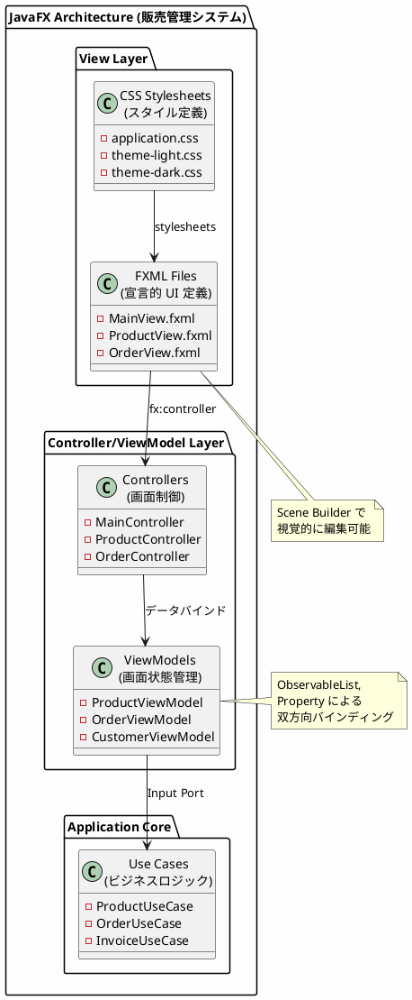
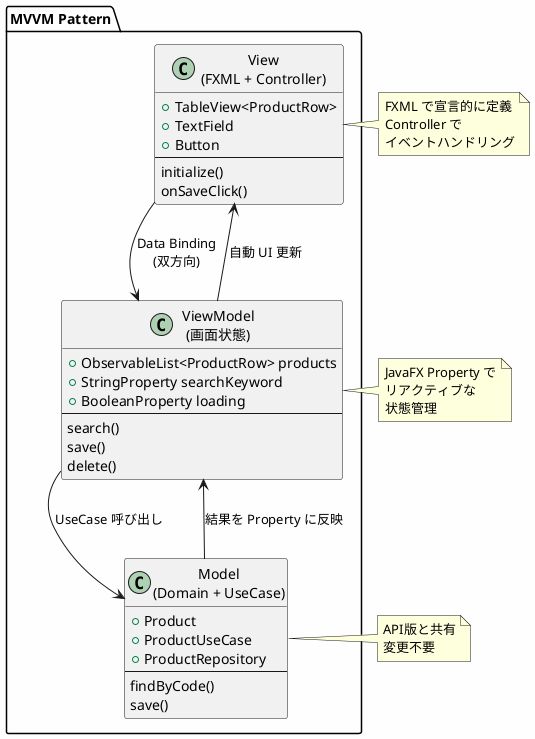
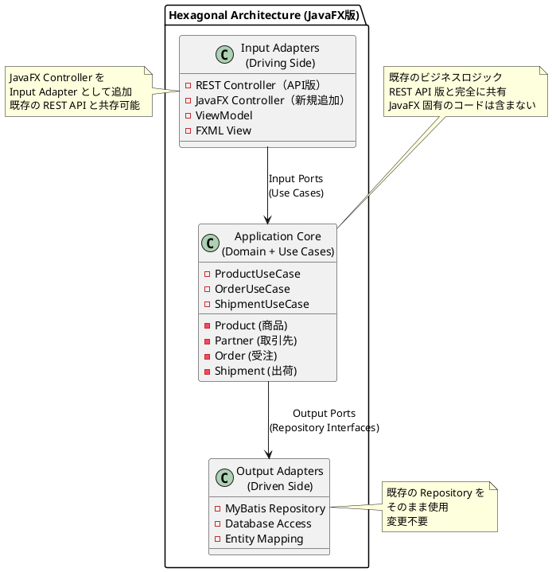
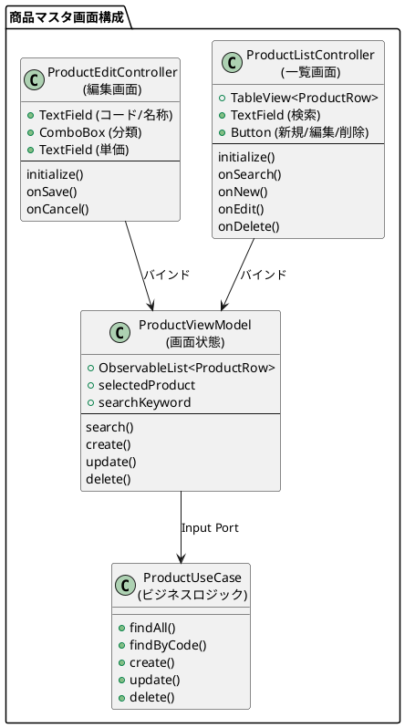
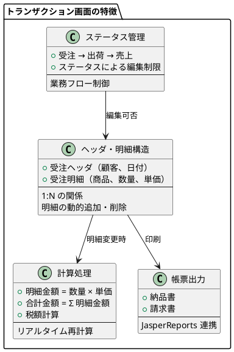
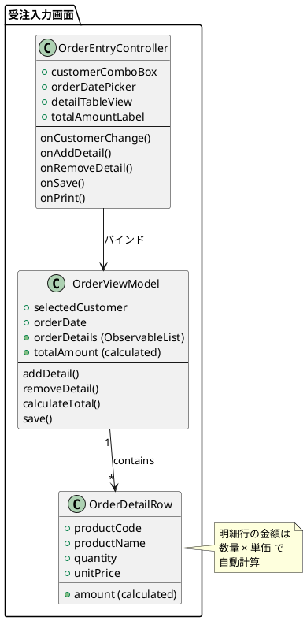
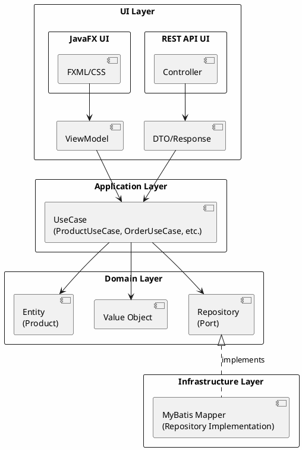

# 実践データベース設計：販売管理システム 研究 2 - JavaFX デスクトップアプリケーションの実装

## はじめに

本研究では、API サーバー構成（第13章）やモノリスサービス（研究 1）とは異なるアプローチとして、**JavaFX** によるデスクトップアプリケーションを実装します。FXML による宣言的 UI 定義と、データバインディングによるリアクティブな画面更新を活用した、業務アプリケーションを構築します。

研究 1 で構築したヘキサゴナルアーキテクチャ（ドメイン層・アプリケーション層）はそのまま共有し、**Input Adapter として JavaFX の Controller/ViewModel 層のみを追加**します。

---

## 第14章：JavaFX デスクトップアプリケーションの基礎

### 14.1 JavaFX とは

JavaFX は Java のリッチクライアントプラットフォームです。Swing の後継として位置づけられ、モダンな UI 構築が可能です。



**Web アプリケーションとの比較：**

| 特徴 | Web アプリ（REST API） | JavaFX デスクトップ |
|------|----------------------|-------------------|
| 配置 | サーバー + ブラウザ | ローカルインストール |
| オフライン | 不可 | 可能（ローカル DB） |
| レスポンス | ネットワーク依存 | 高速 |
| UI 自由度 | HTML/CSS 制約 | ネイティブ制御 |
| 印刷機能 | 制限あり | 高機能 |
| 更新配布 | 自動 | 手動/自動更新 |

---

### 14.2 MVVM パターンの採用

JavaFX では、**MVVM（Model-View-ViewModel）** パターンを採用し、UI とビジネスロジックを分離します。



**各層の責務：**

| 層 | 責務 | JavaFX での実装 |
|----|------|----------------|
| **View** | UI 表示・ユーザー入力 | FXML + Controller |
| **ViewModel** | 画面状態管理・変換 | Property, ObservableList |
| **Model** | ビジネスロジック | UseCase, Repository |

---

### 14.3 ヘキサゴナルアーキテクチャとの統合

JavaFX を導入しても、既存のヘキサゴナルアーキテクチャ（ドメイン層・アプリケーション層）はそのまま共有し、**Input Adapter として JavaFX の Controller/ViewModel 層のみを追加**します。



**JavaFX でもヘキサゴナルアーキテクチャを維持する理由：**

1. **再利用性**: 既存の UseCase/Repository をそのまま活用
2. **並行運用**: REST API と JavaFX の両方を提供可能
3. **テスト容易性**: ドメインロジックは UI フレームワークに依存しない
4. **移行容易性**: 段階的に Web からデスクトップへ移行可能

---

### 14.4 ディレクトリ構成

既存の構成に `infrastructure/in/javafx/` を追加します。

```
apps/sms/backend/src/main/java/com/example/sms/
├── domain/                       # ドメイン層（API版と共通）
│   ├── model/
│   │   ├── product/
│   │   ├── partner/
│   │   ├── sales/
│   │   └── invoice/
│   └── exception/
│
├── application/                  # アプリケーション層（API版と共通）
│   ├── port/
│   │   ├── in/                  # Input Port（ユースケース）
│   │   └── out/                 # Output Port（リポジトリ）
│   └── service/
│
├── infrastructure/
│   ├── out/
│   │   └── persistence/         # Output Adapter（DB実装）- 既存
│   │       ├── mapper/
│   │       └── repository/
│   ├── in/
│   │   ├── rest/                # Input Adapter（REST実装）- 既存
│   │   │   ├── controller/
│   │   │   └── dto/
│   │   └── javafx/              # Input Adapter（JavaFX実装）- 新規追加
│   │       ├── controller/      # FXML Controller
│   │       ├── viewmodel/       # ViewModel
│   │       ├── view/            # 画面表示用の行モデル
│   │       ├── dialog/          # ダイアログ
│   │       ├── util/            # ユーティリティ
│   │       └── config/          # JavaFX 設定
│
└── Application.java              # Spring Boot + JavaFX 起動クラス

apps/sms/backend/src/main/resources/
├── fxml/                         # FXML ファイル
│   ├── main.fxml
│   ├── product/
│   │   ├── product-list.fxml
│   │   └── product-edit.fxml
│   ├── order/
│   │   ├── order-list.fxml
│   │   └── order-entry.fxml
│   └── common/
│       ├── login.fxml
│       └── error-dialog.fxml
│
├── css/                          # スタイルシート
│   ├── application.css
│   └── theme/
│
├── images/                       # 画像リソース
│
└── reports/                      # JasperReports テンプレート
    ├── invoice.jrxml
    └── delivery-slip.jrxml
```

---

### 14.5 技術スタックの追加

#### build.gradle.kts（差分）

<details>
<summary>コード例: build.gradle.kts</summary>

```kotlin
plugins {
    // 既存のプラグイン...
    id("org.openjfx.javafxplugin") version "0.1.0"  // 追加
}

// JavaFX 設定
javafx {
    version = "21"
    modules = listOf(
        "javafx.controls",
        "javafx.fxml",
        "javafx.graphics",
        "javafx.swing"  // JasperReports 連携用
    )
}

dependencies {
    // 既存の依存関係（Spring Boot, MyBatis, PostgreSQL等）はそのまま

    // JavaFX 関連を追加
    implementation("org.controlsfx:controlsfx:11.2.0")           // 拡張コントロール
    implementation("com.dlsc.formsfx:formsfx-core:11.6.0")        // フォーム生成
    implementation("org.kordamp.ikonli:ikonli-javafx:12.3.1")     // アイコン
    implementation("org.kordamp.ikonli:ikonli-fontawesome5-pack:12.3.1")

    // JasperReports（帳票出力）
    implementation("net.sf.jasperreports:jasperreports:6.20.6")

    // Excel 出力
    implementation("org.apache.poi:poi-ooxml:5.2.5")

    // TestFX（UI テスト）
    testImplementation("org.testfx:testfx-core:4.0.18")
    testImplementation("org.testfx:testfx-junit5:4.0.18")
}
```

</details>

**追加パッケージの説明：**

| パッケージ | 用途 |
|-----------|------|
| javafx.controls | 標準 UI コントロール |
| javafx.fxml | FXML パーサー |
| ControlsFX | 拡張コントロール（SearchableComboBox等） |
| Ikonli | アイコンフォント |
| JasperReports | 帳票出力 |
| Apache POI | Excel 出力 |
| TestFX | UI 自動テスト |

---

### 14.6 Spring Boot + JavaFX 統合

#### JavaFxApplication.java

<details>
<summary>コード例: JavaFxApplication.java</summary>

```java
package com.example.sms.infrastructure.in.javafx;

import javafx.application.Application;
import javafx.application.Platform;
import javafx.stage.Stage;
import org.springframework.boot.builder.SpringApplicationBuilder;
import org.springframework.context.ConfigurableApplicationContext;

/**
 * JavaFX アプリケーションのエントリーポイント
 * Spring Boot コンテキストと JavaFX を統合
 */
public class JavaFxApplication extends Application {

    private ConfigurableApplicationContext springContext;

    @Override
    public void init() {
        springContext = new SpringApplicationBuilder(SmsApplication.class).run();
    }

    @Override
    public void start(Stage primaryStage) {
        StageManager stageManager = springContext.getBean(StageManager.class);
        stageManager.setPrimaryStage(primaryStage);
        stageManager.switchScene(FxmlView.MAIN);
    }

    @Override
    public void stop() {
        springContext.close();
        Platform.exit();
    }
}
```

</details>

#### StageManager.java

<details>
<summary>コード例: StageManager.java</summary>

```java
package com.example.sms.infrastructure.in.javafx.config;

import javafx.fxml.FXMLLoader;
import javafx.scene.Parent;
import javafx.scene.Scene;
import javafx.stage.Stage;
import org.springframework.context.ApplicationContext;
import org.springframework.stereotype.Component;

import java.io.IOException;
import java.util.Objects;

/**
 * JavaFX Stage/Scene の管理
 */
@Component
public class StageManager {

    private final ApplicationContext applicationContext;
    private Stage primaryStage;

    public StageManager(ApplicationContext applicationContext) {
        this.applicationContext = applicationContext;
    }

    public void setPrimaryStage(Stage primaryStage) {
        this.primaryStage = primaryStage;
    }

    public void switchScene(FxmlView view) {
        Parent root = loadView(view.getFxmlPath());
        Scene scene = new Scene(root);

        scene.getStylesheets().add(
            Objects.requireNonNull(
                getClass().getResource("/css/application.css")
            ).toExternalForm()
        );

        primaryStage.setTitle(view.getTitle());
        primaryStage.setScene(scene);
        primaryStage.centerOnScreen();

        if (!primaryStage.isShowing()) {
            primaryStage.show();
        }
    }

    private Parent loadView(String fxmlPath) {
        try {
            FXMLLoader loader = new FXMLLoader(getClass().getResource(fxmlPath));
            loader.setControllerFactory(applicationContext::getBean);
            return loader.load();
        } catch (IOException e) {
            throw new RuntimeException("FXML ロードエラー: " + fxmlPath, e);
        }
    }

    public ApplicationContext getApplicationContext() {
        return applicationContext;
    }
}
```

</details>

#### FxmlView.java（画面定義）

<details>
<summary>コード例: FxmlView.java</summary>

```java
package com.example.sms.infrastructure.in.javafx.config;

public enum FxmlView {

    MAIN("/fxml/main.fxml", "販売管理システム"),
    PRODUCT_LIST("/fxml/product/product-list.fxml", "商品マスタ"),
    ORDER_ENTRY("/fxml/order/order-entry.fxml", "受注入力"),
    ORDER_LIST("/fxml/order/order-list.fxml", "受注一覧"),
    SHIPMENT_LIST("/fxml/shipment/shipment-list.fxml", "出荷一覧"),
    INVOICE_LIST("/fxml/invoice/invoice-list.fxml", "請求一覧");

    private final String fxmlPath;
    private final String title;

    FxmlView(String fxmlPath, String title) {
        this.fxmlPath = fxmlPath;
        this.title = title;
    }

    public String getFxmlPath() { return fxmlPath; }
    public String getTitle() { return title; }
}
```

</details>

---

### 14.7 JavaFX Property の活用

JavaFX の Property 機能を使って、UI とデータの双方向バインディングを実現します。

#### ProductRow.java（View 用データクラス）

<details>
<summary>コード例: ProductRow.java</summary>

```java
package com.example.sms.infrastructure.in.javafx.view;

import javafx.beans.property.*;
import java.math.BigDecimal;

/**
 * 商品マスタ画面用の行モデル
 */
public class ProductRow {

    private final StringProperty productCode = new SimpleStringProperty();
    private final StringProperty productName = new SimpleStringProperty();
    private final StringProperty categoryName = new SimpleStringProperty();
    private final ObjectProperty<BigDecimal> unitPrice = new SimpleObjectProperty<>();
    private final BooleanProperty discontinued = new SimpleBooleanProperty();

    // Property アクセサ
    public StringProperty productCodeProperty() { return productCode; }
    public StringProperty productNameProperty() { return productName; }
    public StringProperty categoryNameProperty() { return categoryName; }
    public ObjectProperty<BigDecimal> unitPriceProperty() { return unitPrice; }
    public BooleanProperty discontinuedProperty() { return discontinued; }

    // Getter/Setter
    public String getProductCode() { return productCode.get(); }
    public void setProductCode(String value) { productCode.set(value); }

    public String getProductName() { return productName.get(); }
    public void setProductName(String value) { productName.set(value); }

    public BigDecimal getUnitPrice() { return unitPrice.get(); }
    public void setUnitPrice(BigDecimal value) { unitPrice.set(value); }
}
```

</details>

#### ProductViewModel.java

<details>
<summary>コード例: ProductViewModel.java</summary>

```java
package com.example.sms.infrastructure.in.javafx.viewmodel;

import com.example.sms.application.port.in.ProductUseCase;
import com.example.sms.domain.model.product.Product;
import com.example.sms.infrastructure.in.javafx.view.ProductRow;
import javafx.beans.property.*;
import javafx.collections.FXCollections;
import javafx.collections.ObservableList;
import org.springframework.stereotype.Component;

import java.util.List;

@Component
public class ProductViewModel {

    private final ProductUseCase productUseCase;

    private final ObservableList<ProductRow> products = FXCollections.observableArrayList();
    private final ObjectProperty<ProductRow> selectedProduct = new SimpleObjectProperty<>();
    private final StringProperty searchKeyword = new SimpleStringProperty("");
    private final BooleanProperty loading = new SimpleBooleanProperty(false);
    private final StringProperty errorMessage = new SimpleStringProperty();

    public ProductViewModel(ProductUseCase productUseCase) {
        this.productUseCase = productUseCase;
    }

    public void search() {
        loading.set(true);
        errorMessage.set(null);

        try {
            List<Product> result = searchKeyword.get().isBlank()
                ? productUseCase.findAll()
                : productUseCase.searchByKeyword(searchKeyword.get());

            products.clear();
            result.forEach(p -> products.add(toRow(p)));
        } catch (Exception e) {
            errorMessage.set("検索エラー: " + e.getMessage());
        } finally {
            loading.set(false);
        }
    }

    public void delete(String productCode) {
        loading.set(true);
        try {
            productUseCase.delete(productCode);
            products.removeIf(row -> row.getProductCode().equals(productCode));
        } catch (Exception e) {
            errorMessage.set("削除エラー: " + e.getMessage());
            throw e;
        } finally {
            loading.set(false);
        }
    }

    public ObservableList<ProductRow> getProducts() { return products; }
    public StringProperty searchKeywordProperty() { return searchKeyword; }
    public BooleanProperty loadingProperty() { return loading; }

    private ProductRow toRow(Product product) {
        ProductRow row = new ProductRow();
        row.setProductCode(product.getProductCode());
        row.setProductName(product.getProductName());
        row.setUnitPrice(product.getUnitPrice());
        return row;
    }
}
```

</details>

---

## 第15章：マスタの実装

### 15.1 商品マスタ画面の設計



### 15.2 商品マスタ一覧画面の TDD 実装

#### Red: 失敗するテストを書く

<details>
<summary>コード例: ProductListControllerTest.java</summary>

```java
@ExtendWith({ApplicationExtension.class, MockitoExtension.class})
@DisplayName("商品マスタ一覧画面")
class ProductListControllerTest {

    @Mock
    private ProductUseCase productUseCase;

    private ProductViewModel viewModel;

    @Start
    void start(Stage stage) throws Exception {
        viewModel = new ProductViewModel(productUseCase);
        var controller = new ProductListController(viewModel);

        var loader = new FXMLLoader(getClass().getResource("/fxml/product/product-list.fxml"));
        loader.setController(controller);
        stage.setScene(new Scene(loader.load()));
        stage.show();
    }

    @Test
    @DisplayName("商品一覧がテーブルに表示される")
    void shouldDisplayProductsInTable(FxRobot robot) {
        // Arrange
        when(productUseCase.findAll()).thenReturn(List.of(
            createProduct("P001", "テスト商品A", new BigDecimal("500")),
            createProduct("P002", "テスト商品B", new BigDecimal("800"))
        ));

        // Act
        robot.interact(() -> viewModel.search());

        // Assert
        TableView<ProductRow> table = robot.lookup("#productTable").queryTableView();
        assertThat(table.getItems()).hasSize(2);
        assertThat(table.getItems().get(0).getProductCode()).isEqualTo("P001");
    }

    @Test
    @DisplayName("キーワードで商品を検索できる")
    void shouldSearchProductsByKeyword(FxRobot robot) {
        when(productUseCase.searchByKeyword("テスト")).thenReturn(List.of(
            createProduct("P001", "テスト商品A", new BigDecimal("500"))
        ));

        robot.clickOn("#searchField").write("テスト").type(KeyCode.ENTER);

        TableView<ProductRow> table = robot.lookup("#productTable").queryTableView();
        assertThat(table.getItems()).hasSize(1);
    }
}
```

</details>

#### product-list.fxml

<details>
<summary>コード例: product-list.fxml</summary>

```xml
<?xml version="1.0" encoding="UTF-8"?>
<?import javafx.scene.control.*?>
<?import javafx.scene.layout.*?>
<?import org.kordamp.ikonli.javafx.FontIcon?>

<VBox xmlns="http://javafx.com/javafx/21"
      xmlns:fx="http://javafx.com/fxml/1"
      fx:controller="com.example.sms.infrastructure.in.javafx.controller.ProductListController"
      spacing="10">

    <!-- ツールバー -->
    <HBox spacing="10" alignment="CENTER_LEFT">
        <TextField fx:id="searchField" promptText="商品コード・商品名で検索" prefWidth="300"/>
        <Button onAction="#onSearch">
            <graphic><FontIcon iconLiteral="fas-search"/></graphic>
        </Button>
        <Pane HBox.hgrow="ALWAYS"/>
        <Button fx:id="newButton" text="新規" styleClass="primary" onAction="#onNew">
            <graphic><FontIcon iconLiteral="fas-plus"/></graphic>
        </Button>
        <Button fx:id="editButton" text="編集" onAction="#onEdit" disable="true"/>
        <Button fx:id="deleteButton" text="削除" styleClass="danger" onAction="#onDelete" disable="true"/>
        <Button text="Excel出力" onAction="#onExportExcel">
            <graphic><FontIcon iconLiteral="fas-file-excel"/></graphic>
        </Button>
    </HBox>

    <!-- 商品テーブル -->
    <TableView fx:id="productTable" VBox.vgrow="ALWAYS">
        <placeholder><Label text="該当する商品がありません"/></placeholder>
        <columns>
            <TableColumn text="商品コード" prefWidth="100">
                <cellValueFactory><PropertyValueFactory property="productCode"/></cellValueFactory>
            </TableColumn>
            <TableColumn text="商品名" prefWidth="200">
                <cellValueFactory><PropertyValueFactory property="productName"/></cellValueFactory>
            </TableColumn>
            <TableColumn text="単価" prefWidth="100" styleClass="amount-column">
                <cellValueFactory><PropertyValueFactory property="unitPrice"/></cellValueFactory>
            </TableColumn>
        </columns>
    </TableView>

    <!-- ステータスバー -->
    <HBox spacing="10" styleClass="status-bar">
        <Label fx:id="recordCount" text="0 件"/>
        <Pane HBox.hgrow="ALWAYS"/>
        <ProgressIndicator fx:id="loadingIndicator" visible="false" prefWidth="20" prefHeight="20"/>
    </HBox>
</VBox>
```

</details>

---

## 第16章：トランザクションの実装

### 16.1 トランザクション画面の特徴

トランザクション画面は、マスタ画面とは異なる以下の特徴があります。



### 16.2 受注入力画面の設計



### 16.3 受注入力画面の TDD 実装

#### Red: 失敗するテストを書く

<details>
<summary>コード例: OrderEntryControllerTest.java</summary>

```java
@ExtendWith({ApplicationExtension.class, MockitoExtension.class})
@DisplayName("受注入力画面")
class OrderEntryControllerTest {

    @Mock
    private OrderUseCase orderUseCase;
    @Mock
    private ProductUseCase productUseCase;

    private OrderViewModel viewModel;

    @Nested
    @DisplayName("明細追加")
    class AddDetail {

        @Test
        @DisplayName("商品を選択して明細を追加できる")
        void shouldAddDetailWhenProductSelected(FxRobot robot) {
            when(productUseCase.findByCode("P001")).thenReturn(
                createProduct("P001", "テスト商品", new BigDecimal("500"))
            );

            robot.clickOn("#productCodeField").write("P001");
            robot.clickOn("#quantityField").write("10");
            robot.clickOn("#addDetailButton");

            TableView<OrderDetailRow> table = robot.lookup("#detailTable").queryTableView();
            assertThat(table.getItems()).hasSize(1);
            assertThat(table.getItems().get(0).getAmount())
                .isEqualByComparingTo(new BigDecimal("5000"));
        }
    }

    @Nested
    @DisplayName("合計計算")
    class TotalCalculation {

        @Test
        @DisplayName("明細追加時に合計金額が再計算される")
        void shouldRecalculateTotalWhenDetailAdded(FxRobot robot) {
            viewModel.addDetail(createDetailRow("P001", 10, new BigDecimal("500")));
            viewModel.addDetail(createDetailRow("P002", 5, new BigDecimal("800")));

            Label totalLabel = robot.lookup("#totalAmountLabel").queryAs(Label.class);
            // 10 × 500 + 5 × 800 = 9000
            assertThat(totalLabel.getText()).contains("9,000");
        }
    }
}
```

</details>

#### order-entry.fxml

<details>
<summary>コード例: order-entry.fxml</summary>

```xml
<?xml version="1.0" encoding="UTF-8"?>
<?import javafx.scene.control.*?>
<?import javafx.scene.layout.*?>
<?import org.kordamp.ikonli.javafx.FontIcon?>

<VBox xmlns="http://javafx.com/javafx/21"
      xmlns:fx="http://javafx.com/fxml/1"
      fx:controller="com.example.sms.infrastructure.in.javafx.controller.OrderEntryController"
      spacing="10">

    <!-- ヘッダ情報 -->
    <GridPane hgap="10" vgap="10" styleClass="header-form">
        <Label text="受注番号:" GridPane.columnIndex="0" GridPane.rowIndex="0"/>
        <TextField fx:id="orderNumberField" editable="false" GridPane.columnIndex="1"/>

        <Label text="受注日:" GridPane.columnIndex="2" GridPane.rowIndex="0"/>
        <DatePicker fx:id="orderDatePicker" GridPane.columnIndex="3"/>

        <Label text="顧客:" GridPane.columnIndex="0" GridPane.rowIndex="1"/>
        <HBox spacing="5" GridPane.columnIndex="1" GridPane.columnSpan="3">
            <TextField fx:id="customerCodeField" prefWidth="100"/>
            <Button onAction="#onSearchCustomer">
                <graphic><FontIcon iconLiteral="fas-search"/></graphic>
            </Button>
            <TextField fx:id="customerNameField" editable="false" HBox.hgrow="ALWAYS"/>
        </HBox>
    </GridPane>

    <Separator/>

    <!-- 明細入力エリア -->
    <HBox spacing="10" alignment="CENTER_LEFT">
        <Label text="商品:"/>
        <TextField fx:id="productCodeField" prefWidth="100"/>
        <TextField fx:id="productNameField" prefWidth="200" editable="false"/>
        <Label text="数量:"/>
        <TextField fx:id="quantityField" prefWidth="80" alignment="CENTER_RIGHT"/>
        <Label text="単価:"/>
        <TextField fx:id="unitPriceField" prefWidth="100" alignment="CENTER_RIGHT"/>
        <Button fx:id="addDetailButton" text="追加" styleClass="primary" onAction="#onAddDetail">
            <graphic><FontIcon iconLiteral="fas-plus"/></graphic>
        </Button>
    </HBox>

    <!-- 明細テーブル -->
    <TableView fx:id="detailTable" VBox.vgrow="ALWAYS" editable="true">
        <columns>
            <TableColumn text="No." prefWidth="50"/>
            <TableColumn text="商品コード" prefWidth="100"/>
            <TableColumn text="商品名" prefWidth="200"/>
            <TableColumn text="数量" prefWidth="80" styleClass="quantity-column"/>
            <TableColumn text="単価" prefWidth="100" styleClass="amount-column"/>
            <TableColumn text="金額" prefWidth="120" styleClass="amount-column"/>
            <TableColumn text="削除" prefWidth="60"/>
        </columns>
    </TableView>

    <!-- 合計エリア -->
    <HBox spacing="20" alignment="CENTER_RIGHT" styleClass="total-area">
        <VBox alignment="CENTER_RIGHT" spacing="5">
            <HBox spacing="10" alignment="CENTER_RIGHT">
                <Label text="小計:"/>
                <Label fx:id="subtotalLabel" text="¥0"/>
            </HBox>
            <HBox spacing="10" alignment="CENTER_RIGHT">
                <Label text="消費税:"/>
                <Label fx:id="taxAmountLabel" text="¥0"/>
            </HBox>
            <Separator/>
            <HBox spacing="10" alignment="CENTER_RIGHT">
                <Label text="合計金額:" styleClass="total-label-large"/>
                <Label fx:id="totalAmountLabel" text="¥0" styleClass="total-value-large"/>
            </HBox>
        </VBox>
    </HBox>

    <!-- ボタンエリア -->
    <HBox spacing="10" alignment="CENTER_RIGHT">
        <Button text="クリア" onAction="#onClear"/>
        <Button text="印刷" onAction="#onPrint">
            <graphic><FontIcon iconLiteral="fas-print"/></graphic>
        </Button>
        <Button fx:id="saveButton" text="登録" styleClass="primary" onAction="#onSave">
            <graphic><FontIcon iconLiteral="fas-save"/></graphic>
        </Button>
    </HBox>
</VBox>
```

</details>

---

## 第17章：エラーハンドリングとドキュメント

### 17.1 AlertHelper の実装

アラートダイアログを統一的に扱うためのヘルパークラスを作成します。

<details>
<summary>コード例: AlertHelper.java</summary>

```java
package com.example.sms.infrastructure.in.javafx.util;

import javafx.scene.control.Alert;
import javafx.scene.control.ButtonType;
import javafx.scene.control.TextArea;
import javafx.scene.layout.GridPane;
import javafx.scene.layout.Priority;

import java.io.PrintWriter;
import java.io.StringWriter;
import java.util.Optional;

public class AlertHelper {

    private AlertHelper() {}

    public static void showInfo(String message) {
        Alert alert = new Alert(Alert.AlertType.INFORMATION);
        alert.setTitle("情報");
        alert.setHeaderText(null);
        alert.setContentText(message);
        alert.showAndWait();
    }

    public static void showWarning(String message) {
        Alert alert = new Alert(Alert.AlertType.WARNING);
        alert.setTitle("警告");
        alert.setHeaderText(null);
        alert.setContentText(message);
        alert.showAndWait();
    }

    public static void showError(String message) {
        Alert alert = new Alert(Alert.AlertType.ERROR);
        alert.setTitle("エラー");
        alert.setHeaderText(null);
        alert.setContentText(message);
        alert.showAndWait();
    }

    public static void showException(String title, String header, Throwable exception) {
        Alert alert = new Alert(Alert.AlertType.ERROR);
        alert.setTitle(title);
        alert.setHeaderText(header);
        alert.setContentText(exception.getMessage());

        StringWriter sw = new StringWriter();
        PrintWriter pw = new PrintWriter(sw);
        exception.printStackTrace(pw);

        TextArea textArea = new TextArea(sw.toString());
        textArea.setEditable(false);
        textArea.setWrapText(true);
        textArea.setMaxWidth(Double.MAX_VALUE);
        textArea.setMaxHeight(Double.MAX_VALUE);
        GridPane.setVgrow(textArea, Priority.ALWAYS);
        GridPane.setHgrow(textArea, Priority.ALWAYS);

        GridPane expContent = new GridPane();
        expContent.setMaxWidth(Double.MAX_VALUE);
        expContent.add(textArea, 0, 0);

        alert.getDialogPane().setExpandableContent(expContent);
        alert.showAndWait();
    }

    public static boolean showConfirmation(String message) {
        Alert alert = new Alert(Alert.AlertType.CONFIRMATION);
        alert.setTitle("確認");
        alert.setHeaderText(null);
        alert.setContentText(message);

        Optional<ButtonType> result = alert.showAndWait();
        return result.isPresent() && result.get() == ButtonType.OK;
    }
}
```

</details>

### 17.2 グローバル例外ハンドラ

<details>
<summary>コード例: グローバル例外ハンドラ</summary>

```java
public class JavaFxApplication extends Application {

    private static final Logger logger = LoggerFactory.getLogger(JavaFxApplication.class);

    @Override
    public void init() {
        Thread.setDefaultUncaughtExceptionHandler(this::handleUncaughtException);
        // ...
    }

    private void handleUncaughtException(Thread thread, Throwable throwable) {
        logger.error("未処理例外が発生しました [Thread: {}]", thread.getName(), throwable);

        if (Platform.isFxApplicationThread()) {
            showErrorDialog(throwable);
        } else {
            Platform.runLater(() -> showErrorDialog(throwable));
        }
    }

    private void showErrorDialog(Throwable throwable) {
        AlertHelper.showException(
            "予期しないエラー",
            "アプリケーションで予期しないエラーが発生しました",
            throwable
        );
    }
}
```

</details>

### 17.3 ビジネス例外クラス

<details>
<summary>コード例: ビジネス例外クラス</summary>

```java
public class BusinessException extends RuntimeException {
    private final String errorCode;

    public BusinessException(String errorCode, String message) {
        super(message);
        this.errorCode = errorCode;
    }

    public String getErrorCode() { return errorCode; }
}

public class EntityNotFoundException extends BusinessException {
    public EntityNotFoundException(String entityName, Object id) {
        super("NOT_FOUND", String.format("%s が見つかりません: %s", entityName, id));
    }
}

public class ValidationException extends BusinessException {
    private final List<String> errors;

    public ValidationException(List<String> errors) {
        super("VALIDATION_ERROR", String.join(", ", errors));
        this.errors = errors;
    }

    public List<String> getErrors() { return errors; }
}
```

</details>

---

## Part 10-C のまとめ

### 実装した機能一覧

| 章 | 内容 |
|----|------|
| **第14章: 基礎** | JavaFX + Spring Boot 統合、MVVM パターン、Property と DataBinding |
| **第15章: マスタ画面** | 商品・取引先マスタ CRUD、TestFX による TDD、Excel エクスポート |
| **第16章: トランザクション画面** | 受注・出荷・請求処理、ヘッダ・明細構造、JasperReports 帳票出力 |
| **第17章: エラーハンドリング** | 統一的なアラート表示、バリデーション、ロギング |

### アーキテクチャの特徴



### 技術スタック

| カテゴリ | 技術 |
|---------|------|
| **言語** | Java 21 |
| **フレームワーク** | Spring Boot 3.4, JavaFX 21 |
| **ORM** | MyBatis 3.0 |
| **データベース** | PostgreSQL 16 |
| **帳票** | JasperReports |
| **Excel** | Apache POI |
| **テスト** | JUnit 5, TestFX |

### API サーバー版との比較

| 観点 | API サーバー版 | デスクトップ版 |
|------|--------------|---------------|
| **UI** | React/Vue | JavaFX + FXML |
| **通信** | HTTP/REST | 直接呼び出し |
| **状態管理** | Redux/Vuex | JavaFX Property |
| **配置** | サーバー + クライアント | スタンドアロン |
| **オフライン** | 不可 | 可能 |
| **帳票** | サーバー生成 PDF | クライアント直接印刷 |

### デスクトップアプリケーションの選択基準

| 選択基準 | デスクトップ向き | Web 向き |
|---------|----------------|---------|
| オフライン要件 | 必須 | 不要 |
| 帳票・印刷 | 高度な制御 | 基本的な印刷 |
| レスポンス | 即座の応答 | ネットワーク許容 |
| 配布・更新 | 限定的 | 全ユーザー同時 |
| UI 自由度 | 高い | HTML/CSS 制約 |

JavaFX デスクトップアプリケーションは、オフライン環境での利用や高度な帳票出力が必要な業務システムに適しています。既存のヘキサゴナルアーキテクチャを活かしながら、Input Adapter として追加することで、REST API と並行運用も可能です。
