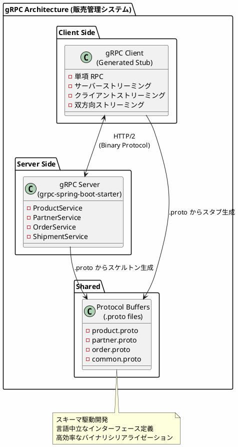
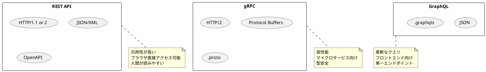
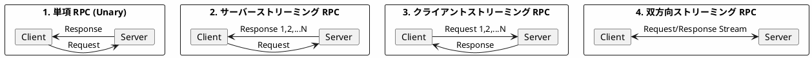
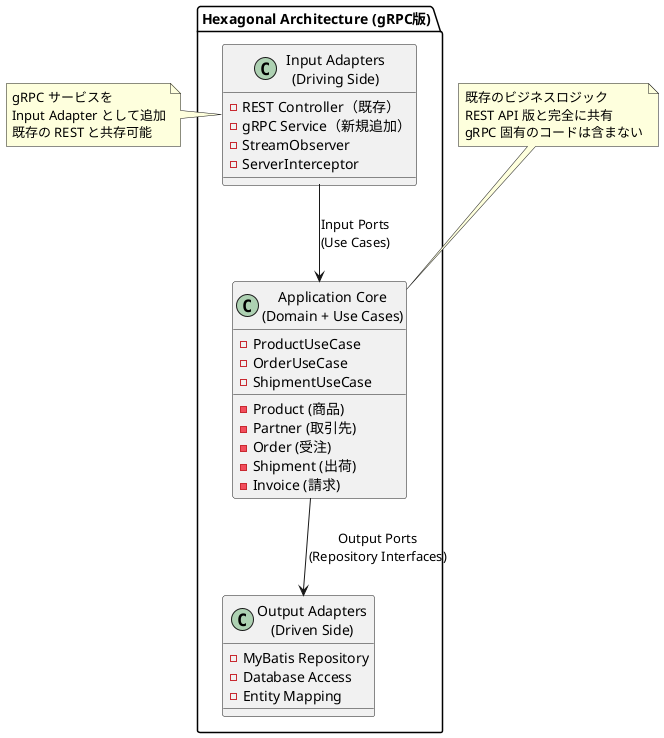
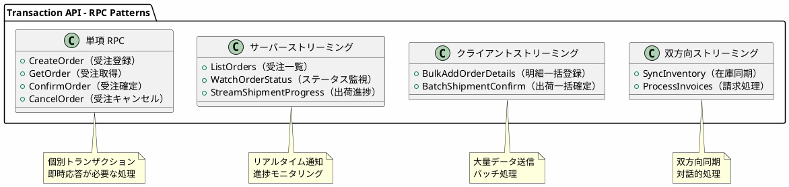
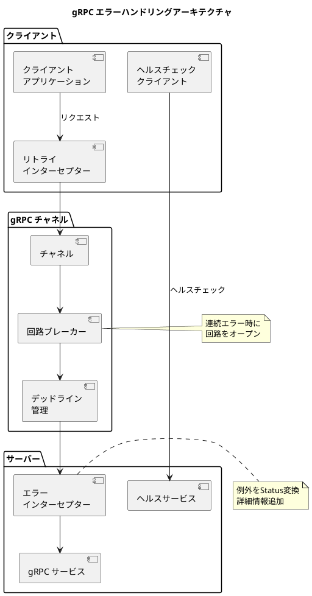

# 実践データベース設計：販売管理システム 研究 3 - gRPC サービスの実装

## はじめに

本研究では、API サーバー構成（第13章）やモノリスサービス（研究 1）とは異なるアプローチとして、**gRPC** による販売管理システムを実装します。Protocol Buffers による高効率なバイナリシリアライゼーションと、HTTP/2 によるストリーミング通信を活用し、高性能なマイクロサービス間通信を実現します。

研究 1 で構築したヘキサゴナルアーキテクチャ（ドメイン層・アプリケーション層）はそのまま共有し、**Input Adapter として gRPC サービス層のみを追加**します。

---

## 第14章：gRPC サーバーの基礎

### 14.1 gRPC とは

gRPC は Google が開発したオープンソースの高性能 RPC（Remote Procedure Call）フレームワークです。HTTP/2 プロトコルと Protocol Buffers を基盤とし、マイクロサービス間通信に最適化されています。



**gRPC の主な特徴：**

| 特徴 | 説明 |
|------|------|
| HTTP/2 | 多重化、ヘッダー圧縮、バイナリフレーミング |
| Protocol Buffers | 高速なバイナリシリアライゼーション |
| 多言語サポート | Java, Go, Python, C#, Node.js 等 |
| ストリーミング | 4つの RPC パターンをサポート |
| デッドライン | タイムアウト管理の組み込みサポート |
| 認証 | TLS/SSL、トークンベース認証のサポート |

---

### 14.2 REST API / GraphQL との比較



**詳細比較表：**

| 特徴 | REST API | gRPC | GraphQL |
|------|----------|------|---------|
| プロトコル | HTTP/1.1 | HTTP/2 | HTTP/1.1 or HTTP/2 |
| データ形式 | JSON | Protocol Buffers | JSON |
| スキーマ | OpenAPI (任意) | .proto (必須) | .graphqls (必須) |
| シリアライゼーション | テキスト | バイナリ | テキスト |
| パフォーマンス | 中 | 高 | 中 |
| ストリーミング | WebSocket 別実装 | ネイティブサポート | Subscription |
| ブラウザ対応 | ◎ | △ (gRPC-Web) | ◎ |
| 学習コスト | 低 | 中 | 中 |
| 主な用途 | 汎用 API | マイクロサービス | フロントエンド向け |

**gRPC を選択する場面：**

1. **マイクロサービス間通信**: 高性能な内部通信が必要な場合
2. **リアルタイム処理**: ストリーミングによる進捗通知が必要な場合
3. **多言語環境**: 異なる言語で実装されたサービス間の連携
4. **低レイテンシ**: バイナリプロトコルによる高速通信が必要な場合

---

### 14.3 4つの RPC パターン

gRPC は 4 つの RPC パターンをサポートします。



**各パターンの用途：**

| パターン | 用途例（販売管理システム） |
|----------|---------------------------|
| 単項 RPC | 商品情報取得、受注登録 |
| サーバーストリーミング | 商品一覧取得、出荷進捗通知 |
| クライアントストリーミング | 受注明細の一括登録 |
| 双方向ストリーミング | リアルタイム在庫同期 |

---

### 14.4 gRPC におけるヘキサゴナルアーキテクチャ

gRPC を導入しても、既存のヘキサゴナルアーキテクチャ（ドメイン層・アプリケーション層）はそのまま共有し、**Input Adapter として gRPC サービス層のみを追加**します。



**gRPC でもヘキサゴナルアーキテクチャを維持する理由：**

1. **再利用性**: 既存の UseCase/Repository をそのまま活用
2. **並行運用**: REST API と gRPC を同時提供可能
3. **テスト容易性**: ドメインロジックは通信プロトコルに依存しない
4. **移行容易性**: 段階的に API 形式を追加・変更可能

---

### 14.5 ディレクトリ構成

既存の構成に `infrastructure/grpc/` を追加するだけです。

```
src/main/java/com/example/sales/
├── domain/                     # ドメイン層（API版と共通）
│   ├── model/
│   │   ├── product/           # 商品ドメイン
│   │   ├── partner/           # 取引先ドメイン
│   │   ├── order/             # 受注ドメイン
│   │   ├── shipment/          # 出荷ドメイン
│   │   └── invoice/           # 請求ドメイン
│   └── exception/
│
├── application/               # アプリケーション層（API版と共通）
│   ├── port/
│   │   ├── in/               # Input Port（ユースケース）
│   │   └── out/              # Output Port（リポジトリ）
│   └── service/
│
├── infrastructure/
│   ├── persistence/          # Output Adapter（DB実装）- 既存
│   │   ├── mapper/
│   │   └── repository/
│   ├── rest/                 # Input Adapter（REST実装）- 既存
│   └── grpc/                 # Input Adapter（gRPC実装）- 新規追加
│       ├── service/          # gRPC サービス実装
│       ├── interceptor/      # インターセプター
│       └── converter/        # ドメイン ↔ Proto 変換
│
├── config/
│
└── src/main/proto/           # Protocol Buffers 定義
    ├── common.proto
    ├── product.proto
    ├── partner.proto
    ├── order.proto
    ├── shipment.proto
    └── invoice.proto
```

---

### 14.6 技術スタックの追加

既存の `build.gradle.kts` に gRPC 関連の依存関係を追加します。

#### build.gradle.kts（差分）

<details>
<summary>コード例: build.gradle.kts</summary>

```kotlin
import com.google.protobuf.gradle.*

plugins {
    // 既存のプラグイン
    id("java")
    id("org.springframework.boot") version "4.0.0"
    id("io.spring.dependency-management") version "1.1.0"

    // gRPC 関連を追加
    id("com.google.protobuf") version "0.9.4"
}

dependencies {
    // 既存の依存関係（Spring Boot, MyBatis, PostgreSQL等）はそのまま

    // gRPC 関連を追加
    implementation("net.devh:grpc-spring-boot-starter:3.1.0.RELEASE")
    implementation("io.grpc:grpc-protobuf:1.62.2")
    implementation("io.grpc:grpc-stub:1.62.2")
    implementation("io.grpc:grpc-services:1.62.2")  // ヘルスチェック、リフレクション

    // Protocol Buffers
    implementation("com.google.protobuf:protobuf-java:3.25.3")
    implementation("com.google.protobuf:protobuf-java-util:3.25.3")  // JSON 変換

    // Jakarta Annotation (gRPC generated code で必要)
    compileOnly("jakarta.annotation:jakarta.annotation-api:2.1.1")

    // Test
    testImplementation("io.grpc:grpc-testing:1.62.2")
    testImplementation("net.devh:grpc-client-spring-boot-starter:3.1.0.RELEASE")
}

protobuf {
    protoc {
        artifact = "com.google.protobuf:protoc:3.25.3"
    }
    plugins {
        create("grpc") {
            artifact = "io.grpc:protoc-gen-grpc-java:1.62.2"
        }
    }
    generateProtoTasks {
        all().forEach { task ->
            task.plugins {
                create("grpc")
            }
        }
    }
}

// 生成コードのソースパス追加
sourceSets {
    main {
        java {
            srcDirs(
                "build/generated/source/proto/main/java",
                "build/generated/source/proto/main/grpc"
            )
        }
    }
}
```

</details>

**追加パッケージの説明：**

| パッケージ | 用途 |
|-----------|------|
| grpc-spring-boot-starter | Spring Boot gRPC 統合 |
| grpc-protobuf | gRPC + Protocol Buffers 統合 |
| grpc-stub | gRPC クライアントスタブ |
| grpc-services | ヘルスチェック、リフレクションサービス |
| protobuf-java | Protocol Buffers Java ランタイム |
| protobuf-java-util | JSON ⇔ Protobuf 変換ユーティリティ |
| grpc-testing | gRPC テストサポート |

#### application.yml（差分）

<details>
<summary>コード例: application.yml</summary>

```yaml
# 既存の設定はそのまま

# gRPC サーバー設定
grpc:
  server:
    port: 9090
    reflection-service-enabled: true  # gRPC リフレクション有効化
    health-service-enabled: true      # ヘルスチェック有効化
    max-inbound-message-size: 4194304  # 4MB
    max-inbound-metadata-size: 8192    # 8KB

# ログ設定
logging:
  level:
    net.devh.boot.grpc: DEBUG
    io.grpc: INFO
```

</details>

---

### 14.7 Protocol Buffers 定義

#### src/main/proto/common.proto

<details>
<summary>コード例: common.proto</summary>

```protobuf
syntax = "proto3";

package com.example.sales;

option java_package = "com.example.sales.infrastructure.grpc.proto";
option java_outer_classname = "CommonProto";
option java_multiple_files = true;

import "google/protobuf/timestamp.proto";
import "google/protobuf/wrappers.proto";

// 共通のページネーション
message PageRequest {
    int32 page = 1;
    int32 size = 2;
}

message PageInfo {
    int32 page = 1;
    int32 size = 2;
    int32 total_elements = 3;
    int32 total_pages = 4;
    bool has_next = 5;
    bool has_previous = 6;
}

// 共通のエラー応答
message ErrorDetail {
    string field = 1;
    string message = 2;
}

message ErrorResponse {
    string code = 1;
    string message = 2;
    repeated ErrorDetail details = 3;
}

// 金額型（Decimal 相当）
message Money {
    int64 units = 1;      // 整数部
    int32 nanos = 2;      // 小数部（10億分の1単位）
    string currency = 3;  // 通貨コード（JPY等）
}

// 日付型（Date 相当）
message Date {
    int32 year = 1;
    int32 month = 2;
    int32 day = 3;
}

// 監査情報
message AuditInfo {
    google.protobuf.Timestamp created_at = 1;
    string created_by = 2;
    google.protobuf.Timestamp updated_at = 3;
    string updated_by = 4;
}
```

</details>

#### src/main/proto/product.proto

<details>
<summary>コード例: product.proto</summary>

```protobuf
syntax = "proto3";

package com.example.sales;

option java_package = "com.example.sales.infrastructure.grpc.proto";
option java_outer_classname = "ProductProto";
option java_multiple_files = true;

import "common.proto";
import "google/protobuf/empty.proto";

// 商品区分
enum ProductCategory {
    PRODUCT_CATEGORY_UNSPECIFIED = 0;
    PRODUCT_CATEGORY_GOODS = 1;       // 商品
    PRODUCT_CATEGORY_SERVICE = 2;     // サービス
    PRODUCT_CATEGORY_SUPPLY = 3;      // 消耗品
}

// 税区分
enum TaxCategory {
    TAX_CATEGORY_UNSPECIFIED = 0;
    TAX_CATEGORY_TAXABLE = 1;         // 課税
    TAX_CATEGORY_EXEMPT = 2;          // 非課税
    TAX_CATEGORY_REDUCED = 3;         // 軽減税率
}

// 商品メッセージ
message Product {
    string product_code = 1;           // 商品コード
    string product_name = 2;           // 商品名
    ProductCategory category = 3;      // 商品区分
    TaxCategory tax_category = 4;      // 税区分
    Money standard_price = 5;          // 標準単価
    string product_group_code = 6;     // 商品分類コード
    string unit_code = 7;              // 単位コード
    bool is_active = 8;                // 有効フラグ
    AuditInfo audit = 9;               // 監査情報
}

// === リクエスト/レスポンス ===

// 商品取得
message GetProductRequest {
    string product_code = 1;
}

message GetProductResponse {
    Product product = 1;
}

// 商品一覧取得（サーバーストリーミング）
message ListProductsRequest {
    PageRequest page = 1;
    ProductCategory category = 2;      // フィルタ（オプション）
    string product_group_code = 3;     // フィルタ（オプション）
    string keyword = 4;                // 検索キーワード
}

// 商品登録
message CreateProductRequest {
    string product_code = 1;
    string product_name = 2;
    ProductCategory category = 3;
    TaxCategory tax_category = 4;
    Money standard_price = 5;
    string product_group_code = 6;
    string unit_code = 7;
}

message CreateProductResponse {
    Product product = 1;
}

// 商品一括登録（クライアントストリーミング）
message BulkCreateProductRequest {
    CreateProductRequest product = 1;
}

message BulkCreateProductResponse {
    int32 success_count = 1;
    int32 failure_count = 2;
    repeated ErrorDetail errors = 3;
}

// === サービス定義 ===

service ProductService {
    // 単項 RPC
    rpc GetProduct(GetProductRequest) returns (GetProductResponse);
    rpc CreateProduct(CreateProductRequest) returns (CreateProductResponse);
    rpc UpdateProduct(UpdateProductRequest) returns (UpdateProductResponse);
    rpc DeleteProduct(DeleteProductRequest) returns (DeleteProductResponse);

    // サーバーストリーミング RPC（大量データ取得）
    rpc ListProducts(ListProductsRequest) returns (stream Product);

    // クライアントストリーミング RPC（一括登録）
    rpc BulkCreateProducts(stream BulkCreateProductRequest) returns (BulkCreateProductResponse);
}
```

</details>

---

### 14.8 gRPC サービス実装

#### GrpcProductService.java

<details>
<summary>コード例: GrpcProductService.java</summary>

```java
package com.example.sales.infrastructure.grpc.service;

import com.example.sales.application.port.in.ProductUseCase;
import com.example.sales.domain.model.product.Product;
import com.example.sales.domain.model.product.ProductCode;
import com.example.sales.infrastructure.grpc.converter.ProductConverter;
import com.example.sales.infrastructure.grpc.proto.*;
import io.grpc.stub.StreamObserver;
import net.devh.boot.grpc.server.service.GrpcService;
import org.slf4j.Logger;
import org.slf4j.LoggerFactory;

import java.util.List;
import java.util.concurrent.atomic.AtomicInteger;

/**
 * 商品 gRPC サービス実装
 */
@GrpcService
public class GrpcProductService extends ProductServiceGrpc.ProductServiceImplBase {

    private static final Logger log = LoggerFactory.getLogger(GrpcProductService.class);

    private final ProductUseCase productUseCase;
    private final ProductConverter converter;

    public GrpcProductService(ProductUseCase productUseCase, ProductConverter converter) {
        this.productUseCase = productUseCase;
        this.converter = converter;
    }

    /**
     * 単項 RPC: 商品取得
     */
    @Override
    public void getProduct(GetProductRequest request,
                           StreamObserver<GetProductResponse> responseObserver) {
        log.info("getProduct: {}", request.getProductCode());

        try {
            ProductCode code = new ProductCode(request.getProductCode());
            Product product = productUseCase.findByCode(code)
                .orElseThrow(() -> new ProductNotFoundException(code));

            GetProductResponse response = GetProductResponse.newBuilder()
                .setProduct(converter.toProto(product))
                .build();

            responseObserver.onNext(response);
            responseObserver.onCompleted();

        } catch (ProductNotFoundException e) {
            log.warn("Product not found: {}", request.getProductCode());
            responseObserver.onError(
                io.grpc.Status.NOT_FOUND
                    .withDescription("商品が見つかりません: " + request.getProductCode())
                    .asRuntimeException()
            );
        } catch (Exception e) {
            log.error("Error getting product", e);
            responseObserver.onError(
                io.grpc.Status.INTERNAL
                    .withDescription("内部エラーが発生しました")
                    .withCause(e)
                    .asRuntimeException()
            );
        }
    }

    /**
     * サーバーストリーミング RPC: 商品一覧取得
     */
    @Override
    public void listProducts(ListProductsRequest request,
                             StreamObserver<Product> responseObserver) {
        log.info("listProducts: category={}, keyword={}",
                 request.getCategory(), request.getKeyword());

        try {
            List<Product> products = productUseCase.findAll(
                converter.toCriteria(request)
            );

            // ストリーミングで商品を1件ずつ送信
            for (Product product : products) {
                responseObserver.onNext(converter.toProto(product));
            }

            responseObserver.onCompleted();
            log.info("listProducts completed: {} items", products.size());

        } catch (Exception e) {
            log.error("Error listing products", e);
            responseObserver.onError(
                io.grpc.Status.INTERNAL
                    .withDescription("内部エラーが発生しました")
                    .asRuntimeException()
            );
        }
    }

    /**
     * クライアントストリーミング RPC: 商品一括登録
     */
    @Override
    public StreamObserver<BulkCreateProductRequest> bulkCreateProducts(
            StreamObserver<BulkCreateProductResponse> responseObserver) {

        log.info("bulkCreateProducts: started");

        AtomicInteger successCount = new AtomicInteger(0);
        AtomicInteger failureCount = new AtomicInteger(0);
        List<ErrorDetail> errors = new java.util.ArrayList<>();

        return new StreamObserver<BulkCreateProductRequest>() {
            @Override
            public void onNext(BulkCreateProductRequest request) {
                try {
                    CreateProductRequest productRequest = request.getProduct();
                    Product product = converter.toDomain(productRequest);
                    productUseCase.create(product);
                    successCount.incrementAndGet();
                    log.debug("Created product: {}", productRequest.getProductCode());

                } catch (Exception e) {
                    failureCount.incrementAndGet();
                    errors.add(ErrorDetail.newBuilder()
                        .setField(request.getProduct().getProductCode())
                        .setMessage(e.getMessage())
                        .build());
                    log.warn("Failed to create product: {}",
                             request.getProduct().getProductCode(), e);
                }
            }

            @Override
            public void onError(Throwable t) {
                log.error("bulkCreateProducts error", t);
            }

            @Override
            public void onCompleted() {
                BulkCreateProductResponse response = BulkCreateProductResponse.newBuilder()
                    .setSuccessCount(successCount.get())
                    .setFailureCount(failureCount.get())
                    .addAllErrors(errors)
                    .build();

                responseObserver.onNext(response);
                responseObserver.onCompleted();

                log.info("bulkCreateProducts completed: success={}, failure={}",
                         successCount.get(), failureCount.get());
            }
        };
    }
}
```

</details>

---

### 14.9 ProductConverter（ドメイン ⇔ Proto 変換）

<details>
<summary>コード例: ProductConverter.java</summary>

```java
package com.example.sales.infrastructure.grpc.converter;

import com.example.sales.domain.model.product.*;
import com.example.sales.infrastructure.grpc.proto.*;
import org.springframework.stereotype.Component;

import java.math.BigDecimal;

/**
 * 商品ドメインモデル ⇔ Protocol Buffers 変換
 */
@Component
public class ProductConverter {

    /**
     * ドメインモデル → Proto
     */
    public com.example.sales.infrastructure.grpc.proto.Product toProto(Product domain) {
        return com.example.sales.infrastructure.grpc.proto.Product.newBuilder()
            .setProductCode(domain.getProductCode().getValue())
            .setProductName(domain.getProductName())
            .setCategory(toProtoCategory(domain.getCategory()))
            .setTaxCategory(toProtoTaxCategory(domain.getTaxCategory()))
            .setStandardPrice(toProtoMoney(domain.getStandardPrice()))
            .setProductGroupCode(nullToEmpty(domain.getProductGroupCode()))
            .setUnitCode(nullToEmpty(domain.getUnitCode()))
            .setIsActive(domain.isActive())
            .build();
    }

    /**
     * CreateProductRequest → ドメインモデル
     */
    public Product toDomain(CreateProductRequest request) {
        return Product.builder()
            .productCode(new ProductCode(request.getProductCode()))
            .productName(request.getProductName())
            .category(toDomainCategory(request.getCategory()))
            .taxCategory(toDomainTaxCategory(request.getTaxCategory()))
            .standardPrice(fromProtoMoney(request.getStandardPrice()))
            .productGroupCode(emptyToNull(request.getProductGroupCode()))
            .unitCode(emptyToNull(request.getUnitCode()))
            .isActive(true)
            .build();
    }

    // === 区分変換 ===

    private ProductCategory toProtoCategory(
            com.example.sales.domain.model.product.ProductCategory domain) {
        return switch (domain) {
            case GOODS -> ProductCategory.PRODUCT_CATEGORY_GOODS;
            case SERVICE -> ProductCategory.PRODUCT_CATEGORY_SERVICE;
            case SUPPLY -> ProductCategory.PRODUCT_CATEGORY_SUPPLY;
        };
    }

    // === Money 変換 ===

    private Money toProtoMoney(BigDecimal amount) {
        if (amount == null) {
            return Money.getDefaultInstance();
        }
        long units = amount.longValue();
        int nanos = amount.remainder(BigDecimal.ONE)
            .multiply(BigDecimal.valueOf(1_000_000_000))
            .intValue();

        return Money.newBuilder()
            .setUnits(units)
            .setNanos(nanos)
            .setCurrency("JPY")
            .build();
    }

    private BigDecimal fromProtoMoney(Money money) {
        if (money == null || money.equals(Money.getDefaultInstance())) {
            return BigDecimal.ZERO;
        }
        return BigDecimal.valueOf(money.getUnits())
            .add(BigDecimal.valueOf(money.getNanos(), 9));
    }

    // === ユーティリティ ===

    private String nullToEmpty(String value) {
        return value == null ? "" : value;
    }

    private String emptyToNull(String value) {
        return value == null || value.isEmpty() ? null : value;
    }
}
```

</details>

---

### 14.10 gRPC インターセプター

#### LoggingInterceptor.java

<details>
<summary>コード例: LoggingInterceptor.java</summary>

```java
package com.example.sales.infrastructure.grpc.interceptor;

import io.grpc.*;
import net.devh.boot.grpc.server.interceptor.GrpcGlobalServerInterceptor;
import org.slf4j.Logger;
import org.slf4j.LoggerFactory;
import org.slf4j.MDC;

import java.util.UUID;

/**
 * gRPC ログインターセプター
 */
@GrpcGlobalServerInterceptor
public class LoggingInterceptor implements ServerInterceptor {

    private static final Logger log = LoggerFactory.getLogger(LoggingInterceptor.class);

    @Override
    public <ReqT, RespT> ServerCall.Listener<ReqT> interceptCall(
            ServerCall<ReqT, RespT> call,
            Metadata headers,
            ServerCallHandler<ReqT, RespT> next) {

        String requestId = UUID.randomUUID().toString().substring(0, 8);
        String methodName = call.getMethodDescriptor().getFullMethodName();
        long startTime = System.currentTimeMillis();

        MDC.put("requestId", requestId);
        log.info("gRPC Request started: method={}", methodName);

        return new ForwardingServerCallListener.SimpleForwardingServerCallListener<>(
                next.startCall(new ForwardingServerCall.SimpleForwardingServerCall<>(call) {
                    @Override
                    public void close(Status status, Metadata trailers) {
                        long duration = System.currentTimeMillis() - startTime;
                        log.info("gRPC Request completed: method={}, status={}, duration={}ms",
                                 methodName, status.getCode(), duration);
                        MDC.remove("requestId");
                        super.close(status, trailers);
                    }
                }, headers)) {};
    }
}
```

</details>

---

### 14.11 grpcurl による動作確認

<details>
<summary>コード例: grpcurl コマンド</summary>

```bash
# サービス一覧取得
grpcurl -plaintext localhost:9090 list

# メソッド一覧取得
grpcurl -plaintext localhost:9090 list com.example.sales.ProductService

# 商品取得（単項 RPC）
grpcurl -plaintext -d '{"product_code": "PRD001"}' \
  localhost:9090 com.example.sales.ProductService/GetProduct

# 商品一覧取得（サーバーストリーミング）
grpcurl -plaintext -d '{"page": {"page": 0, "size": 10}}' \
  localhost:9090 com.example.sales.ProductService/ListProducts

# 商品登録
grpcurl -plaintext -d '{
  "product_code": "PRD100",
  "product_name": "新商品",
  "category": "PRODUCT_CATEGORY_GOODS",
  "tax_category": "TAX_CATEGORY_TAXABLE",
  "standard_price": {"units": 1000, "currency": "JPY"}
}' localhost:9090 com.example.sales.ProductService/CreateProduct
```

</details>

---

## 第15章：マスタ API の実装

### 15.1 商品マスタ API の詳細設計

第14章で基礎を学んだ gRPC サービスを、商品・取引先・倉庫マスタに対して拡張します。

**商品マスタ API の機能一覧：**

| メソッド | RPC パターン | 説明 |
|----------|-------------|------|
| GetProduct | 単項 | 商品コードで取得 |
| CreateProduct | 単項 | 商品登録 |
| UpdateProduct | 単項 | 商品更新 |
| DeleteProduct | 単項 | 商品削除（論理削除） |
| ListProducts | サーバーストリーミング | 商品一覧取得 |
| BulkCreateProducts | クライアントストリーミング | 一括登録 |
| BulkUpdateProducts | クライアントストリーミング | 一括更新 |
| CheckProductExists | 単項 | 存在チェック |

---

### 15.2 取引先マスタ API の実装

#### src/main/proto/partner.proto

<details>
<summary>コード例: partner.proto</summary>

```protobuf
syntax = "proto3";

package com.example.sales;

option java_package = "com.example.sales.infrastructure.grpc.proto";
option java_outer_classname = "PartnerProto";
option java_multiple_files = true;

import "common.proto";

// 取引先区分
enum PartnerType {
    PARTNER_TYPE_UNSPECIFIED = 0;
    PARTNER_TYPE_CUSTOMER = 1;        // 顧客
    PARTNER_TYPE_SUPPLIER = 2;        // 仕入先
    PARTNER_TYPE_BOTH = 3;            // 顧客兼仕入先
}

// 取引先ステータス
enum PartnerStatus {
    PARTNER_STATUS_UNSPECIFIED = 0;
    PARTNER_STATUS_ACTIVE = 1;        // 取引中
    PARTNER_STATUS_SUSPENDED = 2;     // 取引停止
    PARTNER_STATUS_CLOSED = 3;        // 取引終了
}

// 取引先メッセージ
message Partner {
    string partner_code = 1;
    string partner_name = 2;
    string partner_name_kana = 3;
    PartnerType partner_type = 4;
    PartnerStatus status = 5;
    Address address = 6;
    Contact contact = 7;
    CustomerInfo customer_info = 8;    // 顧客情報（顧客の場合）
    SupplierInfo supplier_info = 9;    // 仕入先情報（仕入先の場合）
    AuditInfo audit = 10;
}

// 与信チェック
message CheckCreditRequest {
    string partner_code = 1;
    Money amount = 2;                  // チェック金額
}

message CheckCreditResponse {
    bool is_within_limit = 1;          // 限度内か
    Money credit_limit = 2;            // 与信限度額
    Money current_receivable = 3;      // 現在売掛金残高
    Money available_credit = 4;        // 利用可能与信額
}

// === サービス定義 ===

service PartnerService {
    // 単項 RPC
    rpc GetPartner(GetPartnerRequest) returns (GetPartnerResponse);
    rpc CreatePartner(CreatePartnerRequest) returns (CreatePartnerResponse);
    rpc CheckCredit(CheckCreditRequest) returns (CheckCreditResponse);

    // サーバーストリーミング RPC
    rpc ListPartners(ListPartnersRequest) returns (stream Partner);
}
```

</details>

---

### 15.3 テスト実装

<details>
<summary>コード例: GrpcProductServiceTest.java</summary>

```java
@SpringBootTest(webEnvironment = SpringBootTest.WebEnvironment.DEFINED_PORT)
@ActiveProfiles("test")
class GrpcProductServiceTest {

    private ManagedChannel channel;
    private ProductServiceGrpc.ProductServiceBlockingStub blockingStub;
    private ProductServiceGrpc.ProductServiceStub asyncStub;

    @BeforeEach
    void setUp() {
        channel = ManagedChannelBuilder.forAddress("localhost", 9999)
            .usePlaintext()
            .build();
        blockingStub = ProductServiceGrpc.newBlockingStub(channel);
        asyncStub = ProductServiceGrpc.newStub(channel);
    }

    @AfterEach
    void tearDown() {
        channel.shutdownNow();
    }

    @Test
    @DisplayName("商品の CRUD 操作が正常に動作すること")
    void productCrud() {
        // 登録
        CreateProductResponse createResponse = blockingStub.createProduct(
            CreateProductRequest.newBuilder()
                .setProductCode("PRD999")
                .setProductName("テスト商品")
                .setCategory(ProductCategory.PRODUCT_CATEGORY_GOODS)
                .setTaxCategory(TaxCategory.TAX_CATEGORY_TAXABLE)
                .setStandardPrice(Money.newBuilder().setUnits(1000).setCurrency("JPY"))
                .build()
        );
        assertThat(createResponse.getProduct().getProductCode()).isEqualTo("PRD999");

        // 取得
        GetProductResponse getResponse = blockingStub.getProduct(
            GetProductRequest.newBuilder()
                .setProductCode("PRD999")
                .build()
        );
        assertThat(getResponse.getProduct().getProductName()).isEqualTo("テスト商品");
    }

    @Test
    @DisplayName("サーバーストリーミングで商品一覧を取得できること")
    void listProductsStreaming() throws InterruptedException {
        CountDownLatch latch = new CountDownLatch(1);
        List<Product> products = new ArrayList<>();

        asyncStub.listProducts(
            ListProductsRequest.newBuilder()
                .setPage(PageRequest.newBuilder().setPage(0).setSize(100).build())
                .build(),
            new StreamObserver<>() {
                @Override
                public void onNext(Product product) {
                    products.add(product);
                }

                @Override
                public void onError(Throwable t) {
                    latch.countDown();
                }

                @Override
                public void onCompleted() {
                    latch.countDown();
                }
            }
        );

        latch.await(10, TimeUnit.SECONDS);
        assertThat(products).isNotEmpty();
    }
}
```

</details>

---

## 第16章：トランザクション API の実装

### 16.1 トランザクション API の設計方針

#### RPC パターンの使い分け



---

### 16.2 受注 API の Protocol Buffers 定義

#### src/main/proto/order.proto

<details>
<summary>コード例: order.proto</summary>

```protobuf
syntax = "proto3";

package com.example.sales;

option java_package = "com.example.sales.infrastructure.grpc.proto";
option java_outer_classname = "OrderProto";
option java_multiple_files = true;

import "common.proto";
import "google/protobuf/timestamp.proto";

// 受注ステータス
enum OrderStatus {
    ORDER_STATUS_UNSPECIFIED = 0;
    ORDER_STATUS_DRAFT = 1;           // 下書き
    ORDER_STATUS_CONFIRMED = 2;       // 確定
    ORDER_STATUS_PROCESSING = 3;      // 処理中
    ORDER_STATUS_SHIPPED = 4;         // 出荷済
    ORDER_STATUS_COMPLETED = 5;       // 完了
    ORDER_STATUS_CANCELLED = 6;       // キャンセル
}

// 受注ヘッダ
message Order {
    string order_number = 1;
    string partner_code = 2;
    string partner_name = 3;
    Date order_date = 4;
    Date delivery_date = 5;
    OrderStatus status = 6;
    Money total_amount = 7;
    Money tax_amount = 8;
    string warehouse_code = 9;
    string sales_rep_code = 10;
    string notes = 11;
    repeated OrderDetail details = 12;
    AuditInfo audit = 13;
}

// 受注明細
message OrderDetail {
    int32 line_number = 1;
    string product_code = 2;
    string product_name = 3;
    int32 quantity = 4;
    Money unit_price = 5;
    Money amount = 6;
    string tax_category = 7;
    Date delivery_date = 8;
    string notes = 9;
}

// 受注ステータス監視（サーバーストリーミング）
message WatchOrderStatusRequest {
    repeated string order_numbers = 1;
    repeated OrderStatus statuses = 2;
}

message OrderStatusChange {
    string order_number = 1;
    OrderStatus previous_status = 2;
    OrderStatus current_status = 3;
    google.protobuf.Timestamp changed_at = 4;
    string changed_by = 5;
}

// === サービス定義 ===

service OrderService {
    // 単項 RPC
    rpc GetOrder(GetOrderRequest) returns (GetOrderResponse);
    rpc CreateOrder(CreateOrderRequest) returns (CreateOrderResponse);
    rpc UpdateOrder(UpdateOrderRequest) returns (UpdateOrderResponse);
    rpc ConfirmOrder(ConfirmOrderRequest) returns (ConfirmOrderResponse);
    rpc CancelOrder(CancelOrderRequest) returns (CancelOrderResponse);

    // サーバーストリーミング RPC
    rpc ListOrders(ListOrdersRequest) returns (stream Order);
    rpc WatchOrderStatus(WatchOrderStatusRequest) returns (stream OrderStatusChange);

    // クライアントストリーミング RPC
    rpc BulkAddOrderDetails(stream BulkAddOrderDetailRequest) returns (BulkAddOrderDetailResponse);
}
```

</details>

---

### 16.3 受注サービス実装（ステータス監視）

<details>
<summary>コード例: GrpcOrderService.java</summary>

```java
@GrpcService
public class GrpcOrderService extends OrderServiceGrpc.OrderServiceImplBase {

    private static final Logger log = LoggerFactory.getLogger(GrpcOrderService.class);

    private final OrderUseCase orderUseCase;
    private final CreditUseCase creditUseCase;
    private final OrderConverter converter;

    // ステータス監視用のオブザーバー管理
    private final Map<String, Set<StreamObserver<OrderStatusChange>>> statusWatchers =
        new ConcurrentHashMap<>();

    /**
     * サーバーストリーミング RPC: 受注ステータス監視
     */
    @Override
    public void watchOrderStatus(WatchOrderStatusRequest request,
                                 StreamObserver<OrderStatusChange> responseObserver) {
        log.info("watchOrderStatus: orders={}", request.getOrderNumbersList());

        // オブザーバー登録
        for (String orderNumber : request.getOrderNumbersList()) {
            statusWatchers
                .computeIfAbsent(orderNumber, k -> ConcurrentHashMap.newKeySet())
                .add(responseObserver);
        }

        // コンテキストキャンセル時にオブザーバー削除
        Context.current().addListener(context -> {
            for (String orderNumber : request.getOrderNumbersList()) {
                Set<StreamObserver<OrderStatusChange>> watchers = statusWatchers.get(orderNumber);
                if (watchers != null) {
                    watchers.remove(responseObserver);
                }
            }
        }, Runnable::run);
    }

    /**
     * Spring Events でステータス変更を受信し、ウォッチャーに通知
     */
    @EventListener
    public void onOrderStatusChanged(OrderStatusChangedEvent event) {
        Set<StreamObserver<OrderStatusChange>> watchers =
            statusWatchers.get(event.getOrderNumber());

        if (watchers == null || watchers.isEmpty()) {
            return;
        }

        OrderStatusChange change = OrderStatusChange.newBuilder()
            .setOrderNumber(event.getOrderNumber())
            .setPreviousStatus(converter.toProtoStatus(event.getPreviousStatus()))
            .setCurrentStatus(converter.toProtoStatus(event.getCurrentStatus()))
            .setChangedAt(converter.toProtoTimestamp(event.getChangedAt()))
            .setChangedBy(event.getChangedBy())
            .build();

        for (StreamObserver<OrderStatusChange> watcher : watchers) {
            try {
                watcher.onNext(change);
            } catch (Exception e) {
                log.warn("Failed to notify watcher", e);
                watchers.remove(watcher);
            }
        }
    }
}
```

</details>

---

### 16.4 請求サービス実装（双方向ストリーミング）

<details>
<summary>コード例: processInvoices メソッド</summary>

```java
/**
 * 双方向ストリーミング RPC: 請求処理
 */
@Override
public StreamObserver<ProcessInvoiceRequest> processInvoices(
        StreamObserver<ProcessInvoiceResponse> responseObserver) {

    log.info("processInvoices: started");

    return new StreamObserver<ProcessInvoiceRequest>() {
        @Override
        public void onNext(ProcessInvoiceRequest request) {
            ProcessInvoiceResponse response;

            try {
                switch (request.getCommandCase()) {
                    case CREATE:
                        response = handleCreateInvoice(request.getCreate());
                        break;
                    case ISSUE:
                        response = handleIssueInvoice(request.getIssue());
                        break;
                    case RECEIPT:
                        response = handleRecordReceipt(request.getReceipt());
                        break;
                    default:
                        response = ProcessInvoiceResponse.newBuilder()
                            .setSuccess(false)
                            .setMessage("不明なコマンド")
                            .build();
                }
            } catch (Exception e) {
                log.error("processInvoices: error", e);
                response = ProcessInvoiceResponse.newBuilder()
                    .setSuccess(false)
                    .setMessage("エラー: " + e.getMessage())
                    .build();
            }

            // 即座に結果を返す
            responseObserver.onNext(response);
        }

        @Override
        public void onError(Throwable t) {
            log.error("processInvoices: client error", t);
        }

        @Override
        public void onCompleted() {
            log.info("processInvoices: client completed");
            responseObserver.onCompleted();
        }
    };
}
```

</details>

---

### 16.5 grpcurl による動作確認

<details>
<summary>コード例: grpcurl コマンド</summary>

```bash
# 受注登録
grpcurl -plaintext -d '{
  "partner_code": "CUS001",
  "order_date": {"year": 2025, "month": 12, "day": 29},
  "delivery_date": {"year": 2026, "month": 1, "day": 5},
  "warehouse_code": "WH001",
  "details": [
    {"product_code": "PRD001", "quantity": 10},
    {"product_code": "PRD002", "quantity": 5}
  ]
}' localhost:9090 com.example.sales.OrderService/CreateOrder

# 受注確定
grpcurl -plaintext -d '{
  "order_number": "ORD20251229001"
}' localhost:9090 com.example.sales.OrderService/ConfirmOrder

# 受注ステータス監視（サーバーストリーミング）
grpcurl -plaintext -d '{
  "order_numbers": ["ORD20251229001"]
}' localhost:9090 com.example.sales.OrderService/WatchOrderStatus

# 出荷進捗監視（サーバーストリーミング）
grpcurl -plaintext -d '{
  "shipment_number": "SHP20251230001"
}' localhost:9090 com.example.sales.ShipmentService/StreamShipmentProgress
```

</details>

---

## 第17章：エラーハンドリングとストリーミング

### 17.1 gRPC エラーハンドリングの概要

gRPC では、エラーは **Status** オブジェクトで表現されます。Status には **コード**（StatusCode）と **メッセージ**、オプションで **詳細情報** を含めることができます。



---

### 17.2 gRPC ステータスコード

<details>
<summary>コード例: GrpcStatusCode.java</summary>

```java
/**
 * gRPC ステータスコードとビジネス例外のマッピング
 */
public enum GrpcStatusCode {

    // 成功
    OK(Status.OK, "正常終了"),

    // クライアントエラー
    INVALID_ARGUMENT(Status.INVALID_ARGUMENT, "不正な引数"),
    NOT_FOUND(Status.NOT_FOUND, "リソースが見つかりません"),
    ALREADY_EXISTS(Status.ALREADY_EXISTS, "リソースが既に存在します"),
    PERMISSION_DENIED(Status.PERMISSION_DENIED, "権限がありません"),
    FAILED_PRECONDITION(Status.FAILED_PRECONDITION, "前提条件が満たされていません"),

    // サーバーエラー
    INTERNAL(Status.INTERNAL, "内部エラー"),
    UNAVAILABLE(Status.UNAVAILABLE, "サービス利用不可"),

    // タイムアウト
    DEADLINE_EXCEEDED(Status.DEADLINE_EXCEEDED, "タイムアウト"),
    CANCELLED(Status.CANCELLED, "キャンセルされました"),

    // 認証
    UNAUTHENTICATED(Status.UNAUTHENTICATED, "認証が必要です");

    /**
     * リトライ可能なステータスかどうか
     */
    public boolean isRetryable() {
        return this == UNAVAILABLE ||
               this == DEADLINE_EXCEEDED ||
               this == INTERNAL;
    }
}
```

</details>

---

### 17.3 カスタム例外クラス

<details>
<summary>コード例: GrpcException.java</summary>

```java
/**
 * gRPC 用カスタム例外
 */
public class GrpcException extends RuntimeException {

    private final GrpcStatusCode statusCode;
    private final Map<String, String> details;
    private final boolean retryable;
    private final long retryDelayMillis;

    // 便利なファクトリメソッド
    public static GrpcException notFound(String resource, String identifier) {
        return builder(GrpcStatusCode.NOT_FOUND)
            .message(resource + " が見つかりません: " + identifier)
            .detail("resource", resource)
            .detail("identifier", identifier)
            .build();
    }

    public static GrpcException invalidArgument(String field, String reason) {
        return builder(GrpcStatusCode.INVALID_ARGUMENT)
            .message("不正な引数: " + field + " - " + reason)
            .detail("field", field)
            .detail("reason", reason)
            .build();
    }

    public static GrpcException failedPrecondition(String condition) {
        return builder(GrpcStatusCode.FAILED_PRECONDITION)
            .message("前提条件が満たされていません: " + condition)
            .detail("condition", condition)
            .build();
    }

    public static GrpcException unavailable(String service, long retryDelayMillis) {
        return builder(GrpcStatusCode.UNAVAILABLE)
            .message("サービス利用不可: " + service)
            .retryable(true)
            .retryDelayMillis(retryDelayMillis)
            .build();
    }

    public Status toStatus() {
        return statusCode.getStatus().withDescription(getMessage());
    }
}
```

</details>

---

### 17.4 例外変換インターセプター

<details>
<summary>コード例: ExceptionTranslationInterceptor.java</summary>

```java
/**
 * 例外を gRPC Status に変換するインターセプター
 */
@GrpcGlobalServerInterceptor
public class ExceptionTranslationInterceptor implements ServerInterceptor {

    private StatusRuntimeException translateException(Exception e) {
        // GrpcException の場合
        if (e instanceof GrpcException grpcEx) {
            return createStatusException(grpcEx);
        }

        // ドメイン例外の変換
        if (e instanceof EntityNotFoundException notFound) {
            return createNotFoundStatus(notFound);
        }

        if (e instanceof ValidationException validation) {
            return createValidationStatus(validation);
        }

        if (e instanceof BusinessException business) {
            return createBusinessStatus(business);
        }

        // その他は内部エラー
        return createInternalStatus(e);
    }

    private StatusRuntimeException createValidationStatus(ValidationException e) {
        BadRequest.Builder badRequest = BadRequest.newBuilder();

        e.getViolations().forEach(violation ->
            badRequest.addFieldViolations(
                BadRequest.FieldViolation.newBuilder()
                    .setField(violation.field())
                    .setDescription(violation.message())
                    .build()
            )
        );

        com.google.rpc.Status status = com.google.rpc.Status.newBuilder()
            .setCode(Status.INVALID_ARGUMENT.getCode().value())
            .setMessage("バリデーションエラー")
            .addDetails(Any.pack(badRequest.build()))
            .build();

        return StatusProto.toStatusRuntimeException(status);
    }
}
```

</details>

---

### 17.5 リトライ設定

<details>
<summary>コード例: GrpcRetryConfig.java</summary>

```java
/**
 * リトライポリシー設定
 */
@Configuration
public class GrpcRetryConfig {

    @Bean
    public RetryPolicy retryPolicy() {
        return RetryPolicy.builder()
            .maxAttempts(3)
            .initialBackoff(Duration.ofMillis(500))
            .maxBackoff(Duration.ofSeconds(10))
            .backoffMultiplier(2.0)
            .retryableStatusCodes(Set.of(
                Status.Code.UNAVAILABLE,
                Status.Code.DEADLINE_EXCEEDED,
                Status.Code.INTERNAL
            ))
            .build();
    }
}
```

</details>

---

### 17.6 回路ブレーカー

<details>
<summary>コード例: GrpcCircuitBreaker.java</summary>

```java
/**
 * gRPC 回路ブレーカー
 */
public class GrpcCircuitBreaker {

    public enum State {
        CLOSED,      // 正常（リクエスト許可）
        OPEN,        // 遮断（リクエスト拒否）
        HALF_OPEN    // 試行中
    }

    private final int failureThreshold;
    private final int successThreshold;
    private final Duration openStateTimeout;

    private volatile State state = State.CLOSED;
    private final AtomicInteger failureCount = new AtomicInteger(0);
    private final AtomicInteger successCount = new AtomicInteger(0);
    private volatile Instant lastFailureTime;

    public boolean allowRequest() {
        return switch (state) {
            case CLOSED -> true;
            case OPEN -> shouldAttemptReset();
            case HALF_OPEN -> true;
        };
    }

    private boolean shouldAttemptReset() {
        if (lastFailureTime == null) {
            return false;
        }
        if (Duration.between(lastFailureTime, Instant.now())
                    .compareTo(openStateTimeout) > 0) {
            state = State.HALF_OPEN;
            return true;
        }
        return false;
    }

    public void recordSuccess() {
        if (state == State.HALF_OPEN) {
            if (successCount.incrementAndGet() >= successThreshold) {
                reset();
            }
        } else {
            failureCount.set(0);
        }
    }

    public void recordFailure() {
        lastFailureTime = Instant.now();
        if (state == State.HALF_OPEN) {
            trip();
        } else if (failureCount.incrementAndGet() >= failureThreshold) {
            trip();
        }
    }

    private void trip() {
        state = State.OPEN;
        failureCount.set(0);
        successCount.set(0);
    }

    private void reset() {
        state = State.CLOSED;
        failureCount.set(0);
        successCount.set(0);
    }
}
```

</details>

---

### 17.7 ヘルスチェックサービス

<details>
<summary>コード例: HealthCheckService.java</summary>

```java
/**
 * gRPC ヘルスチェックサービス
 */
@GrpcService
public class HealthCheckService extends HealthGrpc.HealthImplBase {

    private final Map<String, HealthCheckResponse.ServingStatus> serviceStatuses =
        new ConcurrentHashMap<>();

    public HealthCheckService() {
        // デフォルトで全サービスを SERVING に設定
        setServiceStatus("", HealthCheckResponse.ServingStatus.SERVING);
        setServiceStatus("com.example.sales.ProductService",
                         HealthCheckResponse.ServingStatus.SERVING);
        setServiceStatus("com.example.sales.OrderService",
                         HealthCheckResponse.ServingStatus.SERVING);
    }

    @Override
    public void check(HealthCheckRequest request,
                      StreamObserver<HealthCheckResponse> responseObserver) {
        String service = request.getService();
        HealthCheckResponse.ServingStatus status = serviceStatuses.getOrDefault(
            service,
            HealthCheckResponse.ServingStatus.SERVICE_UNKNOWN
        );

        HealthCheckResponse response = HealthCheckResponse.newBuilder()
            .setStatus(status)
            .build();

        responseObserver.onNext(response);
        responseObserver.onCompleted();
    }

    @Override
    public void watch(HealthCheckRequest request,
                      StreamObserver<HealthCheckResponse> responseObserver) {
        // 継続的なヘルスチェック監視
        String service = request.getService();

        // 初期状態を送信
        HealthCheckResponse.ServingStatus status = serviceStatuses.getOrDefault(
            service,
            HealthCheckResponse.ServingStatus.SERVICE_UNKNOWN
        );

        responseObserver.onNext(HealthCheckResponse.newBuilder()
            .setStatus(status)
            .build());

        // 状態変更時に通知（実装省略）
    }
}
```

</details>

---

### 17.8 フロー制御付きストリームオブザーバー

<details>
<summary>コード例: FlowControlledStreamObserver.java</summary>

```java
/**
 * フロー制御付きストリームオブザーバー
 */
public class FlowControlledStreamObserver<T> implements StreamObserver<T> {

    private final CallStreamObserver<T> delegate;
    private final Queue<T> buffer;
    private final int maxBufferSize;
    private final AtomicBoolean completed;

    public FlowControlledStreamObserver(CallStreamObserver<T> delegate, int maxBufferSize) {
        this.delegate = delegate;
        this.buffer = new ConcurrentLinkedQueue<>();
        this.maxBufferSize = maxBufferSize;
        this.completed = new AtomicBoolean(false);

        // バックプレッシャー設定
        delegate.setOnReadyHandler(this::drainBuffer);
    }

    @Override
    public void onNext(T value) {
        if (completed.get()) {
            return;
        }

        if (delegate.isReady()) {
            delegate.onNext(value);
        } else {
            if (buffer.size() >= maxBufferSize) {
                return; // バッファ満杯時は破棄
            }
            buffer.offer(value);
        }
    }

    private void drainBuffer() {
        while (delegate.isReady() && !buffer.isEmpty()) {
            T value = buffer.poll();
            if (value != null) {
                delegate.onNext(value);
            }
        }

        if (completed.get() && buffer.isEmpty()) {
            delegate.onCompleted();
        }
    }
}
```

</details>

---

## Part 10-D のまとめ

### 実装した機能一覧

| 章 | 内容 | 主要技術 |
|---|---|---|
| **第14章: 基礎** | gRPC サーバーの基礎 | Protocol Buffers, HTTP/2, grpc-spring-boot-starter |
| **第15章: マスタ API** | 商品・取引先・倉庫マスタ | 単項 RPC, サーバーストリーミング |
| **第16章: トランザクション API** | 受注・出荷・請求処理 | クライアントストリーミング, 双方向ストリーミング |
| **第17章: エラーハンドリング** | リトライ, 回路ブレーカー, ヘルスチェック | gRPC Status, インターセプター |

### 実装した gRPC サービス

- **ProductService**: 商品マスタの CRUD、一覧ストリーミング、一括登録
- **PartnerService**: 取引先マスタの CRUD、一覧ストリーミング、与信チェック
- **WarehouseService**: 倉庫マスタの CRUD、在庫ストリーミング
- **OrderService**: 受注の CRUD、確定、キャンセル、ステータス監視、明細一括登録
- **ShipmentService**: 出荷指示、ピッキング、出荷確定、進捗監視、一括確定
- **InvoiceService**: 締処理、発行、入金記録、双方向ストリーミング処理

### アーキテクチャの特徴

```
                    ┌─────────────────────────────────────┐
                    │         プレゼンテーション層          │
                    │  ┌─────────┐  ┌─────────┐  ┌──────┐ │
                    │  │ REST API │  │ GraphQL │  │ gRPC │ │
                    │  └─────────┘  └─────────┘  └──────┘ │
                    └─────────────────────────────────────┘
                                      │
                    ┌─────────────────────────────────────┐
                    │         アプリケーション層           │
                    │  ┌──────────────────────────────┐  │
                    │  │      ユースケース / サービス     │  │
                    │  └──────────────────────────────┘  │
                    └─────────────────────────────────────┘
                                      │
                    ┌─────────────────────────────────────┐
                    │            ドメイン層               │
                    │  ┌────────┐  ┌────────┐  ┌──────┐  │
                    │  │ エンティティ │  │ 値オブジェクト │  │ リポジトリ │  │
                    │  └────────┘  └────────┘  └──────┘  │
                    └─────────────────────────────────────┘
```

gRPC は REST API、GraphQL と並ぶプレゼンテーション層のエンドポイントとして機能し、高性能なバイナリ通信と双方向ストリーミングにより、リアルタイム性が求められるシステム間連携に適しています。

### 技術スタック

| カテゴリ | 技術 |
|---------|------|
| **言語** | Java 21 |
| **フレームワーク** | Spring Boot 4.0, grpc-spring-boot-starter 3.1 |
| **プロトコル** | gRPC 1.62, Protocol Buffers 3.25 |
| **ORM** | MyBatis 3.0 |
| **データベース** | PostgreSQL 16 |
| **テスト** | JUnit 5, grpc-testing, TestContainers |

### API 形式の比較と選択基準

| 観点 | REST API | gRPC | GraphQL |
|------|----------|------|---------|
| **用途** | 汎用 Web API | マイクロサービス間 | フロントエンド向け |
| **パフォーマンス** | 中 | 高 | 中 |
| **ストリーミング** | WebSocket 別実装 | ネイティブ | Subscription |
| **スキーマ** | OpenAPI (任意) | .proto (必須) | .graphqls (必須) |
| **ブラウザ対応** | ◎ | △ (gRPC-Web) | ◎ |
| **学習コスト** | 低 | 中 | 中 |

### gRPC を選択する場面

1. **マイクロサービス間通信**: 高性能な内部通信が必要
2. **リアルタイム処理**: ストリーミングによる進捗通知が必要
3. **多言語環境**: 異なる言語で実装されたサービス間の連携
4. **低レイテンシ**: バイナリプロトコルによる高速通信が必要
5. **双方向通信**: 対話的な処理フローが必要

gRPC サービスは、既存のヘキサゴナルアーキテクチャを活かしながら、Input Adapter として追加することで、REST API と並行運用が可能です。用途に応じて適切な API 形式を選択し、システム全体の効率と柔軟性を高めることができます。
