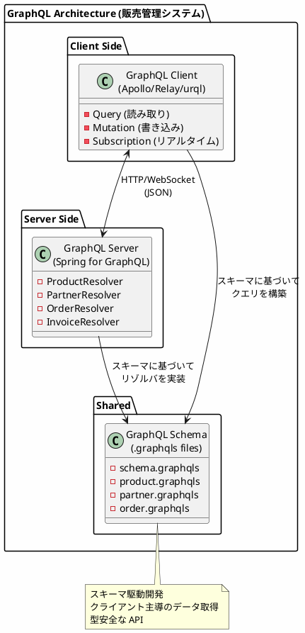
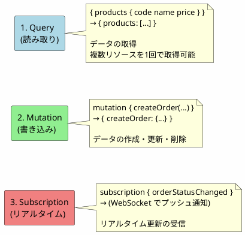
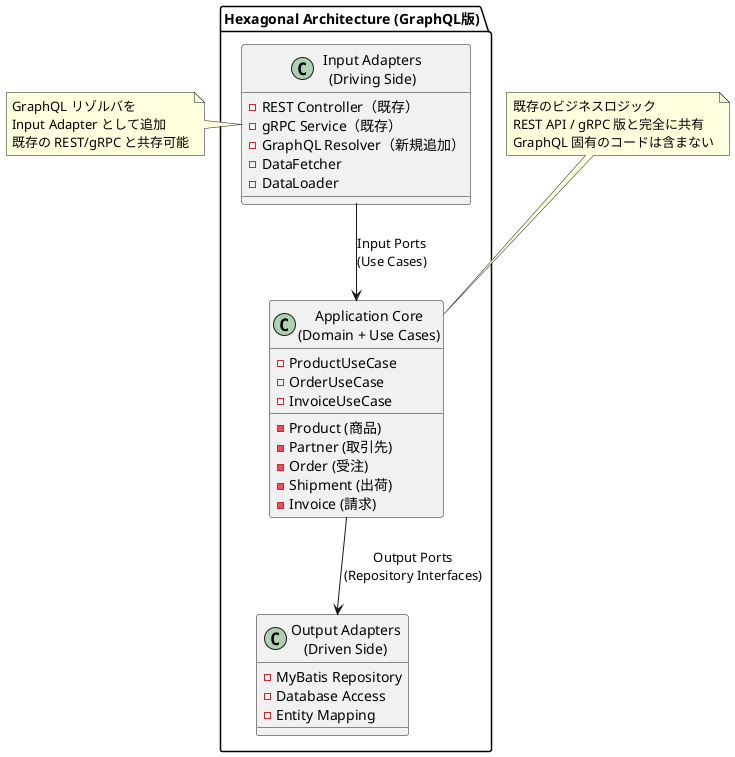
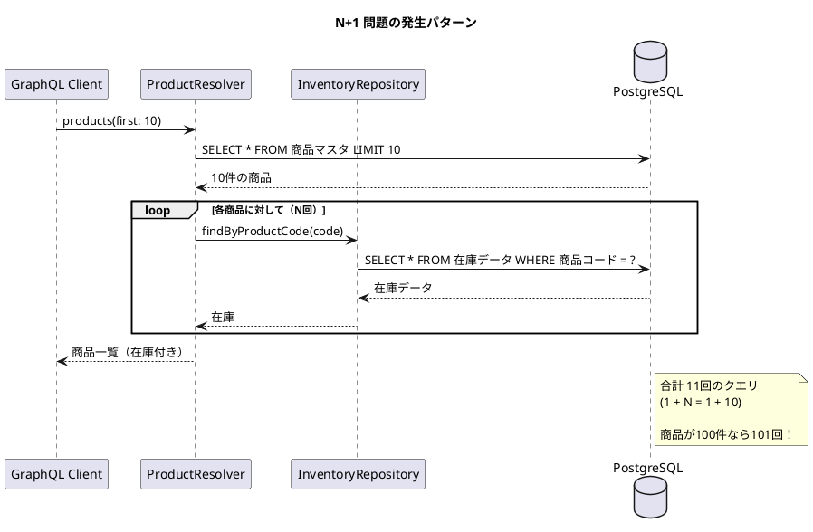
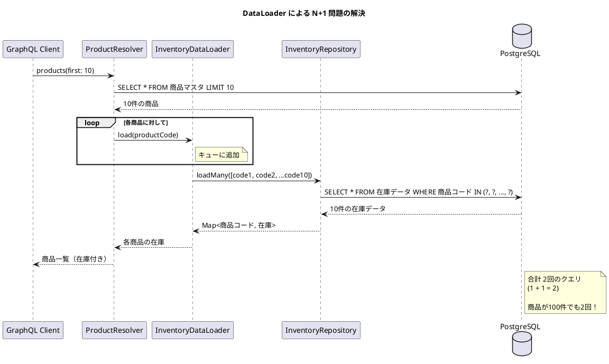
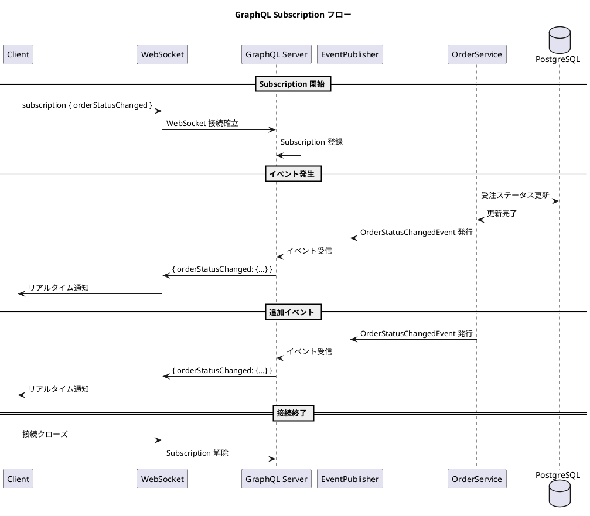
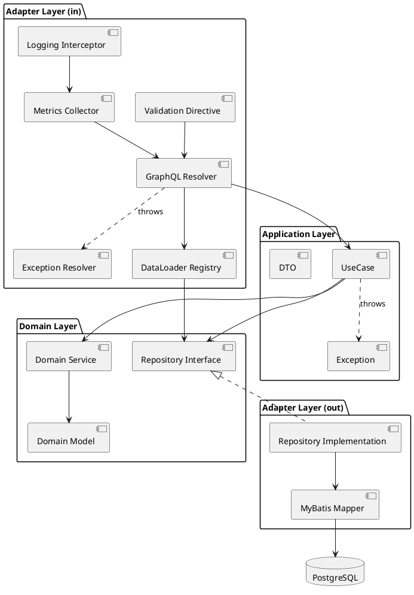

# 実践データベース設計：販売管理システム 研究 4 - GraphQL サービスの実装

## はじめに

本研究では、REST API（第10部-A）や gRPC（研究 3）とは異なるアプローチとして、**GraphQL** による販売管理システムを実装します。クライアントが必要なデータを正確に指定できる柔軟なクエリと、リアルタイム更新を実現する Subscription を活用します。

研究 1 で構築したヘキサゴナルアーキテクチャ（ドメイン層・アプリケーション層）はそのまま共有し、**Input Adapter として GraphQL リゾルバ層のみを追加**します。

---

## 第14章：GraphQL サーバーの基礎

### 14.1 GraphQL とは

GraphQL は Facebook が開発したクエリ言語および実行エンジンです。クライアントが必要なデータの形状を指定でき、Over-fetching（不要なデータの取得）や Under-fetching（必要なデータの不足）を防ぎます。



**REST API / gRPC / GraphQL の比較：**

| 特徴 | REST API | gRPC | GraphQL |
|------|----------|------|---------|
| プロトコル | HTTP/1.1 | HTTP/2 | HTTP/1.1 or HTTP/2 |
| データ形式 | JSON | Protocol Buffers | JSON |
| スキーマ | OpenAPI (任意) | .proto (必須) | .graphqls (必須) |
| データ取得 | 固定レスポンス | 固定レスポンス | クライアント指定 |
| エンドポイント | 複数 | 複数 | 単一 |
| リアルタイム | WebSocket 別実装 | ストリーミング | Subscription |
| 主な用途 | 汎用 API | マイクロサービス | フロントエンド向け |

---

### 14.2 3つの操作タイプ

GraphQL は 3 つの操作タイプをサポートします：



**用途：**

1. **Query**: データ取得（商品一覧、受注明細、在庫照会）
2. **Mutation**: データ更新（受注登録、出荷確定、入金処理）
3. **Subscription**: リアルタイム通知（受注ステータス変更、在庫変動）

---

### 14.3 GraphQL におけるヘキサゴナルアーキテクチャ

GraphQL を導入しても、既存のヘキサゴナルアーキテクチャ（ドメイン層・アプリケーション層）はそのまま共有し、**Input Adapter として GraphQL リゾルバ層のみを追加**します。



**GraphQL でもヘキサゴナルアーキテクチャを維持する理由：**

1. **再利用性**: 既存の UseCase/Repository をそのまま活用
2. **並行運用**: REST API、gRPC、GraphQL を同時提供可能
3. **テスト容易性**: ドメインロジックは通信プロトコルに依存しない
4. **移行容易性**: 段階的に API 形式を追加・変更可能

---

### 14.4 ディレクトリ構成

既存の構成に `infrastructure/graphql/` を追加するだけです。

<details>
<summary>コード例: ディレクトリ構成</summary>

```
src/main/java/com/example/sales/
├── domain/                     # ドメイン層（API版と共通）
│   ├── model/
│   │   ├── product/
│   │   ├── partner/
│   │   ├── order/
│   │   ├── shipment/
│   │   └── invoice/
│   └── exception/
│
├── application/               # アプリケーション層（API版と共通）
│   ├── port/
│   │   ├── in/               # Input Port（ユースケース）
│   │   └── out/              # Output Port（リポジトリ）
│   └── service/
│
├── infrastructure/
│   ├── persistence/          # Output Adapter（DB実装）- 既存
│   │   ├── mapper/
│   │   └── repository/
│   ├── rest/                 # Input Adapter（REST実装）- 既存
│   ├── grpc/                 # Input Adapter（gRPC実装）- 既存
│   └── graphql/              # Input Adapter（GraphQL実装）- 新規追加
│       ├── resolver/         # Query/Mutation リゾルバ
│       ├── dataloader/       # N+1 問題対策
│       ├── scalar/           # カスタムスカラー型
│       └── subscription/     # Subscription ハンドラ
│
├── config/
│
└── src/main/resources/
    └── graphql/              # GraphQL スキーマ定義
        ├── schema.graphqls
        ├── product.graphqls
        ├── partner.graphqls
        ├── order.graphqls
        ├── shipment.graphqls
        └── invoice.graphqls
```

</details>

---

### 14.5 技術スタックの追加

既存の `build.gradle.kts` に GraphQL 関連の依存関係を追加します。

#### build.gradle.kts（差分）

<details>
<summary>コード例: build.gradle.kts</summary>

```kotlin
dependencies {
    // 既存の依存関係（Spring Boot, MyBatis, PostgreSQL等）はそのまま

    // GraphQL 関連を追加
    implementation("org.springframework.boot:spring-boot-starter-graphql")
    implementation("org.springframework.boot:spring-boot-starter-websocket")  // Subscription 用

    // GraphQL 拡張
    implementation("com.graphql-java:graphql-java-extended-scalars:21.0")

    // Test
    testImplementation("org.springframework.graphql:spring-graphql-test")
}
```

</details>

**追加パッケージの説明：**

| パッケージ | 用途 |
|-----------|------|
| spring-boot-starter-graphql | Spring Boot GraphQL 統合 |
| spring-boot-starter-websocket | Subscription (WebSocket) |
| graphql-java-extended-scalars | DateTime, BigDecimal 等のスカラー型 |
| spring-graphql-test | GraphQL テストサポート |

#### application.yml（差分）

<details>
<summary>コード例: application.yml</summary>

```yaml
spring:
  graphql:
    graphiql:
      enabled: true
      path: /graphiql
    websocket:
      path: /graphql
      connection-init-timeout: 60s
      keep-alive:
        enabled: true
        interval: 30s
    schema:
      printer:
        enabled: true
      locations:
        - classpath:graphql/
    cors:
      allowed-origins: "*"
      allowed-methods: GET, POST
```

</details>

---

### 14.6 GraphQL 設定クラス

<details>
<summary>コード例: GraphQLConfig.java</summary>

```java
package com.example.sales.config;

import graphql.scalars.ExtendedScalars;
import org.springframework.context.annotation.Bean;
import org.springframework.context.annotation.Configuration;
import org.springframework.graphql.execution.RuntimeWiringConfigurer;

/**
 * GraphQL 設定
 */
@Configuration
public class GraphQLConfig {

    @Bean
    public RuntimeWiringConfigurer runtimeWiringConfigurer() {
        return wiringBuilder -> wiringBuilder
            .scalar(ExtendedScalars.Date)
            .scalar(ExtendedScalars.DateTime)
            .scalar(ExtendedScalars.GraphQLBigDecimal)
            .scalar(ExtendedScalars.GraphQLLong);
    }
}
```

</details>

---

### 14.7 GraphQL スキーマ定義

#### src/main/resources/graphql/schema.graphqls

<details>
<summary>コード例: schema.graphqls</summary>

```graphql
# ルートスキーマ
type Query {
    # 商品
    product(productCode: ID!): Product
    products(category: ProductCategory, page: Int, size: Int): ProductConnection!

    # 取引先
    partner(partnerCode: ID!): Partner
    partners(type: PartnerType, page: Int, size: Int): PartnerConnection!

    # 倉庫
    warehouse(warehouseCode: ID!): Warehouse
    warehouses(page: Int, size: Int): WarehouseConnection!

    # 受注
    order(orderNumber: ID!): Order
    orders(status: OrderStatus, partnerCode: ID, page: Int, size: Int): OrderConnection!

    # 出荷
    shipment(shipmentNumber: ID!): Shipment
    shipments(status: ShipmentStatus, page: Int, size: Int): ShipmentConnection!

    # 請求
    invoice(invoiceNumber: ID!): Invoice
    invoices(status: InvoiceStatus, partnerCode: ID, page: Int, size: Int): InvoiceConnection!
}

type Mutation {
    # 商品
    createProduct(input: CreateProductInput!): Product!
    updateProduct(input: UpdateProductInput!): Product!
    deleteProduct(productCode: ID!): Boolean!

    # 取引先
    createPartner(input: CreatePartnerInput!): Partner!
    updatePartner(input: UpdatePartnerInput!): Partner!

    # 受注
    createOrder(input: CreateOrderInput!): Order!
    confirmOrder(orderNumber: ID!): Order!
    cancelOrder(orderNumber: ID!, reason: String): Order!

    # 出荷
    createShipment(input: CreateShipmentInput!): Shipment!
    startPicking(shipmentNumber: ID!): Shipment!
    confirmShipment(shipmentNumber: ID!): Shipment!

    # 請求
    executeClosing(input: ExecuteClosingInput!): ClosingResult!
    issueInvoice(invoiceNumber: ID!): Invoice!
    recordReceipt(input: RecordReceiptInput!): Receipt!
}

type Subscription {
    # 受注ステータス変更
    orderStatusChanged(orderNumber: ID): OrderStatusChange!

    # 出荷進捗
    shipmentProgressUpdated(shipmentNumber: ID): ShipmentProgress!

    # 在庫変動
    inventoryChanged(warehouseCode: ID, productCode: ID): InventoryChange!

    # 締処理進捗
    closingProgressUpdated(closingId: ID!): ClosingProgress!
}

# ページネーション共通型
type PageInfo {
    hasNextPage: Boolean!
    hasPreviousPage: Boolean!
    totalElements: Int!
    totalPages: Int!
    currentPage: Int!
}

# カスタムスカラー
scalar Date
scalar DateTime
scalar BigDecimal
scalar Long
```

</details>

#### src/main/resources/graphql/product.graphqls

<details>
<summary>コード例: product.graphqls</summary>

```graphql
# 商品区分
enum ProductCategory {
    PRODUCT      # 製品
    MATERIAL     # 原材料
    PART         # 部品
}

# 税区分
enum TaxCategory {
    TAXABLE      # 課税
    TAX_EXEMPT   # 非課税
    TAX_FREE     # 免税
}

# 商品
type Product {
    productCode: ID!
    productName: String!
    productNameKana: String
    category: ProductCategory!
    taxCategory: TaxCategory!
    unitCode: String
    sellingPrice: BigDecimal!
    purchasePrice: BigDecimal
    costPrice: BigDecimal
    safetyStock: Int
    reorderPoint: Int
    isActive: Boolean!
    createdAt: DateTime!
    updatedAt: DateTime!

    # 関連データ（必要な場合のみ取得）
    inventories: [Inventory!]!
    classifications: [ProductClassification!]!
    customerPrices: [CustomerPrice!]!
}

# 商品一覧（ページネーション付き）
type ProductConnection {
    edges: [ProductEdge!]!
    pageInfo: PageInfo!
}

type ProductEdge {
    node: Product!
    cursor: String!
}

# 入力型
input CreateProductInput {
    productCode: ID!
    productName: String!
    productNameKana: String
    category: ProductCategory!
    taxCategory: TaxCategory!
    unitCode: String
    sellingPrice: BigDecimal!
    purchasePrice: BigDecimal
    costPrice: BigDecimal
    safetyStock: Int
    reorderPoint: Int
}

input UpdateProductInput {
    productCode: ID!
    productName: String
    category: ProductCategory
    taxCategory: TaxCategory
    sellingPrice: BigDecimal
    isActive: Boolean
}
```

</details>

#### src/main/resources/graphql/order.graphqls

<details>
<summary>コード例: order.graphqls</summary>

```graphql
# 受注ステータス
enum OrderStatus {
    DRAFT        # 仮登録
    CONFIRMED    # 確定
    SHIPPED      # 出荷済
    CANCELLED    # キャンセル
}

# 受注
type Order {
    orderNumber: ID!
    partnerCode: ID!
    orderDate: Date!
    deliveryDate: Date!
    warehouseCode: ID!
    status: OrderStatus!
    totalAmount: BigDecimal!
    taxAmount: BigDecimal!
    grandTotal: BigDecimal!
    salesPersonCode: String
    remarks: String
    createdAt: DateTime!
    updatedAt: DateTime!

    # 関連データ
    partner: Partner!
    warehouse: Warehouse!
    details: [OrderDetail!]!
    shipments: [Shipment!]!
}

# 受注明細
type OrderDetail {
    orderNumber: ID!
    lineNumber: Int!
    productCode: ID!
    quantity: Int!
    unitPrice: BigDecimal!
    amount: BigDecimal!
    taxCategory: TaxCategory!
    deliveryDate: Date
    remarks: String

    # 関連データ
    product: Product!
}

# 受注ステータス変更イベント
type OrderStatusChange {
    orderNumber: ID!
    previousStatus: OrderStatus!
    currentStatus: OrderStatus!
    changedBy: String
    changedAt: DateTime!
    reason: String
}

# 入力型
input CreateOrderInput {
    partnerCode: ID!
    orderDate: Date!
    deliveryDate: Date!
    warehouseCode: ID!
    salesPersonCode: String
    remarks: String
    details: [OrderDetailInput!]!
}

input OrderDetailInput {
    productCode: ID!
    quantity: Int!
    unitPrice: BigDecimal
    deliveryDate: Date
    remarks: String
}
```

</details>

---

### 14.8 基本的なリゾルバの実装

#### Query リゾルバ

<details>
<summary>コード例: QueryResolver.java</summary>

```java
package com.example.sales.infrastructure.graphql.resolver;

import com.example.sales.application.port.in.ProductUseCase;
import com.example.sales.application.port.in.PartnerUseCase;
import com.example.sales.domain.model.product.Product;
import com.example.sales.domain.model.partner.Partner;
import com.example.sales.infrastructure.graphql.dto.*;
import org.springframework.graphql.data.method.annotation.Argument;
import org.springframework.graphql.data.method.annotation.QueryMapping;
import org.springframework.stereotype.Controller;

import java.util.List;

/**
 * GraphQL Query リゾルバ
 */
@Controller
public class QueryResolver {

    private final ProductUseCase productUseCase;
    private final PartnerUseCase partnerUseCase;

    public QueryResolver(ProductUseCase productUseCase, PartnerUseCase partnerUseCase) {
        this.productUseCase = productUseCase;
        this.partnerUseCase = partnerUseCase;
    }

    // === 商品 ===

    @QueryMapping
    public Product product(@Argument String productCode) {
        return productUseCase.findByCode(productCode).orElse(null);
    }

    @QueryMapping
    public ProductConnection products(
            @Argument String category,
            @Argument Integer page,
            @Argument Integer size) {

        int pageNum = page != null ? page : 0;
        int pageSize = size != null ? size : 20;

        List<Product> products = productUseCase.findAll(category, pageNum, pageSize);
        long totalCount = productUseCase.count(category);

        return ProductConnection.of(products, pageNum, pageSize, totalCount);
    }

    // === 取引先 ===

    @QueryMapping
    public Partner partner(@Argument String partnerCode) {
        return partnerUseCase.findByCode(partnerCode).orElse(null);
    }

    @QueryMapping
    public PartnerConnection partners(
            @Argument String type,
            @Argument Integer page,
            @Argument Integer size) {

        int pageNum = page != null ? page : 0;
        int pageSize = size != null ? size : 20;

        List<Partner> partners = partnerUseCase.findAll(type, pageNum, pageSize);
        long totalCount = partnerUseCase.count(type);

        return PartnerConnection.of(partners, pageNum, pageSize, totalCount);
    }
}
```

</details>

#### Connection DTO（ページネーション）

<details>
<summary>コード例: ProductConnection.java</summary>

```java
package com.example.sales.infrastructure.graphql.dto;

import com.example.sales.domain.model.product.Product;

import java.util.Base64;
import java.util.List;

/**
 * 商品ページネーション結果（Connection パターン）
 */
public record ProductConnection(
    List<ProductEdge> edges,
    PageInfo pageInfo
) {
    public static ProductConnection of(
            List<Product> products,
            int page,
            int size,
            long totalCount) {

        List<ProductEdge> edges = products.stream()
            .map(product -> new ProductEdge(
                product,
                encodeCursor(product.getProductCode())
            ))
            .toList();

        int totalPages = (int) Math.ceil((double) totalCount / size);

        PageInfo pageInfo = new PageInfo(
            page < totalPages - 1,  // hasNextPage
            page > 0,               // hasPreviousPage
            totalCount,
            totalPages,
            page
        );

        return new ProductConnection(edges, pageInfo);
    }

    private static String encodeCursor(String productCode) {
        return Base64.getEncoder().encodeToString(productCode.getBytes());
    }
}

public record ProductEdge(
    Product node,
    String cursor
) {}

public record PageInfo(
    boolean hasNextPage,
    boolean hasPreviousPage,
    long totalElements,
    int totalPages,
    int currentPage
) {}
```

</details>

---

### 14.9 Spring for GraphQL の統合テスト

<details>
<summary>コード例: QueryResolverTest.java</summary>

```java
package com.example.sales.infrastructure.graphql;

import org.junit.jupiter.api.Test;
import org.springframework.beans.factory.annotation.Autowired;
import org.springframework.boot.test.autoconfigure.graphql.tester.AutoConfigureHttpGraphQlTester;
import org.springframework.boot.test.context.SpringBootTest;
import org.springframework.graphql.test.tester.HttpGraphQlTester;
import org.springframework.test.context.DynamicPropertyRegistry;
import org.springframework.test.context.DynamicPropertySource;
import org.testcontainers.containers.PostgreSQLContainer;
import org.testcontainers.junit.jupiter.Container;
import org.testcontainers.junit.jupiter.Testcontainers;

@SpringBootTest(webEnvironment = SpringBootTest.WebEnvironment.RANDOM_PORT)
@AutoConfigureHttpGraphQlTester
@Testcontainers
class QueryResolverTest {

    @Container
    static PostgreSQLContainer<?> postgres = new PostgreSQLContainer<>("postgres:16-alpine");

    @DynamicPropertySource
    static void configureProperties(DynamicPropertyRegistry registry) {
        registry.add("spring.datasource.url", postgres::getJdbcUrl);
        registry.add("spring.datasource.username", postgres::getUsername);
        registry.add("spring.datasource.password", postgres::getPassword);
    }

    @Autowired
    private HttpGraphQlTester graphQlTester;

    @Test
    void testQueryProduct() {
        // language=GraphQL
        String query = """
            query {
                product(productCode: "PRD001") {
                    productCode
                    productName
                    sellingPrice
                    category
                }
            }
            """;

        graphQlTester.document(query)
            .execute()
            .path("product.productCode")
            .entity(String.class)
            .isEqualTo("PRD001");
    }

    @Test
    void testQueryProducts() {
        // language=GraphQL
        String query = """
            query {
                products(category: PRODUCT, page: 0, size: 10) {
                    edges {
                        node {
                            productCode
                            productName
                        }
                        cursor
                    }
                    pageInfo {
                        hasNextPage
                        totalElements
                    }
                }
            }
            """;

        graphQlTester.document(query)
            .execute()
            .path("products.edges")
            .entityList(Object.class)
            .hasSizeGreaterThan(0);
    }

    @Test
    void testQueryProductWithRelations() {
        // 関連データも含めて取得
        // language=GraphQL
        String query = """
            query {
                product(productCode: "PRD001") {
                    productCode
                    productName
                    inventories {
                        warehouseCode
                        quantity
                        availableQuantity
                    }
                    classifications {
                        classificationCode
                        classificationName
                    }
                }
            }
            """;

        graphQlTester.document(query)
            .execute()
            .path("product.productCode")
            .entity(String.class)
            .isEqualTo("PRD001");
    }
}
```

</details>

---

## 第15章：マスタ API の実装

### 15.1 N+1 問題とは

GraphQL では、ネストしたデータを取得する際に **N+1 問題** が発生しやすくなります。例えば、10件の商品を取得し、それぞれの在庫情報を取得すると、1回（商品一覧）+ 10回（各商品の在庫）= 11回のクエリが実行されます。



---

### 15.2 DataLoader による解決

**DataLoader** は、複数の個別リクエストをバッチ処理にまとめることで N+1 問題を解決します。



---

### 15.3 DataLoader の実装

#### 在庫 DataLoader

<details>
<summary>コード例: InventoryDataLoader.java</summary>

```java
package com.example.sales.infrastructure.graphql.dataloader;

import com.example.sales.application.port.out.InventoryRepository;
import com.example.sales.domain.model.inventory.Inventory;
import org.dataloader.BatchLoaderEnvironment;
import org.dataloader.MappedBatchLoader;
import org.springframework.stereotype.Component;

import java.util.List;
import java.util.Map;
import java.util.Set;
import java.util.concurrent.CompletableFuture;
import java.util.concurrent.CompletionStage;
import java.util.stream.Collectors;

/**
 * 在庫データの DataLoader
 * 商品コードをキーにバッチ取得
 */
@Component
public class InventoryDataLoader implements MappedBatchLoader<String, List<Inventory>> {

    private final InventoryRepository inventoryRepository;

    public InventoryDataLoader(InventoryRepository inventoryRepository) {
        this.inventoryRepository = inventoryRepository;
    }

    @Override
    public CompletionStage<Map<String, List<Inventory>>> load(
            Set<String> productCodes,
            BatchLoaderEnvironment environment) {

        return CompletableFuture.supplyAsync(() -> {
            // 一括取得
            List<Inventory> inventories = inventoryRepository
                .findByProductCodes(productCodes);

            // 商品コードでグループ化
            return inventories.stream()
                .collect(Collectors.groupingBy(Inventory::getProductCode));
        });
    }
}
```

</details>

#### 取引先 DataLoader

<details>
<summary>コード例: PartnerDataLoader.java</summary>

```java
package com.example.sales.infrastructure.graphql.dataloader;

import com.example.sales.application.port.out.PartnerRepository;
import com.example.sales.domain.model.partner.Partner;
import org.dataloader.BatchLoaderEnvironment;
import org.dataloader.MappedBatchLoader;
import org.springframework.stereotype.Component;

import java.util.Map;
import java.util.Set;
import java.util.concurrent.CompletableFuture;
import java.util.concurrent.CompletionStage;
import java.util.function.Function;
import java.util.stream.Collectors;

/**
 * 取引先データの DataLoader
 */
@Component
public class PartnerDataLoader implements MappedBatchLoader<String, Partner> {

    private final PartnerRepository partnerRepository;

    public PartnerDataLoader(PartnerRepository partnerRepository) {
        this.partnerRepository = partnerRepository;
    }

    @Override
    public CompletionStage<Map<String, Partner>> load(
            Set<String> partnerCodes,
            BatchLoaderEnvironment environment) {

        return CompletableFuture.supplyAsync(() -> {
            return partnerRepository.findByCodes(partnerCodes).stream()
                .collect(Collectors.toMap(
                    Partner::getPartnerCode,
                    Function.identity()
                ));
        });
    }
}
```

</details>

---

### 15.4 DataLoader の登録

<details>
<summary>コード例: DataLoaderConfig.java</summary>

```java
package com.example.sales.config;

import com.example.sales.infrastructure.graphql.dataloader.*;
import org.dataloader.DataLoader;
import org.dataloader.DataLoaderOptions;
import org.dataloader.DataLoaderRegistry;
import org.springframework.context.annotation.Bean;
import org.springframework.context.annotation.Configuration;
import org.springframework.graphql.execution.BatchLoaderRegistry;

/**
 * DataLoader 設定
 */
@Configuration
public class DataLoaderConfig {

    public static final String INVENTORY_LOADER = "inventoryLoader";
    public static final String PARTNER_LOADER = "partnerLoader";
    public static final String PRODUCT_LOADER = "productLoader";
    public static final String WAREHOUSE_LOADER = "warehouseLoader";

    private final InventoryDataLoader inventoryDataLoader;
    private final PartnerDataLoader partnerDataLoader;
    private final ProductDataLoader productDataLoader;
    private final WarehouseDataLoader warehouseDataLoader;

    public DataLoaderConfig(
            InventoryDataLoader inventoryDataLoader,
            PartnerDataLoader partnerDataLoader,
            ProductDataLoader productDataLoader,
            WarehouseDataLoader warehouseDataLoader) {
        this.inventoryDataLoader = inventoryDataLoader;
        this.partnerDataLoader = partnerDataLoader;
        this.productDataLoader = productDataLoader;
        this.warehouseDataLoader = warehouseDataLoader;
    }

    @Bean
    public BatchLoaderRegistry batchLoaderRegistry() {
        return new BatchLoaderRegistry() {
            @Override
            public void registerDataLoaders(
                    DataLoaderRegistry registry,
                    graphql.GraphQLContext context) {

                DataLoaderOptions options = DataLoaderOptions.newOptions()
                    .setCachingEnabled(true)
                    .setBatchingEnabled(true)
                    .setMaxBatchSize(100);

                registry.register(INVENTORY_LOADER,
                    DataLoader.newMappedDataLoader(inventoryDataLoader, options));
                registry.register(PARTNER_LOADER,
                    DataLoader.newMappedDataLoader(partnerDataLoader, options));
                registry.register(PRODUCT_LOADER,
                    DataLoader.newMappedDataLoader(productDataLoader, options));
                registry.register(WAREHOUSE_LOADER,
                    DataLoader.newMappedDataLoader(warehouseDataLoader, options));
            }
        };
    }
}
```

</details>

---

### 15.5 商品リゾルバの実装（DataLoader 使用）

<details>
<summary>コード例: ProductResolver.java</summary>

```java
package com.example.sales.infrastructure.graphql.resolver;

import com.example.sales.application.port.in.ProductUseCase;
import com.example.sales.config.DataLoaderConfig;
import com.example.sales.domain.model.inventory.Inventory;
import com.example.sales.domain.model.product.Product;
import com.example.sales.infrastructure.graphql.dto.*;
import graphql.schema.DataFetchingEnvironment;
import org.dataloader.DataLoader;
import org.springframework.graphql.data.method.annotation.*;
import org.springframework.stereotype.Controller;

import java.util.List;
import java.util.concurrent.CompletableFuture;

/**
 * 商品 GraphQL リゾルバ
 */
@Controller
public class ProductResolver {

    private final ProductUseCase productUseCase;

    public ProductResolver(ProductUseCase productUseCase) {
        this.productUseCase = productUseCase;
    }

    // === Query ===

    @QueryMapping
    public Product product(@Argument String productCode) {
        return productUseCase.findByCode(productCode).orElse(null);
    }

    @QueryMapping
    public ProductConnection products(
            @Argument String category,
            @Argument Integer page,
            @Argument Integer size) {

        int pageNum = page != null ? page : 0;
        int pageSize = size != null ? size : 20;

        List<Product> products = productUseCase.findAll(category, pageNum, pageSize);
        long totalCount = productUseCase.count(category);

        return ProductConnection.of(products, pageNum, pageSize, totalCount);
    }

    // === Mutation ===

    @MutationMapping
    public Product createProduct(@Argument CreateProductInput input) {
        Product product = Product.builder()
            .productCode(input.productCode())
            .productName(input.productName())
            .category(input.category())
            .taxCategory(input.taxCategory())
            .sellingPrice(input.sellingPrice())
            .isActive(true)
            .build();

        return productUseCase.create(product);
    }

    @MutationMapping
    public Product updateProduct(@Argument UpdateProductInput input) {
        return productUseCase.update(input.productCode(), product -> {
            if (input.productName() != null) {
                product.setProductName(input.productName());
            }
            if (input.category() != null) {
                product.setCategory(input.category());
            }
            if (input.sellingPrice() != null) {
                product.setSellingPrice(input.sellingPrice());
            }
            if (input.isActive() != null) {
                product.setActive(input.isActive());
            }
            return product;
        });
    }

    @MutationMapping
    public boolean deleteProduct(@Argument String productCode) {
        return productUseCase.delete(productCode);
    }

    // === フィールドリゾルバ（DataLoader 使用）===

    @SchemaMapping(typeName = "Product", field = "inventories")
    public CompletableFuture<List<Inventory>> inventories(
            Product product,
            DataFetchingEnvironment env) {

        DataLoader<String, List<Inventory>> loader =
            env.getDataLoader(DataLoaderConfig.INVENTORY_LOADER);

        return loader.load(product.getProductCode());
    }

    @SchemaMapping(typeName = "Product", field = "classifications")
    public List<ProductClassification> classifications(Product product) {
        return productUseCase.findClassifications(product.getProductCode());
    }
}
```

</details>

---

## 第16章：トランザクション API の実装

### 16.1 GraphQL Subscription とは

GraphQL **Subscription** は、サーバーからクライアントへのリアルタイム通知を実現する仕組みです。WebSocket を使用して双方向通信を行い、データの変更をプッシュ通知します。



---

### 16.2 イベントクラスの定義

<details>
<summary>コード例: OrderStatusChangedEvent.java</summary>

```java
package com.example.sales.domain.event;

import com.example.sales.domain.model.order.OrderStatus;
import java.time.LocalDateTime;

/**
 * 受注ステータス変更イベント
 */
public record OrderStatusChangedEvent(
    String orderNumber,
    OrderStatus previousStatus,
    OrderStatus currentStatus,
    String changedBy,
    LocalDateTime changedAt,
    String reason
) {
    public static OrderStatusChangedEvent of(
            String orderNumber,
            OrderStatus previousStatus,
            OrderStatus currentStatus,
            String changedBy) {
        return new OrderStatusChangedEvent(
            orderNumber,
            previousStatus,
            currentStatus,
            changedBy,
            LocalDateTime.now(),
            null
        );
    }
}
```

</details>

<details>
<summary>コード例: InventoryChangedEvent.java</summary>

```java
package com.example.sales.domain.event;

import java.time.LocalDateTime;

/**
 * 在庫変動イベント
 */
public record InventoryChangedEvent(
    String warehouseCode,
    String productCode,
    InventoryChangeType changeType,
    int quantity,
    int previousQuantity,
    int currentQuantity,
    LocalDateTime timestamp
) {
    public enum InventoryChangeType {
        RECEIPT,      // 入庫
        SHIPMENT,     // 出庫
        ADJUSTMENT,   // 調整
        TRANSFER,     // 移動
        ALLOCATION,   // 引当
        RELEASE       // 引当解除
    }

    public static InventoryChangedEvent of(
            String warehouseCode,
            String productCode,
            InventoryChangeType changeType,
            int quantity,
            int previousQuantity,
            int currentQuantity) {
        return new InventoryChangedEvent(
            warehouseCode,
            productCode,
            changeType,
            quantity,
            previousQuantity,
            currentQuantity,
            LocalDateTime.now()
        );
    }
}
```

</details>

---

### 16.3 イベントパブリッシャー（Reactor Sinks）

<details>
<summary>コード例: GraphQLEventPublisher.java</summary>

```java
package com.example.sales.infrastructure.graphql.subscription;

import com.example.sales.domain.event.*;
import org.springframework.stereotype.Component;
import reactor.core.publisher.Flux;
import reactor.core.publisher.Sinks;

/**
 * GraphQL Subscription 用イベントパブリッシャー
 */
@Component
public class GraphQLEventPublisher {

    // 受注ステータス変更
    private final Sinks.Many<OrderStatusChangedEvent> orderStatusSink =
        Sinks.many().multicast().onBackpressureBuffer();

    // 出荷進捗
    private final Sinks.Many<ShipmentProgressEvent> shipmentProgressSink =
        Sinks.many().multicast().onBackpressureBuffer();

    // 在庫変動
    private final Sinks.Many<InventoryChangedEvent> inventoryChangedSink =
        Sinks.many().multicast().onBackpressureBuffer();

    // 締処理進捗
    private final Sinks.Many<ClosingProgressEvent> closingProgressSink =
        Sinks.many().multicast().onBackpressureBuffer();

    // === 発行メソッド ===

    public void publishOrderStatusChanged(OrderStatusChangedEvent event) {
        orderStatusSink.tryEmitNext(event);
    }

    public void publishShipmentProgress(ShipmentProgressEvent event) {
        shipmentProgressSink.tryEmitNext(event);
    }

    public void publishInventoryChanged(InventoryChangedEvent event) {
        inventoryChangedSink.tryEmitNext(event);
    }

    public void publishClosingProgress(ClosingProgressEvent event) {
        closingProgressSink.tryEmitNext(event);
    }

    // === Flux 取得メソッド ===

    public Flux<OrderStatusChangedEvent> getOrderStatusChangedFlux() {
        return orderStatusSink.asFlux();
    }

    public Flux<OrderStatusChangedEvent> getOrderStatusChangedFlux(String orderNumber) {
        return orderStatusSink.asFlux()
            .filter(event -> orderNumber == null ||
                             event.orderNumber().equals(orderNumber));
    }

    public Flux<ShipmentProgressEvent> getShipmentProgressFlux(String shipmentNumber) {
        return shipmentProgressSink.asFlux()
            .filter(event -> shipmentNumber == null ||
                             event.shipmentNumber().equals(shipmentNumber));
    }

    public Flux<InventoryChangedEvent> getInventoryChangedFlux(
            String warehouseCode, String productCode) {
        return inventoryChangedSink.asFlux()
            .filter(event ->
                (warehouseCode == null || event.warehouseCode().equals(warehouseCode)) &&
                (productCode == null || event.productCode().equals(productCode))
            );
    }

    public Flux<ClosingProgressEvent> getClosingProgressFlux(String closingId) {
        return closingProgressSink.asFlux()
            .filter(event -> event.closingId().equals(closingId));
    }
}
```

</details>

---

### 16.4 受注リゾルバの実装（Subscription 対応）

<details>
<summary>コード例: OrderResolver.java</summary>

```java
package com.example.sales.infrastructure.graphql.resolver;

import com.example.sales.application.port.in.OrderUseCase;
import com.example.sales.domain.event.OrderStatusChangedEvent;
import com.example.sales.domain.model.order.*;
import com.example.sales.infrastructure.graphql.dto.*;
import com.example.sales.infrastructure.graphql.subscription.GraphQLEventPublisher;
import org.springframework.graphql.data.method.annotation.*;
import org.springframework.stereotype.Controller;
import reactor.core.publisher.Flux;

import java.util.List;

/**
 * 受注 GraphQL リゾルバ
 */
@Controller
public class OrderResolver {

    private final OrderUseCase orderUseCase;
    private final GraphQLEventPublisher eventPublisher;

    public OrderResolver(OrderUseCase orderUseCase,
                         GraphQLEventPublisher eventPublisher) {
        this.orderUseCase = orderUseCase;
        this.eventPublisher = eventPublisher;
    }

    // === Query ===

    @QueryMapping
    public Order order(@Argument String orderNumber) {
        return orderUseCase.findByNumber(orderNumber).orElse(null);
    }

    @QueryMapping
    public OrderConnection orders(
            @Argument String status,
            @Argument String partnerCode,
            @Argument Integer page,
            @Argument Integer size) {

        int pageNum = page != null ? page : 0;
        int pageSize = size != null ? size : 20;

        OrderStatus orderStatus = status != null ? OrderStatus.valueOf(status) : null;
        List<Order> orders = orderUseCase.findAll(orderStatus, partnerCode, pageNum, pageSize);
        long totalCount = orderUseCase.count(orderStatus, partnerCode);

        return OrderConnection.of(orders, pageNum, pageSize, totalCount);
    }

    // === Mutation ===

    @MutationMapping
    public Order createOrder(@Argument CreateOrderInput input) {
        return orderUseCase.create(
            input.partnerCode(),
            input.orderDate(),
            input.deliveryDate(),
            input.warehouseCode(),
            input.salesPersonCode(),
            input.remarks(),
            input.details()
        );
    }

    @MutationMapping
    public Order confirmOrder(@Argument String orderNumber) {
        Order order = orderUseCase.confirm(orderNumber);

        // イベント発行
        eventPublisher.publishOrderStatusChanged(
            OrderStatusChangedEvent.of(
                orderNumber,
                OrderStatus.DRAFT,
                OrderStatus.CONFIRMED,
                "system"
            )
        );

        return order;
    }

    @MutationMapping
    public Order cancelOrder(@Argument String orderNumber, @Argument String reason) {
        Order order = orderUseCase.cancel(orderNumber, reason);

        // イベント発行
        eventPublisher.publishOrderStatusChanged(
            OrderStatusChangedEvent.withReason(
                orderNumber,
                order.getStatus(),
                OrderStatus.CANCELLED,
                "system",
                reason
            )
        );

        return order;
    }

    // === Subscription ===

    @SubscriptionMapping
    public Flux<OrderStatusChangedEvent> orderStatusChanged(
            @Argument String orderNumber) {
        return eventPublisher.getOrderStatusChangedFlux(orderNumber);
    }
}
```

</details>

---

### 16.5 GraphiQL によるトランザクション操作

<details>
<summary>コード例: GraphQL クエリ/ミューテーション/サブスクリプション</summary>

```graphql
# 受注登録
mutation CreateOrder {
  createOrder(input: {
    partnerCode: "CUS001"
    orderDate: "2025-12-29"
    deliveryDate: "2026-01-05"
    warehouseCode: "WH001"
    details: [
      { productCode: "PRD001", quantity: 10, unitPrice: 1000 }
      { productCode: "PRD002", quantity: 5, unitPrice: 2000 }
    ]
  }) {
    orderNumber
    status
    totalAmount
    details {
      productCode
      quantity
      amount
    }
  }
}

# 受注確定
mutation ConfirmOrder {
  confirmOrder(orderNumber: "ORD20251229001") {
    orderNumber
    status
    partner {
      partnerName
    }
  }
}

# 受注ステータス監視（Subscription）
subscription WatchOrderStatus {
  orderStatusChanged(orderNumber: "ORD20251229001") {
    orderNumber
    previousStatus
    currentStatus
    changedAt
    changedBy
    reason
  }
}

# 在庫変動監視
subscription WatchInventory {
  inventoryChanged(warehouseCode: "WH001") {
    warehouseCode
    productCode
    changeType
    quantity
    previousQuantity
    currentQuantity
    timestamp
  }
}
```

</details>

---

## 第17章：エラーハンドリングとベストプラクティス

### 17.1 GraphQL エラーハンドリング

GraphQL のエラーレスポンスは標準化された構造を持ちます：

<details>
<summary>コード例: エラーレスポンス構造</summary>

```json
{
  "errors": [
    {
      "message": "商品コードが重複しています",
      "locations": [{ "line": 2, "column": 3 }],
      "path": ["createProduct"],
      "extensions": {
        "classification": "VALIDATION_ERROR",
        "code": "PRODUCT_CODE_DUPLICATE",
        "field": "productCode"
      }
    }
  ],
  "data": null
}
```

</details>

#### カスタム例外クラス

<details>
<summary>コード例: GraphQLErrorCode.java</summary>

```java
package com.example.sales.application.exception;

public enum GraphQLErrorCode {
    // バリデーションエラー
    VALIDATION_ERROR("VALIDATION_ERROR"),
    REQUIRED_FIELD_MISSING("REQUIRED_FIELD_MISSING"),
    INVALID_FORMAT("INVALID_FORMAT"),
    VALUE_OUT_OF_RANGE("VALUE_OUT_OF_RANGE"),
    DUPLICATE_VALUE("DUPLICATE_VALUE"),

    // ビジネスロジックエラー
    BUSINESS_RULE_VIOLATION("BUSINESS_RULE_VIOLATION"),
    INSUFFICIENT_STOCK("INSUFFICIENT_STOCK"),
    INVALID_STATUS_TRANSITION("INVALID_STATUS_TRANSITION"),
    CREDIT_LIMIT_EXCEEDED("CREDIT_LIMIT_EXCEEDED"),

    // リソースエラー
    NOT_FOUND("NOT_FOUND"),
    ALREADY_EXISTS("ALREADY_EXISTS"),
    CONFLICT("CONFLICT"),

    // 認証・認可エラー
    UNAUTHORIZED("UNAUTHORIZED"),
    FORBIDDEN("FORBIDDEN"),

    // システムエラー
    INTERNAL_ERROR("INTERNAL_ERROR"),
    SERVICE_UNAVAILABLE("SERVICE_UNAVAILABLE");

    private final String code;

    GraphQLErrorCode(String code) {
        this.code = code;
    }

    public String getCode() {
        return code;
    }
}
```

</details>

<details>
<summary>コード例: GraphQLBusinessException.java</summary>

```java
package com.example.sales.application.exception;

import graphql.ErrorClassification;
import graphql.GraphQLError;
import graphql.language.SourceLocation;

import java.util.HashMap;
import java.util.List;
import java.util.Map;

public class GraphQLBusinessException extends RuntimeException implements GraphQLError {

    private final GraphQLErrorCode errorCode;
    private final String field;
    private final Map<String, Object> additionalData;

    public GraphQLBusinessException(String message, GraphQLErrorCode errorCode) {
        this(message, errorCode, null, null);
    }

    public GraphQLBusinessException(String message, GraphQLErrorCode errorCode, String field) {
        this(message, errorCode, field, null);
    }

    public GraphQLBusinessException(
            String message,
            GraphQLErrorCode errorCode,
            String field,
            Map<String, Object> additionalData) {
        super(message);
        this.errorCode = errorCode;
        this.field = field;
        this.additionalData = additionalData != null ? additionalData : new HashMap<>();
    }

    @Override
    public List<SourceLocation> getLocations() {
        return null;
    }

    @Override
    public ErrorClassification getErrorType() {
        return CustomErrorClassification.fromCode(errorCode);
    }

    @Override
    public Map<String, Object> getExtensions() {
        Map<String, Object> extensions = new HashMap<>();
        extensions.put("code", errorCode.getCode());
        extensions.put("classification", getErrorType().toString());
        if (field != null) {
            extensions.put("field", field);
        }
        extensions.putAll(additionalData);
        return extensions;
    }
}
```

</details>

---

### 17.2 例外リゾルバ

<details>
<summary>コード例: GraphQLExceptionResolver.java</summary>

```java
package com.example.sales.infrastructure.graphql.exception;

import com.example.sales.application.exception.GraphQLBusinessException;
import com.example.sales.application.exception.GraphQLErrorCode;
import graphql.GraphQLError;
import graphql.schema.DataFetchingEnvironment;
import org.springframework.graphql.execution.DataFetcherExceptionResolverAdapter;
import org.springframework.graphql.execution.ErrorType;
import org.springframework.stereotype.Component;

@Component
public class GraphQLExceptionResolver extends DataFetcherExceptionResolverAdapter {

    @Override
    protected GraphQLError resolveToSingleError(Throwable ex, DataFetchingEnvironment env) {
        // カスタムビジネス例外
        if (ex instanceof GraphQLBusinessException businessEx) {
            return businessEx;
        }

        // ドメイン例外をラップ
        if (ex instanceof IllegalArgumentException) {
            return new GraphQLBusinessException(
                ex.getMessage(),
                GraphQLErrorCode.VALIDATION_ERROR
            );
        }

        if (ex instanceof IllegalStateException) {
            return new GraphQLBusinessException(
                ex.getMessage(),
                GraphQLErrorCode.BUSINESS_RULE_VIOLATION
            );
        }

        // Jakarta Validation 例外
        if (ex instanceof jakarta.validation.ConstraintViolationException cve) {
            var firstViolation = cve.getConstraintViolations().iterator().next();
            return new GraphQLBusinessException(
                firstViolation.getMessage(),
                GraphQLErrorCode.VALIDATION_ERROR,
                firstViolation.getPropertyPath().toString()
            );
        }

        // 未知の例外はログ出力して汎用メッセージを返す
        logger.error("Unexpected error in GraphQL resolver", ex);
        return GraphQLError.newError()
            .message("システムエラーが発生しました")
            .errorType(ErrorType.INTERNAL_ERROR)
            .build();
    }
}
```

</details>

---

### 17.3 入力バリデーション

#### GraphQL ディレクティブによるバリデーション

<details>
<summary>コード例: directives.graphqls</summary>

```graphql
# schema/directives.graphqls
directive @NotBlank(message: String = "必須項目です") on INPUT_FIELD_DEFINITION | ARGUMENT_DEFINITION
directive @Size(min: Int = 0, max: Int = 255, message: String) on INPUT_FIELD_DEFINITION | ARGUMENT_DEFINITION
directive @Min(value: Int!, message: String) on INPUT_FIELD_DEFINITION | ARGUMENT_DEFINITION
directive @Pattern(regexp: String!, message: String) on INPUT_FIELD_DEFINITION | ARGUMENT_DEFINITION
directive @Email(message: String = "有効なメールアドレスを入力してください") on INPUT_FIELD_DEFINITION | ARGUMENT_DEFINITION

# 使用例
input CreateProductInput {
  productCode: String! @NotBlank @Size(min: 1, max: 16, message: "商品コードは16文字以内で入力してください")
  productName: String! @NotBlank @Size(max: 100)
  price: BigDecimal! @Min(value: 0, message: "価格は0以上で入力してください")
}

input CreatePartnerInput {
  partnerCode: String! @NotBlank @Pattern(regexp: "^[A-Z0-9]{4,10}$", message: "取引先コードは英大文字と数字4〜10文字で入力してください")
  partnerName: String! @NotBlank @Size(max: 100)
  email: String @Email
  creditLimit: BigDecimal @Min(value: 0)
}
```

</details>

#### Jakarta Validation との統合

<details>
<summary>コード例: CreateProductInputDto.java</summary>

```java
package com.example.sales.application.dto;

import jakarta.validation.constraints.*;
import java.math.BigDecimal;

public record CreateProductInputDto(
    @NotBlank(message = "商品コードは必須です")
    @Size(max = 16, message = "商品コードは16文字以内で入力してください")
    @Pattern(regexp = "^[A-Z0-9]+$", message = "商品コードは英大文字と数字のみ使用可能です")
    String productCode,

    @NotBlank(message = "商品名は必須です")
    @Size(max = 100, message = "商品名は100文字以内で入力してください")
    String productName,

    @NotNull(message = "価格は必須です")
    @DecimalMin(value = "0", message = "価格は0以上で入力してください")
    @Digits(integer = 10, fraction = 2, message = "価格の形式が正しくありません")
    BigDecimal price,

    @Min(value = 0, message = "在庫数は0以上で入力してください")
    Integer stockQuantity,

    @Size(max = 500, message = "備考は500文字以内で入力してください")
    String notes
) {}
```

</details>

---

### 17.4 セキュリティ

#### 認可ディレクティブ

<details>
<summary>コード例: 認可ディレクティブ</summary>

```graphql
# スキーマレベルでの認可定義
directive @auth(
  roles: [String!]!
) on FIELD_DEFINITION

type Mutation {
  # 管理者のみ
  deleteProduct(productCode: ID!): Boolean! @auth(roles: ["ADMIN"])

  # 営業担当と管理者
  createOrder(input: CreateOrderInput!): Order! @auth(roles: ["SALES", "ADMIN"])

  # 経理担当と管理者
  executeClosing(input: ExecuteClosingInput!): ClosingResult! @auth(roles: ["ACCOUNTING", "ADMIN"])
}
```

</details>

#### クエリ深度制限

<details>
<summary>コード例: クエリ深度制限</summary>

```java
@Bean
public Instrumentation maxQueryDepthInstrumentation() {
    return new MaxQueryDepthInstrumentation(10);
}

@Bean
public Instrumentation maxQueryComplexityInstrumentation() {
    return new MaxQueryComplexityInstrumentation(100);
}
```

</details>

---

### 17.5 運用のベストプラクティス

#### ログインターセプター

<details>
<summary>コード例: GraphQLLoggingInterceptor.java</summary>

```java
@Component
public class GraphQLLoggingInterceptor implements WebGraphQlInterceptor {

    private static final Logger logger = LoggerFactory.getLogger(GraphQLLoggingInterceptor.class);

    @Override
    public Mono<WebGraphQlResponse> intercept(WebGraphQlRequest request, Chain chain) {
        String requestId = UUID.randomUUID().toString().substring(0, 8);
        String operationName = request.getOperationName();
        Instant start = Instant.now();

        MDC.put("requestId", requestId);
        MDC.put("operationName", operationName);

        logger.info("GraphQL リクエスト開始: operation={}", operationName);

        return chain.next(request)
            .doOnNext(response -> {
                Duration duration = Duration.between(start, Instant.now());

                if (response.getErrors().isEmpty()) {
                    logger.info("GraphQL リクエスト完了: operation={}, duration={}ms",
                        operationName, duration.toMillis());
                } else {
                    logger.warn("GraphQL リクエスト完了（エラーあり）: operation={}, duration={}ms, errors={}",
                        operationName, duration.toMillis(), response.getErrors().size());
                }
            })
            .doFinally(signalType -> {
                MDC.remove("requestId");
                MDC.remove("operationName");
            });
    }
}
```

</details>

#### メトリクス収集

<details>
<summary>コード例: GraphQLMetricsCollector.java</summary>

```java
@Component
public class GraphQLMetricsCollector implements WebGraphQlInterceptor {

    private final Timer queryTimer;
    private final Timer mutationTimer;
    private final Counter errorCounter;
    private final Counter successCounter;

    public GraphQLMetricsCollector(MeterRegistry registry) {
        this.queryTimer = Timer.builder("graphql.query.duration")
            .description("GraphQL クエリ実行時間")
            .register(registry);

        this.mutationTimer = Timer.builder("graphql.mutation.duration")
            .description("GraphQL ミューテーション実行時間")
            .register(registry);

        this.errorCounter = Counter.builder("graphql.errors")
            .description("GraphQL エラー数")
            .register(registry);

        this.successCounter = Counter.builder("graphql.success")
            .description("GraphQL 成功数")
            .register(registry);
    }

    @Override
    public Mono<WebGraphQlResponse> intercept(WebGraphQlRequest request, Chain chain) {
        Timer timer = request.getDocument().contains("mutation")
            ? mutationTimer
            : queryTimer;

        return Mono.fromSupplier(timer::start)
            .flatMap(sample -> chain.next(request)
                .doOnNext(response -> {
                    sample.stop(timer);

                    if (response.getErrors().isEmpty()) {
                        successCounter.increment();
                    } else {
                        errorCounter.increment(response.getErrors().size());
                    }
                })
            );
    }
}
```

</details>

---

## Part 10-E のまとめ

### 実装した機能一覧

| 章 | 内容 | 主要技術 |
|---|---|---|
| **第14章: 基礎** | GraphQL サーバーの基礎 | Spring for GraphQL, スキーマ駆動開発 |
| **第15章: マスタ API** | N+1 問題対策、ページネーション | DataLoader, Connection パターン |
| **第16章: トランザクション API** | リアルタイム通知、非同期処理 | Subscription, Reactor Sinks |
| **第17章: エラーハンドリング** | バリデーション、セキュリティ | ディレクティブ, Jakarta Validation |

### 実装した GraphQL 操作

- **Query**: 商品・取引先・倉庫・受注・出荷・請求の取得
- **Mutation**: CRUD 操作、受注確定、出荷確定、締処理
- **Subscription**: 受注ステータス変更、出荷進捗、在庫変動、締処理進捗

### アーキテクチャの特徴



### 技術スタック

| カテゴリ | 技術 |
|---------|------|
| **言語** | Java 21 |
| **フレームワーク** | Spring Boot 4.0, Spring for GraphQL |
| **リアルタイム** | WebSocket, Reactor (Sinks) |
| **ORM** | MyBatis 3.0 |
| **データベース** | PostgreSQL 16 |
| **テスト** | JUnit 5, spring-graphql-test, TestContainers |

### API 形式の比較と選択基準

| 観点 | REST API | gRPC | GraphQL |
|------|----------|------|---------|
| **データ取得** | 固定レスポンス | 固定レスポンス | クライアント指定 |
| **エンドポイント** | 複数 | 複数 | 単一 |
| **Over-fetching** | 発生しやすい | 発生しやすい | 防止可能 |
| **Under-fetching** | 発生しやすい | 発生しやすい | 防止可能 |
| **リアルタイム** | WebSocket 別実装 | ストリーミング | Subscription |
| **N+1 問題** | 発生しにくい | 発生しにくい | DataLoader で解決 |
| **主な用途** | 汎用 API | マイクロサービス | フロントエンド向け |

### GraphQL を選択する場面

1. **複雑なデータ構造**: 関連データを柔軟に取得したい
2. **フロントエンド主導**: クライアントが必要なデータを指定したい
3. **Over-fetching 回避**: 帯域幅の節約が重要
4. **リアルタイム通知**: Subscription による統一的な通知機構が必要
5. **API 統合**: 複数のバックエンドを単一 API で公開したい

GraphQL は REST API と比較して、クライアントが必要なデータを柔軟に取得できる点が大きな利点です。特に複雑なデータ構造を持つ販売管理システムでは、DataLoader と Subscription を活用することで、効率的かつリアルタイムな API を提供できます。
