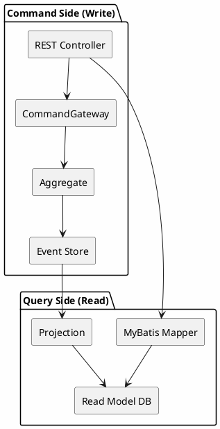
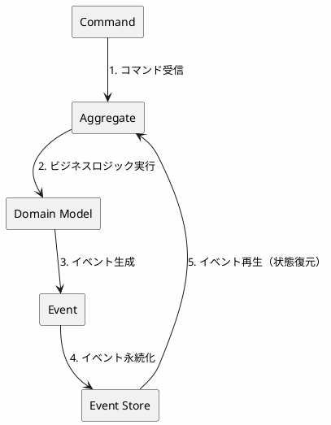
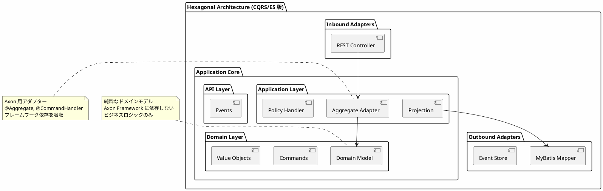
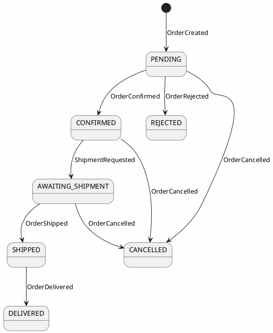
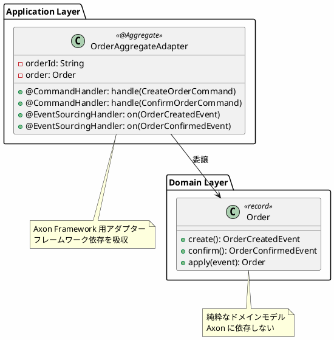
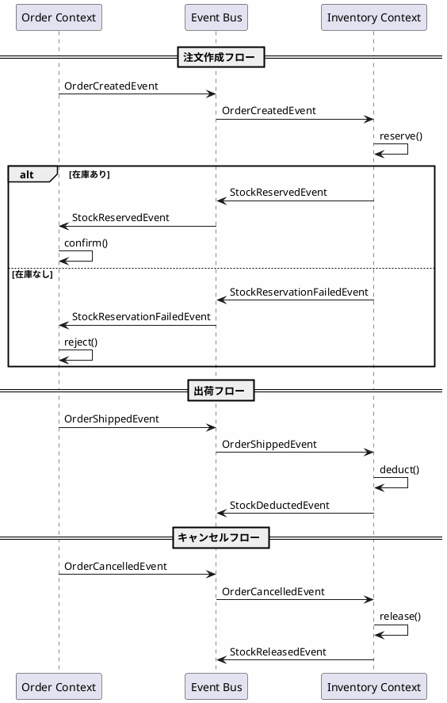
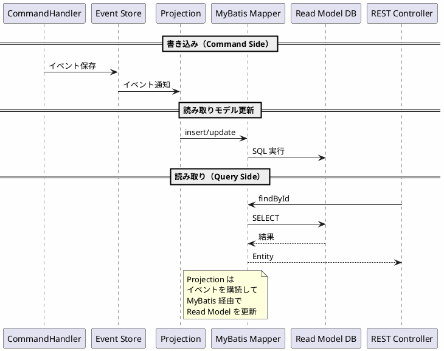
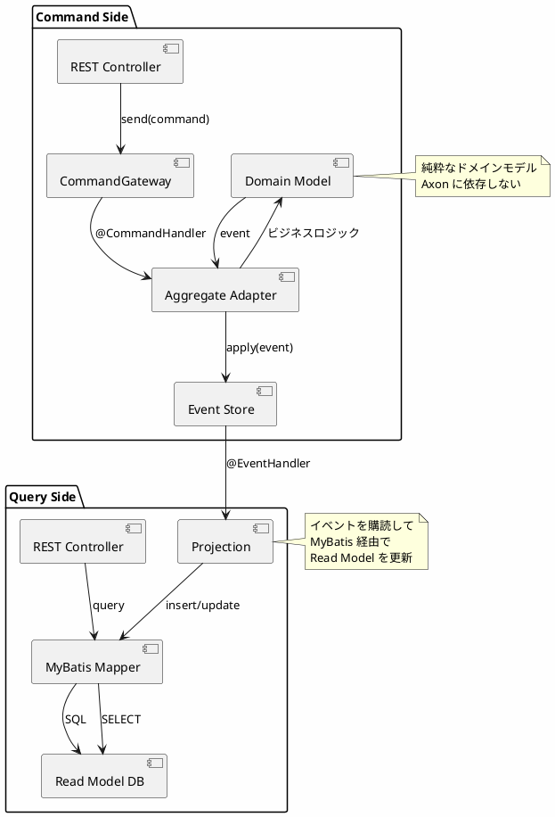

# 実践データベース設計：販売管理システム 研究 5 - Axon CQRS/ES の実装

## はじめに

本研究では、REST API（第10部-A）、gRPC（研究 3）、GraphQL（研究 4）とは異なるアプローチとして、**CQRS（Command Query Responsibility Segregation）** と **Event Sourcing** による販売管理システムを実装します。Axon Framework を使用し、コマンド（書き込み）とクエリ（読み取り）を分離し、すべての状態変更をイベントとして記録するアーキテクチャを構築します。

研究 1 で構築したヘキサゴナルアーキテクチャの考え方を踏襲しつつ、**ドメインモデルをフレームワークから分離**し、Axon Aggregate Adapter を介して連携させます。Read Model の永続化には **MyBatis** を使用します。

---

## 第18章：Axon CQRS/ES アーキテクチャの基礎

### 18.1 CQRS とは

CQRS（Command Query Responsibility Segregation）は、コマンド（書き込み）とクエリ（読み取り）の責務を分離するアーキテクチャパターンです。従来の CRUD 操作を単一のモデルで処理するのではなく、書き込み用のモデルと読み取り用のモデルを分けることで、それぞれに最適化された設計が可能になります。



**CQRS の利点：**

| 観点 | 説明 |
|------|------|
| **スケーラビリティ** | 読み取りと書き込みを独立してスケール可能 |
| **パフォーマンス** | 読み取りに最適化されたモデルで高速クエリ |
| **複雑性の分離** | 書き込みロジックと読み取りロジックを独立して開発 |
| **監査対応** | Event Sourcing と組み合わせて完全な履歴を保持 |

---

### 18.2 Event Sourcing とは

Event Sourcing は、アプリケーションの状態をイベントの連続として保存するパターンです。現在の状態を直接保存するのではなく、状態変更を表すイベントを記録し、必要に応じてイベントを再生して現在の状態を再構築します。



**Event Sourcing の利点：**

| 観点 | 説明 |
|------|------|
| **完全な履歴** | すべての状態変更が記録される |
| **監査証跡** | いつ、誰が、何を変更したかが明確 |
| **時間旅行** | 過去の任意の時点の状態を再構築可能 |
| **イベント駆動** | 他システムとの連携が容易 |
| **デバッグ** | 問題発生時にイベントを追跡可能 |

---

### 18.3 ヘキサゴナルアーキテクチャとの統合

本実装では、ヘキサゴナルアーキテクチャ（Ports & Adapters）を採用し、ビジネスロジックを外部依存から分離します。



**設計原則：**

1. **ドメインモデルの純粋性**: ドメインモデルは Axon に依存しない純粋な Java コード
2. **Aggregate Adapter**: Axon Framework 用のアダプターを Application Layer に配置
3. **イベントは公開 API**: イベントは他の Context から参照される公開 API として定義

---

### 18.4 技術スタック

| カテゴリ | 技術 | バージョン |
|---------|------|-----------|
| 言語 | Java | 21 |
| フレームワーク | Spring Boot | 3.4.1 |
| CQRS/ES | Axon Framework | 4.10.3 |
| ORM | MyBatis | 3.0.4 |
| API ドキュメント | SpringDoc OpenAPI | 2.7.0 |
| データベース | H2 (開発) / PostgreSQL (本番) | - |

#### build.gradle.kts

<details>
<summary>コード例: build.gradle.kts</summary>

```kotlin
dependencies {
    // Spring Boot
    implementation("org.springframework.boot:spring-boot-starter-web")
    implementation("org.springframework.boot:spring-boot-starter-validation")

    // Axon Framework
    implementation("org.axonframework:axon-spring-boot-starter:4.10.3") {
        exclude(group = "org.axonframework", module = "axon-server-connector")
    }

    // MyBatis
    implementation("org.mybatis.spring.boot:mybatis-spring-boot-starter:3.0.4")

    // OpenAPI
    implementation("org.springdoc:springdoc-openapi-starter-webmvc-ui:2.7.0")

    // Database
    runtimeOnly("com.h2database:h2")
    runtimeOnly("org.postgresql:postgresql")

    // Test
    testImplementation("org.springframework.boot:spring-boot-starter-test")
    testImplementation("org.axonframework:axon-test:4.10.3")
    testImplementation("org.mybatis.spring.boot:mybatis-spring-boot-starter-test:3.0.4")
}
```

</details>

---

### 18.5 ディレクトリ構造

<details>
<summary>コード例: ディレクトリ構成</summary>

```
src/main/java/com/example/sales/
├── app/                              # アプリケーション共通
│   └── RootController.java
├── config/                           # 設定クラス
│   ├── AxonConfig.java
│   ├── MyBatisConfig.java
│   └── OpenApiConfig.java
├── order/                            # Order Bounded Context
│   ├── api/
│   │   └── events/                   # 公開イベント API
│   │       ├── OrderEvent.java       # sealed interface
│   │       ├── OrderCreatedEvent.java
│   │       ├── OrderConfirmedEvent.java
│   │       └── OrderCancelledEvent.java
│   ├── adapter/
│   │   ├── inbound/rest/orders/      # Inbound Adapter (REST)
│   │   │   ├── OrdersController.java
│   │   │   └── protocol/             # Request/Response DTO
│   │   └── outbound/persistence/     # Outbound Adapter (MyBatis)
│   │       ├── entity/
│   │       │   └── OrderEntity.java
│   │       └── mapper/
│   │           └── OrderMapper.java
│   ├── application/
│   │   ├── aggregate/                # Axon Aggregate Adapter
│   │   │   └── OrderAggregateAdapter.java
│   │   ├── policy/                   # イベントハンドラー（Choreography）
│   │   │   └── StockEventHandler.java
│   │   └── query/                    # Projection
│   │       └── OrderProjection.java
│   └── domain/
│       └── model/aggregate/order/    # 純粋なドメインモデル
│           ├── Order.java
│           ├── OrderCommands.java
│           └── OrderStatus.java
└── inventory/                        # Inventory Bounded Context
    ├── api/events/
    │   ├── StockEvent.java
    │   ├── StockReservedEvent.java
    │   └── StockReservationFailedEvent.java
    ├── application/
    │   ├── aggregate/
    │   │   └── StockAggregateAdapter.java
    │   └── policy/
    │       └── OrderEventHandler.java
    └── domain/model/aggregate/stock/
        ├── Stock.java
        └── StockCommands.java

src/main/resources/
├── application.yml
├── schema.sql                        # Read Model スキーマ
└── mapper/
    └── OrderMapper.xml               # MyBatis マッパー XML
```

</details>

---

### 18.6 Axon 設定クラス

<details>
<summary>コード例: AxonConfig.java</summary>

```java
package com.example.sales.config;

import org.axonframework.eventsourcing.eventstore.EmbeddedEventStore;
import org.axonframework.eventsourcing.eventstore.EventStorageEngine;
import org.axonframework.eventsourcing.eventstore.EventStore;
import org.axonframework.eventsourcing.eventstore.jdbc.JdbcEventStorageEngine;
import org.axonframework.serialization.Serializer;
import org.axonframework.serialization.json.JacksonSerializer;
import org.springframework.context.annotation.Bean;
import org.springframework.context.annotation.Configuration;

import javax.sql.DataSource;

/**
 * Axon Framework 設定
 */
@Configuration
public class AxonConfig {

    /**
     * JDBC ベースの Event Storage Engine
     */
    @Bean
    public EventStorageEngine eventStorageEngine(
            DataSource dataSource,
            Serializer serializer) {
        return JdbcEventStorageEngine.builder()
                .snapshotSerializer(serializer)
                .eventSerializer(serializer)
                .dataSource(dataSource)
                .build();
    }

    /**
     * Event Store
     */
    @Bean
    public EventStore eventStore(EventStorageEngine eventStorageEngine) {
        return EmbeddedEventStore.builder()
                .storageEngine(eventStorageEngine)
                .build();
    }

    /**
     * JSON シリアライザー
     */
    @Bean
    public Serializer eventSerializer() {
        return JacksonSerializer.defaultSerializer();
    }
}
```

</details>

### 18.7 MyBatis 設定クラス

<details>
<summary>コード例: MyBatisConfig.java</summary>

```java
package com.example.sales.config;

import org.apache.ibatis.session.SqlSessionFactory;
import org.mybatis.spring.SqlSessionFactoryBean;
import org.mybatis.spring.annotation.MapperScan;
import org.springframework.context.annotation.Bean;
import org.springframework.context.annotation.Configuration;
import org.springframework.core.io.support.PathMatchingResourcePatternResolver;

import javax.sql.DataSource;

/**
 * MyBatis 設定
 */
@Configuration
@MapperScan(basePackages = {
    "com.example.sales.order.adapter.outbound.persistence.mapper",
    "com.example.sales.inventory.adapter.outbound.persistence.mapper"
})
public class MyBatisConfig {

    @Bean
    public SqlSessionFactory sqlSessionFactory(DataSource dataSource) throws Exception {
        SqlSessionFactoryBean factoryBean = new SqlSessionFactoryBean();
        factoryBean.setDataSource(dataSource);
        factoryBean.setMapperLocations(
            new PathMatchingResourcePatternResolver()
                .getResources("classpath:mapper/**/*.xml")
        );
        factoryBean.setTypeAliasesPackage(
            "com.example.sales.order.adapter.outbound.persistence.entity," +
            "com.example.sales.inventory.adapter.outbound.persistence.entity"
        );

        org.apache.ibatis.session.Configuration configuration =
            new org.apache.ibatis.session.Configuration();
        configuration.setMapUnderscoreToCamelCase(true);
        factoryBean.setConfiguration(configuration);

        return factoryBean.getObject();
    }
}
```

</details>

---

## 第19章：ドメインモデルとイベント設計

### 19.1 Order Bounded Context

注文の作成から配送完了までのライフサイクルを管理します。

#### 状態遷移図



#### イベント一覧

| イベント | 説明 |
|---------|------|
| `OrderCreatedEvent` | 注文が作成された |
| `OrderConfirmedEvent` | 注文が確定された（在庫確保成功） |
| `OrderRejectedEvent` | 注文が拒否された（在庫確保失敗） |
| `ShipmentRequestedEvent` | 出荷が依頼された |
| `OrderShippedEvent` | 注文が出荷された |
| `OrderDeliveredEvent` | 注文が配達された |
| `OrderCancelledEvent` | 注文がキャンセルされた |

---

### 19.2 イベント定義（API Layer）

#### sealed interface によるイベントの型安全性

<details>
<summary>コード例: OrderEvent.java</summary>

```java
package com.example.sales.order.api.events;

/**
 * Order イベントの sealed interface
 * すべての Order イベントの親インターフェース
 */
public sealed interface OrderEvent permits
        OrderCreatedEvent,
        OrderConfirmedEvent,
        OrderRejectedEvent,
        ShipmentRequestedEvent,
        OrderShippedEvent,
        OrderDeliveredEvent,
        OrderCancelledEvent {

    String orderId();
}
```

</details>

**sealed interface の利点：**

- **網羅性チェック**: switch 式でコンパイル時に全ケースをチェック
- **型安全性**: 許可されたクラスのみが実装可能
- **ドキュメント**: 存在するイベントが一目でわかる

#### イベント record の実装

<details>
<summary>コード例: OrderCreatedEvent.java</summary>

```java
package com.example.sales.order.api.events;

import java.math.BigDecimal;
import java.time.LocalDateTime;

/**
 * 注文作成イベント
 */
public record OrderCreatedEvent(
        String orderId,
        String customerId,
        String productId,
        int quantity,
        BigDecimal totalAmount,
        LocalDateTime createdAt
) implements OrderEvent {
}
```

</details>

<details>
<summary>コード例: OrderConfirmedEvent.java</summary>

```java
package com.example.sales.order.api.events;

import java.time.LocalDateTime;

/**
 * 注文確定イベント
 */
public record OrderConfirmedEvent(
        String orderId,
        LocalDateTime confirmedAt
) implements OrderEvent {
}
```

</details>

<details>
<summary>コード例: OrderCancelledEvent.java</summary>

```java
package com.example.sales.order.api.events;

import java.time.LocalDateTime;

/**
 * 注文キャンセルイベント
 */
public record OrderCancelledEvent(
        String orderId,
        String productId,
        int quantity,
        String cancelledBy,
        String reason,
        LocalDateTime cancelledAt
) implements OrderEvent {
}
```

</details>

---

### 19.3 コマンド定義（Domain Layer）

<details>
<summary>コード例: OrderCommands.java</summary>

```java
package com.example.sales.order.domain.model.aggregate.order;

import org.axonframework.modelling.command.TargetAggregateIdentifier;
import java.math.BigDecimal;

/**
 * Order 集約へのコマンド定義
 */
public final class OrderCommands {

    private OrderCommands() {
    }

    /**
     * 注文作成コマンド
     */
    public record CreateOrderCommand(
            @TargetAggregateIdentifier
            String orderId,
            String customerId,
            String productId,
            int quantity,
            BigDecimal totalAmount
    ) {
    }

    /**
     * 注文確定コマンド
     */
    public record ConfirmOrderCommand(
            @TargetAggregateIdentifier
            String orderId
    ) {
    }

    /**
     * 注文拒否コマンド
     */
    public record RejectOrderCommand(
            @TargetAggregateIdentifier
            String orderId,
            String reason
    ) {
    }

    /**
     * 出荷依頼コマンド
     */
    public record RequestShipmentCommand(
            @TargetAggregateIdentifier
            String orderId
    ) {
    }

    /**
     * 出荷コマンド
     */
    public record ShipOrderCommand(
            @TargetAggregateIdentifier
            String orderId,
            String trackingNumber
    ) {
    }

    /**
     * 配達完了コマンド
     */
    public record DeliverOrderCommand(
            @TargetAggregateIdentifier
            String orderId
    ) {
    }

    /**
     * キャンセルコマンド
     */
    public record CancelOrderCommand(
            @TargetAggregateIdentifier
            String orderId,
            String cancelledBy,
            String reason
    ) {
    }
}
```

</details>

**@TargetAggregateIdentifier の役割：**

- Axon がコマンドをどの集約インスタンスにルーティングするかを決定
- 集約の一意識別子となるフィールドに付与

---

### 19.4 ドメインモデル（純粋な Java）

<details>
<summary>コード例: Order.java</summary>

```java
package com.example.sales.order.domain.model.aggregate.order;

import com.example.sales.order.api.events.*;
import java.math.BigDecimal;
import java.time.LocalDateTime;

/**
 * Order ドメインモデル（Axon 非依存）
 * 純粋なビジネスロジックのみを含む
 */
public record Order(
        String orderId,
        String customerId,
        String productId,
        int quantity,
        BigDecimal totalAmount,
        OrderStatus status
) {

    // ======== ファクトリメソッド ========

    /**
     * 注文作成
     */
    public static OrderCreatedEvent create(
            String orderId,
            String customerId,
            String productId,
            int quantity,
            BigDecimal totalAmount
    ) {
        // バリデーション
        if (quantity <= 0) {
            throw new IllegalArgumentException("Quantity must be positive");
        }
        if (totalAmount.compareTo(BigDecimal.ZERO) <= 0) {
            throw new IllegalArgumentException("Total amount must be positive");
        }

        return new OrderCreatedEvent(
                orderId,
                customerId,
                productId,
                quantity,
                totalAmount,
                LocalDateTime.now()
        );
    }

    /**
     * イベントからの再構築
     */
    public static Order from(OrderCreatedEvent event) {
        return new Order(
                event.orderId(),
                event.customerId(),
                event.productId(),
                event.quantity(),
                event.totalAmount(),
                OrderStatus.PENDING
        );
    }

    // ======== 状態遷移メソッド ========

    /**
     * 注文確定
     */
    public OrderConfirmedEvent confirm() {
        if (status != OrderStatus.PENDING) {
            throw new IllegalStateException("Only pending orders can be confirmed");
        }
        return new OrderConfirmedEvent(orderId, LocalDateTime.now());
    }

    /**
     * 注文拒否
     */
    public OrderRejectedEvent reject(String reason) {
        if (status != OrderStatus.PENDING) {
            throw new IllegalStateException("Only pending orders can be rejected");
        }
        return new OrderRejectedEvent(orderId, reason, LocalDateTime.now());
    }

    /**
     * 出荷依頼
     */
    public ShipmentRequestedEvent requestShipment() {
        if (status != OrderStatus.CONFIRMED) {
            throw new IllegalStateException("Only confirmed orders can request shipment");
        }
        return new ShipmentRequestedEvent(orderId, LocalDateTime.now());
    }

    /**
     * 出荷
     */
    public OrderShippedEvent ship(String trackingNumber) {
        if (status != OrderStatus.AWAITING_SHIPMENT) {
            throw new IllegalStateException("Only orders awaiting shipment can be shipped");
        }
        return new OrderShippedEvent(orderId, productId, quantity, trackingNumber, LocalDateTime.now());
    }

    /**
     * 配達完了
     */
    public OrderDeliveredEvent deliver() {
        if (status != OrderStatus.SHIPPED) {
            throw new IllegalStateException("Only shipped orders can be delivered");
        }
        return new OrderDeliveredEvent(orderId, LocalDateTime.now());
    }

    /**
     * キャンセル
     */
    public OrderCancelledEvent cancel(String cancelledBy, String reason) {
        if (status == OrderStatus.SHIPPED || status == OrderStatus.DELIVERED) {
            throw new IllegalStateException("Shipped or delivered orders cannot be cancelled");
        }
        if (status == OrderStatus.CANCELLED) {
            throw new IllegalStateException("Order is already cancelled");
        }
        if (status == OrderStatus.REJECTED) {
            throw new IllegalStateException("Rejected orders cannot be cancelled");
        }
        return new OrderCancelledEvent(orderId, productId, quantity, cancelledBy, reason, LocalDateTime.now());
    }

    // ======== イベント適用メソッド ========

    /**
     * イベントを適用して新しい状態を生成
     */
    public Order apply(OrderEvent event) {
        return switch (event) {
            case OrderCreatedEvent e -> from(e);
            case OrderConfirmedEvent e -> withStatus(OrderStatus.CONFIRMED);
            case OrderRejectedEvent e -> withStatus(OrderStatus.REJECTED);
            case ShipmentRequestedEvent e -> withStatus(OrderStatus.AWAITING_SHIPMENT);
            case OrderShippedEvent e -> withStatus(OrderStatus.SHIPPED);
            case OrderDeliveredEvent e -> withStatus(OrderStatus.DELIVERED);
            case OrderCancelledEvent e -> withStatus(OrderStatus.CANCELLED);
        };
    }

    /**
     * 状態更新ヘルパー
     */
    private Order withStatus(OrderStatus newStatus) {
        return new Order(orderId, customerId, productId, quantity, totalAmount, newStatus);
    }
}
```

</details>

<details>
<summary>コード例: OrderStatus.java</summary>

```java
package com.example.sales.order.domain.model.aggregate.order;

/**
 * 注文ステータス
 */
public enum OrderStatus {
    PENDING,           // 保留中
    CONFIRMED,         // 確定
    REJECTED,          // 拒否
    AWAITING_SHIPMENT, // 出荷待ち
    SHIPPED,           // 出荷済み
    DELIVERED,         // 配達済み
    CANCELLED          // キャンセル
}
```

</details>

**ドメインモデル設計原則：**

| 原則 | 説明 |
|------|------|
| **Axon 非依存** | ドメインモデルにフレームワーク依存を持たせない |
| **イミュータブル** | record でイミュータブルに設計 |
| **イベントを返す** | 状態遷移メソッドはイベントを返す |
| **最小限のフィールド** | 状態遷移の判定に必要な最小限のみ保持 |

---

### 19.5 Inventory Bounded Context

商品在庫の予約・確定・解放を管理します。

#### イベント定義

<details>
<summary>コード例: StockEvent.java</summary>

```java
package com.example.sales.inventory.api.events;

/**
 * Stock イベントの sealed interface
 */
public sealed interface StockEvent permits
        StockInitializedEvent,
        StockReservedEvent,
        StockReservationFailedEvent,
        StockDeductedEvent,
        StockReleasedEvent {

    String productId();
}
```

</details>

<details>
<summary>コード例: StockReservedEvent.java</summary>

```java
package com.example.sales.inventory.api.events;

import java.time.LocalDateTime;

/**
 * 在庫予約成功イベント
 */
public record StockReservedEvent(
        String productId,
        String orderId,
        int quantity,
        LocalDateTime reservedAt
) implements StockEvent {
}
```

</details>

<details>
<summary>コード例: StockReservationFailedEvent.java</summary>

```java
package com.example.sales.inventory.api.events;

import java.time.LocalDateTime;

/**
 * 在庫予約失敗イベント
 */
public record StockReservationFailedEvent(
        String productId,
        String orderId,
        int requestedQuantity,
        int availableQuantity,
        String reason,
        LocalDateTime failedAt
) implements StockEvent {
}
```

</details>

#### ドメインモデル

<details>
<summary>コード例: Stock.java</summary>

```java
package com.example.sales.inventory.domain.model.aggregate.stock;

import com.example.sales.inventory.api.events.*;
import java.time.LocalDateTime;
import java.util.HashMap;
import java.util.Map;

/**
 * Stock ドメインモデル（在庫管理）
 */
public record Stock(
        String productId,
        int totalQuantity,
        int availableQuantity,
        Map<String, Integer> reservations  // orderId -> quantity
) {

    public Stock {
        reservations = reservations != null ? new HashMap<>(reservations) : new HashMap<>();
    }

    /**
     * 初期化ファクトリ
     */
    public static Stock initial(String productId, int initialQuantity) {
        return new Stock(productId, initialQuantity, initialQuantity, new HashMap<>());
    }

    /**
     * 在庫予約（成功または失敗イベントを返す）
     */
    public StockEvent reserve(String orderId, int quantity) {
        if (reservations.containsKey(orderId)) {
            return new StockReservationFailedEvent(
                    productId, orderId, quantity, availableQuantity,
                    "Order already has a reservation",
                    LocalDateTime.now()
            );
        }

        if (availableQuantity < quantity) {
            return new StockReservationFailedEvent(
                    productId, orderId, quantity, availableQuantity,
                    "Insufficient stock",
                    LocalDateTime.now()
            );
        }

        return new StockReservedEvent(productId, orderId, quantity, LocalDateTime.now());
    }

    /**
     * 在庫確定（出荷時）
     */
    public StockDeductedEvent deduct(String orderId, int quantity) {
        if (!reservations.containsKey(orderId)) {
            throw new IllegalStateException("No reservation found for order: " + orderId);
        }
        return new StockDeductedEvent(productId, orderId, quantity, LocalDateTime.now());
    }

    /**
     * 在庫解放（キャンセル時）
     */
    public StockReleasedEvent release(String orderId, int quantity) {
        if (!reservations.containsKey(orderId)) {
            throw new IllegalStateException("No reservation found for order: " + orderId);
        }
        return new StockReleasedEvent(productId, orderId, quantity, LocalDateTime.now());
    }

    /**
     * イベント適用
     */
    public Stock apply(StockEvent event) {
        return switch (event) {
            case StockInitializedEvent e -> initial(e.productId(), e.initialQuantity());
            case StockReservedEvent e -> {
                var newReservations = new HashMap<>(reservations);
                newReservations.put(e.orderId(), e.quantity());
                yield new Stock(
                        productId,
                        totalQuantity,
                        availableQuantity - e.quantity(),
                        newReservations
                );
            }
            case StockReservationFailedEvent e -> this;  // 状態変更なし
            case StockDeductedEvent e -> {
                var newReservations = new HashMap<>(reservations);
                newReservations.remove(e.orderId());
                yield new Stock(
                        productId,
                        totalQuantity - e.quantity(),
                        availableQuantity,
                        newReservations
                );
            }
            case StockReleasedEvent e -> {
                var newReservations = new HashMap<>(reservations);
                newReservations.remove(e.orderId());
                yield new Stock(
                        productId,
                        totalQuantity,
                        availableQuantity + e.quantity(),
                        newReservations
                );
            }
        };
    }
}
```

</details>

---

## 第20章：Aggregate Adapter と Policy Handler

### 20.1 Aggregate Adapter パターン

Aggregate Adapter は、純粋なドメインモデルと Axon Framework を繋ぐアダプター層です。フレームワーク固有のアノテーションやライフサイクル処理をドメインモデルから分離します。



---

### 20.2 Order Aggregate Adapter

<details>
<summary>コード例: OrderAggregateAdapter.java</summary>

```java
package com.example.sales.order.application.aggregate;

import com.example.sales.order.api.events.*;
import com.example.sales.order.domain.model.aggregate.order.Order;
import com.example.sales.order.domain.model.aggregate.order.OrderCommands.*;
import org.axonframework.commandhandling.CommandHandler;
import org.axonframework.eventsourcing.EventSourcingHandler;
import org.axonframework.modelling.command.AggregateIdentifier;
import org.axonframework.modelling.command.AggregateLifecycle;
import org.axonframework.spring.stereotype.Aggregate;

/**
 * Order Aggregate Adapter（Axon Framework 用）
 */
@Aggregate
public class OrderAggregateAdapter {

    @AggregateIdentifier
    private String orderId;

    private Order order;

    /**
     * Axon が使用するデフォルトコンストラクタ
     */
    protected OrderAggregateAdapter() {
    }

    // ======== Command Handlers ========

    /**
     * 集約作成コマンドハンドラー（コンストラクタ）
     */
    @CommandHandler
    public OrderAggregateAdapter(CreateOrderCommand command) {
        // ドメインモデルのファクトリメソッドを呼び出し
        var event = Order.create(
                command.orderId(),
                command.customerId(),
                command.productId(),
                command.quantity(),
                command.totalAmount()
        );
        // イベントを発行
        AggregateLifecycle.apply(event);
    }

    /**
     * 確定コマンドハンドラー
     */
    @CommandHandler
    public void handle(ConfirmOrderCommand command) {
        var event = order.confirm();
        AggregateLifecycle.apply(event);
    }

    /**
     * 拒否コマンドハンドラー
     */
    @CommandHandler
    public void handle(RejectOrderCommand command) {
        var event = order.reject(command.reason());
        AggregateLifecycle.apply(event);
    }

    /**
     * 出荷依頼コマンドハンドラー
     */
    @CommandHandler
    public void handle(RequestShipmentCommand command) {
        var event = order.requestShipment();
        AggregateLifecycle.apply(event);
    }

    /**
     * 出荷コマンドハンドラー
     */
    @CommandHandler
    public void handle(ShipOrderCommand command) {
        var event = order.ship(command.trackingNumber());
        AggregateLifecycle.apply(event);
    }

    /**
     * 配達完了コマンドハンドラー
     */
    @CommandHandler
    public void handle(DeliverOrderCommand command) {
        var event = order.deliver();
        AggregateLifecycle.apply(event);
    }

    /**
     * キャンセルコマンドハンドラー
     */
    @CommandHandler
    public void handle(CancelOrderCommand command) {
        var event = order.cancel(command.cancelledBy(), command.reason());
        AggregateLifecycle.apply(event);
    }

    // ======== Event Sourcing Handlers（状態復元）========

    @EventSourcingHandler
    public void on(OrderCreatedEvent event) {
        this.orderId = event.orderId();
        this.order = Order.from(event);
    }

    @EventSourcingHandler
    public void on(OrderConfirmedEvent event) {
        this.order = order.apply(event);
    }

    @EventSourcingHandler
    public void on(OrderRejectedEvent event) {
        this.order = order.apply(event);
    }

    @EventSourcingHandler
    public void on(ShipmentRequestedEvent event) {
        this.order = order.apply(event);
    }

    @EventSourcingHandler
    public void on(OrderShippedEvent event) {
        this.order = order.apply(event);
    }

    @EventSourcingHandler
    public void on(OrderDeliveredEvent event) {
        this.order = order.apply(event);
    }

    @EventSourcingHandler
    public void on(OrderCancelledEvent event) {
        this.order = order.apply(event);
    }
}
```

</details>

**Axon アノテーション解説：**

| アノテーション | 説明 |
|--------------|------|
| `@Aggregate` | Event Sourcing 集約であることを宣言 |
| `@AggregateIdentifier` | 集約の識別子フィールド |
| `@CommandHandler` | コマンドを処理するメソッド |
| `@EventSourcingHandler` | イベントから状態を復元するメソッド |
| `AggregateLifecycle.apply()` | イベントを発行するメソッド |

---

### 20.3 Stock Aggregate Adapter

<details>
<summary>コード例: StockAggregateAdapter.java</summary>

```java
package com.example.sales.inventory.application.aggregate;

import com.example.sales.inventory.api.events.*;
import com.example.sales.inventory.domain.model.aggregate.stock.Stock;
import com.example.sales.inventory.domain.model.aggregate.stock.StockCommands.*;
import org.axonframework.commandhandling.CommandHandler;
import org.axonframework.eventsourcing.EventSourcingHandler;
import org.axonframework.modelling.command.AggregateIdentifier;
import org.axonframework.modelling.command.AggregateLifecycle;
import org.axonframework.spring.stereotype.Aggregate;

import java.time.LocalDateTime;

/**
 * Stock Aggregate Adapter
 */
@Aggregate
public class StockAggregateAdapter {

    @AggregateIdentifier
    private String productId;

    private Stock stock;

    protected StockAggregateAdapter() {
    }

    @CommandHandler
    public StockAggregateAdapter(InitializeStockCommand command) {
        AggregateLifecycle.apply(new StockInitializedEvent(
                command.productId(),
                command.initialQuantity(),
                LocalDateTime.now()
        ));
    }

    @CommandHandler
    public void handle(ReserveStockCommand command) {
        var event = stock.reserve(command.orderId(), command.quantity());
        AggregateLifecycle.apply(event);
    }

    @CommandHandler
    public void handle(DeductStockCommand command) {
        var event = stock.deduct(command.orderId(), command.quantity());
        AggregateLifecycle.apply(event);
    }

    @CommandHandler
    public void handle(ReleaseStockCommand command) {
        var event = stock.release(command.orderId(), command.quantity());
        AggregateLifecycle.apply(event);
    }

    @EventSourcingHandler
    public void on(StockInitializedEvent event) {
        this.productId = event.productId();
        this.stock = Stock.initial(event.productId(), event.initialQuantity());
    }

    @EventSourcingHandler
    public void on(StockReservedEvent event) {
        this.stock = stock.apply(event);
    }

    @EventSourcingHandler
    public void on(StockReservationFailedEvent event) {
        // 状態変更なし
    }

    @EventSourcingHandler
    public void on(StockDeductedEvent event) {
        this.stock = stock.apply(event);
    }

    @EventSourcingHandler
    public void on(StockReleasedEvent event) {
        this.stock = stock.apply(event);
    }
}
```

</details>

---

### 20.4 Policy Handler（Choreography パターン）

Policy Handler は、他の Bounded Context から発行されたイベントを購読し、自律的に反応する処理を実装します。Choreography パターンでは、各 Context が独立して動作し、イベントを介して連携します。



---

### 20.5 OrderEventHandler（Inventory Context 内）

<details>
<summary>コード例: OrderEventHandler.java</summary>

```java
package com.example.sales.inventory.application.policy;

import com.example.sales.inventory.domain.model.aggregate.stock.StockCommands.*;
import com.example.sales.order.api.events.OrderCancelledEvent;
import com.example.sales.order.api.events.OrderCreatedEvent;
import com.example.sales.order.api.events.OrderShippedEvent;
import org.axonframework.commandhandling.gateway.CommandGateway;
import org.axonframework.eventhandling.EventHandler;
import org.springframework.stereotype.Component;

/**
 * Order イベントに反応して在庫操作を実行する Policy Handler
 */
@Component
public class OrderEventHandler {

    private final CommandGateway commandGateway;

    public OrderEventHandler(CommandGateway commandGateway) {
        this.commandGateway = commandGateway;
    }

    /**
     * Policy: "When an order is created, reserve stock"
     */
    @EventHandler
    public void on(OrderCreatedEvent event) {
        var command = new ReserveStockCommand(
                event.productId(),
                event.orderId(),
                event.quantity()
        );
        commandGateway.send(command);
    }

    /**
     * Policy: "When an order is shipped, deduct stock"
     */
    @EventHandler
    public void on(OrderShippedEvent event) {
        var command = new DeductStockCommand(
                event.productId(),
                event.orderId(),
                event.quantity()
        );
        commandGateway.send(command);
    }

    /**
     * Policy: "When an order is cancelled, release stock"
     */
    @EventHandler
    public void on(OrderCancelledEvent event) {
        var command = new ReleaseStockCommand(
                event.productId(),
                event.orderId(),
                event.quantity()
        );
        commandGateway.send(command);
    }
}
```

</details>

---

### 20.6 StockEventHandler（Order Context 内）

<details>
<summary>コード例: StockEventHandler.java</summary>

```java
package com.example.sales.order.application.policy;

import com.example.sales.inventory.api.events.StockReservationFailedEvent;
import com.example.sales.inventory.api.events.StockReservedEvent;
import com.example.sales.order.domain.model.aggregate.order.OrderCommands.*;
import org.axonframework.commandhandling.gateway.CommandGateway;
import org.axonframework.eventhandling.EventHandler;
import org.springframework.stereotype.Component;

/**
 * Stock イベントに反応して注文状態を更新する Policy Handler
 */
@Component
public class StockEventHandler {

    private final CommandGateway commandGateway;

    public StockEventHandler(CommandGateway commandGateway) {
        this.commandGateway = commandGateway;
    }

    /**
     * Policy: "When stock is reserved, confirm the order"
     */
    @EventHandler
    public void on(StockReservedEvent event) {
        var command = new ConfirmOrderCommand(event.orderId());
        commandGateway.send(command);
    }

    /**
     * Policy: "When stock reservation fails, reject the order"
     */
    @EventHandler
    public void on(StockReservationFailedEvent event) {
        var command = new RejectOrderCommand(event.orderId(), event.reason());
        commandGateway.send(command);
    }
}
```

</details>

**Policy Handler の設計原則：**

| 原則 | 説明 |
|------|------|
| **単一責任** | 1 つの Policy Handler は 1 つの関心事のみを扱う |
| **疎結合** | 他の Context のイベントを購読し、自 Context のコマンドを発行 |
| **自律性** | 他のサービスに依存せず独立して動作 |
| **冪等性** | 同じイベントを複数回受信しても問題ないよう設計 |

---

## 第21章：Projection と Read Model

### 21.1 Projection の役割

Projection は、イベントを購読して Read Model（クエリ用のデータモデル）を更新するコンポーネントです。CQRS では、書き込みモデル（Event Store）と読み取りモデル（Read Model DB）を分離し、それぞれに最適化されたデータ構造を使用します。



---

### 21.2 Order Projection（MyBatis 版）

<details>
<summary>コード例: OrderProjection.java</summary>

```java
package com.example.sales.order.application.query;

import com.example.sales.order.adapter.outbound.persistence.entity.OrderEntity;
import com.example.sales.order.adapter.outbound.persistence.mapper.OrderMapper;
import com.example.sales.order.api.events.*;
import org.axonframework.eventhandling.EventHandler;
import org.springframework.stereotype.Component;

/**
 * Order Projection（MyBatis を使用した Read Model の更新）
 */
@Component
public class OrderProjection {

    private final OrderMapper orderMapper;

    public OrderProjection(OrderMapper orderMapper) {
        this.orderMapper = orderMapper;
    }

    @EventHandler
    public void on(OrderCreatedEvent event) {
        var entity = new OrderEntity();
        entity.setOrderId(event.orderId());
        entity.setCustomerId(event.customerId());
        entity.setProductId(event.productId());
        entity.setQuantity(event.quantity());
        entity.setTotalAmount(event.totalAmount());
        entity.setStatus("PENDING");
        entity.setCreatedAt(event.createdAt());

        orderMapper.insert(entity);
    }

    @EventHandler
    public void on(OrderConfirmedEvent event) {
        orderMapper.updateStatus(event.orderId(), "CONFIRMED");
        orderMapper.updateConfirmedAt(event.orderId(), event.confirmedAt());
    }

    @EventHandler
    public void on(OrderRejectedEvent event) {
        orderMapper.updateStatus(event.orderId(), "REJECTED");
        orderMapper.updateRejection(event.orderId(), event.reason(), event.rejectedAt());
    }

    @EventHandler
    public void on(ShipmentRequestedEvent event) {
        orderMapper.updateStatus(event.orderId(), "AWAITING_SHIPMENT");
        orderMapper.updateRequestedAt(event.orderId(), event.requestedAt());
    }

    @EventHandler
    public void on(OrderShippedEvent event) {
        orderMapper.updateStatus(event.orderId(), "SHIPPED");
        orderMapper.updateShipment(event.orderId(), event.trackingNumber(), event.shippedAt());
    }

    @EventHandler
    public void on(OrderDeliveredEvent event) {
        orderMapper.updateStatus(event.orderId(), "DELIVERED");
        orderMapper.updateDeliveredAt(event.orderId(), event.deliveredAt());
    }

    @EventHandler
    public void on(OrderCancelledEvent event) {
        orderMapper.updateStatus(event.orderId(), "CANCELLED");
        orderMapper.updateCancellation(
            event.orderId(),
            event.cancelledBy(),
            event.reason(),
            event.cancelledAt()
        );
    }
}
```

</details>

---

### 21.3 Read Model Entity

<details>
<summary>コード例: OrderEntity.java</summary>

```java
package com.example.sales.order.adapter.outbound.persistence.entity;

import java.math.BigDecimal;
import java.time.LocalDateTime;

/**
 * Order Read Model（表示用のすべてのフィールドを保持）
 */
public class OrderEntity {

    private String orderId;
    private String customerId;
    private String productId;
    private int quantity;
    private BigDecimal totalAmount;
    private String status;
    private LocalDateTime confirmedAt;
    private LocalDateTime requestedAt;
    private String trackingNumber;
    private LocalDateTime shippedAt;
    private LocalDateTime deliveredAt;
    private String cancelledBy;
    private String cancellationReason;
    private LocalDateTime cancelledAt;
    private String rejectionReason;
    private LocalDateTime rejectedAt;
    private LocalDateTime createdAt;

    // Getters and Setters
    public String getOrderId() { return orderId; }
    public void setOrderId(String orderId) { this.orderId = orderId; }

    public String getCustomerId() { return customerId; }
    public void setCustomerId(String customerId) { this.customerId = customerId; }

    public String getProductId() { return productId; }
    public void setProductId(String productId) { this.productId = productId; }

    public int getQuantity() { return quantity; }
    public void setQuantity(int quantity) { this.quantity = quantity; }

    public BigDecimal getTotalAmount() { return totalAmount; }
    public void setTotalAmount(BigDecimal totalAmount) { this.totalAmount = totalAmount; }

    public String getStatus() { return status; }
    public void setStatus(String status) { this.status = status; }

    public LocalDateTime getConfirmedAt() { return confirmedAt; }
    public void setConfirmedAt(LocalDateTime confirmedAt) { this.confirmedAt = confirmedAt; }

    public LocalDateTime getRequestedAt() { return requestedAt; }
    public void setRequestedAt(LocalDateTime requestedAt) { this.requestedAt = requestedAt; }

    public String getTrackingNumber() { return trackingNumber; }
    public void setTrackingNumber(String trackingNumber) { this.trackingNumber = trackingNumber; }

    public LocalDateTime getShippedAt() { return shippedAt; }
    public void setShippedAt(LocalDateTime shippedAt) { this.shippedAt = shippedAt; }

    public LocalDateTime getDeliveredAt() { return deliveredAt; }
    public void setDeliveredAt(LocalDateTime deliveredAt) { this.deliveredAt = deliveredAt; }

    public String getCancelledBy() { return cancelledBy; }
    public void setCancelledBy(String cancelledBy) { this.cancelledBy = cancelledBy; }

    public String getCancellationReason() { return cancellationReason; }
    public void setCancellationReason(String cancellationReason) { this.cancellationReason = cancellationReason; }

    public LocalDateTime getCancelledAt() { return cancelledAt; }
    public void setCancelledAt(LocalDateTime cancelledAt) { this.cancelledAt = cancelledAt; }

    public String getRejectionReason() { return rejectionReason; }
    public void setRejectionReason(String rejectionReason) { this.rejectionReason = rejectionReason; }

    public LocalDateTime getRejectedAt() { return rejectedAt; }
    public void setRejectedAt(LocalDateTime rejectedAt) { this.rejectedAt = rejectedAt; }

    public LocalDateTime getCreatedAt() { return createdAt; }
    public void setCreatedAt(LocalDateTime createdAt) { this.createdAt = createdAt; }
}
```

</details>

---

### 21.4 MyBatis Mapper インターフェース

<details>
<summary>コード例: OrderMapper.java</summary>

```java
package com.example.sales.order.adapter.outbound.persistence.mapper;

import com.example.sales.order.adapter.outbound.persistence.entity.OrderEntity;
import org.apache.ibatis.annotations.Mapper;
import org.apache.ibatis.annotations.Param;

import java.time.LocalDateTime;
import java.util.List;
import java.util.Optional;

/**
 * Order MyBatis Mapper
 */
@Mapper
public interface OrderMapper {

    // 挿入
    void insert(OrderEntity entity);

    // 検索
    Optional<OrderEntity> findById(@Param("orderId") String orderId);

    List<OrderEntity> findAll();

    List<OrderEntity> findByCustomerId(@Param("customerId") String customerId);

    List<OrderEntity> findByStatus(@Param("status") String status);

    // 更新
    void updateStatus(@Param("orderId") String orderId, @Param("status") String status);

    void updateConfirmedAt(@Param("orderId") String orderId, @Param("confirmedAt") LocalDateTime confirmedAt);

    void updateRequestedAt(@Param("orderId") String orderId, @Param("requestedAt") LocalDateTime requestedAt);

    void updateShipment(
        @Param("orderId") String orderId,
        @Param("trackingNumber") String trackingNumber,
        @Param("shippedAt") LocalDateTime shippedAt
    );

    void updateDeliveredAt(@Param("orderId") String orderId, @Param("deliveredAt") LocalDateTime deliveredAt);

    void updateCancellation(
        @Param("orderId") String orderId,
        @Param("cancelledBy") String cancelledBy,
        @Param("cancellationReason") String cancellationReason,
        @Param("cancelledAt") LocalDateTime cancelledAt
    );

    void updateRejection(
        @Param("orderId") String orderId,
        @Param("rejectionReason") String rejectionReason,
        @Param("rejectedAt") LocalDateTime rejectedAt
    );
}
```

</details>

---

### 21.5 MyBatis Mapper XML

<details>
<summary>コード例: OrderMapper.xml</summary>

```xml
<?xml version="1.0" encoding="UTF-8" ?>
<!DOCTYPE mapper PUBLIC "-//mybatis.org//DTD Mapper 3.0//EN"
  "http://mybatis.org/dtd/mybatis-3-mapper.dtd">

<mapper namespace="com.example.sales.order.adapter.outbound.persistence.mapper.OrderMapper">

    <resultMap id="orderResultMap" type="OrderEntity">
        <id property="orderId" column="order_id"/>
        <result property="customerId" column="customer_id"/>
        <result property="productId" column="product_id"/>
        <result property="quantity" column="quantity"/>
        <result property="totalAmount" column="total_amount"/>
        <result property="status" column="status"/>
        <result property="confirmedAt" column="confirmed_at"/>
        <result property="requestedAt" column="requested_at"/>
        <result property="trackingNumber" column="tracking_number"/>
        <result property="shippedAt" column="shipped_at"/>
        <result property="deliveredAt" column="delivered_at"/>
        <result property="cancelledBy" column="cancelled_by"/>
        <result property="cancellationReason" column="cancellation_reason"/>
        <result property="cancelledAt" column="cancelled_at"/>
        <result property="rejectionReason" column="rejection_reason"/>
        <result property="rejectedAt" column="rejected_at"/>
        <result property="createdAt" column="created_at"/>
    </resultMap>

    <insert id="insert" parameterType="OrderEntity">
        INSERT INTO orders (
            order_id, customer_id, product_id, quantity, total_amount,
            status, created_at
        ) VALUES (
            #{orderId}, #{customerId}, #{productId}, #{quantity}, #{totalAmount},
            #{status}, #{createdAt}
        )
    </insert>

    <select id="findById" resultMap="orderResultMap">
        SELECT * FROM orders WHERE order_id = #{orderId}
    </select>

    <select id="findAll" resultMap="orderResultMap">
        SELECT * FROM orders ORDER BY created_at DESC
    </select>

    <select id="findByCustomerId" resultMap="orderResultMap">
        SELECT * FROM orders WHERE customer_id = #{customerId} ORDER BY created_at DESC
    </select>

    <select id="findByStatus" resultMap="orderResultMap">
        SELECT * FROM orders WHERE status = #{status} ORDER BY created_at DESC
    </select>

    <update id="updateStatus">
        UPDATE orders SET status = #{status} WHERE order_id = #{orderId}
    </update>

    <update id="updateConfirmedAt">
        UPDATE orders SET confirmed_at = #{confirmedAt} WHERE order_id = #{orderId}
    </update>

    <update id="updateRequestedAt">
        UPDATE orders SET requested_at = #{requestedAt} WHERE order_id = #{orderId}
    </update>

    <update id="updateShipment">
        UPDATE orders
        SET tracking_number = #{trackingNumber}, shipped_at = #{shippedAt}
        WHERE order_id = #{orderId}
    </update>

    <update id="updateDeliveredAt">
        UPDATE orders SET delivered_at = #{deliveredAt} WHERE order_id = #{orderId}
    </update>

    <update id="updateCancellation">
        UPDATE orders
        SET cancelled_by = #{cancelledBy},
            cancellation_reason = #{cancellationReason},
            cancelled_at = #{cancelledAt}
        WHERE order_id = #{orderId}
    </update>

    <update id="updateRejection">
        UPDATE orders
        SET rejection_reason = #{rejectionReason}, rejected_at = #{rejectedAt}
        WHERE order_id = #{orderId}
    </update>

</mapper>
```

</details>

---

### 21.6 Read Model スキーマ

<details>
<summary>コード例: schema.sql</summary>

```sql
-- Read Model: Orders テーブル
CREATE TABLE IF NOT EXISTS orders (
    order_id VARCHAR(36) PRIMARY KEY,
    customer_id VARCHAR(36) NOT NULL,
    product_id VARCHAR(36) NOT NULL,
    quantity INT NOT NULL,
    total_amount DECIMAL(12, 2) NOT NULL,
    status VARCHAR(20) NOT NULL,
    confirmed_at TIMESTAMP,
    requested_at TIMESTAMP,
    tracking_number VARCHAR(50),
    shipped_at TIMESTAMP,
    delivered_at TIMESTAMP,
    cancelled_by VARCHAR(100),
    cancellation_reason TEXT,
    cancelled_at TIMESTAMP,
    rejection_reason TEXT,
    rejected_at TIMESTAMP,
    created_at TIMESTAMP NOT NULL
);

-- インデックス
CREATE INDEX IF NOT EXISTS idx_orders_customer_id ON orders(customer_id);
CREATE INDEX IF NOT EXISTS idx_orders_status ON orders(status);
CREATE INDEX IF NOT EXISTS idx_orders_created_at ON orders(created_at);
```

</details>

---

### 21.7 最小限フィールドの原則

Event Sourcing では、ドメインモデルは「次のコマンドを処理するために必要な最小限の状態」のみを保持します。一方、Read Model は表示に必要なすべてのフィールドを保持します。

| フィールド | ドメインモデル | Read Model | 理由 |
|-----------|:-------------:|:----------:|------|
| orderId | O | O | 識別子として必要 |
| status | O | O | 状態遷移の判定に必要 |
| confirmedAt | X | O | 判定に不要、表示のみ |
| trackingNumber | X | O | 判定に不要、表示のみ |
| cancelledBy | X | O | 判定に不要、表示のみ |
| createdAt | X | O | 判定に不要、表示のみ |

---

## 第22章：REST API と統合テスト

### 22.1 REST Controller（Inbound Adapter）

<details>
<summary>コード例: OrdersController.java</summary>

```java
package com.example.sales.order.adapter.inbound.rest.orders;

import com.example.sales.order.adapter.inbound.rest.orders.protocol.*;
import com.example.sales.order.adapter.outbound.persistence.mapper.OrderMapper;
import com.example.sales.order.domain.model.aggregate.order.OrderCommands.*;
import io.swagger.v3.oas.annotations.Operation;
import io.swagger.v3.oas.annotations.tags.Tag;
import jakarta.validation.Valid;
import org.axonframework.commandhandling.gateway.CommandGateway;
import org.springframework.http.HttpStatus;
import org.springframework.http.ResponseEntity;
import org.springframework.web.bind.annotation.*;

import java.util.UUID;
import java.util.concurrent.CompletableFuture;

/**
 * Order REST Controller（Inbound Adapter）
 */
@RestController
@RequestMapping("/api/orders")
@Tag(name = "Orders", description = "Order management API")
public class OrdersController {

    private final CommandGateway commandGateway;
    private final OrderMapper orderMapper;

    public OrdersController(CommandGateway commandGateway, OrderMapper orderMapper) {
        this.commandGateway = commandGateway;
        this.orderMapper = orderMapper;
    }

    // ========== Command Side (Write) ==========

    @PostMapping
    @Operation(summary = "Create a new order")
    public CompletableFuture<ResponseEntity<OrderCreateResponse>> create(
            @Valid @RequestBody OrderCreateRequest request
    ) {
        var orderId = UUID.randomUUID().toString();
        var command = new CreateOrderCommand(
                orderId,
                request.customerId(),
                request.productId(),
                request.quantity(),
                request.totalAmount()
        );

        return commandGateway.send(command)
                .thenApply(result -> ResponseEntity
                        .status(HttpStatus.CREATED)
                        .body(new OrderCreateResponse(orderId)));
    }

    @PostMapping("/{id}/request-shipment")
    @Operation(summary = "Request shipment for an order")
    public CompletableFuture<ResponseEntity<Void>> requestShipment(@PathVariable String id) {
        var command = new RequestShipmentCommand(id);

        return commandGateway.send(command)
                .thenApply(result -> ResponseEntity.ok().<Void>build());
    }

    @PostMapping("/{id}/ship")
    @Operation(summary = "Ship an order")
    public CompletableFuture<ResponseEntity<Void>> ship(
            @PathVariable String id,
            @Valid @RequestBody OrderShipRequest request
    ) {
        var command = new ShipOrderCommand(id, request.trackingNumber());

        return commandGateway.send(command)
                .thenApply(result -> ResponseEntity.ok().<Void>build());
    }

    @PostMapping("/{id}/deliver")
    @Operation(summary = "Deliver an order")
    public CompletableFuture<ResponseEntity<Void>> deliver(@PathVariable String id) {
        var command = new DeliverOrderCommand(id);

        return commandGateway.send(command)
                .thenApply(result -> ResponseEntity.ok().<Void>build());
    }

    @PostMapping("/{id}/cancel")
    @Operation(summary = "Cancel an order")
    public CompletableFuture<ResponseEntity<Void>> cancel(
            @PathVariable String id,
            @Valid @RequestBody OrderCancelRequest request
    ) {
        var command = new CancelOrderCommand(id, request.cancelledBy(), request.reason());

        return commandGateway.send(command)
                .thenApply(result -> ResponseEntity.ok().<Void>build());
    }

    // ========== Query Side (Read) ==========

    @GetMapping("/{id}")
    @Operation(summary = "Get an order by ID")
    public ResponseEntity<OrderGetResponse> get(@PathVariable String id) {
        return orderMapper.findById(id)
                .map(entity -> ResponseEntity.ok(OrderGetResponse.from(entity)))
                .orElse(ResponseEntity.notFound().build());
    }

    @GetMapping
    @Operation(summary = "Get all orders")
    public ResponseEntity<OrderListResponse> getAll() {
        var entities = orderMapper.findAll();
        var items = entities.stream()
                .map(OrderGetResponse::from)
                .toList();
        return ResponseEntity.ok(new OrderListResponse(items));
    }
}
```

</details>

---

### 22.2 Request/Response DTO

<details>
<summary>コード例: OrderCreateRequest.java</summary>

```java
package com.example.sales.order.adapter.inbound.rest.orders.protocol;

import jakarta.validation.constraints.NotBlank;
import jakarta.validation.constraints.Positive;
import java.math.BigDecimal;

/**
 * 注文作成リクエスト
 */
public record OrderCreateRequest(
        @NotBlank
        String customerId,

        @NotBlank
        String productId,

        @Positive
        int quantity,

        @Positive
        BigDecimal totalAmount
) {
}
```

</details>

<details>
<summary>コード例: OrderGetResponse.java</summary>

```java
package com.example.sales.order.adapter.inbound.rest.orders.protocol;

import com.example.sales.order.adapter.outbound.persistence.entity.OrderEntity;
import java.math.BigDecimal;
import java.time.LocalDateTime;

/**
 * 注文取得レスポンス
 */
public record OrderGetResponse(
        String orderId,
        String customerId,
        String productId,
        int quantity,
        BigDecimal totalAmount,
        String status,
        LocalDateTime confirmedAt,
        LocalDateTime requestedAt,
        String trackingNumber,
        LocalDateTime shippedAt,
        LocalDateTime deliveredAt,
        String cancelledBy,
        String cancellationReason,
        LocalDateTime cancelledAt,
        String rejectionReason,
        LocalDateTime rejectedAt,
        LocalDateTime createdAt
) {

    public static OrderGetResponse from(OrderEntity entity) {
        return new OrderGetResponse(
                entity.getOrderId(),
                entity.getCustomerId(),
                entity.getProductId(),
                entity.getQuantity(),
                entity.getTotalAmount(),
                entity.getStatus(),
                entity.getConfirmedAt(),
                entity.getRequestedAt(),
                entity.getTrackingNumber(),
                entity.getShippedAt(),
                entity.getDeliveredAt(),
                entity.getCancelledBy(),
                entity.getCancellationReason(),
                entity.getCancelledAt(),
                entity.getRejectionReason(),
                entity.getRejectedAt(),
                entity.getCreatedAt()
        );
    }
}
```

</details>

---

### 22.3 API エンドポイント一覧

| メソッド | パス | 説明 | 種別 |
|---------|------|------|------|
| POST | `/api/orders` | 注文作成 | Command |
| POST | `/api/orders/{id}/request-shipment` | 出荷依頼 | Command |
| POST | `/api/orders/{id}/ship` | 出荷 | Command |
| POST | `/api/orders/{id}/deliver` | 配達完了 | Command |
| POST | `/api/orders/{id}/cancel` | キャンセル | Command |
| GET | `/api/orders` | 注文一覧取得 | Query |
| GET | `/api/orders/{id}` | 注文詳細取得 | Query |

---

### 22.4 Axon Test による単体テスト

<details>
<summary>コード例: OrderAggregateTest.java</summary>

```java
package com.example.sales.order.application.aggregate;

import com.example.sales.order.api.events.*;
import com.example.sales.order.domain.model.aggregate.order.OrderCommands.*;
import org.axonframework.test.aggregate.AggregateTestFixture;
import org.axonframework.test.aggregate.FixtureConfiguration;
import org.junit.jupiter.api.BeforeEach;
import org.junit.jupiter.api.DisplayName;
import org.junit.jupiter.api.Nested;
import org.junit.jupiter.api.Test;

import java.math.BigDecimal;
import java.time.LocalDateTime;

class OrderAggregateTest {

    private FixtureConfiguration<OrderAggregateAdapter> fixture;

    @BeforeEach
    void setUp() {
        fixture = new AggregateTestFixture<>(OrderAggregateAdapter.class);
    }

    @Nested
    @DisplayName("注文作成")
    class CreateOrder {

        @Test
        @DisplayName("正常な注文を作成できる")
        void shouldCreateOrder() {
            var command = new CreateOrderCommand(
                    "order-1",
                    "customer-1",
                    "product-1",
                    10,
                    BigDecimal.valueOf(1000)
            );

            fixture.givenNoPriorActivity()
                    .when(command)
                    .expectSuccessfulHandlerExecution()
                    .expectEventsMatching(events ->
                            events.getPayload() instanceof OrderCreatedEvent
                    );
        }

        @Test
        @DisplayName("数量が0以下の場合はエラー")
        void shouldRejectZeroQuantity() {
            var command = new CreateOrderCommand(
                    "order-1",
                    "customer-1",
                    "product-1",
                    0,
                    BigDecimal.valueOf(1000)
            );

            fixture.givenNoPriorActivity()
                    .when(command)
                    .expectException(IllegalArgumentException.class);
        }
    }

    @Nested
    @DisplayName("注文確定")
    class ConfirmOrder {

        @Test
        @DisplayName("保留中の注文を確定できる")
        void shouldConfirmPendingOrder() {
            var createdEvent = new OrderCreatedEvent(
                    "order-1",
                    "customer-1",
                    "product-1",
                    10,
                    BigDecimal.valueOf(1000),
                    LocalDateTime.now()
            );

            fixture.given(createdEvent)
                    .when(new ConfirmOrderCommand("order-1"))
                    .expectSuccessfulHandlerExecution()
                    .expectEventsMatching(events ->
                            events.getPayload() instanceof OrderConfirmedEvent
                    );
        }
    }

    @Nested
    @DisplayName("注文キャンセル")
    class CancelOrder {

        @Test
        @DisplayName("保留中の注文をキャンセルできる")
        void shouldCancelPendingOrder() {
            var createdEvent = new OrderCreatedEvent(
                    "order-1",
                    "customer-1",
                    "product-1",
                    10,
                    BigDecimal.valueOf(1000),
                    LocalDateTime.now()
            );

            fixture.given(createdEvent)
                    .when(new CancelOrderCommand("order-1", "user-1", "Customer request"))
                    .expectSuccessfulHandlerExecution()
                    .expectEventsMatching(events ->
                            events.getPayload() instanceof OrderCancelledEvent
                    );
        }

        @Test
        @DisplayName("出荷済みの注文はキャンセルできない")
        void shouldNotCancelShippedOrder() {
            var createdEvent = new OrderCreatedEvent(
                    "order-1",
                    "customer-1",
                    "product-1",
                    10,
                    BigDecimal.valueOf(1000),
                    LocalDateTime.now()
            );
            var confirmedEvent = new OrderConfirmedEvent("order-1", LocalDateTime.now());
            var requestedEvent = new ShipmentRequestedEvent("order-1", LocalDateTime.now());
            var shippedEvent = new OrderShippedEvent("order-1", "product-1", 10, "TRACK123", LocalDateTime.now());

            fixture.given(createdEvent, confirmedEvent, requestedEvent, shippedEvent)
                    .when(new CancelOrderCommand("order-1", "user-1", "Customer request"))
                    .expectException(IllegalStateException.class);
        }
    }
}
```

</details>

---

## Part 10-F のまとめ

### 実装した機能一覧

| 章 | 内容 | 主要技術 |
|---|---|---|
| **第18章: 基礎** | CQRS/ES アーキテクチャの基礎 | Axon Framework, Event Sourcing |
| **第19章: ドメイン設計** | イベント、コマンド、ドメインモデル | sealed interface, record |
| **第20章: Aggregate/Policy** | Aggregate Adapter, Choreography | @Aggregate, @EventHandler |
| **第21章: Projection** | Read Model の更新、最小限フィールド | @EventHandler, MyBatis |
| **第22章: REST API** | Inbound Adapter, テスト | CommandGateway, Axon Test |

### アーキテクチャの特徴



### 設計上の特徴

| 特徴 | 説明 |
|------|------|
| **ドメインモデルとフレームワークの分離** | `Order.java` は純粋なドメインモデル、`OrderAggregateAdapter.java` は Axon 用アダプター |
| **Choreography による疎結合** | 各 Context は独立して動作、イベントを介した非同期連携 |
| **sealed interface による型安全性** | イベントの網羅性チェック、switch 式でコンパイル時検証 |
| **record によるイミュータブル設計** | 状態変更は常に新しいインスタンスを生成 |
| **最小限フィールドの原則** | ドメインモデルは状態遷移判定に必要な最小限のみ保持 |
| **MyBatis による柔軟な SQL 制御** | Read Model の更新に MyBatis Mapper を使用 |

### 技術スタック

| カテゴリ | 技術 |
|---------|------|
| **言語** | Java 21 |
| **フレームワーク** | Spring Boot 3.4.1 |
| **CQRS/ES** | Axon Framework 4.10.3 |
| **ORM** | MyBatis 3.0.4 |
| **データベース** | H2 / PostgreSQL |
| **テスト** | JUnit 5, Axon Test |

### API 形式の比較

| 観点 | REST API | gRPC | GraphQL | CQRS/ES |
|------|----------|------|---------|---------|
| **書き込みモデル** | 同一 | 同一 | 同一 | 分離（Command） |
| **読み取りモデル** | 同一 | 同一 | 同一 | 分離（Query） |
| **履歴保持** | 別途実装 | 別途実装 | 別途実装 | 標準搭載 |
| **監査証跡** | 別途実装 | 別途実装 | 別途実装 | 標準搭載 |
| **スケーラビリティ** | 中 | 高 | 中 | 非常に高 |
| **複雑性** | 低 | 中 | 中 | 高 |

### CQRS/ES を選択する場面

1. **監査要件**: すべての状態変更の履歴が必要
2. **複雑なドメイン**: ビジネスロジックが複雑で、書き込みと読み取りの要件が異なる
3. **高いスケーラビリティ**: 読み取りと書き込みを独立してスケールしたい
4. **イベント駆動アーキテクチャ**: マイクロサービス間の連携にイベントを使用
5. **時間旅行**: 過去の任意の時点の状態を再構築したい

CQRS/ES は導入コストが高いですが、監査要件や複雑なドメインを持つシステムでは、その恩恵は大きくなります。Axon Framework を使用することで、イベントソーシングと CQRS の複雑さを軽減し、ドメインロジックに集中できます。MyBatis を使用することで、Read Model の更新において柔軟な SQL 制御が可能になります。
