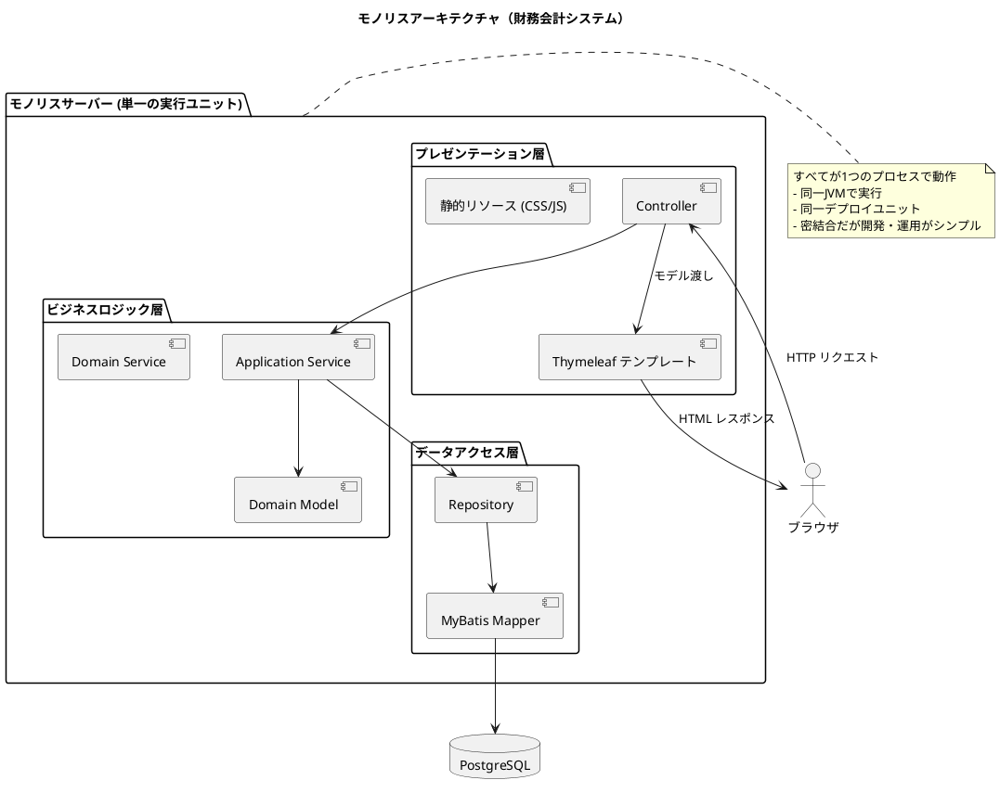
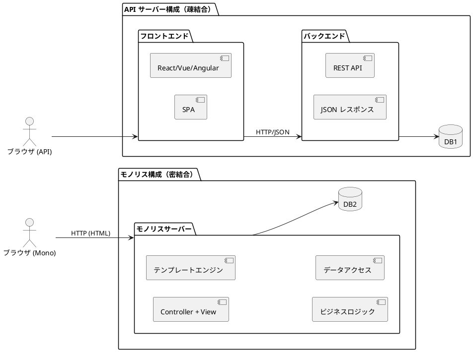
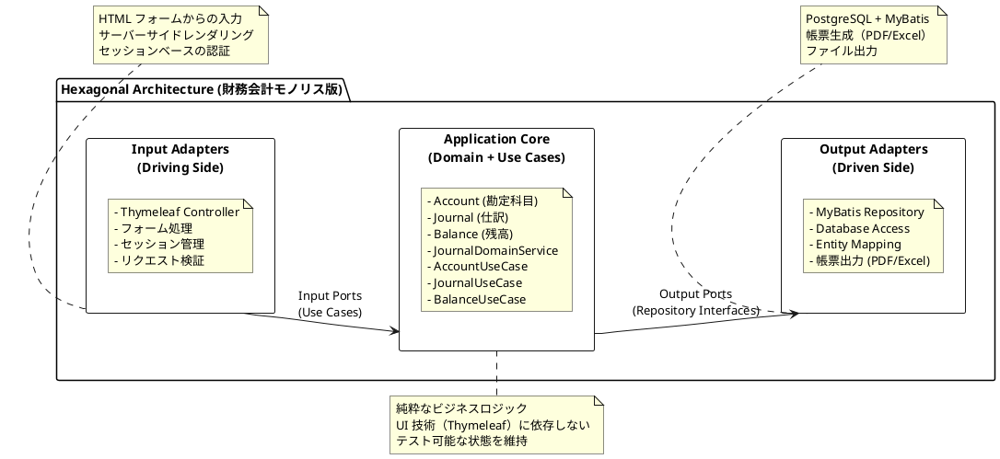
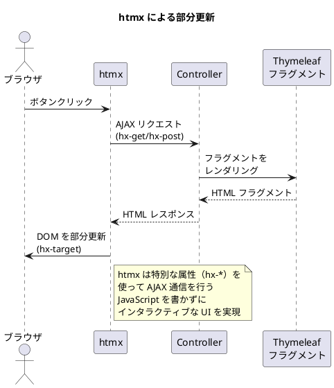

# 実践データベース設計：財務会計システム 研究 1 - モノリスサービスの実装

## はじめに

本研究では、API サーバー構成（第21章）とは異なるアプローチとして、**モノリスアーキテクチャ**による財務会計システムを実装します。UI（テンプレートエンジン）、ビジネスロジック、データベースアクセスがすべて同一サーバー内で動作する、伝統的かつ堅実なアーキテクチャです。

---

## 第22章：モノリスアーキテクチャの基礎

### 22.1 モノリスアーキテクチャとは

**モノリス（Monolith / Monolithic Architecture）**とは、「API」と「UI」と「ビジネスロジック」が **1つの実行ユニット**（1つのプロジェクトやバイナリ）にまとまっているアーキテクチャを指します。



**モノリスの主な特徴：**

| 特徴 | 説明 |
|------|------|
| **単一デプロイ** | アプリケーション全体が1つのアーティファクト（JAR/WAR）としてデプロイ |
| **同一プロセス** | UI、ビジネスロジック、データアクセスが同じ JVM で動作 |
| **テンプレートエンジン** | サーバーサイドで HTML を生成してブラウザに返却 |
| **セッション管理** | サーバーサイドでユーザーセッションを管理 |
| **トランザクション境界** | 単一プロセス内でのローカルトランザクション |

---

### 22.2 API サーバー vs モノリス



| 観点 | API サーバー構成 | モノリス構成 |
|------|-----------------|-------------|
| **結合度** | 疎結合（フロントエンドとバックエンドが分離） | 密結合（すべてが同一サーバー） |
| **フロントエンド** | SPA（React/Vue/Angular） | テンプレートエンジン（Thymeleaf） |
| **通信方式** | REST API（JSON） | サーバーサイドレンダリング（HTML） |
| **開発チーム** | フロント/バックエンドで分業可能 | フルスタックで開発 |
| **デプロイ** | 別々にデプロイ可能 | 単一アーティファクトをデプロイ |
| **スケーリング** | 個別にスケール可能 | 全体をスケール |
| **複雑さ** | API 設計・認証・CORS などが必要 | シンプル、設定が少ない |
| **初期開発速度** | 環境構築に時間がかかる | 素早く開発開始できる |
| **SEO** | SSR/SSG が必要な場合あり | サーバーサイドレンダリングで SEO フレンドリー |

### 22.3 モノリスを選択すべき場面

**モノリスが適している状況：**

1. **小〜中規模のチーム**：専門のフロントエンドチームがいない場合
2. **社内システム**：SEO 不要、限られたユーザー数
3. **業務アプリケーション**：複雑な業務フローをサーバーサイドで処理
4. **迅速な開発**：MVP やプロトタイプの素早い構築
5. **運用コスト重視**：インフラ構成をシンプルに保ちたい場合

**財務会計システムにおけるモノリスのメリット：**

```
財務会計システムの特性
├── 社内利用が中心 → SEO 不要、SPA 不要
├── 複雑な業務フロー → サーバーサイドで制御が容易
├── 帳票出力 → サーバーサイドで PDF/Excel 生成
├── 月次締め・決算処理 → バッチ処理との親和性
├── 監査証跡 → サーバーサイドでのログ管理
└── 運用担当者のスキル → シンプルな構成が望ましい
```

---

### 22.4 モノリスにおけるヘキサゴナルアーキテクチャ

モノリスであっても、ヘキサゴナルアーキテクチャ（Ports and Adapters）を採用することで、保守性の高い設計を実現できます。



**モノリスでもヘキサゴナルアーキテクチャを適用する理由：**

1. **テスト容易性**：ドメインロジックを UI から分離してテスト可能
2. **将来の移行**：必要に応じて API 層を追加可能
3. **保守性**：関心の分離により変更影響を局所化
4. **再利用性**：ドメインロジックを複数の UI で共有可能

---

### 22.5 ディレクトリ構成

```
src/main/java/com/example/accounting/
├── domain/                     # ドメイン層（API版と共通）
│   ├── model/
│   │   ├── account/           # 勘定科目
│   │   ├── journal/           # 仕訳
│   │   ├── balance/           # 残高
│   │   └── department/        # 部門
│   └── exception/
│
├── application/               # アプリケーション層（API版と共通）
│   ├── port/
│   │   ├── in/               # Input Port（ユースケース）
│   │   └── out/              # Output Port（リポジトリ）
│   └── service/
│
├── infrastructure/
│   ├── persistence/          # Output Adapter（DB実装）
│   │   ├── mapper/
│   │   └── repository/
│   └── web/                  # Input Adapter（Web実装）
│       ├── controller/       # Thymeleaf Controller
│       ├── form/             # フォームオブジェクト
│       └── helper/           # ビューヘルパー
│
├── config/
│
└── resources/
    ├── templates/            # Thymeleaf テンプレート
    │   ├── layout/           # 共通レイアウト
    │   ├── accounts/         # 勘定科目マスタ画面
    │   ├── journals/         # 仕訳入力画面
    │   ├── balances/         # 残高照会画面
    │   └── reports/          # 帳票出力画面
    ├── static/               # 静的リソース
    │   ├── css/
    │   ├── js/
    │   └── images/
    └── messages.properties   # メッセージリソース
```

---

### 22.6 技術スタックの導入

<details>
<summary>build.gradle.kts</summary>

```kotlin
plugins {
    id("java")
    id("org.springframework.boot") version "3.2.0"
    id("io.spring.dependency-management") version "1.1.4"
}

java {
    toolchain {
        languageVersion = JavaLanguageVersion.of(21)
    }
}

dependencies {
    // Spring Boot Web（REST APIではなくMVCとして使用）
    implementation("org.springframework.boot:spring-boot-starter-web")
    implementation("org.springframework.boot:spring-boot-starter-validation")

    // Thymeleaf（テンプレートエンジン）
    implementation("org.springframework.boot:spring-boot-starter-thymeleaf")
    implementation("nz.net.ultraq.thymeleaf:thymeleaf-layout-dialect:3.3.0")

    // Thymeleaf + Spring Security（認証機能を使う場合）
    implementation("org.thymeleaf.extras:thymeleaf-extras-springsecurity6")

    // htmx（モダンなインタラクティブUI）
    // CDN から読み込むため依存関係は不要

    // MyBatis
    implementation("org.mybatis.spring.boot:mybatis-spring-boot-starter:3.0.3")

    // PostgreSQL
    runtimeOnly("org.postgresql:postgresql")

    // Flyway
    implementation("org.flywaydb:flyway-core")
    implementation("org.flywaydb:flyway-database-postgresql")

    // Webjars（Bootstrap等のフロントエンドライブラリ）
    implementation("org.webjars:bootstrap:5.3.2")
    implementation("org.webjars:webjars-locator-core:0.55")

    // 帳票出力
    implementation("org.apache.poi:poi-ooxml:5.2.5")  // Excel
    implementation("com.itextpdf:itext7-core:8.0.2")  // PDF

    // Test
    testImplementation("org.springframework.boot:spring-boot-starter-test")
    testImplementation("org.testcontainers:postgresql:1.19.3")
    testImplementation("org.testcontainers:junit-jupiter:1.19.3")

    // Lombok
    compileOnly("org.projectlombok:lombok")
    annotationProcessor("org.projectlombok:lombok")
}
```

</details>

**パッケージの説明：**

| パッケージ | 用途 |
|-----------|------|
| spring-boot-starter-thymeleaf | サーバーサイドテンプレートエンジン |
| thymeleaf-layout-dialect | レイアウト継承（共通ヘッダー・フッター） |
| webjars:bootstrap | CSS フレームワーク（サーバーから配信） |
| poi-ooxml | Excel ファイル出力（帳票） |
| itext7-core | PDF ファイル出力（帳票） |

---

### 22.7 基本的な Spring Boot + Thymeleaf アプリケーション

<details>
<summary>アプリケーションクラス</summary>

```java
package com.example.accounting;

import org.springframework.boot.SpringApplication;
import org.springframework.boot.autoconfigure.SpringBootApplication;

@SpringBootApplication
public class AccountingApplication {

    public static void main(String[] args) {
        SpringApplication.run(AccountingApplication.class, args);
    }
}
```

</details>

<details>
<summary>application.yml</summary>

```yaml
spring:
  datasource:
    url: jdbc:postgresql://localhost:5432/accounting
    username: postgres
    password: postgres

  thymeleaf:
    cache: false  # 開発時はキャッシュ無効
    prefix: classpath:/templates/
    suffix: .html
    encoding: UTF-8
    mode: HTML

  messages:
    basename: messages
    encoding: UTF-8

mybatis:
  mapper-locations: classpath:mapper/*.xml
  configuration:
    map-underscore-to-camel-case: true

server:
  servlet:
    session:
      timeout: 30m  # セッションタイムアウト
```

</details>

<details>
<summary>共通レイアウト（layout/default.html）</summary>

```html
<!DOCTYPE html>
<html xmlns:th="http://www.thymeleaf.org"
      xmlns:layout="http://www.ultraq.net.nz/thymeleaf/layout"
      lang="ja">
<head>
    <meta charset="UTF-8">
    <meta name="viewport" content="width=device-width, initial-scale=1.0">
    <title layout:title-pattern="$CONTENT_TITLE - $LAYOUT_TITLE">財務会計システム</title>

    <!-- Bootstrap CSS -->
    <link rel="stylesheet" th:href="@{/webjars/bootstrap/css/bootstrap.min.css}">

    <!-- カスタム CSS -->
    <link rel="stylesheet" th:href="@{/css/style.css}">

    <!-- htmx（部分更新用） -->
    <script src="https://unpkg.com/htmx.org@1.9.10"></script>
</head>
<body>
    <!-- ナビゲーションバー -->
    <nav class="navbar navbar-expand-lg navbar-dark bg-primary">
        <div class="container-fluid">
            <a class="navbar-brand" th:href="@{/}">財務会計システム</a>
            <button class="navbar-toggler" type="button" data-bs-toggle="collapse"
                    data-bs-target="#navbarNav">
                <span class="navbar-toggler-icon"></span>
            </button>
            <div class="collapse navbar-collapse" id="navbarNav">
                <ul class="navbar-nav">
                    <li class="nav-item dropdown">
                        <a class="nav-link dropdown-toggle" href="#" role="button"
                           data-bs-toggle="dropdown">マスタ</a>
                        <ul class="dropdown-menu">
                            <li><a class="dropdown-item" th:href="@{/accounts}">勘定科目マスタ</a></li>
                            <li><a class="dropdown-item" th:href="@{/account-structures}">勘定科目構成</a></li>
                            <li><a class="dropdown-item" th:href="@{/tax-transactions}">課税取引マスタ</a></li>
                            <li><a class="dropdown-item" th:href="@{/departments}">部門マスタ</a></li>
                        </ul>
                    </li>
                    <li class="nav-item dropdown">
                        <a class="nav-link dropdown-toggle" href="#" role="button"
                           data-bs-toggle="dropdown">仕訳</a>
                        <ul class="dropdown-menu">
                            <li><a class="dropdown-item" th:href="@{/journals}">仕訳一覧</a></li>
                            <li><a class="dropdown-item" th:href="@{/journals/new}">仕訳入力</a></li>
                            <li><a class="dropdown-item" th:href="@{/journals/import}">仕訳取込</a></li>
                        </ul>
                    </li>
                    <li class="nav-item dropdown">
                        <a class="nav-link dropdown-toggle" href="#" role="button"
                           data-bs-toggle="dropdown">照会</a>
                        <ul class="dropdown-menu">
                            <li><a class="dropdown-item" th:href="@{/balances/daily}">日次残高照会</a></li>
                            <li><a class="dropdown-item" th:href="@{/balances/monthly}">月次残高照会</a></li>
                        </ul>
                    </li>
                    <li class="nav-item dropdown">
                        <a class="nav-link dropdown-toggle" href="#" role="button"
                           data-bs-toggle="dropdown">帳票</a>
                        <ul class="dropdown-menu">
                            <li><a class="dropdown-item" th:href="@{/reports/daily}">日計表</a></li>
                            <li><a class="dropdown-item" th:href="@{/reports/trial-balance}">合計残高試算表</a></li>
                            <li><a class="dropdown-item" th:href="@{/reports/ledger}">総勘定元帳</a></li>
                            <li><hr class="dropdown-divider"></li>
                            <li><a class="dropdown-item" th:href="@{/reports/balance-sheet}">貸借対照表</a></li>
                            <li><a class="dropdown-item" th:href="@{/reports/income-statement}">損益計算書</a></li>
                        </ul>
                    </li>
                </ul>
            </div>
        </div>
    </nav>

    <!-- フラッシュメッセージ -->
    <div class="container mt-3">
        <div th:if="${successMessage}" class="alert alert-success alert-dismissible fade show" role="alert">
            <span th:text="${successMessage}"></span>
            <button type="button" class="btn-close" data-bs-dismiss="alert"></button>
        </div>
        <div th:if="${errorMessage}" class="alert alert-danger alert-dismissible fade show" role="alert">
            <span th:text="${errorMessage}"></span>
            <button type="button" class="btn-close" data-bs-dismiss="alert"></button>
        </div>
    </div>

    <!-- メインコンテンツ -->
    <main class="container mt-4">
        <div layout:fragment="content">
            <!-- 各ページのコンテンツがここに挿入される -->
        </div>
    </main>

    <!-- フッター -->
    <footer class="footer mt-5 py-3 bg-light">
        <div class="container text-center">
            <span class="text-muted">財務会計システム &copy; 2025</span>
        </div>
    </footer>

    <!-- Bootstrap JS -->
    <script th:src="@{/webjars/bootstrap/js/bootstrap.bundle.min.js}"></script>

    <!-- ページ固有のスクリプト -->
    <th:block layout:fragment="scripts"></th:block>
</body>
</html>
```

</details>

---

### 22.8 htmx による部分更新

モノリスアプリケーションでも、**htmx** を使用することで SPA のような操作性を実現できます。ページ全体をリロードせず、必要な部分だけを更新します。



<details>
<summary>htmx の基本的な使い方</summary>

```html
<!-- 勘定科目検索（部分更新） -->
<div class="mb-3">
    <input type="text"
           class="form-control"
           name="keyword"
           placeholder="勘定科目コードまたは勘定科目名で検索"
           hx-get="/accounts/search"
           hx-trigger="keyup changed delay:300ms"
           hx-target="#search-results"
           hx-indicator="#loading">
    <span id="loading" class="htmx-indicator">検索中...</span>
</div>

<!-- 検索結果がここに挿入される -->
<div id="search-results">
    <!-- Controller から返される HTML フラグメント -->
</div>
```

</details>

<details>
<summary>部分更新用 Controller</summary>

```java
@Controller
@RequestMapping("/accounts")
public class AccountController {

    private final AccountUseCase accountUseCase;

    // ... コンストラクタ省略

    /**
     * htmx 用の検索エンドポイント（フラグメントを返す）
     */
    @GetMapping("/search")
    public String search(
            @RequestParam(required = false) String keyword,
            Model model) {

        List<Account> accounts = accountUseCase.searchAccounts(keyword);
        model.addAttribute("accounts", accounts);

        // フラグメントのみを返す
        return "accounts/search-results :: results";
    }
}
```

</details>

---

### 22.9 API サーバー版との Controller の違い

<details>
<summary>API サーバー版（REST Controller）</summary>

```java
@RestController  // JSON を返す
@RequestMapping("/api/accounts")
public class AccountApiController {

    @GetMapping
    public ResponseEntity<List<AccountResponse>> getAllAccounts() {
        List<Account> accounts = accountUseCase.getAllAccounts();
        return ResponseEntity.ok(accounts.stream()
            .map(AccountResponse::from)
            .toList());
    }

    @PostMapping
    public ResponseEntity<AccountResponse> createAccount(
            @Valid @RequestBody CreateAccountRequest request) {  // JSON リクエスト
        Account account = accountUseCase.createAccount(request.toCommand());
        return ResponseEntity.status(HttpStatus.CREATED)
            .body(AccountResponse.from(account));
    }
}
```

</details>

<details>
<summary>モノリス版（MVC Controller）</summary>

```java
@Controller  // HTML を返す
@RequestMapping("/accounts")
public class AccountController {

    @GetMapping
    public String list(Model model) {
        List<Account> accounts = accountUseCase.getAllAccounts();
        model.addAttribute("accounts", accounts);
        return "accounts/list";  // Thymeleaf テンプレート
    }

    @PostMapping
    public String create(
            @Valid @ModelAttribute("form") AccountForm form,  // フォームデータ
            BindingResult bindingResult,
            RedirectAttributes redirectAttributes) {

        if (bindingResult.hasErrors()) {
            return "accounts/new";  // バリデーションエラー時は入力画面に戻る
        }

        accountUseCase.createAccount(form.toCommand());
        redirectAttributes.addFlashAttribute("successMessage", "勘定科目を登録しました");
        return "redirect:/accounts";  // PRG パターン
    }
}
```

</details>

**主な違い：**

| 観点 | API サーバー版 | モノリス版 |
|------|--------------|-----------|
| アノテーション | `@RestController` | `@Controller` |
| 戻り値 | `ResponseEntity<T>` | テンプレート名（String） |
| リクエスト | `@RequestBody`（JSON） | `@ModelAttribute`（フォーム） |
| バリデーション | 例外ハンドラで処理 | `BindingResult` で処理 |
| レスポンス | JSON | HTML（Thymeleaf） |
| リダイレクト | 不要 | PRG パターン |

---

## 第23章：マスタ画面の実装

### 23.1 勘定科目マスタ画面の設計

#### 画面一覧

| 画面 | URL | メソッド | 説明 |
|------|-----|---------|------|
| 勘定科目一覧 | /accounts | GET | 勘定科目の検索・一覧表示 |
| 勘定科目詳細 | /accounts/{accountCode} | GET | 勘定科目の詳細表示 |
| 勘定科目登録 | /accounts/new | GET | 登録フォーム表示 |
| 勘定科目登録処理 | /accounts | POST | 登録処理 |
| 勘定科目編集 | /accounts/{accountCode}/edit | GET | 編集フォーム表示 |
| 勘定科目更新処理 | /accounts/{accountCode} | POST | 更新処理（PUT 代替） |
| 勘定科目削除処理 | /accounts/{accountCode}/delete | POST | 削除処理（DELETE 代替） |

**注意**: HTML フォームは GET/POST のみ対応のため、PUT/DELETE は POST で代替します。

---

### 23.2 フォームオブジェクトの設計

<details>
<summary>AccountForm.java</summary>

```java
package com.example.accounting.infrastructure.web.form;

import com.example.accounting.application.port.in.CreateAccountCommand;
import com.example.accounting.domain.model.account.*;
import jakarta.validation.constraints.NotBlank;
import jakarta.validation.constraints.NotNull;
import jakarta.validation.constraints.Size;
import lombok.Data;

/**
 * 勘定科目登録・編集フォーム
 */
@Data
public class AccountForm {

    @NotBlank(message = "勘定科目コードは必須です")
    @Size(max = 5, message = "勘定科目コードは5文字以内で入力してください")
    private String accountCode;

    @NotBlank(message = "勘定科目名は必須です")
    @Size(max = 40, message = "勘定科目名は40文字以内で入力してください")
    private String accountName;

    @Size(max = 10, message = "勘定科目略名は10文字以内で入力してください")
    private String accountShortName;

    @Size(max = 40, message = "勘定科目カナは40文字以内で入力してください")
    private String accountNameKana;

    @NotNull(message = "BSPL区分は必須です")
    private BsplType bsplType;

    @NotNull(message = "貸借区分は必須です")
    private DebitCreditType debitCreditType;

    @NotNull(message = "取引要素区分は必須です")
    private TransactionElementType transactionElementType;

    @NotNull(message = "集計区分は必須です")
    private AggregationType aggregationType;

    private ManagementAccountType managementAccountType;

    private ExpenseType expenseType;

    private SubsidiaryType subsidiaryType;

    private TaxCalculationType taxCalculationType;

    private String taxTransactionCode;

    /**
     * フォームをコマンドに変換
     */
    public CreateAccountCommand toCommand() {
        return CreateAccountCommand.builder()
            .accountCode(this.accountCode)
            .accountName(this.accountName)
            .accountShortName(this.accountShortName)
            .accountNameKana(this.accountNameKana)
            .bsplType(this.bsplType)
            .debitCreditType(this.debitCreditType)
            .transactionElementType(this.transactionElementType)
            .aggregationType(this.aggregationType)
            .managementAccountType(this.managementAccountType)
            .expenseType(this.expenseType)
            .subsidiaryType(this.subsidiaryType)
            .taxCalculationType(this.taxCalculationType)
            .taxTransactionCode(this.taxTransactionCode)
            .build();
    }

    /**
     * エンティティからフォームを生成
     */
    public static AccountForm from(Account account) {
        AccountForm form = new AccountForm();
        form.setAccountCode(account.getAccountCode());
        form.setAccountName(account.getAccountName());
        form.setAccountShortName(account.getAccountShortName());
        form.setAccountNameKana(account.getAccountNameKana());
        form.setBsplType(account.getBsplType());
        form.setDebitCreditType(account.getDebitCreditType());
        form.setTransactionElementType(account.getTransactionElementType());
        form.setAggregationType(account.getAggregationType());
        form.setManagementAccountType(account.getManagementAccountType());
        form.setExpenseType(account.getExpenseType());
        form.setSubsidiaryType(account.getSubsidiaryType());
        form.setTaxCalculationType(account.getTaxCalculationType());
        form.setTaxTransactionCode(account.getTaxTransactionCode());
        return form;
    }
}
```

</details>

---

### 23.3 勘定科目 Controller の TDD 実装

#### Red: 失敗するテストを書く

<details>
<summary>AccountControllerTest.java</summary>

```java
package com.example.accounting.infrastructure.web.controller;

import com.example.accounting.domain.model.account.*;
import com.example.accounting.infrastructure.persistence.mapper.AccountMapper;
import org.junit.jupiter.api.*;
import org.springframework.beans.factory.annotation.Autowired;
import org.springframework.boot.test.autoconfigure.web.servlet.AutoConfigureMockMvc;
import org.springframework.boot.test.context.SpringBootTest;
import org.springframework.test.context.DynamicPropertyRegistry;
import org.springframework.test.context.DynamicPropertySource;
import org.springframework.test.web.servlet.MockMvc;
import org.testcontainers.containers.PostgreSQLContainer;
import org.testcontainers.junit.jupiter.Container;
import org.testcontainers.junit.jupiter.Testcontainers;

import static org.hamcrest.Matchers.*;
import static org.springframework.test.web.servlet.request.MockMvcRequestBuilders.*;
import static org.springframework.test.web.servlet.result.MockMvcResultMatchers.*;

@SpringBootTest
@AutoConfigureMockMvc
@Testcontainers
@DisplayName("勘定科目マスタ画面")
class AccountControllerTest {

    @Container
    static PostgreSQLContainer<?> postgres = new PostgreSQLContainer<>("postgres:16")
            .withDatabaseName("accounting_test")
            .withUsername("test")
            .withPassword("test");

    @DynamicPropertySource
    static void configureProperties(DynamicPropertyRegistry registry) {
        registry.add("spring.datasource.url", postgres::getJdbcUrl);
        registry.add("spring.datasource.username", postgres::getUsername);
        registry.add("spring.datasource.password", postgres::getPassword);
    }

    @Autowired
    private MockMvc mockMvc;

    @Autowired
    private AccountMapper accountMapper;

    @BeforeEach
    void setUp() {
        accountMapper.deleteAll();
    }

    @Nested
    @DisplayName("GET /accounts - 勘定科目一覧")
    class AccountList {

        @Test
        @DisplayName("勘定科目一覧画面を表示できる")
        void shouldDisplayAccountList() throws Exception {
            // Arrange
            insertTestAccount("11110", "現金", BsplType.BS, DebitCreditType.DEBIT);

            // Act & Assert
            mockMvc.perform(get("/accounts"))
                .andExpect(status().isOk())
                .andExpect(view().name("accounts/list"))
                .andExpect(model().attributeExists("accounts"))
                .andExpect(content().string(containsString("11110")))
                .andExpect(content().string(containsString("現金")));
        }

        @Test
        @DisplayName("BSPL区分でフィルタリングできる")
        void shouldFilterByBsplType() throws Exception {
            // Arrange
            insertTestAccount("11110", "現金", BsplType.BS, DebitCreditType.DEBIT);
            insertTestAccount("41100", "売上高", BsplType.PL, DebitCreditType.CREDIT);

            // Act & Assert
            mockMvc.perform(get("/accounts").param("bsplType", "BS"))
                .andExpect(status().isOk())
                .andExpect(model().attribute("accounts", hasSize(1)))
                .andExpect(content().string(containsString("現金")))
                .andExpect(content().string(not(containsString("売上高"))));
        }
    }

    @Nested
    @DisplayName("POST /accounts - 勘定科目登録処理")
    class CreateAccount {

        @Test
        @DisplayName("勘定科目を登録できる")
        void shouldCreateAccount() throws Exception {
            mockMvc.perform(post("/accounts")
                    .param("accountCode", "11120")
                    .param("accountName", "当座預金")
                    .param("bsplType", "BS")
                    .param("debitCreditType", "DEBIT")
                    .param("transactionElementType", "ASSET")
                    .param("aggregationType", "POSTING"))
                .andExpect(status().is3xxRedirection())
                .andExpect(redirectedUrl("/accounts"))
                .andExpect(flash().attribute("successMessage", containsString("登録")));

            // データベースに保存されていることを確認
            var saved = accountMapper.findByCode("11120");
            Assertions.assertNotNull(saved);
            Assertions.assertEquals("当座預金", saved.getAccountName());
        }

        @Test
        @DisplayName("バリデーションエラー時は入力画面に戻る")
        void shouldReturnFormOnValidationError() throws Exception {
            mockMvc.perform(post("/accounts")
                    .param("accountCode", "")  // 必須項目が空
                    .param("accountName", "")
                    .param("bsplType", "BS"))
                .andExpect(status().isOk())
                .andExpect(view().name("accounts/new"))
                .andExpect(model().attributeHasFieldErrors("form", "accountCode", "accountName"));
        }
    }

    private void insertTestAccount(String code, String name, BsplType bsplType, DebitCreditType debitCreditType) {
        accountMapper.insert(Account.builder()
            .accountCode(code)
            .accountName(name)
            .accountShortName(name)
            .accountNameKana("")
            .bsplType(bsplType)
            .debitCreditType(debitCreditType)
            .transactionElementType(TransactionElementType.ASSET)
            .aggregationType(AggregationType.POSTING)
            .build());
    }
}
```

</details>

#### Green: Controller の実装

<details>
<summary>AccountController.java</summary>

```java
package com.example.accounting.infrastructure.web.controller;

import com.example.accounting.application.port.in.*;
import com.example.accounting.domain.exception.AccountInUseException;
import com.example.accounting.domain.exception.AccountNotFoundException;
import com.example.accounting.domain.exception.DuplicateAccountException;
import com.example.accounting.domain.model.account.*;
import com.example.accounting.infrastructure.web.form.AccountForm;
import jakarta.validation.Valid;
import org.springframework.stereotype.Controller;
import org.springframework.ui.Model;
import org.springframework.validation.BindingResult;
import org.springframework.web.bind.annotation.*;
import org.springframework.web.servlet.mvc.support.RedirectAttributes;

import java.util.List;

/**
 * 勘定科目マスタ Controller
 */
@Controller
@RequestMapping("/accounts")
public class AccountController {

    private final AccountUseCase accountUseCase;

    public AccountController(AccountUseCase accountUseCase) {
        this.accountUseCase = accountUseCase;
    }

    /**
     * 勘定科目一覧画面
     */
    @GetMapping
    public String list(
            @RequestParam(required = false) String keyword,
            @RequestParam(required = false) BsplType bsplType,
            @RequestParam(required = false) DebitCreditType debitCreditType,
            Model model) {

        List<Account> accounts;
        if (keyword != null || bsplType != null || debitCreditType != null) {
            accounts = accountUseCase.searchAccounts(keyword, bsplType, debitCreditType);
        } else {
            accounts = accountUseCase.getAllAccounts();
        }

        model.addAttribute("accounts", accounts);
        model.addAttribute("keyword", keyword);
        model.addAttribute("selectedBsplType", bsplType);
        model.addAttribute("selectedDebitCreditType", debitCreditType);
        addEnumsToModel(model);

        return "accounts/list";
    }

    /**
     * 勘定科目登録画面
     */
    @GetMapping("/new")
    public String newForm(Model model) {
        model.addAttribute("form", new AccountForm());
        addEnumsToModel(model);
        return "accounts/new";
    }

    /**
     * 勘定科目登録処理
     */
    @PostMapping
    public String create(
            @Valid @ModelAttribute("form") AccountForm form,
            BindingResult bindingResult,
            Model model,
            RedirectAttributes redirectAttributes) {

        if (bindingResult.hasErrors()) {
            addEnumsToModel(model);
            return "accounts/new";
        }

        try {
            accountUseCase.createAccount(form.toCommand());
            redirectAttributes.addFlashAttribute("successMessage",
                "勘定科目「" + form.getAccountName() + "」を登録しました");
            return "redirect:/accounts";
        } catch (DuplicateAccountException e) {
            model.addAttribute("errorMessage",
                "勘定科目コード「" + form.getAccountCode() + "」は既に存在します");
            addEnumsToModel(model);
            return "accounts/new";
        }
    }

    /**
     * 勘定科目詳細画面
     */
    @GetMapping("/{accountCode}")
    public String detail(@PathVariable String accountCode, Model model) {
        Account account = accountUseCase.getAccount(accountCode)
            .orElseThrow(() -> new AccountNotFoundException(accountCode));

        model.addAttribute("account", account);
        return "accounts/detail";
    }

    /**
     * 勘定科目削除処理
     */
    @PostMapping("/{accountCode}/delete")
    public String delete(
            @PathVariable String accountCode,
            Model model,
            RedirectAttributes redirectAttributes) {

        try {
            Account account = accountUseCase.getAccount(accountCode)
                .orElseThrow(() -> new AccountNotFoundException(accountCode));

            accountUseCase.deleteAccount(accountCode);
            redirectAttributes.addFlashAttribute("successMessage",
                "勘定科目「" + account.getAccountName() + "」を削除しました");
            return "redirect:/accounts";
        } catch (AccountInUseException e) {
            Account account = accountUseCase.getAccount(accountCode).orElseThrow();
            model.addAttribute("account", account);
            model.addAttribute("errorMessage",
                "この勘定科目は仕訳で使用中のため削除できません");
            return "accounts/detail";
        }
    }

    /**
     * 列挙型をモデルに追加
     */
    private void addEnumsToModel(Model model) {
        model.addAttribute("bsplTypes", BsplType.values());
        model.addAttribute("debitCreditTypes", DebitCreditType.values());
        model.addAttribute("transactionElementTypes", TransactionElementType.values());
        model.addAttribute("aggregationTypes", AggregationType.values());
        model.addAttribute("managementAccountTypes", ManagementAccountType.values());
        model.addAttribute("expenseTypes", ExpenseType.values());
        model.addAttribute("subsidiaryTypes", SubsidiaryType.values());
        model.addAttribute("taxCalculationTypes", TaxCalculationType.values());
    }

    /**
     * 404 エラーハンドリング
     */
    @ExceptionHandler(AccountNotFoundException.class)
    @ResponseStatus(org.springframework.http.HttpStatus.NOT_FOUND)
    public String handleNotFound(AccountNotFoundException e, Model model) {
        model.addAttribute("errorMessage", e.getMessage());
        return "error/404";
    }
}
```

</details>

---

## 第24章：仕訳入力画面の実装

### 24.1 仕訳入力画面の設計

#### 画面一覧

| 画面 | URL | メソッド | 説明 |
|------|-----|---------|------|
| 仕訳一覧 | /journals | GET | 仕訳の検索・一覧表示 |
| 仕訳詳細 | /journals/{journalNumber} | GET | 仕訳の詳細表示 |
| 仕訳入力 | /journals/new | GET | 入力フォーム表示 |
| 仕訳登録処理 | /journals | POST | 登録処理 |
| 仕訳取消 | /journals/{journalNumber}/cancel | POST | 赤黒処理 |

---

### 24.2 仕訳入力フォームオブジェクト

<details>
<summary>JournalForm.java</summary>

```java
package com.example.accounting.infrastructure.web.form;

import com.example.accounting.application.port.in.CreateJournalCommand;
import com.example.accounting.domain.model.journal.SingleComplexType;
import jakarta.validation.Valid;
import jakarta.validation.constraints.NotEmpty;
import jakarta.validation.constraints.NotNull;
import lombok.Data;

import java.time.LocalDate;
import java.util.ArrayList;
import java.util.List;

/**
 * 仕訳入力フォーム
 */
@Data
public class JournalForm {

    @NotNull(message = "起票日は必須です")
    private LocalDate journalDate;

    private String description;

    private boolean closingJournal;

    @NotNull(message = "単複区分は必須です")
    private SingleComplexType singleComplexType;

    @Valid
    @NotEmpty(message = "仕訳明細は1行以上必要です")
    private List<JournalLineForm> lines = new ArrayList<>();

    /**
     * フォームをコマンドに変換
     */
    public CreateJournalCommand toCommand() {
        return CreateJournalCommand.builder()
            .journalDate(this.journalDate)
            .description(this.description)
            .closingJournal(this.closingJournal)
            .singleComplexType(this.singleComplexType)
            .lines(this.lines.stream()
                .map(JournalLineForm::toCommand)
                .toList())
            .build();
    }

    /**
     * 初期化（空の明細行を追加）
     */
    public void initializeLines() {
        if (this.lines.isEmpty()) {
            // 借方1行、貸方1行を追加
            JournalLineForm debitLine = new JournalLineForm();
            debitLine.setDebitCredit("DEBIT");
            this.lines.add(debitLine);

            JournalLineForm creditLine = new JournalLineForm();
            creditLine.setDebitCredit("CREDIT");
            this.lines.add(creditLine);
        }
    }
}
```

</details>

<details>
<summary>JournalLineForm.java</summary>

```java
package com.example.accounting.infrastructure.web.form;

import com.example.accounting.application.port.in.CreateJournalLineCommand;
import jakarta.validation.constraints.NotBlank;
import jakarta.validation.constraints.NotNull;
import jakarta.validation.constraints.Positive;
import lombok.Data;

import java.math.BigDecimal;

/**
 * 仕訳明細行フォーム
 */
@Data
public class JournalLineForm {

    @NotBlank(message = "貸借区分は必須です")
    private String debitCredit;  // "DEBIT" or "CREDIT"

    @NotBlank(message = "勘定科目コードは必須です")
    private String accountCode;

    private String subsidiaryCode;

    @NotNull(message = "金額は必須です")
    @Positive(message = "金額は正の数で入力してください")
    private BigDecimal amount;

    private String taxType;

    private BigDecimal taxRate;

    private String departmentCode;

    private String projectCode;

    private String lineDescription;

    /**
     * フォームをコマンドに変換
     */
    public CreateJournalLineCommand toCommand() {
        return CreateJournalLineCommand.builder()
            .debitCredit(this.debitCredit)
            .accountCode(this.accountCode)
            .subsidiaryCode(this.subsidiaryCode)
            .amount(this.amount)
            .taxType(this.taxType)
            .taxRate(this.taxRate)
            .departmentCode(this.departmentCode)
            .projectCode(this.projectCode)
            .lineDescription(this.lineDescription)
            .build();
    }
}
```

</details>

---

### 24.3 仕訳 Controller の実装

<details>
<summary>JournalController.java</summary>

```java
package com.example.accounting.infrastructure.web.controller;

import com.example.accounting.application.port.in.*;
import com.example.accounting.domain.exception.DebitCreditImbalanceException;
import com.example.accounting.domain.exception.JournalNotFoundException;
import com.example.accounting.domain.model.journal.*;
import com.example.accounting.infrastructure.web.form.JournalForm;
import jakarta.validation.Valid;
import org.springframework.format.annotation.DateTimeFormat;
import org.springframework.stereotype.Controller;
import org.springframework.ui.Model;
import org.springframework.validation.BindingResult;
import org.springframework.web.bind.annotation.*;
import org.springframework.web.servlet.mvc.support.RedirectAttributes;

import java.time.LocalDate;
import java.util.List;

/**
 * 仕訳 Controller
 */
@Controller
@RequestMapping("/journals")
public class JournalController {

    private final JournalUseCase journalUseCase;
    private final AccountUseCase accountUseCase;
    private final DepartmentUseCase departmentUseCase;

    public JournalController(
            JournalUseCase journalUseCase,
            AccountUseCase accountUseCase,
            DepartmentUseCase departmentUseCase) {
        this.journalUseCase = journalUseCase;
        this.accountUseCase = accountUseCase;
        this.departmentUseCase = departmentUseCase;
    }

    /**
     * 仕訳一覧画面
     */
    @GetMapping
    public String list(
            @RequestParam(required = false) @DateTimeFormat(iso = DateTimeFormat.ISO.DATE) LocalDate fromDate,
            @RequestParam(required = false) @DateTimeFormat(iso = DateTimeFormat.ISO.DATE) LocalDate toDate,
            @RequestParam(required = false) String accountCode,
            @RequestParam(required = false) JournalStatus status,
            Model model) {

        // デフォルトは当月
        if (fromDate == null) {
            fromDate = LocalDate.now().withDayOfMonth(1);
        }
        if (toDate == null) {
            toDate = LocalDate.now();
        }

        List<Journal> journals = journalUseCase.searchJournals(fromDate, toDate, accountCode, status);

        model.addAttribute("journals", journals);
        model.addAttribute("fromDate", fromDate);
        model.addAttribute("toDate", toDate);
        model.addAttribute("accountCode", accountCode);
        model.addAttribute("status", status);
        model.addAttribute("statuses", JournalStatus.values());

        return "journals/list";
    }

    /**
     * 仕訳入力画面
     */
    @GetMapping("/new")
    public String newForm(Model model) {
        JournalForm form = new JournalForm();
        form.setJournalDate(LocalDate.now());
        form.setSingleComplexType(SingleComplexType.SINGLE);
        form.initializeLines();

        model.addAttribute("form", form);
        addMasterDataToModel(model);

        return "journals/new";
    }

    /**
     * 仕訳登録処理
     */
    @PostMapping
    public String create(
            @Valid @ModelAttribute("form") JournalForm form,
            BindingResult bindingResult,
            Model model,
            RedirectAttributes redirectAttributes) {

        if (bindingResult.hasErrors()) {
            addMasterDataToModel(model);
            return "journals/new";
        }

        try {
            Journal journal = journalUseCase.createJournal(form.toCommand());
            redirectAttributes.addFlashAttribute("successMessage",
                "仕訳「" + journal.getJournalNumber() + "」を登録しました");
            return "redirect:/journals/" + journal.getJournalNumber();
        } catch (DebitCreditImbalanceException e) {
            model.addAttribute("errorMessage", "借方・貸方の合計が一致しません");
            addMasterDataToModel(model);
            return "journals/new";
        }
    }

    /**
     * 仕訳詳細画面
     */
    @GetMapping("/{journalNumber}")
    public String detail(@PathVariable String journalNumber, Model model) {
        Journal journal = journalUseCase.getJournal(journalNumber)
            .orElseThrow(() -> new JournalNotFoundException(journalNumber));

        model.addAttribute("journal", journal);
        return "journals/detail";
    }

    /**
     * 仕訳取消処理（赤黒処理）
     */
    @PostMapping("/{journalNumber}/cancel")
    public String cancel(
            @PathVariable String journalNumber,
            @RequestParam(required = false) String reason,
            RedirectAttributes redirectAttributes) {

        Journal cancelJournal = journalUseCase.cancelJournal(journalNumber, reason);
        redirectAttributes.addFlashAttribute("successMessage",
            "仕訳「" + journalNumber + "」を取消しました。" +
            "取消仕訳「" + cancelJournal.getJournalNumber() + "」を作成しました。");
        return "redirect:/journals/" + cancelJournal.getJournalNumber();
    }

    /**
     * マスタデータをモデルに追加
     */
    private void addMasterDataToModel(Model model) {
        model.addAttribute("accounts", accountUseCase.getPostingAccounts());
        model.addAttribute("departments", departmentUseCase.getAllDepartments());
        model.addAttribute("singleComplexTypes", SingleComplexType.values());
    }
}
```

</details>

---

## 第25章：帳票出力の実装

### 25.1 帳票出力の設計

財務会計システムでは、以下の帳票を出力します。

| 帳票名 | 説明 | 出力形式 |
|-------|------|---------|
| 日計表 | 日次の仕訳合計 | HTML / Excel / PDF |
| 合計残高試算表 | 月次の勘定科目残高 | HTML / Excel / PDF |
| 総勘定元帳 | 勘定科目別の仕訳明細 | HTML / Excel / PDF |
| 貸借対照表 | 資産・負債・資本の状況 | HTML / Excel / PDF |
| 損益計算書 | 収益・費用の状況 | HTML / Excel / PDF |

---

### 25.2 帳票 Controller の実装

<details>
<summary>ReportController.java</summary>

```java
package com.example.accounting.infrastructure.web.controller;

import com.example.accounting.application.port.in.*;
import com.example.accounting.domain.model.report.*;
import com.example.accounting.infrastructure.report.ExcelReportGenerator;
import com.example.accounting.infrastructure.report.PdfReportGenerator;
import org.springframework.format.annotation.DateTimeFormat;
import org.springframework.http.HttpHeaders;
import org.springframework.http.MediaType;
import org.springframework.http.ResponseEntity;
import org.springframework.stereotype.Controller;
import org.springframework.ui.Model;
import org.springframework.web.bind.annotation.*;

import java.time.LocalDate;
import java.time.YearMonth;

/**
 * 帳票出力 Controller
 */
@Controller
@RequestMapping("/reports")
public class ReportController {

    private final ReportUseCase reportUseCase;
    private final ExcelReportGenerator excelGenerator;
    private final PdfReportGenerator pdfGenerator;

    public ReportController(
            ReportUseCase reportUseCase,
            ExcelReportGenerator excelGenerator,
            PdfReportGenerator pdfGenerator) {
        this.reportUseCase = reportUseCase;
        this.excelGenerator = excelGenerator;
        this.pdfGenerator = pdfGenerator;
    }

    /**
     * 日計表画面
     */
    @GetMapping("/daily")
    public String dailyReport(
            @RequestParam(required = false) @DateTimeFormat(iso = DateTimeFormat.ISO.DATE) LocalDate date,
            Model model) {

        if (date == null) {
            date = LocalDate.now();
        }

        DailyReport report = reportUseCase.getDailyReport(date);
        model.addAttribute("report", report);
        model.addAttribute("date", date);

        return "reports/daily";
    }

    /**
     * 日計表 Excel 出力
     */
    @GetMapping("/daily/excel")
    public ResponseEntity<byte[]> dailyReportExcel(
            @RequestParam @DateTimeFormat(iso = DateTimeFormat.ISO.DATE) LocalDate date) {

        DailyReport report = reportUseCase.getDailyReport(date);
        byte[] excelData = excelGenerator.generateDailyReport(report);

        return ResponseEntity.ok()
            .header(HttpHeaders.CONTENT_DISPOSITION,
                "attachment; filename=\"daily_report_" + date + ".xlsx\"")
            .contentType(MediaType.parseMediaType(
                "application/vnd.openxmlformats-officedocument.spreadsheetml.sheet"))
            .body(excelData);
    }

    /**
     * 日計表 PDF 出力
     */
    @GetMapping("/daily/pdf")
    public ResponseEntity<byte[]> dailyReportPdf(
            @RequestParam @DateTimeFormat(iso = DateTimeFormat.ISO.DATE) LocalDate date) {

        DailyReport report = reportUseCase.getDailyReport(date);
        byte[] pdfData = pdfGenerator.generateDailyReport(report);

        return ResponseEntity.ok()
            .header(HttpHeaders.CONTENT_DISPOSITION,
                "attachment; filename=\"daily_report_" + date + ".pdf\"")
            .contentType(MediaType.APPLICATION_PDF)
            .body(pdfData);
    }

    /**
     * 合計残高試算表画面
     */
    @GetMapping("/trial-balance")
    public String trialBalance(
            @RequestParam(required = false) String fiscalYear,
            @RequestParam(required = false) Integer month,
            Model model) {

        YearMonth yearMonth = (fiscalYear != null && month != null)
            ? YearMonth.of(Integer.parseInt(fiscalYear), month)
            : YearMonth.now();

        TrialBalance report = reportUseCase.getTrialBalance(yearMonth);
        model.addAttribute("report", report);
        model.addAttribute("yearMonth", yearMonth);

        return "reports/trial-balance";
    }

    /**
     * 合計残高試算表 Excel 出力
     */
    @GetMapping("/trial-balance/excel")
    public ResponseEntity<byte[]> trialBalanceExcel(
            @RequestParam String fiscalYear,
            @RequestParam Integer month) {

        YearMonth yearMonth = YearMonth.of(Integer.parseInt(fiscalYear), month);
        TrialBalance report = reportUseCase.getTrialBalance(yearMonth);
        byte[] excelData = excelGenerator.generateTrialBalance(report);

        return ResponseEntity.ok()
            .header(HttpHeaders.CONTENT_DISPOSITION,
                "attachment; filename=\"trial_balance_" + yearMonth + ".xlsx\"")
            .contentType(MediaType.parseMediaType(
                "application/vnd.openxmlformats-officedocument.spreadsheetml.sheet"))
            .body(excelData);
    }

    /**
     * 貸借対照表画面
     */
    @GetMapping("/balance-sheet")
    public String balanceSheet(
            @RequestParam(required = false) @DateTimeFormat(iso = DateTimeFormat.ISO.DATE) LocalDate date,
            Model model) {

        if (date == null) {
            date = LocalDate.now();
        }

        BalanceSheet report = reportUseCase.getBalanceSheet(date);
        model.addAttribute("report", report);
        model.addAttribute("date", date);

        return "reports/balance-sheet";
    }

    /**
     * 損益計算書画面
     */
    @GetMapping("/income-statement")
    public String incomeStatement(
            @RequestParam(required = false) String fiscalYear,
            @RequestParam(required = false) Integer fromMonth,
            @RequestParam(required = false) Integer toMonth,
            Model model) {

        YearMonth from = (fiscalYear != null && fromMonth != null)
            ? YearMonth.of(Integer.parseInt(fiscalYear), fromMonth)
            : YearMonth.now().withMonth(4);  // 期首（4月）

        YearMonth to = (fiscalYear != null && toMonth != null)
            ? YearMonth.of(Integer.parseInt(fiscalYear), toMonth)
            : YearMonth.now();

        IncomeStatement report = reportUseCase.getIncomeStatement(from, to);
        model.addAttribute("report", report);
        model.addAttribute("fromMonth", from);
        model.addAttribute("toMonth", to);

        return "reports/income-statement";
    }
}
```

</details>

---

### 25.3 Excel 帳票生成

<details>
<summary>ExcelReportGenerator.java</summary>

```java
package com.example.accounting.infrastructure.report;

import com.example.accounting.domain.model.report.*;
import org.apache.poi.ss.usermodel.*;
import org.apache.poi.ss.util.CellRangeAddress;
import org.apache.poi.xssf.usermodel.XSSFWorkbook;
import org.springframework.stereotype.Component;

import java.io.ByteArrayOutputStream;
import java.io.IOException;
import java.time.format.DateTimeFormatter;

/**
 * Excel 帳票生成
 */
@Component
public class ExcelReportGenerator {

    /**
     * 日計表 Excel 生成
     */
    public byte[] generateDailyReport(DailyReport report) {
        try (Workbook workbook = new XSSFWorkbook()) {
            Sheet sheet = workbook.createSheet("日計表");

            // スタイル設定
            CellStyle headerStyle = createHeaderStyle(workbook);
            CellStyle amountStyle = createAmountStyle(workbook);

            // タイトル
            Row titleRow = sheet.createRow(0);
            Cell titleCell = titleRow.createCell(0);
            titleCell.setCellValue("日 計 表");
            sheet.addMergedRegion(new CellRangeAddress(0, 0, 0, 5));

            // 日付
            Row dateRow = sheet.createRow(1);
            dateRow.createCell(0).setCellValue(
                report.getDate().format(DateTimeFormatter.ofPattern("yyyy年MM月dd日")));

            // ヘッダー
            Row headerRow = sheet.createRow(3);
            String[] headers = {"勘定科目コード", "勘定科目名", "借方金額", "貸方金額"};
            for (int i = 0; i < headers.length; i++) {
                Cell cell = headerRow.createCell(i);
                cell.setCellValue(headers[i]);
                cell.setCellStyle(headerStyle);
            }

            // データ行
            int rowNum = 4;
            for (DailyReportLine line : report.getLines()) {
                Row row = sheet.createRow(rowNum++);
                row.createCell(0).setCellValue(line.getAccountCode());
                row.createCell(1).setCellValue(line.getAccountName());

                Cell debitCell = row.createCell(2);
                debitCell.setCellValue(line.getDebitAmount().doubleValue());
                debitCell.setCellStyle(amountStyle);

                Cell creditCell = row.createCell(3);
                creditCell.setCellValue(line.getCreditAmount().doubleValue());
                creditCell.setCellStyle(amountStyle);
            }

            // 合計行
            Row totalRow = sheet.createRow(rowNum);
            totalRow.createCell(1).setCellValue("合計");

            Cell totalDebitCell = totalRow.createCell(2);
            totalDebitCell.setCellValue(report.getTotalDebit().doubleValue());
            totalDebitCell.setCellStyle(amountStyle);

            Cell totalCreditCell = totalRow.createCell(3);
            totalCreditCell.setCellValue(report.getTotalCredit().doubleValue());
            totalCreditCell.setCellStyle(amountStyle);

            // 列幅調整
            for (int i = 0; i < 4; i++) {
                sheet.autoSizeColumn(i);
            }

            ByteArrayOutputStream out = new ByteArrayOutputStream();
            workbook.write(out);
            return out.toByteArray();

        } catch (IOException e) {
            throw new RuntimeException("Excel 生成エラー", e);
        }
    }

    private CellStyle createHeaderStyle(Workbook workbook) {
        CellStyle style = workbook.createCellStyle();
        style.setFillForegroundColor(IndexedColors.GREY_25_PERCENT.getIndex());
        style.setFillPattern(FillPatternType.SOLID_FOREGROUND);
        style.setBorderBottom(BorderStyle.THIN);
        style.setBorderTop(BorderStyle.THIN);
        style.setBorderLeft(BorderStyle.THIN);
        style.setBorderRight(BorderStyle.THIN);
        style.setAlignment(HorizontalAlignment.CENTER);
        return style;
    }

    private CellStyle createAmountStyle(Workbook workbook) {
        CellStyle style = workbook.createCellStyle();
        DataFormat format = workbook.createDataFormat();
        style.setDataFormat(format.getFormat("#,##0"));
        style.setAlignment(HorizontalAlignment.RIGHT);
        return style;
    }
}
```

</details>

---

## 第26章：ページネーションの実装

### 26.1 ページネーションの設計

一覧画面でデータ量が多い場合、すべてのデータを一度に表示するとパフォーマンスが低下します。ページネーションを実装して、データを分割して表示します。

| 要素 | 説明 |
|------|------|
| **PageResult<T>** | ページネーション結果を表す汎用クラス |
| **LIMIT/OFFSET** | SQL でのページ分割 |
| **表示件数** | ユーザーが選択可能（10/25/50/100件） |
| **ページナビゲーション** | 最初/前/ページ番号/次/最後 |

---

### 26.2 PageResult クラス

<details>
<summary>PageResult.java</summary>

```java
package com.example.sms.domain.model.common;

import java.util.List;

/**
 * ページネーション結果を表す汎用クラス.
 *
 * @param <T> コンテンツの型
 */
public class PageResult<T> {

    private final List<T> content;
    private final int page;
    private final int size;
    private final long totalElements;
    private final int totalPages;

    public PageResult(List<T> content, int page, int size, long totalElements) {
        this.content = content;
        this.page = page;
        this.size = size;
        this.totalElements = totalElements;
        this.totalPages = size > 0 ? (int) Math.ceil((double) totalElements / size) : 0;
    }

    public List<T> getContent() {
        return content;
    }

    public int getPage() {
        return page;
    }

    public int getSize() {
        return size;
    }

    public long getTotalElements() {
        return totalElements;
    }

    public int getTotalPages() {
        return totalPages;
    }

    public boolean isFirst() {
        return page == 0;
    }

    public boolean isLast() {
        return page >= totalPages - 1;
    }

    public boolean hasPrevious() {
        return page > 0;
    }

    public boolean hasNext() {
        return page < totalPages - 1;
    }
}
```

</details>

---

### 26.3 Mapper 層の実装

ページネーション用のクエリと件数取得クエリを追加します。

<details>
<summary>PartnerMapper.java（抜粋）</summary>

```java
/**
 * ページネーション付きで取引先を検索.
 */
List<Partner> findWithPagination(
    @Param("offset") int offset,
    @Param("limit") int limit,
    @Param("type") String type,
    @Param("keyword") String keyword);

/**
 * 検索条件に一致する取引先の件数を取得.
 */
long count(@Param("type") String type, @Param("keyword") String keyword);
```

</details>

<details>
<summary>PartnerMapper.xml（抜粋）</summary>

```xml
<select id="findWithPagination" resultMap="PartnerResultMap">
    SELECT * FROM "取引先マスタ"
    <where>
        <if test="type == 'customer'">
            "顧客区分" = TRUE
        </if>
        <if test="type == 'supplier'">
            "仕入先区分" = TRUE
        </if>
        <if test="keyword != null and keyword != ''">
            AND (LOWER("取引先コード") LIKE LOWER('%' || #{keyword} || '%')
                 OR LOWER("取引先名") LIKE LOWER('%' || #{keyword} || '%'))
        </if>
    </where>
    ORDER BY "取引先コード"
    LIMIT #{limit} OFFSET #{offset}
</select>

<select id="count" resultType="long">
    SELECT COUNT(*) FROM "取引先マスタ"
    <where>
        <if test="type == 'customer'">
            "顧客区分" = TRUE
        </if>
        <if test="type == 'supplier'">
            "仕入先区分" = TRUE
        </if>
        <if test="keyword != null and keyword != ''">
            AND (LOWER("取引先コード") LIKE LOWER('%' || #{keyword} || '%')
                 OR LOWER("取引先名") LIKE LOWER('%' || #{keyword} || '%'))
        </if>
    </where>
</select>
```

</details>

---

### 26.4 Repository 層の実装

<details>
<summary>PartnerRepository.java（抜粋）</summary>

```java
/**
 * ページネーション付きで取引先を検索.
 */
PageResult<Partner> findWithPagination(int page, int size, String type, String keyword);
```

</details>

<details>
<summary>PartnerRepositoryImpl.java（抜粋）</summary>

```java
@Override
public PageResult<Partner> findWithPagination(int page, int size, String type, String keyword) {
    int offset = page * size;
    List<Partner> partners = partnerMapper.findWithPagination(offset, size, type, keyword);
    long totalElements = partnerMapper.count(type, keyword);
    return new PageResult<>(partners, page, size, totalElements);
}
```

</details>

---

### 26.5 UseCase / Service 層の実装

<details>
<summary>PartnerUseCase.java（抜粋）</summary>

```java
/**
 * ページネーション付きで取引先を取得.
 */
PageResult<Partner> getPartners(int page, int size, String type, String keyword);
```

</details>

<details>
<summary>PartnerService.java（抜粋）</summary>

```java
@Override
@Transactional(readOnly = true)
public PageResult<Partner> getPartners(int page, int size, String type, String keyword) {
    return partnerRepository.findWithPagination(page, size, type, keyword);
}
```

</details>

---

### 26.6 Controller の実装

<details>
<summary>PartnerWebController.java（抜粋）</summary>

```java
@GetMapping
public String list(
        @RequestParam(defaultValue = "0") int page,
        @RequestParam(defaultValue = "10") int size,
        @RequestParam(required = false) String type,
        @RequestParam(required = false) String keyword,
        Model model) {

    PageResult<Partner> partnerPage = partnerUseCase.getPartners(page, size, type, keyword);

    model.addAttribute("partners", partnerPage.getContent());
    model.addAttribute("page", partnerPage);
    model.addAttribute("selectedType", type);
    model.addAttribute("keyword", keyword);
    model.addAttribute("currentSize", size);

    return "partners/list";
}
```

</details>

---

### 26.7 テンプレートの実装

<details>
<summary>list.html ページネーション部分</summary>

```html
<!-- 検索フォーム -->
<div class="search-form">
    <form th:action="@{/partners}" method="get" class="row g-3">
        <!-- 表示件数 -->
        <div class="col-md-2">
            <label class="form-label">表示件数</label>
            <select name="size" class="form-select">
                <option value="10" th:selected="${currentSize == 10}">10件</option>
                <option value="25" th:selected="${currentSize == 25}">25件</option>
                <option value="50" th:selected="${currentSize == 50}">50件</option>
                <option value="100" th:selected="${currentSize == 100}">100件</option>
            </select>
        </div>
        <div class="col-md-2 d-flex align-items-end">
            <button type="submit" class="btn btn-secondary">検索</button>
        </div>
    </form>
</div>

<!-- ページネーション -->
<div class="mt-3">
    <!-- 件数表示 -->
    <div class="text-muted text-center mb-2">
        <span th:if="${page.totalElements > 0}">
            <span th:text="${page.page * page.size + 1}">1</span> -
            <span th:text="${page.page * page.size + #lists.size(partners)}">10</span> 件
            （全 <span th:text="${page.totalElements}">0</span> 件）
        </span>
        <span th:if="${page.totalElements == 0}">0 件</span>
    </div>

    <!-- ページナビゲーション -->
    <nav th:if="${page.totalPages > 1}" aria-label="ページナビゲーション">
        <ul class="pagination justify-content-center mb-0">
            <!-- 最初のページへ -->
            <li class="page-item" th:classappend="${page.first} ? 'disabled'">
                <a class="page-link" th:href="@{/partners(page=0, size=${currentSize})}">&laquo;</a>
            </li>
            <!-- 前のページへ -->
            <li class="page-item" th:classappend="${!page.hasPrevious()} ? 'disabled'">
                <a class="page-link" th:href="@{/partners(page=${page.page - 1}, size=${currentSize})}">&lsaquo;</a>
            </li>

            <!-- ページ番号 -->
            <th:block th:with="startPage=${page.page > 2 ? page.page - 2 : 0},
                               endPage=${page.page + 2 < page.totalPages - 1 ? page.page + 2 : page.totalPages - 1}">
                <li class="page-item" th:if="${startPage > 0}">
                    <span class="page-link">...</span>
                </li>
                <li th:each="i : ${#numbers.sequence(startPage, endPage)}"
                    class="page-item"
                    th:classappend="${i == page.page} ? 'active'">
                    <a class="page-link"
                       th:href="@{/partners(page=${i}, size=${currentSize})}"
                       th:text="${i + 1}">1</a>
                </li>
                <li class="page-item" th:if="${endPage < page.totalPages - 1}">
                    <span class="page-link">...</span>
                </li>
            </th:block>

            <!-- 次のページへ -->
            <li class="page-item" th:classappend="${!page.hasNext()} ? 'disabled'">
                <a class="page-link" th:href="@{/partners(page=${page.page + 1}, size=${currentSize})}">&rsaquo;</a>
            </li>
            <!-- 最後のページへ -->
            <li class="page-item" th:classappend="${page.last} ? 'disabled'">
                <a class="page-link" th:href="@{/partners(page=${page.totalPages - 1}, size=${currentSize})}">&raquo;</a>
            </li>
        </ul>
    </nav>
</div>
```

</details>

---

### 26.8 ページネーションの動作

```
                    ページネーション処理フロー
┌─────────────────────────────────────────────────────────────┐
│  ブラウザ                                                    │
│  /partners?page=2&size=10&keyword=xxx                       │
└─────────────────────────────────────────────────────────────┘
                              │
                              ▼
┌─────────────────────────────────────────────────────────────┐
│  Controller                                                  │
│  - page, size, keyword パラメータを受け取る                   │
│  - UseCase.getPartners(page, size, keyword) を呼び出す       │
└─────────────────────────────────────────────────────────────┘
                              │
                              ▼
┌─────────────────────────────────────────────────────────────┐
│  Service / Repository                                        │
│  - offset = page * size を計算                               │
│  - findWithPagination(offset, size, keyword) を実行          │
│  - count(keyword) で総件数を取得                             │
│  - PageResult<T> を生成して返却                              │
└─────────────────────────────────────────────────────────────┘
                              │
                              ▼
┌─────────────────────────────────────────────────────────────┐
│  SQL (MyBatis)                                               │
│  SELECT * FROM "テーブル"                                    │
│  WHERE ... LIMIT 10 OFFSET 20                               │
└─────────────────────────────────────────────────────────────┘
                              │
                              ▼
┌─────────────────────────────────────────────────────────────┐
│  PageResult<T>                                               │
│  - content: データリスト (10件)                               │
│  - page: 2                                                   │
│  - size: 10                                                  │
│  - totalElements: 57                                         │
│  - totalPages: 6                                             │
│  - isFirst/isLast/hasPrevious/hasNext メソッド               │
└─────────────────────────────────────────────────────────────┘
```

---

### 26.9 検索条件の保持

ページ遷移時に検索条件を保持するため、すべてのリンクに検索パラメータを含めます。

```html
<!-- 検索条件付きページネーションリンク -->
<a th:href="@{/partners(
    page=${i},
    size=${currentSize},
    type=${selectedType},
    keyword=${keyword}
)}">
```

---

## まとめ

### 学んだこと

1. **帳票の種類**: 日計表、試算表、元帳、財務諸表
2. **HTML 表示**: Thymeleaf による帳票画面の実装
3. **Excel 出力**: Apache POI による Excel ファイル生成
4. **PDF 出力**: iText による PDF ファイル生成
5. **ダウンロード**: ResponseEntity による添付ファイル返却
6. **ページネーション**: PageResult<T> による一覧画面のページ分割

---

### 実装した機能

| 機能 | 説明 |
|------|------|
| **ホーム画面** | ダッシュボード、クイックアクセス |
| **勘定科目マスタ** | 一覧・登録・編集・削除・検索 |
| **仕訳入力** | 複合仕訳対応、貸借チェック |
| **帳票出力** | 日計表、試算表、財務諸表 |

### モノリス vs API サーバー

| 観点 | モノリス | API サーバー |
|------|---------|-------------|
| **適用場面** | 社内システム、小〜中規模 | 大規模、SPA 連携 |
| **開発速度** | 高速 | 環境構築に時間 |
| **保守性** | 適切な設計で高い | 高い |
| **チーム構成** | フルスタック | フロント/バック分離 |

### 技術的なポイント

1. **ヘキサゴナルアーキテクチャ**: モノリスでも適用可能
2. **Thymeleaf**: サーバーサイドレンダリング
3. **htmx**: JavaScript 不要の部分更新
4. **PRG パターン**: フォーム二重送信防止
5. **帳票生成**: POI（Excel）、iText（PDF）
