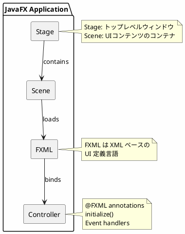
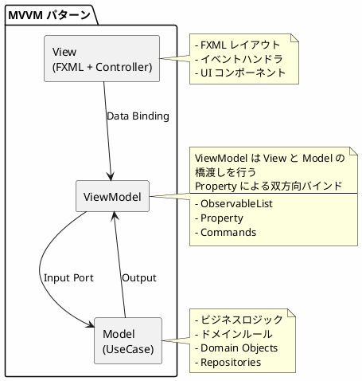
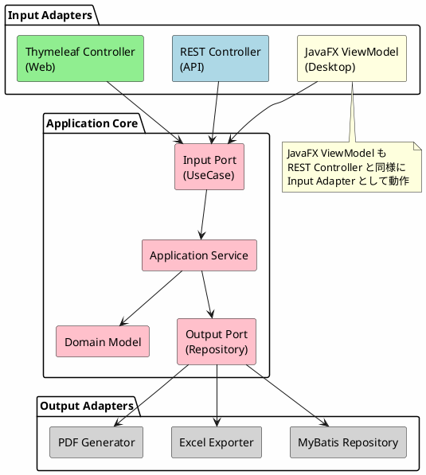
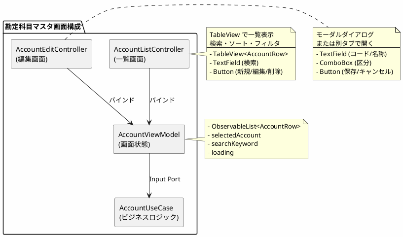
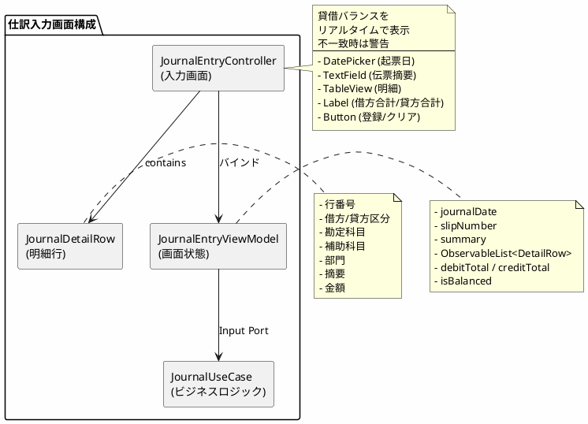
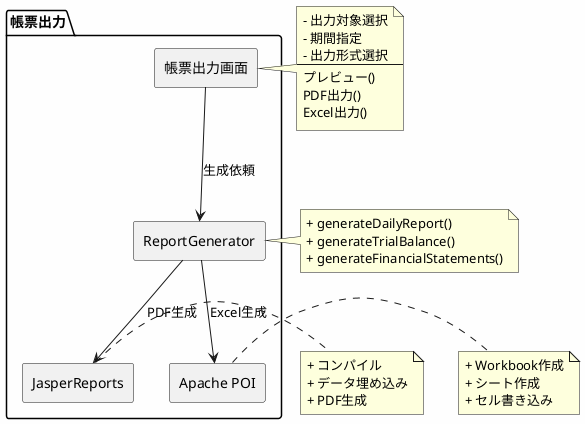

# 実践データベース設計：財務会計システム 研究 2 - JavaFX デスクトップアプリケーションの実装

## はじめに

本研究では、JavaFX を使用したデスクトップアプリケーションの実装を解説します。API サーバー版、モノリスサーバー版と同じ UseCase を共有しながら、リッチクライアント UI を提供します。

### 本パートで学ぶこと

- JavaFX と Spring Boot の統合
- MVVM（Model-View-ViewModel）パターンの実践
- FXML による宣言的 UI 定義
- 双方向データバインディング
- ヘキサゴナルアーキテクチャとの統合

---

## 第22章：JavaFX デスクトップアプリケーションの基礎

### 22.1 JavaFX アーキテクチャ

JavaFX は Java のモダンな GUI フレームワークです。FXML による宣言的 UI 定義と、CSS によるスタイリングを特徴とします。



### 22.2 MVVM パターン

JavaFX では MVVM（Model-View-ViewModel）パターンを採用し、UI とビジネスロジックを分離します。



### 22.3 ヘキサゴナルアーキテクチャとの統合

JavaFX アプリケーションはヘキサゴナルアーキテクチャの Input Adapter として動作します。



### 22.4 ディレクトリ構成

```
app/src/main/java/com/example/accounting/
├── infrastructure/
│   ├── in/
│   │   ├── api/           # REST API Controller（既存）
│   │   ├── web/           # Thymeleaf Controller（既存）
│   │   └── javafx/        # JavaFX アプリケーション（新規）
│   │       ├── controller/    # FXML Controller
│   │       ├── viewmodel/     # ViewModel
│   │       ├── view/          # 行モデル（TableView 用）
│   │       ├── dialog/        # ダイアログ
│   │       ├── util/          # ユーティリティ
│   │       └── config/        # 設定（StageManager, FxmlView）
│   └── out/
│       └── persistence/   # MyBatis Repository（既存）
│
└── resources/
    └── fxml/              # FXML ファイル
        ├── main.fxml
        ├── dashboard.fxml
        ├── account/       # 勘定科目マスタ
        ├── journal/       # 仕訳
        ├── balance/       # 残高照会
        └── report/        # 帳票
```

---

## 第23章：JavaFX 環境のセットアップ

### 23.1 build.gradle.kts の設定

<details>
<summary>build.gradle.kts</summary>

```kotlin
plugins {
    java
    id("org.springframework.boot") version "3.2.0"
    id("io.spring.dependency-management") version "1.1.4"
    id("org.openjfx.javafxplugin") version "0.1.0"
}

javafx {
    version = "21"
    modules = listOf("javafx.controls", "javafx.fxml", "javafx.graphics")
}

dependencies {
    // Spring Boot
    implementation("org.springframework.boot:spring-boot-starter")
    implementation("org.springframework.boot:spring-boot-starter-validation")

    // JavaFX 追加コントロール
    implementation("org.controlsfx:controlsfx:11.2.0")

    // アイコン
    implementation("org.kordamp.ikonli:ikonli-javafx:12.3.1")
    implementation("org.kordamp.ikonli:ikonli-fontawesome5-pack:12.3.1")

    // 帳票
    implementation("net.sf.jasperreports:jasperreports:6.20.5")
    implementation("com.github.librepdf:openpdf:1.3.30")
    implementation("org.apache.poi:poi-ooxml:5.2.5")

    // JavaFX テスト
    testImplementation("org.testfx:testfx-core:4.0.18")
    testImplementation("org.testfx:testfx-junit5:4.0.18")
}
```

</details>

**パッケージの説明：**

| パッケージ | 用途 |
|-----------|------|
| javafx.controls | 標準 UI コントロール |
| javafx.fxml | FXML サポート |
| controlsfx | 拡張コントロール |
| ikonli-fontawesome5-pack | FontAwesome アイコン |
| jasperreports | PDF 帳票生成 |
| poi-ooxml | Excel 帳票生成 |
| testfx | JavaFX テスト |

### 23.2 Spring Boot + JavaFX 統合

<details>
<summary>JavaFxApplication.java</summary>

```java
package com.example.accounting.infrastructure.in.javafx;

import javafx.application.Application;
import javafx.application.Platform;
import javafx.stage.Stage;
import org.springframework.boot.builder.SpringApplicationBuilder;
import org.springframework.context.ApplicationEvent;
import org.springframework.context.ConfigurableApplicationContext;

/**
 * JavaFX と Spring Boot を統合するアプリケーションクラス
 */
public class JavaFxApplication extends Application {

    private ConfigurableApplicationContext applicationContext;

    @Override
    public void init() {
        applicationContext = new SpringApplicationBuilder(AccountingApplication.class)
            .run();
    }

    @Override
    public void start(Stage stage) {
        applicationContext.publishEvent(new StageReadyEvent(stage));
    }

    @Override
    public void stop() {
        applicationContext.close();
        Platform.exit();
    }

    /**
     * Stage 準備完了イベント
     */
    public static class StageReadyEvent extends ApplicationEvent {
        public StageReadyEvent(Stage stage) {
            super(stage);
        }

        public Stage getStage() {
            return (Stage) getSource();
        }
    }
}
```

</details>

<details>
<summary>StageManager.java</summary>

```java
package com.example.accounting.infrastructure.in.javafx.config;

import javafx.fxml.FXMLLoader;
import javafx.scene.Parent;
import javafx.scene.Scene;
import javafx.stage.Stage;
import org.springframework.context.ApplicationContext;
import org.springframework.context.ApplicationListener;
import org.springframework.stereotype.Component;

import java.io.IOException;
import java.util.Objects;

/**
 * Stage と Scene の管理を担当するマネージャー
 */
@Component
public class StageManager implements ApplicationListener<JavaFxApplication.StageReadyEvent> {

    private final ApplicationContext applicationContext;
    private Stage primaryStage;

    public StageManager(ApplicationContext applicationContext) {
        this.applicationContext = applicationContext;
    }

    @Override
    public void onApplicationEvent(JavaFxApplication.StageReadyEvent event) {
        this.primaryStage = event.getStage();
        showMainView();
    }

    /**
     * メイン画面を表示
     */
    private void showMainView() {
        switchScene(FxmlView.MAIN);
        primaryStage.setTitle("財務会計システム");
        primaryStage.setWidth(1280);
        primaryStage.setHeight(800);
        primaryStage.show();
    }

    /**
     * シーンを切り替え
     */
    public void switchScene(FxmlView view) {
        Parent root = loadViewNode(view.getFxmlPath());
        Scene scene = new Scene(root);
        scene.getStylesheets().add(
            Objects.requireNonNull(
                getClass().getResource("/fxml/css/application.css")
            ).toExternalForm()
        );
        primaryStage.setScene(scene);
    }

    /**
     * FXML をロード
     */
    public Parent loadViewNode(String fxmlPath) {
        try {
            FXMLLoader loader = new FXMLLoader(getClass().getResource(fxmlPath));
            loader.setControllerFactory(applicationContext::getBean);
            return loader.load();
        } catch (IOException e) {
            throw new RuntimeException("FXMLのロードに失敗: " + fxmlPath, e);
        }
    }

    public ApplicationContext getApplicationContext() {
        return applicationContext;
    }

    public Stage getPrimaryStage() {
        return primaryStage;
    }
}
```

</details>

<details>
<summary>FxmlView.java</summary>

```java
package com.example.accounting.infrastructure.in.javafx.config;

/**
 * FXML 画面の定義
 */
public enum FxmlView {

    // メイン
    MAIN("/fxml/main.fxml", "メイン"),
    DASHBOARD("/fxml/dashboard.fxml", "ダッシュボード"),

    // マスタ
    ACCOUNT_LIST("/fxml/account/account-list.fxml", "勘定科目マスタ"),
    ACCOUNT_EDIT("/fxml/account/account-edit.fxml", "勘定科目編集"),
    ACCOUNT_STRUCTURE("/fxml/account/account-structure.fxml", "勘定科目構成"),
    TAX_TRANSACTION_LIST("/fxml/account/tax-transaction-list.fxml", "課税取引マスタ"),
    DEPARTMENT_LIST("/fxml/account/department-list.fxml", "部門マスタ"),

    // 仕訳
    JOURNAL_ENTRY("/fxml/journal/journal-entry.fxml", "仕訳入力"),
    JOURNAL_LIST("/fxml/journal/journal-list.fxml", "仕訳一覧"),
    JOURNAL_SEARCH("/fxml/journal/journal-search.fxml", "仕訳検索"),

    // 残高照会
    DAILY_BALANCE("/fxml/balance/daily-balance.fxml", "日次残高照会"),
    MONTHLY_BALANCE("/fxml/balance/monthly-balance.fxml", "月次残高照会"),
    ACCOUNT_BALANCE("/fxml/balance/account-balance.fxml", "勘定科目別残高"),

    // 帳票
    DAILY_REPORT("/fxml/report/daily-report.fxml", "日計表"),
    TRIAL_BALANCE("/fxml/report/trial-balance.fxml", "合計残高試算表"),
    FINANCIAL_STATEMENTS("/fxml/report/financial-statements.fxml", "財務諸表");

    private final String fxmlPath;
    private final String title;

    FxmlView(String fxmlPath, String title) {
        this.fxmlPath = fxmlPath;
        this.title = title;
    }

    public String getFxmlPath() {
        return fxmlPath;
    }

    public String getTitle() {
        return title;
    }
}
```

</details>

---

## 第24章：メイン画面とダッシュボードの実装

### 24.1 メイン画面 FXML

<details>
<summary>main.fxml</summary>

```xml
<?xml version="1.0" encoding="UTF-8"?>

<?import javafx.geometry.*?>
<?import javafx.scene.control.*?>
<?import javafx.scene.layout.*?>
<?import org.kordamp.ikonli.javafx.FontIcon?>

<BorderPane xmlns="http://javafx.com/javafx/21"
            xmlns:fx="http://javafx.com/fxml/1"
            fx:controller="com.example.accounting.infrastructure.in.javafx.controller.MainController"
            styleClass="main-container">

    <!-- メニューバー -->
    <top>
        <VBox>
            <MenuBar>
                <!-- ファイルメニュー -->
                <Menu text="ファイル(_F)">
                    <MenuItem text="終了(_X)" onAction="#onExit" accelerator="Alt+F4">
                        <graphic><FontIcon iconLiteral="fas-sign-out-alt"/></graphic>
                    </MenuItem>
                </Menu>

                <!-- マスタメニュー -->
                <Menu text="マスタ(_M)">
                    <MenuItem text="勘定科目マスタ(_A)" onAction="#onAccountMaster">
                        <graphic><FontIcon iconLiteral="fas-book"/></graphic>
                    </MenuItem>
                    <MenuItem text="勘定科目構成(_S)" onAction="#onAccountStructure">
                        <graphic><FontIcon iconLiteral="fas-sitemap"/></graphic>
                    </MenuItem>
                    <MenuItem text="課税取引マスタ(_T)" onAction="#onTaxTransactionMaster">
                        <graphic><FontIcon iconLiteral="fas-percent"/></graphic>
                    </MenuItem>
                    <SeparatorMenuItem/>
                    <MenuItem text="部門マスタ(_D)" onAction="#onDepartmentMaster">
                        <graphic><FontIcon iconLiteral="fas-building"/></graphic>
                    </MenuItem>
                </Menu>

                <!-- 仕訳メニュー -->
                <Menu text="仕訳(_J)">
                    <MenuItem text="仕訳入力(_E)" onAction="#onJournalEntry">
                        <graphic><FontIcon iconLiteral="fas-edit"/></graphic>
                    </MenuItem>
                    <MenuItem text="仕訳一覧(_L)" onAction="#onJournalList">
                        <graphic><FontIcon iconLiteral="fas-list"/></graphic>
                    </MenuItem>
                    <MenuItem text="仕訳検索(_S)" onAction="#onJournalSearch">
                        <graphic><FontIcon iconLiteral="fas-search"/></graphic>
                    </MenuItem>
                </Menu>

                <!-- 残高照会メニュー -->
                <Menu text="残高照会(_B)">
                    <MenuItem text="日次残高照会(_D)" onAction="#onDailyBalance">
                        <graphic><FontIcon iconLiteral="fas-calendar-day"/></graphic>
                    </MenuItem>
                    <MenuItem text="月次残高照会(_M)" onAction="#onMonthlyBalance">
                        <graphic><FontIcon iconLiteral="fas-calendar-alt"/></graphic>
                    </MenuItem>
                    <MenuItem text="勘定科目別残高(_A)" onAction="#onAccountBalance">
                        <graphic><FontIcon iconLiteral="fas-chart-line"/></graphic>
                    </MenuItem>
                </Menu>

                <!-- 帳票メニュー -->
                <Menu text="帳票(_R)">
                    <MenuItem text="日計表(_D)" onAction="#onDailyReport">
                        <graphic><FontIcon iconLiteral="fas-file-invoice"/></graphic>
                    </MenuItem>
                    <MenuItem text="合計残高試算表(_T)" onAction="#onTrialBalance">
                        <graphic><FontIcon iconLiteral="fas-file-alt"/></graphic>
                    </MenuItem>
                    <MenuItem text="財務諸表(_F)" onAction="#onFinancialStatements">
                        <graphic><FontIcon iconLiteral="fas-file-invoice-dollar"/></graphic>
                    </MenuItem>
                </Menu>

                <!-- ヘルプメニュー -->
                <Menu text="ヘルプ(_H)">
                    <MenuItem text="バージョン情報(_A)" onAction="#onAbout">
                        <graphic><FontIcon iconLiteral="fas-info-circle"/></graphic>
                    </MenuItem>
                </Menu>
            </MenuBar>

            <!-- ツールバー -->
            <ToolBar styleClass="tool-bar">
                <Button onAction="#onDashboard" tooltip="ダッシュボード">
                    <graphic><FontIcon iconLiteral="fas-home" iconSize="18"/></graphic>
                </Button>
                <Separator orientation="VERTICAL"/>
                <Button onAction="#onAccountMaster" tooltip="勘定科目マスタ">
                    <graphic><FontIcon iconLiteral="fas-book" iconSize="18"/></graphic>
                </Button>
                <Button onAction="#onJournalEntry" tooltip="仕訳入力">
                    <graphic><FontIcon iconLiteral="fas-edit" iconSize="18"/></graphic>
                </Button>
                <Button onAction="#onJournalList" tooltip="仕訳一覧">
                    <graphic><FontIcon iconLiteral="fas-list" iconSize="18"/></graphic>
                </Button>
                <Separator orientation="VERTICAL"/>
                <Button onAction="#onDailyBalance" tooltip="日次残高照会">
                    <graphic><FontIcon iconLiteral="fas-calendar-day" iconSize="18"/></graphic>
                </Button>
                <Button onAction="#onMonthlyBalance" tooltip="月次残高照会">
                    <graphic><FontIcon iconLiteral="fas-calendar-alt" iconSize="18"/></graphic>
                </Button>
                <Separator orientation="VERTICAL"/>
                <Button onAction="#onDailyReport" tooltip="日計表">
                    <graphic><FontIcon iconLiteral="fas-file-invoice" iconSize="18"/></graphic>
                </Button>
                <Button onAction="#onTrialBalance" tooltip="合計残高試算表">
                    <graphic><FontIcon iconLiteral="fas-file-alt" iconSize="18"/></graphic>
                </Button>
            </ToolBar>
        </VBox>
    </top>

    <!-- メインコンテンツ（タブパネル） -->
    <center>
        <TabPane fx:id="mainTabPane" tabClosingPolicy="ALL_TABS">
            <!-- 初期表示はダッシュボード -->
        </TabPane>
    </center>

    <!-- ステータスバー -->
    <bottom>
        <HBox styleClass="status-bar" spacing="10">
            <Label fx:id="statusMessage" text="準備完了"/>
            <Pane HBox.hgrow="ALWAYS"/>
            <Label fx:id="fiscalPeriod" text="2025年度"/>
            <Separator orientation="VERTICAL"/>
            <Label fx:id="currentDateTime"/>
        </HBox>
    </bottom>
</BorderPane>
```

</details>

### 24.2 MainController.java

<details>
<summary>MainController.java</summary>

```java
package com.example.accounting.infrastructure.in.javafx.controller;

import com.example.accounting.infrastructure.in.javafx.config.FxmlView;
import com.example.accounting.infrastructure.in.javafx.config.StageManager;
import javafx.animation.Animation;
import javafx.animation.KeyFrame;
import javafx.animation.Timeline;
import javafx.fxml.FXML;
import javafx.fxml.Initializable;
import javafx.scene.control.*;
import javafx.util.Duration;
import org.springframework.stereotype.Component;

import java.net.URL;
import java.time.LocalDateTime;
import java.time.format.DateTimeFormatter;
import java.util.Optional;
import java.util.ResourceBundle;

/**
 * メイン画面 Controller
 */
@Component
public class MainController implements Initializable {

    private final StageManager stageManager;

    @FXML private TabPane mainTabPane;
    @FXML private Label statusMessage;
    @FXML private Label fiscalPeriod;
    @FXML private Label currentDateTime;

    private static final DateTimeFormatter DATE_TIME_FORMATTER =
        DateTimeFormatter.ofPattern("yyyy/MM/dd HH:mm:ss");

    public MainController(StageManager stageManager) {
        this.stageManager = stageManager;
    }

    @Override
    public void initialize(URL location, ResourceBundle resources) {
        startClock();
        openInTab(FxmlView.DASHBOARD);
    }

    private void startClock() {
        Timeline clock = new Timeline(
            new KeyFrame(Duration.seconds(1), e -> {
                currentDateTime.setText(
                    LocalDateTime.now().format(DATE_TIME_FORMATTER)
                );
            })
        );
        clock.setCycleCount(Animation.INDEFINITE);
        clock.play();
    }

    // ========== メニューアクション ==========

    @FXML
    private void onExit() {
        Alert alert = new Alert(Alert.AlertType.CONFIRMATION);
        alert.setTitle("終了確認");
        alert.setHeaderText("アプリケーションを終了しますか？");

        Optional<ButtonType> result = alert.showAndWait();
        if (result.isPresent() && result.get() == ButtonType.OK) {
            System.exit(0);
        }
    }

    @FXML
    private void onDashboard() {
        openInTab(FxmlView.DASHBOARD);
    }

    // ----- マスタ -----

    @FXML
    private void onAccountMaster() {
        openInTab(FxmlView.ACCOUNT_LIST);
    }

    @FXML
    private void onAccountStructure() {
        openInTab(FxmlView.ACCOUNT_STRUCTURE);
    }

    @FXML
    private void onTaxTransactionMaster() {
        openInTab(FxmlView.TAX_TRANSACTION_LIST);
    }

    @FXML
    private void onDepartmentMaster() {
        openInTab(FxmlView.DEPARTMENT_LIST);
    }

    // ----- 仕訳 -----

    @FXML
    private void onJournalEntry() {
        openInTab(FxmlView.JOURNAL_ENTRY);
    }

    @FXML
    private void onJournalList() {
        openInTab(FxmlView.JOURNAL_LIST);
    }

    @FXML
    private void onJournalSearch() {
        openInTab(FxmlView.JOURNAL_SEARCH);
    }

    // ----- 残高照会 -----

    @FXML
    private void onDailyBalance() {
        openInTab(FxmlView.DAILY_BALANCE);
    }

    @FXML
    private void onMonthlyBalance() {
        openInTab(FxmlView.MONTHLY_BALANCE);
    }

    @FXML
    private void onAccountBalance() {
        openInTab(FxmlView.ACCOUNT_BALANCE);
    }

    // ----- 帳票 -----

    @FXML
    private void onDailyReport() {
        openInTab(FxmlView.DAILY_REPORT);
    }

    @FXML
    private void onTrialBalance() {
        openInTab(FxmlView.TRIAL_BALANCE);
    }

    @FXML
    private void onFinancialStatements() {
        openInTab(FxmlView.FINANCIAL_STATEMENTS);
    }

    // ----- ヘルプ -----

    @FXML
    private void onAbout() {
        Alert alert = new Alert(Alert.AlertType.INFORMATION);
        alert.setTitle("バージョン情報");
        alert.setHeaderText("財務会計システム");
        alert.setContentText("""
            バージョン: 1.0.0

            D社 製造業向け財務会計システム

            Copyright (c) 2025
            """);
        alert.showAndWait();
    }

    // ========== ユーティリティ ==========

    /**
     * TabPane 内に画面を開く
     */
    private void openInTab(FxmlView view) {
        // 既存タブをチェック
        for (Tab tab : mainTabPane.getTabs()) {
            if (tab.getText().equals(view.getTitle())) {
                mainTabPane.getSelectionModel().select(tab);
                return;
            }
        }

        // 新しいタブを作成
        try {
            var loader = new javafx.fxml.FXMLLoader(
                getClass().getResource(view.getFxmlPath())
            );
            loader.setControllerFactory(
                stageManager.getApplicationContext()::getBean
            );

            Tab tab = new Tab(view.getTitle());
            tab.setContent(loader.load());
            mainTabPane.getTabs().add(tab);
            mainTabPane.getSelectionModel().select(tab);

            setStatus(view.getTitle() + " を開きました");
        } catch (Exception e) {
            showError("画面を開けませんでした: " + e.getMessage());
        }
    }

    private void setStatus(String message) {
        statusMessage.setText(message);
    }

    private void showError(String message) {
        Alert alert = new Alert(Alert.AlertType.ERROR);
        alert.setTitle("エラー");
        alert.setHeaderText(null);
        alert.setContentText(message);
        alert.showAndWait();
    }
}
```

</details>

### 24.3 ダッシュボード FXML

<details>
<summary>dashboard.fxml</summary>

```xml
<?xml version="1.0" encoding="UTF-8"?>

<?import javafx.geometry.*?>
<?import javafx.scene.chart.*?>
<?import javafx.scene.control.*?>
<?import javafx.scene.layout.*?>
<?import org.kordamp.ikonli.javafx.FontIcon?>

<ScrollPane xmlns="http://javafx.com/javafx/21"
            xmlns:fx="http://javafx.com/fxml/1"
            fx:controller="com.example.accounting.infrastructure.in.javafx.controller.DashboardController"
            fitToWidth="true" fitToHeight="true">

    <VBox spacing="20" styleClass="dashboard">
        <padding><Insets top="20" right="20" bottom="20" left="20"/></padding>

        <!-- タイトル -->
        <Label text="ダッシュボード" styleClass="title"/>

        <!-- サマリーカード -->
        <HBox spacing="20">
            <!-- 当月仕訳件数 -->
            <VBox styleClass="dashboard-card" alignment="CENTER" HBox.hgrow="ALWAYS">
                <Label text="当月仕訳件数" styleClass="card-title"/>
                <Label fx:id="monthlyJournalCount" text="0" styleClass="card-value"/>
                <Label text="件"/>
            </VBox>

            <!-- 当月仕訳金額 -->
            <VBox styleClass="dashboard-card" alignment="CENTER" HBox.hgrow="ALWAYS">
                <Label text="当月仕訳金額（借方）" styleClass="card-title"/>
                <Label fx:id="monthlyDebitAmount" text="¥0" styleClass="card-value"/>
            </VBox>

            <!-- 当月仕訳金額 -->
            <VBox styleClass="dashboard-card" alignment="CENTER" HBox.hgrow="ALWAYS">
                <Label text="当月仕訳金額（貸方）" styleClass="card-title"/>
                <Label fx:id="monthlyCreditAmount" text="¥0" styleClass="card-value"/>
            </VBox>

            <!-- 現金預金残高 -->
            <VBox styleClass="dashboard-card" alignment="CENTER" HBox.hgrow="ALWAYS">
                <Label text="現金預金残高" styleClass="card-title"/>
                <Label fx:id="cashBalance" text="¥0" styleClass="card-value"/>
            </VBox>
        </HBox>

        <!-- チャートエリア -->
        <HBox spacing="20" VBox.vgrow="ALWAYS">
            <!-- 勘定科目別残高グラフ -->
            <VBox styleClass="chart-container" HBox.hgrow="ALWAYS">
                <Label text="勘定科目別残高（資産）" styleClass="chart-title"/>
                <PieChart fx:id="assetChart" legendSide="BOTTOM"/>
            </VBox>

            <!-- 月別仕訳件数推移 -->
            <VBox styleClass="chart-container" HBox.hgrow="ALWAYS">
                <Label text="月別仕訳件数推移" styleClass="chart-title"/>
                <BarChart fx:id="journalTrendChart">
                    <xAxis><CategoryAxis label="月"/></xAxis>
                    <yAxis><NumberAxis label="件数"/></yAxis>
                </BarChart>
            </VBox>
        </HBox>

        <!-- 最近の仕訳 -->
        <VBox spacing="10">
            <Label text="最近の仕訳" styleClass="section-title"/>
            <TableView fx:id="recentJournalsTable" prefHeight="200">
                <columns>
                    <TableColumn text="起票日" prefWidth="100" fx:id="dateColumn"/>
                    <TableColumn text="伝票番号" prefWidth="120" fx:id="slipNoColumn"/>
                    <TableColumn text="摘要" prefWidth="300" fx:id="summaryColumn"/>
                    <TableColumn text="借方金額" prefWidth="120" styleClass="amount-column" fx:id="debitColumn"/>
                    <TableColumn text="貸方金額" prefWidth="120" styleClass="amount-column" fx:id="creditColumn"/>
                </columns>
                <placeholder>
                    <Label text="仕訳データがありません"/>
                </placeholder>
            </TableView>
        </VBox>

        <!-- クイックアクセス -->
        <HBox spacing="10">
            <Button text="仕訳入力" styleClass="primary" onAction="#onQuickJournalEntry">
                <graphic><FontIcon iconLiteral="fas-edit"/></graphic>
            </Button>
            <Button text="日計表出力" onAction="#onQuickDailyReport">
                <graphic><FontIcon iconLiteral="fas-file-invoice"/></graphic>
            </Button>
            <Button text="試算表出力" onAction="#onQuickTrialBalance">
                <graphic><FontIcon iconLiteral="fas-file-alt"/></graphic>
            </Button>
            <Button text="データ更新" onAction="#onRefresh">
                <graphic><FontIcon iconLiteral="fas-sync-alt"/></graphic>
            </Button>
        </HBox>
    </VBox>
</ScrollPane>
```

</details>

---

## 第25章：勘定科目マスタ画面の実装

### 25.1 勘定科目マスタ画面の設計

勘定科目マスタ画面は、一覧表示・検索・登録・編集・削除の機能を提供します。



### 25.2 AccountRow.java（View 用データクラス）

<details>
<summary>AccountRow.java</summary>

```java
package com.example.accounting.infrastructure.in.javafx.view;

import javafx.beans.property.*;

/**
 * 勘定科目マスタ画面用の行モデル
 * JavaFX Property による双方向バインディング対応
 */
public class AccountRow {

    private final StringProperty accountCode = new SimpleStringProperty();
    private final StringProperty accountName = new SimpleStringProperty();
    private final StringProperty bsplTypeName = new SimpleStringProperty();
    private final StringProperty debitCreditTypeName = new SimpleStringProperty();
    private final StringProperty elementTypeName = new SimpleStringProperty();
    private final StringProperty aggregationTypeName = new SimpleStringProperty();
    private final BooleanProperty active = new SimpleBooleanProperty();

    // ========== コンストラクタ ==========

    public AccountRow() {
    }

    public AccountRow(String accountCode, String accountName,
                      String bsplTypeName, String debitCreditTypeName,
                      String elementTypeName, String aggregationTypeName,
                      boolean active) {
        setAccountCode(accountCode);
        setAccountName(accountName);
        setBsplTypeName(bsplTypeName);
        setDebitCreditTypeName(debitCreditTypeName);
        setElementTypeName(elementTypeName);
        setAggregationTypeName(aggregationTypeName);
        setActive(active);
    }

    // ========== Property アクセサ ==========

    public StringProperty accountCodeProperty() { return accountCode; }
    public StringProperty accountNameProperty() { return accountName; }
    public StringProperty bsplTypeNameProperty() { return bsplTypeName; }
    public StringProperty debitCreditTypeNameProperty() { return debitCreditTypeName; }
    public StringProperty elementTypeNameProperty() { return elementTypeName; }
    public StringProperty aggregationTypeNameProperty() { return aggregationTypeName; }
    public BooleanProperty activeProperty() { return active; }

    // ========== Getter/Setter ==========

    public String getAccountCode() { return accountCode.get(); }
    public void setAccountCode(String value) { accountCode.set(value); }

    public String getAccountName() { return accountName.get(); }
    public void setAccountName(String value) { accountName.set(value); }

    public String getBsplTypeName() { return bsplTypeName.get(); }
    public void setBsplTypeName(String value) { bsplTypeName.set(value); }

    public String getDebitCreditTypeName() { return debitCreditTypeName.get(); }
    public void setDebitCreditTypeName(String value) { debitCreditTypeName.set(value); }

    public String getElementTypeName() { return elementTypeName.get(); }
    public void setElementTypeName(String value) { elementTypeName.set(value); }

    public String getAggregationTypeName() { return aggregationTypeName.get(); }
    public void setAggregationTypeName(String value) { aggregationTypeName.set(value); }

    public boolean isActive() { return active.get(); }
    public void setActive(boolean value) { active.set(value); }
}
```

</details>

### 25.3 AccountViewModel.java

<details>
<summary>AccountViewModel.java</summary>

```java
package com.example.accounting.infrastructure.in.javafx.viewmodel;

import com.example.accounting.application.port.in.AccountUseCase;
import com.example.accounting.application.port.in.command.CreateAccountCommand;
import com.example.accounting.application.port.in.command.UpdateAccountCommand;
import com.example.accounting.domain.model.account.Account;
import com.example.accounting.infrastructure.in.javafx.view.AccountRow;
import javafx.beans.property.*;
import javafx.collections.FXCollections;
import javafx.collections.ObservableList;
import org.springframework.stereotype.Component;

import java.util.List;

/**
 * 勘定科目マスタ画面の ViewModel
 * UI 状態とビジネスロジックの橋渡し
 */
@Component
public class AccountViewModel {

    private final AccountUseCase accountUseCase;

    // 画面状態
    private final ObservableList<AccountRow> accounts = FXCollections.observableArrayList();
    private final ObjectProperty<AccountRow> selectedAccount = new SimpleObjectProperty<>();
    private final StringProperty searchKeyword = new SimpleStringProperty("");
    private final BooleanProperty loading = new SimpleBooleanProperty(false);
    private final StringProperty errorMessage = new SimpleStringProperty();

    // 編集用フィールド
    private final StringProperty editAccountCode = new SimpleStringProperty();
    private final StringProperty editAccountName = new SimpleStringProperty();
    private final ObjectProperty<String> editBsplType = new SimpleObjectProperty<>();
    private final ObjectProperty<String> editDebitCreditType = new SimpleObjectProperty<>();
    private final ObjectProperty<String> editElementType = new SimpleObjectProperty<>();
    private final ObjectProperty<String> editAggregationType = new SimpleObjectProperty<>();

    public AccountViewModel(AccountUseCase accountUseCase) {
        this.accountUseCase = accountUseCase;
    }

    // ========== データ操作 ==========

    /**
     * 勘定科目一覧を検索
     */
    public void search() {
        loading.set(true);
        errorMessage.set(null);

        try {
            List<Account> result;
            String keyword = searchKeyword.get();

            if (keyword == null || keyword.isBlank()) {
                result = accountUseCase.findAll();
            } else {
                result = accountUseCase.searchByKeyword(keyword);
            }

            accounts.clear();
            result.forEach(a -> accounts.add(toRow(a)));
        } catch (Exception e) {
            errorMessage.set("検索エラー: " + e.getMessage());
        } finally {
            loading.set(false);
        }
    }

    /**
     * 勘定科目を新規登録
     */
    public void create() {
        loading.set(true);
        errorMessage.set(null);

        try {
            var command = CreateAccountCommand.builder()
                .accountCode(editAccountCode.get())
                .accountName(editAccountName.get())
                .bsplType(editBsplType.get())
                .debitCreditType(editDebitCreditType.get())
                .elementType(editElementType.get())
                .aggregationType(editAggregationType.get())
                .build();

            Account created = accountUseCase.create(command);
            accounts.add(toRow(created));
            clearEditFields();
        } catch (Exception e) {
            errorMessage.set("登録エラー: " + e.getMessage());
            throw e;
        } finally {
            loading.set(false);
        }
    }

    /**
     * 勘定科目を更新
     */
    public void update() {
        loading.set(true);
        errorMessage.set(null);

        try {
            var command = UpdateAccountCommand.builder()
                .accountCode(editAccountCode.get())
                .accountName(editAccountName.get())
                .bsplType(editBsplType.get())
                .debitCreditType(editDebitCreditType.get())
                .elementType(editElementType.get())
                .aggregationType(editAggregationType.get())
                .build();

            Account updated = accountUseCase.update(command);

            // 一覧を更新
            int index = findRowIndex(updated.getAccountCode());
            if (index >= 0) {
                accounts.set(index, toRow(updated));
            }
        } catch (Exception e) {
            errorMessage.set("更新エラー: " + e.getMessage());
            throw e;
        } finally {
            loading.set(false);
        }
    }

    /**
     * 勘定科目を削除
     */
    public void delete(String accountCode) {
        loading.set(true);
        errorMessage.set(null);

        try {
            accountUseCase.delete(accountCode);

            // 一覧から削除
            accounts.removeIf(row -> row.getAccountCode().equals(accountCode));
        } catch (Exception e) {
            errorMessage.set("削除エラー: " + e.getMessage());
            throw e;
        } finally {
            loading.set(false);
        }
    }

    /**
     * 選択された勘定科目を編集フィールドにロード
     */
    public void loadForEdit(AccountRow row) {
        if (row == null) {
            clearEditFields();
            return;
        }

        editAccountCode.set(row.getAccountCode());
        editAccountName.set(row.getAccountName());
    }

    /**
     * 編集フィールドをクリア
     */
    public void clearEditFields() {
        editAccountCode.set("");
        editAccountName.set("");
        editBsplType.set(null);
        editDebitCreditType.set(null);
        editElementType.set(null);
        editAggregationType.set(null);
    }

    // ========== Property アクセサ ==========

    public ObservableList<AccountRow> getAccounts() { return accounts; }
    public ObjectProperty<AccountRow> selectedAccountProperty() { return selectedAccount; }
    public StringProperty searchKeywordProperty() { return searchKeyword; }
    public BooleanProperty loadingProperty() { return loading; }
    public StringProperty errorMessageProperty() { return errorMessage; }

    public StringProperty editAccountCodeProperty() { return editAccountCode; }
    public StringProperty editAccountNameProperty() { return editAccountName; }
    public ObjectProperty<String> editBsplTypeProperty() { return editBsplType; }
    public ObjectProperty<String> editDebitCreditTypeProperty() { return editDebitCreditType; }
    public ObjectProperty<String> editElementTypeProperty() { return editElementType; }
    public ObjectProperty<String> editAggregationTypeProperty() { return editAggregationType; }

    // ========== ヘルパー ==========

    private AccountRow toRow(Account account) {
        return new AccountRow(
            account.getAccountCode(),
            account.getAccountName(),
            account.getBsplTypeName(),
            account.getDebitCreditTypeName(),
            account.getElementTypeName(),
            account.getAggregationTypeName(),
            account.isActive()
        );
    }

    private int findRowIndex(String accountCode) {
        for (int i = 0; i < accounts.size(); i++) {
            if (accounts.get(i).getAccountCode().equals(accountCode)) {
                return i;
            }
        }
        return -1;
    }
}
```

</details>

---

## 第26章：仕訳入力画面の実装

### 26.1 仕訳入力画面の設計

仕訳入力画面は、複式簿記に基づいた借方・貸方の入力と、貸借バランスチェックを提供します。



### 26.2 JournalDetailRow.java

<details>
<summary>JournalDetailRow.java</summary>

```java
package com.example.accounting.infrastructure.in.javafx.view;

import javafx.beans.property.*;

import java.math.BigDecimal;

/**
 * 仕訳明細行の View モデル
 */
public class JournalDetailRow {

    private final IntegerProperty lineNumber = new SimpleIntegerProperty();
    private final StringProperty debitCreditType = new SimpleStringProperty();
    private final StringProperty accountCode = new SimpleStringProperty();
    private final StringProperty accountName = new SimpleStringProperty();
    private final StringProperty subAccountCode = new SimpleStringProperty();
    private final StringProperty departmentCode = new SimpleStringProperty();
    private final StringProperty lineSummary = new SimpleStringProperty();
    private final ObjectProperty<BigDecimal> amount = new SimpleObjectProperty<>();
    private final StringProperty taxType = new SimpleStringProperty();

    // ========== コンストラクタ ==========

    public JournalDetailRow() {
        this.amount.set(BigDecimal.ZERO);
    }

    public JournalDetailRow(int lineNumber) {
        this();
        setLineNumber(lineNumber);
    }

    // ========== Property アクセサ ==========

    public IntegerProperty lineNumberProperty() { return lineNumber; }
    public StringProperty debitCreditTypeProperty() { return debitCreditType; }
    public StringProperty accountCodeProperty() { return accountCode; }
    public StringProperty accountNameProperty() { return accountName; }
    public StringProperty subAccountCodeProperty() { return subAccountCode; }
    public StringProperty departmentCodeProperty() { return departmentCode; }
    public StringProperty lineSummaryProperty() { return lineSummary; }
    public ObjectProperty<BigDecimal> amountProperty() { return amount; }
    public StringProperty taxTypeProperty() { return taxType; }

    // ========== Getter/Setter ==========

    public int getLineNumber() { return lineNumber.get(); }
    public void setLineNumber(int value) { lineNumber.set(value); }

    public String getDebitCreditType() { return debitCreditType.get(); }
    public void setDebitCreditType(String value) { debitCreditType.set(value); }

    public String getAccountCode() { return accountCode.get(); }
    public void setAccountCode(String value) { accountCode.set(value); }

    public String getAccountName() { return accountName.get(); }
    public void setAccountName(String value) { accountName.set(value); }

    public String getSubAccountCode() { return subAccountCode.get(); }
    public void setSubAccountCode(String value) { subAccountCode.set(value); }

    public String getDepartmentCode() { return departmentCode.get(); }
    public void setDepartmentCode(String value) { departmentCode.set(value); }

    public String getLineSummary() { return lineSummary.get(); }
    public void setLineSummary(String value) { lineSummary.set(value); }

    public BigDecimal getAmount() { return amount.get(); }
    public void setAmount(BigDecimal value) { amount.set(value); }

    public String getTaxType() { return taxType.get(); }
    public void setTaxType(String value) { taxType.set(value); }

    /**
     * 借方かどうか
     */
    public boolean isDebit() {
        return "借方".equals(getDebitCreditType());
    }

    /**
     * 貸方かどうか
     */
    public boolean isCredit() {
        return "貸方".equals(getDebitCreditType());
    }
}
```

</details>

### 26.3 JournalEntryViewModel.java

<details>
<summary>JournalEntryViewModel.java</summary>

```java
package com.example.accounting.infrastructure.in.javafx.viewmodel;

import com.example.accounting.application.port.in.JournalUseCase;
import com.example.accounting.application.port.in.AccountUseCase;
import com.example.accounting.application.port.in.command.CreateJournalCommand;
import com.example.accounting.domain.model.journal.Journal;
import com.example.accounting.infrastructure.in.javafx.view.JournalDetailRow;
import javafx.beans.property.*;
import javafx.collections.FXCollections;
import javafx.collections.ListChangeListener;
import javafx.collections.ObservableList;
import org.springframework.stereotype.Component;

import java.math.BigDecimal;
import java.time.LocalDate;
import java.util.stream.Collectors;

/**
 * 仕訳入力画面の ViewModel
 */
@Component
public class JournalEntryViewModel {

    private final JournalUseCase journalUseCase;
    private final AccountUseCase accountUseCase;

    // ヘッダー情報
    private final ObjectProperty<LocalDate> journalDate = new SimpleObjectProperty<>(LocalDate.now());
    private final StringProperty slipNumber = new SimpleStringProperty();
    private final StringProperty summary = new SimpleStringProperty();
    private final BooleanProperty closingJournal = new SimpleBooleanProperty(false);

    // 明細
    private final ObservableList<JournalDetailRow> details = FXCollections.observableArrayList();

    // 合計
    private final ObjectProperty<BigDecimal> debitTotal = new SimpleObjectProperty<>(BigDecimal.ZERO);
    private final ObjectProperty<BigDecimal> creditTotal = new SimpleObjectProperty<>(BigDecimal.ZERO);
    private final ObjectProperty<BigDecimal> difference = new SimpleObjectProperty<>(BigDecimal.ZERO);
    private final BooleanProperty balanced = new SimpleBooleanProperty(true);

    // 状態
    private final BooleanProperty loading = new SimpleBooleanProperty(false);
    private final StringProperty errorMessage = new SimpleStringProperty();

    public JournalEntryViewModel(JournalUseCase journalUseCase,
                                  AccountUseCase accountUseCase) {
        this.journalUseCase = journalUseCase;
        this.accountUseCase = accountUseCase;

        setupListeners();
        initializeDetails();
    }

    private void setupListeners() {
        // 明細変更時に合計を再計算
        details.addListener((ListChangeListener<JournalDetailRow>) c -> {
            calculateTotals();
        });
    }

    private void initializeDetails() {
        // 初期明細行を追加（借方1行、貸方1行）
        addLine("借方");
        addLine("貸方");
    }

    // ========== データ操作 ==========

    /**
     * 明細行を追加
     */
    public void addLine(String debitCreditType) {
        JournalDetailRow row = new JournalDetailRow(details.size() + 1);
        row.setDebitCreditType(debitCreditType);

        // 金額変更時に合計を再計算
        row.amountProperty().addListener((obs, oldVal, newVal) -> calculateTotals());
        row.debitCreditTypeProperty().addListener((obs, oldVal, newVal) -> calculateTotals());

        details.add(row);
    }

    /**
     * 明細行を削除
     */
    public void removeLine(int index) {
        if (index >= 0 && index < details.size() && details.size() > 2) {
            details.remove(index);
            // 行番号を振り直し
            for (int i = 0; i < details.size(); i++) {
                details.get(i).setLineNumber(i + 1);
            }
        }
    }

    /**
     * 合計を計算
     */
    private void calculateTotals() {
        BigDecimal debit = details.stream()
            .filter(JournalDetailRow::isDebit)
            .map(row -> row.getAmount() != null ? row.getAmount() : BigDecimal.ZERO)
            .reduce(BigDecimal.ZERO, BigDecimal::add);

        BigDecimal credit = details.stream()
            .filter(JournalDetailRow::isCredit)
            .map(row -> row.getAmount() != null ? row.getAmount() : BigDecimal.ZERO)
            .reduce(BigDecimal.ZERO, BigDecimal::add);

        debitTotal.set(debit);
        creditTotal.set(credit);
        difference.set(debit.subtract(credit).abs());
        balanced.set(debit.compareTo(credit) == 0);
    }

    /**
     * 勘定科目コードから勘定科目名を取得
     */
    public void lookupAccountName(JournalDetailRow row) {
        String code = row.getAccountCode();
        if (code != null && !code.isBlank()) {
            try {
                var account = accountUseCase.findByCode(code);
                if (account != null) {
                    row.setAccountName(account.getAccountName());
                }
            } catch (Exception e) {
                row.setAccountName("（該当なし）");
            }
        }
    }

    /**
     * 仕訳を登録
     */
    public Journal save() {
        loading.set(true);
        errorMessage.set(null);

        try {
            // バランスチェック
            if (!balanced.get()) {
                throw new IllegalStateException("借方合計と貸方合計が一致しません");
            }

            // コマンドを構築
            var command = CreateJournalCommand.builder()
                .journalDate(journalDate.get())
                .summary(summary.get())
                .closingJournal(closingJournal.get())
                .details(details.stream()
                    .filter(d -> d.getAccountCode() != null && !d.getAccountCode().isBlank())
                    .map(d -> CreateJournalCommand.DetailCommand.builder()
                        .lineNumber(d.getLineNumber())
                        .debitCreditType(d.getDebitCreditType())
                        .accountCode(d.getAccountCode())
                        .subAccountCode(d.getSubAccountCode())
                        .departmentCode(d.getDepartmentCode())
                        .lineSummary(d.getLineSummary())
                        .amount(d.getAmount())
                        .taxType(d.getTaxType())
                        .build())
                    .collect(Collectors.toList()))
                .build();

            Journal created = journalUseCase.create(command);
            slipNumber.set(created.getSlipNumber());

            return created;
        } catch (Exception e) {
            errorMessage.set("登録エラー: " + e.getMessage());
            throw e;
        } finally {
            loading.set(false);
        }
    }

    /**
     * 入力をクリア
     */
    public void clear() {
        journalDate.set(LocalDate.now());
        slipNumber.set(null);
        summary.set(null);
        closingJournal.set(false);
        details.clear();
        initializeDetails();
        errorMessage.set(null);
    }

    // ========== Property アクセサ ==========

    public ObjectProperty<LocalDate> journalDateProperty() { return journalDate; }
    public StringProperty slipNumberProperty() { return slipNumber; }
    public StringProperty summaryProperty() { return summary; }
    public BooleanProperty closingJournalProperty() { return closingJournal; }
    public ObservableList<JournalDetailRow> getDetails() { return details; }
    public ObjectProperty<BigDecimal> debitTotalProperty() { return debitTotal; }
    public ObjectProperty<BigDecimal> creditTotalProperty() { return creditTotal; }
    public ObjectProperty<BigDecimal> differenceProperty() { return difference; }
    public BooleanProperty balancedProperty() { return balanced; }
    public BooleanProperty loadingProperty() { return loading; }
    public StringProperty errorMessageProperty() { return errorMessage; }
}
```

</details>

---

## 第27章：帳票出力画面の実装

### 27.1 帳票出力機能の概要

帳票出力画面では、日計表、合計残高試算表、財務諸表を PDF または Excel で出力します。



### 27.2 ReportExporter.java（帳票出力ユーティリティ）

<details>
<summary>ReportExporter.java</summary>

```java
package com.example.accounting.infrastructure.in.javafx.util;

import com.example.accounting.application.dto.DailyBalanceDto;
import com.example.accounting.application.dto.TrialBalanceDto;
import net.sf.jasperreports.engine.*;
import net.sf.jasperreports.engine.data.JRBeanCollectionDataSource;
import org.apache.poi.ss.usermodel.*;
import org.apache.poi.ss.util.CellRangeAddress;
import org.apache.poi.xssf.usermodel.XSSFWorkbook;
import org.springframework.core.io.ClassPathResource;
import org.springframework.stereotype.Component;

import java.io.File;
import java.io.FileOutputStream;
import java.io.InputStream;
import java.math.BigDecimal;
import java.text.NumberFormat;
import java.time.LocalDate;
import java.time.format.DateTimeFormatter;
import java.util.HashMap;
import java.util.List;
import java.util.Locale;
import java.util.Map;

/**
 * 帳票出力ユーティリティ
 */
@Component
public class ReportExporter {

    private static final NumberFormat CURRENCY_FORMAT =
        NumberFormat.getCurrencyInstance(Locale.JAPAN);
    private static final DateTimeFormatter DATE_FORMATTER =
        DateTimeFormatter.ofPattern("yyyy年MM月dd日");

    // ========== PDF 出力 ==========

    /**
     * 日計表を PDF 出力
     */
    public void exportDailyReportToPdf(List<DailyBalanceDto> data,
                                        LocalDate targetDate,
                                        File outputFile) throws Exception {
        // JasperReports テンプレートをロード
        InputStream templateStream = new ClassPathResource(
            "reports/daily_report.jrxml"
        ).getInputStream();
        JasperReport report = JasperCompileManager.compileReport(templateStream);

        // パラメータ設定
        Map<String, Object> parameters = new HashMap<>();
        parameters.put("reportDate", targetDate.format(DATE_FORMATTER));
        parameters.put("companyName", "D社");

        // データソース作成
        JRBeanCollectionDataSource dataSource = new JRBeanCollectionDataSource(data);

        // レポート生成
        JasperPrint print = JasperFillManager.fillReport(report, parameters, dataSource);

        // PDF 出力
        JasperExportManager.exportReportToPdfFile(print, outputFile.getAbsolutePath());
    }

    // ========== Excel 出力 ==========

    /**
     * 日計表を Excel 出力
     */
    public void exportDailyReportToExcel(List<DailyBalanceDto> data,
                                          LocalDate targetDate,
                                          File outputFile) throws Exception {
        try (Workbook workbook = new XSSFWorkbook()) {
            Sheet sheet = workbook.createSheet("日計表");

            // スタイル作成
            CellStyle headerStyle = createHeaderStyle(workbook);
            CellStyle currencyStyle = createCurrencyStyle(workbook);

            int rowIndex = 0;

            // タイトル
            Row titleRow = sheet.createRow(rowIndex++);
            Cell titleCell = titleRow.createCell(0);
            titleCell.setCellValue("日 計 表");
            sheet.addMergedRegion(new CellRangeAddress(0, 0, 0, 5));

            // 日付
            Row dateRow = sheet.createRow(rowIndex++);
            dateRow.createCell(0).setCellValue("対象日: " + targetDate.format(DATE_FORMATTER));

            rowIndex++; // 空行

            // ヘッダー
            Row headerRow = sheet.createRow(rowIndex++);
            String[] headers = {"勘定科目コード", "勘定科目名", "前日残高", "借方金額", "貸方金額", "当日残高"};
            for (int i = 0; i < headers.length; i++) {
                Cell cell = headerRow.createCell(i);
                cell.setCellValue(headers[i]);
                cell.setCellStyle(headerStyle);
            }

            // データ
            BigDecimal totalDebit = BigDecimal.ZERO;
            BigDecimal totalCredit = BigDecimal.ZERO;

            for (DailyBalanceDto row : data) {
                Row dataRow = sheet.createRow(rowIndex++);
                dataRow.createCell(0).setCellValue(row.getAccountCode());
                dataRow.createCell(1).setCellValue(row.getAccountName());

                Cell prevCell = dataRow.createCell(2);
                prevCell.setCellValue(row.getPreviousBalance().doubleValue());
                prevCell.setCellStyle(currencyStyle);

                Cell debitCell = dataRow.createCell(3);
                debitCell.setCellValue(row.getDebitAmount().doubleValue());
                debitCell.setCellStyle(currencyStyle);

                Cell creditCell = dataRow.createCell(4);
                creditCell.setCellValue(row.getCreditAmount().doubleValue());
                creditCell.setCellStyle(currencyStyle);

                Cell currCell = dataRow.createCell(5);
                currCell.setCellValue(row.getCurrentBalance().doubleValue());
                currCell.setCellStyle(currencyStyle);

                totalDebit = totalDebit.add(row.getDebitAmount());
                totalCredit = totalCredit.add(row.getCreditAmount());
            }

            // 合計行
            Row totalRow = sheet.createRow(rowIndex++);
            totalRow.createCell(1).setCellValue("合計");

            Cell totalDebitCell = totalRow.createCell(3);
            totalDebitCell.setCellValue(totalDebit.doubleValue());
            totalDebitCell.setCellStyle(currencyStyle);

            Cell totalCreditCell = totalRow.createCell(4);
            totalCreditCell.setCellValue(totalCredit.doubleValue());
            totalCreditCell.setCellStyle(currencyStyle);

            // 列幅調整
            for (int i = 0; i < headers.length; i++) {
                sheet.autoSizeColumn(i);
            }

            // ファイル出力
            try (FileOutputStream fos = new FileOutputStream(outputFile)) {
                workbook.write(fos);
            }
        }
    }

    private CellStyle createHeaderStyle(Workbook workbook) {
        CellStyle style = workbook.createCellStyle();
        style.setFillForegroundColor(IndexedColors.GREY_25_PERCENT.getIndex());
        style.setFillPattern(FillPatternType.SOLID_FOREGROUND);
        style.setBorderBottom(BorderStyle.THIN);
        style.setBorderTop(BorderStyle.THIN);
        style.setBorderLeft(BorderStyle.THIN);
        style.setBorderRight(BorderStyle.THIN);

        Font font = workbook.createFont();
        font.setBold(true);
        style.setFont(font);

        return style;
    }

    private CellStyle createCurrencyStyle(Workbook workbook) {
        CellStyle style = workbook.createCellStyle();
        DataFormat format = workbook.createDataFormat();
        style.setDataFormat(format.getFormat("#,##0"));
        style.setAlignment(HorizontalAlignment.RIGHT);
        return style;
    }
}
```

</details>

---

## 第28章：CSS スタイルシート

### 28.1 application.css

<details>
<summary>application.css</summary>

```css
/* ========== 基本設定 ========== */
.root {
    -fx-font-family: "Yu Gothic UI", "Meiryo", sans-serif;
    -fx-font-size: 13px;
    -fx-base: #f4f4f4;
    -fx-accent: #0078d4;
    -fx-focus-color: #0078d4;
    -fx-faint-focus-color: transparent;
}

/* ========== メニューバー ========== */
.menu-bar {
    -fx-background-color: #ffffff;
    -fx-border-color: #e0e0e0;
    -fx-border-width: 0 0 1 0;
}

.menu-bar .menu {
    -fx-background-color: transparent;
}

.menu-bar .menu:hover,
.menu-bar .menu:showing {
    -fx-background-color: #e5e5e5;
}

/* ========== ツールバー ========== */
.tool-bar {
    -fx-background-color: #f8f8f8;
    -fx-border-color: #e0e0e0;
    -fx-border-width: 0 0 1 0;
    -fx-padding: 5;
}

.tool-bar .button {
    -fx-background-color: transparent;
    -fx-background-radius: 4;
    -fx-padding: 8;
}

.tool-bar .button:hover {
    -fx-background-color: #e5e5e5;
}

.tool-bar .button:pressed {
    -fx-background-color: #d0d0d0;
}

/* ========== ステータスバー ========== */
.status-bar {
    -fx-background-color: #f0f0f0;
    -fx-border-color: #e0e0e0;
    -fx-border-width: 1 0 0 0;
    -fx-padding: 5 10;
}

/* ========== ダッシュボードカード ========== */
.dashboard-card {
    -fx-background-color: #ffffff;
    -fx-background-radius: 8;
    -fx-border-color: #e0e0e0;
    -fx-border-radius: 8;
    -fx-padding: 20;
    -fx-min-width: 150;
    -fx-effect: dropshadow(gaussian, rgba(0,0,0,0.1), 4, 0, 0, 2);
}

.dashboard-card:hover {
    -fx-effect: dropshadow(gaussian, rgba(0,0,0,0.15), 8, 0, 0, 4);
}

.card-title {
    -fx-font-size: 14px;
    -fx-text-fill: #666666;
}

.card-value {
    -fx-font-size: 28px;
    -fx-font-weight: bold;
    -fx-text-fill: #0078d4;
}

/* ========== テーブル ========== */
.table-view {
    -fx-background-color: #ffffff;
    -fx-border-color: #e0e0e0;
}

.table-view .column-header {
    -fx-background-color: #f8f8f8;
    -fx-border-color: #e0e0e0;
    -fx-border-width: 0 0 1 0;
    -fx-font-weight: bold;
}

.table-view .table-row-cell:selected {
    -fx-background-color: #cce4f7;
}

.table-view .table-row-cell:selected .text {
    -fx-fill: #000000;
}

/* 金額列（右寄せ） */
.amount-column {
    -fx-alignment: CENTER-RIGHT;
}

/* ========== ボタン ========== */
.button {
    -fx-background-color: #ffffff;
    -fx-border-color: #d0d0d0;
    -fx-border-radius: 4;
    -fx-background-radius: 4;
    -fx-padding: 6 16;
}

.button:hover {
    -fx-background-color: #f0f0f0;
}

.button:pressed {
    -fx-background-color: #e0e0e0;
}

.button.primary {
    -fx-background-color: #0078d4;
    -fx-text-fill: #ffffff;
    -fx-border-color: #0078d4;
}

.button.primary:hover {
    -fx-background-color: #006cbd;
}

.button.primary:pressed {
    -fx-background-color: #005ba1;
}

.button.danger {
    -fx-background-color: #d32f2f;
    -fx-text-fill: #ffffff;
    -fx-border-color: #d32f2f;
}

.button.danger:hover {
    -fx-background-color: #c62828;
}

/* ========== テキストフィールド ========== */
.text-field, .text-area, .combo-box, .date-picker {
    -fx-background-color: #ffffff;
    -fx-border-color: #d0d0d0;
    -fx-border-radius: 4;
    -fx-background-radius: 4;
    -fx-padding: 6 10;
}

.text-field:focused, .text-area:focused,
.combo-box:focused, .date-picker:focused {
    -fx-border-color: #0078d4;
    -fx-border-width: 2;
}

/* ========== 仕訳入力画面 ========== */
.journal-entry-view .total-area {
    -fx-background-color: #f8f8f8;
    -fx-padding: 15;
    -fx-border-color: #e0e0e0;
    -fx-border-width: 1 0;
}

.total-label {
    -fx-font-size: 12px;
    -fx-text-fill: #666666;
}

.total-value {
    -fx-font-size: 20px;
    -fx-font-weight: bold;
}

.balance-ok {
    -fx-text-fill: #28a745;
    -fx-font-weight: bold;
}

.balance-ng {
    -fx-text-fill: #dc3545;
    -fx-font-weight: bold;
}

/* ========== フォームラベル ========== */
.form-label {
    -fx-font-weight: bold;
    -fx-min-width: 100;
}

.section-title {
    -fx-font-size: 16px;
    -fx-font-weight: bold;
}

/* ========== タイトル ========== */
.title {
    -fx-font-size: 24px;
    -fx-font-weight: bold;
}

/* ========== タブ ========== */
.tab-pane .tab-header-area {
    -fx-background-color: #f8f8f8;
}

.tab-pane .tab {
    -fx-background-color: #e8e8e8;
    -fx-background-radius: 4 4 0 0;
    -fx-padding: 6 16;
}

.tab-pane .tab:selected {
    -fx-background-color: #ffffff;
}

.tab-pane .tab:hover:!selected {
    -fx-background-color: #d8d8d8;
}
```

</details>

---

## まとめ

### 学習した内容

1. **JavaFX の特徴**
   - FXML による宣言的 UI 定義
   - Scene Builder によるビジュアル編集
   - Property による双方向データバインディング

2. **MVVM パターン**
   - View（FXML + Controller）: UI 表示
   - ViewModel: 画面状態管理
   - Model: ビジネスロジック（既存 UseCase）

3. **Spring Boot 統合**
   - JavaFX アプリケーションと Spring コンテキストの統合
   - Controller の DI（Dependency Injection）
   - StageManager による画面遷移管理

4. **ヘキサゴナルアーキテクチャとの統合**
   - JavaFX Controller/ViewModel を Input Adapter として追加
   - 既存の UseCase, Repository を共有
   - REST API, Monolith と並行運用可能

### 技術スタック

| カテゴリ | 技術 |
|---------|------|
| UI フレームワーク | JavaFX 21 |
| アイコン | Ikonli (FontAwesome5) |
| 拡張コントロール | ControlsFX |
| 帳票（PDF） | JasperReports, OpenPDF |
| 帳票（Excel） | Apache POI |
| テスト | TestFX |

### ディレクトリ構成

```
infrastructure/in/javafx/
├── controller/     # FXML Controller
├── viewmodel/      # ViewModel（画面状態）
├── view/           # 行モデル（TableView 用）
├── dialog/         # ダイアログ
├── util/           # ユーティリティ（ExcelExporter, ReportExporter）
└── config/         # 設定（StageManager, FxmlView）
```

### API サーバー版との比較

| 観点 | REST Controller | JavaFX ViewModel |
|------|-----------------|------------------|
| **UseCase** | 共有（同一インスタンス） | 共有（同一インスタンス） |
| **アノテーション** | `@RestController` | `@Component` |
| **データ形式** | JSON | ObservableList |
| **UI 更新** | クライアント責任 | 自動バインディング |
| **非同期処理** | フレームワーク管理 | Platform.runLater |
| **エラー処理** | ResponseEntity | Property + Alert |
