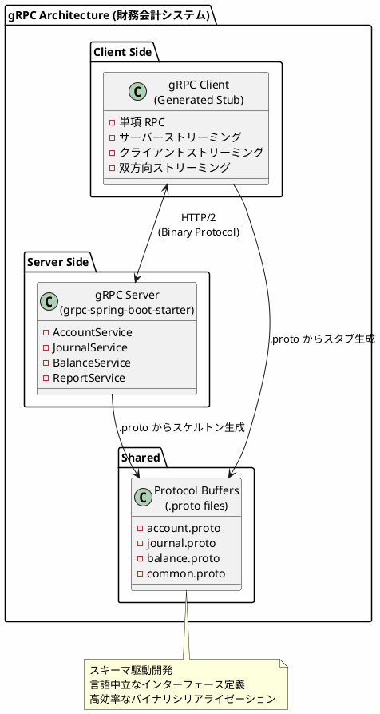
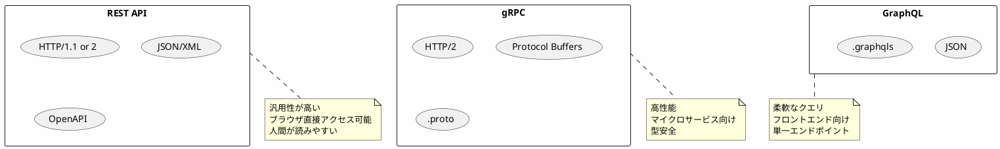
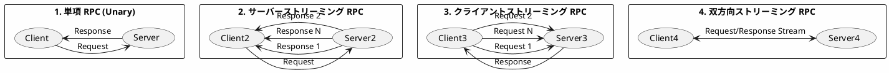
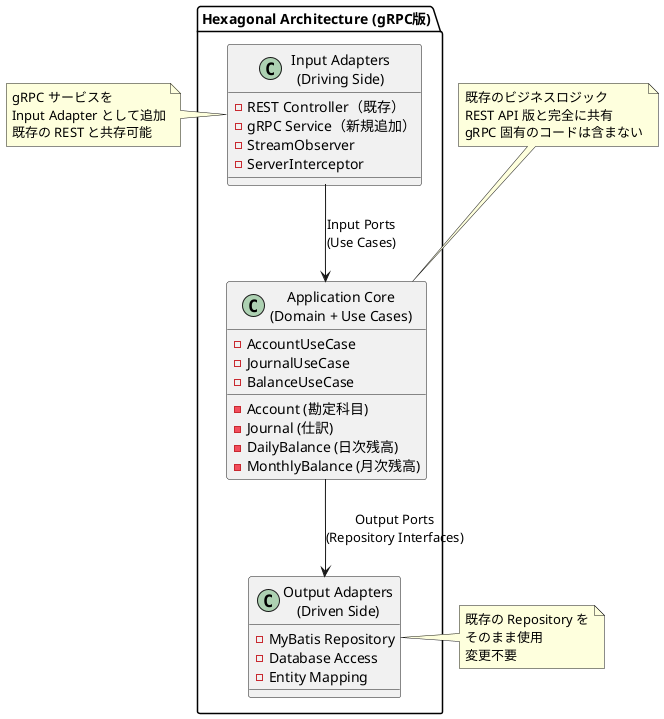
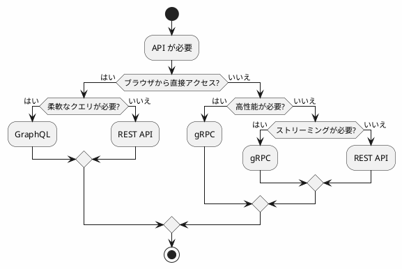

# 研究 3：gRPC サービスの実装

## はじめに

本パートでは、API サーバー構成とは異なるアプローチとして、**gRPC** による財務会計システムを実装します。Protocol Buffers による高効率なバイナリシリアライゼーションと、HTTP/2 によるストリーミング通信を活用し、高性能なマイクロサービス間通信を実現します。

ヘキサゴナルアーキテクチャ（ドメイン層・アプリケーション層）はそのまま共有し、**Input Adapter として gRPC サービス層のみを追加**します。

---

## 第 22 章：gRPC サーバーの基礎

### 22.1 gRPC とは

gRPC は Google が開発したオープンソースの高性能 RPC（Remote Procedure Call）フレームワークです。HTTP/2 プロトコルと Protocol Buffers を基盤とし、マイクロサービス間通信に最適化されています。



**gRPC の主な特徴：**

| 特徴 | 説明 |
|------|------|
| HTTP/2 | 多重化、ヘッダー圧縮、バイナリフレーミング |
| Protocol Buffers | 高速なバイナリシリアライゼーション |
| 多言語サポート | Java, Go, Python, C#, Node.js 等 |
| ストリーミング | 4 つの RPC パターンをサポート |
| デッドライン | タイムアウト管理の組み込みサポート |
| 認証 | TLS/SSL、トークンベース認証のサポート |

### 22.2 REST API / GraphQL との比較



**詳細比較表：**

| 特徴 | REST API | gRPC | GraphQL |
|------|----------|------|---------|
| プロトコル | HTTP/1.1 | HTTP/2 | HTTP/1.1 or HTTP/2 |
| データ形式 | JSON | Protocol Buffers | JSON |
| スキーマ | OpenAPI (任意) | .proto (必須) | .graphqls (必須) |
| シリアライゼーション | テキスト | バイナリ | テキスト |
| パフォーマンス | 中 | 高 | 中 |
| ストリーミング | WebSocket 別実装 | ネイティブサポート | Subscription |
| ブラウザ対応 | ◎ | △ (gRPC-Web) | ◎ |
| 学習コスト | 低 | 中 | 中 |
| 主な用途 | 汎用 API | マイクロサービス | フロントエンド向け |

**財務会計システムで gRPC を選択する場面：**

1. **基幹システム間連携**: 販売管理・購買管理との高性能な内部通信
2. **リアルタイム残高更新**: ストリーミングによる即時反映通知
3. **一括仕訳処理**: クライアントストリーミングによる大量データ転送
4. **月次締め処理**: 長時間処理の進捗通知

### 22.3 4 つの RPC パターン

gRPC は 4 つの RPC パターンをサポートします。



**各パターンの用途（財務会計システム）：**

| パターン | 用途例 |
|----------|---------------------------|
| 単項 RPC | 勘定科目取得、仕訳登録 |
| サーバーストリーミング | 仕訳一覧取得、残高照会 |
| クライアントストリーミング | 仕訳明細の一括登録 |
| 双方向ストリーミング | リアルタイム残高同期 |

### 22.4 gRPC におけるヘキサゴナルアーキテクチャ

gRPC を導入しても、ヘキサゴナルアーキテクチャ（ドメイン層・アプリケーション層）はそのまま共有し、**Input Adapter として gRPC サービス層のみを追加**します。



### 22.5 ディレクトリ構成

既存の構成に `infrastructure/in/grpc/` を追加するだけです。

```
src/main/java/com/example/accounting/
├── domain/                     # ドメイン層（API版と共通）
│   ├── model/
│   │   ├── account/           # 勘定科目ドメイン
│   │   ├── journal/           # 仕訳ドメイン
│   │   ├── balance/           # 残高ドメイン
│   │   └── tax/               # 課税取引ドメイン
│   └── exception/
│
├── application/               # アプリケーション層（API版と共通）
│   ├── port/
│   │   ├── in/               # Input Port（ユースケース）
│   │   └── out/              # Output Port（リポジトリ）
│   └── service/
│
├── infrastructure/
│   ├── in/
│   │   ├── api/              # Input Adapter（REST実装）- 既存
│   │   └── grpc/             # Input Adapter（gRPC実装）- 新規追加
│   │       ├── service/      # gRPC サービス実装
│   │       ├── interceptor/  # インターセプター
│   │       └── converter/    # ドメイン ↔ Proto 変換
│   └── out/
│       └── persistence/      # Output Adapter（DB実装）- 既存
│           ├── mapper/
│           └── repository/
│
├── config/
│
└── src/main/proto/           # Protocol Buffers 定義
    ├── common.proto
    ├── account.proto
    ├── journal.proto
    ├── balance.proto
    └── report.proto
```

### 22.6 技術スタックの追加

既存の `build.gradle.kts` に gRPC 関連の依存関係を追加します。

<details>
<summary>build.gradle.kts（差分）</summary>

```kotlin
import com.google.protobuf.gradle.*

plugins {
    // 既存のプラグイン
    id("java")
    id("org.springframework.boot") version "3.2.0"
    id("io.spring.dependency-management") version "1.1.4"

    // gRPC 関連を追加
    id("com.google.protobuf") version "0.9.4"
}

dependencies {
    // 既存の依存関係（Spring Boot, MyBatis, PostgreSQL等）はそのまま

    // gRPC 関連を追加
    implementation("net.devh:grpc-spring-boot-starter:3.1.0.RELEASE")
    implementation("io.grpc:grpc-protobuf:1.62.2")
    implementation("io.grpc:grpc-stub:1.62.2")
    implementation("io.grpc:grpc-services:1.62.2")  // ヘルスチェック、リフレクション

    // Protocol Buffers
    implementation("com.google.protobuf:protobuf-java:3.25.3")
    implementation("com.google.protobuf:protobuf-java-util:3.25.3")  // JSON 変換

    // Jakarta Annotation (gRPC generated code で必要)
    compileOnly("jakarta.annotation:jakarta.annotation-api:2.1.1")

    // Test
    testImplementation("io.grpc:grpc-testing:1.62.2")
    testImplementation("net.devh:grpc-client-spring-boot-starter:3.1.0.RELEASE")
}

protobuf {
    protoc {
        artifact = "com.google.protobuf:protoc:3.25.3"
    }
    plugins {
        create("grpc") {
            artifact = "io.grpc:protoc-gen-grpc-java:1.62.2"
        }
    }
    generateProtoTasks {
        all().forEach { task ->
            task.plugins {
                create("grpc")
            }
        }
    }
}

// 生成コードのソースパス追加
sourceSets {
    main {
        java {
            srcDirs(
                "build/generated/source/proto/main/java",
                "build/generated/source/proto/main/grpc"
            )
        }
    }
}
```

</details>

<details>
<summary>application.yml（差分）</summary>

```yaml
# 既存の設定はそのまま

# gRPC サーバー設定
grpc:
  server:
    port: 9090
    reflection-service-enabled: true  # gRPC リフレクション有効化
    health-service-enabled: true      # ヘルスチェック有効化
    max-inbound-message-size: 4194304  # 4MB
    max-inbound-metadata-size: 8192    # 8KB

# ログ設定
logging:
  level:
    net.devh.boot.grpc: DEBUG
    io.grpc: INFO
```

</details>

---

## 第 23 章：Protocol Buffers 定義

### 23.1 共通メッセージ定義

<details>
<summary>src/main/proto/common.proto</summary>

```protobuf
syntax = "proto3";

package com.example.accounting;

option java_package = "com.example.accounting.infrastructure.in.grpc.proto";
option java_outer_classname = "CommonProto";
option java_multiple_files = true;

import "google/protobuf/timestamp.proto";
import "google/protobuf/wrappers.proto";

// 共通のページネーション
message PageRequest {
    int32 page = 1;
    int32 size = 2;
}

message PageInfo {
    int32 page = 1;
    int32 size = 2;
    int32 total_elements = 3;
    int32 total_pages = 4;
    bool has_next = 5;
    bool has_previous = 6;
}

// 共通のエラー応答
message ErrorDetail {
    string field = 1;
    string message = 2;
}

message ErrorResponse {
    string code = 1;
    string message = 2;
    repeated ErrorDetail details = 3;
}

// 金額型（Decimal 相当）
message Money {
    int64 units = 1;      // 整数部
    int32 nanos = 2;      // 小数部（10億分の1単位）
    string currency = 3;  // 通貨コード（JPY等）
}

// 日付型（Date 相当）
message Date {
    int32 year = 1;
    int32 month = 2;
    int32 day = 3;
}

// 年月型
message YearMonth {
    int32 year = 1;
    int32 month = 2;
}

// 決算期
message FiscalPeriod {
    int32 fiscal_year = 1;    // 決算年度
    int32 fiscal_month = 2;   // 決算月度（1-12）
}

// 監査情報
message AuditInfo {
    google.protobuf.Timestamp created_at = 1;
    string created_by = 2;
    google.protobuf.Timestamp updated_at = 3;
    string updated_by = 4;
}
```

</details>

### 23.2 勘定科目 Protocol Buffers

<details>
<summary>src/main/proto/account.proto</summary>

```protobuf
syntax = "proto3";

package com.example.accounting;

option java_package = "com.example.accounting.infrastructure.in.grpc.proto";
option java_outer_classname = "AccountProto";
option java_multiple_files = true;

import "common.proto";
import "google/protobuf/empty.proto";

// BSPL区分
enum BsplType {
    BSPL_TYPE_UNSPECIFIED = 0;
    BSPL_TYPE_BS = 1;            // 貸借対照表
    BSPL_TYPE_PL = 2;            // 損益計算書
}

// 貸借区分
enum DebitCreditType {
    DEBIT_CREDIT_TYPE_UNSPECIFIED = 0;
    DEBIT_CREDIT_TYPE_DEBIT = 1;     // 借方
    DEBIT_CREDIT_TYPE_CREDIT = 2;    // 貸方
}

// 取引要素区分
enum ElementType {
    ELEMENT_TYPE_UNSPECIFIED = 0;
    ELEMENT_TYPE_ASSET = 1;          // 資産
    ELEMENT_TYPE_LIABILITY = 2;      // 負債
    ELEMENT_TYPE_EQUITY = 3;         // 資本
    ELEMENT_TYPE_REVENUE = 4;        // 収益
    ELEMENT_TYPE_EXPENSE = 5;        // 費用
}

// 集計区分
enum AggregationType {
    AGGREGATION_TYPE_UNSPECIFIED = 0;
    AGGREGATION_TYPE_HEADING = 1;    // 見出科目
    AGGREGATION_TYPE_SUMMARY = 2;    // 集計科目
    AGGREGATION_TYPE_POSTING = 3;    // 計上科目
}

// 勘定科目メッセージ
message Account {
    string account_code = 1;             // 勘定科目コード
    string account_name = 2;             // 勘定科目名
    BsplType bspl_type = 3;              // BSPL区分
    DebitCreditType debit_credit_type = 4;  // 貸借区分
    ElementType element_type = 5;        // 取引要素区分
    AggregationType aggregation_type = 6;   // 集計区分
    string parent_account_code = 7;      // 親勘定科目コード
    string account_path = 8;             // 勘定科目パス
    int32 display_order = 9;             // 表示順
    bool is_active = 10;                 // 有効フラグ
    AuditInfo audit = 11;                // 監査情報
}

// 勘定科目構成メッセージ
message AccountStructure {
    string account_code = 1;             // 勘定科目コード
    string account_path = 2;             // 勘定科目パス（~区切り）
    int32 level = 3;                     // 階層レベル
}

// 課税取引マスタ
message TaxTransaction {
    string tax_code = 1;                 // 課税取引コード
    string tax_name = 2;                 // 課税取引名
    int32 tax_rate = 3;                  // 税率（パーセント * 100）
    Date effective_from = 4;             // 適用開始日
    Date effective_to = 5;               // 適用終了日
    bool is_active = 6;                  // 有効フラグ
}

// === リクエスト/レスポンス ===

// 勘定科目取得
message GetAccountRequest {
    string account_code = 1;
}

message GetAccountResponse {
    Account account = 1;
}

// 勘定科目一覧取得
message ListAccountsRequest {
    PageRequest page = 1;
    BsplType bspl_type = 2;              // フィルタ（オプション）
    ElementType element_type = 3;        // フィルタ（オプション）
    AggregationType aggregation_type = 4; // フィルタ（オプション）
    string keyword = 5;                  // 検索キーワード
    bool active_only = 6;                // 有効のみ
}

message ListAccountsResponse {
    repeated Account accounts = 1;
    PageInfo page_info = 2;
}

// 勘定科目登録
message CreateAccountRequest {
    string account_code = 1;
    string account_name = 2;
    BsplType bspl_type = 3;
    DebitCreditType debit_credit_type = 4;
    ElementType element_type = 5;
    AggregationType aggregation_type = 6;
    string parent_account_code = 7;
    int32 display_order = 8;
}

message CreateAccountResponse {
    Account account = 1;
}

// 勘定科目更新
message UpdateAccountRequest {
    string account_code = 1;
    string account_name = 2;
    BsplType bspl_type = 3;
    DebitCreditType debit_credit_type = 4;
    ElementType element_type = 5;
    AggregationType aggregation_type = 6;
    string parent_account_code = 7;
    int32 display_order = 8;
    bool is_active = 9;
}

message UpdateAccountResponse {
    Account account = 1;
}

// 勘定科目削除
message DeleteAccountRequest {
    string account_code = 1;
}

message DeleteAccountResponse {
    bool success = 1;
}

// 勘定科目一括登録（クライアントストリーミング）
message BulkCreateAccountRequest {
    CreateAccountRequest account = 1;
}

message BulkCreateAccountResponse {
    int32 success_count = 1;
    int32 failure_count = 2;
    repeated ErrorDetail errors = 3;
}

// 勘定科目ツリー取得
message GetAccountTreeRequest {
    BsplType bspl_type = 1;  // BS または PL
}

message GetAccountTreeResponse {
    repeated AccountNode nodes = 1;
}

message AccountNode {
    Account account = 1;
    repeated AccountNode children = 2;
}

// 課税取引マスタ取得
message GetTaxTransactionRequest {
    string tax_code = 1;
}

message GetTaxTransactionResponse {
    TaxTransaction tax_transaction = 1;
}

// 課税取引マスタ一覧
message ListTaxTransactionsRequest {
    Date as_of_date = 1;     // 適用日（オプション）
    bool active_only = 2;
}

message ListTaxTransactionsResponse {
    repeated TaxTransaction tax_transactions = 1;
}

// === サービス定義 ===

service AccountService {
    // 単項 RPC
    rpc GetAccount(GetAccountRequest) returns (GetAccountResponse);
    rpc CreateAccount(CreateAccountRequest) returns (CreateAccountResponse);
    rpc UpdateAccount(UpdateAccountRequest) returns (UpdateAccountResponse);
    rpc DeleteAccount(DeleteAccountRequest) returns (DeleteAccountResponse);

    // サーバーストリーミング RPC（大量データ取得）
    rpc ListAccounts(ListAccountsRequest) returns (stream Account);

    // クライアントストリーミング RPC（一括登録）
    rpc BulkCreateAccounts(stream BulkCreateAccountRequest) returns (BulkCreateAccountResponse);

    // 勘定科目構成
    rpc GetAccountTree(GetAccountTreeRequest) returns (GetAccountTreeResponse);

    // 課税取引マスタ
    rpc GetTaxTransaction(GetTaxTransactionRequest) returns (GetTaxTransactionResponse);
    rpc ListTaxTransactions(ListTaxTransactionsRequest) returns (ListTaxTransactionsResponse);
}
```

</details>

### 23.3 仕訳 Protocol Buffers

<details>
<summary>src/main/proto/journal.proto</summary>

```protobuf
syntax = "proto3";

package com.example.accounting;

option java_package = "com.example.accounting.infrastructure.in.grpc.proto";
option java_outer_classname = "JournalProto";
option java_multiple_files = true;

import "common.proto";
import "account.proto";
import "google/protobuf/empty.proto";

// 仕訳伝票区分
enum JournalType {
    JOURNAL_TYPE_UNSPECIFIED = 0;
    JOURNAL_TYPE_NORMAL = 1;         // 通常仕訳
    JOURNAL_TYPE_CLOSING = 2;        // 決算仕訳
    JOURNAL_TYPE_ADJUSTMENT = 3;     // 調整仕訳
    JOURNAL_TYPE_REVERSAL = 4;       // 取消仕訳
}

// 仕訳ステータス
enum JournalStatus {
    JOURNAL_STATUS_UNSPECIFIED = 0;
    JOURNAL_STATUS_DRAFT = 1;        // 下書き
    JOURNAL_STATUS_PENDING = 2;      // 承認待ち
    JOURNAL_STATUS_APPROVED = 3;     // 承認済み
    JOURNAL_STATUS_POSTED = 4;       // 転記済み
    JOURNAL_STATUS_CANCELED = 5;     // 取消済み
}

// 仕訳伝票メッセージ
message Journal {
    string slip_number = 1;              // 伝票番号
    Date journal_date = 2;               // 起票日
    Date input_date = 3;                 // 入力日
    string summary = 4;                  // 伝票摘要
    JournalType journal_type = 5;        // 仕訳伝票区分
    JournalStatus status = 6;            // ステータス
    bool is_closing_journal = 7;         // 決算仕訳フラグ
    FiscalPeriod fiscal_period = 8;      // 決算期
    Money total_debit = 9;               // 借方合計
    Money total_credit = 10;             // 貸方合計
    repeated JournalDetail details = 11; // 仕訳明細
    string reversal_slip_number = 12;    // 取消元伝票番号
    AuditInfo audit = 13;                // 監査情報
}

// 仕訳明細メッセージ
message JournalDetail {
    int32 line_number = 1;               // 行番号
    string line_summary = 2;             // 行摘要
    repeated JournalDebitCreditDetail debit_credit_details = 3; // 貸借明細
}

// 仕訳貸借明細メッセージ
message JournalDebitCreditDetail {
    DebitCreditType debit_credit_type = 1;  // 借方/貸方
    string account_code = 2;             // 勘定科目コード
    string account_name = 3;             // 勘定科目名（参照用）
    string sub_account_code = 4;         // 補助科目コード
    string department_code = 5;          // 部門コード
    string project_code = 6;             // プロジェクトコード
    Money amount = 7;                    // 金額
    Money base_currency_amount = 8;      // 基軸通貨金額
    string tax_code = 9;                 // 課税取引コード
    int32 tax_rate = 10;                 // 税率
    Money tax_amount = 11;               // 消費税額
}

// === リクエスト/レスポンス ===

// 仕訳取得
message GetJournalRequest {
    string slip_number = 1;
}

message GetJournalResponse {
    Journal journal = 1;
}

// 仕訳一覧取得
message ListJournalsRequest {
    PageRequest page = 1;
    Date date_from = 2;                  // 起票日From
    Date date_to = 3;                    // 起票日To
    FiscalPeriod fiscal_period = 4;      // 決算期
    JournalType journal_type = 5;        // 仕訳伝票区分
    JournalStatus status = 6;            // ステータス
    string account_code = 7;             // 勘定科目コード
    string keyword = 8;                  // 検索キーワード
}

message ListJournalsResponse {
    repeated Journal journals = 1;
    PageInfo page_info = 2;
}

// 仕訳登録
message CreateJournalRequest {
    Date journal_date = 1;
    string summary = 2;
    JournalType journal_type = 3;
    bool is_closing_journal = 4;
    repeated CreateJournalDetailRequest details = 5;
}

message CreateJournalDetailRequest {
    int32 line_number = 1;
    string line_summary = 2;
    repeated CreateJournalDebitCreditRequest debit_credit_details = 3;
}

message CreateJournalDebitCreditRequest {
    DebitCreditType debit_credit_type = 1;
    string account_code = 2;
    string sub_account_code = 3;
    string department_code = 4;
    string project_code = 5;
    Money amount = 6;
    string tax_code = 7;
}

message CreateJournalResponse {
    Journal journal = 1;
}

// 仕訳更新
message UpdateJournalRequest {
    string slip_number = 1;
    Date journal_date = 2;
    string summary = 3;
    JournalType journal_type = 4;
    bool is_closing_journal = 5;
    repeated CreateJournalDetailRequest details = 6;
}

message UpdateJournalResponse {
    Journal journal = 1;
}

// 仕訳取消（赤黒処理）
message CancelJournalRequest {
    string slip_number = 1;
    string cancel_reason = 2;
}

message CancelJournalResponse {
    Journal original_journal = 1;        // 元の仕訳
    Journal reversal_journal = 2;        // 取消仕訳
}

// 仕訳承認
message ApproveJournalRequest {
    string slip_number = 1;
    string approver_comment = 2;
}

message ApproveJournalResponse {
    Journal journal = 1;
}

// 仕訳一括登録（クライアントストリーミング）
message BulkCreateJournalRequest {
    CreateJournalRequest journal = 1;
}

message BulkCreateJournalResponse {
    int32 success_count = 1;
    int32 failure_count = 2;
    repeated ErrorDetail errors = 3;
    repeated string created_slip_numbers = 4;
}

// 貸借バランスチェック
message ValidateBalanceRequest {
    repeated CreateJournalDetailRequest details = 1;
}

message ValidateBalanceResponse {
    bool is_balanced = 1;
    Money total_debit = 2;
    Money total_credit = 3;
    Money difference = 4;
}

// === サービス定義 ===

service JournalService {
    // 単項 RPC
    rpc GetJournal(GetJournalRequest) returns (GetJournalResponse);
    rpc CreateJournal(CreateJournalRequest) returns (CreateJournalResponse);
    rpc UpdateJournal(UpdateJournalRequest) returns (UpdateJournalResponse);
    rpc CancelJournal(CancelJournalRequest) returns (CancelJournalResponse);
    rpc ApproveJournal(ApproveJournalRequest) returns (ApproveJournalResponse);
    rpc ValidateBalance(ValidateBalanceRequest) returns (ValidateBalanceResponse);

    // サーバーストリーミング RPC
    rpc ListJournals(ListJournalsRequest) returns (stream Journal);

    // クライアントストリーミング RPC
    rpc BulkCreateJournals(stream BulkCreateJournalRequest) returns (BulkCreateJournalResponse);

    // 双方向ストリーミング RPC（リアルタイム仕訳入力）
    rpc StreamJournalEntry(stream CreateJournalRequest) returns (stream CreateJournalResponse);
}
```

</details>

### 23.4 残高 Protocol Buffers

<details>
<summary>src/main/proto/balance.proto</summary>

```protobuf
syntax = "proto3";

package com.example.accounting;

option java_package = "com.example.accounting.infrastructure.in.grpc.proto";
option java_outer_classname = "BalanceProto";
option java_multiple_files = true;

import "common.proto";
import "account.proto";

// 日次勘定科目残高
message DailyBalance {
    Date balance_date = 1;               // 残高日
    string account_code = 2;             // 勘定科目コード
    string account_name = 3;             // 勘定科目名
    string sub_account_code = 4;         // 補助科目コード
    string department_code = 5;          // 部門コード
    Money previous_balance = 6;          // 前日残高
    Money debit_amount = 7;              // 借方金額
    Money credit_amount = 8;             // 貸方金額
    Money current_balance = 9;           // 当日残高
}

// 月次勘定科目残高
message MonthlyBalance {
    FiscalPeriod fiscal_period = 1;      // 決算期
    string account_code = 2;             // 勘定科目コード
    string account_name = 3;             // 勘定科目名
    string sub_account_code = 4;         // 補助科目コード
    string department_code = 5;          // 部門コード
    Money opening_balance = 6;           // 月初残高
    Money debit_amount = 7;              // 借方金額
    Money credit_amount = 8;             // 貸方金額
    Money closing_balance = 9;           // 月末残高
    Money closing_debit_balance = 10;    // 決算借方金額
    Money closing_credit_balance = 11;   // 決算貸方金額
}

// 残高サマリー
message BalanceSummary {
    string account_code = 1;
    string account_name = 2;
    BsplType bspl_type = 3;
    ElementType element_type = 4;
    Money balance = 5;
    int32 level = 6;
    bool is_leaf = 7;
}

// === リクエスト/レスポンス ===

// 日次残高取得
message GetDailyBalanceRequest {
    Date balance_date = 1;
    string account_code = 2;
    string sub_account_code = 3;
    string department_code = 4;
}

message GetDailyBalanceResponse {
    DailyBalance balance = 1;
}

// 日次残高一覧取得
message ListDailyBalancesRequest {
    Date balance_date = 1;
    BsplType bspl_type = 2;
    ElementType element_type = 3;
    string department_code = 4;
    bool posting_accounts_only = 5;      // 計上科目のみ
}

message ListDailyBalancesResponse {
    repeated DailyBalance balances = 1;
    Money total_debit = 2;
    Money total_credit = 3;
}

// 月次残高取得
message GetMonthlyBalanceRequest {
    FiscalPeriod fiscal_period = 1;
    string account_code = 2;
    string sub_account_code = 3;
    string department_code = 4;
}

message GetMonthlyBalanceResponse {
    MonthlyBalance balance = 1;
}

// 月次残高一覧取得
message ListMonthlyBalancesRequest {
    FiscalPeriod fiscal_period = 1;
    BsplType bspl_type = 2;
    ElementType element_type = 3;
    string department_code = 4;
    bool include_closing = 5;            // 決算仕訳含む
}

message ListMonthlyBalancesResponse {
    repeated MonthlyBalance balances = 1;
    Money total_debit = 2;
    Money total_credit = 3;
}

// 勘定科目別残高照会
message GetAccountBalanceRequest {
    string account_code = 1;
    Date date_from = 2;
    Date date_to = 3;
    string sub_account_code = 4;
    string department_code = 5;
}

message GetAccountBalanceResponse {
    string account_code = 1;
    string account_name = 2;
    Money opening_balance = 3;           // 期首残高
    Money total_debit = 4;               // 期間借方合計
    Money total_credit = 5;              // 期間貸方合計
    Money closing_balance = 6;           // 期末残高
    repeated DailyBalance daily_movements = 7;  // 日別推移
}

// 残高サマリー取得（試算表用）
message GetBalanceSummaryRequest {
    Date as_of_date = 1;
    BsplType bspl_type = 2;
    bool include_sub_accounts = 3;
}

message GetBalanceSummaryResponse {
    repeated BalanceSummary summaries = 1;
    Money bs_total_debit = 2;            // BS借方合計
    Money bs_total_credit = 3;           // BS貸方合計
    Money pl_total_debit = 4;            // PL借方合計
    Money pl_total_credit = 5;           // PL貸方合計
}

// 残高更新（仕訳転記時）
message UpdateBalanceRequest {
    string slip_number = 1;
}

message UpdateBalanceResponse {
    bool success = 1;
    int32 updated_daily_records = 2;
    int32 updated_monthly_records = 3;
}

// === サービス定義 ===

service BalanceService {
    // 単項 RPC
    rpc GetDailyBalance(GetDailyBalanceRequest) returns (GetDailyBalanceResponse);
    rpc GetMonthlyBalance(GetMonthlyBalanceRequest) returns (GetMonthlyBalanceResponse);
    rpc GetAccountBalance(GetAccountBalanceRequest) returns (GetAccountBalanceResponse);
    rpc GetBalanceSummary(GetBalanceSummaryRequest) returns (GetBalanceSummaryResponse);
    rpc UpdateBalance(UpdateBalanceRequest) returns (UpdateBalanceResponse);

    // サーバーストリーミング RPC
    rpc ListDailyBalances(ListDailyBalancesRequest) returns (stream DailyBalance);
    rpc ListMonthlyBalances(ListMonthlyBalancesRequest) returns (stream MonthlyBalance);

    // 双方向ストリーミング（リアルタイム残高監視）
    rpc WatchBalance(stream GetAccountBalanceRequest) returns (stream GetAccountBalanceResponse);
}
```

</details>

---

## 第 24 章：gRPC サービス実装

### 24.1 勘定科目サービス実装

<details>
<summary>GrpcAccountService.java</summary>

```java
package com.example.accounting.infrastructure.in.grpc.service;

import com.example.accounting.application.port.in.AccountUseCase;
import com.example.accounting.domain.model.account.Account;
import com.example.accounting.domain.model.account.AccountCode;
import com.example.accounting.domain.exception.ResourceNotFoundException;
import com.example.accounting.infrastructure.in.grpc.converter.AccountConverter;
import com.example.accounting.infrastructure.in.grpc.proto.*;
import io.grpc.Status;
import io.grpc.stub.StreamObserver;
import net.devh.boot.grpc.server.service.GrpcService;
import org.slf4j.Logger;
import org.slf4j.LoggerFactory;

import java.util.List;
import java.util.concurrent.atomic.AtomicInteger;

/**
 * 勘定科目 gRPC サービス実装
 */
@GrpcService
public class GrpcAccountService extends AccountServiceGrpc.AccountServiceImplBase {

    private static final Logger log = LoggerFactory.getLogger(GrpcAccountService.class);

    private final AccountUseCase accountUseCase;
    private final AccountConverter converter;

    public GrpcAccountService(AccountUseCase accountUseCase, AccountConverter converter) {
        this.accountUseCase = accountUseCase;
        this.converter = converter;
    }

    /**
     * 単項 RPC: 勘定科目取得
     */
    @Override
    public void getAccount(GetAccountRequest request,
                           StreamObserver<GetAccountResponse> responseObserver) {
        log.info("getAccount: {}", request.getAccountCode());

        try {
            AccountCode code = new AccountCode(request.getAccountCode());
            Account account = accountUseCase.findByCode(code)
                .orElseThrow(() -> new ResourceNotFoundException(
                    "勘定科目", request.getAccountCode()));

            GetAccountResponse response = GetAccountResponse.newBuilder()
                .setAccount(converter.toProto(account))
                .build();

            responseObserver.onNext(response);
            responseObserver.onCompleted();

        } catch (ResourceNotFoundException e) {
            log.warn("Account not found: {}", request.getAccountCode());
            responseObserver.onError(
                Status.NOT_FOUND
                    .withDescription("勘定科目が見つかりません: " + request.getAccountCode())
                    .asRuntimeException()
            );
        } catch (Exception e) {
            log.error("Error getting account", e);
            responseObserver.onError(
                Status.INTERNAL
                    .withDescription("内部エラーが発生しました")
                    .withCause(e)
                    .asRuntimeException()
            );
        }
    }

    /**
     * 単項 RPC: 勘定科目登録
     */
    @Override
    public void createAccount(CreateAccountRequest request,
                              StreamObserver<CreateAccountResponse> responseObserver) {
        log.info("createAccount: {}", request.getAccountCode());

        try {
            Account account = converter.toDomain(request);
            Account created = accountUseCase.create(account);

            CreateAccountResponse response = CreateAccountResponse.newBuilder()
                .setAccount(converter.toProto(created))
                .build();

            responseObserver.onNext(response);
            responseObserver.onCompleted();

        } catch (IllegalArgumentException e) {
            log.warn("Invalid request: {}", e.getMessage());
            responseObserver.onError(
                Status.INVALID_ARGUMENT
                    .withDescription(e.getMessage())
                    .asRuntimeException()
            );
        } catch (Exception e) {
            log.error("Error creating account", e);
            responseObserver.onError(
                Status.INTERNAL
                    .withDescription("内部エラーが発生しました")
                    .asRuntimeException()
            );
        }
    }

    /**
     * サーバーストリーミング RPC: 勘定科目一覧取得
     */
    @Override
    public void listAccounts(ListAccountsRequest request,
                             StreamObserver<com.example.accounting.infrastructure.in.grpc.proto.Account> responseObserver) {
        log.info("listAccounts: bsplType={}, keyword={}",
                 request.getBsplType(), request.getKeyword());

        try {
            List<Account> accounts = accountUseCase.findAll(
                converter.toCriteria(request)
            );

            // ストリーミングで勘定科目を1件ずつ送信
            for (Account account : accounts) {
                responseObserver.onNext(converter.toProto(account));
            }

            responseObserver.onCompleted();
            log.info("listAccounts completed: {} items", accounts.size());

        } catch (Exception e) {
            log.error("Error listing accounts", e);
            responseObserver.onError(
                Status.INTERNAL
                    .withDescription("内部エラーが発生しました")
                    .asRuntimeException()
            );
        }
    }

    /**
     * クライアントストリーミング RPC: 勘定科目一括登録
     */
    @Override
    public StreamObserver<BulkCreateAccountRequest> bulkCreateAccounts(
            StreamObserver<BulkCreateAccountResponse> responseObserver) {

        log.info("bulkCreateAccounts: started");

        AtomicInteger successCount = new AtomicInteger(0);
        AtomicInteger failureCount = new AtomicInteger(0);
        List<ErrorDetail> errors = new java.util.ArrayList<>();

        return new StreamObserver<BulkCreateAccountRequest>() {
            @Override
            public void onNext(BulkCreateAccountRequest request) {
                try {
                    CreateAccountRequest accountRequest = request.getAccount();
                    Account account = converter.toDomain(accountRequest);
                    accountUseCase.create(account);
                    successCount.incrementAndGet();
                    log.debug("Created account: {}", accountRequest.getAccountCode());

                } catch (Exception e) {
                    failureCount.incrementAndGet();
                    errors.add(ErrorDetail.newBuilder()
                        .setField(request.getAccount().getAccountCode())
                        .setMessage(e.getMessage())
                        .build());
                    log.warn("Failed to create account: {}",
                             request.getAccount().getAccountCode(), e);
                }
            }

            @Override
            public void onError(Throwable t) {
                log.error("bulkCreateAccounts error", t);
            }

            @Override
            public void onCompleted() {
                BulkCreateAccountResponse response = BulkCreateAccountResponse.newBuilder()
                    .setSuccessCount(successCount.get())
                    .setFailureCount(failureCount.get())
                    .addAllErrors(errors)
                    .build();

                responseObserver.onNext(response);
                responseObserver.onCompleted();

                log.info("bulkCreateAccounts completed: success={}, failure={}",
                         successCount.get(), failureCount.get());
            }
        };
    }

    /**
     * 勘定科目ツリー取得
     */
    @Override
    public void getAccountTree(GetAccountTreeRequest request,
                               StreamObserver<GetAccountTreeResponse> responseObserver) {
        log.info("getAccountTree: bsplType={}", request.getBsplType());

        try {
            var tree = accountUseCase.getAccountTree(
                converter.toDomainBsplType(request.getBsplType())
            );

            GetAccountTreeResponse response = GetAccountTreeResponse.newBuilder()
                .addAllNodes(converter.toProtoTree(tree))
                .build();

            responseObserver.onNext(response);
            responseObserver.onCompleted();

        } catch (Exception e) {
            log.error("Error getting account tree", e);
            responseObserver.onError(
                Status.INTERNAL
                    .withDescription("内部エラーが発生しました")
                    .asRuntimeException()
            );
        }
    }
}
```

</details>

### 24.2 仕訳サービス実装

<details>
<summary>GrpcJournalService.java</summary>

```java
package com.example.accounting.infrastructure.in.grpc.service;

import com.example.accounting.application.port.in.JournalUseCase;
import com.example.accounting.domain.model.journal.Journal;
import com.example.accounting.domain.model.journal.SlipNumber;
import com.example.accounting.domain.exception.ResourceNotFoundException;
import com.example.accounting.domain.exception.BalanceNotMatchException;
import com.example.accounting.infrastructure.in.grpc.converter.JournalConverter;
import com.example.accounting.infrastructure.in.grpc.proto.*;
import io.grpc.Status;
import io.grpc.stub.StreamObserver;
import net.devh.boot.grpc.server.service.GrpcService;
import org.slf4j.Logger;
import org.slf4j.LoggerFactory;

import java.util.List;
import java.util.concurrent.atomic.AtomicInteger;

/**
 * 仕訳 gRPC サービス実装
 */
@GrpcService
public class GrpcJournalService extends JournalServiceGrpc.JournalServiceImplBase {

    private static final Logger log = LoggerFactory.getLogger(GrpcJournalService.class);

    private final JournalUseCase journalUseCase;
    private final JournalConverter converter;

    public GrpcJournalService(JournalUseCase journalUseCase, JournalConverter converter) {
        this.journalUseCase = journalUseCase;
        this.converter = converter;
    }

    /**
     * 単項 RPC: 仕訳取得
     */
    @Override
    public void getJournal(GetJournalRequest request,
                           StreamObserver<GetJournalResponse> responseObserver) {
        log.info("getJournal: {}", request.getSlipNumber());

        try {
            SlipNumber slipNumber = new SlipNumber(request.getSlipNumber());
            Journal journal = journalUseCase.findBySlipNumber(slipNumber)
                .orElseThrow(() -> new ResourceNotFoundException(
                    "仕訳", request.getSlipNumber()));

            GetJournalResponse response = GetJournalResponse.newBuilder()
                .setJournal(converter.toProto(journal))
                .build();

            responseObserver.onNext(response);
            responseObserver.onCompleted();

        } catch (ResourceNotFoundException e) {
            log.warn("Journal not found: {}", request.getSlipNumber());
            responseObserver.onError(
                Status.NOT_FOUND
                    .withDescription("仕訳が見つかりません: " + request.getSlipNumber())
                    .asRuntimeException()
            );
        } catch (Exception e) {
            log.error("Error getting journal", e);
            responseObserver.onError(
                Status.INTERNAL
                    .withDescription("内部エラーが発生しました")
                    .asRuntimeException()
            );
        }
    }

    /**
     * 単項 RPC: 仕訳登録
     */
    @Override
    public void createJournal(CreateJournalRequest request,
                              StreamObserver<CreateJournalResponse> responseObserver) {
        log.info("createJournal: date={}", request.getJournalDate());

        try {
            Journal journal = converter.toDomain(request);
            Journal created = journalUseCase.create(journal);

            CreateJournalResponse response = CreateJournalResponse.newBuilder()
                .setJournal(converter.toProto(created))
                .build();

            responseObserver.onNext(response);
            responseObserver.onCompleted();

        } catch (BalanceNotMatchException e) {
            log.warn("Balance not match: {}", e.getMessage());
            responseObserver.onError(
                Status.FAILED_PRECONDITION
                    .withDescription("貸借が一致しません: " + e.getMessage())
                    .asRuntimeException()
            );
        } catch (IllegalArgumentException e) {
            log.warn("Invalid request: {}", e.getMessage());
            responseObserver.onError(
                Status.INVALID_ARGUMENT
                    .withDescription(e.getMessage())
                    .asRuntimeException()
            );
        } catch (Exception e) {
            log.error("Error creating journal", e);
            responseObserver.onError(
                Status.INTERNAL
                    .withDescription("内部エラーが発生しました")
                    .asRuntimeException()
            );
        }
    }

    /**
     * 単項 RPC: 仕訳取消（赤黒処理）
     */
    @Override
    public void cancelJournal(CancelJournalRequest request,
                              StreamObserver<CancelJournalResponse> responseObserver) {
        log.info("cancelJournal: {}", request.getSlipNumber());

        try {
            SlipNumber slipNumber = new SlipNumber(request.getSlipNumber());
            var result = journalUseCase.cancel(slipNumber, request.getCancelReason());

            CancelJournalResponse response = CancelJournalResponse.newBuilder()
                .setOriginalJournal(converter.toProto(result.getOriginal()))
                .setReversalJournal(converter.toProto(result.getReversal()))
                .build();

            responseObserver.onNext(response);
            responseObserver.onCompleted();

        } catch (ResourceNotFoundException e) {
            log.warn("Journal not found for cancel: {}", request.getSlipNumber());
            responseObserver.onError(
                Status.NOT_FOUND
                    .withDescription("取消対象の仕訳が見つかりません: " + request.getSlipNumber())
                    .asRuntimeException()
            );
        } catch (Exception e) {
            log.error("Error canceling journal", e);
            responseObserver.onError(
                Status.INTERNAL
                    .withDescription("内部エラーが発生しました")
                    .asRuntimeException()
            );
        }
    }

    /**
     * サーバーストリーミング RPC: 仕訳一覧取得
     */
    @Override
    public void listJournals(ListJournalsRequest request,
                             StreamObserver<com.example.accounting.infrastructure.in.grpc.proto.Journal> responseObserver) {
        log.info("listJournals: dateFrom={}, dateTo={}",
                 request.getDateFrom(), request.getDateTo());

        try {
            List<Journal> journals = journalUseCase.findAll(
                converter.toCriteria(request)
            );

            // ストリーミングで仕訳を1件ずつ送信
            for (Journal journal : journals) {
                responseObserver.onNext(converter.toProto(journal));
            }

            responseObserver.onCompleted();
            log.info("listJournals completed: {} items", journals.size());

        } catch (Exception e) {
            log.error("Error listing journals", e);
            responseObserver.onError(
                Status.INTERNAL
                    .withDescription("内部エラーが発生しました")
                    .asRuntimeException()
            );
        }
    }

    /**
     * クライアントストリーミング RPC: 仕訳一括登録
     */
    @Override
    public StreamObserver<BulkCreateJournalRequest> bulkCreateJournals(
            StreamObserver<BulkCreateJournalResponse> responseObserver) {

        log.info("bulkCreateJournals: started");

        AtomicInteger successCount = new AtomicInteger(0);
        AtomicInteger failureCount = new AtomicInteger(0);
        List<ErrorDetail> errors = new java.util.ArrayList<>();
        List<String> createdSlipNumbers = new java.util.ArrayList<>();

        return new StreamObserver<BulkCreateJournalRequest>() {
            @Override
            public void onNext(BulkCreateJournalRequest request) {
                try {
                    CreateJournalRequest journalRequest = request.getJournal();
                    Journal journal = converter.toDomain(journalRequest);
                    Journal created = journalUseCase.create(journal);
                    successCount.incrementAndGet();
                    createdSlipNumbers.add(created.getSlipNumber().getValue());
                    log.debug("Created journal: {}", created.getSlipNumber().getValue());

                } catch (Exception e) {
                    failureCount.incrementAndGet();
                    errors.add(ErrorDetail.newBuilder()
                        .setField("journal")
                        .setMessage(e.getMessage())
                        .build());
                    log.warn("Failed to create journal", e);
                }
            }

            @Override
            public void onError(Throwable t) {
                log.error("bulkCreateJournals error", t);
            }

            @Override
            public void onCompleted() {
                BulkCreateJournalResponse response = BulkCreateJournalResponse.newBuilder()
                    .setSuccessCount(successCount.get())
                    .setFailureCount(failureCount.get())
                    .addAllErrors(errors)
                    .addAllCreatedSlipNumbers(createdSlipNumbers)
                    .build();

                responseObserver.onNext(response);
                responseObserver.onCompleted();

                log.info("bulkCreateJournals completed: success={}, failure={}",
                         successCount.get(), failureCount.get());
            }
        };
    }

    /**
     * 単項 RPC: 貸借バランスチェック
     */
    @Override
    public void validateBalance(ValidateBalanceRequest request,
                                StreamObserver<ValidateBalanceResponse> responseObserver) {
        log.info("validateBalance");

        try {
            var result = journalUseCase.validateBalance(
                converter.toDetailDomainList(request.getDetailsList())
            );

            ValidateBalanceResponse response = ValidateBalanceResponse.newBuilder()
                .setIsBalanced(result.isBalanced())
                .setTotalDebit(converter.toProtoMoney(result.getTotalDebit()))
                .setTotalCredit(converter.toProtoMoney(result.getTotalCredit()))
                .setDifference(converter.toProtoMoney(result.getDifference()))
                .build();

            responseObserver.onNext(response);
            responseObserver.onCompleted();

        } catch (Exception e) {
            log.error("Error validating balance", e);
            responseObserver.onError(
                Status.INTERNAL
                    .withDescription("内部エラーが発生しました")
                    .asRuntimeException()
            );
        }
    }
}
```

</details>

### 24.3 コンバーター実装

<details>
<summary>AccountConverter.java</summary>

```java
package com.example.accounting.infrastructure.in.grpc.converter;

import com.example.accounting.domain.model.account.*;
import com.example.accounting.infrastructure.in.grpc.proto.*;
import org.springframework.stereotype.Component;

import java.util.List;
import java.util.stream.Collectors;

/**
 * 勘定科目ドメインモデル ⇔ Protocol Buffers 変換
 */
@Component
public class AccountConverter {

    /**
     * ドメインモデル → Proto
     */
    public com.example.accounting.infrastructure.in.grpc.proto.Account toProto(Account domain) {
        return com.example.accounting.infrastructure.in.grpc.proto.Account.newBuilder()
            .setAccountCode(domain.getAccountCode().getValue())
            .setAccountName(domain.getAccountName())
            .setBsplType(toProtoBsplType(domain.getBsplType()))
            .setDebitCreditType(toProtoDebitCreditType(domain.getDebitCreditType()))
            .setElementType(toProtoElementType(domain.getElementType()))
            .setAggregationType(toProtoAggregationType(domain.getAggregationType()))
            .setParentAccountCode(nullToEmpty(domain.getParentAccountCode()))
            .setAccountPath(nullToEmpty(domain.getAccountPath()))
            .setDisplayOrder(domain.getDisplayOrder())
            .setIsActive(domain.isActive())
            .build();
    }

    /**
     * CreateAccountRequest → ドメインモデル
     */
    public Account toDomain(CreateAccountRequest request) {
        return Account.builder()
            .accountCode(new AccountCode(request.getAccountCode()))
            .accountName(request.getAccountName())
            .bsplType(toDomainBsplType(request.getBsplType()))
            .debitCreditType(toDomainDebitCreditType(request.getDebitCreditType()))
            .elementType(toDomainElementType(request.getElementType()))
            .aggregationType(toDomainAggregationType(request.getAggregationType()))
            .parentAccountCode(emptyToNull(request.getParentAccountCode()))
            .displayOrder(request.getDisplayOrder())
            .isActive(true)
            .build();
    }

    /**
     * ListAccountsRequest → 検索条件
     */
    public AccountSearchCriteria toCriteria(ListAccountsRequest request) {
        return AccountSearchCriteria.builder()
            .bsplType(request.hasBsplType()
                ? toDomainBsplType(request.getBsplType()) : null)
            .elementType(request.hasElementType()
                ? toDomainElementType(request.getElementType()) : null)
            .aggregationType(request.hasAggregationType()
                ? toDomainAggregationType(request.getAggregationType()) : null)
            .keyword(emptyToNull(request.getKeyword()))
            .activeOnly(request.getActiveOnly())
            .page(request.hasPage() ? request.getPage().getPage() : 0)
            .size(request.hasPage() ? request.getPage().getSize() : 20)
            .build();
    }

    /**
     * ツリー構造を Proto に変換
     */
    public List<AccountNode> toProtoTree(List<AccountTreeNode> tree) {
        return tree.stream()
            .map(this::toProtoNode)
            .collect(Collectors.toList());
    }

    private AccountNode toProtoNode(AccountTreeNode node) {
        AccountNode.Builder builder = AccountNode.newBuilder()
            .setAccount(toProto(node.getAccount()));

        if (node.getChildren() != null && !node.getChildren().isEmpty()) {
            builder.addAllChildren(
                node.getChildren().stream()
                    .map(this::toProtoNode)
                    .collect(Collectors.toList())
            );
        }

        return builder.build();
    }

    // === 区分変換 ===

    public BsplType toProtoBsplType(
            com.example.accounting.domain.model.account.BsplType domain) {
        return switch (domain) {
            case BS -> BsplType.BSPL_TYPE_BS;
            case PL -> BsplType.BSPL_TYPE_PL;
        };
    }

    public com.example.accounting.domain.model.account.BsplType toDomainBsplType(
            BsplType proto) {
        return switch (proto) {
            case BSPL_TYPE_BS -> com.example.accounting.domain.model.account.BsplType.BS;
            case BSPL_TYPE_PL -> com.example.accounting.domain.model.account.BsplType.PL;
            default -> throw new IllegalArgumentException("Unknown BSPL type: " + proto);
        };
    }

    private DebitCreditType toProtoDebitCreditType(
            com.example.accounting.domain.model.account.DebitCreditType domain) {
        return switch (domain) {
            case DEBIT -> DebitCreditType.DEBIT_CREDIT_TYPE_DEBIT;
            case CREDIT -> DebitCreditType.DEBIT_CREDIT_TYPE_CREDIT;
        };
    }

    private com.example.accounting.domain.model.account.DebitCreditType toDomainDebitCreditType(
            DebitCreditType proto) {
        return switch (proto) {
            case DEBIT_CREDIT_TYPE_DEBIT ->
                com.example.accounting.domain.model.account.DebitCreditType.DEBIT;
            case DEBIT_CREDIT_TYPE_CREDIT ->
                com.example.accounting.domain.model.account.DebitCreditType.CREDIT;
            default -> throw new IllegalArgumentException("Unknown debit/credit type: " + proto);
        };
    }

    private ElementType toProtoElementType(
            com.example.accounting.domain.model.account.ElementType domain) {
        return switch (domain) {
            case ASSET -> ElementType.ELEMENT_TYPE_ASSET;
            case LIABILITY -> ElementType.ELEMENT_TYPE_LIABILITY;
            case EQUITY -> ElementType.ELEMENT_TYPE_EQUITY;
            case REVENUE -> ElementType.ELEMENT_TYPE_REVENUE;
            case EXPENSE -> ElementType.ELEMENT_TYPE_EXPENSE;
        };
    }

    private com.example.accounting.domain.model.account.ElementType toDomainElementType(
            ElementType proto) {
        return switch (proto) {
            case ELEMENT_TYPE_ASSET ->
                com.example.accounting.domain.model.account.ElementType.ASSET;
            case ELEMENT_TYPE_LIABILITY ->
                com.example.accounting.domain.model.account.ElementType.LIABILITY;
            case ELEMENT_TYPE_EQUITY ->
                com.example.accounting.domain.model.account.ElementType.EQUITY;
            case ELEMENT_TYPE_REVENUE ->
                com.example.accounting.domain.model.account.ElementType.REVENUE;
            case ELEMENT_TYPE_EXPENSE ->
                com.example.accounting.domain.model.account.ElementType.EXPENSE;
            default -> throw new IllegalArgumentException("Unknown element type: " + proto);
        };
    }

    private AggregationType toProtoAggregationType(
            com.example.accounting.domain.model.account.AggregationType domain) {
        return switch (domain) {
            case HEADING -> AggregationType.AGGREGATION_TYPE_HEADING;
            case SUMMARY -> AggregationType.AGGREGATION_TYPE_SUMMARY;
            case POSTING -> AggregationType.AGGREGATION_TYPE_POSTING;
        };
    }

    private com.example.accounting.domain.model.account.AggregationType toDomainAggregationType(
            AggregationType proto) {
        return switch (proto) {
            case AGGREGATION_TYPE_HEADING ->
                com.example.accounting.domain.model.account.AggregationType.HEADING;
            case AGGREGATION_TYPE_SUMMARY ->
                com.example.accounting.domain.model.account.AggregationType.SUMMARY;
            case AGGREGATION_TYPE_POSTING ->
                com.example.accounting.domain.model.account.AggregationType.POSTING;
            default -> throw new IllegalArgumentException("Unknown aggregation type: " + proto);
        };
    }

    // === ユーティリティ ===

    private String nullToEmpty(String value) {
        return value == null ? "" : value;
    }

    private String emptyToNull(String value) {
        return value == null || value.isEmpty() ? null : value;
    }
}
```

</details>

---

## 第 25 章：gRPC インターセプター

### 25.1 ログインターセプター

<details>
<summary>LoggingInterceptor.java</summary>

```java
package com.example.accounting.infrastructure.in.grpc.interceptor;

import io.grpc.*;
import net.devh.boot.grpc.server.interceptor.GrpcGlobalServerInterceptor;
import org.slf4j.Logger;
import org.slf4j.LoggerFactory;
import org.slf4j.MDC;

import java.util.UUID;

/**
 * gRPC ログインターセプター
 */
@GrpcGlobalServerInterceptor
public class LoggingInterceptor implements ServerInterceptor {

    private static final Logger log = LoggerFactory.getLogger(LoggingInterceptor.class);

    @Override
    public <ReqT, RespT> ServerCall.Listener<ReqT> interceptCall(
            ServerCall<ReqT, RespT> call,
            Metadata headers,
            ServerCallHandler<ReqT, RespT> next) {

        String requestId = UUID.randomUUID().toString();
        String methodName = call.getMethodDescriptor().getFullMethodName();
        long startTime = System.currentTimeMillis();

        MDC.put("requestId", requestId);
        log.info("gRPC Request: method={}", methodName);

        return new ForwardingServerCallListener.SimpleForwardingServerCallListener<ReqT>(
                next.startCall(
                    new ForwardingServerCall.SimpleForwardingServerCall<ReqT, RespT>(call) {
                        @Override
                        public void close(Status status, Metadata trailers) {
                            long duration = System.currentTimeMillis() - startTime;
                            log.info("gRPC Response: method={}, status={}, duration={}ms",
                                     methodName, status.getCode(), duration);
                            MDC.clear();
                            super.close(status, trailers);
                        }
                    },
                    headers
                )
        ) {
            @Override
            public void onMessage(ReqT message) {
                log.debug("gRPC Request message: {}", message);
                super.onMessage(message);
            }
        };
    }
}
```

</details>

### 25.2 例外インターセプター

<details>
<summary>ExceptionInterceptor.java</summary>

```java
package com.example.accounting.infrastructure.in.grpc.interceptor;

import com.example.accounting.domain.exception.BusinessException;
import com.example.accounting.domain.exception.ResourceNotFoundException;
import com.example.accounting.domain.exception.ValidationException;
import com.example.accounting.domain.exception.BalanceNotMatchException;
import io.grpc.*;
import net.devh.boot.grpc.server.interceptor.GrpcGlobalServerInterceptor;
import org.slf4j.Logger;
import org.slf4j.LoggerFactory;

/**
 * gRPC 例外インターセプター
 */
@GrpcGlobalServerInterceptor
public class ExceptionInterceptor implements ServerInterceptor {

    private static final Logger log = LoggerFactory.getLogger(ExceptionInterceptor.class);

    @Override
    public <ReqT, RespT> ServerCall.Listener<ReqT> interceptCall(
            ServerCall<ReqT, RespT> call,
            Metadata headers,
            ServerCallHandler<ReqT, RespT> next) {

        return new ExceptionHandlingListener<>(
            next.startCall(call, headers),
            call
        );
    }

    private class ExceptionHandlingListener<ReqT, RespT>
            extends ForwardingServerCallListener.SimpleForwardingServerCallListener<ReqT> {

        private final ServerCall<ReqT, RespT> call;

        protected ExceptionHandlingListener(
                ServerCall.Listener<ReqT> delegate,
                ServerCall<ReqT, RespT> call) {
            super(delegate);
            this.call = call;
        }

        @Override
        public void onHalfClose() {
            try {
                super.onHalfClose();
            } catch (Exception e) {
                handleException(e);
            }
        }

        private void handleException(Exception e) {
            Status status;
            String message;

            if (e instanceof ResourceNotFoundException) {
                status = Status.NOT_FOUND;
                message = e.getMessage();
                log.warn("Resource not found: {}", message);

            } else if (e instanceof ValidationException) {
                status = Status.INVALID_ARGUMENT;
                message = e.getMessage();
                log.warn("Validation error: {}", message);

            } else if (e instanceof BalanceNotMatchException) {
                status = Status.FAILED_PRECONDITION;
                message = e.getMessage();
                log.warn("Balance not match: {}", message);

            } else if (e instanceof BusinessException) {
                status = Status.FAILED_PRECONDITION;
                message = e.getMessage();
                log.warn("Business rule violation: {}", message);

            } else if (e instanceof IllegalArgumentException) {
                status = Status.INVALID_ARGUMENT;
                message = e.getMessage();
                log.warn("Invalid argument: {}", message);

            } else {
                status = Status.INTERNAL;
                message = "内部エラーが発生しました";
                log.error("Internal error", e);
            }

            call.close(status.withDescription(message), new Metadata());
        }
    }
}
```

</details>

---

## 第 26 章：動作確認とテスト

### 26.1 grpcurl による動作確認

```bash
# サーバー起動確認（リフレクションサービス経由）
grpcurl -plaintext localhost:9090 list

# 勘定科目サービスのメソッド一覧
grpcurl -plaintext localhost:9090 list com.example.accounting.AccountService

# 勘定科目取得
grpcurl -plaintext -d '{"account_code": "1110"}' \
  localhost:9090 com.example.accounting.AccountService/GetAccount

# 勘定科目登録
grpcurl -plaintext -d '{
  "account_code": "1111",
  "account_name": "普通預金（みずほ銀行）",
  "bspl_type": "BSPL_TYPE_BS",
  "debit_credit_type": "DEBIT_CREDIT_TYPE_DEBIT",
  "element_type": "ELEMENT_TYPE_ASSET",
  "aggregation_type": "AGGREGATION_TYPE_POSTING",
  "parent_account_code": "1110",
  "display_order": 10
}' localhost:9090 com.example.accounting.AccountService/CreateAccount

# 勘定科目一覧取得（ストリーミング）
grpcurl -plaintext -d '{
  "bspl_type": "BSPL_TYPE_BS",
  "active_only": true
}' localhost:9090 com.example.accounting.AccountService/ListAccounts

# 仕訳登録
grpcurl -plaintext -d '{
  "journal_date": {"year": 2025, "month": 1, "day": 15},
  "summary": "売上計上",
  "journal_type": "JOURNAL_TYPE_NORMAL",
  "details": [{
    "line_number": 1,
    "line_summary": "A社への売上",
    "debit_credit_details": [
      {
        "debit_credit_type": "DEBIT_CREDIT_TYPE_DEBIT",
        "account_code": "1310",
        "amount": {"units": 110000, "currency": "JPY"}
      },
      {
        "debit_credit_type": "DEBIT_CREDIT_TYPE_CREDIT",
        "account_code": "4100",
        "amount": {"units": 100000, "currency": "JPY"}
      },
      {
        "debit_credit_type": "DEBIT_CREDIT_TYPE_CREDIT",
        "account_code": "2110",
        "amount": {"units": 10000, "currency": "JPY"}
      }
    ]
  }]
}' localhost:9090 com.example.accounting.JournalService/CreateJournal

# ヘルスチェック
grpcurl -plaintext localhost:9090 grpc.health.v1.Health/Check
```

### 26.2 統合テスト

<details>
<summary>GrpcAccountServiceTest.java</summary>

```java
package com.example.accounting.infrastructure.in.grpc.service;

import com.example.accounting.application.port.in.AccountUseCase;
import com.example.accounting.domain.model.account.*;
import com.example.accounting.infrastructure.in.grpc.converter.AccountConverter;
import com.example.accounting.infrastructure.in.grpc.proto.*;
import io.grpc.StatusRuntimeException;
import net.devh.boot.grpc.client.inject.GrpcClient;
import org.junit.jupiter.api.*;
import org.springframework.beans.factory.annotation.Autowired;
import org.springframework.boot.test.context.SpringBootTest;
import org.springframework.boot.test.mock.mockito.MockBean;
import org.springframework.test.context.ActiveProfiles;

import java.util.Iterator;
import java.util.List;
import java.util.Optional;

import static org.assertj.core.api.Assertions.*;
import static org.mockito.ArgumentMatchers.any;
import static org.mockito.Mockito.*;

@SpringBootTest(properties = {
    "grpc.server.port=9091",
    "grpc.server.in-process-name=test"
})
@ActiveProfiles("test")
class GrpcAccountServiceTest {

    @MockBean
    private AccountUseCase accountUseCase;

    @GrpcClient("inProcess")
    private AccountServiceGrpc.AccountServiceBlockingStub blockingStub;

    private Account sampleAccount;

    @BeforeEach
    void setUp() {
        sampleAccount = Account.builder()
            .accountCode(new AccountCode("1110"))
            .accountName("現金")
            .bsplType(com.example.accounting.domain.model.account.BsplType.BS)
            .debitCreditType(
                com.example.accounting.domain.model.account.DebitCreditType.DEBIT)
            .elementType(
                com.example.accounting.domain.model.account.ElementType.ASSET)
            .aggregationType(
                com.example.accounting.domain.model.account.AggregationType.POSTING)
            .isActive(true)
            .build();
    }

    @Test
    @DisplayName("勘定科目取得 - 存在する科目を取得できること")
    void getAccount_found() {
        // Given
        when(accountUseCase.findByCode(any(AccountCode.class)))
            .thenReturn(Optional.of(sampleAccount));

        GetAccountRequest request = GetAccountRequest.newBuilder()
            .setAccountCode("1110")
            .build();

        // When
        GetAccountResponse response = blockingStub.getAccount(request);

        // Then
        assertThat(response.getAccount().getAccountCode()).isEqualTo("1110");
        assertThat(response.getAccount().getAccountName()).isEqualTo("現金");
        assertThat(response.getAccount().getBsplType())
            .isEqualTo(BsplType.BSPL_TYPE_BS);
    }

    @Test
    @DisplayName("勘定科目取得 - 存在しない科目は NOT_FOUND")
    void getAccount_notFound() {
        // Given
        when(accountUseCase.findByCode(any(AccountCode.class)))
            .thenReturn(Optional.empty());

        GetAccountRequest request = GetAccountRequest.newBuilder()
            .setAccountCode("9999")
            .build();

        // When & Then
        assertThatThrownBy(() -> blockingStub.getAccount(request))
            .isInstanceOf(StatusRuntimeException.class)
            .satisfies(e -> {
                StatusRuntimeException sre = (StatusRuntimeException) e;
                assertThat(sre.getStatus().getCode())
                    .isEqualTo(io.grpc.Status.NOT_FOUND.getCode());
            });
    }

    @Test
    @DisplayName("勘定科目一覧取得 - ストリーミングで取得できること")
    void listAccounts_streaming() {
        // Given
        List<Account> accounts = List.of(
            sampleAccount,
            Account.builder()
                .accountCode(new AccountCode("1120"))
                .accountName("普通預金")
                .bsplType(com.example.accounting.domain.model.account.BsplType.BS)
                .debitCreditType(
                    com.example.accounting.domain.model.account.DebitCreditType.DEBIT)
                .elementType(
                    com.example.accounting.domain.model.account.ElementType.ASSET)
                .aggregationType(
                    com.example.accounting.domain.model.account.AggregationType.POSTING)
                .isActive(true)
                .build()
        );
        when(accountUseCase.findAll(any())).thenReturn(accounts);

        ListAccountsRequest request = ListAccountsRequest.newBuilder()
            .setBsplType(BsplType.BSPL_TYPE_BS)
            .setActiveOnly(true)
            .build();

        // When
        Iterator<com.example.accounting.infrastructure.in.grpc.proto.Account> iterator =
            blockingStub.listAccounts(request);

        // Then
        int count = 0;
        while (iterator.hasNext()) {
            com.example.accounting.infrastructure.in.grpc.proto.Account account = iterator.next();
            assertThat(account.getAccountCode()).matches("11\\d+");
            count++;
        }
        assertThat(count).isEqualTo(2);
    }
}
```

</details>

---

## 第 27 章：まとめ

### 27.1 学習した内容

1. **gRPC の基本概念**: Protocol Buffers、HTTP/2、4 つの RPC パターン
2. **REST/GraphQL との比較**: 用途に応じた適切な選択
3. **ヘキサゴナルアーキテクチャとの統合**: Input Adapter として gRPC サービスを追加
4. **技術スタック**: grpc-spring-boot-starter、Protocol Buffers
5. **Protocol Buffers 定義**: 共通型、勘定科目、仕訳、残高のメッセージとサービス定義
6. **gRPC サービス実装**: 単項 RPC、ストリーミング RPC
7. **インターセプター**: ログ、例外ハンドリング
8. **テスト**: gRPC クライアントを使用した統合テスト

### 27.2 gRPC が適するユースケース

| ユースケース | 理由 |
|-------------|------|
| 基幹システム連携 | 高性能なバイナリ通信 |
| 大量仕訳一括登録 | クライアントストリーミング |
| リアルタイム残高監視 | 双方向ストリーミング |
| 月次締め進捗通知 | サーバーストリーミング |
| マイクロサービス間通信 | 型安全な API 定義 |

### 27.3 API アーキテクチャ選択ガイド



### 27.4 次のステップ

- gRPC-Web による Web フロントエンド対応
- 認証・認可（JWT トークン検証）
- ロードバランシングとサービスメッシュ
- Observability（メトリクス、トレーシング）
