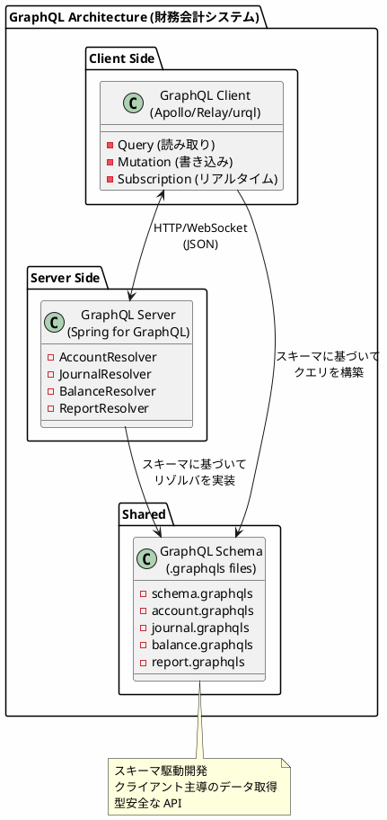
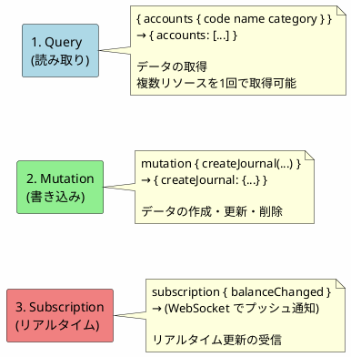
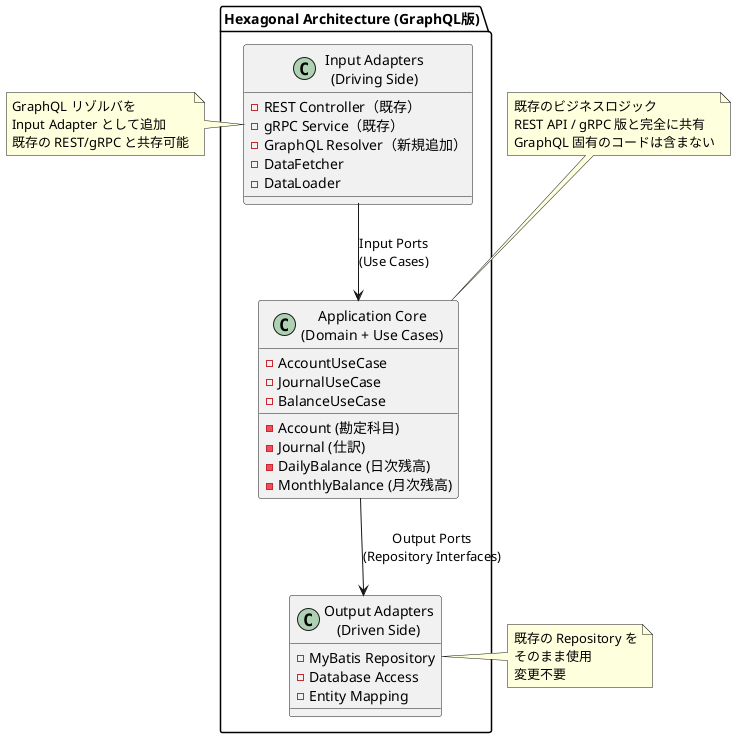
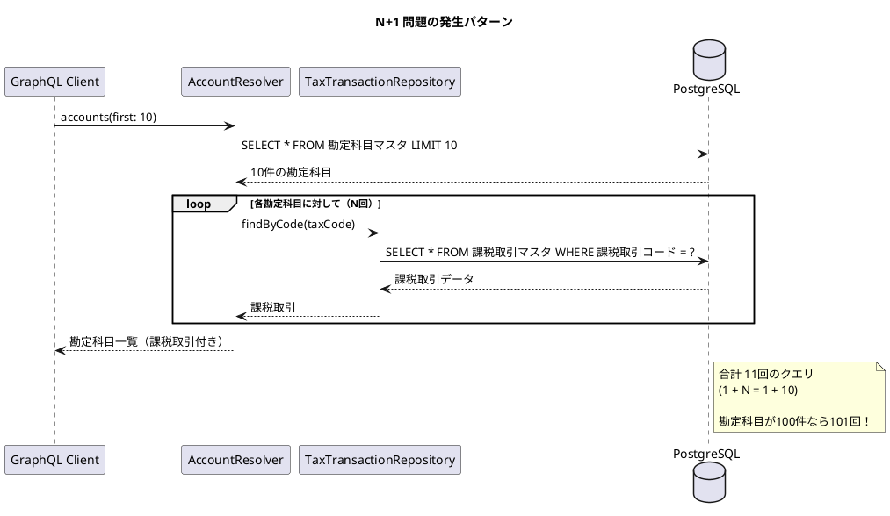
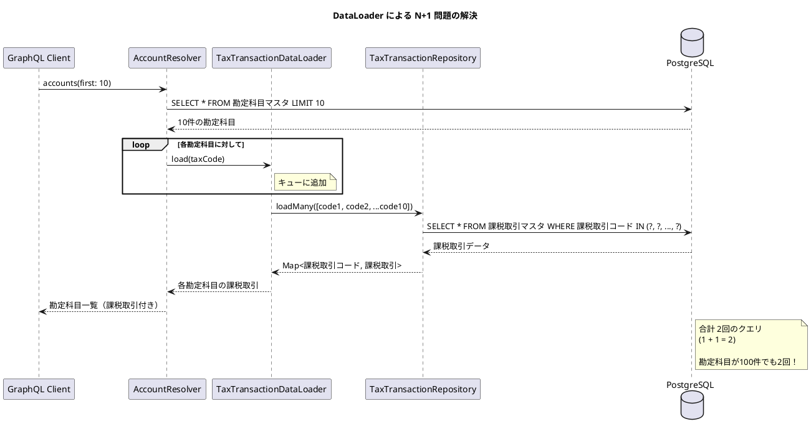
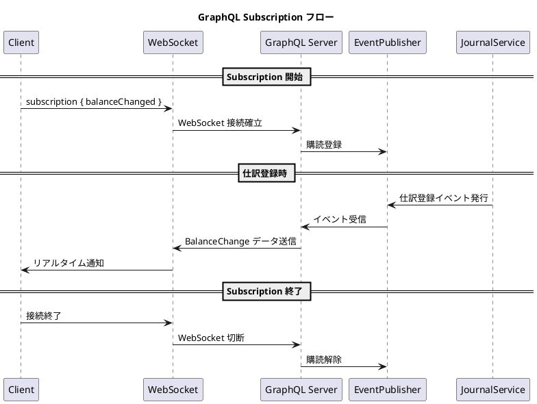
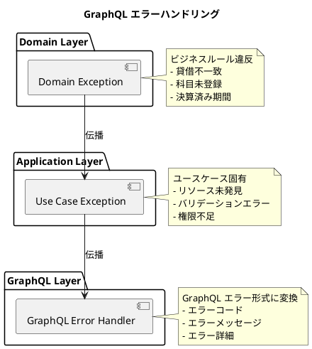
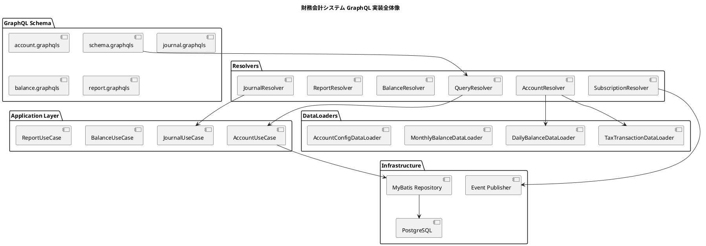
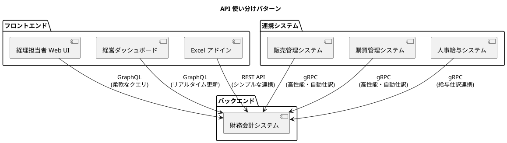
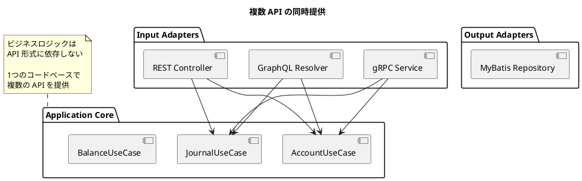

# 研究 4：GraphQL サービスの実装

## はじめに

本パートでは、REST API や gRPC とは異なるアプローチとして、**GraphQL** による財務会計システムを実装します。クライアントが必要なデータを正確に指定できる柔軟なクエリと、リアルタイム更新を実現する Subscription を活用します。

ヘキサゴナルアーキテクチャ（ドメイン層・アプリケーション層）はそのまま共有し、**Input Adapter として GraphQL リゾルバ層のみを追加**します。

---

## 第 22 章：GraphQL サーバーの基礎

### 22.1 GraphQL とは

GraphQL は Facebook が開発したクエリ言語および実行エンジンです。クライアントが必要なデータの形状を指定でき、Over-fetching（不要なデータの取得）や Under-fetching（必要なデータの不足）を防ぎます。



**REST API / gRPC / GraphQL の比較：**

| 特徴 | REST API | gRPC | GraphQL |
|------|----------|------|---------|
| プロトコル | HTTP/1.1 | HTTP/2 | HTTP/1.1 or HTTP/2 |
| データ形式 | JSON | Protocol Buffers | JSON |
| スキーマ | OpenAPI (任意) | .proto (必須) | .graphqls (必須) |
| データ取得 | 固定レスポンス | 固定レスポンス | クライアント指定 |
| エンドポイント | 複数 | 複数 | 単一 |
| リアルタイム | WebSocket 別実装 | ストリーミング | Subscription |
| 主な用途 | 汎用 API | マイクロサービス | フロントエンド向け |

### 22.2 3 つの操作タイプ

GraphQL は 3 つの操作タイプをサポートします：



**用途：**

1. **Query**: データ取得（勘定科目一覧、仕訳照会、残高照会）
2. **Mutation**: データ更新（仕訳登録、仕訳取消、決算仕訳）
3. **Subscription**: リアルタイム通知（残高変動、仕訳登録通知）

### 22.3 GraphQL におけるヘキサゴナルアーキテクチャ

GraphQL を導入しても、ヘキサゴナルアーキテクチャ（ドメイン層・アプリケーション層）はそのまま共有し、**Input Adapter として GraphQL リゾルバ層のみを追加**します。



### 22.4 ディレクトリ構成

既存の構成に `infrastructure/graphql/` を追加するだけです。

```
src/main/java/com/example/accounting/
├── domain/                     # ドメイン層（API版と共通）
│   ├── model/
│   │   ├── account/
│   │   ├── journal/
│   │   ├── balance/
│   │   └── report/
│   └── exception/
│
├── application/               # アプリケーション層（API版と共通）
│   ├── port/
│   │   ├── in/               # Input Port（ユースケース）
│   │   └── out/              # Output Port（リポジトリ）
│   └── service/
│
├── infrastructure/
│   ├── persistence/          # Output Adapter（DB実装）- 既存
│   │   ├── mapper/
│   │   └── repository/
│   ├── rest/                 # Input Adapter（REST実装）- 既存
│   ├── grpc/                 # Input Adapter（gRPC実装）- 既存
│   └── graphql/              # Input Adapter（GraphQL実装）- 新規追加
│       ├── resolver/         # Query/Mutation リゾルバ
│       ├── dataloader/       # N+1 問題対策
│       ├── scalar/           # カスタムスカラー型
│       └── subscription/     # Subscription ハンドラ
│
├── config/
│
└── src/main/resources/
    └── graphql/              # GraphQL スキーマ定義
        ├── schema.graphqls
        ├── account.graphqls
        ├── journal.graphqls
        ├── balance.graphqls
        └── report.graphqls
```

### 22.5 技術スタックの追加

既存の `build.gradle.kts` に GraphQL 関連の依存関係を追加します。

<details>
<summary>build.gradle.kts（差分）</summary>

```kotlin
dependencies {
    // 既存の依存関係（Spring Boot, MyBatis, PostgreSQL等）はそのまま

    // GraphQL 関連を追加
    implementation("org.springframework.boot:spring-boot-starter-graphql")
    implementation("org.springframework.boot:spring-boot-starter-websocket")  // Subscription 用

    // GraphQL 拡張
    implementation("com.graphql-java:graphql-java-extended-scalars:21.0")

    // Test
    testImplementation("org.springframework.graphql:spring-graphql-test")
}
```

</details>

**追加パッケージの説明：**

| パッケージ | 用途 |
|-----------|------|
| spring-boot-starter-graphql | Spring Boot GraphQL 統合 |
| spring-boot-starter-websocket | Subscription (WebSocket) |
| graphql-java-extended-scalars | DateTime, BigDecimal 等のスカラー型 |
| spring-graphql-test | GraphQL テストサポート |

### 22.6 GraphQL 設定

<details>
<summary>application.yml（差分）</summary>

```yaml
spring:
  graphql:
    graphiql:
      enabled: true
      path: /graphiql
    websocket:
      path: /graphql
    schema:
      printer:
        enabled: true
      locations:
        - classpath:graphql/
    cors:
      allowed-origins: "*"
      allowed-methods: GET, POST
```

</details>

<details>
<summary>GraphQLConfig.java</summary>

```java
package com.example.accounting.config;

import graphql.scalars.ExtendedScalars;
import graphql.schema.idl.RuntimeWiring;
import org.springframework.context.annotation.Bean;
import org.springframework.context.annotation.Configuration;
import org.springframework.graphql.execution.RuntimeWiringConfigurer;

/**
 * GraphQL 設定
 */
@Configuration
public class GraphQLConfig {

    @Bean
    public RuntimeWiringConfigurer runtimeWiringConfigurer() {
        return wiringBuilder -> wiringBuilder
            .scalar(ExtendedScalars.Date)
            .scalar(ExtendedScalars.DateTime)
            .scalar(ExtendedScalars.GraphQLBigDecimal)
            .scalar(ExtendedScalars.GraphQLLong);
    }
}
```

</details>

---

## 第 23 章：GraphQL スキーマの定義

### 23.1 ルートスキーマ

<details>
<summary>src/main/resources/graphql/schema.graphqls</summary>

```graphql
# ルートスキーマ
type Query {
    # 勘定科目
    account(accountCode: ID!): Account
    accounts(bsplCategory: BSPLCategory, page: Int, size: Int): AccountConnection!
    accountHierarchy(accountCode: ID!): [Account!]!

    # 課税取引
    taxTransaction(taxCode: ID!): TaxTransaction
    taxTransactions: [TaxTransaction!]!

    # 勘定科目構成
    accountConfig(accountCode: ID!): AccountConfig
    accountConfigs(parentPath: String): [AccountConfig!]!

    # 仕訳
    journal(journalNumber: ID!): Journal
    journals(fromDate: Date, toDate: Date, accountCode: ID, page: Int, size: Int): JournalConnection!

    # 残高
    dailyBalance(date: Date!, accountCode: ID!, subAccountCode: ID): DailyBalance
    dailyBalances(date: Date!, page: Int, size: Int): DailyBalanceConnection!

    monthlyBalance(fiscalYear: Int!, month: Int!, accountCode: ID!, subAccountCode: ID): MonthlyBalance
    monthlyBalances(fiscalYear: Int!, month: Int!, page: Int, size: Int): MonthlyBalanceConnection!

    # 帳票
    dailyReport(date: Date!): DailyReport!
    trialBalance(fiscalYear: Int!, month: Int!): TrialBalance!
    financialStatements(fiscalYear: Int!): FinancialStatements!
}

type Mutation {
    # 勘定科目
    createAccount(input: CreateAccountInput!): Account!
    updateAccount(input: UpdateAccountInput!): Account!
    deleteAccount(accountCode: ID!): Boolean!

    # 課税取引
    createTaxTransaction(input: CreateTaxTransactionInput!): TaxTransaction!
    updateTaxTransaction(input: UpdateTaxTransactionInput!): TaxTransaction!
    deleteTaxTransaction(taxCode: ID!): Boolean!

    # 仕訳
    createJournal(input: CreateJournalInput!): Journal!
    updateJournal(input: UpdateJournalInput!): Journal!
    deleteJournal(journalNumber: ID!): Boolean!
    reverseJournal(journalNumber: ID!, reason: String): Journal!

    # 残高更新
    recalculateDailyBalance(date: Date!): RecalculateResult!
    recalculateMonthlyBalance(fiscalYear: Int!, month: Int!): RecalculateResult!

    # 決算処理
    executeClosing(input: ExecuteClosingInput!): ClosingResult!
}

type Subscription {
    # 残高変動
    balanceChanged(accountCode: ID): BalanceChange!

    # 仕訳登録通知
    journalCreated: JournalNotification!

    # 決算処理進捗
    closingProgressUpdated(closingId: ID!): ClosingProgress!
}

# ページネーション共通型
type PageInfo {
    hasNextPage: Boolean!
    hasPreviousPage: Boolean!
    totalElements: Int!
    totalPages: Int!
    currentPage: Int!
}

# カスタムスカラー
scalar Date
scalar DateTime
scalar BigDecimal
scalar Long
```

</details>

### 23.2 勘定科目スキーマ

<details>
<summary>src/main/resources/graphql/account.graphqls</summary>

```graphql
# BSPL区分
enum BSPLCategory {
    BS      # 貸借対照表
    PL      # 損益計算書
}

# 貸借区分
enum DebitCreditCategory {
    DEBIT   # 借方
    CREDIT  # 貸方
}

# 取引要素区分
enum TransactionElementCategory {
    ASSET       # 資産
    LIABILITY   # 負債
    CAPITAL     # 資本
    REVENUE     # 収益
    EXPENSE     # 費用
}

# 集計区分
enum AggregationCategory {
    HEADING     # 見出科目
    SUBTOTAL    # 集計科目
    POSTING     # 計上科目
}

# 勘定科目
type Account {
    accountCode: ID!
    accountName: String!
    accountShortName: String
    accountKana: String
    bsplCategory: BSPLCategory!
    debitCreditCategory: DebitCreditCategory!
    transactionElementCategory: TransactionElementCategory!
    aggregationCategory: AggregationCategory!
    managementAccountingCategory: String
    expenseCategory: String
    ledgerOutputCategory: String
    subAccountType: String
    taxCalculationCategory: String
    taxTransactionCode: ID
    dueDateManagementCategory: String
    createdAt: DateTime!
    updatedAt: DateTime!
    updatedBy: String

    # 関連データ（必要な場合のみ取得）
    taxTransaction: TaxTransaction
    accountConfig: AccountConfig
    childAccounts: [Account!]!
    dailyBalances(date: Date): [DailyBalance!]!
    monthlyBalances(fiscalYear: Int, month: Int): [MonthlyBalance!]!
}

# 勘定科目一覧（ページネーション付き）
type AccountConnection {
    edges: [AccountEdge!]!
    pageInfo: PageInfo!
}

type AccountEdge {
    node: Account!
    cursor: String!
}

# 課税取引マスタ
type TaxTransaction {
    taxCode: ID!
    taxName: String!
    taxRate: BigDecimal!
    updatedAt: DateTime!
    updatedBy: String

    # 関連データ
    accounts: [Account!]!
}

# 勘定科目構成マスタ
type AccountConfig {
    accountCode: ID!
    accountPath: String!
    updatedAt: DateTime!
    updatedBy: String

    # 関連データ
    account: Account!
    parentAccount: Account
    childAccounts: [Account!]!
}

# 入力型
input CreateAccountInput {
    accountCode: ID!
    accountName: String!
    accountShortName: String
    accountKana: String
    bsplCategory: BSPLCategory!
    debitCreditCategory: DebitCreditCategory!
    transactionElementCategory: TransactionElementCategory!
    aggregationCategory: AggregationCategory!
    managementAccountingCategory: String
    expenseCategory: String
    ledgerOutputCategory: String
    subAccountType: String
    taxCalculationCategory: String
    taxTransactionCode: ID
    dueDateManagementCategory: String
}

input UpdateAccountInput {
    accountCode: ID!
    accountName: String
    accountShortName: String
    accountKana: String
    bsplCategory: BSPLCategory
    debitCreditCategory: DebitCreditCategory
    transactionElementCategory: TransactionElementCategory
    aggregationCategory: AggregationCategory
    managementAccountingCategory: String
    expenseCategory: String
    ledgerOutputCategory: String
    subAccountType: String
    taxCalculationCategory: String
    taxTransactionCode: ID
    dueDateManagementCategory: String
}
```

</details>

### 23.3 仕訳スキーマ

<details>
<summary>src/main/resources/graphql/journal.graphqls</summary>

```graphql
# 仕訳伝票区分
enum JournalVoucherType {
    NORMAL          # 通常仕訳
    ADJUSTMENT      # 調整仕訳
    CLOSING         # 決算仕訳
}

# 仕訳
type Journal {
    journalNumber: ID!
    postingDate: Date!
    entryDate: Date!
    isClosingEntry: Boolean!
    isSingleEntry: Boolean!
    voucherType: JournalVoucherType!
    isRecurring: Boolean!
    employeeCode: String
    departmentCode: String
    isReversal: Boolean!
    reversalJournalNumber: ID
    createdAt: DateTime!
    updatedAt: DateTime!

    # 関連データ
    details: [JournalDetail!]!
    department: Department
    totalDebitAmount: BigDecimal!
    totalCreditAmount: BigDecimal!
    isBalanced: Boolean!
}

# 仕訳明細
type JournalDetail {
    journalNumber: ID!
    lineNumber: Int!
    description: String
    createdAt: DateTime!
    updatedAt: DateTime!

    # 関連データ
    debitCreditDetails: [JournalDebitCreditDetail!]!
}

# 仕訳貸借明細
type JournalDebitCreditDetail {
    journalNumber: ID!
    lineNumber: Int!
    debitCreditCategory: DebitCreditCategory!
    currencyCode: String
    exchangeRate: BigDecimal
    departmentCode: String
    projectCode: String
    accountCode: ID!
    subAccountCode: String
    amount: BigDecimal!
    baseAmount: BigDecimal!
    taxCategory: String
    taxRate: BigDecimal
    taxCalculationCategory: String
    dueDate: Date
    cashFlowFlag: Boolean
    segmentCode: String
    counterAccountCode: String
    counterSubAccountCode: String
    tagCode: String
    tagDescription: String
    createdAt: DateTime!
    updatedAt: DateTime!

    # 関連データ
    account: Account!
    counterAccount: Account
}

# 仕訳一覧
type JournalConnection {
    edges: [JournalEdge!]!
    pageInfo: PageInfo!
}

type JournalEdge {
    node: Journal!
    cursor: String!
}

# 仕訳登録通知イベント
type JournalNotification {
    journalNumber: ID!
    postingDate: Date!
    totalDebitAmount: BigDecimal!
    totalCreditAmount: BigDecimal!
    createdBy: String
    createdAt: DateTime!
}

# 入力型
input CreateJournalInput {
    postingDate: Date!
    isClosingEntry: Boolean
    isSingleEntry: Boolean
    voucherType: JournalVoucherType
    isRecurring: Boolean
    employeeCode: String
    departmentCode: String
    details: [JournalDetailInput!]!
}

input JournalDetailInput {
    lineNumber: Int!
    description: String
    debitCreditDetails: [JournalDebitCreditDetailInput!]!
}

input JournalDebitCreditDetailInput {
    debitCreditCategory: DebitCreditCategory!
    currencyCode: String
    exchangeRate: BigDecimal
    departmentCode: String
    projectCode: String
    accountCode: ID!
    subAccountCode: String
    amount: BigDecimal!
    baseAmount: BigDecimal
    taxCategory: String
    taxRate: BigDecimal
    dueDate: Date
    segmentCode: String
    counterAccountCode: String
    tagCode: String
    tagDescription: String
}
```

</details>

### 23.4 残高・帳票スキーマ

<details>
<summary>src/main/resources/graphql/balance.graphqls</summary>

```graphql
# 日次勘定科目残高
type DailyBalance {
    postingDate: Date!
    accountCode: ID!
    subAccountCode: String
    departmentCode: String
    projectCode: String
    isClosingEntry: Boolean!
    debitAmount: BigDecimal!
    creditAmount: BigDecimal!
    balance: BigDecimal!

    # 関連データ
    account: Account!
}

# 日次残高一覧
type DailyBalanceConnection {
    edges: [DailyBalanceEdge!]!
    pageInfo: PageInfo!
}

type DailyBalanceEdge {
    node: DailyBalance!
    cursor: String!
}

# 月次勘定科目残高
type MonthlyBalance {
    fiscalYear: Int!
    month: Int!
    accountCode: ID!
    subAccountCode: String
    departmentCode: String
    projectCode: String
    isClosingEntry: Boolean!
    beginningBalance: BigDecimal!
    debitAmount: BigDecimal!
    creditAmount: BigDecimal!
    endingBalance: BigDecimal!

    # 関連データ
    account: Account!
}

# 残高変動イベント
type BalanceChange {
    accountCode: ID!
    accountName: String!
    changeType: BalanceChangeType!
    previousBalance: BigDecimal!
    currentBalance: BigDecimal!
    changeAmount: BigDecimal!
    timestamp: DateTime!
}

enum BalanceChangeType {
    DEBIT       # 借方記入
    CREDIT      # 貸方記入
    ADJUSTMENT  # 調整
    CLOSING     # 決算
}

# 再計算結果
type RecalculateResult {
    processedCount: Int!
    updatedAccounts: [String!]!
    timestamp: DateTime!
}
```

</details>

<details>
<summary>src/main/resources/graphql/report.graphqls</summary>

```graphql
# 日計表
type DailyReport {
    reportDate: Date!
    entries: [DailyReportEntry!]!
    totalDebitAmount: BigDecimal!
    totalCreditAmount: BigDecimal!
    generatedAt: DateTime!
}

type DailyReportEntry {
    accountCode: ID!
    accountName: String!
    debitAmount: BigDecimal!
    creditAmount: BigDecimal!
    balance: BigDecimal!
}

# 合計残高試算表
type TrialBalance {
    fiscalYear: Int!
    month: Int!
    entries: [TrialBalanceEntry!]!
    totalDebitAmount: BigDecimal!
    totalCreditAmount: BigDecimal!
    totalDebitBalance: BigDecimal!
    totalCreditBalance: BigDecimal!
    generatedAt: DateTime!
}

type TrialBalanceEntry {
    accountCode: ID!
    accountName: String!
    bsplCategory: BSPLCategory!
    debitAmount: BigDecimal!
    creditAmount: BigDecimal!
    debitBalance: BigDecimal!
    creditBalance: BigDecimal!
}

# 財務諸表
type FinancialStatements {
    fiscalYear: Int!
    balanceSheet: BalanceSheet!
    incomeStatement: IncomeStatement!
    generatedAt: DateTime!
}

# 貸借対照表
type BalanceSheet {
    fiscalYear: Int!
    assetEntries: [FinancialStatementEntry!]!
    liabilityEntries: [FinancialStatementEntry!]!
    capitalEntries: [FinancialStatementEntry!]!
    totalAssets: BigDecimal!
    totalLiabilities: BigDecimal!
    totalCapital: BigDecimal!
}

# 損益計算書
type IncomeStatement {
    fiscalYear: Int!
    revenueEntries: [FinancialStatementEntry!]!
    expenseEntries: [FinancialStatementEntry!]!
    totalRevenue: BigDecimal!
    totalExpense: BigDecimal!
    netIncome: BigDecimal!
}

type FinancialStatementEntry {
    accountCode: ID!
    accountName: String!
    level: Int!
    amount: BigDecimal!
    isSubtotal: Boolean!
}

# 決算処理結果
type ClosingResult {
    closingId: ID!
    fiscalYear: Int!
    processedJournalCount: Int!
    closingJournals: [Journal!]!
    completedAt: DateTime!
}

# 決算処理進捗
type ClosingProgress {
    closingId: ID!
    status: ClosingStatus!
    currentStep: String!
    processedCount: Int!
    totalCount: Int!
    progressPercent: Float!
    updatedAt: DateTime!
}

enum ClosingStatus {
    PROCESSING  # 処理中
    COMPLETED   # 完了
    FAILED      # 失敗
}
```

</details>

---

## 第 24 章：マスタ API の実装

### 24.1 Query リゾルバ

<details>
<summary>QueryResolver.java</summary>

```java
package com.example.accounting.infrastructure.graphql.resolver;

import com.example.accounting.application.port.in.AccountUseCase;
import com.example.accounting.application.port.in.JournalUseCase;
import com.example.accounting.application.port.in.BalanceUseCase;
import com.example.accounting.domain.model.account.Account;
import com.example.accounting.domain.model.account.TaxTransaction;
import com.example.accounting.domain.model.account.AccountConfig;
import com.example.accounting.infrastructure.graphql.dto.*;
import org.springframework.graphql.data.method.annotation.Argument;
import org.springframework.graphql.data.method.annotation.QueryMapping;
import org.springframework.stereotype.Controller;

import java.util.List;

/**
 * GraphQL Query リゾルバ
 */
@Controller
public class QueryResolver {

    private final AccountUseCase accountUseCase;
    private final JournalUseCase journalUseCase;
    private final BalanceUseCase balanceUseCase;

    public QueryResolver(
            AccountUseCase accountUseCase,
            JournalUseCase journalUseCase,
            BalanceUseCase balanceUseCase) {
        this.accountUseCase = accountUseCase;
        this.journalUseCase = journalUseCase;
        this.balanceUseCase = balanceUseCase;
    }

    // === 勘定科目 ===

    @QueryMapping
    public Account account(@Argument String accountCode) {
        return accountUseCase.findByCode(accountCode)
            .orElse(null);
    }

    @QueryMapping
    public AccountConnection accounts(
            @Argument String bsplCategory,
            @Argument Integer page,
            @Argument Integer size) {

        int pageNum = page != null ? page : 0;
        int pageSize = size != null ? size : 20;

        List<Account> accounts = accountUseCase.findAll(bsplCategory, pageNum, pageSize);
        long totalCount = accountUseCase.count(bsplCategory);

        return AccountConnection.of(accounts, pageNum, pageSize, totalCount);
    }

    @QueryMapping
    public List<Account> accountHierarchy(@Argument String accountCode) {
        return accountUseCase.findHierarchy(accountCode);
    }

    // === 課税取引 ===

    @QueryMapping
    public TaxTransaction taxTransaction(@Argument String taxCode) {
        return accountUseCase.findTaxTransaction(taxCode)
            .orElse(null);
    }

    @QueryMapping
    public List<TaxTransaction> taxTransactions() {
        return accountUseCase.findAllTaxTransactions();
    }

    // === 勘定科目構成 ===

    @QueryMapping
    public AccountConfig accountConfig(@Argument String accountCode) {
        return accountUseCase.findAccountConfig(accountCode)
            .orElse(null);
    }

    @QueryMapping
    public List<AccountConfig> accountConfigs(@Argument String parentPath) {
        if (parentPath != null) {
            return accountUseCase.findAccountConfigsByPath(parentPath);
        }
        return accountUseCase.findAllAccountConfigs();
    }
}
```

</details>

### 24.2 N+1 問題とは

GraphQL では、ネストしたデータを取得する際に **N+1 問題** が発生しやすくなります。



### 24.3 DataLoader による解決

**DataLoader** は、複数の個別リクエストをバッチ処理にまとめることで N+1 問題を解決します。



<details>
<summary>TaxTransactionDataLoader.java</summary>

```java
package com.example.accounting.infrastructure.graphql.dataloader;

import com.example.accounting.application.port.out.AccountRepository;
import com.example.accounting.domain.model.account.TaxTransaction;
import org.dataloader.BatchLoaderEnvironment;
import org.dataloader.MappedBatchLoader;
import org.springframework.stereotype.Component;

import java.util.Map;
import java.util.Set;
import java.util.concurrent.CompletableFuture;
import java.util.concurrent.CompletionStage;
import java.util.function.Function;
import java.util.stream.Collectors;

/**
 * 課税取引データの DataLoader
 */
@Component
public class TaxTransactionDataLoader implements MappedBatchLoader<String, TaxTransaction> {

    private final AccountRepository accountRepository;

    public TaxTransactionDataLoader(AccountRepository accountRepository) {
        this.accountRepository = accountRepository;
    }

    @Override
    public CompletionStage<Map<String, TaxTransaction>> load(
            Set<String> taxCodes,
            BatchLoaderEnvironment environment) {

        return CompletableFuture.supplyAsync(() -> {
            return accountRepository.findTaxTransactionsByCodes(taxCodes).stream()
                .collect(Collectors.toMap(
                    TaxTransaction::getTaxCode,
                    Function.identity()
                ));
        });
    }
}
```

</details>

### 24.4 勘定科目リゾルバの実装

<details>
<summary>AccountResolver.java</summary>

```java
package com.example.accounting.infrastructure.graphql.resolver;

import com.example.accounting.application.port.in.AccountUseCase;
import com.example.accounting.config.DataLoaderConfig;
import com.example.accounting.domain.model.account.Account;
import com.example.accounting.domain.model.account.TaxTransaction;
import com.example.accounting.domain.model.account.AccountConfig;
import com.example.accounting.domain.model.balance.DailyBalance;
import com.example.accounting.infrastructure.graphql.dto.*;
import graphql.schema.DataFetchingEnvironment;
import org.dataloader.DataLoader;
import org.springframework.graphql.data.method.annotation.Argument;
import org.springframework.graphql.data.method.annotation.MutationMapping;
import org.springframework.graphql.data.method.annotation.QueryMapping;
import org.springframework.graphql.data.method.annotation.SchemaMapping;
import org.springframework.stereotype.Controller;

import java.util.List;
import java.util.concurrent.CompletableFuture;

/**
 * 勘定科目 GraphQL リゾルバ
 */
@Controller
public class AccountResolver {

    private final AccountUseCase accountUseCase;

    public AccountResolver(AccountUseCase accountUseCase) {
        this.accountUseCase = accountUseCase;
    }

    // === Query ===

    @QueryMapping
    public Account account(@Argument String accountCode) {
        return accountUseCase.findByCode(accountCode).orElse(null);
    }

    @QueryMapping
    public AccountConnection accounts(
            @Argument String bsplCategory,
            @Argument Integer page,
            @Argument Integer size) {

        int pageNum = page != null ? page : 0;
        int pageSize = size != null ? size : 20;

        List<Account> accounts = accountUseCase.findAll(bsplCategory, pageNum, pageSize);
        long totalCount = accountUseCase.count(bsplCategory);

        return AccountConnection.of(accounts, pageNum, pageSize, totalCount);
    }

    // === Mutation ===

    @MutationMapping
    public Account createAccount(@Argument CreateAccountInput input) {
        Account account = Account.builder()
            .accountCode(input.accountCode())
            .accountName(input.accountName())
            .accountShortName(input.accountShortName())
            .bsplCategory(input.bsplCategory())
            .debitCreditCategory(input.debitCreditCategory())
            .transactionElementCategory(input.transactionElementCategory())
            .aggregationCategory(input.aggregationCategory())
            .taxTransactionCode(input.taxTransactionCode())
            .build();

        return accountUseCase.create(account);
    }

    @MutationMapping
    public boolean deleteAccount(@Argument String accountCode) {
        return accountUseCase.delete(accountCode);
    }

    // === フィールドリゾルバ（DataLoader 使用）===

    @SchemaMapping(typeName = "Account", field = "taxTransaction")
    public CompletableFuture<TaxTransaction> taxTransaction(
            Account account,
            DataFetchingEnvironment env) {

        if (account.getTaxTransactionCode() == null) {
            return CompletableFuture.completedFuture(null);
        }

        DataLoader<String, TaxTransaction> loader =
            env.getDataLoader(DataLoaderConfig.TAX_TRANSACTION_LOADER);

        return loader.load(account.getTaxTransactionCode());
    }

    @SchemaMapping(typeName = "Account", field = "accountConfig")
    public CompletableFuture<AccountConfig> accountConfig(
            Account account,
            DataFetchingEnvironment env) {

        DataLoader<String, AccountConfig> loader =
            env.getDataLoader(DataLoaderConfig.ACCOUNT_CONFIG_LOADER);

        return loader.load(account.getAccountCode());
    }

    @SchemaMapping(typeName = "Account", field = "childAccounts")
    public List<Account> childAccounts(Account account) {
        return accountUseCase.findChildAccounts(account.getAccountCode());
    }
}
```

</details>

---

## 第 25 章：トランザクション API の実装

### 25.1 仕訳リゾルバの実装

<details>
<summary>JournalResolver.java</summary>

```java
package com.example.accounting.infrastructure.graphql.resolver;

import com.example.accounting.application.port.in.JournalUseCase;
import com.example.accounting.config.DataLoaderConfig;
import com.example.accounting.domain.model.journal.Journal;
import com.example.accounting.domain.model.journal.JournalDetail;
import com.example.accounting.domain.model.journal.JournalDebitCreditDetail;
import com.example.accounting.domain.model.account.Account;
import com.example.accounting.infrastructure.graphql.dto.*;
import graphql.schema.DataFetchingEnvironment;
import org.dataloader.DataLoader;
import org.springframework.graphql.data.method.annotation.Argument;
import org.springframework.graphql.data.method.annotation.MutationMapping;
import org.springframework.graphql.data.method.annotation.QueryMapping;
import org.springframework.graphql.data.method.annotation.SchemaMapping;
import org.springframework.stereotype.Controller;

import java.math.BigDecimal;
import java.time.LocalDate;
import java.util.List;
import java.util.concurrent.CompletableFuture;

/**
 * 仕訳 GraphQL リゾルバ
 */
@Controller
public class JournalResolver {

    private final JournalUseCase journalUseCase;

    public JournalResolver(JournalUseCase journalUseCase) {
        this.journalUseCase = journalUseCase;
    }

    // === Query ===

    @QueryMapping
    public Journal journal(@Argument String journalNumber) {
        return journalUseCase.findByNumber(journalNumber).orElse(null);
    }

    @QueryMapping
    public JournalConnection journals(
            @Argument LocalDate fromDate,
            @Argument LocalDate toDate,
            @Argument String accountCode,
            @Argument Integer page,
            @Argument Integer size) {

        int pageNum = page != null ? page : 0;
        int pageSize = size != null ? size : 20;

        List<Journal> journals = journalUseCase.findAll(
            fromDate, toDate, accountCode, pageNum, pageSize);
        long totalCount = journalUseCase.count(fromDate, toDate, accountCode);

        return JournalConnection.of(journals, pageNum, pageSize, totalCount);
    }

    // === Mutation ===

    @MutationMapping
    public Journal createJournal(@Argument CreateJournalInput input) {
        Journal journal = Journal.builder()
            .postingDate(input.postingDate())
            .entryDate(LocalDate.now())
            .isClosingEntry(input.isClosingEntry() != null ? input.isClosingEntry() : false)
            .voucherType(input.voucherType())
            .employeeCode(input.employeeCode())
            .departmentCode(input.departmentCode())
            .details(convertToDetails(input.details()))
            .build();

        // 貸借バランスチェック
        validateBalance(journal);

        return journalUseCase.create(journal);
    }

    @MutationMapping
    public boolean deleteJournal(@Argument String journalNumber) {
        return journalUseCase.delete(journalNumber);
    }

    @MutationMapping
    public Journal reverseJournal(
            @Argument String journalNumber,
            @Argument String reason) {
        return journalUseCase.reverse(journalNumber, reason);
    }

    // === フィールドリゾルバ ===

    @SchemaMapping(typeName = "Journal", field = "totalDebitAmount")
    public BigDecimal totalDebitAmount(Journal journal) {
        return journal.getDetails().stream()
            .flatMap(d -> d.getDebitCreditDetails().stream())
            .filter(dc -> dc.getDebitCreditCategory().isDebit())
            .map(JournalDebitCreditDetail::getAmount)
            .reduce(BigDecimal.ZERO, BigDecimal::add);
    }

    @SchemaMapping(typeName = "Journal", field = "totalCreditAmount")
    public BigDecimal totalCreditAmount(Journal journal) {
        return journal.getDetails().stream()
            .flatMap(d -> d.getDebitCreditDetails().stream())
            .filter(dc -> dc.getDebitCreditCategory().isCredit())
            .map(JournalDebitCreditDetail::getAmount)
            .reduce(BigDecimal.ZERO, BigDecimal::add);
    }

    @SchemaMapping(typeName = "Journal", field = "isBalanced")
    public boolean isBalanced(Journal journal) {
        BigDecimal debit = totalDebitAmount(journal);
        BigDecimal credit = totalCreditAmount(journal);
        return debit.compareTo(credit) == 0;
    }

    @SchemaMapping(typeName = "JournalDebitCreditDetail", field = "account")
    public CompletableFuture<Account> account(
            JournalDebitCreditDetail detail,
            DataFetchingEnvironment env) {

        DataLoader<String, Account> loader =
            env.getDataLoader(DataLoaderConfig.ACCOUNT_LOADER);

        return loader.load(detail.getAccountCode());
    }

    // === Private Methods ===

    private void validateBalance(Journal journal) {
        BigDecimal debit = journal.getDetails().stream()
            .flatMap(d -> d.getDebitCreditDetails().stream())
            .filter(dc -> dc.getDebitCreditCategory().isDebit())
            .map(JournalDebitCreditDetail::getAmount)
            .reduce(BigDecimal.ZERO, BigDecimal::add);

        BigDecimal credit = journal.getDetails().stream()
            .flatMap(d -> d.getDebitCreditDetails().stream())
            .filter(dc -> dc.getDebitCreditCategory().isCredit())
            .map(JournalDebitCreditDetail::getAmount)
            .reduce(BigDecimal.ZERO, BigDecimal::add);

        if (debit.compareTo(credit) != 0) {
            throw new IllegalArgumentException(
                "貸借が一致しません。借方合計: " + debit + ", 貸方合計: " + credit);
        }
    }
}
```

</details>

### 25.2 GraphQL Subscription の実装

GraphQL **Subscription** は、サーバーからクライアントへのリアルタイム通知を実現する仕組みです。



<details>
<summary>SubscriptionResolver.java</summary>

```java
package com.example.accounting.infrastructure.graphql.subscription;

import com.example.accounting.domain.event.BalanceChangeEvent;
import com.example.accounting.domain.event.JournalCreatedEvent;
import com.example.accounting.domain.event.ClosingProgressEvent;
import com.example.accounting.infrastructure.graphql.dto.*;
import org.springframework.graphql.data.method.annotation.Argument;
import org.springframework.graphql.data.method.annotation.SubscriptionMapping;
import org.springframework.stereotype.Controller;
import reactor.core.publisher.Flux;

/**
 * GraphQL Subscription リゾルバ
 */
@Controller
public class SubscriptionResolver {

    private final BalanceEventPublisher balanceEventPublisher;
    private final JournalEventPublisher journalEventPublisher;
    private final ClosingEventPublisher closingEventPublisher;

    public SubscriptionResolver(
            BalanceEventPublisher balanceEventPublisher,
            JournalEventPublisher journalEventPublisher,
            ClosingEventPublisher closingEventPublisher) {
        this.balanceEventPublisher = balanceEventPublisher;
        this.journalEventPublisher = journalEventPublisher;
        this.closingEventPublisher = closingEventPublisher;
    }

    @SubscriptionMapping
    public Flux<BalanceChange> balanceChanged(@Argument String accountCode) {
        Flux<BalanceChangeEvent> eventFlux = balanceEventPublisher.getEventFlux();

        if (accountCode != null) {
            eventFlux = eventFlux.filter(event ->
                accountCode.equals(event.getAccountCode()));
        }

        return eventFlux.map(this::toBalanceChange);
    }

    @SubscriptionMapping
    public Flux<JournalNotification> journalCreated() {
        return journalEventPublisher.getEventFlux()
            .map(this::toJournalNotification);
    }

    @SubscriptionMapping
    public Flux<ClosingProgress> closingProgressUpdated(@Argument String closingId) {
        return closingEventPublisher.getEventFlux()
            .filter(event -> closingId.equals(event.getClosingId()))
            .map(this::toClosingProgress);
    }

    private BalanceChange toBalanceChange(BalanceChangeEvent event) {
        return new BalanceChange(
            event.getAccountCode(),
            event.getAccountName(),
            event.getChangeType(),
            event.getPreviousBalance(),
            event.getCurrentBalance(),
            event.getChangeAmount(),
            event.getTimestamp()
        );
    }

    private JournalNotification toJournalNotification(JournalCreatedEvent event) {
        return new JournalNotification(
            event.getJournalNumber(),
            event.getPostingDate(),
            event.getTotalDebitAmount(),
            event.getTotalCreditAmount(),
            event.getCreatedBy(),
            event.getCreatedAt()
        );
    }

    private ClosingProgress toClosingProgress(ClosingProgressEvent event) {
        return new ClosingProgress(
            event.getClosingId(),
            event.getStatus(),
            event.getCurrentStep(),
            event.getProcessedCount(),
            event.getTotalCount(),
            event.getProgressPercent(),
            event.getUpdatedAt()
        );
    }
}
```

</details>

<details>
<summary>BalanceEventPublisher.java</summary>

```java
package com.example.accounting.infrastructure.graphql.subscription;

import com.example.accounting.domain.event.BalanceChangeEvent;
import org.springframework.stereotype.Component;
import reactor.core.publisher.Flux;
import reactor.core.publisher.Sinks;

/**
 * 残高変動イベントパブリッシャー
 */
@Component
public class BalanceEventPublisher {

    private final Sinks.Many<BalanceChangeEvent> sink;

    public BalanceEventPublisher() {
        this.sink = Sinks.many().multicast().onBackpressureBuffer();
    }

    public void publish(BalanceChangeEvent event) {
        sink.tryEmitNext(event);
    }

    public Flux<BalanceChangeEvent> getEventFlux() {
        return sink.asFlux();
    }
}
```

</details>

---

## 第 26 章：エラーハンドリングとバリデーション

### 26.1 GraphQL エラー設計

GraphQL では、エラーは `errors` フィールドとして返されます。



### 26.2 カスタム例外クラス

<details>
<summary>AccountingException.java（基底クラス）</summary>

```java
package com.example.accounting.domain.exception;

/**
 * 財務会計ドメイン例外の基底クラス
 */
public abstract class AccountingException extends RuntimeException {

    private final String errorCode;

    protected AccountingException(String errorCode, String message) {
        super(message);
        this.errorCode = errorCode;
    }

    protected AccountingException(String errorCode, String message, Throwable cause) {
        super(message, cause);
        this.errorCode = errorCode;
    }

    public String getErrorCode() {
        return errorCode;
    }
}
```

</details>

<details>
<summary>BalanceNotMatchException.java</summary>

```java
package com.example.accounting.domain.exception;

import java.math.BigDecimal;

/**
 * 貸借不一致例外
 */
public class BalanceNotMatchException extends AccountingException {

    private final BigDecimal debitTotal;
    private final BigDecimal creditTotal;

    public BalanceNotMatchException(BigDecimal debitTotal, BigDecimal creditTotal) {
        super("BALANCE_NOT_MATCH",
            String.format("貸借が一致しません。借方合計: %s, 貸方合計: %s", debitTotal, creditTotal));
        this.debitTotal = debitTotal;
        this.creditTotal = creditTotal;
    }

    public BigDecimal getDebitTotal() {
        return debitTotal;
    }

    public BigDecimal getCreditTotal() {
        return creditTotal;
    }
}
```

</details>

### 26.3 GraphQL 例外ハンドラー

<details>
<summary>GraphQLExceptionHandler.java</summary>

```java
package com.example.accounting.infrastructure.graphql.exception;

import com.example.accounting.domain.exception.*;
import graphql.GraphQLError;
import graphql.GraphqlErrorBuilder;
import graphql.schema.DataFetchingEnvironment;
import org.springframework.graphql.execution.DataFetcherExceptionResolverAdapter;
import org.springframework.graphql.execution.ErrorType;
import org.springframework.stereotype.Component;

import java.util.HashMap;
import java.util.Map;

/**
 * GraphQL 例外ハンドラー
 */
@Component
public class GraphQLExceptionHandler extends DataFetcherExceptionResolverAdapter {

    @Override
    protected GraphQLError resolveToSingleError(Throwable ex, DataFetchingEnvironment env) {
        if (ex instanceof AccountingException accountingEx) {
            return handleAccountingException(accountingEx, env);
        }

        if (ex instanceof IllegalArgumentException) {
            return GraphqlErrorBuilder.newError(env)
                .errorType(ErrorType.BAD_REQUEST)
                .message(ex.getMessage())
                .build();
        }

        // その他の例外
        return GraphqlErrorBuilder.newError(env)
            .errorType(ErrorType.INTERNAL_ERROR)
            .message("内部エラーが発生しました")
            .build();
    }

    private GraphQLError handleAccountingException(
            AccountingException ex, DataFetchingEnvironment env) {

        Map<String, Object> extensions = new HashMap<>();
        extensions.put("errorCode", ex.getErrorCode());

        ErrorType errorType = mapToErrorType(ex);

        // 例外固有の情報を追加
        if (ex instanceof BalanceNotMatchException balanceEx) {
            extensions.put("debitTotal", balanceEx.getDebitTotal());
            extensions.put("creditTotal", balanceEx.getCreditTotal());
        } else if (ex instanceof AccountNotFoundException accountEx) {
            extensions.put("accountCode", accountEx.getAccountCode());
        }

        return GraphqlErrorBuilder.newError(env)
            .errorType(errorType)
            .message(ex.getMessage())
            .extensions(extensions)
            .build();
    }

    private ErrorType mapToErrorType(AccountingException ex) {
        if (ex instanceof AccountNotFoundException ||
            ex instanceof JournalNotFoundException) {
            return ErrorType.NOT_FOUND;
        }

        if (ex instanceof BalanceNotMatchException ||
            ex instanceof ClosedPeriodException) {
            return ErrorType.BAD_REQUEST;
        }

        return ErrorType.INTERNAL_ERROR;
    }
}
```

</details>

### 26.4 Spring for GraphQL テスト

<details>
<summary>AccountResolverTest.java</summary>

```java
package com.example.accounting.infrastructure.graphql;

import org.junit.jupiter.api.Test;
import org.springframework.beans.factory.annotation.Autowired;
import org.springframework.boot.test.autoconfigure.graphql.tester.AutoConfigureHttpGraphQlTester;
import org.springframework.boot.test.context.SpringBootTest;
import org.springframework.graphql.test.tester.HttpGraphQlTester;
import org.springframework.test.context.DynamicPropertyRegistry;
import org.springframework.test.context.DynamicPropertySource;
import org.testcontainers.containers.PostgreSQLContainer;
import org.testcontainers.junit.jupiter.Container;
import org.testcontainers.junit.jupiter.Testcontainers;

import static org.assertj.core.api.Assertions.assertThat;

@SpringBootTest(webEnvironment = SpringBootTest.WebEnvironment.RANDOM_PORT)
@AutoConfigureHttpGraphQlTester
@Testcontainers
class AccountResolverTest {

    @Container
    static PostgreSQLContainer<?> postgres = new PostgreSQLContainer<>("postgres:16-alpine");

    @DynamicPropertySource
    static void configureProperties(DynamicPropertyRegistry registry) {
        registry.add("spring.datasource.url", postgres::getJdbcUrl);
        registry.add("spring.datasource.username", postgres::getUsername);
        registry.add("spring.datasource.password", postgres::getPassword);
    }

    @Autowired
    private HttpGraphQlTester graphQlTester;

    @Test
    void testQueryAccount() {
        // language=GraphQL
        String query = """
            query {
                account(accountCode: "11110") {
                    accountCode
                    accountName
                    bsplCategory
                    debitCreditCategory
                }
            }
            """;

        graphQlTester.document(query)
            .execute()
            .path("account.accountCode")
            .entity(String.class)
            .isEqualTo("11110");
    }

    @Test
    void testMutationCreateAccount() {
        // language=GraphQL
        String mutation = """
            mutation {
                createAccount(input: {
                    accountCode: "99999"
                    accountName: "テスト科目"
                    bsplCategory: BS
                    debitCreditCategory: DEBIT
                    transactionElementCategory: ASSET
                    aggregationCategory: POSTING
                }) {
                    accountCode
                    accountName
                }
            }
            """;

        graphQlTester.document(mutation)
            .execute()
            .path("createAccount.accountCode")
            .entity(String.class)
            .isEqualTo("99999");
    }
}
```

</details>

### 26.5 GraphiQL による動作確認

サーバー起動後、`http://localhost:8080/graphiql` にアクセスして対話的にクエリを実行できます。

```graphql
# 勘定科目の取得
query {
  account(accountCode: "11110") {
    accountCode
    accountName
    bsplCategory
    debitCreditCategory
    taxTransaction {
      taxCode
      taxName
      taxRate
    }
    dailyBalances {
      postingDate
      debitAmount
      creditAmount
      balance
    }
  }
}

# 仕訳登録
mutation {
  createJournal(input: {
    postingDate: "2025-12-29"
    voucherType: NORMAL
    details: [
      {
        lineNumber: 1
        description: "現金売上"
        debitCreditDetails: [
          {
            debitCreditCategory: DEBIT
            accountCode: "11110"
            amount: "100000"
          }
          {
            debitCreditCategory: CREDIT
            accountCode: "41100"
            amount: "100000"
          }
        ]
      }
    ]
  }) {
    journalNumber
    postingDate
    totalDebitAmount
    totalCreditAmount
    isBalanced
  }
}

# 試算表
query {
  trialBalance(fiscalYear: 2025, month: 12) {
    fiscalYear
    month
    entries {
      accountCode
      accountName
      bsplCategory
      debitAmount
      creditAmount
      debitBalance
      creditBalance
    }
    totalDebitAmount
    totalCreditAmount
  }
}
```

---

## 第 27 章：まとめと発展

### 27.1 GraphQL 実装の振り返り



### 27.2 REST / gRPC / GraphQL の使い分け

| 観点 | REST API | gRPC | GraphQL |
|------|----------|------|---------|
| **クライアント** | Web ブラウザ、外部連携 | マイクロサービス間 | SPA、モバイルアプリ |
| **データ量** | 固定レスポンス | 固定レスポンス | クライアント指定 |
| **リアルタイム** | WebSocket 別実装 | ストリーミング | Subscription |
| **型安全性** | △（OpenAPI） | ◎（.proto） | ◎（.graphqls） |
| **学習コスト** | 低 | 中 | 中 |
| **ブラウザ対応** | ◎ | △（gRPC-Web） | ◎ |



### 27.3 ヘキサゴナルアーキテクチャの利点

複数の API 形式を同時提供できるのは、ヘキサゴナルアーキテクチャの恩恵です。



### 27.4 今後の発展

本パートで構築した GraphQL サービスをベースに、以下の拡張が可能です：

1. **認証・認可**: Spring Security + JWT による GraphQL 認証
2. **キャッシュ**: Redis によるクエリ結果キャッシュ
3. **監視**: GraphQL メトリクスの収集と監視
4. **フェデレーション**: Apollo Federation による複数サービス統合
5. **コード生成**: GraphQL Code Generator によるクライアントコード自動生成

### 27.5 学習した内容

1. **GraphQL の基本概念**: Query、Mutation、Subscription の 3 つの操作タイプ
2. **スキーマ駆動開発**: `.graphqls` ファイルによる型安全な API 定義
3. **N+1 問題と DataLoader**: バッチ処理によるパフォーマンス最適化
4. **リゾルバ実装**: `@QueryMapping`、`@MutationMapping`、`@SchemaMapping`
5. **Subscription**: WebSocket によるリアルタイム通知
6. **エラーハンドリング**: カスタム例外と GraphQL エラー形式への変換
7. **テスト**: `HttpGraphQlTester` による統合テスト
