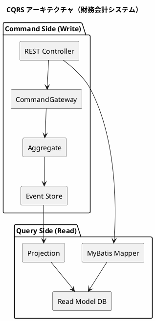
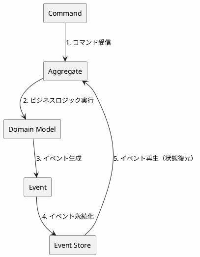
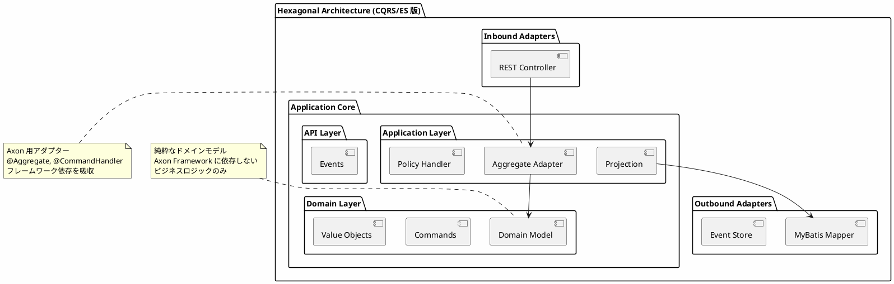
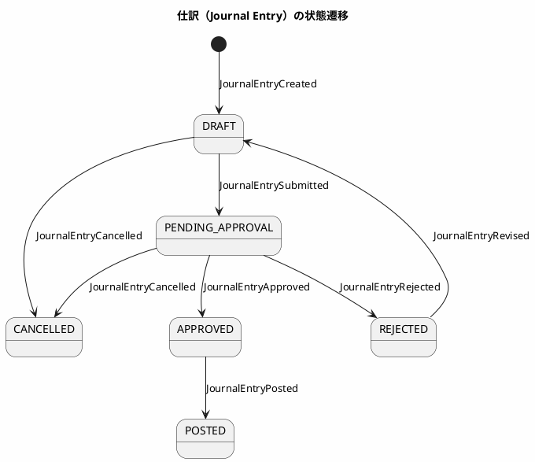
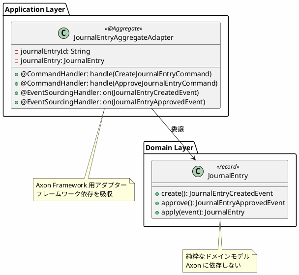
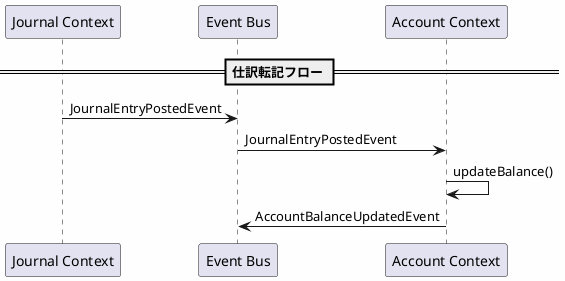
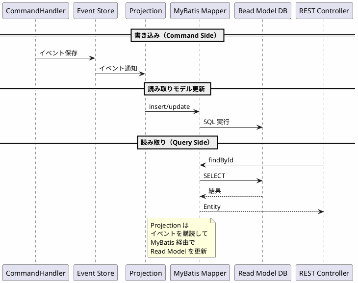
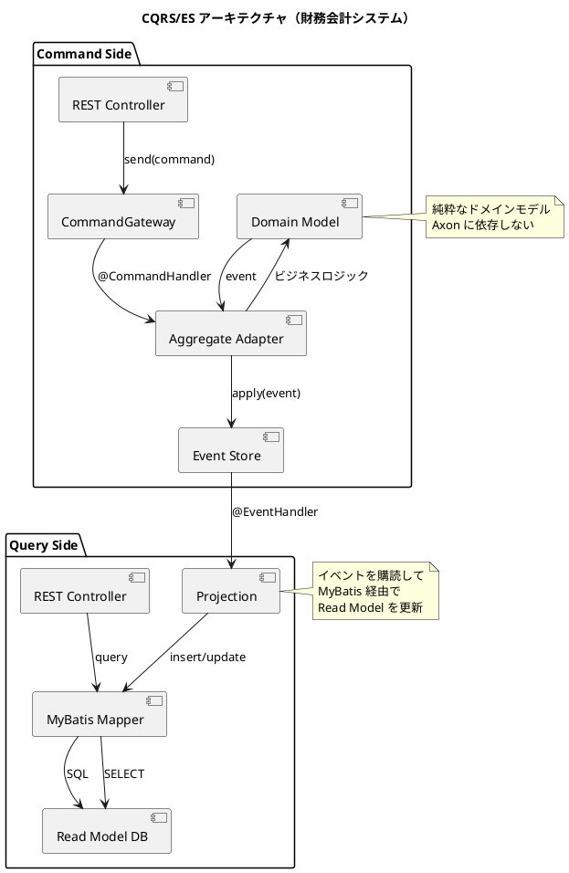

# 実践データベース設計：財務会計システム 研究 5 - Axon CQRS/ES の実装

## はじめに

本研究では、REST API（第21章）、gRPC（研究 3）、GraphQL（研究 4）とは異なるアプローチとして、**CQRS（Command Query Responsibility Segregation）** と **Event Sourcing** による財務会計システムを実装します。Axon Framework を使用し、コマンド（書き込み）とクエリ（読み取り）を分離し、すべての状態変更をイベントとして記録するアーキテクチャを構築します。

研究 1 で構築したヘキサゴナルアーキテクチャの考え方を踏襲しつつ、**ドメインモデルをフレームワークから分離**し、Axon Aggregate Adapter を介して連携させます。Read Model の永続化には **MyBatis** を使用します。

財務会計システムでは、**仕訳（Journal Entry）** の作成から承認、転記までのワークフローを CQRS/ES で実装し、すべての取引履歴を完全に追跡可能な形で保存します。

---

## 第26章：Axon CQRS/ES アーキテクチャの基礎

### 26.1 CQRS とは

CQRS（Command Query Responsibility Segregation）は、コマンド（書き込み）とクエリ（読み取り）の責務を分離するアーキテクチャパターンです。従来の CRUD 操作を単一のモデルで処理するのではなく、書き込み用のモデルと読み取り用のモデルを分けることで、それぞれに最適化された設計が可能になります。



**CQRS の利点：**

| 観点 | 説明 |
|------|------|
| **スケーラビリティ** | 読み取りと書き込みを独立してスケール可能 |
| **パフォーマンス** | 読み取りに最適化されたモデルで高速クエリ |
| **複雑性の分離** | 書き込みロジックと読み取りロジックを独立して開発 |
| **監査対応** | Event Sourcing と組み合わせて完全な履歴を保持 |

**財務会計システムでの CQRS の意義：**

- **監査証跡**: すべての仕訳変更履歴を完全に保持
- **複雑なクエリ**: 試算表、財務諸表など多様なビューを効率的に生成
- **データ整合性**: イベントベースで一貫性を保証

---

### 26.2 Event Sourcing とは

Event Sourcing は、アプリケーションの状態をイベントの連続として保存するパターンです。現在の状態を直接保存するのではなく、状態変更を表すイベントを記録し、必要に応じてイベントを再生して現在の状態を再構築します。



**Event Sourcing の利点：**

| 観点 | 説明 |
|------|------|
| **完全な履歴** | すべての状態変更が記録される |
| **監査証跡** | いつ、誰が、何を変更したかが明確 |
| **時間旅行** | 過去の任意の時点の状態を再構築可能 |
| **イベント駆動** | 他システムとの連携が容易 |
| **デバッグ** | 問題発生時にイベントを追跡可能 |

**財務会計システムでの Event Sourcing の意義：**

- **訂正仕訳の追跡**: 修正履歴を完全に保持
- **期末決算処理**: 任意の時点での残高を再計算可能
- **内部統制**: SOX 法対応の監査証跡を自動生成

---

### 26.3 ヘキサゴナルアーキテクチャとの統合

本実装では、ヘキサゴナルアーキテクチャ（Ports & Adapters）を採用し、ビジネスロジックを外部依存から分離します。



**設計原則：**

1. **ドメインモデルの純粋性**: ドメインモデルは Axon に依存しない純粋な Java コード
2. **Aggregate Adapter**: Axon Framework 用のアダプターを Application Layer に配置
3. **イベントは公開 API**: イベントは他の Context から参照される公開 API として定義

---

### 26.4 技術スタック

| カテゴリ | 技術 | バージョン |
|---------|------|-----------|
| 言語 | Java | 21 |
| フレームワーク | Spring Boot | 3.4.1 |
| CQRS/ES | Axon Framework | 4.10.3 |
| ORM | MyBatis | 3.0.4 |
| API ドキュメント | SpringDoc OpenAPI | 2.7.0 |
| データベース | H2 (開発) / PostgreSQL (本番) | - |

#### build.gradle.kts

<details>
<summary>コード例: build.gradle.kts</summary>

```kotlin
dependencies {
    // Spring Boot
    implementation("org.springframework.boot:spring-boot-starter-web")
    implementation("org.springframework.boot:spring-boot-starter-validation")

    // Axon Framework
    implementation("org.axonframework:axon-spring-boot-starter:4.10.3") {
        exclude(group = "org.axonframework", module = "axon-server-connector")
    }

    // MyBatis
    implementation("org.mybatis.spring.boot:mybatis-spring-boot-starter:3.0.4")

    // OpenAPI
    implementation("org.springdoc:springdoc-openapi-starter-webmvc-ui:2.7.0")

    // Database
    runtimeOnly("com.h2database:h2")
    runtimeOnly("org.postgresql:postgresql")

    // Test
    testImplementation("org.springframework.boot:spring-boot-starter-test")
    testImplementation("org.axonframework:axon-test:4.10.3")
    testImplementation("org.mybatis.spring.boot:mybatis-spring-boot-starter-test:3.0.4")
}
```

</details>

---

### 26.5 ディレクトリ構造

<details>
<summary>コード例: ディレクトリ構成</summary>

```
src/main/java/com/example/accounting/
├── app/                              # アプリケーション共通
│   └── RootController.java
├── config/                           # 設定クラス
│   ├── AxonConfig.java
│   ├── MyBatisConfig.java
│   └── OpenApiConfig.java
├── journal/                          # Journal Bounded Context（仕訳）
│   ├── api/
│   │   └── events/                   # 公開イベント API
│   │       ├── JournalEntryEvent.java     # sealed interface
│   │       ├── JournalEntryCreatedEvent.java
│   │       ├── JournalEntryApprovedEvent.java
│   │       └── JournalEntryPostedEvent.java
│   ├── adapter/
│   │   ├── inbound/rest/journals/    # Inbound Adapter (REST)
│   │   │   ├── JournalsController.java
│   │   │   └── protocol/             # Request/Response DTO
│   │   └── outbound/persistence/     # Outbound Adapter (MyBatis)
│   │       ├── entity/
│   │       │   └── JournalEntryEntity.java
│   │       └── mapper/
│   │           └── JournalEntryMapper.java
│   ├── application/
│   │   ├── aggregate/                # Axon Aggregate Adapter
│   │   │   └── JournalEntryAggregateAdapter.java
│   │   ├── policy/                   # イベントハンドラー（Choreography）
│   │   │   └── AccountEventHandler.java
│   │   └── query/                    # Projection
│   │       └── JournalEntryProjection.java
│   └── domain/
│       └── model/aggregate/journal/  # 純粋なドメインモデル
│           ├── JournalEntry.java
│           ├── JournalEntryCommands.java
│           ├── JournalEntryStatus.java
│           └── JournalLine.java
└── account/                          # Account Bounded Context（勘定科目）
    ├── api/events/
    │   ├── AccountEvent.java
    │   ├── AccountBalanceUpdatedEvent.java
    │   └── AccountClosedEvent.java
    ├── application/
    │   ├── aggregate/
    │   │   └── AccountAggregateAdapter.java
    │   └── policy/
    │       └── JournalEventHandler.java
    └── domain/model/aggregate/account/
        ├── Account.java
        └── AccountCommands.java

src/main/resources/
├── application.yml
├── schema.sql                        # Read Model スキーマ
└── mapper/
    └── JournalEntryMapper.xml        # MyBatis マッパー XML
```

</details>

---

### 26.6 Axon 設定クラス

<details>
<summary>コード例: AxonConfig.java</summary>

```java
package com.example.accounting.config;

import org.axonframework.eventsourcing.eventstore.EmbeddedEventStore;
import org.axonframework.eventsourcing.eventstore.EventStorageEngine;
import org.axonframework.eventsourcing.eventstore.EventStore;
import org.axonframework.eventsourcing.eventstore.jdbc.JdbcEventStorageEngine;
import org.axonframework.serialization.Serializer;
import org.axonframework.serialization.json.JacksonSerializer;
import org.springframework.context.annotation.Bean;
import org.springframework.context.annotation.Configuration;

import javax.sql.DataSource;

/**
 * Axon Framework 設定
 */
@Configuration
public class AxonConfig {

    /**
     * JDBC ベースの Event Storage Engine
     */
    @Bean
    public EventStorageEngine eventStorageEngine(
            DataSource dataSource,
            Serializer serializer) {
        return JdbcEventStorageEngine.builder()
                .snapshotSerializer(serializer)
                .eventSerializer(serializer)
                .dataSource(dataSource)
                .build();
    }

    /**
     * Event Store
     */
    @Bean
    public EventStore eventStore(EventStorageEngine eventStorageEngine) {
        return EmbeddedEventStore.builder()
                .storageEngine(eventStorageEngine)
                .build();
    }

    /**
     * JSON シリアライザー
     */
    @Bean
    public Serializer eventSerializer() {
        return JacksonSerializer.defaultSerializer();
    }
}
```

</details>

### 26.7 MyBatis 設定クラス

<details>
<summary>コード例: MyBatisConfig.java</summary>

```java
package com.example.accounting.config;

import org.apache.ibatis.session.SqlSessionFactory;
import org.mybatis.spring.SqlSessionFactoryBean;
import org.mybatis.spring.annotation.MapperScan;
import org.springframework.context.annotation.Bean;
import org.springframework.context.annotation.Configuration;
import org.springframework.core.io.support.PathMatchingResourcePatternResolver;

import javax.sql.DataSource;

/**
 * MyBatis 設定
 */
@Configuration
@MapperScan(basePackages = {
    "com.example.accounting.journal.adapter.outbound.persistence.mapper",
    "com.example.accounting.account.adapter.outbound.persistence.mapper"
})
public class MyBatisConfig {

    @Bean
    public SqlSessionFactory sqlSessionFactory(DataSource dataSource) throws Exception {
        SqlSessionFactoryBean factoryBean = new SqlSessionFactoryBean();
        factoryBean.setDataSource(dataSource);
        factoryBean.setMapperLocations(
            new PathMatchingResourcePatternResolver()
                .getResources("classpath:mapper/**/*.xml")
        );
        factoryBean.setTypeAliasesPackage(
            "com.example.accounting.journal.adapter.outbound.persistence.entity," +
            "com.example.accounting.account.adapter.outbound.persistence.entity"
        );

        org.apache.ibatis.session.Configuration configuration =
            new org.apache.ibatis.session.Configuration();
        configuration.setMapUnderscoreToCamelCase(true);
        factoryBean.setConfiguration(configuration);

        return factoryBean.getObject();
    }
}
```

</details>

---

## 第27章：ドメインモデルとイベント設計

### 27.1 Journal Bounded Context

仕訳の作成から転記完了までのライフサイクルを管理します。

#### 状態遷移図



#### イベント一覧

| イベント | 説明 |
|---------|------|
| `JournalEntryCreatedEvent` | 仕訳が作成された |
| `JournalEntrySubmittedEvent` | 仕訳が承認申請された |
| `JournalEntryApprovedEvent` | 仕訳が承認された |
| `JournalEntryRejectedEvent` | 仕訳が却下された |
| `JournalEntryRevisedEvent` | 却下された仕訳が修正された |
| `JournalEntryPostedEvent` | 仕訳が転記された（元帳に反映） |
| `JournalEntryCancelledEvent` | 仕訳がキャンセルされた |

---

### 27.2 イベント定義（API Layer）

#### sealed interface によるイベントの型安全性

<details>
<summary>コード例: JournalEntryEvent.java</summary>

```java
package com.example.accounting.journal.api.events;

/**
 * JournalEntry イベントの sealed interface
 * すべての JournalEntry イベントの親インターフェース
 */
public sealed interface JournalEntryEvent permits
        JournalEntryCreatedEvent,
        JournalEntrySubmittedEvent,
        JournalEntryApprovedEvent,
        JournalEntryRejectedEvent,
        JournalEntryRevisedEvent,
        JournalEntryPostedEvent,
        JournalEntryCancelledEvent {

    String journalEntryId();
}
```

</details>

**sealed interface の利点：**

- **網羅性チェック**: switch 式でコンパイル時に全ケースをチェック
- **型安全性**: 許可されたクラスのみが実装可能
- **ドキュメント**: 存在するイベントが一目でわかる

#### イベント record の実装

<details>
<summary>コード例: JournalEntryCreatedEvent.java</summary>

```java
package com.example.accounting.journal.api.events;

import java.math.BigDecimal;
import java.time.LocalDate;
import java.time.LocalDateTime;
import java.util.List;

/**
 * 仕訳作成イベント
 */
public record JournalEntryCreatedEvent(
        String journalEntryId,
        String journalNumber,
        LocalDate transactionDate,
        String description,
        List<JournalLineData> lines,
        String createdBy,
        LocalDateTime createdAt
) implements JournalEntryEvent {

    /**
     * 仕訳明細データ
     */
    public record JournalLineData(
            String accountCode,
            String accountName,
            BigDecimal debitAmount,
            BigDecimal creditAmount
    ) {
    }
}
```

</details>

<details>
<summary>コード例: JournalEntryApprovedEvent.java</summary>

```java
package com.example.accounting.journal.api.events;

import java.time.LocalDateTime;

/**
 * 仕訳承認イベント
 */
public record JournalEntryApprovedEvent(
        String journalEntryId,
        String approvedBy,
        String comment,
        LocalDateTime approvedAt
) implements JournalEntryEvent {
}
```

</details>

<details>
<summary>コード例: JournalEntryPostedEvent.java</summary>

```java
package com.example.accounting.journal.api.events;

import java.time.LocalDateTime;

/**
 * 仕訳転記イベント
 */
public record JournalEntryPostedEvent(
        String journalEntryId,
        String fiscalPeriod,
        String postedBy,
        LocalDateTime postedAt
) implements JournalEntryEvent {
}
```

</details>

<details>
<summary>コード例: JournalEntryCancelledEvent.java</summary>

```java
package com.example.accounting.journal.api.events;

import java.time.LocalDateTime;

/**
 * 仕訳キャンセルイベント
 */
public record JournalEntryCancelledEvent(
        String journalEntryId,
        String cancelledBy,
        String reason,
        LocalDateTime cancelledAt
) implements JournalEntryEvent {
}
```

</details>

---

### 27.3 コマンド定義（Domain Layer）

<details>
<summary>コード例: JournalEntryCommands.java</summary>

```java
package com.example.accounting.journal.domain.model.aggregate.journal;

import org.axonframework.modelling.command.TargetAggregateIdentifier;
import java.math.BigDecimal;
import java.time.LocalDate;
import java.util.List;

/**
 * JournalEntry 集約へのコマンド定義
 */
public final class JournalEntryCommands {

    private JournalEntryCommands() {
    }

    /**
     * 仕訳作成コマンド
     */
    public record CreateJournalEntryCommand(
            @TargetAggregateIdentifier
            String journalEntryId,
            LocalDate transactionDate,
            String description,
            List<JournalLineInput> lines,
            String createdBy
    ) {
        public record JournalLineInput(
                String accountCode,
                String accountName,
                BigDecimal debitAmount,
                BigDecimal creditAmount
        ) {
        }
    }

    /**
     * 仕訳承認申請コマンド
     */
    public record SubmitJournalEntryCommand(
            @TargetAggregateIdentifier
            String journalEntryId,
            String submittedBy
    ) {
    }

    /**
     * 仕訳承認コマンド
     */
    public record ApproveJournalEntryCommand(
            @TargetAggregateIdentifier
            String journalEntryId,
            String approvedBy,
            String comment
    ) {
    }

    /**
     * 仕訳却下コマンド
     */
    public record RejectJournalEntryCommand(
            @TargetAggregateIdentifier
            String journalEntryId,
            String rejectedBy,
            String reason
    ) {
    }

    /**
     * 仕訳修正コマンド
     */
    public record ReviseJournalEntryCommand(
            @TargetAggregateIdentifier
            String journalEntryId,
            LocalDate transactionDate,
            String description,
            List<CreateJournalEntryCommand.JournalLineInput> lines,
            String revisedBy
    ) {
    }

    /**
     * 仕訳転記コマンド
     */
    public record PostJournalEntryCommand(
            @TargetAggregateIdentifier
            String journalEntryId,
            String fiscalPeriod,
            String postedBy
    ) {
    }

    /**
     * 仕訳キャンセルコマンド
     */
    public record CancelJournalEntryCommand(
            @TargetAggregateIdentifier
            String journalEntryId,
            String cancelledBy,
            String reason
    ) {
    }
}
```

</details>

**@TargetAggregateIdentifier の役割：**

- Axon がコマンドをどの集約インスタンスにルーティングするかを決定
- 集約の一意識別子となるフィールドに付与

---

### 27.4 ドメインモデル（純粋な Java）

<details>
<summary>コード例: JournalEntry.java</summary>

```java
package com.example.accounting.journal.domain.model.aggregate.journal;

import com.example.accounting.journal.api.events.*;
import com.example.accounting.journal.api.events.JournalEntryCreatedEvent.JournalLineData;
import java.math.BigDecimal;
import java.time.LocalDate;
import java.time.LocalDateTime;
import java.util.List;

/**
 * JournalEntry ドメインモデル（Axon 非依存）
 * 純粋なビジネスロジックのみを含む
 */
public record JournalEntry(
        String journalEntryId,
        String journalNumber,
        LocalDate transactionDate,
        String description,
        List<JournalLine> lines,
        JournalEntryStatus status
) {

    // ======== ファクトリメソッド ========

    /**
     * 仕訳作成
     */
    public static JournalEntryCreatedEvent create(
            String journalEntryId,
            String journalNumber,
            LocalDate transactionDate,
            String description,
            List<JournalLineData> lines,
            String createdBy
    ) {
        // バリデーション: 借方・貸方の合計が一致すること
        BigDecimal totalDebit = lines.stream()
                .map(JournalLineData::debitAmount)
                .reduce(BigDecimal.ZERO, BigDecimal::add);
        BigDecimal totalCredit = lines.stream()
                .map(JournalLineData::creditAmount)
                .reduce(BigDecimal.ZERO, BigDecimal::add);

        if (totalDebit.compareTo(totalCredit) != 0) {
            throw new IllegalArgumentException(
                    "Debit and credit amounts must be equal. Debit: " + totalDebit + ", Credit: " + totalCredit
            );
        }

        if (lines.isEmpty()) {
            throw new IllegalArgumentException("Journal entry must have at least one line");
        }

        return new JournalEntryCreatedEvent(
                journalEntryId,
                journalNumber,
                transactionDate,
                description,
                lines,
                createdBy,
                LocalDateTime.now()
        );
    }

    /**
     * イベントからの再構築
     */
    public static JournalEntry from(JournalEntryCreatedEvent event) {
        List<JournalLine> lines = event.lines().stream()
                .map(data -> new JournalLine(
                        data.accountCode(),
                        data.accountName(),
                        data.debitAmount(),
                        data.creditAmount()
                ))
                .toList();

        return new JournalEntry(
                event.journalEntryId(),
                event.journalNumber(),
                event.transactionDate(),
                event.description(),
                lines,
                JournalEntryStatus.DRAFT
        );
    }

    // ======== 状態遷移メソッド ========

    /**
     * 承認申請
     */
    public JournalEntrySubmittedEvent submit(String submittedBy) {
        if (status != JournalEntryStatus.DRAFT) {
            throw new IllegalStateException("Only draft journal entries can be submitted");
        }
        return new JournalEntrySubmittedEvent(journalEntryId, submittedBy, LocalDateTime.now());
    }

    /**
     * 承認
     */
    public JournalEntryApprovedEvent approve(String approvedBy, String comment) {
        if (status != JournalEntryStatus.PENDING_APPROVAL) {
            throw new IllegalStateException("Only pending journal entries can be approved");
        }
        return new JournalEntryApprovedEvent(journalEntryId, approvedBy, comment, LocalDateTime.now());
    }

    /**
     * 却下
     */
    public JournalEntryRejectedEvent reject(String rejectedBy, String reason) {
        if (status != JournalEntryStatus.PENDING_APPROVAL) {
            throw new IllegalStateException("Only pending journal entries can be rejected");
        }
        return new JournalEntryRejectedEvent(journalEntryId, rejectedBy, reason, LocalDateTime.now());
    }

    /**
     * 修正
     */
    public JournalEntryRevisedEvent revise(
            LocalDate transactionDate,
            String description,
            List<JournalLineData> lines,
            String revisedBy
    ) {
        if (status != JournalEntryStatus.REJECTED) {
            throw new IllegalStateException("Only rejected journal entries can be revised");
        }

        // バリデーション
        BigDecimal totalDebit = lines.stream()
                .map(JournalLineData::debitAmount)
                .reduce(BigDecimal.ZERO, BigDecimal::add);
        BigDecimal totalCredit = lines.stream()
                .map(JournalLineData::creditAmount)
                .reduce(BigDecimal.ZERO, BigDecimal::add);

        if (totalDebit.compareTo(totalCredit) != 0) {
            throw new IllegalArgumentException("Debit and credit amounts must be equal");
        }

        return new JournalEntryRevisedEvent(
                journalEntryId,
                transactionDate,
                description,
                lines,
                revisedBy,
                LocalDateTime.now()
        );
    }

    /**
     * 転記
     */
    public JournalEntryPostedEvent post(String fiscalPeriod, String postedBy) {
        if (status != JournalEntryStatus.APPROVED) {
            throw new IllegalStateException("Only approved journal entries can be posted");
        }
        return new JournalEntryPostedEvent(journalEntryId, fiscalPeriod, postedBy, LocalDateTime.now());
    }

    /**
     * キャンセル
     */
    public JournalEntryCancelledEvent cancel(String cancelledBy, String reason) {
        if (status == JournalEntryStatus.POSTED) {
            throw new IllegalStateException("Posted journal entries cannot be cancelled");
        }
        if (status == JournalEntryStatus.CANCELLED) {
            throw new IllegalStateException("Journal entry is already cancelled");
        }
        return new JournalEntryCancelledEvent(journalEntryId, cancelledBy, reason, LocalDateTime.now());
    }

    // ======== イベント適用メソッド ========

    /**
     * イベントを適用して新しい状態を生成
     */
    public JournalEntry apply(JournalEntryEvent event) {
        return switch (event) {
            case JournalEntryCreatedEvent e -> from(e);
            case JournalEntrySubmittedEvent e -> withStatus(JournalEntryStatus.PENDING_APPROVAL);
            case JournalEntryApprovedEvent e -> withStatus(JournalEntryStatus.APPROVED);
            case JournalEntryRejectedEvent e -> withStatus(JournalEntryStatus.REJECTED);
            case JournalEntryRevisedEvent e -> revised(e);
            case JournalEntryPostedEvent e -> withStatus(JournalEntryStatus.POSTED);
            case JournalEntryCancelledEvent e -> withStatus(JournalEntryStatus.CANCELLED);
        };
    }

    /**
     * 状態更新ヘルパー
     */
    private JournalEntry withStatus(JournalEntryStatus newStatus) {
        return new JournalEntry(journalEntryId, journalNumber, transactionDate, description, lines, newStatus);
    }

    /**
     * 修正適用
     */
    private JournalEntry revised(JournalEntryRevisedEvent event) {
        List<JournalLine> newLines = event.lines().stream()
                .map(data -> new JournalLine(
                        data.accountCode(),
                        data.accountName(),
                        data.debitAmount(),
                        data.creditAmount()
                ))
                .toList();

        return new JournalEntry(
                journalEntryId,
                journalNumber,
                event.transactionDate(),
                event.description(),
                newLines,
                JournalEntryStatus.DRAFT
        );
    }
}
```

</details>

<details>
<summary>コード例: JournalEntryStatus.java</summary>

```java
package com.example.accounting.journal.domain.model.aggregate.journal;

/**
 * 仕訳ステータス
 */
public enum JournalEntryStatus {
    DRAFT,              // 下書き
    PENDING_APPROVAL,   // 承認待ち
    APPROVED,           // 承認済み
    REJECTED,           // 却下
    POSTED,             // 転記済み
    CANCELLED           // キャンセル
}
```

</details>

<details>
<summary>コード例: JournalLine.java</summary>

```java
package com.example.accounting.journal.domain.model.aggregate.journal;

import java.math.BigDecimal;

/**
 * 仕訳明細
 */
public record JournalLine(
        String accountCode,
        String accountName,
        BigDecimal debitAmount,
        BigDecimal creditAmount
) {
    public JournalLine {
        if (debitAmount == null) debitAmount = BigDecimal.ZERO;
        if (creditAmount == null) creditAmount = BigDecimal.ZERO;

        // 借方と貸方は排他的
        if (debitAmount.compareTo(BigDecimal.ZERO) > 0 &&
            creditAmount.compareTo(BigDecimal.ZERO) > 0) {
            throw new IllegalArgumentException(
                    "A journal line cannot have both debit and credit amounts"
            );
        }
    }
}
```

</details>

**ドメインモデル設計原則：**

| 原則 | 説明 |
|------|------|
| **Axon 非依存** | ドメインモデルにフレームワーク依存を持たせない |
| **イミュータブル** | record でイミュータブルに設計 |
| **イベントを返す** | 状態遷移メソッドはイベントを返す |
| **最小限のフィールド** | 状態遷移の判定に必要な最小限のみ保持 |
| **ビジネスルール** | 借方・貸方の一致検証をドメインモデル内で実施 |

---

### 27.5 Account Bounded Context

勘定科目の残高管理を行います。

#### イベント定義

<details>
<summary>コード例: AccountEvent.java</summary>

```java
package com.example.accounting.account.api.events;

/**
 * Account イベントの sealed interface
 */
public sealed interface AccountEvent permits
        AccountCreatedEvent,
        AccountBalanceUpdatedEvent,
        AccountClosedEvent {

    String accountCode();
}
```

</details>

<details>
<summary>コード例: AccountBalanceUpdatedEvent.java</summary>

```java
package com.example.accounting.account.api.events;

import java.math.BigDecimal;
import java.time.LocalDateTime;

/**
 * 勘定残高更新イベント
 */
public record AccountBalanceUpdatedEvent(
        String accountCode,
        String journalEntryId,
        BigDecimal debitAmount,
        BigDecimal creditAmount,
        BigDecimal balanceAfter,
        LocalDateTime updatedAt
) implements AccountEvent {
}
```

</details>

---

## 第28章：Aggregate Adapter と Policy Handler

### 28.1 Aggregate Adapter パターン

Aggregate Adapter は、純粋なドメインモデルと Axon Framework を繋ぐアダプター層です。フレームワーク固有のアノテーションやライフサイクル処理をドメインモデルから分離します。



---

### 28.2 JournalEntry Aggregate Adapter

<details>
<summary>コード例: JournalEntryAggregateAdapter.java</summary>

```java
package com.example.accounting.journal.application.aggregate;

import com.example.accounting.journal.api.events.*;
import com.example.accounting.journal.api.events.JournalEntryCreatedEvent.JournalLineData;
import com.example.accounting.journal.domain.model.aggregate.journal.JournalEntry;
import com.example.accounting.journal.domain.model.aggregate.journal.JournalEntryCommands.*;
import org.axonframework.commandhandling.CommandHandler;
import org.axonframework.eventsourcing.EventSourcingHandler;
import org.axonframework.modelling.command.AggregateIdentifier;
import org.axonframework.modelling.command.AggregateLifecycle;
import org.axonframework.spring.stereotype.Aggregate;

import java.util.UUID;

/**
 * JournalEntry Aggregate Adapter（Axon Framework 用）
 */
@Aggregate
public class JournalEntryAggregateAdapter {

    @AggregateIdentifier
    private String journalEntryId;

    private JournalEntry journalEntry;

    /**
     * Axon が使用するデフォルトコンストラクタ
     */
    protected JournalEntryAggregateAdapter() {
    }

    // ======== Command Handlers ========

    /**
     * 集約作成コマンドハンドラー（コンストラクタ）
     */
    @CommandHandler
    public JournalEntryAggregateAdapter(CreateJournalEntryCommand command) {
        // 仕訳番号を生成
        String journalNumber = generateJournalNumber();

        // 明細データを変換
        var lines = command.lines().stream()
                .map(input -> new JournalLineData(
                        input.accountCode(),
                        input.accountName(),
                        input.debitAmount(),
                        input.creditAmount()
                ))
                .toList();

        // ドメインモデルのファクトリメソッドを呼び出し
        var event = JournalEntry.create(
                command.journalEntryId(),
                journalNumber,
                command.transactionDate(),
                command.description(),
                lines,
                command.createdBy()
        );
        // イベントを発行
        AggregateLifecycle.apply(event);
    }

    /**
     * 承認申請コマンドハンドラー
     */
    @CommandHandler
    public void handle(SubmitJournalEntryCommand command) {
        var event = journalEntry.submit(command.submittedBy());
        AggregateLifecycle.apply(event);
    }

    /**
     * 承認コマンドハンドラー
     */
    @CommandHandler
    public void handle(ApproveJournalEntryCommand command) {
        var event = journalEntry.approve(command.approvedBy(), command.comment());
        AggregateLifecycle.apply(event);
    }

    /**
     * 却下コマンドハンドラー
     */
    @CommandHandler
    public void handle(RejectJournalEntryCommand command) {
        var event = journalEntry.reject(command.rejectedBy(), command.reason());
        AggregateLifecycle.apply(event);
    }

    /**
     * 修正コマンドハンドラー
     */
    @CommandHandler
    public void handle(ReviseJournalEntryCommand command) {
        var lines = command.lines().stream()
                .map(input -> new JournalLineData(
                        input.accountCode(),
                        input.accountName(),
                        input.debitAmount(),
                        input.creditAmount()
                ))
                .toList();

        var event = journalEntry.revise(
                command.transactionDate(),
                command.description(),
                lines,
                command.revisedBy()
        );
        AggregateLifecycle.apply(event);
    }

    /**
     * 転記コマンドハンドラー
     */
    @CommandHandler
    public void handle(PostJournalEntryCommand command) {
        var event = journalEntry.post(command.fiscalPeriod(), command.postedBy());
        AggregateLifecycle.apply(event);
    }

    /**
     * キャンセルコマンドハンドラー
     */
    @CommandHandler
    public void handle(CancelJournalEntryCommand command) {
        var event = journalEntry.cancel(command.cancelledBy(), command.reason());
        AggregateLifecycle.apply(event);
    }

    // ======== Event Sourcing Handlers（状態復元）========

    @EventSourcingHandler
    public void on(JournalEntryCreatedEvent event) {
        this.journalEntryId = event.journalEntryId();
        this.journalEntry = JournalEntry.from(event);
    }

    @EventSourcingHandler
    public void on(JournalEntrySubmittedEvent event) {
        this.journalEntry = journalEntry.apply(event);
    }

    @EventSourcingHandler
    public void on(JournalEntryApprovedEvent event) {
        this.journalEntry = journalEntry.apply(event);
    }

    @EventSourcingHandler
    public void on(JournalEntryRejectedEvent event) {
        this.journalEntry = journalEntry.apply(event);
    }

    @EventSourcingHandler
    public void on(JournalEntryRevisedEvent event) {
        this.journalEntry = journalEntry.apply(event);
    }

    @EventSourcingHandler
    public void on(JournalEntryPostedEvent event) {
        this.journalEntry = journalEntry.apply(event);
    }

    @EventSourcingHandler
    public void on(JournalEntryCancelledEvent event) {
        this.journalEntry = journalEntry.apply(event);
    }

    // ======== ヘルパーメソッド ========

    private String generateJournalNumber() {
        // 実際のシステムでは年月日 + 連番など
        return "JE-" + UUID.randomUUID().toString().substring(0, 8).toUpperCase();
    }
}
```

</details>

**Axon アノテーション解説：**

| アノテーション | 説明 |
|--------------|------|
| `@Aggregate` | Event Sourcing 集約であることを宣言 |
| `@AggregateIdentifier` | 集約の識別子フィールド |
| `@CommandHandler` | コマンドを処理するメソッド |
| `@EventSourcingHandler` | イベントから状態を復元するメソッド |
| `AggregateLifecycle.apply()` | イベントを発行するメソッド |

---

### 28.3 Policy Handler（Choreography パターン）

Policy Handler は、他の Bounded Context から発行されたイベントを購読し、自律的に反応する処理を実装します。Choreography パターンでは、各 Context が独立して動作し、イベントを介して連携します。



---

### 28.4 JournalEventHandler（Account Context 内）

<details>
<summary>コード例: JournalEventHandler.java</summary>

```java
package com.example.accounting.account.application.policy;

import com.example.accounting.account.domain.model.aggregate.account.AccountCommands.*;
import com.example.accounting.journal.api.events.JournalEntryPostedEvent;
import org.axonframework.commandhandling.gateway.CommandGateway;
import org.axonframework.eventhandling.EventHandler;
import org.springframework.stereotype.Component;

/**
 * Journal イベントに反応して勘定残高を更新する Policy Handler
 */
@Component
public class JournalEventHandler {

    private final CommandGateway commandGateway;

    public JournalEventHandler(CommandGateway commandGateway) {
        this.commandGateway = commandGateway;
    }

    /**
     * Policy: "When a journal entry is posted, update account balances"
     */
    @EventHandler
    public void on(JournalEntryPostedEvent event) {
        // 仕訳の各明細に対して勘定残高を更新
        // 実際の実装では、イベントから明細情報を取得して処理
        var command = new UpdateAccountBalanceCommand(
                event.journalEntryId(),
                event.fiscalPeriod()
        );
        commandGateway.send(command);
    }
}
```

</details>

**Policy Handler の設計原則：**

| 原則 | 説明 |
|------|------|
| **単一責任** | 1 つの Policy Handler は 1 つの関心事のみを扱う |
| **疎結合** | 他の Context のイベントを購読し、自 Context のコマンドを発行 |
| **自律性** | 他のサービスに依存せず独立して動作 |
| **冪等性** | 同じイベントを複数回受信しても問題ないよう設計 |

---

## 第29章：Projection と Read Model

### 29.1 Projection の役割

Projection は、イベントを購読して Read Model（クエリ用のデータモデル）を更新するコンポーネントです。CQRS では、書き込みモデル（Event Store）と読み取りモデル（Read Model DB）を分離し、それぞれに最適化されたデータ構造を使用します。



---

### 29.2 JournalEntry Projection（MyBatis 版）

<details>
<summary>コード例: JournalEntryProjection.java</summary>

```java
package com.example.accounting.journal.application.query;

import com.example.accounting.journal.adapter.outbound.persistence.entity.JournalEntryEntity;
import com.example.accounting.journal.adapter.outbound.persistence.entity.JournalLineEntity;
import com.example.accounting.journal.adapter.outbound.persistence.mapper.JournalEntryMapper;
import com.example.accounting.journal.api.events.*;
import org.axonframework.eventhandling.EventHandler;
import org.springframework.stereotype.Component;

import java.util.List;

/**
 * JournalEntry Projection（MyBatis を使用した Read Model の更新）
 */
@Component
public class JournalEntryProjection {

    private final JournalEntryMapper journalEntryMapper;

    public JournalEntryProjection(JournalEntryMapper journalEntryMapper) {
        this.journalEntryMapper = journalEntryMapper;
    }

    @EventHandler
    public void on(JournalEntryCreatedEvent event) {
        var entity = new JournalEntryEntity();
        entity.setJournalEntryId(event.journalEntryId());
        entity.setJournalNumber(event.journalNumber());
        entity.setTransactionDate(event.transactionDate());
        entity.setDescription(event.description());
        entity.setStatus("DRAFT");
        entity.setCreatedBy(event.createdBy());
        entity.setCreatedAt(event.createdAt());

        journalEntryMapper.insert(entity);

        // 明細を保存
        List<JournalLineEntity> lines = event.lines().stream()
                .map(data -> {
                    var line = new JournalLineEntity();
                    line.setJournalEntryId(event.journalEntryId());
                    line.setAccountCode(data.accountCode());
                    line.setAccountName(data.accountName());
                    line.setDebitAmount(data.debitAmount());
                    line.setCreditAmount(data.creditAmount());
                    return line;
                })
                .toList();

        journalEntryMapper.insertLines(lines);
    }

    @EventHandler
    public void on(JournalEntrySubmittedEvent event) {
        journalEntryMapper.updateStatus(event.journalEntryId(), "PENDING_APPROVAL");
        journalEntryMapper.updateSubmission(event.journalEntryId(), event.submittedBy(), event.submittedAt());
    }

    @EventHandler
    public void on(JournalEntryApprovedEvent event) {
        journalEntryMapper.updateStatus(event.journalEntryId(), "APPROVED");
        journalEntryMapper.updateApproval(
            event.journalEntryId(),
            event.approvedBy(),
            event.comment(),
            event.approvedAt()
        );
    }

    @EventHandler
    public void on(JournalEntryRejectedEvent event) {
        journalEntryMapper.updateStatus(event.journalEntryId(), "REJECTED");
        journalEntryMapper.updateRejection(
            event.journalEntryId(),
            event.rejectedBy(),
            event.reason(),
            event.rejectedAt()
        );
    }

    @EventHandler
    public void on(JournalEntryRevisedEvent event) {
        journalEntryMapper.updateStatus(event.journalEntryId(), "DRAFT");
        journalEntryMapper.updateRevision(
            event.journalEntryId(),
            event.transactionDate(),
            event.description(),
            event.revisedBy(),
            event.revisedAt()
        );

        // 明細を削除して再作成
        journalEntryMapper.deleteLines(event.journalEntryId());
        List<JournalLineEntity> lines = event.lines().stream()
                .map(data -> {
                    var line = new JournalLineEntity();
                    line.setJournalEntryId(event.journalEntryId());
                    line.setAccountCode(data.accountCode());
                    line.setAccountName(data.accountName());
                    line.setDebitAmount(data.debitAmount());
                    line.setCreditAmount(data.creditAmount());
                    return line;
                })
                .toList();
        journalEntryMapper.insertLines(lines);
    }

    @EventHandler
    public void on(JournalEntryPostedEvent event) {
        journalEntryMapper.updateStatus(event.journalEntryId(), "POSTED");
        journalEntryMapper.updatePosting(
            event.journalEntryId(),
            event.fiscalPeriod(),
            event.postedBy(),
            event.postedAt()
        );
    }

    @EventHandler
    public void on(JournalEntryCancelledEvent event) {
        journalEntryMapper.updateStatus(event.journalEntryId(), "CANCELLED");
        journalEntryMapper.updateCancellation(
            event.journalEntryId(),
            event.cancelledBy(),
            event.reason(),
            event.cancelledAt()
        );
    }
}
```

</details>

---

### 29.3 Read Model Entity

<details>
<summary>コード例: JournalEntryEntity.java</summary>

```java
package com.example.accounting.journal.adapter.outbound.persistence.entity;

import java.math.BigDecimal;
import java.time.LocalDate;
import java.time.LocalDateTime;
import java.util.List;

/**
 * JournalEntry Read Model（表示用のすべてのフィールドを保持）
 */
public class JournalEntryEntity {

    private String journalEntryId;
    private String journalNumber;
    private LocalDate transactionDate;
    private String description;
    private String status;

    // 合計金額（集計用）
    private BigDecimal totalDebitAmount;
    private BigDecimal totalCreditAmount;

    // 監査情報
    private String createdBy;
    private LocalDateTime createdAt;
    private String submittedBy;
    private LocalDateTime submittedAt;
    private String approvedBy;
    private String approvalComment;
    private LocalDateTime approvedAt;
    private String rejectedBy;
    private String rejectionReason;
    private LocalDateTime rejectedAt;
    private String revisedBy;
    private LocalDateTime revisedAt;
    private String fiscalPeriod;
    private String postedBy;
    private LocalDateTime postedAt;
    private String cancelledBy;
    private String cancellationReason;
    private LocalDateTime cancelledAt;

    // 明細
    private List<JournalLineEntity> lines;

    // Getters and Setters
    public String getJournalEntryId() { return journalEntryId; }
    public void setJournalEntryId(String journalEntryId) { this.journalEntryId = journalEntryId; }

    public String getJournalNumber() { return journalNumber; }
    public void setJournalNumber(String journalNumber) { this.journalNumber = journalNumber; }

    public LocalDate getTransactionDate() { return transactionDate; }
    public void setTransactionDate(LocalDate transactionDate) { this.transactionDate = transactionDate; }

    public String getDescription() { return description; }
    public void setDescription(String description) { this.description = description; }

    public String getStatus() { return status; }
    public void setStatus(String status) { this.status = status; }

    public BigDecimal getTotalDebitAmount() { return totalDebitAmount; }
    public void setTotalDebitAmount(BigDecimal totalDebitAmount) { this.totalDebitAmount = totalDebitAmount; }

    public BigDecimal getTotalCreditAmount() { return totalCreditAmount; }
    public void setTotalCreditAmount(BigDecimal totalCreditAmount) { this.totalCreditAmount = totalCreditAmount; }

    public String getCreatedBy() { return createdBy; }
    public void setCreatedBy(String createdBy) { this.createdBy = createdBy; }

    public LocalDateTime getCreatedAt() { return createdAt; }
    public void setCreatedAt(LocalDateTime createdAt) { this.createdAt = createdAt; }

    public String getSubmittedBy() { return submittedBy; }
    public void setSubmittedBy(String submittedBy) { this.submittedBy = submittedBy; }

    public LocalDateTime getSubmittedAt() { return submittedAt; }
    public void setSubmittedAt(LocalDateTime submittedAt) { this.submittedAt = submittedAt; }

    public String getApprovedBy() { return approvedBy; }
    public void setApprovedBy(String approvedBy) { this.approvedBy = approvedBy; }

    public String getApprovalComment() { return approvalComment; }
    public void setApprovalComment(String approvalComment) { this.approvalComment = approvalComment; }

    public LocalDateTime getApprovedAt() { return approvedAt; }
    public void setApprovedAt(LocalDateTime approvedAt) { this.approvedAt = approvedAt; }

    public String getRejectedBy() { return rejectedBy; }
    public void setRejectedBy(String rejectedBy) { this.rejectedBy = rejectedBy; }

    public String getRejectionReason() { return rejectionReason; }
    public void setRejectionReason(String rejectionReason) { this.rejectionReason = rejectionReason; }

    public LocalDateTime getRejectedAt() { return rejectedAt; }
    public void setRejectedAt(LocalDateTime rejectedAt) { this.rejectedAt = rejectedAt; }

    public String getRevisedBy() { return revisedBy; }
    public void setRevisedBy(String revisedBy) { this.revisedBy = revisedBy; }

    public LocalDateTime getRevisedAt() { return revisedAt; }
    public void setRevisedAt(LocalDateTime revisedAt) { this.revisedAt = revisedAt; }

    public String getFiscalPeriod() { return fiscalPeriod; }
    public void setFiscalPeriod(String fiscalPeriod) { this.fiscalPeriod = fiscalPeriod; }

    public String getPostedBy() { return postedBy; }
    public void setPostedBy(String postedBy) { this.postedBy = postedBy; }

    public LocalDateTime getPostedAt() { return postedAt; }
    public void setPostedAt(LocalDateTime postedAt) { this.postedAt = postedAt; }

    public String getCancelledBy() { return cancelledBy; }
    public void setCancelledBy(String cancelledBy) { this.cancelledBy = cancelledBy; }

    public String getCancellationReason() { return cancellationReason; }
    public void setCancellationReason(String cancellationReason) { this.cancellationReason = cancellationReason; }

    public LocalDateTime getCancelledAt() { return cancelledAt; }
    public void setCancelledAt(LocalDateTime cancelledAt) { this.cancelledAt = cancelledAt; }

    public List<JournalLineEntity> getLines() { return lines; }
    public void setLines(List<JournalLineEntity> lines) { this.lines = lines; }
}
```

</details>

<details>
<summary>コード例: JournalLineEntity.java</summary>

```java
package com.example.accounting.journal.adapter.outbound.persistence.entity;

import java.math.BigDecimal;

/**
 * JournalLine Read Model
 */
public class JournalLineEntity {

    private Long lineId;
    private String journalEntryId;
    private String accountCode;
    private String accountName;
    private BigDecimal debitAmount;
    private BigDecimal creditAmount;

    // Getters and Setters
    public Long getLineId() { return lineId; }
    public void setLineId(Long lineId) { this.lineId = lineId; }

    public String getJournalEntryId() { return journalEntryId; }
    public void setJournalEntryId(String journalEntryId) { this.journalEntryId = journalEntryId; }

    public String getAccountCode() { return accountCode; }
    public void setAccountCode(String accountCode) { this.accountCode = accountCode; }

    public String getAccountName() { return accountName; }
    public void setAccountName(String accountName) { this.accountName = accountName; }

    public BigDecimal getDebitAmount() { return debitAmount; }
    public void setDebitAmount(BigDecimal debitAmount) { this.debitAmount = debitAmount; }

    public BigDecimal getCreditAmount() { return creditAmount; }
    public void setCreditAmount(BigDecimal creditAmount) { this.creditAmount = creditAmount; }
}
```

</details>

---

### 29.4 MyBatis Mapper インターフェース

<details>
<summary>コード例: JournalEntryMapper.java</summary>

```java
package com.example.accounting.journal.adapter.outbound.persistence.mapper;

import com.example.accounting.journal.adapter.outbound.persistence.entity.JournalEntryEntity;
import com.example.accounting.journal.adapter.outbound.persistence.entity.JournalLineEntity;
import org.apache.ibatis.annotations.Mapper;
import org.apache.ibatis.annotations.Param;

import java.time.LocalDate;
import java.time.LocalDateTime;
import java.util.List;
import java.util.Optional;

/**
 * JournalEntry MyBatis Mapper
 */
@Mapper
public interface JournalEntryMapper {

    // 挿入
    void insert(JournalEntryEntity entity);

    void insertLines(List<JournalLineEntity> lines);

    // 検索
    Optional<JournalEntryEntity> findById(@Param("journalEntryId") String journalEntryId);

    List<JournalEntryEntity> findAll();

    List<JournalEntryEntity> findByStatus(@Param("status") String status);

    List<JournalEntryEntity> findByFiscalPeriod(@Param("fiscalPeriod") String fiscalPeriod);

    List<JournalEntryEntity> findByTransactionDateRange(
        @Param("fromDate") LocalDate fromDate,
        @Param("toDate") LocalDate toDate
    );

    List<JournalLineEntity> findLinesByJournalEntryId(@Param("journalEntryId") String journalEntryId);

    // 更新
    void updateStatus(@Param("journalEntryId") String journalEntryId, @Param("status") String status);

    void updateSubmission(
        @Param("journalEntryId") String journalEntryId,
        @Param("submittedBy") String submittedBy,
        @Param("submittedAt") LocalDateTime submittedAt
    );

    void updateApproval(
        @Param("journalEntryId") String journalEntryId,
        @Param("approvedBy") String approvedBy,
        @Param("comment") String comment,
        @Param("approvedAt") LocalDateTime approvedAt
    );

    void updateRejection(
        @Param("journalEntryId") String journalEntryId,
        @Param("rejectedBy") String rejectedBy,
        @Param("reason") String reason,
        @Param("rejectedAt") LocalDateTime rejectedAt
    );

    void updateRevision(
        @Param("journalEntryId") String journalEntryId,
        @Param("transactionDate") LocalDate transactionDate,
        @Param("description") String description,
        @Param("revisedBy") String revisedBy,
        @Param("revisedAt") LocalDateTime revisedAt
    );

    void updatePosting(
        @Param("journalEntryId") String journalEntryId,
        @Param("fiscalPeriod") String fiscalPeriod,
        @Param("postedBy") String postedBy,
        @Param("postedAt") LocalDateTime postedAt
    );

    void updateCancellation(
        @Param("journalEntryId") String journalEntryId,
        @Param("cancelledBy") String cancelledBy,
        @Param("reason") String reason,
        @Param("cancelledAt") LocalDateTime cancelledAt
    );

    // 削除
    void deleteLines(@Param("journalEntryId") String journalEntryId);
}
```

</details>

---

### 29.5 MyBatis Mapper XML

<details>
<summary>コード例: JournalEntryMapper.xml</summary>

```xml
<?xml version="1.0" encoding="UTF-8" ?>
<!DOCTYPE mapper PUBLIC "-//mybatis.org//DTD Mapper 3.0//EN"
  "http://mybatis.org/dtd/mybatis-3-mapper.dtd">

<mapper namespace="com.example.accounting.journal.adapter.outbound.persistence.mapper.JournalEntryMapper">

    <resultMap id="journalEntryResultMap" type="JournalEntryEntity">
        <id property="journalEntryId" column="journal_entry_id"/>
        <result property="journalNumber" column="journal_number"/>
        <result property="transactionDate" column="transaction_date"/>
        <result property="description" column="description"/>
        <result property="status" column="status"/>
        <result property="totalDebitAmount" column="total_debit_amount"/>
        <result property="totalCreditAmount" column="total_credit_amount"/>
        <result property="createdBy" column="created_by"/>
        <result property="createdAt" column="created_at"/>
        <result property="submittedBy" column="submitted_by"/>
        <result property="submittedAt" column="submitted_at"/>
        <result property="approvedBy" column="approved_by"/>
        <result property="approvalComment" column="approval_comment"/>
        <result property="approvedAt" column="approved_at"/>
        <result property="rejectedBy" column="rejected_by"/>
        <result property="rejectionReason" column="rejection_reason"/>
        <result property="rejectedAt" column="rejected_at"/>
        <result property="revisedBy" column="revised_by"/>
        <result property="revisedAt" column="revised_at"/>
        <result property="fiscalPeriod" column="fiscal_period"/>
        <result property="postedBy" column="posted_by"/>
        <result property="postedAt" column="posted_at"/>
        <result property="cancelledBy" column="cancelled_by"/>
        <result property="cancellationReason" column="cancellation_reason"/>
        <result property="cancelledAt" column="cancelled_at"/>
        <collection property="lines" ofType="JournalLineEntity"
                    select="findLinesByJournalEntryId" column="journal_entry_id"/>
    </resultMap>

    <resultMap id="journalLineResultMap" type="JournalLineEntity">
        <id property="lineId" column="line_id"/>
        <result property="journalEntryId" column="journal_entry_id"/>
        <result property="accountCode" column="account_code"/>
        <result property="accountName" column="account_name"/>
        <result property="debitAmount" column="debit_amount"/>
        <result property="creditAmount" column="credit_amount"/>
    </resultMap>

    <insert id="insert" parameterType="JournalEntryEntity">
        INSERT INTO journal_entries (
            journal_entry_id, journal_number, transaction_date, description,
            status, created_by, created_at
        ) VALUES (
            #{journalEntryId}, #{journalNumber}, #{transactionDate}, #{description},
            #{status}, #{createdBy}, #{createdAt}
        )
    </insert>

    <insert id="insertLines" parameterType="list">
        INSERT INTO journal_lines (
            journal_entry_id, account_code, account_name, debit_amount, credit_amount
        ) VALUES
        <foreach collection="list" item="line" separator=",">
            (#{line.journalEntryId}, #{line.accountCode}, #{line.accountName},
             #{line.debitAmount}, #{line.creditAmount})
        </foreach>
    </insert>

    <select id="findById" resultMap="journalEntryResultMap">
        SELECT je.*,
               (SELECT COALESCE(SUM(debit_amount), 0) FROM journal_lines WHERE journal_entry_id = je.journal_entry_id) as total_debit_amount,
               (SELECT COALESCE(SUM(credit_amount), 0) FROM journal_lines WHERE journal_entry_id = je.journal_entry_id) as total_credit_amount
        FROM journal_entries je
        WHERE je.journal_entry_id = #{journalEntryId}
    </select>

    <select id="findAll" resultMap="journalEntryResultMap">
        SELECT je.*,
               (SELECT COALESCE(SUM(debit_amount), 0) FROM journal_lines WHERE journal_entry_id = je.journal_entry_id) as total_debit_amount,
               (SELECT COALESCE(SUM(credit_amount), 0) FROM journal_lines WHERE journal_entry_id = je.journal_entry_id) as total_credit_amount
        FROM journal_entries je
        ORDER BY je.created_at DESC
    </select>

    <select id="findByStatus" resultMap="journalEntryResultMap">
        SELECT je.*,
               (SELECT COALESCE(SUM(debit_amount), 0) FROM journal_lines WHERE journal_entry_id = je.journal_entry_id) as total_debit_amount,
               (SELECT COALESCE(SUM(credit_amount), 0) FROM journal_lines WHERE journal_entry_id = je.journal_entry_id) as total_credit_amount
        FROM journal_entries je
        WHERE je.status = #{status}
        ORDER BY je.created_at DESC
    </select>

    <select id="findByFiscalPeriod" resultMap="journalEntryResultMap">
        SELECT je.*,
               (SELECT COALESCE(SUM(debit_amount), 0) FROM journal_lines WHERE journal_entry_id = je.journal_entry_id) as total_debit_amount,
               (SELECT COALESCE(SUM(credit_amount), 0) FROM journal_lines WHERE journal_entry_id = je.journal_entry_id) as total_credit_amount
        FROM journal_entries je
        WHERE je.fiscal_period = #{fiscalPeriod}
        ORDER BY je.transaction_date, je.journal_number
    </select>

    <select id="findByTransactionDateRange" resultMap="journalEntryResultMap">
        SELECT je.*,
               (SELECT COALESCE(SUM(debit_amount), 0) FROM journal_lines WHERE journal_entry_id = je.journal_entry_id) as total_debit_amount,
               (SELECT COALESCE(SUM(credit_amount), 0) FROM journal_lines WHERE journal_entry_id = je.journal_entry_id) as total_credit_amount
        FROM journal_entries je
        WHERE je.transaction_date BETWEEN #{fromDate} AND #{toDate}
        ORDER BY je.transaction_date, je.journal_number
    </select>

    <select id="findLinesByJournalEntryId" resultMap="journalLineResultMap">
        SELECT * FROM journal_lines WHERE journal_entry_id = #{journalEntryId} ORDER BY line_id
    </select>

    <update id="updateStatus">
        UPDATE journal_entries SET status = #{status} WHERE journal_entry_id = #{journalEntryId}
    </update>

    <update id="updateSubmission">
        UPDATE journal_entries
        SET submitted_by = #{submittedBy}, submitted_at = #{submittedAt}
        WHERE journal_entry_id = #{journalEntryId}
    </update>

    <update id="updateApproval">
        UPDATE journal_entries
        SET approved_by = #{approvedBy}, approval_comment = #{comment}, approved_at = #{approvedAt}
        WHERE journal_entry_id = #{journalEntryId}
    </update>

    <update id="updateRejection">
        UPDATE journal_entries
        SET rejected_by = #{rejectedBy}, rejection_reason = #{reason}, rejected_at = #{rejectedAt}
        WHERE journal_entry_id = #{journalEntryId}
    </update>

    <update id="updateRevision">
        UPDATE journal_entries
        SET transaction_date = #{transactionDate}, description = #{description},
            revised_by = #{revisedBy}, revised_at = #{revisedAt}
        WHERE journal_entry_id = #{journalEntryId}
    </update>

    <update id="updatePosting">
        UPDATE journal_entries
        SET fiscal_period = #{fiscalPeriod}, posted_by = #{postedBy}, posted_at = #{postedAt}
        WHERE journal_entry_id = #{journalEntryId}
    </update>

    <update id="updateCancellation">
        UPDATE journal_entries
        SET cancelled_by = #{cancelledBy}, cancellation_reason = #{reason}, cancelled_at = #{cancelledAt}
        WHERE journal_entry_id = #{journalEntryId}
    </update>

    <delete id="deleteLines">
        DELETE FROM journal_lines WHERE journal_entry_id = #{journalEntryId}
    </delete>

</mapper>
```

</details>

---

### 29.6 Read Model スキーマ

<details>
<summary>コード例: schema.sql</summary>

```sql
-- Read Model: Journal Entries テーブル
CREATE TABLE IF NOT EXISTS journal_entries (
    journal_entry_id VARCHAR(36) PRIMARY KEY,
    journal_number VARCHAR(20) NOT NULL UNIQUE,
    transaction_date DATE NOT NULL,
    description TEXT,
    status VARCHAR(20) NOT NULL,

    -- 監査情報
    created_by VARCHAR(100) NOT NULL,
    created_at TIMESTAMP NOT NULL,
    submitted_by VARCHAR(100),
    submitted_at TIMESTAMP,
    approved_by VARCHAR(100),
    approval_comment TEXT,
    approved_at TIMESTAMP,
    rejected_by VARCHAR(100),
    rejection_reason TEXT,
    rejected_at TIMESTAMP,
    revised_by VARCHAR(100),
    revised_at TIMESTAMP,
    fiscal_period VARCHAR(10),
    posted_by VARCHAR(100),
    posted_at TIMESTAMP,
    cancelled_by VARCHAR(100),
    cancellation_reason TEXT,
    cancelled_at TIMESTAMP
);

-- Read Model: Journal Lines テーブル
CREATE TABLE IF NOT EXISTS journal_lines (
    line_id SERIAL PRIMARY KEY,
    journal_entry_id VARCHAR(36) NOT NULL REFERENCES journal_entries(journal_entry_id),
    account_code VARCHAR(10) NOT NULL,
    account_name VARCHAR(100) NOT NULL,
    debit_amount DECIMAL(15, 2) DEFAULT 0,
    credit_amount DECIMAL(15, 2) DEFAULT 0
);

-- インデックス
CREATE INDEX IF NOT EXISTS idx_journal_entries_status ON journal_entries(status);
CREATE INDEX IF NOT EXISTS idx_journal_entries_transaction_date ON journal_entries(transaction_date);
CREATE INDEX IF NOT EXISTS idx_journal_entries_fiscal_period ON journal_entries(fiscal_period);
CREATE INDEX IF NOT EXISTS idx_journal_lines_journal_entry_id ON journal_lines(journal_entry_id);
CREATE INDEX IF NOT EXISTS idx_journal_lines_account_code ON journal_lines(account_code);
```

</details>

---

### 29.7 最小限フィールドの原則

Event Sourcing では、ドメインモデルは「次のコマンドを処理するために必要な最小限の状態」のみを保持します。一方、Read Model は表示に必要なすべてのフィールドを保持します。

| フィールド | ドメインモデル | Read Model | 理由 |
|-----------|:-------------:|:----------:|------|
| journalEntryId | O | O | 識別子として必要 |
| status | O | O | 状態遷移の判定に必要 |
| lines | O | O | 借方・貸方の検証に必要 |
| approvedBy | X | O | 判定に不要、表示のみ |
| approvedAt | X | O | 判定に不要、表示のみ |
| fiscalPeriod | X | O | 判定に不要、表示のみ |
| totalDebitAmount | X | O | 集計値、表示のみ |

---

## 第30章：REST API と統合テスト

### 30.1 REST Controller（Inbound Adapter）

<details>
<summary>コード例: JournalsController.java</summary>

```java
package com.example.accounting.journal.adapter.inbound.rest.journals;

import com.example.accounting.journal.adapter.inbound.rest.journals.protocol.*;
import com.example.accounting.journal.adapter.outbound.persistence.mapper.JournalEntryMapper;
import com.example.accounting.journal.domain.model.aggregate.journal.JournalEntryCommands.*;
import io.swagger.v3.oas.annotations.Operation;
import io.swagger.v3.oas.annotations.tags.Tag;
import jakarta.validation.Valid;
import org.axonframework.commandhandling.gateway.CommandGateway;
import org.springframework.http.HttpStatus;
import org.springframework.http.ResponseEntity;
import org.springframework.web.bind.annotation.*;

import java.util.UUID;
import java.util.concurrent.CompletableFuture;

/**
 * JournalEntry REST Controller（Inbound Adapter）
 */
@RestController
@RequestMapping("/api/journals")
@Tag(name = "Journals", description = "Journal Entry management API")
public class JournalsController {

    private final CommandGateway commandGateway;
    private final JournalEntryMapper journalEntryMapper;

    public JournalsController(CommandGateway commandGateway, JournalEntryMapper journalEntryMapper) {
        this.commandGateway = commandGateway;
        this.journalEntryMapper = journalEntryMapper;
    }

    // ========== Command Side (Write) ==========

    @PostMapping
    @Operation(summary = "Create a new journal entry")
    public CompletableFuture<ResponseEntity<JournalEntryCreateResponse>> create(
            @Valid @RequestBody JournalEntryCreateRequest request
    ) {
        var journalEntryId = UUID.randomUUID().toString();
        var lines = request.lines().stream()
                .map(line -> new JournalLineInput(
                        line.accountCode(),
                        line.accountName(),
                        line.debitAmount(),
                        line.creditAmount()
                ))
                .toList();

        var command = new CreateJournalEntryCommand(
                journalEntryId,
                request.transactionDate(),
                request.description(),
                lines,
                request.createdBy()
        );

        return commandGateway.send(command)
                .thenApply(result -> ResponseEntity
                        .status(HttpStatus.CREATED)
                        .body(new JournalEntryCreateResponse(journalEntryId)));
    }

    @PostMapping("/{id}/submit")
    @Operation(summary = "Submit a journal entry for approval")
    public CompletableFuture<ResponseEntity<Void>> submit(
            @PathVariable String id,
            @Valid @RequestBody JournalEntrySubmitRequest request
    ) {
        var command = new SubmitJournalEntryCommand(id, request.submittedBy());

        return commandGateway.send(command)
                .thenApply(result -> ResponseEntity.ok().<Void>build());
    }

    @PostMapping("/{id}/approve")
    @Operation(summary = "Approve a journal entry")
    public CompletableFuture<ResponseEntity<Void>> approve(
            @PathVariable String id,
            @Valid @RequestBody JournalEntryApproveRequest request
    ) {
        var command = new ApproveJournalEntryCommand(id, request.approvedBy(), request.comment());

        return commandGateway.send(command)
                .thenApply(result -> ResponseEntity.ok().<Void>build());
    }

    @PostMapping("/{id}/reject")
    @Operation(summary = "Reject a journal entry")
    public CompletableFuture<ResponseEntity<Void>> reject(
            @PathVariable String id,
            @Valid @RequestBody JournalEntryRejectRequest request
    ) {
        var command = new RejectJournalEntryCommand(id, request.rejectedBy(), request.reason());

        return commandGateway.send(command)
                .thenApply(result -> ResponseEntity.ok().<Void>build());
    }

    @PostMapping("/{id}/post")
    @Operation(summary = "Post a journal entry to the ledger")
    public CompletableFuture<ResponseEntity<Void>> post(
            @PathVariable String id,
            @Valid @RequestBody JournalEntryPostRequest request
    ) {
        var command = new PostJournalEntryCommand(id, request.fiscalPeriod(), request.postedBy());

        return commandGateway.send(command)
                .thenApply(result -> ResponseEntity.ok().<Void>build());
    }

    @PostMapping("/{id}/cancel")
    @Operation(summary = "Cancel a journal entry")
    public CompletableFuture<ResponseEntity<Void>> cancel(
            @PathVariable String id,
            @Valid @RequestBody JournalEntryCancelRequest request
    ) {
        var command = new CancelJournalEntryCommand(id, request.cancelledBy(), request.reason());

        return commandGateway.send(command)
                .thenApply(result -> ResponseEntity.ok().<Void>build());
    }

    // ========== Query Side (Read) ==========

    @GetMapping("/{id}")
    @Operation(summary = "Get a journal entry by ID")
    public ResponseEntity<JournalEntryGetResponse> get(@PathVariable String id) {
        return journalEntryMapper.findById(id)
                .map(entity -> ResponseEntity.ok(JournalEntryGetResponse.from(entity)))
                .orElse(ResponseEntity.notFound().build());
    }

    @GetMapping
    @Operation(summary = "Get all journal entries")
    public ResponseEntity<JournalEntryListResponse> getAll() {
        var entities = journalEntryMapper.findAll();
        var items = entities.stream()
                .map(JournalEntryGetResponse::from)
                .toList();
        return ResponseEntity.ok(new JournalEntryListResponse(items));
    }

    @GetMapping("/status/{status}")
    @Operation(summary = "Get journal entries by status")
    public ResponseEntity<JournalEntryListResponse> getByStatus(@PathVariable String status) {
        var entities = journalEntryMapper.findByStatus(status);
        var items = entities.stream()
                .map(JournalEntryGetResponse::from)
                .toList();
        return ResponseEntity.ok(new JournalEntryListResponse(items));
    }
}
```

</details>

---

### 30.2 API エンドポイント一覧

| メソッド | パス | 説明 | 種別 |
|---------|------|------|------|
| POST | `/api/journals` | 仕訳作成 | Command |
| POST | `/api/journals/{id}/submit` | 承認申請 | Command |
| POST | `/api/journals/{id}/approve` | 承認 | Command |
| POST | `/api/journals/{id}/reject` | 却下 | Command |
| POST | `/api/journals/{id}/post` | 転記 | Command |
| POST | `/api/journals/{id}/cancel` | キャンセル | Command |
| GET | `/api/journals` | 仕訳一覧取得 | Query |
| GET | `/api/journals/{id}` | 仕訳詳細取得 | Query |
| GET | `/api/journals/status/{status}` | ステータス別一覧 | Query |

---

### 30.3 Axon Test による単体テスト

<details>
<summary>コード例: JournalEntryAggregateTest.java</summary>

```java
package com.example.accounting.journal.application.aggregate;

import com.example.accounting.journal.api.events.*;
import com.example.accounting.journal.api.events.JournalEntryCreatedEvent.JournalLineData;
import com.example.accounting.journal.domain.model.aggregate.journal.JournalEntryCommands.*;
import org.axonframework.test.aggregate.AggregateTestFixture;
import org.axonframework.test.aggregate.FixtureConfiguration;
import org.junit.jupiter.api.BeforeEach;
import org.junit.jupiter.api.DisplayName;
import org.junit.jupiter.api.Nested;
import org.junit.jupiter.api.Test;

import java.math.BigDecimal;
import java.time.LocalDate;
import java.time.LocalDateTime;
import java.util.List;

class JournalEntryAggregateTest {

    private FixtureConfiguration<JournalEntryAggregateAdapter> fixture;

    @BeforeEach
    void setUp() {
        fixture = new AggregateTestFixture<>(JournalEntryAggregateAdapter.class);
    }

    @Nested
    @DisplayName("仕訳作成")
    class CreateJournalEntry {

        @Test
        @DisplayName("借方・貸方が一致する仕訳を作成できる")
        void shouldCreateBalancedJournalEntry() {
            var lines = List.of(
                    new JournalLineInput("1000", "現金", BigDecimal.valueOf(10000), BigDecimal.ZERO),
                    new JournalLineInput("4000", "売上", BigDecimal.ZERO, BigDecimal.valueOf(10000))
            );

            var command = new CreateJournalEntryCommand(
                    "je-1",
                    LocalDate.of(2024, 1, 15),
                    "売上計上",
                    lines,
                    "user-1"
            );

            fixture.givenNoPriorActivity()
                    .when(command)
                    .expectSuccessfulHandlerExecution()
                    .expectEventsMatching(events ->
                            events.getPayload() instanceof JournalEntryCreatedEvent
                    );
        }

        @Test
        @DisplayName("借方・貸方が一致しない場合はエラー")
        void shouldRejectUnbalancedJournalEntry() {
            var lines = List.of(
                    new JournalLineInput("1000", "現金", BigDecimal.valueOf(10000), BigDecimal.ZERO),
                    new JournalLineInput("4000", "売上", BigDecimal.ZERO, BigDecimal.valueOf(5000))
            );

            var command = new CreateJournalEntryCommand(
                    "je-1",
                    LocalDate.of(2024, 1, 15),
                    "不均衡な仕訳",
                    lines,
                    "user-1"
            );

            fixture.givenNoPriorActivity()
                    .when(command)
                    .expectException(IllegalArgumentException.class);
        }
    }

    @Nested
    @DisplayName("仕訳承認")
    class ApproveJournalEntry {

        @Test
        @DisplayName("承認待ちの仕訳を承認できる")
        void shouldApprovePendingJournalEntry() {
            var createdEvent = createSampleCreatedEvent();
            var submittedEvent = new JournalEntrySubmittedEvent("je-1", "user-1", LocalDateTime.now());

            fixture.given(createdEvent, submittedEvent)
                    .when(new ApproveJournalEntryCommand("je-1", "approver-1", "承認します"))
                    .expectSuccessfulHandlerExecution()
                    .expectEventsMatching(events ->
                            events.getPayload() instanceof JournalEntryApprovedEvent
                    );
        }

        @Test
        @DisplayName("下書きの仕訳は承認できない")
        void shouldNotApproveDraftJournalEntry() {
            var createdEvent = createSampleCreatedEvent();

            fixture.given(createdEvent)
                    .when(new ApproveJournalEntryCommand("je-1", "approver-1", "承認します"))
                    .expectException(IllegalStateException.class);
        }
    }

    @Nested
    @DisplayName("仕訳転記")
    class PostJournalEntry {

        @Test
        @DisplayName("承認済みの仕訳を転記できる")
        void shouldPostApprovedJournalEntry() {
            var createdEvent = createSampleCreatedEvent();
            var submittedEvent = new JournalEntrySubmittedEvent("je-1", "user-1", LocalDateTime.now());
            var approvedEvent = new JournalEntryApprovedEvent("je-1", "approver-1", "OK", LocalDateTime.now());

            fixture.given(createdEvent, submittedEvent, approvedEvent)
                    .when(new PostJournalEntryCommand("je-1", "2024-01", "poster-1"))
                    .expectSuccessfulHandlerExecution()
                    .expectEventsMatching(events ->
                            events.getPayload() instanceof JournalEntryPostedEvent
                    );
        }
    }

    private JournalEntryCreatedEvent createSampleCreatedEvent() {
        var lines = List.of(
                new JournalLineData("1000", "現金", BigDecimal.valueOf(10000), BigDecimal.ZERO),
                new JournalLineData("4000", "売上", BigDecimal.ZERO, BigDecimal.valueOf(10000))
        );

        return new JournalEntryCreatedEvent(
                "je-1",
                "JE-00000001",
                LocalDate.of(2024, 1, 15),
                "売上計上",
                lines,
                "user-1",
                LocalDateTime.now()
        );
    }
}
```

</details>

---

## Part 5-F のまとめ

### 実装した機能一覧

| 章 | 内容 | 主要技術 |
|---|---|---|
| **第26章: 基礎** | CQRS/ES アーキテクチャの基礎 | Axon Framework, Event Sourcing |
| **第27章: ドメイン設計** | イベント、コマンド、ドメインモデル | sealed interface, record |
| **第28章: Aggregate/Policy** | Aggregate Adapter, Choreography | @Aggregate, @EventHandler |
| **第29章: Projection** | Read Model の更新、最小限フィールド | @EventHandler, MyBatis |
| **第30章: REST API** | Inbound Adapter, テスト | CommandGateway, Axon Test |

### アーキテクチャの特徴



### 設計上の特徴

| 特徴 | 説明 |
|------|------|
| **ドメインモデルとフレームワークの分離** | `JournalEntry.java` は純粋なドメインモデル、`JournalEntryAggregateAdapter.java` は Axon 用アダプター |
| **Choreography による疎結合** | 各 Context は独立して動作、イベントを介した非同期連携 |
| **sealed interface による型安全性** | イベントの網羅性チェック、switch 式でコンパイル時検証 |
| **record によるイミュータブル設計** | 状態変更は常に新しいインスタンスを生成 |
| **最小限フィールドの原則** | ドメインモデルは状態遷移判定に必要な最小限のみ保持 |
| **MyBatis による柔軟な SQL 制御** | Read Model の更新に MyBatis Mapper を使用 |
| **ビジネスルールの集約** | 借方・貸方一致検証をドメインモデル内で実施 |

### 財務会計システムでの CQRS/ES の意義

| 観点 | 説明 |
|------|------|
| **監査証跡** | すべての仕訳変更履歴を完全に保持（SOX 法対応） |
| **訂正仕訳** | 過去の仕訳を直接変更せず、訂正仕訳として追記 |
| **期末決算** | 任意の時点での残高を再計算可能 |
| **ワークフロー** | 仕訳の作成→承認→転記の状態管理 |
| **内部統制** | 誰が・いつ・何を承認したかの記録 |

### 技術スタック

| カテゴリ | 技術 |
|---------|------|
| **言語** | Java 21 |
| **フレームワーク** | Spring Boot 3.4.1 |
| **CQRS/ES** | Axon Framework 4.10.3 |
| **ORM** | MyBatis 3.0.4 |
| **データベース** | H2 / PostgreSQL |
| **テスト** | JUnit 5, Axon Test |

CQRS/ES は財務会計システムに特に適しています。すべての取引履歴を完全に保持し、監査要件に対応できるだけでなく、仕訳の承認ワークフローやビジネスルール（借方・貸方の一致）を明確に表現できます。MyBatis を使用することで、複雑な財務レポート（試算表、財務諸表など）のクエリにも柔軟に対応できます。
