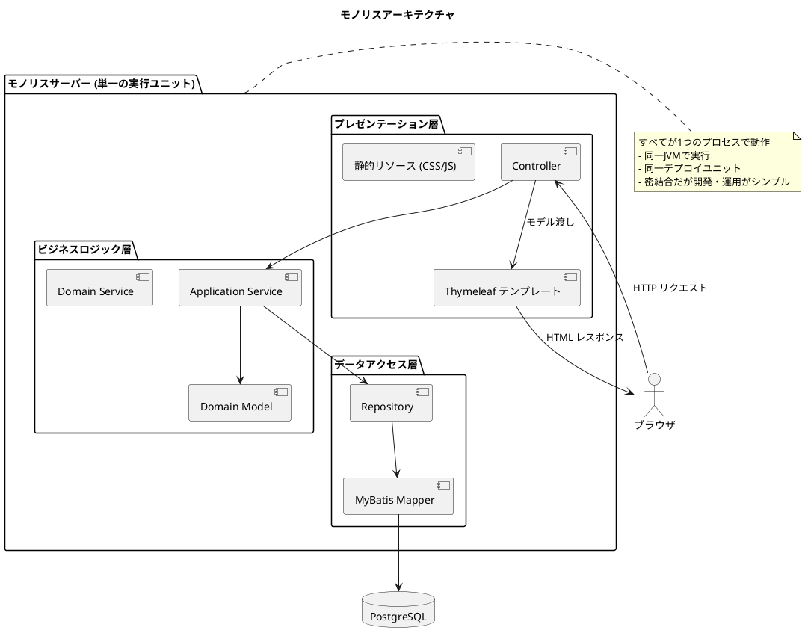
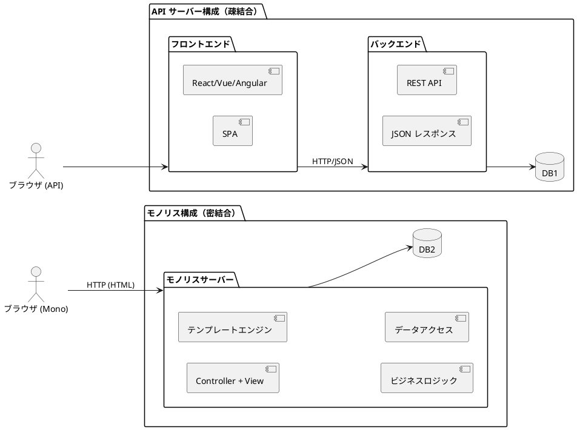
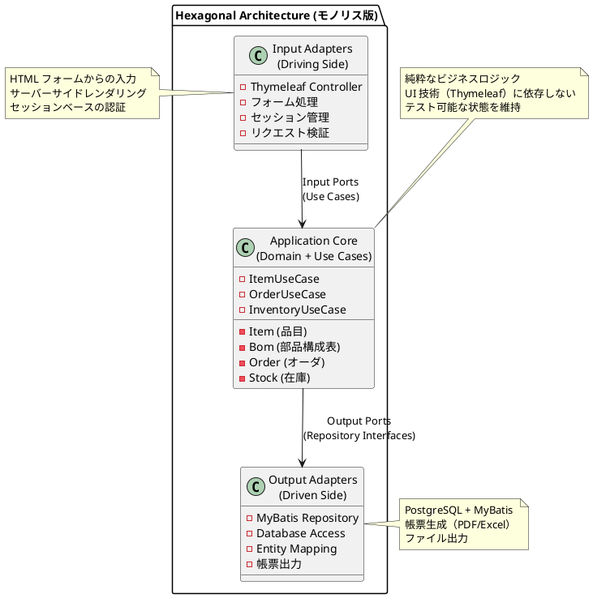
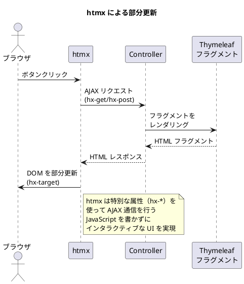
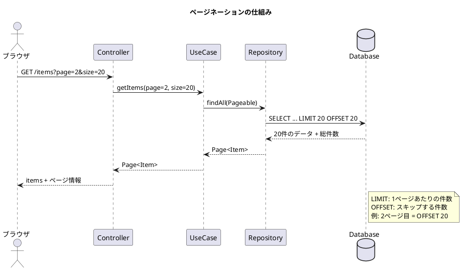

# 実践データベース設計：生産管理システム 研究 1 - モノリスサービスの実装

## はじめに

本研究では、API サーバー構成（第32章）とは異なるアプローチとして、**モノリスアーキテクチャ**による生産管理システムを実装します。UI（テンプレートエンジン）、ビジネスロジック、データベースアクセスがすべて同一サーバー内で動作する、伝統的かつ堅実なアーキテクチャです。

---

## 第33章：モノリスアーキテクチャの基礎

### 33.1 モノリスアーキテクチャとは

**モノリス（Monolith / Monolithic Architecture）**とは、「API」と「UI」と「ビジネスロジック」が **1つの実行ユニット**（1つのプロジェクトやバイナリ）にまとまっているアーキテクチャを指します。



**モノリスの主な特徴：**

| 特徴 | 説明 |
|------|------|
| **単一デプロイ** | アプリケーション全体が1つのアーティファクト（JAR/WAR）としてデプロイ |
| **同一プロセス** | UI、ビジネスロジック、データアクセスが同じ JVM で動作 |
| **テンプレートエンジン** | サーバーサイドで HTML を生成してブラウザに返却 |
| **セッション管理** | サーバーサイドでユーザーセッションを管理 |
| **トランザクション境界** | 単一プロセス内でのローカルトランザクション |

---

### 33.2 API サーバー vs モノリス



| 観点 | API サーバー構成 | モノリス構成 |
|------|-----------------|-------------|
| **結合度** | 疎結合（フロントエンドとバックエンドが分離） | 密結合（すべてが同一サーバー） |
| **フロントエンド** | SPA（React/Vue/Angular） | テンプレートエンジン（Thymeleaf） |
| **通信方式** | REST API（JSON） | サーバーサイドレンダリング（HTML） |
| **開発チーム** | フロント/バックエンドで分業可能 | フルスタックで開発 |
| **デプロイ** | 別々にデプロイ可能 | 単一アーティファクトをデプロイ |
| **スケーリング** | 個別にスケール可能 | 全体をスケール |
| **複雑さ** | API 設計・認証・CORS などが必要 | シンプル、設定が少ない |
| **初期開発速度** | 環境構築に時間がかかる | 素早く開発開始できる |
| **SEO** | SSR/SSG が必要な場合あり | サーバーサイドレンダリングで SEO フレンドリー |

#### モノリスを選択すべき場面

**モノリスが適している状況：**

1. **小〜中規模のチーム**：専門のフロントエンドチームがいない場合
2. **社内システム**：SEO 不要、限られたユーザー数
3. **業務アプリケーション**：複雑な業務フローをサーバーサイドで処理
4. **迅速な開発**：MVP やプロトタイプの素早い構築
5. **運用コスト重視**：インフラ構成をシンプルに保ちたい場合

**生産管理システムにおけるモノリスのメリット：**

```
生産管理システムの特性
├── 社内利用が中心 → SEO 不要、SPA 不要
├── 複雑な業務フロー → サーバーサイドで制御が容易
├── 帳票出力 → サーバーサイドで PDF/Excel 生成
├── 大量データ処理 → MRP などバッチ処理との親和性
└── 運用担当者のスキル → シンプルな構成が望ましい
```

---

### 33.3 モノリスにおけるヘキサゴナルアーキテクチャ

モノリスであっても、ヘキサゴナルアーキテクチャ（Ports and Adapters）を採用することで、保守性の高い設計を実現できます。



**モノリスでもヘキサゴナルアーキテクチャを適用する理由：**

1. **テスト容易性**：ドメインロジックを UI から分離してテスト可能
2. **将来の移行**：必要に応じて API 層を追加可能
3. **保守性**：関心の分離により変更影響を局所化
4. **再利用性**：ドメインロジックを複数の UI で共有可能

---

### 33.4 ディレクトリ構成

```
src/main/java/com/example/production/
├── domain/                     # ドメイン層（API版と共通）
│   ├── model/
│   │   ├── item/
│   │   ├── bom/
│   │   ├── order/
│   │   └── inventory/
│   └── exception/
│
├── application/               # アプリケーション層（API版と共通）
│   ├── port/
│   │   ├── in/               # Input Port（ユースケース）
│   │   └── out/              # Output Port（リポジトリ）
│   └── service/
│
├── infrastructure/
│   ├── persistence/          # Output Adapter（DB実装）
│   │   ├── mapper/
│   │   └── repository/
│   └── web/                  # Input Adapter（Web実装）
│       ├── controller/       # Thymeleaf Controller
│       ├── form/             # フォームオブジェクト
│       └── helper/           # ビューヘルパー
│
├── config/
│
└── resources/
    ├── templates/            # Thymeleaf テンプレート
    │   ├── layout/           # 共通レイアウト
    │   ├── items/            # 品目マスタ画面
    │   ├── bom/              # BOM 画面
    │   ├── orders/           # オーダ画面
    │   └── inventory/        # 在庫画面
    ├── static/               # 静的リソース
    │   ├── css/
    │   ├── js/
    │   └── images/
    └── messages.properties   # メッセージリソース
```

---

### 33.5 技術スタックの導入

<details>
<summary>build.gradle.kts</summary>

```kotlin
plugins {
    id("java")
    id("org.springframework.boot") version "3.2.0"
    id("io.spring.dependency-management") version "1.1.4"
}

dependencies {
    // Spring Boot Web（REST APIではなくMVCとして使用）
    implementation("org.springframework.boot:spring-boot-starter-web")
    implementation("org.springframework.boot:spring-boot-starter-validation")

    // Thymeleaf（テンプレートエンジン）
    implementation("org.springframework.boot:spring-boot-starter-thymeleaf")
    implementation("nz.net.ultraq.thymeleaf:thymeleaf-layout-dialect:3.3.0")

    // Thymeleaf + Spring Security（認証機能を使う場合）
    implementation("org.thymeleaf.extras:thymeleaf-extras-springsecurity6")

    // htmx（モダンなインタラクティブUI）
    // CDN から読み込むため依存関係は不要

    // MyBatis
    implementation("org.mybatis.spring.boot:mybatis-spring-boot-starter:3.0.3")

    // PostgreSQL
    runtimeOnly("org.postgresql:postgresql")

    // Flyway
    implementation("org.flywaydb:flyway-core")
    implementation("org.flywaydb:flyway-database-postgresql")

    // Webjars（Bootstrap等のフロントエンドライブラリ）
    implementation("org.webjars:bootstrap:5.3.2")
    implementation("org.webjars:webjars-locator-core:0.55")

    // 帳票出力
    implementation("org.apache.poi:poi-ooxml:5.2.5")  // Excel
    implementation("com.itextpdf:itext7-core:8.0.2")  // PDF

    // Test
    testImplementation("org.springframework.boot:spring-boot-starter-test")
    testImplementation("org.testcontainers:postgresql:1.19.3")
    testImplementation("org.testcontainers:junit-jupiter:1.19.3")

    // Lombok
    compileOnly("org.projectlombok:lombok")
    annotationProcessor("org.projectlombok:lombok")
}
```

</details>

**パッケージの説明：**

| パッケージ | 用途 |
|-----------|------|
| spring-boot-starter-thymeleaf | サーバーサイドテンプレートエンジン |
| thymeleaf-layout-dialect | レイアウト継承（共通ヘッダー・フッター） |
| webjars:bootstrap | CSS フレームワーク（サーバーから配信） |
| poi-ooxml | Excel ファイル出力 |
| itext7-core | PDF ファイル出力 |

---

### 33.6 基本的な Spring Boot + Thymeleaf アプリケーション

<details>
<summary>ProductionManagementApplication.java</summary>

```java
package com.example.production;

import org.springframework.boot.SpringApplication;
import org.springframework.boot.autoconfigure.SpringBootApplication;

@SpringBootApplication
public class ProductionManagementApplication {

    public static void main(String[] args) {
        SpringApplication.run(ProductionManagementApplication.class, args);
    }
}
```

</details>

<details>
<summary>application.yml</summary>

```yaml
spring:
  datasource:
    url: jdbc:postgresql://localhost:5432/production
    username: postgres
    password: postgres

  thymeleaf:
    cache: false  # 開発時はキャッシュ無効
    prefix: classpath:/templates/
    suffix: .html
    encoding: UTF-8
    mode: HTML

  messages:
    basename: messages
    encoding: UTF-8

mybatis:
  mapper-locations: classpath:mapper/*.xml
  configuration:
    map-underscore-to-camel-case: true

server:
  servlet:
    session:
      timeout: 30m  # セッションタイムアウト
```

</details>

<details>
<summary>layout/default.html（共通レイアウト）</summary>

```html
<!DOCTYPE html>
<html xmlns:th="http://www.thymeleaf.org"
      xmlns:layout="http://www.ultraq.net.nz/thymeleaf/layout"
      lang="ja">
<head>
    <meta charset="UTF-8">
    <meta name="viewport" content="width=device-width, initial-scale=1.0">
    <title layout:title-pattern="$CONTENT_TITLE - $LAYOUT_TITLE">生産管理システム</title>

    <!-- Bootstrap CSS -->
    <link rel="stylesheet" th:href="@{/webjars/bootstrap/css/bootstrap.min.css}">

    <!-- カスタム CSS -->
    <link rel="stylesheet" th:href="@{/css/style.css}">

    <!-- htmx（部分更新用） -->
    <script src="https://unpkg.com/htmx.org@1.9.10"></script>
</head>
<body>
    <!-- ナビゲーションバー -->
    <nav class="navbar navbar-expand-lg navbar-dark bg-primary">
        <div class="container-fluid">
            <a class="navbar-brand" th:href="@{/}">生産管理システム</a>
            <button class="navbar-toggler" type="button" data-bs-toggle="collapse"
                    data-bs-target="#navbarNav">
                <span class="navbar-toggler-icon"></span>
            </button>
            <div class="collapse navbar-collapse" id="navbarNav">
                <ul class="navbar-nav">
                    <li class="nav-item dropdown">
                        <a class="nav-link dropdown-toggle" href="#" role="button"
                           data-bs-toggle="dropdown">マスタ</a>
                        <ul class="dropdown-menu">
                            <li><a class="dropdown-item" th:href="@{/items}">品目マスタ</a></li>
                            <li><a class="dropdown-item" th:href="@{/bom}">部品構成表</a></li>
                            <li><a class="dropdown-item" th:href="@{/suppliers}">取引先マスタ</a></li>
                            <li><a class="dropdown-item" th:href="@{/locations}">場所マスタ</a></li>
                        </ul>
                    </li>
                    <li class="nav-item dropdown">
                        <a class="nav-link dropdown-toggle" href="#" role="button"
                           data-bs-toggle="dropdown">計画</a>
                        <ul class="dropdown-menu">
                            <li><a class="dropdown-item" th:href="@{/mps}">基準生産計画</a></li>
                            <li><a class="dropdown-item" th:href="@{/mrp}">MRP実行</a></li>
                            <li><a class="dropdown-item" th:href="@{/orders}">オーダ照会</a></li>
                        </ul>
                    </li>
                    <li class="nav-item dropdown">
                        <a class="nav-link dropdown-toggle" href="#" role="button"
                           data-bs-toggle="dropdown">購買</a>
                        <ul class="dropdown-menu">
                            <li><a class="dropdown-item" th:href="@{/purchase-orders}">発注</a></li>
                            <li><a class="dropdown-item" th:href="@{/receiving}">入荷・検収</a></li>
                        </ul>
                    </li>
                    <li class="nav-item dropdown">
                        <a class="nav-link dropdown-toggle" href="#" role="button"
                           data-bs-toggle="dropdown">製造</a>
                        <ul class="dropdown-menu">
                            <li><a class="dropdown-item" th:href="@{/work-orders}">作業指示</a></li>
                            <li><a class="dropdown-item" th:href="@{/completions}">完成実績</a></li>
                            <li><a class="dropdown-item" th:href="@{/labor-hours}">工数実績</a></li>
                        </ul>
                    </li>
                    <li class="nav-item dropdown">
                        <a class="nav-link dropdown-toggle" href="#" role="button"
                           data-bs-toggle="dropdown">在庫</a>
                        <ul class="dropdown-menu">
                            <li><a class="dropdown-item" th:href="@{/inventory}">在庫照会</a></li>
                            <li><a class="dropdown-item" th:href="@{/issues}">払出</a></li>
                            <li><a class="dropdown-item" th:href="@{/stocktaking}">棚卸</a></li>
                        </ul>
                    </li>
                </ul>
            </div>
        </div>
    </nav>

    <!-- フラッシュメッセージ -->
    <div class="container mt-3">
        <div th:if="${successMessage}" class="alert alert-success alert-dismissible fade show" role="alert">
            <span th:text="${successMessage}"></span>
            <button type="button" class="btn-close" data-bs-dismiss="alert"></button>
        </div>
        <div th:if="${errorMessage}" class="alert alert-danger alert-dismissible fade show" role="alert">
            <span th:text="${errorMessage}"></span>
            <button type="button" class="btn-close" data-bs-dismiss="alert"></button>
        </div>
    </div>

    <!-- メインコンテンツ -->
    <main class="container mt-4">
        <div layout:fragment="content">
            <!-- 各ページのコンテンツがここに挿入される -->
        </div>
    </main>

    <!-- フッター -->
    <footer class="footer mt-5 py-3 bg-light">
        <div class="container text-center">
            <span class="text-muted">生産管理システム &copy; 2025</span>
        </div>
    </footer>

    <!-- Bootstrap JS -->
    <script th:src="@{/webjars/bootstrap/js/bootstrap.bundle.min.js}"></script>

    <!-- ページ固有のスクリプト -->
    <th:block layout:fragment="scripts"></th:block>
</body>
</html>
```

</details>

<details>
<summary>HomeController.java</summary>

```java
package com.example.production.infrastructure.web.controller;

import com.example.production.application.port.in.InventoryUseCase;
import com.example.production.application.port.in.OrderUseCase;
import org.springframework.stereotype.Controller;
import org.springframework.ui.Model;
import org.springframework.web.bind.annotation.GetMapping;

import java.time.LocalDate;

/**
 * ホーム画面 Controller
 */
@Controller
public class HomeController {

    private final OrderUseCase orderUseCase;
    private final InventoryUseCase inventoryUseCase;

    public HomeController(OrderUseCase orderUseCase, InventoryUseCase inventoryUseCase) {
        this.orderUseCase = orderUseCase;
        this.inventoryUseCase = inventoryUseCase;
    }

    @GetMapping("/")
    public String home(Model model) {
        // ダッシュボード情報を取得
        model.addAttribute("today", LocalDate.now());
        model.addAttribute("pendingOrders", orderUseCase.countPendingOrders());
        model.addAttribute("shortageItems", inventoryUseCase.getShortageItems());
        model.addAttribute("todayWorkOrders", orderUseCase.getTodayWorkOrders());

        return "home";
    }
}
```

</details>

<details>
<summary>templates/home.html</summary>

```html
<!DOCTYPE html>
<html xmlns:th="http://www.thymeleaf.org"
      xmlns:layout="http://www.ultraq.net.nz/thymeleaf/layout"
      layout:decorate="~{layout/default}">
<head>
    <title>ホーム</title>
</head>
<body>
<div layout:fragment="content">
    <h1 class="mb-4">ダッシュボード</h1>

    <div class="row">
        <!-- 本日の日付 -->
        <div class="col-md-3">
            <div class="card text-white bg-primary mb-3">
                <div class="card-header">本日</div>
                <div class="card-body">
                    <h5 class="card-title" th:text="${#temporals.format(today, 'yyyy年MM月dd日')}"></h5>
                </div>
            </div>
        </div>

        <!-- 未処理オーダ数 -->
        <div class="col-md-3">
            <div class="card text-white bg-warning mb-3">
                <div class="card-header">未処理オーダ</div>
                <div class="card-body">
                    <h5 class="card-title">
                        <span th:text="${pendingOrders}">0</span> 件
                    </h5>
                    <a th:href="@{/orders}" class="btn btn-sm btn-light">詳細を見る</a>
                </div>
            </div>
        </div>

        <!-- 在庫不足品目 -->
        <div class="col-md-3">
            <div class="card text-white bg-danger mb-3">
                <div class="card-header">在庫不足</div>
                <div class="card-body">
                    <h5 class="card-title">
                        <span th:text="${#lists.size(shortageItems)}">0</span> 品目
                    </h5>
                    <a th:href="@{/inventory/shortage}" class="btn btn-sm btn-light">詳細を見る</a>
                </div>
            </div>
        </div>

        <!-- 本日の作業指示 -->
        <div class="col-md-3">
            <div class="card text-white bg-success mb-3">
                <div class="card-header">本日の作業指示</div>
                <div class="card-body">
                    <h5 class="card-title">
                        <span th:text="${#lists.size(todayWorkOrders)}">0</span> 件
                    </h5>
                    <a th:href="@{/work-orders}" class="btn btn-sm btn-light">詳細を見る</a>
                </div>
            </div>
        </div>
    </div>

    <!-- 在庫不足品目一覧 -->
    <div class="card mt-4" th:if="${not #lists.isEmpty(shortageItems)}">
        <div class="card-header bg-danger text-white">
            在庫不足品目
        </div>
        <div class="card-body">
            <table class="table table-striped">
                <thead>
                    <tr>
                        <th>品目コード</th>
                        <th>品名</th>
                        <th>現在庫</th>
                        <th>安全在庫</th>
                        <th>不足数</th>
                    </tr>
                </thead>
                <tbody>
                    <tr th:each="item : ${shortageItems}">
                        <td>
                            <a th:href="@{/items/{code}(code=${item.itemCode})}"
                               th:text="${item.itemCode}"></a>
                        </td>
                        <td th:text="${item.itemName}"></td>
                        <td th:text="${item.currentStock}"></td>
                        <td th:text="${item.safetyStock}"></td>
                        <td class="text-danger"
                            th:text="${item.safetyStock - item.currentStock}"></td>
                    </tr>
                </tbody>
            </table>
        </div>
    </div>

    <!-- クイックアクセス -->
    <div class="card mt-4">
        <div class="card-header">クイックアクセス</div>
        <div class="card-body">
            <div class="row">
                <div class="col-md-3 mb-2">
                    <a th:href="@{/items/new}" class="btn btn-outline-primary w-100">
                        品目登録
                    </a>
                </div>
                <div class="col-md-3 mb-2">
                    <a th:href="@{/purchase-orders/new}" class="btn btn-outline-primary w-100">
                        発注登録
                    </a>
                </div>
                <div class="col-md-3 mb-2">
                    <a th:href="@{/work-orders/new}" class="btn btn-outline-primary w-100">
                        作業指示登録
                    </a>
                </div>
                <div class="col-md-3 mb-2">
                    <a th:href="@{/mrp/execute}" class="btn btn-outline-success w-100">
                        MRP 実行
                    </a>
                </div>
            </div>
        </div>
    </div>
</div>
</body>
</html>
```

</details>

---

### 33.7 htmx による部分更新

モノリスアプリケーションでも、**htmx** を使用することで SPA のような操作性を実現できます。ページ全体をリロードせず、必要な部分だけを更新します。



<details>
<summary>htmx による品目検索（部分更新）</summary>

```html
<!-- 品目検索（部分更新） -->
<div class="mb-3">
    <input type="text"
           class="form-control"
           name="keyword"
           placeholder="品目コードまたは品名で検索"
           hx-get="/items/search"
           hx-trigger="keyup changed delay:300ms"
           hx-target="#search-results"
           hx-indicator="#loading">
    <span id="loading" class="htmx-indicator">検索中...</span>
</div>

<!-- 検索結果がここに挿入される -->
<div id="search-results">
    <!-- Controller から返される HTML フラグメント -->
</div>
```

</details>

<details>
<summary>検索エンドポイント（htmx 用 Controller）</summary>

```java
@Controller
@RequestMapping("/items")
public class ItemController {

    private final ItemUseCase itemUseCase;

    // ... コンストラクタ省略

    /**
     * htmx 用の検索エンドポイント（フラグメントを返す）
     */
    @GetMapping("/search")
    public String search(
            @RequestParam(required = false) String keyword,
            Model model) {

        List<Item> items = itemUseCase.searchItems(keyword);
        model.addAttribute("items", items);

        // フラグメントのみを返す
        return "items/search-results :: results";
    }
}
```

</details>

<details>
<summary>items/search-results.html（検索結果フラグメント）</summary>

```html
<!DOCTYPE html>
<html xmlns:th="http://www.thymeleaf.org">
<!-- フラグメント定義 -->
<div th:fragment="results">
    <table class="table table-striped" th:if="${not #lists.isEmpty(items)}">
        <thead>
            <tr>
                <th>品目コード</th>
                <th>品名</th>
                <th>品目区分</th>
                <th>操作</th>
            </tr>
        </thead>
        <tbody>
            <tr th:each="item : ${items}">
                <td th:text="${item.itemCode}"></td>
                <td th:text="${item.itemName}"></td>
                <td th:text="${item.category.displayName}"></td>
                <td>
                    <a th:href="@{/items/{code}(code=${item.itemCode})}"
                       class="btn btn-sm btn-primary">詳細</a>
                    <button class="btn btn-sm btn-danger"
                            hx-delete="/items/{code}"
                            th:attr="hx-delete=@{/items/{code}(code=${item.itemCode})}"
                            hx-confirm="本当に削除しますか？"
                            hx-target="closest tr"
                            hx-swap="outerHTML">削除</button>
                </td>
            </tr>
        </tbody>
    </table>
    <div th:if="${#lists.isEmpty(items)}" class="alert alert-info">
        該当する品目が見つかりませんでした。
    </div>
</div>
</html>
```

</details>

---

### 33.8 API サーバー版との Controller の違い

#### API サーバー版（REST Controller）

<details>
<summary>ItemApiController.java（API サーバー版）</summary>

```java
@RestController  // JSON を返す
@RequestMapping("/api/items")
public class ItemApiController {

    @GetMapping
    public ResponseEntity<List<ItemResponse>> getAllItems() {
        List<Item> items = itemUseCase.getAllItems();
        return ResponseEntity.ok(items.stream()
            .map(ItemResponse::from)
            .toList());
    }

    @PostMapping
    public ResponseEntity<ItemResponse> createItem(
            @Valid @RequestBody CreateItemRequest request) {  // JSON リクエスト
        Item item = itemUseCase.createItem(request.toCommand());
        return ResponseEntity.status(HttpStatus.CREATED)
            .body(ItemResponse.from(item));
    }
}
```

</details>

#### モノリス版（MVC Controller）

<details>
<summary>ItemController.java（モノリス版）</summary>

```java
@Controller  // HTML を返す
@RequestMapping("/items")
public class ItemController {

    @GetMapping
    public String list(Model model) {
        List<Item> items = itemUseCase.getAllItems();
        model.addAttribute("items", items);
        return "items/list";  // Thymeleaf テンプレート
    }

    @PostMapping
    public String create(
            @Valid @ModelAttribute("form") ItemForm form,  // フォームデータ
            BindingResult bindingResult,
            RedirectAttributes redirectAttributes) {

        if (bindingResult.hasErrors()) {
            return "items/new";  // バリデーションエラー時は入力画面に戻る
        }

        itemUseCase.createItem(form.toCommand());
        redirectAttributes.addFlashAttribute("successMessage", "品目を登録しました");
        return "redirect:/items";  // PRG パターン
    }
}
```

</details>

**主な違い：**

| 観点 | API サーバー版 | モノリス版 |
|------|--------------|-----------|
| アノテーション | `@RestController` | `@Controller` |
| 戻り値 | `ResponseEntity<T>` | テンプレート名（String） |
| リクエスト | `@RequestBody`（JSON） | `@ModelAttribute`（フォーム） |
| バリデーション | 例外ハンドラで処理 | `BindingResult` で処理 |
| レスポンス | JSON | HTML（Thymeleaf） |
| リダイレクト | 不要 | PRG パターン |

---

## 第34章：マスタの実装

### 34.1 品目マスタ画面の設計

| 画面 | URL | メソッド | 説明 |
|------|-----|---------|------|
| 品目一覧 | /items | GET | 品目の検索・一覧表示 |
| 品目詳細 | /items/{itemCode} | GET | 品目の詳細表示 |
| 品目登録 | /items/new | GET | 登録フォーム表示 |
| 品目登録処理 | /items | POST | 登録処理 |
| 品目編集 | /items/{itemCode}/edit | GET | 編集フォーム表示 |
| 品目更新処理 | /items/{itemCode} | POST | 更新処理（PUT 代替） |
| 品目削除処理 | /items/{itemCode}/delete | POST | 削除処理（DELETE 代替） |

**注意**: HTML フォームは GET/POST のみ対応のため、PUT/DELETE は POST で代替します。

---

### 34.2 フォームオブジェクトの設計

<details>
<summary>ItemForm.java</summary>

```java
package com.example.production.infrastructure.web.form;

import com.example.production.application.port.in.CreateItemCommand;
import com.example.production.domain.model.item.ItemCategory;
import jakarta.validation.constraints.NotBlank;
import jakarta.validation.constraints.NotNull;
import jakarta.validation.constraints.Positive;
import jakarta.validation.constraints.Size;
import lombok.Data;

/**
 * 品目登録・編集フォーム
 */
@Data
public class ItemForm {

    @NotBlank(message = "品目コードは必須です")
    @Size(max = 20, message = "品目コードは20文字以内で入力してください")
    private String itemCode;

    @NotBlank(message = "品名は必須です")
    @Size(max = 100, message = "品名は100文字以内で入力してください")
    private String itemName;

    @NotNull(message = "品目区分は必須です")
    private ItemCategory category;

    private String itemGroupCode;

    private String unitCode;

    private String locationCode;

    @Positive(message = "リードタイムは正の整数で入力してください")
    private Integer leadTime;

    @Positive(message = "安全在庫は正の整数で入力してください")
    private Integer safetyStock;

    /**
     * フォームをコマンドに変換
     */
    public CreateItemCommand toCommand() {
        return CreateItemCommand.builder()
            .itemCode(this.itemCode)
            .itemName(this.itemName)
            .category(this.category)
            .itemGroupCode(this.itemGroupCode)
            .unitCode(this.unitCode)
            .locationCode(this.locationCode)
            .leadTime(this.leadTime)
            .safetyStock(this.safetyStock)
            .build();
    }

    /**
     * エンティティからフォームを生成
     */
    public static ItemForm from(Item item) {
        ItemForm form = new ItemForm();
        form.setItemCode(item.getItemCode());
        form.setItemName(item.getItemName());
        form.setCategory(item.getCategory());
        form.setItemGroupCode(item.getItemGroupCode());
        form.setUnitCode(item.getUnitCode());
        form.setLocationCode(item.getLocationCode());
        form.setLeadTime(item.getLeadTime());
        form.setSafetyStock(item.getSafetyStock());
        return form;
    }
}
```

</details>

---

### 34.3 品目 Controller の TDD 実装

<details>
<summary>ItemControllerTest.java</summary>

```java
package com.example.production.infrastructure.web.controller;

import com.example.production.domain.model.item.Item;
import com.example.production.domain.model.item.ItemCategory;
import com.example.production.infrastructure.persistence.mapper.ItemMapper;
import org.junit.jupiter.api.*;
import org.springframework.beans.factory.annotation.Autowired;
import org.springframework.boot.test.autoconfigure.web.servlet.AutoConfigureMockMvc;
import org.springframework.boot.test.context.SpringBootTest;
import org.springframework.test.context.DynamicPropertyRegistry;
import org.springframework.test.context.DynamicPropertySource;
import org.springframework.test.web.servlet.MockMvc;
import org.testcontainers.containers.PostgreSQLContainer;
import org.testcontainers.junit.jupiter.Container;
import org.testcontainers.junit.jupiter.Testcontainers;

import java.time.LocalDate;

import static org.hamcrest.Matchers.*;
import static org.springframework.test.web.servlet.request.MockMvcRequestBuilders.*;
import static org.springframework.test.web.servlet.result.MockMvcResultMatchers.*;

@SpringBootTest
@AutoConfigureMockMvc
@Testcontainers
@DisplayName("品目マスタ画面")
class ItemControllerTest {

    @Container
    static PostgreSQLContainer<?> postgres = new PostgreSQLContainer<>("postgres:15")
            .withDatabaseName("production_test")
            .withUsername("test")
            .withPassword("test");

    @DynamicPropertySource
    static void configureProperties(DynamicPropertyRegistry registry) {
        registry.add("spring.datasource.url", postgres::getJdbcUrl);
        registry.add("spring.datasource.username", postgres::getUsername);
        registry.add("spring.datasource.password", postgres::getPassword);
    }

    @Autowired
    private MockMvc mockMvc;

    @Autowired
    private ItemMapper itemMapper;

    @BeforeEach
    void setUp() {
        itemMapper.deleteAll();
    }

    @Nested
    @DisplayName("GET /items - 品目一覧")
    class ItemList {

        @Test
        @DisplayName("品目一覧画面を表示できる")
        void shouldDisplayItemList() throws Exception {
            // Arrange
            insertTestItem("PROD-001", "テスト製品", ItemCategory.PRODUCT);

            // Act & Assert
            mockMvc.perform(get("/items"))
                .andExpect(status().isOk())
                .andExpect(view().name("items/list"))
                .andExpect(model().attributeExists("items"))
                .andExpect(content().string(containsString("PROD-001")))
                .andExpect(content().string(containsString("テスト製品")));
        }

        @Test
        @DisplayName("品目区分でフィルタリングできる")
        void shouldFilterByCategory() throws Exception {
            // Arrange
            insertTestItem("PROD-001", "製品A", ItemCategory.PRODUCT);
            insertTestItem("PART-001", "部品A", ItemCategory.PART);

            // Act & Assert
            mockMvc.perform(get("/items").param("category", "PRODUCT"))
                .andExpect(status().isOk())
                .andExpect(model().attribute("items", hasSize(1)))
                .andExpect(content().string(containsString("製品A")))
                .andExpect(content().string(not(containsString("部品A"))));
        }
    }

    @Nested
    @DisplayName("POST /items - 品目登録処理")
    class CreateItem {

        @Test
        @DisplayName("品目を登録できる")
        void shouldCreateItem() throws Exception {
            mockMvc.perform(post("/items")
                    .param("itemCode", "NEW-001")
                    .param("itemName", "新規品目")
                    .param("category", "PRODUCT"))
                .andExpect(status().is3xxRedirection())
                .andExpect(redirectedUrl("/items"))
                .andExpect(flash().attribute("successMessage", containsString("登録")));

            // データベースに保存されていることを確認
            var saved = itemMapper.findByCode("NEW-001");
            Assertions.assertNotNull(saved);
            Assertions.assertEquals("新規品目", saved.getItemName());
        }

        @Test
        @DisplayName("バリデーションエラー時は入力画面に戻る")
        void shouldReturnFormOnValidationError() throws Exception {
            mockMvc.perform(post("/items")
                    .param("itemCode", "")  // 必須項目が空
                    .param("itemName", "")
                    .param("category", "PRODUCT"))
                .andExpect(status().isOk())
                .andExpect(view().name("items/new"))
                .andExpect(model().attributeHasFieldErrors("form", "itemCode", "itemName"));
        }
    }

    private void insertTestItem(String code, String name, ItemCategory category) {
        itemMapper.insert(Item.builder()
            .itemCode(code)
            .effectiveDate(LocalDate.of(2025, 1, 1))
            .itemName(name)
            .category(category)
            .build());
    }
}
```

</details>

<details>
<summary>ItemController.java</summary>

```java
package com.example.production.infrastructure.web.controller;

import com.example.production.application.port.in.*;
import com.example.production.domain.exception.DuplicateItemException;
import com.example.production.domain.exception.ItemNotFoundException;
import com.example.production.domain.model.item.Item;
import com.example.production.domain.model.item.ItemCategory;
import com.example.production.infrastructure.web.form.ItemForm;
import jakarta.validation.Valid;
import org.springframework.stereotype.Controller;
import org.springframework.ui.Model;
import org.springframework.validation.BindingResult;
import org.springframework.web.bind.annotation.*;
import org.springframework.web.servlet.mvc.support.RedirectAttributes;

import java.util.List;

/**
 * 品目マスタ Controller（モノリス版）
 */
@Controller
@RequestMapping("/items")
public class ItemController {

    private final ItemUseCase itemUseCase;

    public ItemController(ItemUseCase itemUseCase) {
        this.itemUseCase = itemUseCase;
    }

    /**
     * 品目一覧画面
     */
    @GetMapping
    public String list(
            @RequestParam(required = false) ItemCategory category,
            @RequestParam(required = false) String keyword,
            Model model) {

        List<Item> items;
        if (category != null) {
            items = itemUseCase.getItemsByCategory(category);
        } else if (keyword != null && !keyword.isBlank()) {
            items = itemUseCase.searchItems(keyword);
        } else {
            items = itemUseCase.getAllItems();
        }

        model.addAttribute("items", items);
        model.addAttribute("categories", ItemCategory.values());
        model.addAttribute("selectedCategory", category);
        model.addAttribute("keyword", keyword);

        return "items/list";
    }

    /**
     * 品目詳細画面
     */
    @GetMapping("/{itemCode}")
    public String detail(@PathVariable String itemCode, Model model) {
        Item item = itemUseCase.getItemByCode(itemCode);
        model.addAttribute("item", item);
        return "items/detail";
    }

    /**
     * 品目登録画面
     */
    @GetMapping("/new")
    public String newForm(Model model) {
        model.addAttribute("form", new ItemForm());
        model.addAttribute("categories", ItemCategory.values());
        return "items/new";
    }

    /**
     * 品目登録処理
     */
    @PostMapping
    public String create(
            @Valid @ModelAttribute("form") ItemForm form,
            BindingResult bindingResult,
            Model model,
            RedirectAttributes redirectAttributes) {

        if (bindingResult.hasErrors()) {
            model.addAttribute("categories", ItemCategory.values());
            return "items/new";
        }

        try {
            itemUseCase.createItem(form.toCommand());
            redirectAttributes.addFlashAttribute("successMessage",
                "品目「" + form.getItemCode() + "」を登録しました");
            return "redirect:/items";
        } catch (DuplicateItemException e) {
            model.addAttribute("errorMessage",
                "品目コード「" + form.getItemCode() + "」は既に存在します");
            model.addAttribute("categories", ItemCategory.values());
            return "items/new";
        }
    }

    /**
     * 品目削除処理
     */
    @PostMapping("/{itemCode}/delete")
    public String delete(
            @PathVariable String itemCode,
            RedirectAttributes redirectAttributes) {

        itemUseCase.deleteItem(itemCode);
        redirectAttributes.addFlashAttribute("successMessage",
            "品目「" + itemCode + "」を削除しました");
        return "redirect:/items";
    }

    /**
     * 例外ハンドリング（品目が見つからない場合）
     */
    @ExceptionHandler(ItemNotFoundException.class)
    @ResponseStatus(org.springframework.http.HttpStatus.NOT_FOUND)
    public String handleItemNotFound(ItemNotFoundException e, Model model) {
        model.addAttribute("errorMessage", e.getMessage());
        return "error/404";
    }
}
```

</details>

---

### 34.4 品目一覧テンプレート

<details>
<summary>items/list.html</summary>

```html
<!DOCTYPE html>
<html xmlns:th="http://www.thymeleaf.org"
      xmlns:layout="http://www.ultraq.net.nz/thymeleaf/layout"
      layout:decorate="~{layout/default}">
<head>
    <title>品目マスタ</title>
</head>
<body>
<div layout:fragment="content">
    <div class="d-flex justify-content-between align-items-center mb-4">
        <h1>品目マスタ</h1>
        <a th:href="@{/items/new}" class="btn btn-primary">
            新規登録
        </a>
    </div>

    <!-- 検索フォーム -->
    <div class="card mb-4">
        <div class="card-body">
            <form th:action="@{/items}" method="get" class="row g-3">
                <div class="col-md-4">
                    <label class="form-label">キーワード検索</label>
                    <input type="text" class="form-control" name="keyword"
                           th:value="${keyword}" placeholder="品目コードまたは品名">
                </div>
                <div class="col-md-3">
                    <label class="form-label">品目区分</label>
                    <select class="form-select" name="category">
                        <option value="">すべて</option>
                        <option th:each="cat : ${categories}"
                                th:value="${cat}"
                                th:text="${cat.displayName}"
                                th:selected="${cat == selectedCategory}"></option>
                    </select>
                </div>
                <div class="col-md-2 d-flex align-items-end">
                    <button type="submit" class="btn btn-secondary">検索</button>
                </div>
            </form>
        </div>
    </div>

    <!-- 品目一覧テーブル -->
    <div class="card">
        <div class="card-body">
            <table class="table table-striped table-hover" th:if="${not #lists.isEmpty(items)}">
                <thead>
                    <tr>
                        <th>品目コード</th>
                        <th>品名</th>
                        <th>品目区分</th>
                        <th>リードタイム</th>
                        <th>安全在庫</th>
                        <th>操作</th>
                    </tr>
                </thead>
                <tbody>
                    <tr th:each="item : ${items}">
                        <td>
                            <a th:href="@{/items/{code}(code=${item.itemCode})}"
                               th:text="${item.itemCode}"></a>
                        </td>
                        <td th:text="${item.itemName}"></td>
                        <td>
                            <span class="badge"
                                  th:classappend="${item.category.name() == 'PRODUCT'} ? 'bg-primary' :
                                                  (${item.category.name() == 'PART'} ? 'bg-success' : 'bg-secondary')"
                                  th:text="${item.category.displayName}"></span>
                        </td>
                        <td th:text="${item.leadTime} + ' 日'" th:if="${item.leadTime}"></td>
                        <td th:unless="${item.leadTime}">-</td>
                        <td th:text="${item.safetyStock}" th:if="${item.safetyStock}"></td>
                        <td th:unless="${item.safetyStock}">-</td>
                        <td>
                            <a th:href="@{/items/{code}/edit(code=${item.itemCode})}"
                               class="btn btn-sm btn-outline-primary">編集</a>
                            <form th:action="@{/items/{code}/delete(code=${item.itemCode})}"
                                  method="post" class="d-inline"
                                  onsubmit="return confirm('本当に削除しますか？');">
                                <button type="submit" class="btn btn-sm btn-outline-danger">削除</button>
                            </form>
                        </td>
                    </tr>
                </tbody>
            </table>
            <div th:if="${#lists.isEmpty(items)}" class="alert alert-info">
                該当する品目がありません。
            </div>
        </div>
    </div>

    <!-- 件数表示 -->
    <div class="mt-3 text-muted">
        全 <span th:text="${#lists.size(items)}">0</span> 件
    </div>
</div>
</body>
</html>
```

</details>

---

### 34.5 BOM マスタ画面の実装

<details>
<summary>BomController.java</summary>

```java
@Controller
@RequestMapping("/bom")
public class BomController {

    private final BomService bomService;
    private final ItemUseCase itemUseCase;

    public BomController(BomService bomService, ItemUseCase itemUseCase) {
        this.bomService = bomService;
        this.itemUseCase = itemUseCase;
    }

    /**
     * BOM 一覧画面（製品の一覧）
     */
    @GetMapping
    public String list(Model model) {
        List<Item> products = itemUseCase.getItemsByCategory(ItemCategory.PRODUCT);
        model.addAttribute("products", products);
        return "bom/list";
    }

    /**
     * BOM 構成表示（ツリー展開）
     */
    @GetMapping("/{itemCode}/explode")
    public String explode(@PathVariable String itemCode, Model model) {
        BomNode tree = bomService.explodeBom(itemCode);
        Item item = itemUseCase.getItemByCode(itemCode);

        model.addAttribute("item", item);
        model.addAttribute("bomTree", tree);
        return "bom/explode";
    }

    /**
     * 逆展開（使用先照会）
     */
    @GetMapping("/{itemCode}/where-used")
    public String whereUsed(@PathVariable String itemCode, Model model) {
        List<WhereUsedResult> parents = bomService.whereUsed(itemCode);
        Item item = itemUseCase.getItemByCode(itemCode);

        model.addAttribute("item", item);
        model.addAttribute("parents", parents);
        return "bom/where-used";
    }
}
```

</details>

<details>
<summary>bom/explode.html（BOM 展開テンプレート）</summary>

```html
<!DOCTYPE html>
<html xmlns:th="http://www.thymeleaf.org"
      xmlns:layout="http://www.ultraq.net.nz/thymeleaf/layout"
      layout:decorate="~{layout/default}">
<head>
    <title>BOM 展開</title>
    <style>
        .bom-tree { list-style-type: none; padding-left: 0; }
        .bom-tree ul { list-style-type: none; padding-left: 20px; }
        .bom-item { padding: 5px; border-left: 2px solid #dee2e6; margin-bottom: 2px; }
        .bom-item:hover { background-color: #f8f9fa; }
        .level-0 { border-left-color: #0d6efd; }
        .level-1 { border-left-color: #198754; }
        .level-2 { border-left-color: #ffc107; }
        .level-3 { border-left-color: #dc3545; }
    </style>
</head>
<body>
<div layout:fragment="content">
    <h1 class="mb-4">BOM 展開</h1>

    <div class="card mb-4">
        <div class="card-header">
            <strong th:text="${item.itemCode}"></strong> -
            <span th:text="${item.itemName}"></span>
        </div>
        <div class="card-body">
            <!-- 再帰的なツリー表示 -->
            <ul class="bom-tree">
                <th:block th:replace="~{bom/fragments :: bomNode(${bomTree})}"></th:block>
            </ul>
        </div>
    </div>

    <a th:href="@{/bom}" class="btn btn-secondary">戻る</a>
</div>
</body>
</html>
```

</details>

---

## 第35章：トランザクションの実装

### 35.1 発注業務画面の実装

<details>
<summary>PurchaseOrderController.java</summary>

```java
@Controller
@RequestMapping("/purchase-orders")
public class PurchaseOrderController {

    private final PurchaseOrderUseCase purchaseOrderUseCase;
    private final ItemUseCase itemUseCase;
    private final SupplierUseCase supplierUseCase;

    // ... コンストラクタ省略

    /**
     * 発注一覧画面
     */
    @GetMapping
    public String list(
            @RequestParam(required = false) String status,
            @RequestParam(required = false) String supplierCode,
            Model model) {

        List<PurchaseOrder> orders = purchaseOrderUseCase.getOrders(status, supplierCode);
        model.addAttribute("orders", orders);
        model.addAttribute("suppliers", supplierUseCase.getAllSuppliers());
        return "purchase-orders/list";
    }

    /**
     * 発注登録画面
     */
    @GetMapping("/new")
    public String newForm(Model model) {
        model.addAttribute("form", new PurchaseOrderForm());
        model.addAttribute("suppliers", supplierUseCase.getAllSuppliers());
        model.addAttribute("items", itemUseCase.getItemsByCategory(ItemCategory.MATERIAL));
        return "purchase-orders/new";
    }

    /**
     * 発注登録処理
     */
    @PostMapping
    public String create(
            @Valid @ModelAttribute("form") PurchaseOrderForm form,
            BindingResult bindingResult,
            Model model,
            RedirectAttributes redirectAttributes) {

        if (bindingResult.hasErrors()) {
            model.addAttribute("suppliers", supplierUseCase.getAllSuppliers());
            model.addAttribute("items", itemUseCase.getItemsByCategory(ItemCategory.MATERIAL));
            return "purchase-orders/new";
        }

        PurchaseOrder order = purchaseOrderUseCase.createOrder(form.toCommand());
        redirectAttributes.addFlashAttribute("successMessage",
            "発注「" + order.getOrderNumber() + "」を登録しました");
        return "redirect:/purchase-orders";
    }

    /**
     * 発注確定処理
     */
    @PostMapping("/{orderNumber}/confirm")
    public String confirm(
            @PathVariable String orderNumber,
            RedirectAttributes redirectAttributes) {

        purchaseOrderUseCase.confirmOrder(orderNumber);
        redirectAttributes.addFlashAttribute("successMessage",
            "発注「" + orderNumber + "」を確定しました");
        return "redirect:/purchase-orders/" + orderNumber;
    }
}
```

</details>

---

### 35.2 MRP 実行画面の実装

<details>
<summary>MrpController.java</summary>

```java
@Controller
@RequestMapping("/mrp")
public class MrpController {

    private final MrpService mrpService;

    public MrpController(MrpService mrpService) {
        this.mrpService = mrpService;
    }

    /**
     * MRP 実行画面
     */
    @GetMapping
    public String index(Model model) {
        model.addAttribute("form", new MrpExecuteForm());
        return "mrp/index";
    }

    /**
     * MRP 実行処理
     */
    @PostMapping("/execute")
    public String execute(
            @Valid @ModelAttribute("form") MrpExecuteForm form,
            BindingResult bindingResult,
            Model model,
            RedirectAttributes redirectAttributes) {

        if (bindingResult.hasErrors()) {
            return "mrp/index";
        }

        MrpResult result = mrpService.execute(form.getStartDate(), form.getEndDate());

        // 結果をセッションに保存（大量データのため）
        model.addAttribute("result", result);
        return "mrp/result";
    }

    /**
     * MRP 結果の帳票出力（Excel）
     */
    @GetMapping("/export")
    public ResponseEntity<Resource> exportExcel(HttpSession session) {
        MrpResult result = (MrpResult) session.getAttribute("mrpResult");
        if (result == null) {
            throw new IllegalStateException("MRP 結果が見つかりません");
        }

        ByteArrayResource resource = mrpService.exportToExcel(result);

        return ResponseEntity.ok()
            .header(HttpHeaders.CONTENT_DISPOSITION,
                "attachment; filename=mrp-result.xlsx")
            .contentType(MediaType.parseMediaType(
                "application/vnd.openxmlformats-officedocument.spreadsheetml.sheet"))
            .body(resource);
    }
}
```

</details>

---

## 第36章：エラーハンドリングと帳票出力

### 36.1 グローバル例外ハンドラ

<details>
<summary>GlobalExceptionHandler.java</summary>

```java
package com.example.production.infrastructure.web.exception;

import com.example.production.domain.exception.*;
import org.springframework.ui.Model;
import org.springframework.web.bind.annotation.ControllerAdvice;
import org.springframework.web.bind.annotation.ExceptionHandler;
import org.springframework.web.servlet.mvc.support.RedirectAttributes;

/**
 * グローバル例外ハンドラ（モノリス版）
 */
@ControllerAdvice
public class GlobalExceptionHandler {

    /**
     * 品目が見つからない
     */
    @ExceptionHandler(ItemNotFoundException.class)
    public String handleItemNotFound(ItemNotFoundException e, Model model) {
        model.addAttribute("errorTitle", "品目が見つかりません");
        model.addAttribute("errorMessage", e.getMessage());
        return "error/404";
    }

    /**
     * 重複エラー
     */
    @ExceptionHandler(DuplicateItemException.class)
    public String handleDuplicate(DuplicateItemException e, RedirectAttributes redirectAttributes) {
        redirectAttributes.addFlashAttribute("errorMessage", e.getMessage());
        return "redirect:/items/new";
    }

    /**
     * 在庫不足
     */
    @ExceptionHandler(InsufficientInventoryException.class)
    public String handleInsufficientInventory(InsufficientInventoryException e, Model model) {
        model.addAttribute("errorTitle", "在庫不足");
        model.addAttribute("errorMessage", e.getMessage());
        return "error/business-error";
    }

    /**
     * その他の例外
     */
    @ExceptionHandler(Exception.class)
    public String handleGenericException(Exception e, Model model) {
        model.addAttribute("errorTitle", "システムエラー");
        model.addAttribute("errorMessage", "予期しないエラーが発生しました。管理者に連絡してください。");
        model.addAttribute("errorDetail", e.getMessage());
        return "error/500";
    }
}
```

</details>

---

### 36.2 帳票出力（Excel）

<details>
<summary>ReportService.java</summary>

```java
@Service
public class ReportService {

    /**
     * 在庫一覧を Excel 出力
     */
    public ByteArrayResource exportInventoryToExcel(List<Stock> stocks) {
        try (Workbook workbook = new XSSFWorkbook()) {
            Sheet sheet = workbook.createSheet("在庫一覧");

            // ヘッダー行
            Row headerRow = sheet.createRow(0);
            String[] headers = {"場所コード", "品目コード", "品名", "在庫数量", "在庫状態"};
            for (int i = 0; i < headers.length; i++) {
                Cell cell = headerRow.createCell(i);
                cell.setCellValue(headers[i]);
            }

            // データ行
            int rowNum = 1;
            for (Stock stock : stocks) {
                Row row = sheet.createRow(rowNum++);
                row.createCell(0).setCellValue(stock.getLocationCode());
                row.createCell(1).setCellValue(stock.getItemCode());
                row.createCell(2).setCellValue(stock.getItemName());
                row.createCell(3).setCellValue(stock.getQuantity().doubleValue());
                row.createCell(4).setCellValue(stock.getStatus().getDisplayName());
            }

            // 列幅自動調整
            for (int i = 0; i < headers.length; i++) {
                sheet.autoSizeColumn(i);
            }

            ByteArrayOutputStream out = new ByteArrayOutputStream();
            workbook.write(out);
            return new ByteArrayResource(out.toByteArray());

        } catch (IOException e) {
            throw new RuntimeException("Excel 出力に失敗しました", e);
        }
    }
}
```

</details>

<details>
<summary>ReportController.java</summary>

```java
@Controller
@RequestMapping("/reports")
public class ReportController {

    private final ReportService reportService;
    private final InventoryUseCase inventoryUseCase;

    // ... コンストラクタ省略

    @GetMapping("/inventory/excel")
    public ResponseEntity<Resource> exportInventoryExcel(
            @RequestParam(required = false) String locationCode) {

        List<Stock> stocks = inventoryUseCase.getInventory(
            InventoryQuery.builder().locationCode(locationCode).build());

        ByteArrayResource resource = reportService.exportInventoryToExcel(stocks);

        String filename = "inventory-" + LocalDate.now() + ".xlsx";

        return ResponseEntity.ok()
            .header(HttpHeaders.CONTENT_DISPOSITION,
                "attachment; filename=" + filename)
            .contentType(MediaType.parseMediaType(
                "application/vnd.openxmlformats-officedocument.spreadsheetml.sheet"))
            .body(resource);
    }
}
```

</details>

---

## 第37章：ページネーション

### 37.1 ページネーションの概要

大量のデータを扱う一覧画面では、すべてのデータを一度に表示すると、パフォーマンスの低下やユーザビリティの問題が発生します。ページネーション（ページ分割）を実装することで、これらの問題を解決します。



### 37.2 ページネーション用のドメインオブジェクト

<details>
<summary>PageResult.java（ページ結果）</summary>

```java
package com.example.pms.domain.model.common;

import java.util.List;

/**
 * ページネーション結果を保持するクラス.
 *
 * @param <T> コンテンツの型
 */
public class PageResult<T> {

    private final List<T> content;
    private final int page;
    private final int size;
    private final long totalElements;
    private final int totalPages;

    public PageResult(List<T> content, int page, int size, long totalElements) {
        this.content = content;
        this.page = page;
        this.size = size;
        this.totalElements = totalElements;
        this.totalPages = size > 0 ? (int) Math.ceil((double) totalElements / size) : 0;
    }

    public List<T> getContent() {
        return content;
    }

    public int getPage() {
        return page;
    }

    public int getSize() {
        return size;
    }

    public long getTotalElements() {
        return totalElements;
    }

    public int getTotalPages() {
        return totalPages;
    }

    public boolean hasNext() {
        return page < totalPages - 1;
    }

    public boolean hasPrevious() {
        return page > 0;
    }

    public boolean isFirst() {
        return page == 0;
    }

    public boolean isLast() {
        return page >= totalPages - 1;
    }
}
```

</details>

---

### 37.3 Repository 層の実装

<details>
<summary>ItemRepository.java（ページネーション対応）</summary>

```java
package com.example.pms.application.port.out;

import com.example.pms.domain.model.item.Item;
import com.example.pms.domain.model.item.ItemCategory;

import java.util.List;
import java.util.Optional;

public interface ItemRepository {

    /**
     * ページネーション付きで品目を取得
     */
    List<Item> findWithPagination(ItemCategory category, String keyword, int limit, int offset);

    /**
     * 条件に一致する品目の件数を取得
     */
    long count(ItemCategory category, String keyword);

    List<Item> findAll();

    List<Item> findByCategory(ItemCategory category);

    List<Item> searchByKeyword(String keyword);

    Optional<Item> findByItemCode(String itemCode);

    void save(Item item);

    void update(Item item);

    void deleteByItemCode(String itemCode);
}
```

</details>

<details>
<summary>ItemMapper.xml（MyBatis XML マッピング - PostgreSQL/H2 対応）</summary>

```xml
<!-- ページネーション対応クエリ -->
<select id="findWithPagination" resultMap="itemResultMap" databaseId="postgresql">
    SELECT
        id, 品目コード, 品目名, 品目区分, 単位コード,
        適用開始日, 適用終了日, リードタイム, 安全リードタイム,
        安全在庫, 歩留率, 最小ロットサイズ, ロット増分,
        最大ロットサイズ, 賞味期限日数, 作成日時, 更新日時
    FROM 品目マスタ
    WHERE 1=1
    <if test="category != null">
        AND 品目区分 = #{category}::品目区分
    </if>
    <if test="keyword != null and keyword != ''">
        AND (品目コード LIKE '%' || #{keyword} || '%'
             OR 品目名 LIKE '%' || #{keyword} || '%')
    </if>
    ORDER BY 品目コード
    LIMIT #{limit} OFFSET #{offset}
</select>

<select id="findWithPagination" resultMap="itemResultMap" databaseId="h2">
    SELECT
        id, 品目コード, 品目名, 品目区分, 単位コード,
        適用開始日, 適用終了日, リードタイム, 安全リードタイム,
        安全在庫, 歩留率, 最小ロットサイズ, ロット増分,
        最大ロットサイズ, 賞味期限日数, 作成日時, 更新日時
    FROM 品目マスタ
    WHERE 1=1
    <if test="category != null">
        AND 品目区分 = #{category}
    </if>
    <if test="keyword != null and keyword != ''">
        AND (品目コード LIKE '%' || #{keyword} || '%'
             OR 品目名 LIKE '%' || #{keyword} || '%')
    </if>
    ORDER BY 品目コード
    LIMIT #{limit} OFFSET #{offset}
</select>

<select id="count" resultType="long">
    SELECT COUNT(*)
    FROM 品目マスタ
    WHERE 1=1
    <if test="category != null">
        <choose>
            <when test="_databaseId == 'postgresql'">
                AND 品目区分 = #{category}::品目区分
            </when>
            <otherwise>
                AND 品目区分 = #{category}
            </otherwise>
        </choose>
    </if>
    <if test="keyword != null and keyword != ''">
        AND (品目コード LIKE '%' || #{keyword} || '%'
             OR 品目名 LIKE '%' || #{keyword} || '%')
    </if>
</select>
```

</details>

<details>
<summary>ItemRepositoryImpl.java（Repository 実装）</summary>

```java
package com.example.pms.infrastructure.out.persistence;

import com.example.pms.application.port.out.ItemRepository;
import com.example.pms.domain.model.item.Item;
import com.example.pms.domain.model.item.ItemCategory;
import org.springframework.stereotype.Repository;

import java.util.List;
import java.util.Optional;

@Repository
public class ItemRepositoryImpl implements ItemRepository {

    private final ItemMapper itemMapper;

    public ItemRepositoryImpl(ItemMapper itemMapper) {
        this.itemMapper = itemMapper;
    }

    @Override
    public List<Item> findWithPagination(ItemCategory category, String keyword, int limit, int offset) {
        return itemMapper.findWithPagination(category, keyword, limit, offset);
    }

    @Override
    public long count(ItemCategory category, String keyword) {
        return itemMapper.count(category, keyword);
    }

    // ... その他のメソッド
}
```

</details>

---

### 37.4 Controller 層の実装

<details>
<summary>ItemWebController.java（ページネーション対応）</summary>

```java
package com.example.pms.infrastructure.in.web;

import com.example.pms.application.port.in.ItemUseCase;
import com.example.pms.domain.model.common.PageResult;
import com.example.pms.domain.model.item.Item;
import com.example.pms.domain.model.item.ItemCategory;
import org.springframework.stereotype.Controller;
import org.springframework.ui.Model;
import org.springframework.web.bind.annotation.GetMapping;
import org.springframework.web.bind.annotation.RequestMapping;
import org.springframework.web.bind.annotation.RequestParam;

/**
 * 品目マスタ画面 Controller（モノリス版）.
 */
@Controller
@RequestMapping("/items")
public class ItemWebController {

    private static final int DEFAULT_PAGE_SIZE = 20;
    private static final int MAX_PAGE_SIZE = 100;

    private final ItemUseCase itemUseCase;

    public ItemWebController(ItemUseCase itemUseCase) {
        this.itemUseCase = itemUseCase;
    }

    /**
     * 品目一覧画面.
     */
    @GetMapping
    public String list(
            @RequestParam(defaultValue = "0") int page,
            @RequestParam(defaultValue = "20") int size,
            @RequestParam(required = false) ItemCategory category,
            @RequestParam(required = false) String keyword,
            Model model) {

        // ページサイズの上限を設定
        int pageSize = Math.min(size, MAX_PAGE_SIZE);
        if (pageSize <= 0) {
            pageSize = DEFAULT_PAGE_SIZE;
        }

        PageResult<Item> pageResult = itemUseCase.getItems(page, pageSize, category, keyword);

        model.addAttribute("items", pageResult.getContent());
        model.addAttribute("page", pageResult);
        model.addAttribute("currentSize", pageSize);
        model.addAttribute("categories", ItemCategory.values());
        model.addAttribute("selectedCategory", category);
        model.addAttribute("keyword", keyword);

        return "items/list";
    }
}
```

</details>

<details>
<summary>ItemService.java（ページネーション対応 UseCase 実装）</summary>

```java
@Override
@Transactional(readOnly = true)
public PageResult<Item> getItems(int page, int size, ItemCategory category, String keyword) {
    int offset = page * size;
    List<Item> items = itemRepository.findWithPagination(category, keyword, size, offset);
    long totalElements = itemRepository.count(category, keyword);
    return new PageResult<>(items, page, size, totalElements);
}
```

</details>

---

### 37.5 ページネーション用テンプレート

<details>
<summary>items/list.html（ページネーション対応）</summary>

```html
<!DOCTYPE html>
<html xmlns:th="http://www.thymeleaf.org"
      xmlns:layout="http://www.ultraq.net.nz/thymeleaf/layout"
      layout:decorate="~{layout/default}"
      lang="ja">
<head>
    <title>品目一覧</title>
</head>
<body>
    <div layout:fragment="content">
        <div class="d-flex justify-content-between align-items-center mb-4">
            <h1>品目一覧</h1>
            <a th:href="@{/items/new}" class="btn btn-primary">
                <i class="bi bi-plus-lg"></i> 新規登録
            </a>
        </div>

        <!-- 検索フォーム -->
        <div class="card mb-4">
            <div class="card-body">
                <form th:action="@{/items}" method="get" class="row g-3">
                    <div class="col-md-3">
                        <label for="category" class="form-label">品目区分</label>
                        <select id="category" name="category" class="form-select">
                            <option value="">すべて</option>
                            <option th:each="cat : ${categories}"
                                    th:value="${cat}"
                                    th:text="${cat.displayName}"
                                    th:selected="${cat == selectedCategory}">
                            </option>
                        </select>
                    </div>
                    <div class="col-md-3">
                        <label for="keyword" class="form-label">キーワード</label>
                        <input type="text" id="keyword" name="keyword" class="form-control"
                               th:value="${keyword}" placeholder="品目コードまたは品名">
                    </div>
                    <div class="col-md-2">
                        <label for="size" class="form-label">表示件数</label>
                        <select id="size" name="size" class="form-select">
                            <option value="10" th:selected="${currentSize == 10}">10件</option>
                            <option value="20" th:selected="${currentSize == 20}">20件</option>
                            <option value="50" th:selected="${currentSize == 50}">50件</option>
                            <option value="100" th:selected="${currentSize == 100}">100件</option>
                        </select>
                    </div>
                    <div class="col-md-4 d-flex align-items-end">
                        <button type="submit" class="btn btn-secondary me-2">
                            <i class="bi bi-search"></i> 検索
                        </button>
                        <a th:href="@{/items}" class="btn btn-outline-secondary">クリア</a>
                    </div>
                </form>
            </div>
        </div>

        <!-- 品目一覧テーブル -->
        <div class="card">
            <div class="card-body">
                <div th:if="${#lists.isEmpty(items)}" class="alert alert-info">
                    品目が登録されていません。
                </div>
                <table th:if="${not #lists.isEmpty(items)}" class="table table-striped table-hover">
                    <thead>
                        <tr>
                            <th>品目コード</th>
                            <th>品名</th>
                            <th>品目区分</th>
                            <th>単位</th>
                            <th>リードタイム</th>
                            <th>安全在庫</th>
                            <th>操作</th>
                        </tr>
                    </thead>
                    <tbody>
                        <tr th:each="item : ${items}">
                            <td>
                                <a th:href="@{/items/{code}(code=${item.itemCode})}"
                                   th:text="${item.itemCode}"></a>
                            </td>
                            <td th:text="${item.itemName}"></td>
                            <td th:text="${item.itemCategory?.displayName}"></td>
                            <td th:text="${item.unitCode}"></td>
                            <td th:text="${item.leadTime}"></td>
                            <td th:text="${item.safetyStock}"></td>
                            <td>
                                <a th:href="@{/items/{code}/edit(code=${item.itemCode})}"
                                   class="btn btn-sm btn-outline-primary">
                                    <i class="bi bi-pencil"></i>
                                </a>
                                <form th:action="@{/items/{code}/delete(code=${item.itemCode})}"
                                      method="post" class="d-inline"
                                      onsubmit="return confirm('この品目を削除してもよろしいですか？');">
                                    <button type="submit" class="btn btn-sm btn-outline-danger">
                                        <i class="bi bi-trash"></i>
                                    </button>
                                </form>
                            </td>
                        </tr>
                    </tbody>
                </table>

                <!-- ページネーション -->
                <div class="mt-3" th:if="${page != null}">
                    <div class="text-muted text-center mb-2">
                        <span th:if="${page.totalElements > 0}">
                            <span th:text="${page.page * page.size + 1}">1</span> -
                            <span th:text="${page.page * page.size + #lists.size(items)}">10</span> 件
                            （全 <span th:text="${page.totalElements}">0</span> 件）
                        </span>
                        <span th:if="${page.totalElements == 0}">0 件</span>
                    </div>

                    <nav th:if="${page.totalPages > 1}" aria-label="ページナビゲーション">
                        <ul class="pagination justify-content-center mb-0">
                            <!-- 最初のページへ -->
                            <li class="page-item" th:classappend="${page.first} ? 'disabled'">
                                <a class="page-link" th:href="@{/items(page=0, size=${currentSize}, category=${selectedCategory}, keyword=${keyword})}">&laquo;</a>
                            </li>
                            <!-- 前のページへ -->
                            <li class="page-item" th:classappend="${!page.hasPrevious()} ? 'disabled'">
                                <a class="page-link" th:href="@{/items(page=${page.page - 1}, size=${currentSize}, category=${selectedCategory}, keyword=${keyword})}">&lsaquo;</a>
                            </li>

                            <!-- ページ番号 -->
                            <th:block th:with="startPage=${page.page > 2 ? page.page - 2 : 0},
                                               endPage=${page.page + 2 < page.totalPages - 1 ? page.page + 2 : page.totalPages - 1}">
                                <li class="page-item" th:if="${startPage > 0}">
                                    <span class="page-link">...</span>
                                </li>
                                <li th:each="i : ${#numbers.sequence(startPage, endPage)}"
                                    class="page-item"
                                    th:classappend="${i == page.page} ? 'active'">
                                    <a class="page-link"
                                       th:href="@{/items(page=${i}, size=${currentSize}, category=${selectedCategory}, keyword=${keyword})}"
                                       th:text="${i + 1}">1</a>
                                </li>
                                <li class="page-item" th:if="${endPage < page.totalPages - 1}">
                                    <span class="page-link">...</span>
                                </li>
                            </th:block>

                            <!-- 次のページへ -->
                            <li class="page-item" th:classappend="${!page.hasNext()} ? 'disabled'">
                                <a class="page-link" th:href="@{/items(page=${page.page + 1}, size=${currentSize}, category=${selectedCategory}, keyword=${keyword})}">&rsaquo;</a>
                            </li>
                            <!-- 最後のページへ -->
                            <li class="page-item" th:classappend="${page.last} ? 'disabled'">
                                <a class="page-link" th:href="@{/items(page=${page.totalPages - 1}, size=${currentSize}, category=${selectedCategory}, keyword=${keyword})}">&raquo;</a>
                            </li>
                        </ul>
                    </nav>
                </div>
            </div>
        </div>
    </div>
</body>
</html>
```

</details>

---

### 37.6 ページネーションコンポーネントの共通化

複数の画面で同じページネーションを使用するため、フラグメントとして共通化します。

<details>
<summary>fragments/pagination.html（共通ページネーションコンポーネント）</summary>

```html
<!DOCTYPE html>
<html xmlns:th="http://www.thymeleaf.org">

<!-- ページネーションコンポーネント -->
<nav th:fragment="pagination(page, currentSize, baseUrl, params)" th:if="${page.totalPages > 1}" class="mt-4">
    <ul class="pagination justify-content-center">
        <!-- 最初へ -->
        <li class="page-item" th:classappend="${page.first} ? 'disabled'">
            <a class="page-link"
               th:href="${baseUrl + '?page=0&size=' + currentSize + (params != null ? '&' + params : '')}"
               th:if="${!page.first}">&laquo;</a>
            <span class="page-link" th:if="${page.first}">&laquo;</span>
        </li>

        <!-- 前へ -->
        <li class="page-item" th:classappend="${!page.hasPrevious()} ? 'disabled'">
            <a class="page-link"
               th:href="${baseUrl + '?page=' + (page.page - 1) + '&size=' + currentSize + (params != null ? '&' + params : '')}"
               th:if="${page.hasPrevious()}">&lsaquo;</a>
            <span class="page-link" th:if="${!page.hasPrevious()}">&lsaquo;</span>
        </li>

        <!-- ページ番号（前後2ページ表示） -->
        <th:block th:with="startPage=${page.page > 2 ? page.page - 2 : 0},
                           endPage=${page.page + 2 < page.totalPages - 1 ? page.page + 2 : page.totalPages - 1}">
            <li class="page-item" th:if="${startPage > 0}">
                <span class="page-link">...</span>
            </li>
            <li th:each="i : ${#numbers.sequence(startPage, endPage)}"
                class="page-item"
                th:classappend="${i == page.page} ? 'active'">
                <a class="page-link"
                   th:href="${baseUrl + '?page=' + i + '&size=' + currentSize + (params != null ? '&' + params : '')}"
                   th:text="${i + 1}"></a>
            </li>
            <li class="page-item" th:if="${endPage < page.totalPages - 1}">
                <span class="page-link">...</span>
            </li>
        </th:block>

        <!-- 次へ -->
        <li class="page-item" th:classappend="${!page.hasNext()} ? 'disabled'">
            <a class="page-link"
               th:href="${baseUrl + '?page=' + (page.page + 1) + '&size=' + currentSize + (params != null ? '&' + params : '')}"
               th:if="${page.hasNext()}">&rsaquo;</a>
            <span class="page-link" th:if="${!page.hasNext()}">&rsaquo;</span>
        </li>

        <!-- 最後へ -->
        <li class="page-item" th:classappend="${page.last} ? 'disabled'">
            <a class="page-link"
               th:href="${baseUrl + '?page=' + (page.totalPages - 1) + '&size=' + currentSize + (params != null ? '&' + params : '')}"
               th:if="${!page.last}">&raquo;</a>
            <span class="page-link" th:if="${page.last}">&raquo;</span>
        </li>
    </ul>

    <!-- ページ情報 -->
    <div class="text-center text-muted small">
        <span th:text="${page.page + 1}"></span> /
        <span th:text="${page.totalPages}"></span> ページ
        （全 <span th:text="${page.totalElements}"></span> 件）
    </div>
</nav>

</html>
```

</details>

<details>
<summary>使用例</summary>

```html
<!-- 品目一覧での使用例 -->
<th:block th:replace="~{fragments/pagination :: pagination(
    ${page},
    ${currentSize},
    '/items',
    'category=' + ${selectedCategory} + '&keyword=' + ${keyword}
)}"></th:block>

<!-- 発注一覧での使用例 -->
<th:block th:replace="~{fragments/pagination :: pagination(
    ${page},
    ${currentSize},
    '/purchase-orders',
    'status=' + ${status}
)}"></th:block>
```

</details>

---

### 37.7 htmx によるページネーションの部分更新

ページ遷移時に画面全体をリロードせず、テーブル部分のみを更新します。

<details>
<summary>htmx 対応ページネーション</summary>

```html
<!-- ページネーションを htmx で部分更新 -->
<div id="items-container">
    <!-- テーブルとページネーションを含むコンテナ -->
    <th:block th:replace="~{items/fragments :: itemsTable}"></th:block>
</div>

<!-- items/fragments.html -->
<!DOCTYPE html>
<html xmlns:th="http://www.thymeleaf.org">

<div th:fragment="itemsTable">
    <!-- 件数表示 -->
    <div class="d-flex justify-content-between align-items-center mb-3">
        <div class="text-muted">
            全 <span th:text="${page.totalElements}">0</span> 件中
            <span th:text="${page.page * page.size + 1}">1</span> -
            <span th:text="${page.page * page.size + #lists.size(items)}">20</span> 件を表示
        </div>
    </div>

    <!-- テーブル -->
    <table class="table table-striped table-hover">
        <!-- ... テーブル内容 ... -->
    </table>

    <!-- ページネーション（htmx対応） -->
    <nav th:if="${page.totalPages > 1}" class="mt-4">
        <ul class="pagination justify-content-center">
            <th:block th:with="startPage=${page.page > 2 ? page.page - 2 : 0},
                               endPage=${page.page + 2 < page.totalPages - 1 ? page.page + 2 : page.totalPages - 1}">
                <li th:each="i : ${#numbers.sequence(startPage, endPage)}"
                    class="page-item"
                    th:classappend="${i == page.page} ? 'active'">
                    <a class="page-link"
                       th:href="@{/items(page=${i}, size=${currentSize})}"
                       hx-get="/items/table"
                       th:attr="hx-get=@{/items/table(page=${i}, size=${currentSize})}"
                       hx-target="#items-container"
                       hx-swap="innerHTML"
                       hx-push-url="true"
                       th:text="${i + 1}"></a>
                </li>
            </th:block>
        </ul>
    </nav>
</div>

</html>
```

</details>

<details>
<summary>Controller（htmx 対応）</summary>

```java
@Controller
@RequestMapping("/items")
public class ItemWebController {

    /**
     * テーブル部分のみを返す（htmx用）
     */
    @GetMapping("/table")
    public String table(
            @RequestParam(defaultValue = "0") int page,
            @RequestParam(defaultValue = "20") int size,
            @RequestParam(required = false) ItemCategory category,
            @RequestParam(required = false) String keyword,
            Model model) {

        int pageSize = Math.min(size, MAX_PAGE_SIZE);
        PageResult<Item> pageResult = itemUseCase.getItems(page, pageSize, category, keyword);

        model.addAttribute("items", pageResult.getContent());
        model.addAttribute("page", pageResult);
        model.addAttribute("currentSize", pageSize);

        // フラグメントのみを返す
        return "items/fragments :: itemsTable";
    }
}
```

</details>

---

## まとめ

本研究では、モノリスアーキテクチャによる生産管理システムを実装しました。

### API サーバー版との比較

| 観点 | API サーバー版（第32章） | モノリス版（本研究） |
|------|------------------------|----------------------|
| **アーキテクチャ** | フロントエンド分離（SPA） | 統合（Thymeleaf） |
| **通信** | REST API（JSON） | サーバーサイドレンダリング（HTML） |
| **状態管理** | クライアント側（localStorage等） | サーバー側（セッション） |
| **部分更新** | JavaScript（Axios等） | htmx |
| **帳票出力** | API経由でダウンロード | 直接ダウンロード |
| **認証** | JWT/OAuth | セッションベース |
| **複雑さ** | 高（API設計、CORS等） | 低（シンプル） |
| **開発速度** | 初期は遅い | 初期は速い |

### 実装した機能

| カテゴリ | 機能 |
|---------|------|
| **品目マスタ** | 一覧、詳細、登録、編集、削除、検索 |
| **BOM** | 階層表示（ツリー）、逆展開 |
| **発注** | 一覧、登録（動的明細）、確定、取消 |
| **在庫** | 照会、不足品目表示 |
| **MRP** | 実行、結果表示 |
| **帳票** | Excel 出力 |
| **ページネーション** | ページ分割、ソート、件数表示、htmx 対応 |
| **共通** | レイアウト、エラーハンドリング、フラッシュメッセージ |

### 技術スタック

- **Spring Boot 3.2**: Web フレームワーク
- **Thymeleaf**: テンプレートエンジン
- **htmx**: 部分更新（JavaScript 不要）
- **Bootstrap 5**: CSS フレームワーク
- **Apache POI**: Excel 出力
- **MyBatis**: O/R マッピング
- **Testcontainers**: 統合テスト

### モノリスを選択すべき場面

1. **社内システム**: 限られたユーザー、SEO 不要
2. **業務アプリケーション**: 複雑な業務フロー
3. **小規模チーム**: フルスタック開発
4. **迅速な開発**: MVP、プロトタイプ
5. **運用コスト重視**: シンプルなインフラ

---

[目次へ戻る](../index.md)
