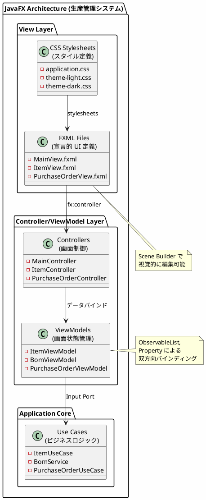
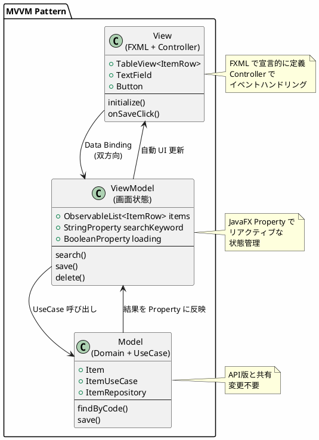
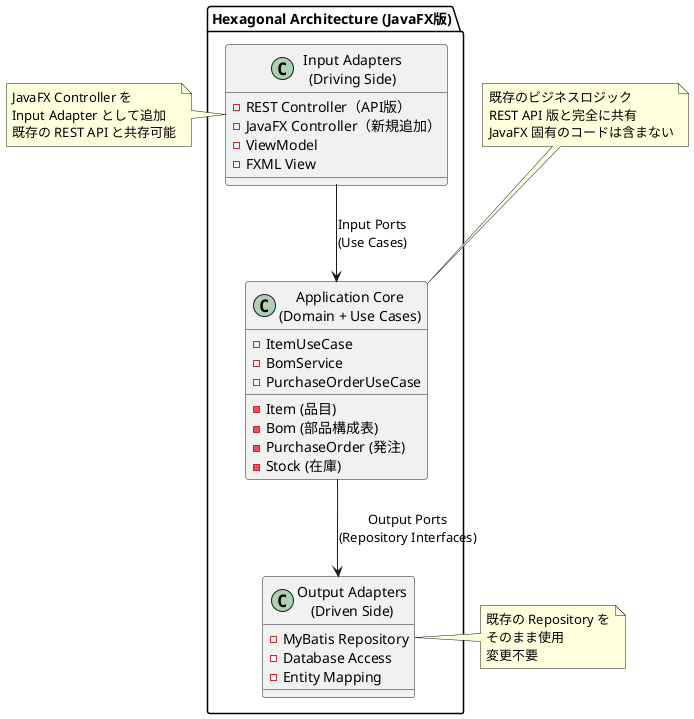
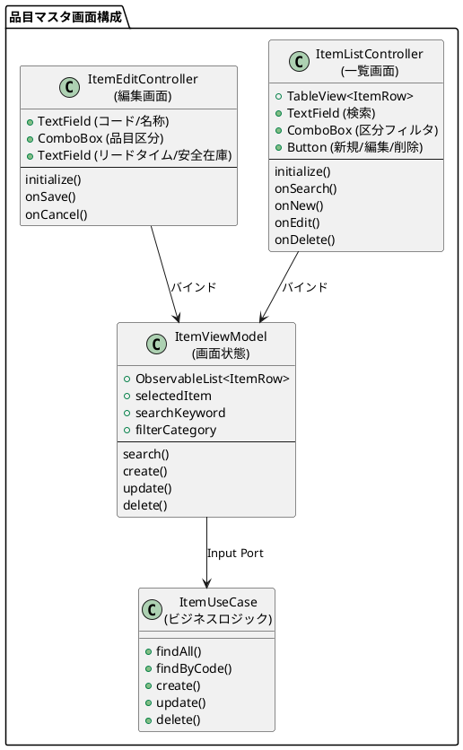
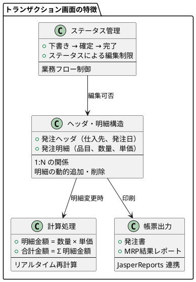
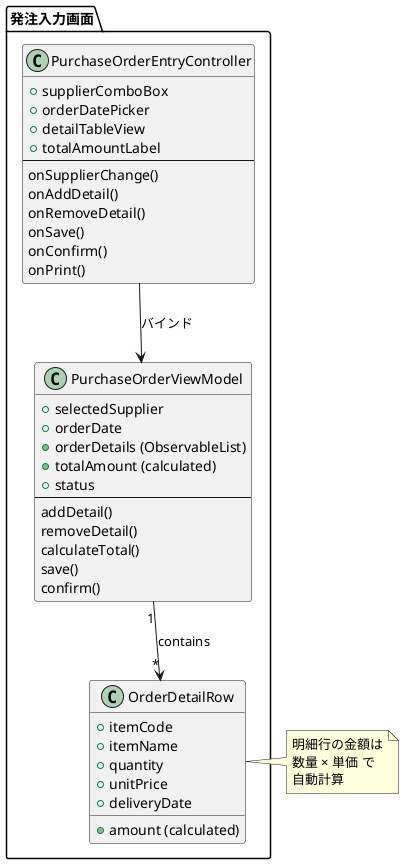
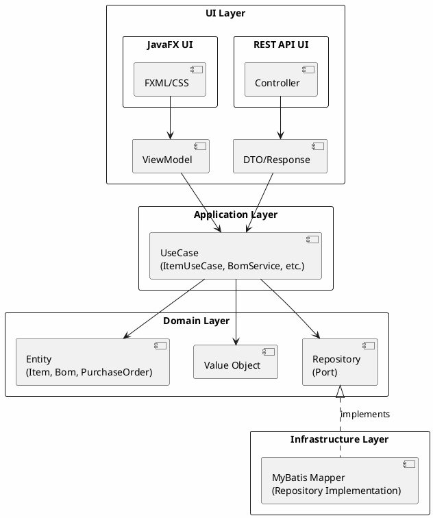

# 実践データベース設計：生産管理システム 研究 2 - JavaFX デスクトップアプリケーションの実装

## はじめに

本研究では、API サーバー構成（第32章）やモノリスサービス（研究 1）とは異なるアプローチとして、**JavaFX** によるデスクトップアプリケーションを実装します。FXML による宣言的 UI 定義と、データバインディングによるリアクティブな画面更新を活用した、業務アプリケーションを構築します。

研究 1 で構築したヘキサゴナルアーキテクチャ（ドメイン層・アプリケーション層）はそのまま共有し、**Input Adapter として JavaFX の Controller/ViewModel 層のみを追加**します。

---

## 第38章：JavaFX デスクトップアプリケーションの基礎

### 38.1 JavaFX とは

JavaFX は Java のリッチクライアントプラットフォームです。Swing の後継として位置づけられ、モダンな UI 構築が可能です。



**Web アプリケーションとの比較：**

| 特徴 | Web アプリ（REST API） | JavaFX デスクトップ |
|------|----------------------|-------------------|
| 配置 | サーバー + ブラウザ | ローカルインストール |
| オフライン | 不可 | 可能（ローカル DB） |
| レスポンス | ネットワーク依存 | 高速 |
| UI 自由度 | HTML/CSS 制約 | ネイティブ制御 |
| 印刷機能 | 制限あり | 高機能 |
| 更新配布 | 自動 | 手動/自動更新 |

---

### 38.2 MVVM パターンの採用

JavaFX では、**MVVM（Model-View-ViewModel）** パターンを採用し、UI とビジネスロジックを分離します。



**各層の責務：**

| 層 | 責務 | JavaFX での実装 |
|----|------|----------------|
| **View** | UI 表示・ユーザー入力 | FXML + Controller |
| **ViewModel** | 画面状態管理・変換 | Property, ObservableList |
| **Model** | ビジネスロジック | UseCase, Repository |

---

### 38.3 ヘキサゴナルアーキテクチャとの統合

JavaFX を導入しても、既存のヘキサゴナルアーキテクチャ（ドメイン層・アプリケーション層）はそのまま共有し、**Input Adapter として JavaFX の Controller/ViewModel 層のみを追加**します。



**JavaFX でもヘキサゴナルアーキテクチャを維持する理由：**

1. **再利用性**: 既存の UseCase/Repository をそのまま活用
2. **並行運用**: REST API と JavaFX の両方を提供可能
3. **テスト容易性**: ドメインロジックは UI フレームワークに依存しない
4. **移行容易性**: 段階的に Web からデスクトップへ移行可能

---

### 38.4 ディレクトリ構成

既存の構成に `infrastructure/in/javafx/` を追加します。

```
src/main/java/com/example/production/
├── domain/                       # ドメイン層（API版と共通）
│   ├── model/
│   │   ├── item/
│   │   ├── bom/
│   │   ├── purchase/
│   │   └── inventory/
│   └── exception/
│
├── application/                  # アプリケーション層（API版と共通）
│   ├── port/
│   │   ├── in/                  # Input Port（ユースケース）
│   │   └── out/                 # Output Port（リポジトリ）
│   └── service/
│
├── infrastructure/
│   ├── out/
│   │   └── persistence/         # Output Adapter（DB実装）- 既存
│   │       ├── mapper/
│   │       └── repository/
│   ├── in/
│   │   ├── rest/                # Input Adapter（REST実装）- 既存
│   │   │   ├── controller/
│   │   │   └── dto/
│   │   └── javafx/              # Input Adapter（JavaFX実装）- 新規追加
│   │       ├── controller/      # FXML Controller
│   │       ├── viewmodel/       # ViewModel
│   │       ├── view/            # 画面表示用の行モデル
│   │       ├── dialog/          # ダイアログ
│   │       ├── util/            # ユーティリティ
│   │       └── config/          # JavaFX 設定
│
└── Application.java              # Spring Boot + JavaFX 起動クラス

src/main/resources/
├── fxml/                         # FXML ファイル
│   ├── main.fxml
│   ├── item/
│   │   ├── item-list.fxml
│   │   └── item-edit.fxml
│   ├── bom/
│   │   ├── bom-tree.fxml
│   │   └── where-used.fxml
│   ├── purchase/
│   │   ├── order-list.fxml
│   │   └── order-entry.fxml
│   └── common/
│       ├── login.fxml
│       └── error-dialog.fxml
│
├── css/                          # スタイルシート
│   ├── application.css
│   └── theme/
│
├── images/                       # 画像リソース
│
└── reports/                      # JasperReports テンプレート
    ├── purchase-order.jrxml
    └── mrp-result.jrxml
```

---

### 38.5 技術スタックの追加

<details>
<summary>build.gradle.kts（差分）</summary>

```kotlin
plugins {
    // 既存のプラグイン...
    id("org.openjfx.javafxplugin") version "0.1.0"  // 追加
}

// JavaFX 設定
javafx {
    version = "21"
    modules = listOf(
        "javafx.controls",
        "javafx.fxml",
        "javafx.graphics",
        "javafx.swing"  // JasperReports 連携用
    )
}

dependencies {
    // 既存の依存関係（Spring Boot, MyBatis, PostgreSQL等）はそのまま

    // JavaFX 関連を追加
    implementation("org.controlsfx:controlsfx:11.2.0")           // 拡張コントロール
    implementation("com.dlsc.formsfx:formsfx-core:11.6.0")        // フォーム生成
    implementation("org.kordamp.ikonli:ikonli-javafx:12.3.1")     // アイコン
    implementation("org.kordamp.ikonli:ikonli-fontawesome5-pack:12.3.1")

    // JasperReports（帳票出力）
    implementation("net.sf.jasperreports:jasperreports:6.20.6")

    // Excel 出力
    implementation("org.apache.poi:poi-ooxml:5.2.5")

    // TestFX（UI テスト）
    testImplementation("org.testfx:testfx-core:4.0.18")
    testImplementation("org.testfx:testfx-junit5:4.0.18")
}
```

</details>

**追加パッケージの説明：**

| パッケージ | 用途 |
|-----------|------|
| javafx.controls | 標準 UI コントロール |
| javafx.fxml | FXML パーサー |
| ControlsFX | 拡張コントロール（SearchableComboBox等） |
| Ikonli | アイコンフォント |
| JasperReports | 帳票出力 |
| Apache POI | Excel 出力 |
| TestFX | UI 自動テスト |

---

### 46.6 Spring Boot + JavaFX 統合

<details>
<summary>JavaFxApplication.java</summary>

```java
package com.example.production.infrastructure.in.javafx;

import javafx.application.Application;
import javafx.application.Platform;
import javafx.stage.Stage;
import org.springframework.boot.builder.SpringApplicationBuilder;
import org.springframework.context.ConfigurableApplicationContext;

/**
 * JavaFX アプリケーションのエントリーポイント
 * Spring Boot コンテキストと JavaFX を統合
 */
public class JavaFxApplication extends Application {

    private ConfigurableApplicationContext springContext;

    @Override
    public void init() {
        springContext = new SpringApplicationBuilder(ProductionApplication.class).run();
    }

    @Override
    public void start(Stage primaryStage) {
        StageManager stageManager = springContext.getBean(StageManager.class);
        stageManager.setPrimaryStage(primaryStage);
        stageManager.switchScene(FxmlView.MAIN);
    }

    @Override
    public void stop() {
        springContext.close();
        Platform.exit();
    }
}
```

</details>

<details>
<summary>StageManager.java</summary>

```java
package com.example.production.infrastructure.in.javafx.config;

import javafx.fxml.FXMLLoader;
import javafx.scene.Parent;
import javafx.scene.Scene;
import javafx.stage.Stage;
import org.springframework.context.ApplicationContext;
import org.springframework.stereotype.Component;

import java.io.IOException;
import java.util.Objects;

/**
 * JavaFX Stage/Scene の管理
 */
@Component
public class StageManager {

    private final ApplicationContext applicationContext;
    private Stage primaryStage;

    public StageManager(ApplicationContext applicationContext) {
        this.applicationContext = applicationContext;
    }

    public void setPrimaryStage(Stage primaryStage) {
        this.primaryStage = primaryStage;
    }

    public void switchScene(FxmlView view) {
        Parent root = loadView(view.getFxmlPath());
        Scene scene = new Scene(root);

        scene.getStylesheets().add(
            Objects.requireNonNull(
                getClass().getResource("/css/application.css")
            ).toExternalForm()
        );

        primaryStage.setTitle(view.getTitle());
        primaryStage.setScene(scene);
        primaryStage.centerOnScreen();

        if (!primaryStage.isShowing()) {
            primaryStage.show();
        }
    }

    private Parent loadView(String fxmlPath) {
        try {
            FXMLLoader loader = new FXMLLoader(getClass().getResource(fxmlPath));
            loader.setControllerFactory(applicationContext::getBean);
            return loader.load();
        } catch (IOException e) {
            throw new RuntimeException("FXML ロードエラー: " + fxmlPath, e);
        }
    }

    public ApplicationContext getApplicationContext() {
        return applicationContext;
    }
}
```

</details>

<details>
<summary>FxmlView.java（画面定義）</summary>

```java
package com.example.production.infrastructure.in.javafx.config;

public enum FxmlView {

    MAIN("/fxml/main.fxml", "生産管理システム"),
    ITEM_LIST("/fxml/item/item-list.fxml", "品目マスタ"),
    ITEM_EDIT("/fxml/item/item-edit.fxml", "品目編集"),
    BOM_TREE("/fxml/bom/bom-tree.fxml", "BOM展開"),
    WHERE_USED("/fxml/bom/where-used.fxml", "使用先照会"),
    ORDER_LIST("/fxml/purchase/order-list.fxml", "発注一覧"),
    ORDER_ENTRY("/fxml/purchase/order-entry.fxml", "発注入力"),
    STOCK_LIST("/fxml/inventory/stock-list.fxml", "在庫照会"),
    MRP_EXECUTION("/fxml/mrp/mrp-execution.fxml", "MRP実行");

    private final String fxmlPath;
    private final String title;

    FxmlView(String fxmlPath, String title) {
        this.fxmlPath = fxmlPath;
        this.title = title;
    }

    public String getFxmlPath() { return fxmlPath; }
    public String getTitle() { return title; }
}
```

</details>

---

### 46.7 JavaFX Property の活用

JavaFX の Property 機能を使って、UI とデータの双方向バインディングを実現します。

<details>
<summary>ItemRow.java（View 用データクラス）</summary>

```java
package com.example.production.infrastructure.in.javafx.view;

import javafx.beans.property.*;
import java.math.BigDecimal;

/**
 * 品目マスタ画面用の行モデル
 */
public class ItemRow {

    private final StringProperty itemCode = new SimpleStringProperty();
    private final StringProperty itemName = new SimpleStringProperty();
    private final StringProperty categoryName = new SimpleStringProperty();
    private final IntegerProperty leadTime = new SimpleIntegerProperty();
    private final IntegerProperty safetyStock = new SimpleIntegerProperty();
    private final StringProperty unitCode = new SimpleStringProperty();

    // Property アクセサ
    public StringProperty itemCodeProperty() { return itemCode; }
    public StringProperty itemNameProperty() { return itemName; }
    public StringProperty categoryNameProperty() { return categoryName; }
    public IntegerProperty leadTimeProperty() { return leadTime; }
    public IntegerProperty safetyStockProperty() { return safetyStock; }
    public StringProperty unitCodeProperty() { return unitCode; }

    // Getter/Setter
    public String getItemCode() { return itemCode.get(); }
    public void setItemCode(String value) { itemCode.set(value); }

    public String getItemName() { return itemName.get(); }
    public void setItemName(String value) { itemName.set(value); }

    public String getCategoryName() { return categoryName.get(); }
    public void setCategoryName(String value) { categoryName.set(value); }

    public int getLeadTime() { return leadTime.get(); }
    public void setLeadTime(int value) { leadTime.set(value); }

    public int getSafetyStock() { return safetyStock.get(); }
    public void setSafetyStock(int value) { safetyStock.set(value); }
}
```

</details>

<details>
<summary>ItemViewModel.java</summary>

```java
package com.example.production.infrastructure.in.javafx.viewmodel;

import com.example.production.application.port.in.ItemUseCase;
import com.example.production.domain.model.item.Item;
import com.example.production.domain.model.item.ItemCategory;
import com.example.production.infrastructure.in.javafx.view.ItemRow;
import javafx.beans.property.*;
import javafx.collections.FXCollections;
import javafx.collections.ObservableList;
import org.springframework.stereotype.Component;

import java.util.List;

@Component
public class ItemViewModel {

    private final ItemUseCase itemUseCase;

    private final ObservableList<ItemRow> items = FXCollections.observableArrayList();
    private final ObjectProperty<ItemRow> selectedItem = new SimpleObjectProperty<>();
    private final StringProperty searchKeyword = new SimpleStringProperty("");
    private final ObjectProperty<ItemCategory> filterCategory = new SimpleObjectProperty<>();
    private final BooleanProperty loading = new SimpleBooleanProperty(false);
    private final StringProperty errorMessage = new SimpleStringProperty();

    public ItemViewModel(ItemUseCase itemUseCase) {
        this.itemUseCase = itemUseCase;
    }

    public void search() {
        loading.set(true);
        errorMessage.set(null);

        try {
            List<Item> result;
            if (filterCategory.get() != null) {
                result = itemUseCase.getItemsByCategory(filterCategory.get());
            } else if (!searchKeyword.get().isBlank()) {
                result = itemUseCase.searchByKeyword(searchKeyword.get());
            } else {
                result = itemUseCase.getAllItems();
            }

            items.clear();
            result.forEach(item -> items.add(toRow(item)));
        } catch (Exception e) {
            errorMessage.set("検索エラー: " + e.getMessage());
        } finally {
            loading.set(false);
        }
    }

    public void delete(String itemCode) {
        loading.set(true);
        try {
            itemUseCase.deleteItem(itemCode);
            items.removeIf(row -> row.getItemCode().equals(itemCode));
        } catch (Exception e) {
            errorMessage.set("削除エラー: " + e.getMessage());
            throw e;
        } finally {
            loading.set(false);
        }
    }

    public ObservableList<ItemRow> getItems() { return items; }
    public ObjectProperty<ItemRow> selectedItemProperty() { return selectedItem; }
    public StringProperty searchKeywordProperty() { return searchKeyword; }
    public ObjectProperty<ItemCategory> filterCategoryProperty() { return filterCategory; }
    public BooleanProperty loadingProperty() { return loading; }
    public StringProperty errorMessageProperty() { return errorMessage; }

    private ItemRow toRow(Item item) {
        ItemRow row = new ItemRow();
        row.setItemCode(item.getItemCode());
        row.setItemName(item.getItemName());
        row.setCategoryName(item.getCategory() != null ? item.getCategory().name() : "");
        row.setLeadTime(item.getLeadTime() != null ? item.getLeadTime() : 0);
        row.setSafetyStock(item.getSafetyStock() != null ? item.getSafetyStock() : 0);
        return row;
    }
}
```

</details>

---

## 第39章：マスタの実装

### 39.1 品目マスタ画面の設計



### 39.2 品目マスタ一覧画面の TDD 実装

#### Red: 失敗するテストを書く

<details>
<summary>ItemListControllerTest.java</summary>

```java
@ExtendWith({ApplicationExtension.class, MockitoExtension.class})
@DisplayName("品目マスタ一覧画面")
class ItemListControllerTest {

    @Mock
    private ItemUseCase itemUseCase;

    private ItemViewModel viewModel;

    @Start
    void start(Stage stage) throws Exception {
        viewModel = new ItemViewModel(itemUseCase);
        var controller = new ItemListController(viewModel);

        var loader = new FXMLLoader(getClass().getResource("/fxml/item/item-list.fxml"));
        loader.setController(controller);
        stage.setScene(new Scene(loader.load()));
        stage.show();
    }

    @Test
    @DisplayName("品目一覧がテーブルに表示される")
    void shouldDisplayItemsInTable(FxRobot robot) {
        // Arrange
        when(itemUseCase.getAllItems()).thenReturn(List.of(
            createItem("PROD-001", "製品A", ItemCategory.PRODUCT),
            createItem("PART-001", "部品B", ItemCategory.PART)
        ));

        // Act
        robot.interact(() -> viewModel.search());

        // Assert
        TableView<ItemRow> table = robot.lookup("#itemTable").queryTableView();
        assertThat(table.getItems()).hasSize(2);
        assertThat(table.getItems().get(0).getItemCode()).isEqualTo("PROD-001");
    }

    @Test
    @DisplayName("品目区分でフィルタリングできる")
    void shouldFilterByCategory(FxRobot robot) {
        when(itemUseCase.getItemsByCategory(ItemCategory.PRODUCT)).thenReturn(List.of(
            createItem("PROD-001", "製品A", ItemCategory.PRODUCT)
        ));

        robot.clickOn("#categoryComboBox").clickOn("製品");
        robot.clickOn("#searchButton");

        TableView<ItemRow> table = robot.lookup("#itemTable").queryTableView();
        assertThat(table.getItems()).hasSize(1);
    }

    @Test
    @DisplayName("キーワードで品目を検索できる")
    void shouldSearchItemsByKeyword(FxRobot robot) {
        when(itemUseCase.searchByKeyword("製品")).thenReturn(List.of(
            createItem("PROD-001", "製品A", ItemCategory.PRODUCT)
        ));

        robot.clickOn("#searchField").write("製品").type(KeyCode.ENTER);

        TableView<ItemRow> table = robot.lookup("#itemTable").queryTableView();
        assertThat(table.getItems()).hasSize(1);
    }

    private Item createItem(String code, String name, ItemCategory category) {
        return Item.builder()
            .itemCode(code)
            .itemName(name)
            .category(category)
            .effectiveDate(LocalDate.now())
            .build();
    }
}
```

</details>

#### Green: Controller の実装

<details>
<summary>ItemListController.java</summary>

```java
package com.example.production.infrastructure.in.javafx.controller;

import com.example.production.domain.model.item.ItemCategory;
import com.example.production.infrastructure.in.javafx.util.AlertHelper;
import com.example.production.infrastructure.in.javafx.view.ItemRow;
import com.example.production.infrastructure.in.javafx.viewmodel.ItemViewModel;
import javafx.fxml.FXML;
import javafx.fxml.Initializable;
import javafx.scene.control.*;
import javafx.scene.control.cell.PropertyValueFactory;
import org.springframework.stereotype.Component;

import java.net.URL;
import java.util.ResourceBundle;

@Component
public class ItemListController implements Initializable {

    private final ItemViewModel viewModel;

    @FXML private TextField searchField;
    @FXML private ComboBox<ItemCategory> categoryComboBox;
    @FXML private TableView<ItemRow> itemTable;
    @FXML private TableColumn<ItemRow, String> codeColumn;
    @FXML private TableColumn<ItemRow, String> nameColumn;
    @FXML private TableColumn<ItemRow, String> categoryColumn;
    @FXML private TableColumn<ItemRow, Integer> leadTimeColumn;
    @FXML private TableColumn<ItemRow, Integer> safetyStockColumn;
    @FXML private Button editButton;
    @FXML private Button deleteButton;
    @FXML private Label recordCount;
    @FXML private ProgressIndicator loadingIndicator;

    public ItemListController(ItemViewModel viewModel) {
        this.viewModel = viewModel;
    }

    @Override
    public void initialize(URL url, ResourceBundle rb) {
        // カテゴリコンボボックスの設定
        categoryComboBox.getItems().add(null);  // 全て
        categoryComboBox.getItems().addAll(ItemCategory.values());
        categoryComboBox.valueProperty().bindBidirectional(viewModel.filterCategoryProperty());

        // テーブルカラムの設定
        codeColumn.setCellValueFactory(new PropertyValueFactory<>("itemCode"));
        nameColumn.setCellValueFactory(new PropertyValueFactory<>("itemName"));
        categoryColumn.setCellValueFactory(new PropertyValueFactory<>("categoryName"));
        leadTimeColumn.setCellValueFactory(new PropertyValueFactory<>("leadTime"));
        safetyStockColumn.setCellValueFactory(new PropertyValueFactory<>("safetyStock"));

        // テーブルとViewModelのバインド
        itemTable.setItems(viewModel.getItems());
        viewModel.selectedItemProperty().bind(itemTable.getSelectionModel().selectedItemProperty());

        // ボタンの有効/無効制御
        editButton.disableProperty().bind(
            itemTable.getSelectionModel().selectedItemProperty().isNull()
        );
        deleteButton.disableProperty().bind(
            itemTable.getSelectionModel().selectedItemProperty().isNull()
        );

        // ローディングインジケーター
        loadingIndicator.visibleProperty().bind(viewModel.loadingProperty());

        // 検索フィールドのバインド
        searchField.textProperty().bindBidirectional(viewModel.searchKeywordProperty());

        // 件数表示
        viewModel.getItems().addListener((observable, oldValue, newValue) -> {
            recordCount.setText(viewModel.getItems().size() + " 件");
        });

        // 初期検索
        viewModel.search();
    }

    @FXML
    private void onSearch() {
        viewModel.search();
    }

    @FXML
    private void onNew() {
        // 新規画面への遷移
    }

    @FXML
    private void onEdit() {
        // 編集画面への遷移
    }

    @FXML
    private void onDelete() {
        ItemRow selected = viewModel.selectedItemProperty().get();
        if (selected == null) return;

        if (AlertHelper.showConfirmation(
                "品目「" + selected.getItemName() + "」を削除しますか？")) {
            try {
                viewModel.delete(selected.getItemCode());
                AlertHelper.showInfo("削除しました");
            } catch (Exception e) {
                AlertHelper.showError("削除に失敗しました: " + e.getMessage());
            }
        }
    }

    @FXML
    private void onExportExcel() {
        // Excel出力処理
    }
}
```

</details>

<details>
<summary>item-list.fxml</summary>

```xml
<?xml version="1.0" encoding="UTF-8"?>
<?import javafx.scene.control.*?>
<?import javafx.scene.layout.*?>
<?import org.kordamp.ikonli.javafx.FontIcon?>

<VBox xmlns="http://javafx.com/javafx/21"
      xmlns:fx="http://javafx.com/fxml/1"
      fx:controller="com.example.production.infrastructure.in.javafx.controller.ItemListController"
      spacing="10" padding="10">

    <!-- ツールバー -->
    <HBox spacing="10" alignment="CENTER_LEFT">
        <ComboBox fx:id="categoryComboBox" promptText="品目区分" prefWidth="120"/>
        <TextField fx:id="searchField" promptText="品目コード・品目名で検索" prefWidth="250"/>
        <Button fx:id="searchButton" onAction="#onSearch">
            <graphic><FontIcon iconLiteral="fas-search"/></graphic>
        </Button>
        <Pane HBox.hgrow="ALWAYS"/>
        <Button fx:id="newButton" text="新規" styleClass="primary" onAction="#onNew">
            <graphic><FontIcon iconLiteral="fas-plus"/></graphic>
        </Button>
        <Button fx:id="editButton" text="編集" onAction="#onEdit" disable="true"/>
        <Button fx:id="deleteButton" text="削除" styleClass="danger" onAction="#onDelete" disable="true"/>
        <Button text="Excel出力" onAction="#onExportExcel">
            <graphic><FontIcon iconLiteral="fas-file-excel"/></graphic>
        </Button>
    </HBox>

    <!-- 品目テーブル -->
    <TableView fx:id="itemTable" VBox.vgrow="ALWAYS">
        <placeholder><Label text="該当する品目がありません"/></placeholder>
        <columns>
            <TableColumn fx:id="codeColumn" text="品目コード" prefWidth="120"/>
            <TableColumn fx:id="nameColumn" text="品目名" prefWidth="200"/>
            <TableColumn fx:id="categoryColumn" text="品目区分" prefWidth="100"/>
            <TableColumn fx:id="leadTimeColumn" text="リードタイム" prefWidth="100"/>
            <TableColumn fx:id="safetyStockColumn" text="安全在庫" prefWidth="100"/>
        </columns>
    </TableView>

    <!-- ステータスバー -->
    <HBox spacing="10" styleClass="status-bar">
        <Label fx:id="recordCount" text="0 件"/>
        <Pane HBox.hgrow="ALWAYS"/>
        <ProgressIndicator fx:id="loadingIndicator" visible="false" prefWidth="20" prefHeight="20"/>
    </HBox>
</VBox>
```

</details>

### 39.3 BOM 展開画面の実装

<details>
<summary>BomTreeController.java</summary>

```java
package com.example.production.infrastructure.in.javafx.controller;

import com.example.production.application.service.BomNode;
import com.example.production.application.service.BomService;
import com.example.production.infrastructure.in.javafx.util.AlertHelper;
import javafx.fxml.FXML;
import javafx.fxml.Initializable;
import javafx.scene.control.*;
import org.springframework.stereotype.Component;

import java.net.URL;
import java.util.ResourceBundle;

@Component
public class BomTreeController implements Initializable {

    private final BomService bomService;

    @FXML private TextField itemCodeField;
    @FXML private TreeView<BomNode> bomTreeView;
    @FXML private Label itemNameLabel;
    @FXML private ProgressIndicator loadingIndicator;

    public BomTreeController(BomService bomService) {
        this.bomService = bomService;
    }

    @Override
    public void initialize(URL url, ResourceBundle rb) {
        // TreeView のセルファクトリ設定
        bomTreeView.setCellFactory(tv -> new TreeCell<>() {
            @Override
            protected void updateItem(BomNode item, boolean empty) {
                super.updateItem(item, empty);
                if (empty || item == null) {
                    setText(null);
                    setGraphic(null);
                } else {
                    String indent = "  ".repeat(item.getLevel());
                    setText(String.format("%s%s [%s] x %s",
                        indent,
                        item.getItemCode(),
                        item.getItemName(),
                        item.getRequiredQuantity()));
                }
            }
        });
    }

    @FXML
    private void onExpand() {
        String itemCode = itemCodeField.getText();
        if (itemCode == null || itemCode.isBlank()) {
            AlertHelper.showWarning("品目コードを入力してください");
            return;
        }

        loadingIndicator.setVisible(true);
        try {
            BomNode root = bomService.explodeBom(itemCode);
            TreeItem<BomNode> rootItem = createTreeItem(root);
            rootItem.setExpanded(true);
            bomTreeView.setRoot(rootItem);
            itemNameLabel.setText(root.getItemName());
        } catch (Exception e) {
            AlertHelper.showError("BOM展開エラー: " + e.getMessage());
        } finally {
            loadingIndicator.setVisible(false);
        }
    }

    private TreeItem<BomNode> createTreeItem(BomNode node) {
        TreeItem<BomNode> item = new TreeItem<>(node);
        if (node.getChildren() != null) {
            for (BomNode child : node.getChildren()) {
                item.getChildren().add(createTreeItem(child));
            }
        }
        item.setExpanded(true);
        return item;
    }

    @FXML
    private void onExpandAll() {
        expandAll(bomTreeView.getRoot(), true);
    }

    @FXML
    private void onCollapseAll() {
        expandAll(bomTreeView.getRoot(), false);
    }

    private void expandAll(TreeItem<?> item, boolean expand) {
        if (item != null) {
            item.setExpanded(expand);
            for (TreeItem<?> child : item.getChildren()) {
                expandAll(child, expand);
            }
        }
    }
}
```

</details>

<details>
<summary>bom-tree.fxml</summary>

```xml
<?xml version="1.0" encoding="UTF-8"?>
<?import javafx.scene.control.*?>
<?import javafx.scene.layout.*?>
<?import org.kordamp.ikonli.javafx.FontIcon?>

<VBox xmlns="http://javafx.com/javafx/21"
      xmlns:fx="http://javafx.com/fxml/1"
      fx:controller="com.example.production.infrastructure.in.javafx.controller.BomTreeController"
      spacing="10" padding="10">

    <!-- 検索エリア -->
    <HBox spacing="10" alignment="CENTER_LEFT">
        <Label text="品目コード:"/>
        <TextField fx:id="itemCodeField" prefWidth="150"/>
        <Button text="展開" styleClass="primary" onAction="#onExpand">
            <graphic><FontIcon iconLiteral="fas-sitemap"/></graphic>
        </Button>
        <Separator orientation="VERTICAL"/>
        <Button text="全展開" onAction="#onExpandAll">
            <graphic><FontIcon iconLiteral="fas-plus-square"/></graphic>
        </Button>
        <Button text="全折畳" onAction="#onCollapseAll">
            <graphic><FontIcon iconLiteral="fas-minus-square"/></graphic>
        </Button>
        <Pane HBox.hgrow="ALWAYS"/>
        <Label fx:id="itemNameLabel" styleClass="item-name-label"/>
    </HBox>

    <!-- BOM ツリー -->
    <TreeView fx:id="bomTreeView" VBox.vgrow="ALWAYS" showRoot="true"/>

    <!-- ステータスバー -->
    <HBox spacing="10" styleClass="status-bar">
        <ProgressIndicator fx:id="loadingIndicator" visible="false" prefWidth="20" prefHeight="20"/>
    </HBox>
</VBox>
```

</details>

---

## 第40章：トランザクションの実装

### 40.1 トランザクション画面の特徴

トランザクション画面は、マスタ画面とは異なる以下の特徴があります。



### 40.2 発注入力画面の設計



### 40.3 発注入力画面の TDD 実装

#### Red: 失敗するテストを書く

<details>
<summary>PurchaseOrderEntryControllerTest.java</summary>

```java
@ExtendWith({ApplicationExtension.class, MockitoExtension.class})
@DisplayName("発注入力画面")
class PurchaseOrderEntryControllerTest {

    @Mock
    private PurchaseOrderUseCase orderUseCase;
    @Mock
    private ItemUseCase itemUseCase;

    private PurchaseOrderViewModel viewModel;

    @Nested
    @DisplayName("明細追加")
    class AddDetail {

        @Test
        @DisplayName("品目を選択して明細を追加できる")
        void shouldAddDetailWhenItemSelected(FxRobot robot) {
            when(itemUseCase.getItemByCode("PART-001")).thenReturn(
                createItem("PART-001", "テスト部品", new BigDecimal("500"))
            );

            robot.clickOn("#itemCodeField").write("PART-001");
            robot.clickOn("#quantityField").write("100");
            robot.clickOn("#addDetailButton");

            TableView<OrderDetailRow> table = robot.lookup("#detailTable").queryTableView();
            assertThat(table.getItems()).hasSize(1);
            assertThat(table.getItems().get(0).getAmount())
                .isEqualByComparingTo(new BigDecimal("50000"));
        }
    }

    @Nested
    @DisplayName("合計計算")
    class TotalCalculation {

        @Test
        @DisplayName("明細追加時に合計金額が再計算される")
        void shouldRecalculateTotalWhenDetailAdded(FxRobot robot) {
            viewModel.addDetail(createDetailRow("PART-001", 100, new BigDecimal("500")));
            viewModel.addDetail(createDetailRow("MAT-001", 50, new BigDecimal("200")));

            Label totalLabel = robot.lookup("#totalAmountLabel").queryAs(Label.class);
            // 100 × 500 + 50 × 200 = 60,000
            assertThat(totalLabel.getText()).contains("60,000");
        }
    }

    @Nested
    @DisplayName("発注確定")
    class ConfirmOrder {

        @Test
        @DisplayName("下書き状態の発注を確定できる")
        void shouldConfirmDraftOrder(FxRobot robot) {
            // Arrange
            viewModel.addDetail(createDetailRow("PART-001", 100, new BigDecimal("500")));
            when(orderUseCase.confirmOrder(anyString())).thenReturn(
                createOrder("PO-001", OrderStatus.CONFIRMED)
            );

            // Act
            robot.clickOn("#confirmButton");

            // Assert
            verify(orderUseCase).confirmOrder(anyString());
        }
    }
}
```

</details>

#### Green: Controller と FXML の実装

<details>
<summary>PurchaseOrderEntryController.java</summary>

```java
package com.example.production.infrastructure.in.javafx.controller;

import com.example.production.application.port.in.*;
import com.example.production.domain.model.purchase.OrderStatus;
import com.example.production.infrastructure.in.javafx.util.AlertHelper;
import com.example.production.infrastructure.in.javafx.view.OrderDetailRow;
import com.example.production.infrastructure.in.javafx.viewmodel.PurchaseOrderViewModel;
import javafx.fxml.FXML;
import javafx.fxml.Initializable;
import javafx.scene.control.*;
import javafx.scene.control.cell.PropertyValueFactory;
import org.springframework.stereotype.Component;

import java.math.BigDecimal;
import java.net.URL;
import java.time.LocalDate;
import java.util.ResourceBundle;

@Component
public class PurchaseOrderEntryController implements Initializable {

    private final PurchaseOrderViewModel viewModel;
    private final ItemUseCase itemUseCase;

    @FXML private TextField orderNumberField;
    @FXML private DatePicker orderDatePicker;
    @FXML private TextField supplierCodeField;
    @FXML private TextField supplierNameField;
    @FXML private Label statusLabel;

    @FXML private TextField itemCodeField;
    @FXML private TextField itemNameField;
    @FXML private TextField quantityField;
    @FXML private TextField unitPriceField;
    @FXML private DatePicker deliveryDatePicker;

    @FXML private TableView<OrderDetailRow> detailTable;
    @FXML private TableColumn<OrderDetailRow, Integer> lineNoColumn;
    @FXML private TableColumn<OrderDetailRow, String> itemCodeColumn;
    @FXML private TableColumn<OrderDetailRow, String> itemNameColumn;
    @FXML private TableColumn<OrderDetailRow, BigDecimal> quantityColumn;
    @FXML private TableColumn<OrderDetailRow, BigDecimal> unitPriceColumn;
    @FXML private TableColumn<OrderDetailRow, LocalDate> deliveryDateColumn;
    @FXML private TableColumn<OrderDetailRow, BigDecimal> amountColumn;

    @FXML private Label totalAmountLabel;
    @FXML private Button saveButton;
    @FXML private Button confirmButton;

    public PurchaseOrderEntryController(
            PurchaseOrderViewModel viewModel,
            ItemUseCase itemUseCase) {
        this.viewModel = viewModel;
        this.itemUseCase = itemUseCase;
    }

    @Override
    public void initialize(URL url, ResourceBundle rb) {
        // テーブルカラムの設定
        lineNoColumn.setCellValueFactory(new PropertyValueFactory<>("lineNumber"));
        itemCodeColumn.setCellValueFactory(new PropertyValueFactory<>("itemCode"));
        itemNameColumn.setCellValueFactory(new PropertyValueFactory<>("itemName"));
        quantityColumn.setCellValueFactory(new PropertyValueFactory<>("quantity"));
        unitPriceColumn.setCellValueFactory(new PropertyValueFactory<>("unitPrice"));
        deliveryDateColumn.setCellValueFactory(new PropertyValueFactory<>("deliveryDate"));
        amountColumn.setCellValueFactory(new PropertyValueFactory<>("amount"));

        // 金額カラムの書式設定
        amountColumn.setCellFactory(col -> new TableCell<>() {
            @Override
            protected void updateItem(BigDecimal item, boolean empty) {
                super.updateItem(item, empty);
                if (empty || item == null) {
                    setText(null);
                } else {
                    setText(String.format("%,d", item.intValue()));
                }
                setStyle("-fx-alignment: CENTER-RIGHT;");
            }
        });

        // テーブルとViewModelのバインド
        detailTable.setItems(viewModel.getOrderDetails());

        // 合計金額のバインド
        viewModel.totalAmountProperty().addListener((obs, oldVal, newVal) -> {
            totalAmountLabel.setText(String.format("¥%,d", newVal.intValue()));
        });

        // 初期日付の設定
        orderDatePicker.setValue(LocalDate.now());
        deliveryDatePicker.setValue(LocalDate.now().plusDays(7));

        // ボタン制御
        updateButtonState();
    }

    @FXML
    private void onSearchItem() {
        String itemCode = itemCodeField.getText();
        if (itemCode == null || itemCode.isBlank()) return;

        try {
            var item = itemUseCase.getItemByCode(itemCode);
            itemNameField.setText(item.getItemName());
            // デフォルト単価があれば設定
        } catch (Exception e) {
            AlertHelper.showWarning("品目が見つかりません: " + itemCode);
            itemNameField.clear();
        }
    }

    @FXML
    private void onAddDetail() {
        try {
            String itemCode = itemCodeField.getText();
            String itemName = itemNameField.getText();
            BigDecimal quantity = new BigDecimal(quantityField.getText());
            BigDecimal unitPrice = new BigDecimal(unitPriceField.getText());
            LocalDate deliveryDate = deliveryDatePicker.getValue();

            viewModel.addDetail(itemCode, itemName, quantity, unitPrice, deliveryDate);

            // 入力フィールドをクリア
            itemCodeField.clear();
            itemNameField.clear();
            quantityField.clear();
            unitPriceField.clear();
            itemCodeField.requestFocus();
        } catch (NumberFormatException e) {
            AlertHelper.showWarning("数量・単価は数値で入力してください");
        }
    }

    @FXML
    private void onRemoveDetail() {
        OrderDetailRow selected = detailTable.getSelectionModel().getSelectedItem();
        if (selected != null) {
            viewModel.removeDetail(selected);
        }
    }

    @FXML
    private void onSave() {
        if (viewModel.getOrderDetails().isEmpty()) {
            AlertHelper.showWarning("明細を1件以上入力してください");
            return;
        }

        try {
            viewModel.setSupplierCode(supplierCodeField.getText());
            viewModel.setOrderDate(orderDatePicker.getValue());
            viewModel.save();
            orderNumberField.setText(viewModel.getOrderNumber());
            AlertHelper.showInfo("保存しました");
            updateButtonState();
        } catch (Exception e) {
            AlertHelper.showError("保存エラー: " + e.getMessage());
        }
    }

    @FXML
    private void onConfirm() {
        if (AlertHelper.showConfirmation("発注を確定しますか？\n確定後は編集できません。")) {
            try {
                viewModel.confirm();
                statusLabel.setText("確定");
                AlertHelper.showInfo("発注を確定しました");
                updateButtonState();
            } catch (Exception e) {
                AlertHelper.showError("確定エラー: " + e.getMessage());
            }
        }
    }

    @FXML
    private void onPrint() {
        // JasperReports で発注書を印刷
    }

    @FXML
    private void onClear() {
        viewModel.clear();
        orderNumberField.clear();
        supplierCodeField.clear();
        supplierNameField.clear();
        orderDatePicker.setValue(LocalDate.now());
        statusLabel.setText("新規");
        updateButtonState();
    }

    private void updateButtonState() {
        boolean isNew = viewModel.getOrderNumber() == null;
        boolean isDraft = viewModel.getStatus() == OrderStatus.DRAFT;

        saveButton.setDisable(!isDraft && !isNew);
        confirmButton.setDisable(isNew || !isDraft);
    }
}
```

</details>

<details>
<summary>order-entry.fxml</summary>

```xml
<?xml version="1.0" encoding="UTF-8"?>
<?import javafx.scene.control.*?>
<?import javafx.scene.layout.*?>
<?import org.kordamp.ikonli.javafx.FontIcon?>

<VBox xmlns="http://javafx.com/javafx/21"
      xmlns:fx="http://javafx.com/fxml/1"
      fx:controller="com.example.production.infrastructure.in.javafx.controller.PurchaseOrderEntryController"
      spacing="10" padding="10">

    <!-- ヘッダ情報 -->
    <GridPane hgap="10" vgap="10" styleClass="header-form">
        <Label text="発注番号:" GridPane.columnIndex="0" GridPane.rowIndex="0"/>
        <TextField fx:id="orderNumberField" editable="false" GridPane.columnIndex="1"/>

        <Label text="発注日:" GridPane.columnIndex="2" GridPane.rowIndex="0"/>
        <DatePicker fx:id="orderDatePicker" GridPane.columnIndex="3"/>

        <Label text="ステータス:" GridPane.columnIndex="4" GridPane.rowIndex="0"/>
        <Label fx:id="statusLabel" text="新規" styleClass="status-label" GridPane.columnIndex="5"/>

        <Label text="仕入先:" GridPane.columnIndex="0" GridPane.rowIndex="1"/>
        <HBox spacing="5" GridPane.columnIndex="1" GridPane.columnSpan="3">
            <TextField fx:id="supplierCodeField" prefWidth="100"/>
            <Button onAction="#onSearchSupplier">
                <graphic><FontIcon iconLiteral="fas-search"/></graphic>
            </Button>
            <TextField fx:id="supplierNameField" editable="false" HBox.hgrow="ALWAYS"/>
        </HBox>
    </GridPane>

    <Separator/>

    <!-- 明細入力エリア -->
    <HBox spacing="10" alignment="CENTER_LEFT">
        <Label text="品目:"/>
        <TextField fx:id="itemCodeField" prefWidth="100" onAction="#onSearchItem"/>
        <Button onAction="#onSearchItem">
            <graphic><FontIcon iconLiteral="fas-search"/></graphic>
        </Button>
        <TextField fx:id="itemNameField" prefWidth="150" editable="false"/>
        <Label text="数量:"/>
        <TextField fx:id="quantityField" prefWidth="80" alignment="CENTER_RIGHT"/>
        <Label text="単価:"/>
        <TextField fx:id="unitPriceField" prefWidth="100" alignment="CENTER_RIGHT"/>
        <Label text="納期:"/>
        <DatePicker fx:id="deliveryDatePicker" prefWidth="130"/>
        <Button fx:id="addDetailButton" text="追加" styleClass="primary" onAction="#onAddDetail">
            <graphic><FontIcon iconLiteral="fas-plus"/></graphic>
        </Button>
    </HBox>

    <!-- 明細テーブル -->
    <TableView fx:id="detailTable" VBox.vgrow="ALWAYS" editable="true">
        <columns>
            <TableColumn fx:id="lineNoColumn" text="No." prefWidth="50"/>
            <TableColumn fx:id="itemCodeColumn" text="品目コード" prefWidth="100"/>
            <TableColumn fx:id="itemNameColumn" text="品目名" prefWidth="180"/>
            <TableColumn fx:id="quantityColumn" text="数量" prefWidth="80" styleClass="quantity-column"/>
            <TableColumn fx:id="unitPriceColumn" text="単価" prefWidth="100" styleClass="amount-column"/>
            <TableColumn fx:id="deliveryDateColumn" text="納期" prefWidth="100"/>
            <TableColumn fx:id="amountColumn" text="金額" prefWidth="120" styleClass="amount-column"/>
            <TableColumn text="削除" prefWidth="60">
                <cellFactory>
                    <!-- 削除ボタン -->
                </cellFactory>
            </TableColumn>
        </columns>
    </TableView>

    <!-- 合計エリア -->
    <HBox spacing="20" alignment="CENTER_RIGHT" styleClass="total-area">
        <VBox alignment="CENTER_RIGHT" spacing="5">
            <HBox spacing="10" alignment="CENTER_RIGHT">
                <Label text="合計金額:" styleClass="total-label-large"/>
                <Label fx:id="totalAmountLabel" text="¥0" styleClass="total-value-large"/>
            </HBox>
        </VBox>
    </HBox>

    <!-- ボタンエリア -->
    <HBox spacing="10" alignment="CENTER_RIGHT">
        <Button text="クリア" onAction="#onClear"/>
        <Button text="印刷" onAction="#onPrint">
            <graphic><FontIcon iconLiteral="fas-print"/></graphic>
        </Button>
        <Button fx:id="saveButton" text="保存" styleClass="primary" onAction="#onSave">
            <graphic><FontIcon iconLiteral="fas-save"/></graphic>
        </Button>
        <Button fx:id="confirmButton" text="確定" styleClass="success" onAction="#onConfirm" disable="true">
            <graphic><FontIcon iconLiteral="fas-check"/></graphic>
        </Button>
    </HBox>
</VBox>
```

</details>

### 40.4 MRP 実行画面の実装

<details>
<summary>MrpExecutionController.java</summary>

```java
package com.example.production.infrastructure.in.javafx.controller;

import com.example.production.application.service.MrpService;
import com.example.production.application.service.PlannedOrder;
import com.example.production.application.service.ShortageItem;
import com.example.production.infrastructure.in.javafx.util.AlertHelper;
import javafx.application.Platform;
import javafx.concurrent.Task;
import javafx.fxml.FXML;
import javafx.fxml.Initializable;
import javafx.scene.control.*;
import javafx.scene.control.cell.PropertyValueFactory;
import org.springframework.stereotype.Component;

import java.math.BigDecimal;
import java.net.URL;
import java.time.LocalDate;
import java.util.ResourceBundle;
import java.util.concurrent.ExecutorService;
import java.util.concurrent.Executors;

@Component
public class MrpExecutionController implements Initializable {

    private final MrpService mrpService;
    private final ExecutorService executor = Executors.newSingleThreadExecutor();

    @FXML private DatePicker startDatePicker;
    @FXML private DatePicker endDatePicker;
    @FXML private ProgressBar progressBar;
    @FXML private Label progressLabel;

    @FXML private TableView<PlannedOrder> plannedOrderTable;
    @FXML private TableColumn<PlannedOrder, String> poItemCodeColumn;
    @FXML private TableColumn<PlannedOrder, String> poItemNameColumn;
    @FXML private TableColumn<PlannedOrder, BigDecimal> poQuantityColumn;
    @FXML private TableColumn<PlannedOrder, LocalDate> poDueDateColumn;

    @FXML private TableView<ShortageItem> shortageTable;
    @FXML private TableColumn<ShortageItem, String> siItemCodeColumn;
    @FXML private TableColumn<ShortageItem, String> siItemNameColumn;
    @FXML private TableColumn<ShortageItem, BigDecimal> siShortageColumn;

    @FXML private Label executionTimeLabel;
    @FXML private Label totalItemsLabel;
    @FXML private Label shortageCountLabel;

    public MrpExecutionController(MrpService mrpService) {
        this.mrpService = mrpService;
    }

    @Override
    public void initialize(URL url, ResourceBundle rb) {
        // 初期日付の設定
        startDatePicker.setValue(LocalDate.now());
        endDatePicker.setValue(LocalDate.now().plusMonths(3));

        // 計画オーダテーブルのカラム設定
        poItemCodeColumn.setCellValueFactory(new PropertyValueFactory<>("itemCode"));
        poItemNameColumn.setCellValueFactory(new PropertyValueFactory<>("itemName"));
        poQuantityColumn.setCellValueFactory(new PropertyValueFactory<>("quantity"));
        poDueDateColumn.setCellValueFactory(new PropertyValueFactory<>("dueDate"));

        // 不足品目テーブルのカラム設定
        siItemCodeColumn.setCellValueFactory(new PropertyValueFactory<>("itemCode"));
        siItemNameColumn.setCellValueFactory(new PropertyValueFactory<>("itemName"));
        siShortageColumn.setCellValueFactory(new PropertyValueFactory<>("shortageQuantity"));

        progressBar.setProgress(0);
    }

    @FXML
    private void onExecute() {
        LocalDate startDate = startDatePicker.getValue();
        LocalDate endDate = endDatePicker.getValue();

        if (startDate == null || endDate == null) {
            AlertHelper.showWarning("期間を指定してください");
            return;
        }

        if (startDate.isAfter(endDate)) {
            AlertHelper.showWarning("開始日は終了日より前にしてください");
            return;
        }

        // バックグラウンドでMRP実行
        Task<Void> task = new Task<>() {
            @Override
            protected Void call() throws Exception {
                updateProgress(0.1, 1.0);
                updateMessage("需要取得中...");

                updateProgress(0.3, 1.0);
                updateMessage("BOM展開中...");

                updateProgress(0.5, 1.0);
                updateMessage("正味所要量計算中...");

                updateProgress(0.7, 1.0);
                updateMessage("計画オーダ生成中...");

                long start = System.currentTimeMillis();
                var result = mrpService.execute(startDate, endDate);
                long elapsed = System.currentTimeMillis() - start;

                updateProgress(1.0, 1.0);
                updateMessage("完了");

                Platform.runLater(() -> {
                    plannedOrderTable.getItems().setAll(result.getPlannedOrders());
                    shortageTable.getItems().setAll(result.getShortageItems());

                    executionTimeLabel.setText(String.format("%.2f 秒", elapsed / 1000.0));
                    totalItemsLabel.setText(String.valueOf(result.getPlannedOrders().size()));
                    shortageCountLabel.setText(String.valueOf(result.getShortageItems().size()));
                });

                return null;
            }
        };

        progressBar.progressProperty().bind(task.progressProperty());
        progressLabel.textProperty().bind(task.messageProperty());

        task.setOnFailed(e -> {
            AlertHelper.showError("MRP実行エラー: " + task.getException().getMessage());
            progressBar.progressProperty().unbind();
            progressLabel.textProperty().unbind();
        });

        executor.submit(task);
    }

    @FXML
    private void onExportExcel() {
        // Excel出力処理
    }
}
```

</details>

---

## 第41章：エラーハンドリングと帳票出力

### 41.1 AlertHelper の実装

アラートダイアログを統一的に扱うためのヘルパークラスを作成します。

<details>
<summary>AlertHelper.java</summary>

```java
package com.example.production.infrastructure.in.javafx.util;

import javafx.scene.control.Alert;
import javafx.scene.control.ButtonType;
import javafx.scene.control.TextArea;
import javafx.scene.layout.GridPane;
import javafx.scene.layout.Priority;

import java.io.PrintWriter;
import java.io.StringWriter;
import java.util.Optional;

public class AlertHelper {

    private AlertHelper() {}

    public static void showInfo(String message) {
        Alert alert = new Alert(Alert.AlertType.INFORMATION);
        alert.setTitle("情報");
        alert.setHeaderText(null);
        alert.setContentText(message);
        alert.showAndWait();
    }

    public static void showWarning(String message) {
        Alert alert = new Alert(Alert.AlertType.WARNING);
        alert.setTitle("警告");
        alert.setHeaderText(null);
        alert.setContentText(message);
        alert.showAndWait();
    }

    public static void showError(String message) {
        Alert alert = new Alert(Alert.AlertType.ERROR);
        alert.setTitle("エラー");
        alert.setHeaderText(null);
        alert.setContentText(message);
        alert.showAndWait();
    }

    public static void showException(String title, String header, Throwable exception) {
        Alert alert = new Alert(Alert.AlertType.ERROR);
        alert.setTitle(title);
        alert.setHeaderText(header);
        alert.setContentText(exception.getMessage());

        StringWriter sw = new StringWriter();
        PrintWriter pw = new PrintWriter(sw);
        exception.printStackTrace(pw);

        TextArea textArea = new TextArea(sw.toString());
        textArea.setEditable(false);
        textArea.setWrapText(true);
        textArea.setMaxWidth(Double.MAX_VALUE);
        textArea.setMaxHeight(Double.MAX_VALUE);
        GridPane.setVgrow(textArea, Priority.ALWAYS);
        GridPane.setHgrow(textArea, Priority.ALWAYS);

        GridPane expContent = new GridPane();
        expContent.setMaxWidth(Double.MAX_VALUE);
        expContent.add(textArea, 0, 0);

        alert.getDialogPane().setExpandableContent(expContent);
        alert.showAndWait();
    }

    public static boolean showConfirmation(String message) {
        Alert alert = new Alert(Alert.AlertType.CONFIRMATION);
        alert.setTitle("確認");
        alert.setHeaderText(null);
        alert.setContentText(message);

        Optional<ButtonType> result = alert.showAndWait();
        return result.isPresent() && result.get() == ButtonType.OK;
    }
}
```

</details>

### 41.2 グローバル例外ハンドラ

<details>
<summary>グローバル例外ハンドラ</summary>

```java
public class JavaFxApplication extends Application {

    private static final Logger logger = LoggerFactory.getLogger(JavaFxApplication.class);

    @Override
    public void init() {
        Thread.setDefaultUncaughtExceptionHandler(this::handleUncaughtException);
        // ...
    }

    private void handleUncaughtException(Thread thread, Throwable throwable) {
        logger.error("未処理例外が発生しました [Thread: {}]", thread.getName(), throwable);

        if (Platform.isFxApplicationThread()) {
            showErrorDialog(throwable);
        } else {
            Platform.runLater(() -> showErrorDialog(throwable));
        }
    }

    private void showErrorDialog(Throwable throwable) {
        AlertHelper.showException(
            "予期しないエラー",
            "アプリケーションで予期しないエラーが発生しました",
            throwable
        );
    }
}
```

</details>

### 41.3 JasperReports による帳票出力

<details>
<summary>ReportService.java</summary>

```java
package com.example.production.infrastructure.in.javafx.util;

import net.sf.jasperreports.engine.*;
import net.sf.jasperreports.engine.data.JRBeanCollectionDataSource;
import org.springframework.core.io.ClassPathResource;
import org.springframework.stereotype.Service;

import java.io.InputStream;
import java.util.List;
import java.util.Map;

@Service
public class ReportService {

    /**
     * 発注書を生成して印刷プレビューを表示
     */
    public void printPurchaseOrder(String orderNumber, Map<String, Object> parameters, List<?> details) {
        try {
            InputStream reportStream = new ClassPathResource("reports/purchase-order.jrxml").getInputStream();
            JasperReport jasperReport = JasperCompileManager.compileReport(reportStream);

            JRBeanCollectionDataSource dataSource = new JRBeanCollectionDataSource(details);
            JasperPrint jasperPrint = JasperFillManager.fillReport(jasperReport, parameters, dataSource);

            // プレビュー表示
            javafx.embed.swing.SwingNode swingNode = new javafx.embed.swing.SwingNode();
            javax.swing.SwingUtilities.invokeLater(() -> {
                net.sf.jasperreports.swing.JRViewer viewer = new net.sf.jasperreports.swing.JRViewer(jasperPrint);
                swingNode.setContent(viewer);
            });

            // 新しいウィンドウでプレビュー表示
            javafx.stage.Stage previewStage = new javafx.stage.Stage();
            previewStage.setTitle("発注書プレビュー - " + orderNumber);
            javafx.scene.layout.BorderPane pane = new javafx.scene.layout.BorderPane(swingNode);
            previewStage.setScene(new javafx.scene.Scene(pane, 800, 600));
            previewStage.show();

        } catch (Exception e) {
            throw new RuntimeException("帳票生成エラー", e);
        }
    }

    /**
     * MRP結果レポートをExcel出力
     */
    public void exportMrpResultToExcel(List<?> plannedOrders, List<?> shortageItems, String filePath) {
        // Apache POI を使用したExcel出力
    }
}
```

</details>

---

## まとめ

### 実装した機能一覧

| 章 | 内容 |
|----|------|
| **第38章: 基礎** | JavaFX + Spring Boot 統合、MVVM パターン、Property と DataBinding |
| **第39章: マスタ画面** | 品目マスタ CRUD、BOM展開画面、TestFX による TDD、Excel エクスポート |
| **第40章: トランザクション画面** | 発注入力・確定処理、MRP実行画面、ヘッダ・明細構造、進捗表示 |
| **第41章: エラーハンドリング** | 統一的なアラート表示、バリデーション、JasperReports 帳票出力 |

### アーキテクチャの特徴



### 技術スタック

| カテゴリ | 技術 |
|---------|------|
| **言語** | Java 21 |
| **フレームワーク** | Spring Boot 3.4, JavaFX 21 |
| **ORM** | MyBatis 3.0 |
| **データベース** | PostgreSQL 16 |
| **帳票** | JasperReports |
| **Excel** | Apache POI |
| **テスト** | JUnit 5, TestFX |

### API サーバー版との比較

| 観点 | API サーバー版 | デスクトップ版 |
|------|--------------|---------------|
| **UI** | React/Vue | JavaFX + FXML |
| **通信** | HTTP/REST | 直接呼び出し |
| **状態管理** | Redux/Vuex | JavaFX Property |
| **配置** | サーバー + クライアント | スタンドアロン |
| **オフライン** | 不可 | 可能 |
| **帳票** | サーバー生成 PDF | クライアント直接印刷 |

### デスクトップアプリケーションの選択基準

| 選択基準 | デスクトップ向き | Web 向き |
|---------|----------------|---------|
| オフライン要件 | 必須 | 不要 |
| 帳票・印刷 | 高度な制御 | 基本的な印刷 |
| レスポンス | 即座の応答 | ネットワーク許容 |
| 配布・更新 | 限定的 | 全ユーザー同時 |
| UI 自由度 | 高い | HTML/CSS 制約 |

JavaFX デスクトップアプリケーションは、オフライン環境での利用や高度な帳票出力が必要な業務システムに適しています。既存のヘキサゴナルアーキテクチャを活かしながら、Input Adapter として追加することで、REST API と並行運用も可能です。

---

[目次へ戻る](../index.md)
