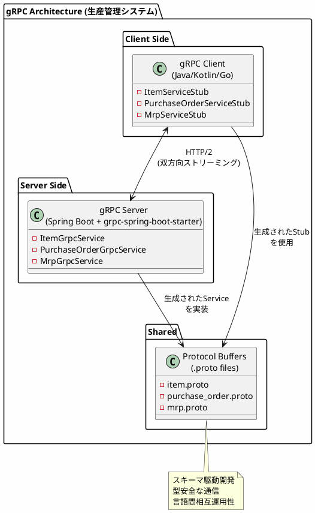
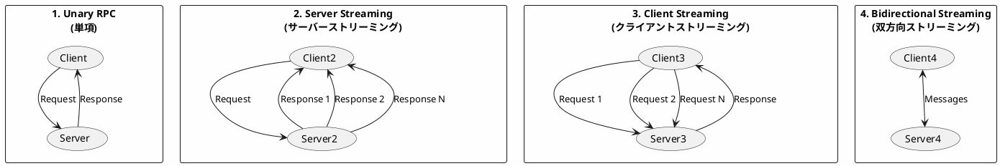
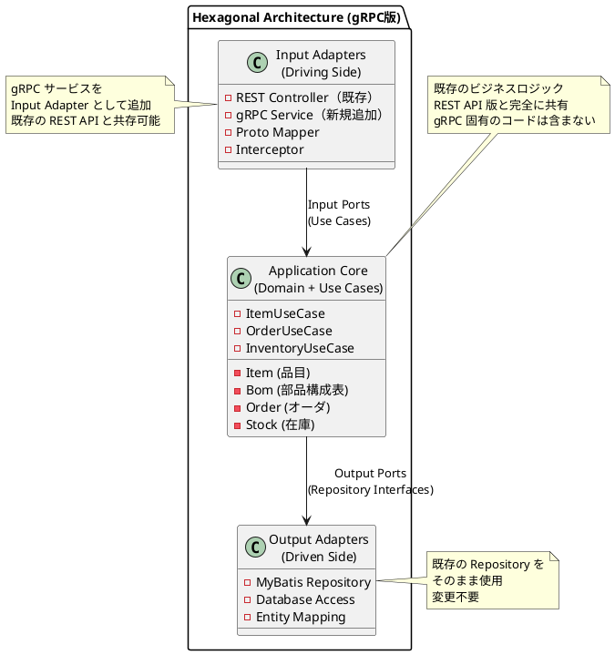

# 実践データベース設計：生産管理システム 研究 3 - gRPC サービスの実装

## はじめに

本研究では、API サーバー構成（第32章）とは異なるアプローチとして、**gRPC** による生産管理システムを実装します。Protocol Buffers によるスキーマ駆動開発と HTTP/2 の双方向ストリーミングを活用した、高性能な API を構築します。

第32章で構築したヘキサゴナルアーキテクチャ（ドメイン層・アプリケーション層）はそのまま共有し、**Input Adapter として gRPC サービス層のみを追加**します。

---

## 第42章：gRPC サーバーの基礎

### 42.1 gRPC とは

gRPC は Google が開発した高性能な RPC（Remote Procedure Call）フレームワークです。Protocol Buffers をインターフェース定義言語（IDL）として使用し、HTTP/2 上で動作します。



**REST API との比較：**

| 特徴 | REST API | gRPC |
|------|----------|------|
| プロトコル | HTTP/1.1 | HTTP/2 |
| データ形式 | JSON (テキスト) | Protocol Buffers (バイナリ) |
| スキーマ | OpenAPI (任意) | .proto (必須) |
| ストリーミング | WebSocket 別実装 | ネイティブサポート |
| コード生成 | 手動/ツール | 自動生成 |
| パフォーマンス | 標準 | 高速 |

### 42.2 4つの通信パターン

gRPC は 4 つの通信パターンをサポートします：



**用途：**

1. **Unary RPC**: 通常の API 呼び出し（CRUD 操作）
2. **Server Streaming**: 大量データの配信（MRP 実行結果）
3. **Client Streaming**: バッチ登録（複数品目の一括登録）
4. **Bidirectional Streaming**: リアルタイム通信（進捗監視）

### 42.3 gRPC におけるヘキサゴナルアーキテクチャ

gRPC を導入しても、第32章で構築したヘキサゴナルアーキテクチャ（ドメイン層・アプリケーション層）はそのまま共有し、**Input Adapter として gRPC サービス層のみを追加**します。



**gRPC でもヘキサゴナルアーキテクチャを維持する理由：**

1. **再利用性**: 既存の UseCase/Repository をそのまま活用
2. **並行運用**: REST API と gRPC API の両方を提供可能
3. **テスト容易性**: ドメインロジックは通信プロトコルに依存しない
4. **移行容易性**: 段階的に REST から gRPC へ移行可能

### 42.4 ディレクトリ構成

既存の構成に `infrastructure/grpc/` を追加するだけです。

```
src/main/java/com/example/production/
├── domain/                     # ドメイン層（API版と共通）
│   ├── model/
│   │   ├── item/
│   │   ├── bom/
│   │   ├── order/
│   │   └── inventory/
│   └── exception/
│
├── application/               # アプリケーション層（API版と共通）
│   ├── port/
│   │   ├── in/               # Input Port（ユースケース）
│   │   └── out/              # Output Port（リポジトリ）
│   └── service/
│
├── infrastructure/
│   ├── persistence/          # Output Adapter（DB実装）- 既存
│   │   ├── mapper/
│   │   └── repository/
│   ├── rest/                 # Input Adapter（REST実装）- 既存
│   │   ├── controller/
│   │   ├── dto/
│   │   └── exception/
│   └── grpc/                 # Input Adapter（gRPC実装）- 新規追加
│       ├── service/          # gRPC Service 実装
│       ├── mapper/           # Proto ⇔ Domain 変換
│       └── interceptor/      # 共通処理（ログ、エラー等）
│
├── config/
│
└── src/main/proto/            # Protocol Buffers 定義
    ├── common.proto
    ├── item.proto
    ├── bom.proto
    ├── purchase_order.proto
    └── mrp.proto
```

### 42.5 技術スタックの追加

既存の `build.gradle.kts` に gRPC 関連の依存関係を追加します。

<details>
<summary>build.gradle.kts（差分）</summary>

```kotlin
import com.google.protobuf.gradle.*

plugins {
    // 既存のプラグイン...
    id("com.google.protobuf") version "0.9.4"  // 追加
}

dependencies {
    // 既存の依存関係（Spring Boot, MyBatis, PostgreSQL等）はそのまま

    // gRPC 関連を追加
    implementation("net.devh:grpc-spring-boot-starter:3.0.0.RELEASE")
    implementation("io.grpc:grpc-protobuf:1.60.0")
    implementation("io.grpc:grpc-stub:1.60.0")
    implementation("io.grpc:grpc-services:1.60.0")  // Health check, Reflection

    // Protocol Buffers
    implementation("com.google.protobuf:protobuf-java:3.25.1")
    implementation("com.google.protobuf:protobuf-java-util:3.25.1")

    // Test
    testImplementation("io.grpc:grpc-testing:1.60.0")
}

// Protocol Buffers コンパイル設定
protobuf {
    protoc {
        artifact = "com.google.protobuf:protoc:3.25.1"
    }
    plugins {
        id("grpc") {
            artifact = "io.grpc:protoc-gen-grpc-java:1.60.0"
        }
    }
    generateProtoTasks {
        all().forEach { task ->
            task.plugins {
                id("grpc")
            }
        }
    }
}
```

</details>

**追加パッケージの説明：**

| パッケージ | 用途 |
|-----------|------|
| grpc-spring-boot-starter | Spring Boot との統合 |
| grpc-protobuf | Protocol Buffers サポート |
| grpc-services | ヘルスチェック、リフレクション |
| protobuf-java-util | JSON ⇔ Proto 変換 |

### 38.6 Protocol Buffers 定義

<details>
<summary>src/main/proto/common.proto</summary>

```protobuf
syntax = "proto3";

package production;

option java_package = "com.example.production.grpc";
option java_multiple_files = true;

// 共通メッセージ

message Empty {}

message Timestamp {
  int64 seconds = 1;
  int32 nanos = 2;
}

message Date {
  int32 year = 1;
  int32 month = 2;
  int32 day = 3;
}

message Decimal {
  string value = 1;  // 文字列で精度を維持
}

message PageRequest {
  int32 page = 1;
  int32 size = 2;
}

message PageResponse {
  int32 total_elements = 1;
  int32 total_pages = 2;
  int32 current_page = 3;
}

// エラーレスポンス
message ErrorDetail {
  string code = 1;
  string message = 2;
  map<string, string> metadata = 3;
}
```

</details>

<details>
<summary>src/main/proto/item.proto</summary>

```protobuf
syntax = "proto3";

package production;

import "common.proto";

option java_package = "com.example.production.grpc";
option java_multiple_files = true;

// 品目区分
enum ItemCategory {
  ITEM_CATEGORY_UNSPECIFIED = 0;
  PRODUCT = 1;      // 製品
  SEMI_PRODUCT = 2; // 半製品
  PART = 3;         // 部品
  MATERIAL = 4;     // 材料
}

// 品目メッセージ
message Item {
  string item_code = 1;
  Date effective_date = 2;
  string item_name = 3;
  ItemCategory category = 4;
  string item_group_code = 5;
  string unit_code = 6;
  string location_code = 7;
  int32 lead_time = 8;
  int32 safety_stock = 9;
}

// リクエスト/レスポンス
message GetItemRequest {
  string item_code = 1;
}

message GetItemsRequest {
  ItemCategory category = 1;  // optional filter
  PageRequest page = 2;
}

message GetItemsResponse {
  repeated Item items = 1;
  PageResponse page = 2;
}

message CreateItemRequest {
  string item_code = 1;
  string item_name = 2;
  ItemCategory category = 3;
  string item_group_code = 4;
  string unit_code = 5;
  string location_code = 6;
  int32 lead_time = 7;
  int32 safety_stock = 8;
}

message UpdateItemRequest {
  string item_code = 1;
  string item_name = 2;
  ItemCategory category = 3;
  int32 lead_time = 4;
  int32 safety_stock = 5;
}

message DeleteItemRequest {
  string item_code = 1;
}

message BatchCreateResponse {
  int32 success_count = 1;
  int32 failed_count = 2;
  repeated string failed_codes = 3;
}

// 品目サービス
service ItemService {
  // Unary RPC
  rpc GetItem(GetItemRequest) returns (Item);
  rpc CreateItem(CreateItemRequest) returns (Item);
  rpc UpdateItem(UpdateItemRequest) returns (Item);
  rpc DeleteItem(DeleteItemRequest) returns (Empty);

  // Server Streaming - 品目一覧のストリーム配信
  rpc StreamItems(GetItemsRequest) returns (stream Item);

  // Client Streaming - バッチ登録
  rpc BatchCreateItems(stream CreateItemRequest) returns (BatchCreateResponse);
}
```

</details>

### 38.7 API サーバー版との Controller の違い

**API サーバー版（REST Controller）**

```java
@RestController  // JSON を返す
@RequestMapping("/api/items")
public class ItemApiController {

    private final ItemUseCase itemUseCase;  // 共有

    @GetMapping("/{itemCode}")
    public ResponseEntity<ItemResponse> getItem(@PathVariable String itemCode) {
        Item item = itemUseCase.getItemByCode(itemCode);
        return ResponseEntity.ok(ItemResponse.from(item));
    }
}
```

**gRPC 版（gRPC Service）**

```java
@GrpcService  // gRPC サービスとして公開
public class ItemGrpcService extends ItemServiceGrpc.ItemServiceImplBase {

    private final ItemUseCase itemUseCase;  // 共有（同じインスタンス）
    private final ProtoMapper mapper;

    @Override
    public void getItem(GetItemRequest request,
                        StreamObserver<Item> responseObserver) {
        // 同じ UseCase を呼び出し
        var item = itemUseCase.getItemByCode(request.getItemCode());
        responseObserver.onNext(mapper.toProto(item));
        responseObserver.onCompleted();
    }
}
```

**共通点と相違点：**

| 観点 | REST Controller | gRPC Service |
|------|-----------------|--------------|
| **UseCase** | 共有（同一インスタンス） | 共有（同一インスタンス） |
| **アノテーション** | `@RestController` | `@GrpcService` |
| **リクエスト** | DTO（JSON） | Proto Message |
| **レスポンス** | `ResponseEntity<T>` | `StreamObserver<T>` |
| **変換** | DTO ⇔ Domain | Proto ⇔ Domain |
| **エラー処理** | 例外ハンドラ | `Status` + `onError` |

---

## 第43章：マスタ API の実装

### 43.1 Proto マッパーの実装

既存のドメインモデルと Protocol Buffers メッセージ間の変換を行います。

<details>
<summary>ProtoMapper.java</summary>

```java
package com.example.production.infrastructure.grpc.mapper;

import com.example.production.domain.model.item.Item;
import com.example.production.domain.model.item.ItemCategory;
import com.example.production.grpc.*;
import org.springframework.stereotype.Component;

import java.math.BigDecimal;
import java.time.LocalDate;

/**
 * ドメインモデルと Protocol Buffers メッセージ間の変換
 */
@Component
public class ProtoMapper {

    // ========== Item ==========

    public com.example.production.grpc.Item toProto(Item domain) {
        return com.example.production.grpc.Item.newBuilder()
            .setItemCode(domain.getItemCode())
            .setEffectiveDate(toProtoDate(domain.getEffectiveDate()))
            .setItemName(domain.getItemName())
            .setCategory(toProtoCategory(domain.getCategory()))
            .setItemGroupCode(nullToEmpty(domain.getItemGroupCode()))
            .setUnitCode(nullToEmpty(domain.getUnitCode()))
            .setLocationCode(nullToEmpty(domain.getLocationCode()))
            .setLeadTime(nullToZero(domain.getLeadTime()))
            .setSafetyStock(nullToZero(domain.getSafetyStock()))
            .build();
    }

    public Item toDomain(CreateItemRequest request) {
        return Item.builder()
            .itemCode(request.getItemCode())
            .effectiveDate(LocalDate.now())
            .itemName(request.getItemName())
            .category(toDomainCategory(request.getCategory()))
            .itemGroupCode(emptyToNull(request.getItemGroupCode()))
            .unitCode(emptyToNull(request.getUnitCode()))
            .locationCode(emptyToNull(request.getLocationCode()))
            .leadTime(zeroToNull(request.getLeadTime()))
            .safetyStock(zeroToNull(request.getSafetyStock()))
            .build();
    }

    // ========== Date ==========

    public Date toProtoDate(LocalDate date) {
        if (date == null) {
            return Date.getDefaultInstance();
        }
        return Date.newBuilder()
            .setYear(date.getYear())
            .setMonth(date.getMonthValue())
            .setDay(date.getDayOfMonth())
            .build();
    }

    public LocalDate toDomainDate(Date protoDate) {
        if (protoDate.getYear() == 0) {
            return null;
        }
        return LocalDate.of(
            protoDate.getYear(),
            protoDate.getMonth(),
            protoDate.getDay()
        );
    }

    // ========== Decimal ==========

    public Decimal toProtoDecimal(BigDecimal value) {
        if (value == null) {
            return Decimal.getDefaultInstance();
        }
        return Decimal.newBuilder()
            .setValue(value.toPlainString())
            .build();
    }

    public BigDecimal toDomainDecimal(Decimal protoDecimal) {
        if (protoDecimal.getValue().isEmpty()) {
            return null;
        }
        return new BigDecimal(protoDecimal.getValue());
    }

    // ========== ItemCategory ==========

    public com.example.production.grpc.ItemCategory toProtoCategory(ItemCategory domain) {
        if (domain == null) {
            return com.example.production.grpc.ItemCategory.ITEM_CATEGORY_UNSPECIFIED;
        }
        return switch (domain) {
            case PRODUCT -> com.example.production.grpc.ItemCategory.PRODUCT;
            case SEMI_PRODUCT -> com.example.production.grpc.ItemCategory.SEMI_PRODUCT;
            case PART -> com.example.production.grpc.ItemCategory.PART;
            case MATERIAL -> com.example.production.grpc.ItemCategory.MATERIAL;
        };
    }

    public ItemCategory toDomainCategory(com.example.production.grpc.ItemCategory proto) {
        return switch (proto) {
            case PRODUCT -> ItemCategory.PRODUCT;
            case SEMI_PRODUCT -> ItemCategory.SEMI_PRODUCT;
            case PART -> ItemCategory.PART;
            case MATERIAL -> ItemCategory.MATERIAL;
            default -> null;
        };
    }

    // ========== Utility ==========

    private String nullToEmpty(String value) {
        return value == null ? "" : value;
    }

    private String emptyToNull(String value) {
        return value == null || value.isEmpty() ? null : value;
    }

    private int nullToZero(Integer value) {
        return value == null ? 0 : value;
    }

    private Integer zeroToNull(int value) {
        return value == 0 ? null : value;
    }
}
```

</details>

### 43.2 品目 gRPC サービスの TDD 実装

#### Red: 失敗するテストを書く

<details>
<summary>ItemGrpcServiceTest.java</summary>

```java
package com.example.production.infrastructure.grpc.service;

import com.example.production.domain.model.item.Item;
import com.example.production.domain.model.item.ItemCategory;
import com.example.production.grpc.*;
import com.example.production.infrastructure.persistence.mapper.ItemMapper;
import io.grpc.ManagedChannel;
import io.grpc.ManagedChannelBuilder;
import io.grpc.StatusRuntimeException;
import org.junit.jupiter.api.*;
import org.springframework.beans.factory.annotation.Autowired;
import org.springframework.boot.test.context.SpringBootTest;
import org.springframework.test.context.DynamicPropertyRegistry;
import org.springframework.test.context.DynamicPropertySource;
import org.testcontainers.containers.PostgreSQLContainer;
import org.testcontainers.junit.jupiter.Container;
import org.testcontainers.junit.jupiter.Testcontainers;

import java.time.LocalDate;
import java.util.ArrayList;
import java.util.Iterator;
import java.util.List;
import java.util.concurrent.CountDownLatch;
import java.util.concurrent.TimeUnit;

import static org.assertj.core.api.Assertions.*;

@SpringBootTest(properties = {
    "grpc.server.port=9090",
    "grpc.server.in-process-name=test"
})
@Testcontainers
@DisplayName("品目 gRPC サービス")
class ItemGrpcServiceTest {

    @Container
    static PostgreSQLContainer<?> postgres = new PostgreSQLContainer<>("postgres:16")
        .withDatabaseName("production_test")
        .withUsername("test")
        .withPassword("test");

    @DynamicPropertySource
    static void configureProperties(DynamicPropertyRegistry registry) {
        registry.add("spring.datasource.url", postgres::getJdbcUrl);
        registry.add("spring.datasource.username", postgres::getUsername);
        registry.add("spring.datasource.password", postgres::getPassword);
    }

    @Autowired
    private ItemMapper itemMapper;

    private ManagedChannel channel;
    private ItemServiceGrpc.ItemServiceBlockingStub blockingStub;
    private ItemServiceGrpc.ItemServiceStub asyncStub;

    @BeforeEach
    void setUp() {
        channel = ManagedChannelBuilder.forAddress("localhost", 9090)
            .usePlaintext()
            .build();
        blockingStub = ItemServiceGrpc.newBlockingStub(channel);
        asyncStub = ItemServiceGrpc.newStub(channel);

        // テストデータをクリア
        itemMapper.deleteAll();
    }

    @AfterEach
    void tearDown() {
        channel.shutdownNow();
    }

    @Nested
    @DisplayName("GetItem (Unary)")
    class GetItemTests {

        @Test
        @DisplayName("品目コードで品目を取得できる")
        void shouldGetItemByCode() {
            // Arrange
            insertTestItem("PROD-001", "テスト製品", ItemCategory.PRODUCT);

            // Act
            var request = GetItemRequest.newBuilder()
                .setItemCode("PROD-001")
                .build();
            var response = blockingStub.getItem(request);

            // Assert
            assertThat(response.getItemCode()).isEqualTo("PROD-001");
            assertThat(response.getItemName()).isEqualTo("テスト製品");
            assertThat(response.getCategory())
                .isEqualTo(com.example.production.grpc.ItemCategory.PRODUCT);
        }

        @Test
        @DisplayName("存在しない品目はNOT_FOUNDを返す")
        void shouldThrowNotFoundForNonExistentItem() {
            var request = GetItemRequest.newBuilder()
                .setItemCode("NOT-EXIST")
                .build();

            assertThatThrownBy(() -> blockingStub.getItem(request))
                .isInstanceOf(StatusRuntimeException.class)
                .hasMessageContaining("NOT_FOUND");
        }
    }

    @Nested
    @DisplayName("StreamItems (Server Streaming)")
    class StreamItemsTests {

        @Test
        @DisplayName("品目一覧をストリームで取得できる")
        void shouldStreamItems() {
            // Arrange
            for (int i = 1; i <= 5; i++) {
                insertTestItem("ITEM-" + String.format("%03d", i),
                    "品目" + i, ItemCategory.PRODUCT);
            }

            // Act
            var request = GetItemsRequest.newBuilder().build();
            Iterator<com.example.production.grpc.Item> iterator =
                blockingStub.streamItems(request);

            // Assert
            List<com.example.production.grpc.Item> items = new ArrayList<>();
            iterator.forEachRemaining(items::add);

            assertThat(items).hasSize(5);
        }
    }

    @Nested
    @DisplayName("BatchCreateItems (Client Streaming)")
    class BatchCreateItemsTests {

        @Test
        @DisplayName("バッチで品目を登録できる")
        void shouldBatchCreateItems() throws InterruptedException {
            CountDownLatch latch = new CountDownLatch(1);
            final BatchCreateResponse[] result = new BatchCreateResponse[1];

            var requestObserver = asyncStub.batchCreateItems(
                new io.grpc.stub.StreamObserver<BatchCreateResponse>() {
                    @Override
                    public void onNext(BatchCreateResponse response) {
                        result[0] = response;
                    }

                    @Override
                    public void onError(Throwable t) {
                        latch.countDown();
                    }

                    @Override
                    public void onCompleted() {
                        latch.countDown();
                    }
                });

            // Act - 3件の品目を送信
            for (int i = 1; i <= 3; i++) {
                requestObserver.onNext(CreateItemRequest.newBuilder()
                    .setItemCode("BATCH-" + String.format("%03d", i))
                    .setItemName("バッチ品目" + i)
                    .setCategory(com.example.production.grpc.ItemCategory.PRODUCT)
                    .build());
            }
            requestObserver.onCompleted();

            // Assert
            assertThat(latch.await(5, TimeUnit.SECONDS)).isTrue();
            assertThat(result[0].getSuccessCount()).isEqualTo(3);
        }
    }

    private void insertTestItem(String code, String name, ItemCategory category) {
        itemMapper.insert(Item.builder()
            .itemCode(code)
            .effectiveDate(LocalDate.of(2025, 1, 1))
            .itemName(name)
            .category(category)
            .build());
    }
}
```

</details>

#### Green: gRPC サービスの実装

<details>
<summary>ItemGrpcService.java</summary>

```java
package com.example.production.infrastructure.grpc.service;

import com.example.production.application.port.in.*;
import com.example.production.domain.exception.DuplicateItemException;
import com.example.production.domain.exception.ItemNotFoundException;
import com.example.production.domain.model.item.Item;
import com.example.production.grpc.*;
import com.example.production.infrastructure.grpc.mapper.ProtoMapper;
import io.grpc.Status;
import io.grpc.stub.StreamObserver;
import net.devh.boot.grpc.server.service.GrpcService;
import org.springframework.transaction.annotation.Transactional;

import java.util.ArrayList;
import java.util.List;

/**
 * 品目 gRPC サービス実装
 * 既存の ItemUseCase を Input Adapter として呼び出す
 */
@GrpcService
public class ItemGrpcService extends ItemServiceGrpc.ItemServiceImplBase {

    private final ItemUseCase itemUseCase;  // 既存の UseCase を注入
    private final ProtoMapper mapper;

    public ItemGrpcService(ItemUseCase itemUseCase, ProtoMapper mapper) {
        this.itemUseCase = itemUseCase;
        this.mapper = mapper;
    }

    /**
     * 品目取得（Unary RPC）
     */
    @Override
    public void getItem(GetItemRequest request,
                        StreamObserver<com.example.production.grpc.Item> responseObserver) {
        try {
            // 既存の UseCase を呼び出し
            Item item = itemUseCase.getItemByCode(request.getItemCode());
            responseObserver.onNext(mapper.toProto(item));
            responseObserver.onCompleted();
        } catch (ItemNotFoundException e) {
            responseObserver.onError(Status.NOT_FOUND
                .withDescription(e.getMessage())
                .asRuntimeException());
        }
    }

    /**
     * 品目登録（Unary RPC）
     */
    @Override
    @Transactional
    public void createItem(CreateItemRequest request,
                           StreamObserver<com.example.production.grpc.Item> responseObserver) {
        try {
            // Proto → Command 変換
            CreateItemCommand command = CreateItemCommand.builder()
                .itemCode(request.getItemCode())
                .itemName(request.getItemName())
                .category(mapper.toDomainCategory(request.getCategory()))
                .itemGroupCode(emptyToNull(request.getItemGroupCode()))
                .unitCode(emptyToNull(request.getUnitCode()))
                .locationCode(emptyToNull(request.getLocationCode()))
                .leadTime(zeroToNull(request.getLeadTime()))
                .safetyStock(zeroToNull(request.getSafetyStock()))
                .build();

            // 既存の UseCase を呼び出し
            Item item = itemUseCase.createItem(command);
            responseObserver.onNext(mapper.toProto(item));
            responseObserver.onCompleted();
        } catch (DuplicateItemException e) {
            responseObserver.onError(Status.ALREADY_EXISTS
                .withDescription(e.getMessage())
                .asRuntimeException());
        }
    }

    /**
     * 品目更新（Unary RPC）
     */
    @Override
    @Transactional
    public void updateItem(UpdateItemRequest request,
                           StreamObserver<com.example.production.grpc.Item> responseObserver) {
        try {
            UpdateItemCommand command = UpdateItemCommand.builder()
                .itemCode(request.getItemCode())
                .itemName(emptyToNull(request.getItemName()))
                .category(mapper.toDomainCategory(request.getCategory()))
                .leadTime(zeroToNull(request.getLeadTime()))
                .safetyStock(zeroToNull(request.getSafetyStock()))
                .build();

            Item item = itemUseCase.updateItem(command);
            responseObserver.onNext(mapper.toProto(item));
            responseObserver.onCompleted();
        } catch (ItemNotFoundException e) {
            responseObserver.onError(Status.NOT_FOUND
                .withDescription(e.getMessage())
                .asRuntimeException());
        }
    }

    /**
     * 品目削除（Unary RPC）
     */
    @Override
    @Transactional
    public void deleteItem(DeleteItemRequest request,
                           StreamObserver<Empty> responseObserver) {
        try {
            itemUseCase.deleteItem(request.getItemCode());
            responseObserver.onNext(Empty.getDefaultInstance());
            responseObserver.onCompleted();
        } catch (ItemNotFoundException e) {
            responseObserver.onError(Status.NOT_FOUND
                .withDescription(e.getMessage())
                .asRuntimeException());
        }
    }

    /**
     * 品目一覧のストリーム配信（Server Streaming RPC）
     */
    @Override
    public void streamItems(GetItemsRequest request,
                            StreamObserver<com.example.production.grpc.Item> responseObserver) {
        try {
            List<Item> items;

            if (request.getCategory() !=
                    com.example.production.grpc.ItemCategory.ITEM_CATEGORY_UNSPECIFIED) {
                items = itemUseCase.getItemsByCategory(
                    mapper.toDomainCategory(request.getCategory()));
            } else {
                items = itemUseCase.getAllItems();
            }

            // ストリーミング配信
            for (Item item : items) {
                responseObserver.onNext(mapper.toProto(item));
            }
            responseObserver.onCompleted();
        } catch (Exception e) {
            responseObserver.onError(Status.INTERNAL
                .withDescription(e.getMessage())
                .asRuntimeException());
        }
    }

    /**
     * バッチ登録（Client Streaming RPC）
     */
    @Override
    @Transactional
    public StreamObserver<CreateItemRequest> batchCreateItems(
            StreamObserver<BatchCreateResponse> responseObserver) {

        return new StreamObserver<>() {
            private final List<String> successCodes = new ArrayList<>();
            private final List<String> failedCodes = new ArrayList<>();

            @Override
            public void onNext(CreateItemRequest request) {
                try {
                    CreateItemCommand command = CreateItemCommand.builder()
                        .itemCode(request.getItemCode())
                        .itemName(request.getItemName())
                        .category(mapper.toDomainCategory(request.getCategory()))
                        .build();

                    itemUseCase.createItem(command);
                    successCodes.add(request.getItemCode());
                } catch (Exception e) {
                    failedCodes.add(request.getItemCode());
                }
            }

            @Override
            public void onError(Throwable t) {
                responseObserver.onError(Status.INTERNAL
                    .withDescription(t.getMessage())
                    .asRuntimeException());
            }

            @Override
            public void onCompleted() {
                responseObserver.onNext(BatchCreateResponse.newBuilder()
                    .setSuccessCount(successCodes.size())
                    .setFailedCount(failedCodes.size())
                    .addAllFailedCodes(failedCodes)
                    .build());
                responseObserver.onCompleted();
            }
        };
    }

    private String emptyToNull(String value) {
        return value == null || value.isEmpty() ? null : value;
    }

    private Integer zeroToNull(int value) {
        return value == 0 ? null : value;
    }
}
```

</details>

### 43.3 BOM gRPC サービスの実装

<details>
<summary>BomGrpcService.java</summary>

```java
package com.example.production.infrastructure.grpc.service;

import com.example.production.application.service.BomNode;
import com.example.production.application.service.BomService;
import com.example.production.application.service.WhereUsedResult;
import com.example.production.grpc.*;
import com.example.production.infrastructure.grpc.mapper.ProtoMapper;
import io.grpc.Status;
import io.grpc.stub.StreamObserver;
import net.devh.boot.grpc.server.service.GrpcService;

import java.util.List;

/**
 * BOM gRPC サービス実装
 * 既存の BomService を Input Adapter として呼び出す
 */
@GrpcService
public class BomGrpcService extends BomServiceGrpc.BomServiceImplBase {

    private final BomService bomService;  // 既存のサービスを注入
    private final ProtoMapper mapper;

    public BomGrpcService(BomService bomService, ProtoMapper mapper) {
        this.bomService = bomService;
        this.mapper = mapper;
    }

    /**
     * 部品展開（Server Streaming）
     */
    @Override
    public void explodeBom(ExplodeBomRequest request,
                           StreamObserver<com.example.production.grpc.BomNode> responseObserver) {
        try {
            BomNode root = bomService.explodeBom(request.getItemCode());

            // 深さ優先でストリーミング配信
            streamBomNode(root, responseObserver);
            responseObserver.onCompleted();
        } catch (Exception e) {
            responseObserver.onError(Status.INTERNAL
                .withDescription(e.getMessage())
                .asRuntimeException());
        }
    }

    private void streamBomNode(BomNode node,
                               StreamObserver<com.example.production.grpc.BomNode> observer) {
        observer.onNext(toProtoBomNode(node));

        if (node.getChildren() != null) {
            for (BomNode child : node.getChildren()) {
                streamBomNode(child, observer);
            }
        }
    }

    private com.example.production.grpc.BomNode toProtoBomNode(BomNode domain) {
        var builder = com.example.production.grpc.BomNode.newBuilder()
            .setItemCode(domain.getItemCode())
            .setItemName(domain.getItemName())
            .setRequiredQuantity(mapper.toProtoDecimal(domain.getRequiredQuantity()))
            .setLevel(domain.getLevel());

        if (domain.getChildren() != null) {
            for (BomNode child : domain.getChildren()) {
                builder.addChildren(toProtoBomNode(child));
            }
        }

        return builder.build();
    }

    /**
     * 使用先照会
     */
    @Override
    public void whereUsed(WhereUsedRequest request,
                          StreamObserver<WhereUsedResponse> responseObserver) {
        try {
            List<WhereUsedResult> results = bomService.whereUsed(request.getItemCode());

            var response = WhereUsedResponse.newBuilder();
            for (WhereUsedResult result : results) {
                response.addResults(com.example.production.grpc.WhereUsedResult.newBuilder()
                    .setParentItemCode(result.getParentItemCode())
                    .setItemName(result.getItemName())
                    .setRequiredQuantity(mapper.toProtoDecimal(result.getRequiredQuantity()))
                    .build());
            }

            responseObserver.onNext(response.build());
            responseObserver.onCompleted();
        } catch (Exception e) {
            responseObserver.onError(Status.INTERNAL
                .withDescription(e.getMessage())
                .asRuntimeException());
        }
    }
}
```

</details>

---

## 第44章：トランザクション API の実装

### 44.1 発注 gRPC サービス

<details>
<summary>src/main/proto/purchase_order.proto</summary>

```protobuf
syntax = "proto3";

package production;

import "common.proto";

option java_package = "com.example.production.grpc";
option java_multiple_files = true;

// 発注ステータス
enum OrderStatus {
  ORDER_STATUS_UNSPECIFIED = 0;
  DRAFT = 1;
  CONFIRMED = 2;
  CANCELLED = 3;
  COMPLETED = 4;
}

// 発注ヘッダ
message PurchaseOrder {
  string order_number = 1;
  string supplier_code = 2;
  Date order_date = 3;
  OrderStatus status = 4;
  repeated PurchaseOrderDetail details = 5;
  Decimal total_amount = 6;
}

// 発注明細
message PurchaseOrderDetail {
  int32 line_number = 1;
  string item_code = 2;
  Decimal order_quantity = 3;
  Decimal unit_price = 4;
  Date delivery_date = 5;
  Decimal received_quantity = 6;
}

// リクエスト
message GetOrderRequest {
  string order_number = 1;
}

message GetOrdersRequest {
  OrderStatus status = 1;
  PageRequest page = 2;
}

message CreateOrderRequest {
  string supplier_code = 1;
  repeated CreateOrderDetailRequest details = 2;
}

message CreateOrderDetailRequest {
  string item_code = 1;
  Decimal order_quantity = 2;
  Decimal unit_price = 3;
  Date delivery_date = 4;
}

message ConfirmOrderRequest {
  string order_number = 1;
}

// 入荷登録（双方向ストリーミング）
message RecordReceivingRequest {
  string order_number = 1;
  int32 line_number = 2;
  Decimal received_quantity = 3;
  Date receiving_date = 4;
}

message RecordReceivingResponse {
  string order_number = 1;
  int32 line_number = 2;
  Decimal total_received = 3;
  bool is_completed = 4;
}

// 発注サービス
service PurchaseOrderService {
  rpc GetOrder(GetOrderRequest) returns (PurchaseOrder);
  rpc StreamOrders(GetOrdersRequest) returns (stream PurchaseOrder);
  rpc CreateOrder(CreateOrderRequest) returns (PurchaseOrder);
  rpc ConfirmOrder(ConfirmOrderRequest) returns (PurchaseOrder);
  rpc CancelOrder(GetOrderRequest) returns (Empty);

  // 入荷登録（双方向ストリーミング）
  rpc RecordReceiving(stream RecordReceivingRequest) returns (stream RecordReceivingResponse);
}
```

</details>

<details>
<summary>PurchaseOrderGrpcService.java</summary>

```java
package com.example.production.infrastructure.grpc.service;

import com.example.production.application.port.in.*;
import com.example.production.domain.model.purchase.PurchaseOrder;
import com.example.production.grpc.*;
import com.example.production.infrastructure.grpc.mapper.ProtoMapper;
import io.grpc.Status;
import io.grpc.stub.StreamObserver;
import net.devh.boot.grpc.server.service.GrpcService;
import org.springframework.transaction.annotation.Transactional;

import java.util.List;

/**
 * 発注 gRPC サービス実装
 * 既存の PurchaseOrderUseCase を Input Adapter として呼び出す
 */
@GrpcService
public class PurchaseOrderGrpcService
        extends PurchaseOrderServiceGrpc.PurchaseOrderServiceImplBase {

    private final PurchaseOrderUseCase useCase;  // 既存の UseCase
    private final ProtoMapper mapper;

    public PurchaseOrderGrpcService(PurchaseOrderUseCase useCase, ProtoMapper mapper) {
        this.useCase = useCase;
        this.mapper = mapper;
    }

    @Override
    public void getOrder(GetOrderRequest request,
                         StreamObserver<com.example.production.grpc.PurchaseOrder> responseObserver) {
        try {
            PurchaseOrder order = useCase.getOrder(request.getOrderNumber());
            responseObserver.onNext(toProto(order));
            responseObserver.onCompleted();
        } catch (Exception e) {
            responseObserver.onError(Status.NOT_FOUND
                .withDescription(e.getMessage())
                .asRuntimeException());
        }
    }

    @Override
    public void streamOrders(GetOrdersRequest request,
                             StreamObserver<com.example.production.grpc.PurchaseOrder> responseObserver) {
        try {
            List<PurchaseOrder> orders = useCase.getAllOrders();

            for (PurchaseOrder order : orders) {
                responseObserver.onNext(toProto(order));
            }
            responseObserver.onCompleted();
        } catch (Exception e) {
            responseObserver.onError(Status.INTERNAL
                .withDescription(e.getMessage())
                .asRuntimeException());
        }
    }

    @Override
    @Transactional
    public void createOrder(CreateOrderRequest request,
                            StreamObserver<com.example.production.grpc.PurchaseOrder> responseObserver) {
        try {
            CreatePurchaseOrderCommand command = CreatePurchaseOrderCommand.builder()
                .supplierCode(request.getSupplierCode())
                .details(request.getDetailsList().stream()
                    .map(d -> CreatePurchaseOrderCommand.PurchaseOrderDetailCommand.builder()
                        .itemCode(d.getItemCode())
                        .orderQuantity(mapper.toDomainDecimal(d.getOrderQuantity()))
                        .unitPrice(mapper.toDomainDecimal(d.getUnitPrice()))
                        .deliveryDate(mapper.toDomainDate(d.getDeliveryDate()))
                        .build())
                    .toList())
                .build();

            PurchaseOrder order = useCase.createOrder(command);
            responseObserver.onNext(toProto(order));
            responseObserver.onCompleted();
        } catch (Exception e) {
            responseObserver.onError(Status.INTERNAL
                .withDescription(e.getMessage())
                .asRuntimeException());
        }
    }

    /**
     * 入荷登録（双方向ストリーミング）
     */
    @Override
    public StreamObserver<RecordReceivingRequest> recordReceiving(
            StreamObserver<RecordReceivingResponse> responseObserver) {

        return new StreamObserver<>() {
            @Override
            public void onNext(RecordReceivingRequest request) {
                try {
                    var result = useCase.recordReceiving(
                        request.getOrderNumber(),
                        request.getLineNumber(),
                        mapper.toDomainDecimal(request.getReceivedQuantity()),
                        mapper.toDomainDate(request.getReceivingDate())
                    );

                    // 即座にレスポンス
                    responseObserver.onNext(RecordReceivingResponse.newBuilder()
                        .setOrderNumber(request.getOrderNumber())
                        .setLineNumber(request.getLineNumber())
                        .setTotalReceived(mapper.toProtoDecimal(result.getTotalReceived()))
                        .setIsCompleted(result.isCompleted())
                        .build());
                } catch (Exception e) {
                    responseObserver.onNext(RecordReceivingResponse.newBuilder()
                        .setOrderNumber(request.getOrderNumber())
                        .setLineNumber(request.getLineNumber())
                        .setIsCompleted(false)
                        .build());
                }
            }

            @Override
            public void onError(Throwable t) {
                responseObserver.onError(Status.INTERNAL
                    .withDescription(t.getMessage())
                    .asRuntimeException());
            }

            @Override
            public void onCompleted() {
                responseObserver.onCompleted();
            }
        };
    }

    private com.example.production.grpc.PurchaseOrder toProto(PurchaseOrder domain) {
        var builder = com.example.production.grpc.PurchaseOrder.newBuilder()
            .setOrderNumber(domain.getOrderNumber())
            .setSupplierCode(domain.getSupplierCode())
            .setOrderDate(mapper.toProtoDate(domain.getOrderDate()))
            .setStatus(toProtoStatus(domain.getStatus()))
            .setTotalAmount(mapper.toProtoDecimal(domain.getTotalAmount()));

        if (domain.getDetails() != null) {
            for (var detail : domain.getDetails()) {
                builder.addDetails(PurchaseOrderDetail.newBuilder()
                    .setLineNumber(detail.getLineNumber())
                    .setItemCode(detail.getItemCode())
                    .setOrderQuantity(mapper.toProtoDecimal(detail.getOrderQuantity()))
                    .setUnitPrice(mapper.toProtoDecimal(detail.getUnitPrice()))
                    .setDeliveryDate(mapper.toProtoDate(detail.getDeliveryDate()))
                    .setReceivedQuantity(mapper.toProtoDecimal(detail.getReceivedQuantity()))
                    .build());
            }
        }

        return builder.build();
    }

    private OrderStatus toProtoStatus(
            com.example.production.domain.model.purchase.OrderStatus domain) {
        return switch (domain) {
            case DRAFT -> OrderStatus.DRAFT;
            case CONFIRMED -> OrderStatus.CONFIRMED;
            case CANCELLED -> OrderStatus.CANCELLED;
            case COMPLETED -> OrderStatus.COMPLETED;
        };
    }
}
```

</details>

### 44.2 MRP gRPC サービス

<details>
<summary>MrpGrpcService.java</summary>

```java
package com.example.production.infrastructure.grpc.service;

import com.example.production.application.service.MrpService;
import com.example.production.grpc.*;
import com.example.production.infrastructure.grpc.mapper.ProtoMapper;
import io.grpc.stub.StreamObserver;
import net.devh.boot.grpc.server.service.GrpcService;

import java.util.concurrent.CompletableFuture;
import java.util.concurrent.Executors;

/**
 * MRP gRPC サービス実装
 * 既存の MrpService を Input Adapter として呼び出す
 */
@GrpcService
public class MrpGrpcService extends MrpServiceGrpc.MrpServiceImplBase {

    private final MrpService mrpService;  // 既存のサービス
    private final ProtoMapper mapper;

    public MrpGrpcService(MrpService mrpService, ProtoMapper mapper) {
        this.mrpService = mrpService;
        this.mapper = mapper;
    }

    /**
     * MRP 実行（進捗をストリーミング）
     */
    @Override
    public void executeMrp(ExecuteMrpRequest request,
                           StreamObserver<MrpProgress> responseObserver) {

        var executor = Executors.newSingleThreadExecutor();

        CompletableFuture.runAsync(() -> {
            try {
                // フェーズ1: 需要取得
                sendProgress(responseObserver, "需要取得", 0, 4,
                    "基準生産計画から需要を取得中...");

                // フェーズ2: BOM 展開
                sendProgress(responseObserver, "BOM展開", 1, 4,
                    "部品構成表を展開中...");

                // フェーズ3: 正味所要量計算
                sendProgress(responseObserver, "正味所要量計算", 2, 4,
                    "在庫と照合して正味所要量を計算中...");

                // フェーズ4: 計画オーダ生成
                sendProgress(responseObserver, "計画オーダ生成", 3, 4,
                    "ロットサイズを考慮して計画オーダを生成中...");

                // 実際の MRP 実行
                var startDate = mapper.toDomainDate(request.getStartDate());
                var endDate = mapper.toDomainDate(request.getEndDate());
                mrpService.execute(startDate, endDate);

                // 完了
                sendProgress(responseObserver, "完了", 4, 4,
                    "MRP 実行が完了しました");
                responseObserver.onCompleted();
            } catch (Exception e) {
                responseObserver.onError(io.grpc.Status.INTERNAL
                    .withDescription(e.getMessage())
                    .asRuntimeException());
            }
        }, executor).whenComplete((v, t) -> executor.shutdown());
    }

    private void sendProgress(StreamObserver<MrpProgress> observer,
                              String phase, int current, int total, String message) {
        observer.onNext(MrpProgress.newBuilder()
            .setPhase(phase)
            .setCurrent(current)
            .setTotal(total)
            .setMessage(message)
            .build());
    }

    /**
     * MRP 実行（同期）
     */
    @Override
    public void executeMrpSync(ExecuteMrpRequest request,
                               StreamObserver<MrpResult> responseObserver) {
        try {
            var startDate = mapper.toDomainDate(request.getStartDate());
            var endDate = mapper.toDomainDate(request.getEndDate());

            long startTime = System.currentTimeMillis();
            var result = mrpService.execute(startDate, endDate);
            long executionTime = System.currentTimeMillis() - startTime;

            var response = MrpResult.newBuilder()
                .setPeriodStart(request.getStartDate())
                .setPeriodEnd(request.getEndDate())
                .setStatistics(MrpStatistics.newBuilder()
                    .setTotalItemsProcessed(result.getPlannedOrders().size())
                    .setShortageItemCount(result.getShortageItems().size())
                    .setExecutionTimeMs(executionTime)
                    .build());

            for (var order : result.getPlannedOrders()) {
                response.addPlannedOrders(toProtoPlannedOrder(order));
            }

            for (var item : result.getShortageItems()) {
                response.addShortageItems(toProtoShortageItem(item));
            }

            responseObserver.onNext(response.build());
            responseObserver.onCompleted();
        } catch (Exception e) {
            responseObserver.onError(io.grpc.Status.INTERNAL
                .withDescription(e.getMessage())
                .asRuntimeException());
        }
    }

    private PlannedOrder toProtoPlannedOrder(
            com.example.production.application.service.PlannedOrder domain) {
        return PlannedOrder.newBuilder()
            .setItemCode(domain.getItemCode())
            .setItemName(domain.getItemName())
            .setQuantity(mapper.toProtoDecimal(domain.getQuantity()))
            .setDueDate(mapper.toProtoDate(domain.getDueDate()))
            .build();
    }

    private ShortageItem toProtoShortageItem(
            com.example.production.application.service.ShortageItem domain) {
        return ShortageItem.newBuilder()
            .setItemCode(domain.getItemCode())
            .setItemName(domain.getItemName())
            .setShortageQuantity(mapper.toProtoDecimal(domain.getShortageQuantity()))
            .setRecommendedOrderDate(mapper.toProtoDate(domain.getRecommendedOrderDate()))
            .build();
    }
}
```

</details>

---

## 第45章：エラーハンドリングとストリーミング

### 45.1 gRPC ステータスコード

gRPC は標準化されたステータスコードを使用します：

| コード | 説明 | 使用例 |
|--------|------|--------|
| `OK` | 成功 | 正常完了 |
| `INVALID_ARGUMENT` | 無効な引数 | バリデーションエラー |
| `NOT_FOUND` | 見つからない | 品目が存在しない |
| `ALREADY_EXISTS` | 既に存在 | 品目コード重複 |
| `FAILED_PRECONDITION` | 前提条件エラー | 発注確定済みの取消 |
| `INTERNAL` | 内部エラー | サーバー側エラー |

### 45.2 グローバルインターセプター

<details>
<summary>LoggingInterceptor.java</summary>

```java
package com.example.production.infrastructure.grpc.interceptor;

import io.grpc.*;
import net.devh.boot.grpc.server.interceptor.GrpcGlobalServerInterceptor;
import org.slf4j.Logger;
import org.slf4j.LoggerFactory;

import java.time.Duration;
import java.time.Instant;

/**
 * ロギング & エラーハンドリングインターセプター
 */
@GrpcGlobalServerInterceptor
public class LoggingInterceptor implements ServerInterceptor {

    private static final Logger log = LoggerFactory.getLogger(LoggingInterceptor.class);

    @Override
    public <ReqT, RespT> ServerCall.Listener<ReqT> interceptCall(
            ServerCall<ReqT, RespT> call,
            Metadata headers,
            ServerCallHandler<ReqT, RespT> next) {

        String methodName = call.getMethodDescriptor().getFullMethodName();
        Instant startTime = Instant.now();

        log.info("gRPC Request: {}", methodName);

        ServerCall<ReqT, RespT> wrappedCall = new ForwardingServerCall
                .SimpleForwardingServerCall<>(call) {
            @Override
            public void close(Status status, Metadata trailers) {
                Duration duration = Duration.between(startTime, Instant.now());
                log.info("gRPC Response: {} - Status: {} - Duration: {}ms",
                    methodName, status.getCode(), duration.toMillis());
                super.close(status, trailers);
            }
        };

        return next.startCall(wrappedCall, headers);
    }
}
```

</details>

### 45.3 ヘルスチェックの実装

<details>
<summary>HealthGrpcService.java</summary>

```java
package com.example.production.infrastructure.grpc.service;

import io.grpc.health.v1.HealthCheckRequest;
import io.grpc.health.v1.HealthCheckResponse;
import io.grpc.health.v1.HealthGrpc;
import io.grpc.stub.StreamObserver;
import net.devh.boot.grpc.server.service.GrpcService;

import javax.sql.DataSource;
import java.sql.Connection;

/**
 * gRPC ヘルスチェックサービス
 */
@GrpcService
public class HealthGrpcService extends HealthGrpc.HealthImplBase {

    private final DataSource dataSource;

    public HealthGrpcService(DataSource dataSource) {
        this.dataSource = dataSource;
    }

    @Override
    public void check(HealthCheckRequest request,
                      StreamObserver<HealthCheckResponse> responseObserver) {

        HealthCheckResponse.ServingStatus status = checkHealth()
            ? HealthCheckResponse.ServingStatus.SERVING
            : HealthCheckResponse.ServingStatus.NOT_SERVING;

        responseObserver.onNext(HealthCheckResponse.newBuilder()
            .setStatus(status)
            .build());
        responseObserver.onCompleted();
    }

    private boolean checkHealth() {
        try (Connection conn = dataSource.getConnection()) {
            return conn.isValid(5);
        } catch (Exception e) {
            return false;
        }
    }
}
```

</details>

### 45.4 設定ファイル

<details>
<summary>application.yml（gRPC 追加設定）</summary>

```yaml
grpc:
  server:
    port: 9090
    reflection-service-enabled: true  # 開発時にリフレクション有効化

# 既存の設定はそのまま
spring:
  datasource:
    url: jdbc:postgresql://localhost:5432/production
    username: postgres
    password: postgres

mybatis:
  mapper-locations: classpath:mapper/*.xml
```

</details>

### 45.5 gRPC クライアントからの呼び出し

```bash
# サービス一覧
grpcurl -plaintext localhost:9090 list

# 品目取得
grpcurl -plaintext -d '{"item_code": "PROD-001"}' \
  localhost:9090 production.ItemService/GetItem

# 品目一覧（ストリーミング）
grpcurl -plaintext \
  localhost:9090 production.ItemService/StreamItems
```

---

## まとめ

本研究では、gRPC による生産管理システム API を実装しました。

### API サーバー版との比較

| 観点 | REST API（第32章） | gRPC（本研究） |
|------|-------------------|-----------------|
| **プロトコル** | HTTP/1.1 + JSON | HTTP/2 + Protobuf |
| **スキーマ** | OpenAPI（任意） | .proto（必須） |
| **ストリーミング** | WebSocket 別実装 | ネイティブ |
| **パフォーマンス** | 標準 | 高速 |
| **ドメイン層** | 共有 | 共有 |
| **アプリケーション層** | 共有 | 共有 |
| **Input Adapter** | REST Controller | gRPC Service |

### 実装した gRPC サービス

| サービス | メソッド | パターン |
|---------|---------|---------|
| **ItemService** | GetItem, CreateItem, UpdateItem, DeleteItem | Unary |
| | StreamItems | Server Streaming |
| | BatchCreateItems | Client Streaming |
| **BomService** | ExplodeBom | Server Streaming |
| | WhereUsed | Unary |
| **PurchaseOrderService** | GetOrder, CreateOrder, ConfirmOrder | Unary |
| | StreamOrders | Server Streaming |
| | RecordReceiving | Bidirectional |
| **MrpService** | ExecuteMrp | Server Streaming |
| | ExecuteMrpSync | Unary |

### 技術スタック

- **grpc-spring-boot-starter**: Spring Boot 統合
- **Protocol Buffers 3**: スキーマ定義
- **io.grpc**: gRPC Java 実装
- **gRPC Health Check**: ヘルスチェック

### gRPC を選択すべき場面

1. **マイクロサービス間通信**: 高パフォーマンスが必要
2. **リアルタイム通信**: 進捗通知、チャット等
3. **大量データ転送**: ストリーミングで効率的に
4. **多言語クライアント**: Proto からコード生成
5. **型安全性重視**: スキーマ駆動開発

---

[目次へ戻る](../index.md)
