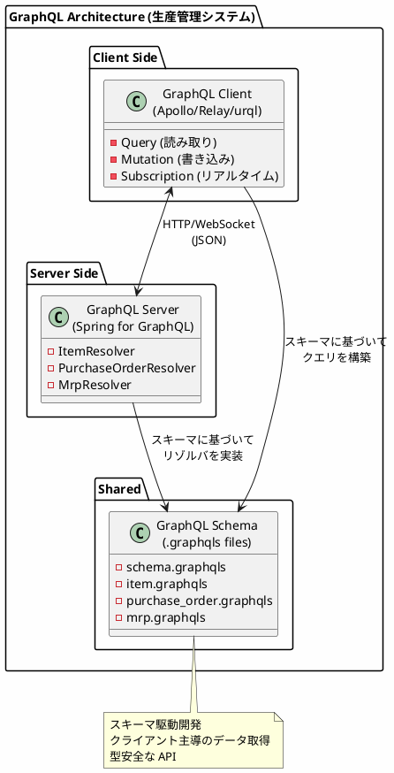
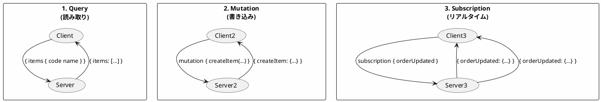
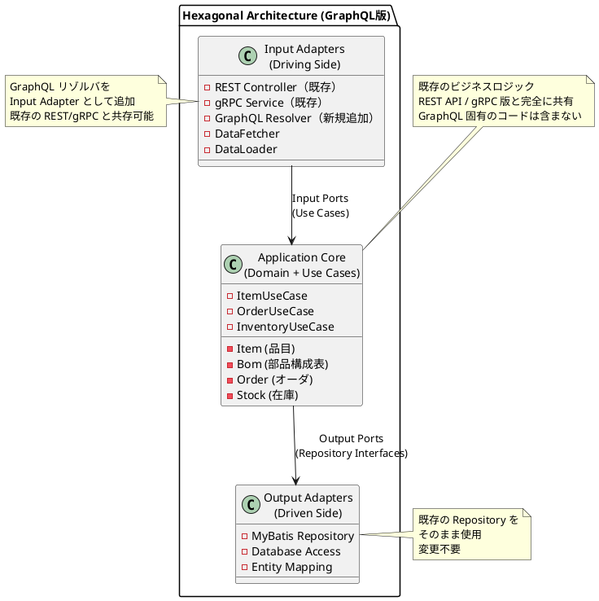

# 実践データベース設計：生産管理システム 研究 4 - GraphQL サービスの実装

## はじめに

本研究では、API サーバー構成（第32章）とは異なるアプローチとして、**GraphQL** による生産管理システムを実装します。クライアントが必要なデータを正確に指定できる柔軟なクエリと、リアルタイム更新を実現する Subscription を活用します。

第32章で構築したヘキサゴナルアーキテクチャ（ドメイン層・アプリケーション層）はそのまま共有し、**Input Adapter として GraphQL リゾルバ層のみを追加**します。

---

## 第46章：GraphQL サーバーの基礎

### 46.1 GraphQL とは

GraphQL は Facebook が開発したクエリ言語および実行エンジンです。クライアントが必要なデータの形状を指定でき、Over-fetching や Under-fetching を防ぎます。



**REST API / gRPC との比較：**

| 特徴 | REST API | gRPC | GraphQL |
|------|----------|------|---------|
| プロトコル | HTTP/1.1 | HTTP/2 | HTTP/1.1 or HTTP/2 |
| データ形式 | JSON | Protocol Buffers | JSON |
| スキーマ | OpenAPI (任意) | .proto (必須) | .graphqls (必須) |
| データ取得 | 固定レスポンス | 固定レスポンス | クライアント指定 |
| エンドポイント | 複数 | 複数 | 単一 |
| リアルタイム | WebSocket 別実装 | ストリーミング | Subscription |
| 主な用途 | 汎用 API | マイクロサービス | フロントエンド向け |

### 46.2 3つの操作タイプ

GraphQL は 3 つの操作タイプをサポートします：



**用途：**

1. **Query**: データ取得（品目一覧、BOM 展開）
2. **Mutation**: データ更新（品目登録、発注確定）
3. **Subscription**: リアルタイム通知（MRP 進捗、在庫変動）

### 46.3 GraphQL におけるヘキサゴナルアーキテクチャ

GraphQL を導入しても、第32章で構築したヘキサゴナルアーキテクチャ（ドメイン層・アプリケーション層）はそのまま共有し、**Input Adapter として GraphQL リゾルバ層のみを追加**します。



**GraphQL でもヘキサゴナルアーキテクチャを維持する理由：**

1. **再利用性**: 既存の UseCase/Repository をそのまま活用
2. **並行運用**: REST API、gRPC、GraphQL を同時提供可能
3. **テスト容易性**: ドメインロジックは通信プロトコルに依存しない
4. **移行容易性**: 段階的に API 形式を追加・変更可能

### 46.4 ディレクトリ構成

既存の構成に `infrastructure/graphql/` を追加するだけです。

```
src/main/java/com/example/production/
├── domain/                     # ドメイン層（API版と共通）
│   ├── model/
│   │   ├── item/
│   │   ├── bom/
│   │   ├── order/
│   │   └── inventory/
│   └── exception/
│
├── application/               # アプリケーション層（API版と共通）
│   ├── port/
│   │   ├── in/               # Input Port（ユースケース）
│   │   └── out/              # Output Port（リポジトリ）
│   └── service/
│
├── infrastructure/
│   ├── persistence/          # Output Adapter（DB実装）- 既存
│   │   ├── mapper/
│   │   └── repository/
│   ├── rest/                 # Input Adapter（REST実装）- 既存
│   ├── grpc/                 # Input Adapter（gRPC実装）- 既存
│   └── graphql/              # Input Adapter（GraphQL実装）- 新規追加
│       ├── resolver/         # Query/Mutation リゾルバ
│       ├── dataloader/       # N+1 問題対策
│       ├── scalar/           # カスタムスカラー型
│       └── subscription/     # Subscription ハンドラ
│
├── config/
│
└── src/main/resources/
    └── graphql/              # GraphQL スキーマ定義
        ├── schema.graphqls
        ├── item.graphqls
        ├── bom.graphqls
        ├── purchase_order.graphqls
        └── mrp.graphqls
```

### 46.5 技術スタックの追加

既存の `build.gradle.kts` に GraphQL 関連の依存関係を追加します。

<details>
<summary>build.gradle.kts（差分）</summary>

```kotlin
dependencies {
    // 既存の依存関係（Spring Boot, MyBatis, PostgreSQL等）はそのまま

    // GraphQL 関連を追加
    implementation("org.springframework.boot:spring-boot-starter-graphql")
    implementation("org.springframework.boot:spring-boot-starter-websocket")  // Subscription 用

    // GraphQL 拡張
    implementation("com.graphql-java:graphql-java-extended-scalars:21.0")

    // Test
    testImplementation("org.springframework.graphql:spring-graphql-test")
}
```

</details>

**追加パッケージの説明：**

| パッケージ | 用途 |
|-----------|------|
| spring-boot-starter-graphql | Spring Boot GraphQL 統合 |
| spring-boot-starter-websocket | Subscription (WebSocket) |
| graphql-java-extended-scalars | DateTime, BigDecimal 等のスカラー型 |
| spring-graphql-test | GraphQL テストサポート |

### 42.6 GraphQL スキーマ定義

<details>
<summary>src/main/resources/graphql/schema.graphqls</summary>

```graphql
# ルートスキーマ
type Query {
    # 品目
    item(itemCode: ID!): Item
    items(category: ItemCategory, page: Int, size: Int): ItemConnection!

    # BOM
    bomTree(itemCode: ID!): BomNode
    whereUsed(itemCode: ID!): [WhereUsedResult!]!

    # 発注
    purchaseOrder(orderNumber: ID!): PurchaseOrder
    purchaseOrders(status: OrderStatus, page: Int, size: Int): PurchaseOrderConnection!
}

type Mutation {
    # 品目
    createItem(input: CreateItemInput!): Item!
    updateItem(input: UpdateItemInput!): Item!
    deleteItem(itemCode: ID!): Boolean!

    # 発注
    createPurchaseOrder(input: CreatePurchaseOrderInput!): PurchaseOrder!
    confirmPurchaseOrder(orderNumber: ID!): PurchaseOrder!
    cancelPurchaseOrder(orderNumber: ID!): Boolean!
    recordReceiving(input: RecordReceivingInput!): ReceivingResult!

    # MRP
    executeMrp(input: ExecuteMrpInput!): MrpResult!
}

type Subscription {
    # MRP 進捗
    mrpProgress(executionId: ID!): MrpProgress!

    # 発注ステータス変更
    orderStatusChanged(orderNumber: ID): PurchaseOrder!

    # 在庫変動
    stockChanged(itemCode: ID): StockChange!
}

# ページネーション
type PageInfo {
    hasNextPage: Boolean!
    hasPreviousPage: Boolean!
    totalElements: Int!
    totalPages: Int!
}
```

</details>

<details>
<summary>src/main/resources/graphql/item.graphqls</summary>

```graphql
# 品目区分
enum ItemCategory {
    PRODUCT      # 製品
    SEMI_PRODUCT # 半製品
    PART         # 部品
    MATERIAL     # 材料
}

# 品目
type Item {
    itemCode: ID!
    effectiveDate: Date!
    itemName: String!
    category: ItemCategory!
    itemGroupCode: String
    unitCode: String
    locationCode: String
    leadTime: Int
    safetyStock: Int

    # 関連データ（必要な場合のみ取得）
    bom: [BomEntry!]!
    stock: Stock
    purchaseOrders: [PurchaseOrder!]!
}

# 品目一覧（ページネーション付き）
type ItemConnection {
    edges: [ItemEdge!]!
    pageInfo: PageInfo!
}

type ItemEdge {
    node: Item!
    cursor: String!
}

# 入力型
input CreateItemInput {
    itemCode: ID!
    itemName: String!
    category: ItemCategory!
    itemGroupCode: String
    unitCode: String
    locationCode: String
    leadTime: Int
    safetyStock: Int
}

input UpdateItemInput {
    itemCode: ID!
    itemName: String
    category: ItemCategory
    leadTime: Int
    safetyStock: Int
}

# カスタムスカラー
scalar Date
scalar DateTime
scalar BigDecimal
```

</details>

<details>
<summary>src/main/resources/graphql/bom.graphqls</summary>

```graphql
# BOM エントリ
type BomEntry {
    parentItemCode: ID!
    childItemCode: ID!
    requiredQuantity: BigDecimal!
    effectiveFrom: Date!
    effectiveTo: Date

    # 子品目の詳細
    childItem: Item!
}

# BOM ツリーノード
type BomNode {
    itemCode: ID!
    itemName: String!
    requiredQuantity: BigDecimal!
    level: Int!
    children: [BomNode!]!
}

# 逆展開（使用先照会）
type WhereUsedResult {
    parentItemCode: ID!
    itemName: String!
    requiredQuantity: BigDecimal!
    level: Int!
}
```

</details>

<details>
<summary>src/main/resources/graphql/purchase_order.graphqls</summary>

```graphql
# 発注ステータス
enum OrderStatus {
    DRAFT
    CONFIRMED
    CANCELLED
    COMPLETED
}

# 発注
type PurchaseOrder {
    orderNumber: ID!
    supplierCode: String!
    orderDate: Date!
    status: OrderStatus!
    totalAmount: BigDecimal!
    details: [PurchaseOrderDetail!]!

    # 関連データ
    supplier: Supplier
}

type PurchaseOrderDetail {
    lineNumber: Int!
    itemCode: ID!
    orderQuantity: BigDecimal!
    unitPrice: BigDecimal!
    deliveryDate: Date!
    receivedQuantity: BigDecimal!

    # 関連データ
    item: Item!
}

type PurchaseOrderConnection {
    edges: [PurchaseOrderEdge!]!
    pageInfo: PageInfo!
}

type PurchaseOrderEdge {
    node: PurchaseOrder!
    cursor: String!
}

# 入力型
input CreatePurchaseOrderInput {
    supplierCode: String!
    details: [CreateOrderDetailInput!]!
}

input CreateOrderDetailInput {
    itemCode: ID!
    orderQuantity: BigDecimal!
    unitPrice: BigDecimal!
    deliveryDate: Date!
}

input RecordReceivingInput {
    orderNumber: ID!
    lineNumber: Int!
    receivedQuantity: BigDecimal!
    receivingDate: Date!
}

type ReceivingResult {
    orderNumber: ID!
    lineNumber: Int!
    totalReceived: BigDecimal!
    isCompleted: Boolean!
}
```

</details>

<details>
<summary>src/main/resources/graphql/mrp.graphqls</summary>

```graphql
# MRP 入力
input ExecuteMrpInput {
    startDate: Date!
    endDate: Date!
}

# MRP 結果
type MrpResult {
    executionId: ID!
    periodStart: Date!
    periodEnd: Date!
    plannedOrders: [PlannedOrder!]!
    shortageItems: [ShortageItem!]!
    statistics: MrpStatistics!
}

type PlannedOrder {
    itemCode: ID!
    itemName: String!
    quantity: BigDecimal!
    dueDate: Date!
    orderType: String!
}

type ShortageItem {
    itemCode: ID!
    itemName: String!
    shortageQuantity: BigDecimal!
    recommendedOrderDate: Date!
}

type MrpStatistics {
    totalItemsProcessed: Int!
    purchaseOrderCount: Int!
    productionOrderCount: Int!
    shortageItemCount: Int!
    executionTimeMs: Long!
}

# MRP 進捗（Subscription）
type MrpProgress {
    executionId: ID!
    phase: String!
    current: Int!
    total: Int!
    message: String!
}

scalar Long
```

</details>

### 42.7 API サーバー版との Controller の違い

**API サーバー版（REST Controller）**

```java
@RestController  // JSON を返す
@RequestMapping("/api/items")
public class ItemApiController {

    private final ItemUseCase itemUseCase;  // 共有

    @GetMapping("/{itemCode}")
    public ResponseEntity<ItemResponse> getItem(@PathVariable String itemCode) {
        Item item = itemUseCase.getItemByCode(itemCode);
        return ResponseEntity.ok(ItemResponse.from(item));
    }
}
```

**GraphQL 版（QueryResolver）**

```java
@Controller  // Spring for GraphQL
public class ItemResolver {

    private final ItemUseCase itemUseCase;  // 共有（同じインスタンス）

    @QueryMapping
    public Item item(@Argument String itemCode) {
        // 同じ UseCase を呼び出し
        return itemUseCase.getItemByCode(itemCode);
    }
}
```

**共通点と相違点：**

| 観点 | REST Controller | GraphQL Resolver |
|------|-----------------|------------------|
| **UseCase** | 共有（同一インスタンス） | 共有（同一インスタンス） |
| **アノテーション** | `@RestController` | `@Controller` |
| **メソッド** | `@GetMapping` 等 | `@QueryMapping` / `@MutationMapping` |
| **引数** | `@PathVariable` / `@RequestBody` | `@Argument` |
| **レスポンス** | DTO に変換 | ドメインモデル直接（推奨） |
| **データ形式** | 固定 JSON | クライアント指定 |

---

## 第47章：マスタ API の実装

### 47.1 カスタムスカラーの実装

<details>
<summary>ScalarConfig.java</summary>

```java
package com.example.production.infrastructure.graphql.scalar;

import graphql.scalars.ExtendedScalars;
import org.springframework.context.annotation.Bean;
import org.springframework.context.annotation.Configuration;
import org.springframework.graphql.execution.RuntimeWiringConfigurer;

/**
 * カスタムスカラー設定
 */
@Configuration
public class ScalarConfig {

    @Bean
    public RuntimeWiringConfigurer runtimeWiringConfigurer() {
        return wiringBuilder -> wiringBuilder
            .scalar(ExtendedScalars.Date)
            .scalar(ExtendedScalars.DateTime)
            .scalar(ExtendedScalars.GraphQLBigDecimal)
            .scalar(ExtendedScalars.GraphQLLong);
    }
}
```

</details>

### 47.2 品目 GraphQL リゾルバの TDD 実装

#### Red: 失敗するテストを書く

<details>
<summary>ItemResolverTest.java</summary>

```java
package com.example.production.infrastructure.graphql.resolver;

import com.example.production.domain.model.item.Item;
import com.example.production.domain.model.item.ItemCategory;
import com.example.production.infrastructure.persistence.mapper.ItemMapper;
import org.junit.jupiter.api.*;
import org.springframework.beans.factory.annotation.Autowired;
import org.springframework.boot.test.autoconfigure.graphql.tester.AutoConfigureGraphQlTester;
import org.springframework.boot.test.context.SpringBootTest;
import org.springframework.graphql.test.tester.GraphQlTester;
import org.springframework.test.context.DynamicPropertyRegistry;
import org.springframework.test.context.DynamicPropertySource;
import org.testcontainers.containers.PostgreSQLContainer;
import org.testcontainers.junit.jupiter.Container;
import org.testcontainers.junit.jupiter.Testcontainers;

import java.time.LocalDate;

import static org.assertj.core.api.Assertions.*;

@SpringBootTest
@AutoConfigureGraphQlTester
@Testcontainers
@DisplayName("品目 GraphQL リゾルバ")
class ItemResolverTest {

    @Container
    static PostgreSQLContainer<?> postgres = new PostgreSQLContainer<>("postgres:16")
        .withDatabaseName("production_test")
        .withUsername("test")
        .withPassword("test");

    @DynamicPropertySource
    static void configureProperties(DynamicPropertyRegistry registry) {
        registry.add("spring.datasource.url", postgres::getJdbcUrl);
        registry.add("spring.datasource.username", postgres::getUsername);
        registry.add("spring.datasource.password", postgres::getPassword);
    }

    @Autowired
    private GraphQlTester graphQlTester;

    @Autowired
    private ItemMapper itemMapper;

    @BeforeEach
    void setUp() {
        itemMapper.deleteAll();
    }

    @Nested
    @DisplayName("Query: item")
    class ItemQueryTests {

        @Test
        @DisplayName("品目コードで品目を取得できる")
        void shouldGetItemByCode() {
            // Arrange
            insertTestItem("PROD-001", "テスト製品", ItemCategory.PRODUCT);

            // Act & Assert
            graphQlTester.document("""
                    query {
                        item(itemCode: "PROD-001") {
                            itemCode
                            itemName
                            category
                        }
                    }
                    """)
                .execute()
                .path("item.itemCode").entity(String.class).isEqualTo("PROD-001")
                .path("item.itemName").entity(String.class).isEqualTo("テスト製品")
                .path("item.category").entity(String.class).isEqualTo("PRODUCT");
        }

        @Test
        @DisplayName("存在しない品目は null を返す")
        void shouldReturnNullForNonExistentItem() {
            graphQlTester.document("""
                    query {
                        item(itemCode: "NOT-EXIST") {
                            itemCode
                        }
                    }
                    """)
                .execute()
                .path("item").valueIsNull();
        }

        @Test
        @DisplayName("関連データを同時に取得できる")
        void shouldGetItemWithRelatedData() {
            insertTestItem("PROD-001", "テスト製品", ItemCategory.PRODUCT);

            graphQlTester.document("""
                    query {
                        item(itemCode: "PROD-001") {
                            itemCode
                            itemName
                            bom {
                                childItemCode
                                requiredQuantity
                            }
                            stock {
                                quantity
                            }
                        }
                    }
                    """)
                .execute()
                .path("item.itemCode").entity(String.class).isEqualTo("PROD-001")
                .path("item.bom").entityList(Object.class).hasSize(0);
        }
    }

    @Nested
    @DisplayName("Query: items")
    class ItemsQueryTests {

        @Test
        @DisplayName("品目一覧を取得できる")
        void shouldGetItems() {
            for (int i = 1; i <= 5; i++) {
                insertTestItem("ITEM-" + String.format("%03d", i),
                    "品目" + i, ItemCategory.PRODUCT);
            }

            graphQlTester.document("""
                    query {
                        items(page: 0, size: 10) {
                            edges {
                                node {
                                    itemCode
                                    itemName
                                }
                            }
                            pageInfo {
                                totalElements
                            }
                        }
                    }
                    """)
                .execute()
                .path("items.edges").entityList(Object.class).hasSize(5)
                .path("items.pageInfo.totalElements").entity(Integer.class).isEqualTo(5);
        }

        @Test
        @DisplayName("カテゴリでフィルタリングできる")
        void shouldFilterByCategory() {
            insertTestItem("PROD-001", "製品1", ItemCategory.PRODUCT);
            insertTestItem("PART-001", "部品1", ItemCategory.PART);
            insertTestItem("PROD-002", "製品2", ItemCategory.PRODUCT);

            graphQlTester.document("""
                    query {
                        items(category: PRODUCT, page: 0, size: 10) {
                            edges {
                                node {
                                    itemCode
                                }
                            }
                            pageInfo {
                                totalElements
                            }
                        }
                    }
                    """)
                .execute()
                .path("items.pageInfo.totalElements").entity(Integer.class).isEqualTo(2);
        }
    }

    @Nested
    @DisplayName("Mutation: createItem")
    class CreateItemMutationTests {

        @Test
        @DisplayName("品目を登録できる")
        void shouldCreateItem() {
            graphQlTester.document("""
                    mutation {
                        createItem(input: {
                            itemCode: "NEW-001"
                            itemName: "新規品目"
                            category: PRODUCT
                            leadTime: 5
                        }) {
                            itemCode
                            itemName
                            category
                            leadTime
                        }
                    }
                    """)
                .execute()
                .path("createItem.itemCode").entity(String.class).isEqualTo("NEW-001")
                .path("createItem.itemName").entity(String.class).isEqualTo("新規品目")
                .path("createItem.category").entity(String.class).isEqualTo("PRODUCT")
                .path("createItem.leadTime").entity(Integer.class).isEqualTo(5);

            // DB に保存されていることを確認
            var saved = itemMapper.findByCode("NEW-001");
            assertThat(saved).isNotNull();
            assertThat(saved.getItemName()).isEqualTo("新規品目");
        }

        @Test
        @DisplayName("重複する品目コードはエラーになる")
        void shouldFailForDuplicateCode() {
            insertTestItem("DUP-001", "既存品目", ItemCategory.PRODUCT);

            graphQlTester.document("""
                    mutation {
                        createItem(input: {
                            itemCode: "DUP-001"
                            itemName: "重複品目"
                            category: PRODUCT
                        }) {
                            itemCode
                        }
                    }
                    """)
                .execute()
                .errors()
                .satisfy(errors -> assertThat(errors).hasSize(1));
        }
    }

    private void insertTestItem(String code, String name, ItemCategory category) {
        itemMapper.insert(Item.builder()
            .itemCode(code)
            .effectiveDate(LocalDate.of(2025, 1, 1))
            .itemName(name)
            .category(category)
            .build());
    }
}
```

</details>

#### Green: GraphQL リゾルバの実装

<details>
<summary>ItemResolver.java</summary>

```java
package com.example.production.infrastructure.graphql.resolver;

import com.example.production.application.port.in.*;
import com.example.production.domain.exception.DuplicateItemException;
import com.example.production.domain.exception.ItemNotFoundException;
import com.example.production.domain.model.item.Item;
import com.example.production.domain.model.item.ItemCategory;
import graphql.GraphQLError;
import graphql.GraphqlErrorBuilder;
import graphql.schema.DataFetchingEnvironment;
import org.springframework.graphql.data.method.annotation.*;
import org.springframework.graphql.execution.ErrorType;
import org.springframework.stereotype.Controller;

import java.util.List;

/**
 * 品目 GraphQL リゾルバ実装
 * 既存の ItemUseCase を Input Adapter として呼び出す
 */
@Controller
public class ItemResolver {

    private final ItemUseCase itemUseCase;  // 既存の UseCase を注入

    public ItemResolver(ItemUseCase itemUseCase) {
        this.itemUseCase = itemUseCase;
    }

    // ========== Query ==========

    /**
     * 品目取得
     */
    @QueryMapping
    public Item item(@Argument String itemCode) {
        try {
            return itemUseCase.getItemByCode(itemCode);
        } catch (ItemNotFoundException e) {
            return null;  // GraphQL では null を返す
        }
    }

    /**
     * 品目一覧（ページネーション付き）
     */
    @QueryMapping
    public ItemConnection items(
            @Argument ItemCategory category,
            @Argument Integer page,
            @Argument Integer size) {

        int pageNum = page != null ? page : 0;
        int pageSize = size != null ? size : 20;

        List<Item> items;
        int totalElements;

        if (category != null) {
            items = itemUseCase.getItemsByCategory(category);
        } else {
            items = itemUseCase.getAllItems();
        }

        totalElements = items.size();

        // ページング処理
        int start = pageNum * pageSize;
        int end = Math.min(start + pageSize, items.size());
        List<Item> pagedItems = items.subList(start, end);

        return ItemConnection.builder()
            .edges(pagedItems.stream()
                .map(item -> ItemEdge.builder()
                    .node(item)
                    .cursor(item.getItemCode())
                    .build())
                .toList())
            .pageInfo(PageInfo.builder()
                .hasNextPage(end < totalElements)
                .hasPreviousPage(pageNum > 0)
                .totalElements(totalElements)
                .totalPages((int) Math.ceil((double) totalElements / pageSize))
                .build())
            .build();
    }

    // ========== Mutation ==========

    /**
     * 品目登録
     */
    @MutationMapping
    public Item createItem(@Argument CreateItemInput input) {
        CreateItemCommand command = CreateItemCommand.builder()
            .itemCode(input.getItemCode())
            .itemName(input.getItemName())
            .category(input.getCategory())
            .itemGroupCode(input.getItemGroupCode())
            .unitCode(input.getUnitCode())
            .locationCode(input.getLocationCode())
            .leadTime(input.getLeadTime())
            .safetyStock(input.getSafetyStock())
            .build();

        return itemUseCase.createItem(command);
    }

    /**
     * 品目更新
     */
    @MutationMapping
    public Item updateItem(@Argument UpdateItemInput input) {
        UpdateItemCommand command = UpdateItemCommand.builder()
            .itemCode(input.getItemCode())
            .itemName(input.getItemName())
            .category(input.getCategory())
            .leadTime(input.getLeadTime())
            .safetyStock(input.getSafetyStock())
            .build();

        return itemUseCase.updateItem(command);
    }

    /**
     * 品目削除
     */
    @MutationMapping
    public boolean deleteItem(@Argument String itemCode) {
        try {
            itemUseCase.deleteItem(itemCode);
            return true;
        } catch (ItemNotFoundException e) {
            return false;
        }
    }

    // ========== 例外ハンドリング ==========

    @GraphQlExceptionHandler
    public GraphQLError handleDuplicateItem(DuplicateItemException ex, DataFetchingEnvironment env) {
        return GraphqlErrorBuilder.newError(env)
            .errorType(ErrorType.BAD_REQUEST)
            .message(ex.getMessage())
            .build();
    }

    @GraphQlExceptionHandler
    public GraphQLError handleItemNotFound(ItemNotFoundException ex, DataFetchingEnvironment env) {
        return GraphqlErrorBuilder.newError(env)
            .errorType(ErrorType.NOT_FOUND)
            .message(ex.getMessage())
            .build();
    }
}
```

</details>

<details>
<summary>補助クラス（ItemConnection, PageInfo 等）</summary>

```java
package com.example.production.infrastructure.graphql.resolver;

import com.example.production.domain.model.item.Item;
import com.example.production.domain.model.item.ItemCategory;
import lombok.Builder;
import lombok.Data;

import java.util.List;

@Data
@Builder
public class ItemConnection {
    private List<ItemEdge> edges;
    private PageInfo pageInfo;
}

@Data
@Builder
public class ItemEdge {
    private Item node;
    private String cursor;
}

@Data
@Builder
public class PageInfo {
    private boolean hasNextPage;
    private boolean hasPreviousPage;
    private int totalElements;
    private int totalPages;
}

@Data
public class CreateItemInput {
    private String itemCode;
    private String itemName;
    private ItemCategory category;
    private String itemGroupCode;
    private String unitCode;
    private String locationCode;
    private Integer leadTime;
    private Integer safetyStock;
}

@Data
public class UpdateItemInput {
    private String itemCode;
    private String itemName;
    private ItemCategory category;
    private Integer leadTime;
    private Integer safetyStock;
}
```

</details>

### 47.3 N+1 問題対策（DataLoader）

GraphQL では関連データの取得時に N+1 問題が発生しやすいため、DataLoader を使用します。

<details>
<summary>DataLoaderConfig.java</summary>

```java
package com.example.production.infrastructure.graphql.dataloader;

import com.example.production.application.port.in.ItemUseCase;
import com.example.production.domain.model.item.Item;
import org.dataloader.DataLoader;
import org.dataloader.DataLoaderFactory;
import org.springframework.context.annotation.Bean;
import org.springframework.context.annotation.Configuration;
import org.springframework.graphql.execution.BatchLoaderRegistry;

import java.util.List;
import java.util.Map;
import java.util.function.Function;
import java.util.stream.Collectors;

/**
 * DataLoader 設定
 * N+1 問題を解決するためのバッチローディング
 */
@Configuration
public class DataLoaderConfig {

    private final ItemUseCase itemUseCase;

    public DataLoaderConfig(ItemUseCase itemUseCase) {
        this.itemUseCase = itemUseCase;
    }

    @Bean
    public BatchLoaderRegistry batchLoaderRegistry(BatchLoaderRegistry registry) {
        // 品目 DataLoader
        registry.forTypePair(String.class, Item.class)
            .registerBatchLoader((itemCodes, env) -> {
                // バッチで品目を取得（1回のクエリで複数取得）
                List<Item> items = itemUseCase.getItemsByCodes(itemCodes);

                Map<String, Item> itemMap = items.stream()
                    .collect(Collectors.toMap(Item::getItemCode, Function.identity()));

                return reactor.core.publisher.Flux.fromIterable(itemCodes)
                    .map(code -> itemMap.get(code));
            });

        return registry;
    }
}
```

</details>

<details>
<summary>PurchaseOrderDetailResolver.java（DataLoader 使用）</summary>

```java
package com.example.production.infrastructure.graphql.resolver;

import com.example.production.domain.model.item.Item;
import com.example.production.domain.model.purchase.PurchaseOrderDetail;
import org.dataloader.DataLoader;
import org.springframework.graphql.data.method.annotation.SchemaMapping;
import org.springframework.stereotype.Controller;

import java.util.concurrent.CompletableFuture;

/**
 * 発注明細リゾルバ
 * DataLoader を使って品目を効率的に取得
 */
@Controller
public class PurchaseOrderDetailResolver {

    /**
     * 発注明細から品目を取得（DataLoader 使用）
     */
    @SchemaMapping(typeName = "PurchaseOrderDetail", field = "item")
    public CompletableFuture<Item> item(
            PurchaseOrderDetail detail,
            DataLoader<String, Item> itemDataLoader) {

        // DataLoader 経由で取得（バッチ処理される）
        return itemDataLoader.load(detail.getItemCode());
    }
}
```

</details>

### 47.4 BOM GraphQL リゾルバ

<details>
<summary>BomResolver.java</summary>

```java
package com.example.production.infrastructure.graphql.resolver;

import com.example.production.application.service.BomNode;
import com.example.production.application.service.BomService;
import com.example.production.application.service.WhereUsedResult;
import org.springframework.graphql.data.method.annotation.Argument;
import org.springframework.graphql.data.method.annotation.QueryMapping;
import org.springframework.stereotype.Controller;

import java.util.List;

/**
 * BOM GraphQL リゾルバ実装
 * 既存の BomService を Input Adapter として呼び出す
 */
@Controller
public class BomResolver {

    private final BomService bomService;  // 既存のサービスを注入

    public BomResolver(BomService bomService) {
        this.bomService = bomService;
    }

    /**
     * 部品展開（BOM ツリー）
     */
    @QueryMapping
    public BomNode bomTree(@Argument String itemCode) {
        return bomService.explodeBom(itemCode);
    }

    /**
     * 使用先照会
     */
    @QueryMapping
    public List<WhereUsedResult> whereUsed(@Argument String itemCode) {
        return bomService.whereUsed(itemCode);
    }
}
```

</details>

---

## 第48章：トランザクション API の実装

### 48.1 発注 GraphQL リゾルバ

<details>
<summary>PurchaseOrderResolver.java</summary>

```java
package com.example.production.infrastructure.graphql.resolver;

import com.example.production.application.port.in.*;
import com.example.production.domain.model.purchase.PurchaseOrder;
import org.springframework.graphql.data.method.annotation.*;
import org.springframework.stereotype.Controller;

import java.math.BigDecimal;
import java.time.LocalDate;
import java.util.List;

/**
 * 発注 GraphQL リゾルバ実装
 * 既存の PurchaseOrderUseCase を Input Adapter として呼び出す
 */
@Controller
public class PurchaseOrderResolver {

    private final PurchaseOrderUseCase useCase;  // 既存の UseCase

    public PurchaseOrderResolver(PurchaseOrderUseCase useCase) {
        this.useCase = useCase;
    }

    // ========== Query ==========

    @QueryMapping
    public PurchaseOrder purchaseOrder(@Argument String orderNumber) {
        return useCase.getOrder(orderNumber);
    }

    @QueryMapping
    public PurchaseOrderConnection purchaseOrders(
            @Argument String status,
            @Argument Integer page,
            @Argument Integer size) {

        List<PurchaseOrder> orders = useCase.getAllOrders();

        // ページネーション処理（省略）
        return PurchaseOrderConnection.builder()
            .edges(orders.stream()
                .map(order -> PurchaseOrderEdge.builder()
                    .node(order)
                    .cursor(order.getOrderNumber())
                    .build())
                .toList())
            .pageInfo(PageInfo.builder()
                .totalElements(orders.size())
                .build())
            .build();
    }

    // ========== Mutation ==========

    @MutationMapping
    public PurchaseOrder createPurchaseOrder(@Argument CreatePurchaseOrderInput input) {
        CreatePurchaseOrderCommand command = CreatePurchaseOrderCommand.builder()
            .supplierCode(input.getSupplierCode())
            .details(input.getDetails().stream()
                .map(d -> CreatePurchaseOrderCommand.PurchaseOrderDetailCommand.builder()
                    .itemCode(d.getItemCode())
                    .orderQuantity(d.getOrderQuantity())
                    .unitPrice(d.getUnitPrice())
                    .deliveryDate(d.getDeliveryDate())
                    .build())
                .toList())
            .build();

        return useCase.createOrder(command);
    }

    @MutationMapping
    public PurchaseOrder confirmPurchaseOrder(@Argument String orderNumber) {
        return useCase.confirmOrder(orderNumber);
    }

    @MutationMapping
    public boolean cancelPurchaseOrder(@Argument String orderNumber) {
        useCase.cancelOrder(orderNumber);
        return true;
    }

    @MutationMapping
    public ReceivingResult recordReceiving(@Argument RecordReceivingInput input) {
        var result = useCase.recordReceiving(
            input.getOrderNumber(),
            input.getLineNumber(),
            input.getReceivedQuantity(),
            input.getReceivingDate()
        );

        return ReceivingResult.builder()
            .orderNumber(input.getOrderNumber())
            .lineNumber(input.getLineNumber())
            .totalReceived(result.getTotalReceived())
            .isCompleted(result.isCompleted())
            .build();
    }
}

// 入力型
@lombok.Data
class CreatePurchaseOrderInput {
    private String supplierCode;
    private List<CreateOrderDetailInput> details;
}

@lombok.Data
class CreateOrderDetailInput {
    private String itemCode;
    private BigDecimal orderQuantity;
    private BigDecimal unitPrice;
    private LocalDate deliveryDate;
}

@lombok.Data
class RecordReceivingInput {
    private String orderNumber;
    private int lineNumber;
    private BigDecimal receivedQuantity;
    private LocalDate receivingDate;
}

@lombok.Data
@lombok.Builder
class ReceivingResult {
    private String orderNumber;
    private int lineNumber;
    private BigDecimal totalReceived;
    private boolean isCompleted;
}
```

</details>

### 48.2 MRP GraphQL リゾルバ

<details>
<summary>MrpResolver.java</summary>

```java
package com.example.production.infrastructure.graphql.resolver;

import com.example.production.application.service.MrpService;
import org.springframework.graphql.data.method.annotation.*;
import org.springframework.stereotype.Controller;

import java.time.LocalDate;
import java.util.UUID;

/**
 * MRP GraphQL リゾルバ実装
 * 既存の MrpService を Input Adapter として呼び出す
 */
@Controller
public class MrpResolver {

    private final MrpService mrpService;  // 既存のサービス

    public MrpResolver(MrpService mrpService) {
        this.mrpService = mrpService;
    }

    /**
     * MRP 実行
     */
    @MutationMapping
    public MrpResult executeMrp(@Argument ExecuteMrpInput input) {
        String executionId = UUID.randomUUID().toString();

        long startTime = System.currentTimeMillis();
        var result = mrpService.execute(input.getStartDate(), input.getEndDate());
        long executionTime = System.currentTimeMillis() - startTime;

        return MrpResult.builder()
            .executionId(executionId)
            .periodStart(input.getStartDate())
            .periodEnd(input.getEndDate())
            .plannedOrders(result.getPlannedOrders())
            .shortageItems(result.getShortageItems())
            .statistics(MrpStatistics.builder()
                .totalItemsProcessed(result.getPlannedOrders().size())
                .shortageItemCount(result.getShortageItems().size())
                .executionTimeMs(executionTime)
                .build())
            .build();
    }
}

@lombok.Data
class ExecuteMrpInput {
    private LocalDate startDate;
    private LocalDate endDate;
}

@lombok.Data
@lombok.Builder
class MrpResult {
    private String executionId;
    private LocalDate periodStart;
    private LocalDate periodEnd;
    private java.util.List<?> plannedOrders;
    private java.util.List<?> shortageItems;
    private MrpStatistics statistics;
}

@lombok.Data
@lombok.Builder
class MrpStatistics {
    private int totalItemsProcessed;
    private int purchaseOrderCount;
    private int productionOrderCount;
    private int shortageItemCount;
    private long executionTimeMs;
}
```

</details>

### 48.3 Subscription（リアルタイム更新）

<details>
<summary>SubscriptionResolver.java</summary>

```java
package com.example.production.infrastructure.graphql.subscription;

import com.example.production.domain.model.purchase.PurchaseOrder;
import org.springframework.graphql.data.method.annotation.Argument;
import org.springframework.graphql.data.method.annotation.SubscriptionMapping;
import org.springframework.stereotype.Controller;
import reactor.core.publisher.Flux;

import java.time.Duration;

/**
 * GraphQL Subscription リゾルバ
 */
@Controller
public class SubscriptionResolver {

    private final OrderEventPublisher orderEventPublisher;
    private final MrpProgressPublisher mrpProgressPublisher;

    public SubscriptionResolver(
            OrderEventPublisher orderEventPublisher,
            MrpProgressPublisher mrpProgressPublisher) {
        this.orderEventPublisher = orderEventPublisher;
        this.mrpProgressPublisher = mrpProgressPublisher;
    }

    /**
     * MRP 進捗の購読
     */
    @SubscriptionMapping
    public Flux<MrpProgress> mrpProgress(@Argument String executionId) {
        return mrpProgressPublisher.subscribe(executionId);
    }

    /**
     * 発注ステータス変更の購読
     */
    @SubscriptionMapping
    public Flux<PurchaseOrder> orderStatusChanged(@Argument String orderNumber) {
        return orderEventPublisher.subscribe(orderNumber);
    }

    /**
     * 在庫変動の購読
     */
    @SubscriptionMapping
    public Flux<StockChange> stockChanged(@Argument String itemCode) {
        // ダミー実装（5秒ごとに在庫変動をシミュレート）
        return Flux.interval(Duration.ofSeconds(5))
            .map(i -> StockChange.builder()
                .itemCode(itemCode != null ? itemCode : "ITEM-001")
                .changeType("RECEIVE")
                .quantity(java.math.BigDecimal.valueOf(10))
                .build());
    }
}

@lombok.Data
@lombok.Builder
class StockChange {
    private String itemCode;
    private String changeType;
    private java.math.BigDecimal quantity;
}
```

</details>

<details>
<summary>MrpProgressPublisher.java（イベントパブリッシャー）</summary>

```java
package com.example.production.infrastructure.graphql.subscription;

import org.springframework.stereotype.Component;
import reactor.core.publisher.Flux;
import reactor.core.publisher.Sinks;

import java.util.concurrent.ConcurrentHashMap;

/**
 * MRP 進捗イベントパブリッシャー
 */
@Component
public class MrpProgressPublisher {

    private final ConcurrentHashMap<String, Sinks.Many<MrpProgress>> sinks =
        new ConcurrentHashMap<>();

    /**
     * 進捗を購読
     */
    public Flux<MrpProgress> subscribe(String executionId) {
        Sinks.Many<MrpProgress> sink = sinks.computeIfAbsent(
            executionId,
            k -> Sinks.many().multicast().onBackpressureBuffer()
        );
        return sink.asFlux();
    }

    /**
     * 進捗を発行
     */
    public void publish(String executionId, MrpProgress progress) {
        Sinks.Many<MrpProgress> sink = sinks.get(executionId);
        if (sink != null) {
            sink.tryEmitNext(progress);
        }
    }

    /**
     * 完了
     */
    public void complete(String executionId) {
        Sinks.Many<MrpProgress> sink = sinks.remove(executionId);
        if (sink != null) {
            sink.tryEmitComplete();
        }
    }
}

@lombok.Data
@lombok.Builder
class MrpProgress {
    private String executionId;
    private String phase;
    private int current;
    private int total;
    private String message;
}
```

</details>

---

## 第49章：エラーハンドリングとベストプラクティス

### 49.1 グローバル例外ハンドラ

<details>
<summary>GraphQLExceptionHandler.java</summary>

```java
package com.example.production.infrastructure.graphql;

import com.example.production.domain.exception.*;
import graphql.GraphQLError;
import graphql.GraphqlErrorBuilder;
import graphql.schema.DataFetchingEnvironment;
import org.springframework.graphql.execution.DataFetcherExceptionResolverAdapter;
import org.springframework.graphql.execution.ErrorType;
import org.springframework.stereotype.Component;

/**
 * GraphQL グローバル例外ハンドラ
 */
@Component
public class GraphQLExceptionHandler extends DataFetcherExceptionResolverAdapter {

    @Override
    protected GraphQLError resolveToSingleError(Throwable ex, DataFetchingEnvironment env) {
        if (ex instanceof ItemNotFoundException) {
            return GraphqlErrorBuilder.newError(env)
                .errorType(ErrorType.NOT_FOUND)
                .message(ex.getMessage())
                .build();
        }

        if (ex instanceof DuplicateItemException) {
            return GraphqlErrorBuilder.newError(env)
                .errorType(ErrorType.BAD_REQUEST)
                .message(ex.getMessage())
                .build();
        }

        if (ex instanceof OrderAlreadyConfirmedException) {
            return GraphqlErrorBuilder.newError(env)
                .errorType(ErrorType.BAD_REQUEST)
                .message(ex.getMessage())
                .build();
        }

        if (ex instanceof IllegalArgumentException) {
            return GraphqlErrorBuilder.newError(env)
                .errorType(ErrorType.BAD_REQUEST)
                .message(ex.getMessage())
                .build();
        }

        // 未知のエラー
        return GraphqlErrorBuilder.newError(env)
            .errorType(ErrorType.INTERNAL_ERROR)
            .message("内部エラーが発生しました")
            .build();
    }
}
```

</details>

### 49.2 入力バリデーション

<details>
<summary>ValidationExceptionHandler.java</summary>

```java
package com.example.production.infrastructure.graphql.validation;

import graphql.GraphQLError;
import graphql.GraphqlErrorBuilder;
import graphql.schema.DataFetchingEnvironment;
import org.springframework.graphql.data.method.annotation.GraphQlExceptionHandler;
import org.springframework.graphql.execution.ErrorType;
import org.springframework.stereotype.Controller;

import jakarta.validation.ConstraintViolation;
import jakarta.validation.ConstraintViolationException;
import java.util.List;
import java.util.stream.Collectors;

/**
 * バリデーション例外ハンドラ
 */
@Controller
public class ValidationExceptionHandler {

    @GraphQlExceptionHandler
    public List<GraphQLError> handleValidation(
            ConstraintViolationException ex,
            DataFetchingEnvironment env) {

        return ex.getConstraintViolations().stream()
            .map(violation -> toGraphQLError(violation, env))
            .collect(Collectors.toList());
    }

    private GraphQLError toGraphQLError(
            ConstraintViolation<?> violation,
            DataFetchingEnvironment env) {
        return GraphqlErrorBuilder.newError(env)
            .errorType(ErrorType.BAD_REQUEST)
            .message(String.format("%s: %s",
                violation.getPropertyPath(),
                violation.getMessage()))
            .build();
    }
}
```

</details>

### 49.3 設定ファイル

<details>
<summary>application.yml（GraphQL 追加設定）</summary>

```yaml
spring:
  graphql:
    path: /graphql
    graphiql:
      enabled: true              # 開発時に GraphiQL UI を有効化
      path: /graphiql
    websocket:
      path: /graphql             # Subscription 用 WebSocket
    schema:
      locations: classpath:graphql/
      printer:
        enabled: true            # スキーマ出力

# 既存の設定はそのまま
  datasource:
    url: jdbc:postgresql://localhost:5432/production
    username: postgres
    password: postgres

mybatis:
  mapper-locations: classpath:mapper/*.xml
```

</details>

### 49.4 GraphQL Playground からの呼び出し

```graphql
# 品目取得
query {
  item(itemCode: "PROD-001") {
    itemCode
    itemName
    category
    leadTime
    bom {
      childItemCode
      requiredQuantity
      childItem {
        itemName
      }
    }
  }
}

# 品目一覧（ページネーション）
query {
  items(category: PRODUCT, page: 0, size: 10) {
    edges {
      node {
        itemCode
        itemName
      }
    }
    pageInfo {
      totalElements
      hasNextPage
    }
  }
}

# 品目登録
mutation {
  createItem(input: {
    itemCode: "NEW-001"
    itemName: "新規製品"
    category: PRODUCT
    leadTime: 7
  }) {
    itemCode
    itemName
  }
}

# MRP 進捗購読
subscription {
  mrpProgress(executionId: "exec-123") {
    phase
    current
    total
    message
  }
}
```

### 49.5 GraphQL vs REST vs gRPC の使い分け

| 用途 | 推奨 | 理由 |
|------|------|------|
| **フロントエンド API** | GraphQL | 柔軟なデータ取得、Over-fetching 防止 |
| **モバイルアプリ** | GraphQL | 帯域制限、必要なデータのみ取得 |
| **マイクロサービス間** | gRPC | 高パフォーマンス、型安全 |
| **サードパーティ連携** | REST | 広く普及、シンプル |
| **リアルタイム更新** | GraphQL Subscription / gRPC Streaming | ネイティブサポート |
| **バッチ処理** | gRPC | ストリーミング効率 |

---

## まとめ

本研究では、GraphQL による生産管理システム API を実装しました。

### API サーバー版との比較

| 観点 | REST API（第32章） | gRPC（研究2） | GraphQL（本研究） |
|------|-------------------|-----------------|-------------------|
| **プロトコル** | HTTP/1.1 + JSON | HTTP/2 + Protobuf | HTTP + JSON |
| **スキーマ** | OpenAPI（任意） | .proto（必須） | .graphqls（必須） |
| **データ取得** | 固定レスポンス | 固定レスポンス | クライアント指定 |
| **エンドポイント** | 複数 | 複数 | 単一 |
| **リアルタイム** | WebSocket 別実装 | ストリーミング | Subscription |
| **ドメイン層** | 共有 | 共有 | 共有 |
| **アプリケーション層** | 共有 | 共有 | 共有 |
| **Input Adapter** | REST Controller | gRPC Service | GraphQL Resolver |

### 実装した GraphQL 操作

| 操作タイプ | 操作名 | 説明 |
|-----------|--------|------|
| **Query** | item, items | 品目取得 |
| | bomTree, whereUsed | BOM 展開・逆展開 |
| | purchaseOrder, purchaseOrders | 発注取得 |
| **Mutation** | createItem, updateItem, deleteItem | 品目 CRUD |
| | createPurchaseOrder, confirmPurchaseOrder | 発注操作 |
| | recordReceiving | 入荷登録 |
| | executeMrp | MRP 実行 |
| **Subscription** | mrpProgress | MRP 進捗通知 |
| | orderStatusChanged | 発注ステータス変更 |
| | stockChanged | 在庫変動 |

### 技術スタック

- **Spring for GraphQL**: Spring Boot 統合
- **GraphQL Java**: GraphQL 実行エンジン
- **Extended Scalars**: Date, BigDecimal 等のカスタム型
- **DataLoader**: N+1 問題対策
- **WebSocket**: Subscription サポート

### GraphQL を選択すべき場面

1. **フロントエンド主導の開発**: クライアントがデータ形状を決定
2. **モバイルアプリ**: 帯域制限下での効率的なデータ取得
3. **複雑な関連データ**: 1回のクエリで関連データを取得
4. **リアルタイム更新**: Subscription でプッシュ通知
5. **API 統合**: 複数のバックエンドを単一エンドポイントで提供

---

[目次へ戻る](../index.md)
