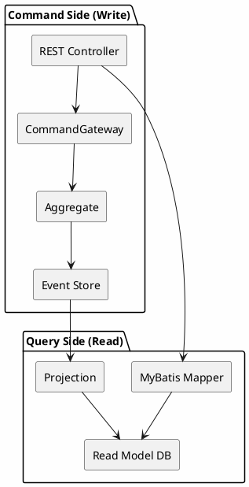
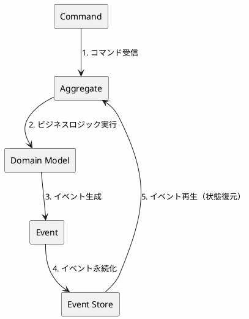
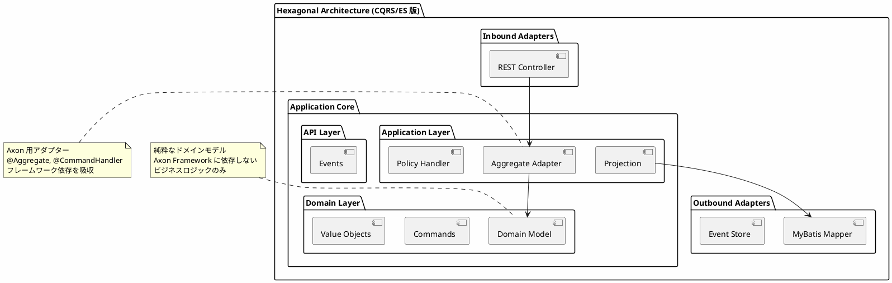
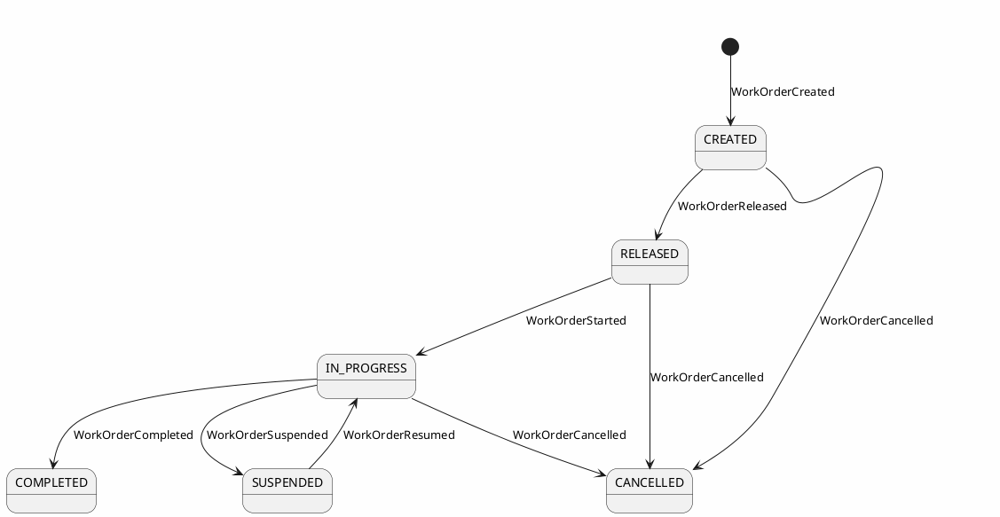
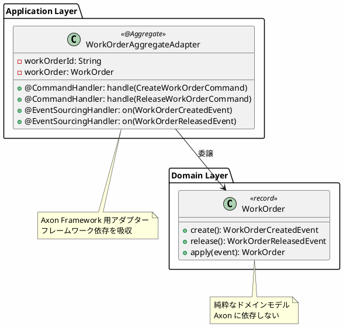
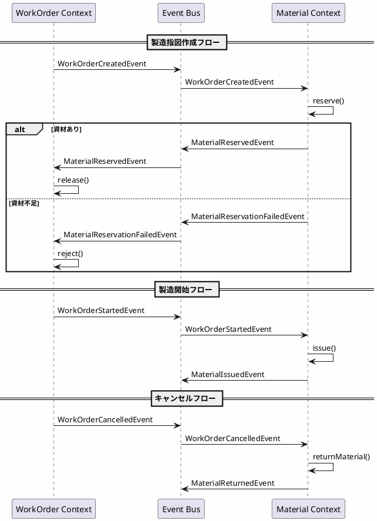
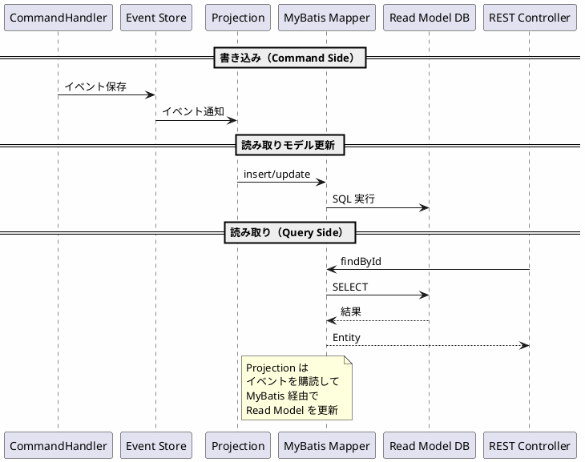
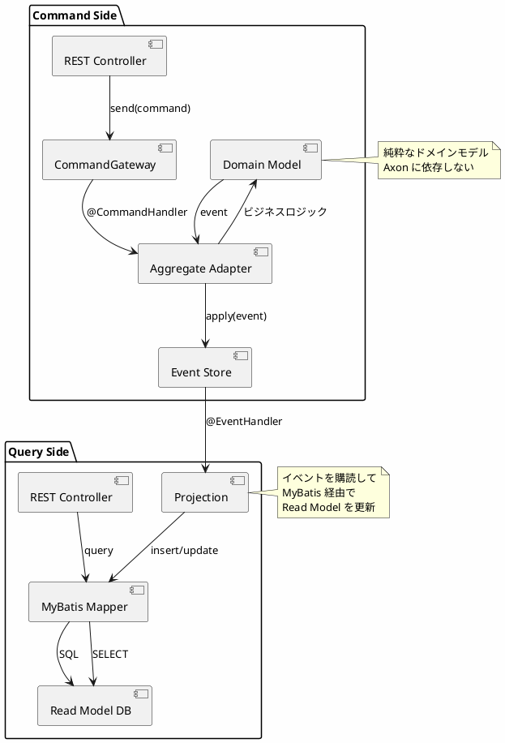

# 実践データベース設計：生産管理システム 研究 5 - Axon CQRS/ES の実装

## はじめに

本研究では、REST API（第32章）、gRPC（研究 3）、GraphQL（研究 4）とは異なるアプローチとして、**CQRS（Command Query Responsibility Segregation）** と **Event Sourcing** による生産管理システムを実装します。Axon Framework を使用し、コマンド（書き込み）とクエリ（読み取り）を分離し、すべての状態変更をイベントとして記録するアーキテクチャを構築します。

研究 1 で構築したヘキサゴナルアーキテクチャの考え方を踏襲しつつ、**ドメインモデルをフレームワークから分離**し、Axon Aggregate Adapter を介して連携させます。Read Model の永続化には **MyBatis** を使用します。

---

## 第38章：Axon CQRS/ES アーキテクチャの基礎

### 38.1 CQRS とは

CQRS（Command Query Responsibility Segregation）は、コマンド（書き込み）とクエリ（読み取り）の責務を分離するアーキテクチャパターンです。生産管理システムでは、製造指図の発行・進捗管理と、在庫照会・生産実績照会を分離することで、それぞれに最適化された設計が可能になります。



**CQRS の利点：**

| 観点 | 説明 |
|------|------|
| **スケーラビリティ** | 読み取りと書き込みを独立してスケール可能 |
| **パフォーマンス** | 読み取りに最適化されたモデルで高速クエリ |
| **複雑性の分離** | 書き込みロジックと読み取りロジックを独立して開発 |
| **監査対応** | Event Sourcing と組み合わせて完全な履歴を保持 |

---

### 38.2 Event Sourcing とは

Event Sourcing は、アプリケーションの状態をイベントの連続として保存するパターンです。生産管理システムでは、製造指図の作成、着手、完成などの状態変更をイベントとして記録し、必要に応じてイベントを再生して現在の状態を再構築します。



**Event Sourcing の利点：**

| 観点 | 説明 |
|------|------|
| **完全な履歴** | すべての状態変更が記録される |
| **監査証跡** | いつ、誰が、何を変更したかが明確 |
| **時間旅行** | 過去の任意の時点の状態を再構築可能 |
| **イベント駆動** | 他システムとの連携が容易 |
| **デバッグ** | 問題発生時にイベントを追跡可能 |

---

### 38.3 ヘキサゴナルアーキテクチャとの統合

本実装では、ヘキサゴナルアーキテクチャ（Ports & Adapters）を採用し、ビジネスロジックを外部依存から分離します。



**設計原則：**

1. **ドメインモデルの純粋性**: ドメインモデルは Axon に依存しない純粋な Java コード
2. **Aggregate Adapter**: Axon Framework 用のアダプターを Application Layer に配置
3. **イベントは公開 API**: イベントは他の Context から参照される公開 API として定義

---

### 38.4 技術スタック

| カテゴリ | 技術 | バージョン |
|---------|------|-----------|
| 言語 | Java | 21 |
| フレームワーク | Spring Boot | 3.4.1 |
| CQRS/ES | Axon Framework | 4.10.3 |
| ORM | MyBatis | 3.0.4 |
| API ドキュメント | SpringDoc OpenAPI | 2.7.0 |
| データベース | H2 (開発) / PostgreSQL (本番) | - |

#### build.gradle.kts

<details>
<summary>コード例: build.gradle.kts</summary>

```kotlin
dependencies {
    // Spring Boot
    implementation("org.springframework.boot:spring-boot-starter-web")
    implementation("org.springframework.boot:spring-boot-starter-validation")

    // Axon Framework
    implementation("org.axonframework:axon-spring-boot-starter:4.10.3") {
        exclude(group = "org.axonframework", module = "axon-server-connector")
    }

    // MyBatis
    implementation("org.mybatis.spring.boot:mybatis-spring-boot-starter:3.0.4")

    // OpenAPI
    implementation("org.springdoc:springdoc-openapi-starter-webmvc-ui:2.7.0")

    // Database
    runtimeOnly("com.h2database:h2")
    runtimeOnly("org.postgresql:postgresql")

    // Test
    testImplementation("org.springframework.boot:spring-boot-starter-test")
    testImplementation("org.axonframework:axon-test:4.10.3")
    testImplementation("org.mybatis.spring.boot:mybatis-spring-boot-starter-test:3.0.4")
}
```

</details>

---

### 38.5 ディレクトリ構造

<details>
<summary>コード例: ディレクトリ構成</summary>

```
src/main/java/com/example/production/
├── app/                              # アプリケーション共通
│   └── RootController.java
├── config/                           # 設定クラス
│   ├── AxonConfig.java
│   ├── MyBatisConfig.java
│   └── OpenApiConfig.java
├── workorder/                        # WorkOrder Bounded Context（製造指図）
│   ├── api/
│   │   └── events/                   # 公開イベント API
│   │       ├── WorkOrderEvent.java   # sealed interface
│   │       ├── WorkOrderCreatedEvent.java
│   │       ├── WorkOrderReleasedEvent.java
│   │       ├── WorkOrderStartedEvent.java
│   │       ├── WorkOrderCompletedEvent.java
│   │       └── WorkOrderCancelledEvent.java
│   ├── adapter/
│   │   ├── inbound/rest/workorders/  # Inbound Adapter (REST)
│   │   │   ├── WorkOrdersController.java
│   │   │   └── protocol/             # Request/Response DTO
│   │   └── outbound/persistence/     # Outbound Adapter (MyBatis)
│   │       ├── entity/
│   │       │   └── WorkOrderEntity.java
│   │       └── mapper/
│   │           └── WorkOrderMapper.java
│   ├── application/
│   │   ├── aggregate/                # Axon Aggregate Adapter
│   │   │   └── WorkOrderAggregateAdapter.java
│   │   ├── policy/                   # イベントハンドラー（Choreography）
│   │   │   └── MaterialEventHandler.java
│   │   └── query/                    # Projection
│   │       └── WorkOrderProjection.java
│   └── domain/
│       └── model/aggregate/workorder/    # 純粋なドメインモデル
│           ├── WorkOrder.java
│           ├── WorkOrderCommands.java
│           └── WorkOrderStatus.java
└── material/                         # Material Bounded Context（資材・在庫）
    ├── api/events/
    │   ├── MaterialEvent.java
    │   ├── MaterialReservedEvent.java
    │   ├── MaterialReservationFailedEvent.java
    │   ├── MaterialIssuedEvent.java
    │   └── MaterialReturnedEvent.java
    ├── application/
    │   ├── aggregate/
    │   │   └── MaterialAggregateAdapter.java
    │   └── policy/
    │       └── WorkOrderEventHandler.java
    └── domain/model/aggregate/material/
        ├── Material.java
        └── MaterialCommands.java

src/main/resources/
├── application.yml
├── schema.sql                        # Read Model スキーマ
└── mapper/
    └── WorkOrderMapper.xml           # MyBatis マッパー XML
```

</details>

---

### 38.6 Axon 設定クラス

<details>
<summary>コード例: AxonConfig.java</summary>

```java
package com.example.production.config;

import org.axonframework.eventsourcing.eventstore.EmbeddedEventStore;
import org.axonframework.eventsourcing.eventstore.EventStorageEngine;
import org.axonframework.eventsourcing.eventstore.EventStore;
import org.axonframework.eventsourcing.eventstore.jdbc.JdbcEventStorageEngine;
import org.axonframework.serialization.Serializer;
import org.axonframework.serialization.json.JacksonSerializer;
import org.springframework.context.annotation.Bean;
import org.springframework.context.annotation.Configuration;

import javax.sql.DataSource;

/**
 * Axon Framework 設定
 */
@Configuration
public class AxonConfig {

    /**
     * JDBC ベースの Event Storage Engine
     */
    @Bean
    public EventStorageEngine eventStorageEngine(
            DataSource dataSource,
            Serializer serializer) {
        return JdbcEventStorageEngine.builder()
                .snapshotSerializer(serializer)
                .eventSerializer(serializer)
                .dataSource(dataSource)
                .build();
    }

    /**
     * Event Store
     */
    @Bean
    public EventStore eventStore(EventStorageEngine eventStorageEngine) {
        return EmbeddedEventStore.builder()
                .storageEngine(eventStorageEngine)
                .build();
    }

    /**
     * JSON シリアライザー
     */
    @Bean
    public Serializer eventSerializer() {
        return JacksonSerializer.defaultSerializer();
    }
}
```

</details>

### 38.7 MyBatis 設定クラス

<details>
<summary>コード例: MyBatisConfig.java</summary>

```java
package com.example.production.config;

import org.apache.ibatis.session.SqlSessionFactory;
import org.mybatis.spring.SqlSessionFactoryBean;
import org.mybatis.spring.annotation.MapperScan;
import org.springframework.context.annotation.Bean;
import org.springframework.context.annotation.Configuration;
import org.springframework.core.io.support.PathMatchingResourcePatternResolver;

import javax.sql.DataSource;

/**
 * MyBatis 設定
 */
@Configuration
@MapperScan(basePackages = {
    "com.example.production.workorder.adapter.outbound.persistence.mapper",
    "com.example.production.material.adapter.outbound.persistence.mapper"
})
public class MyBatisConfig {

    @Bean
    public SqlSessionFactory sqlSessionFactory(DataSource dataSource) throws Exception {
        SqlSessionFactoryBean factoryBean = new SqlSessionFactoryBean();
        factoryBean.setDataSource(dataSource);
        factoryBean.setMapperLocations(
            new PathMatchingResourcePatternResolver()
                .getResources("classpath:mapper/**/*.xml")
        );
        factoryBean.setTypeAliasesPackage(
            "com.example.production.workorder.adapter.outbound.persistence.entity," +
            "com.example.production.material.adapter.outbound.persistence.entity"
        );

        org.apache.ibatis.session.Configuration configuration =
            new org.apache.ibatis.session.Configuration();
        configuration.setMapUnderscoreToCamelCase(true);
        factoryBean.setConfiguration(configuration);

        return factoryBean.getObject();
    }
}
```

</details>

---

## 第39章：ドメインモデルとイベント設計

### 39.1 WorkOrder Bounded Context（製造指図）

製造指図の作成から完成までのライフサイクルを管理します。

#### 状態遷移図



#### イベント一覧

| イベント | 説明 |
|---------|------|
| `WorkOrderCreatedEvent` | 製造指図が作成された |
| `WorkOrderReleasedEvent` | 製造指図がリリースされた（資材引当成功） |
| `WorkOrderRejectedEvent` | 製造指図が却下された（資材引当失敗） |
| `WorkOrderStartedEvent` | 製造が開始された |
| `WorkOrderSuspendedEvent` | 製造が中断された |
| `WorkOrderResumedEvent` | 製造が再開された |
| `WorkOrderCompletedEvent` | 製造が完了した |
| `WorkOrderCancelledEvent` | 製造指図がキャンセルされた |

---

### 39.2 イベント定義（API Layer）

#### sealed interface によるイベントの型安全性

<details>
<summary>コード例: WorkOrderEvent.java</summary>

```java
package com.example.production.workorder.api.events;

/**
 * WorkOrder イベントの sealed interface
 * すべての WorkOrder イベントの親インターフェース
 */
public sealed interface WorkOrderEvent permits
        WorkOrderCreatedEvent,
        WorkOrderReleasedEvent,
        WorkOrderRejectedEvent,
        WorkOrderStartedEvent,
        WorkOrderSuspendedEvent,
        WorkOrderResumedEvent,
        WorkOrderCompletedEvent,
        WorkOrderCancelledEvent {

    String workOrderId();
}
```

</details>

**sealed interface の利点：**

- **網羅性チェック**: switch 式でコンパイル時に全ケースをチェック
- **型安全性**: 許可されたクラスのみが実装可能
- **ドキュメント**: 存在するイベントが一目でわかる

#### イベント record の実装

<details>
<summary>コード例: WorkOrderCreatedEvent.java</summary>

```java
package com.example.production.workorder.api.events;

import java.math.BigDecimal;
import java.time.LocalDate;
import java.time.LocalDateTime;

/**
 * 製造指図作成イベント
 */
public record WorkOrderCreatedEvent(
        String workOrderId,
        String itemId,
        String itemName,
        BigDecimal orderQuantity,
        String unitOfMeasure,
        LocalDate plannedStartDate,
        LocalDate plannedEndDate,
        String workCenterId,
        String createdBy,
        LocalDateTime createdAt
) implements WorkOrderEvent {
}
```

</details>

<details>
<summary>コード例: WorkOrderReleasedEvent.java</summary>

```java
package com.example.production.workorder.api.events;

import java.time.LocalDateTime;

/**
 * 製造指図リリースイベント
 */
public record WorkOrderReleasedEvent(
        String workOrderId,
        String releasedBy,
        LocalDateTime releasedAt
) implements WorkOrderEvent {
}
```

</details>

<details>
<summary>コード例: WorkOrderStartedEvent.java</summary>

```java
package com.example.production.workorder.api.events;

import java.time.LocalDateTime;

/**
 * 製造開始イベント
 */
public record WorkOrderStartedEvent(
        String workOrderId,
        String operatorId,
        LocalDateTime actualStartTime
) implements WorkOrderEvent {
}
```

</details>

<details>
<summary>コード例: WorkOrderCompletedEvent.java</summary>

```java
package com.example.production.workorder.api.events;

import java.math.BigDecimal;
import java.time.LocalDateTime;

/**
 * 製造完了イベント
 */
public record WorkOrderCompletedEvent(
        String workOrderId,
        String itemId,
        BigDecimal completedQuantity,
        BigDecimal defectQuantity,
        String operatorId,
        LocalDateTime actualEndTime
) implements WorkOrderEvent {
}
```

</details>

<details>
<summary>コード例: WorkOrderCancelledEvent.java</summary>

```java
package com.example.production.workorder.api.events;

import java.time.LocalDateTime;

/**
 * 製造指図キャンセルイベント
 */
public record WorkOrderCancelledEvent(
        String workOrderId,
        String itemId,
        String cancelledBy,
        String reason,
        LocalDateTime cancelledAt
) implements WorkOrderEvent {
}
```

</details>

---

### 39.3 コマンド定義（Domain Layer）

<details>
<summary>コード例: WorkOrderCommands.java</summary>

```java
package com.example.production.workorder.domain.model.aggregate.workorder;

import org.axonframework.modelling.command.TargetAggregateIdentifier;
import java.math.BigDecimal;
import java.time.LocalDate;

/**
 * WorkOrder 集約へのコマンド定義
 */
public final class WorkOrderCommands {

    private WorkOrderCommands() {
    }

    /**
     * 製造指図作成コマンド
     */
    public record CreateWorkOrderCommand(
            @TargetAggregateIdentifier
            String workOrderId,
            String itemId,
            String itemName,
            BigDecimal orderQuantity,
            String unitOfMeasure,
            LocalDate plannedStartDate,
            LocalDate plannedEndDate,
            String workCenterId,
            String createdBy
    ) {
    }

    /**
     * 製造指図リリースコマンド
     */
    public record ReleaseWorkOrderCommand(
            @TargetAggregateIdentifier
            String workOrderId,
            String releasedBy
    ) {
    }

    /**
     * 製造指図却下コマンド
     */
    public record RejectWorkOrderCommand(
            @TargetAggregateIdentifier
            String workOrderId,
            String reason
    ) {
    }

    /**
     * 製造開始コマンド
     */
    public record StartWorkOrderCommand(
            @TargetAggregateIdentifier
            String workOrderId,
            String operatorId
    ) {
    }

    /**
     * 製造中断コマンド
     */
    public record SuspendWorkOrderCommand(
            @TargetAggregateIdentifier
            String workOrderId,
            String reason,
            String suspendedBy
    ) {
    }

    /**
     * 製造再開コマンド
     */
    public record ResumeWorkOrderCommand(
            @TargetAggregateIdentifier
            String workOrderId,
            String resumedBy
    ) {
    }

    /**
     * 製造完了コマンド
     */
    public record CompleteWorkOrderCommand(
            @TargetAggregateIdentifier
            String workOrderId,
            BigDecimal completedQuantity,
            BigDecimal defectQuantity,
            String operatorId
    ) {
    }

    /**
     * キャンセルコマンド
     */
    public record CancelWorkOrderCommand(
            @TargetAggregateIdentifier
            String workOrderId,
            String cancelledBy,
            String reason
    ) {
    }
}
```

</details>

**@TargetAggregateIdentifier の役割：**

- Axon がコマンドをどの集約インスタンスにルーティングするかを決定
- 集約の一意識別子となるフィールドに付与

---

### 39.4 ドメインモデル（純粋な Java）

<details>
<summary>コード例: WorkOrder.java</summary>

```java
package com.example.production.workorder.domain.model.aggregate.workorder;

import com.example.production.workorder.api.events.*;
import java.math.BigDecimal;
import java.time.LocalDate;
import java.time.LocalDateTime;

/**
 * WorkOrder ドメインモデル（Axon 非依存）
 * 純粋なビジネスロジックのみを含む
 */
public record WorkOrder(
        String workOrderId,
        String itemId,
        String itemName,
        BigDecimal orderQuantity,
        String unitOfMeasure,
        LocalDate plannedStartDate,
        LocalDate plannedEndDate,
        String workCenterId,
        WorkOrderStatus status
) {

    // ======== ファクトリメソッド ========

    /**
     * 製造指図作成
     */
    public static WorkOrderCreatedEvent create(
            String workOrderId,
            String itemId,
            String itemName,
            BigDecimal orderQuantity,
            String unitOfMeasure,
            LocalDate plannedStartDate,
            LocalDate plannedEndDate,
            String workCenterId,
            String createdBy
    ) {
        // バリデーション
        if (orderQuantity.compareTo(BigDecimal.ZERO) <= 0) {
            throw new IllegalArgumentException("Order quantity must be positive");
        }
        if (plannedEndDate.isBefore(plannedStartDate)) {
            throw new IllegalArgumentException("Planned end date must be after start date");
        }

        return new WorkOrderCreatedEvent(
                workOrderId,
                itemId,
                itemName,
                orderQuantity,
                unitOfMeasure,
                plannedStartDate,
                plannedEndDate,
                workCenterId,
                createdBy,
                LocalDateTime.now()
        );
    }

    /**
     * イベントからの再構築
     */
    public static WorkOrder from(WorkOrderCreatedEvent event) {
        return new WorkOrder(
                event.workOrderId(),
                event.itemId(),
                event.itemName(),
                event.orderQuantity(),
                event.unitOfMeasure(),
                event.plannedStartDate(),
                event.plannedEndDate(),
                event.workCenterId(),
                WorkOrderStatus.CREATED
        );
    }

    // ======== 状態遷移メソッド ========

    /**
     * 製造指図リリース
     */
    public WorkOrderReleasedEvent release(String releasedBy) {
        if (status != WorkOrderStatus.CREATED) {
            throw new IllegalStateException("Only created work orders can be released");
        }
        return new WorkOrderReleasedEvent(workOrderId, releasedBy, LocalDateTime.now());
    }

    /**
     * 製造指図却下
     */
    public WorkOrderRejectedEvent reject(String reason) {
        if (status != WorkOrderStatus.CREATED) {
            throw new IllegalStateException("Only created work orders can be rejected");
        }
        return new WorkOrderRejectedEvent(workOrderId, reason, LocalDateTime.now());
    }

    /**
     * 製造開始
     */
    public WorkOrderStartedEvent start(String operatorId) {
        if (status != WorkOrderStatus.RELEASED) {
            throw new IllegalStateException("Only released work orders can be started");
        }
        return new WorkOrderStartedEvent(workOrderId, operatorId, LocalDateTime.now());
    }

    /**
     * 製造中断
     */
    public WorkOrderSuspendedEvent suspend(String reason, String suspendedBy) {
        if (status != WorkOrderStatus.IN_PROGRESS) {
            throw new IllegalStateException("Only in-progress work orders can be suspended");
        }
        return new WorkOrderSuspendedEvent(workOrderId, reason, suspendedBy, LocalDateTime.now());
    }

    /**
     * 製造再開
     */
    public WorkOrderResumedEvent resume(String resumedBy) {
        if (status != WorkOrderStatus.SUSPENDED) {
            throw new IllegalStateException("Only suspended work orders can be resumed");
        }
        return new WorkOrderResumedEvent(workOrderId, resumedBy, LocalDateTime.now());
    }

    /**
     * 製造完了
     */
    public WorkOrderCompletedEvent complete(
            BigDecimal completedQuantity,
            BigDecimal defectQuantity,
            String operatorId
    ) {
        if (status != WorkOrderStatus.IN_PROGRESS) {
            throw new IllegalStateException("Only in-progress work orders can be completed");
        }
        if (completedQuantity.compareTo(BigDecimal.ZERO) < 0) {
            throw new IllegalArgumentException("Completed quantity cannot be negative");
        }
        if (defectQuantity.compareTo(BigDecimal.ZERO) < 0) {
            throw new IllegalArgumentException("Defect quantity cannot be negative");
        }
        return new WorkOrderCompletedEvent(
                workOrderId,
                itemId,
                completedQuantity,
                defectQuantity,
                operatorId,
                LocalDateTime.now()
        );
    }

    /**
     * キャンセル
     */
    public WorkOrderCancelledEvent cancel(String cancelledBy, String reason) {
        if (status == WorkOrderStatus.COMPLETED) {
            throw new IllegalStateException("Completed work orders cannot be cancelled");
        }
        if (status == WorkOrderStatus.CANCELLED) {
            throw new IllegalStateException("Work order is already cancelled");
        }
        return new WorkOrderCancelledEvent(workOrderId, itemId, cancelledBy, reason, LocalDateTime.now());
    }

    // ======== イベント適用メソッド ========

    /**
     * イベントを適用して新しい状態を生成
     */
    public WorkOrder apply(WorkOrderEvent event) {
        return switch (event) {
            case WorkOrderCreatedEvent e -> from(e);
            case WorkOrderReleasedEvent e -> withStatus(WorkOrderStatus.RELEASED);
            case WorkOrderRejectedEvent e -> withStatus(WorkOrderStatus.REJECTED);
            case WorkOrderStartedEvent e -> withStatus(WorkOrderStatus.IN_PROGRESS);
            case WorkOrderSuspendedEvent e -> withStatus(WorkOrderStatus.SUSPENDED);
            case WorkOrderResumedEvent e -> withStatus(WorkOrderStatus.IN_PROGRESS);
            case WorkOrderCompletedEvent e -> withStatus(WorkOrderStatus.COMPLETED);
            case WorkOrderCancelledEvent e -> withStatus(WorkOrderStatus.CANCELLED);
        };
    }

    /**
     * 状態更新ヘルパー
     */
    private WorkOrder withStatus(WorkOrderStatus newStatus) {
        return new WorkOrder(
                workOrderId, itemId, itemName, orderQuantity, unitOfMeasure,
                plannedStartDate, plannedEndDate, workCenterId, newStatus
        );
    }
}
```

</details>

<details>
<summary>コード例: WorkOrderStatus.java</summary>

```java
package com.example.production.workorder.domain.model.aggregate.workorder;

/**
 * 製造指図ステータス
 */
public enum WorkOrderStatus {
    CREATED,      // 作成済み
    RELEASED,     // リリース済み（資材引当完了）
    REJECTED,     // 却下（資材引当失敗）
    IN_PROGRESS,  // 製造中
    SUSPENDED,    // 中断
    COMPLETED,    // 完了
    CANCELLED     // キャンセル
}
```

</details>

**ドメインモデル設計原則：**

| 原則 | 説明 |
|------|------|
| **Axon 非依存** | ドメインモデルにフレームワーク依存を持たせない |
| **イミュータブル** | record でイミュータブルに設計 |
| **イベントを返す** | 状態遷移メソッドはイベントを返す |
| **最小限のフィールド** | 状態遷移の判定に必要な最小限のみ保持 |

---

### 39.5 Material Bounded Context（資材・在庫）

部品・原材料の引当・払出・返却を管理します。

#### イベント定義

<details>
<summary>コード例: MaterialEvent.java</summary>

```java
package com.example.production.material.api.events;

/**
 * Material イベントの sealed interface
 */
public sealed interface MaterialEvent permits
        MaterialInitializedEvent,
        MaterialReservedEvent,
        MaterialReservationFailedEvent,
        MaterialIssuedEvent,
        MaterialReturnedEvent {

    String materialId();
}
```

</details>

<details>
<summary>コード例: MaterialReservedEvent.java</summary>

```java
package com.example.production.material.api.events;

import java.math.BigDecimal;
import java.time.LocalDateTime;

/**
 * 資材引当成功イベント
 */
public record MaterialReservedEvent(
        String materialId,
        String workOrderId,
        BigDecimal quantity,
        LocalDateTime reservedAt
) implements MaterialEvent {
}
```

</details>

<details>
<summary>コード例: MaterialReservationFailedEvent.java</summary>

```java
package com.example.production.material.api.events;

import java.math.BigDecimal;
import java.time.LocalDateTime;

/**
 * 資材引当失敗イベント
 */
public record MaterialReservationFailedEvent(
        String materialId,
        String workOrderId,
        BigDecimal requestedQuantity,
        BigDecimal availableQuantity,
        String reason,
        LocalDateTime failedAt
) implements MaterialEvent {
}
```

</details>

<details>
<summary>コード例: MaterialIssuedEvent.java</summary>

```java
package com.example.production.material.api.events;

import java.math.BigDecimal;
import java.time.LocalDateTime;

/**
 * 資材払出イベント
 */
public record MaterialIssuedEvent(
        String materialId,
        String workOrderId,
        BigDecimal quantity,
        String issuedBy,
        LocalDateTime issuedAt
) implements MaterialEvent {
}
```

</details>

#### ドメインモデル

<details>
<summary>コード例: Material.java</summary>

```java
package com.example.production.material.domain.model.aggregate.material;

import com.example.production.material.api.events.*;
import java.math.BigDecimal;
import java.time.LocalDateTime;
import java.util.HashMap;
import java.util.Map;

/**
 * Material ドメインモデル（資材・在庫管理）
 */
public record Material(
        String materialId,
        String itemId,
        String locationId,
        BigDecimal totalQuantity,
        BigDecimal availableQuantity,
        Map<String, BigDecimal> reservations  // workOrderId -> quantity
) {

    public Material {
        reservations = reservations != null ? new HashMap<>(reservations) : new HashMap<>();
    }

    /**
     * 初期化ファクトリ
     */
    public static Material initial(String materialId, String itemId, String locationId, BigDecimal initialQuantity) {
        return new Material(materialId, itemId, locationId, initialQuantity, initialQuantity, new HashMap<>());
    }

    /**
     * 資材引当（成功または失敗イベントを返す）
     */
    public MaterialEvent reserve(String workOrderId, BigDecimal quantity) {
        if (reservations.containsKey(workOrderId)) {
            return new MaterialReservationFailedEvent(
                    materialId, workOrderId, quantity, availableQuantity,
                    "Work order already has a reservation",
                    LocalDateTime.now()
            );
        }

        if (availableQuantity.compareTo(quantity) < 0) {
            return new MaterialReservationFailedEvent(
                    materialId, workOrderId, quantity, availableQuantity,
                    "Insufficient material",
                    LocalDateTime.now()
            );
        }

        return new MaterialReservedEvent(materialId, workOrderId, quantity, LocalDateTime.now());
    }

    /**
     * 資材払出（製造開始時）
     */
    public MaterialIssuedEvent issue(String workOrderId, BigDecimal quantity, String issuedBy) {
        if (!reservations.containsKey(workOrderId)) {
            throw new IllegalStateException("No reservation found for work order: " + workOrderId);
        }
        return new MaterialIssuedEvent(materialId, workOrderId, quantity, issuedBy, LocalDateTime.now());
    }

    /**
     * 資材返却（キャンセル時）
     */
    public MaterialReturnedEvent returnMaterial(String workOrderId, BigDecimal quantity, String returnedBy) {
        return new MaterialReturnedEvent(materialId, workOrderId, quantity, returnedBy, LocalDateTime.now());
    }

    /**
     * イベント適用
     */
    public Material apply(MaterialEvent event) {
        return switch (event) {
            case MaterialInitializedEvent e -> initial(e.materialId(), e.itemId(), e.locationId(), e.initialQuantity());
            case MaterialReservedEvent e -> {
                var newReservations = new HashMap<>(reservations);
                newReservations.put(e.workOrderId(), e.quantity());
                yield new Material(
                        materialId, itemId, locationId,
                        totalQuantity,
                        availableQuantity.subtract(e.quantity()),
                        newReservations
                );
            }
            case MaterialReservationFailedEvent e -> this;  // 状態変更なし
            case MaterialIssuedEvent e -> {
                var newReservations = new HashMap<>(reservations);
                newReservations.remove(e.workOrderId());
                yield new Material(
                        materialId, itemId, locationId,
                        totalQuantity.subtract(e.quantity()),
                        availableQuantity,
                        newReservations
                );
            }
            case MaterialReturnedEvent e -> new Material(
                    materialId, itemId, locationId,
                    totalQuantity.add(e.quantity()),
                    availableQuantity.add(e.quantity()),
                    reservations
            );
        };
    }
}
```

</details>

---

## 第40章：Aggregate Adapter と Policy Handler

### 40.1 Aggregate Adapter パターン

Aggregate Adapter は、純粋なドメインモデルと Axon Framework を繋ぐアダプター層です。フレームワーク固有のアノテーションやライフサイクル処理をドメインモデルから分離します。



---

### 40.2 WorkOrder Aggregate Adapter

<details>
<summary>コード例: WorkOrderAggregateAdapter.java</summary>

```java
package com.example.production.workorder.application.aggregate;

import com.example.production.workorder.api.events.*;
import com.example.production.workorder.domain.model.aggregate.workorder.WorkOrder;
import com.example.production.workorder.domain.model.aggregate.workorder.WorkOrderCommands.*;
import org.axonframework.commandhandling.CommandHandler;
import org.axonframework.eventsourcing.EventSourcingHandler;
import org.axonframework.modelling.command.AggregateIdentifier;
import org.axonframework.modelling.command.AggregateLifecycle;
import org.axonframework.spring.stereotype.Aggregate;

/**
 * WorkOrder Aggregate Adapter（Axon Framework 用）
 */
@Aggregate
public class WorkOrderAggregateAdapter {

    @AggregateIdentifier
    private String workOrderId;

    private WorkOrder workOrder;

    /**
     * Axon が使用するデフォルトコンストラクタ
     */
    protected WorkOrderAggregateAdapter() {
    }

    // ======== Command Handlers ========

    /**
     * 集約作成コマンドハンドラー（コンストラクタ）
     */
    @CommandHandler
    public WorkOrderAggregateAdapter(CreateWorkOrderCommand command) {
        // ドメインモデルのファクトリメソッドを呼び出し
        var event = WorkOrder.create(
                command.workOrderId(),
                command.itemId(),
                command.itemName(),
                command.orderQuantity(),
                command.unitOfMeasure(),
                command.plannedStartDate(),
                command.plannedEndDate(),
                command.workCenterId(),
                command.createdBy()
        );
        // イベントを発行
        AggregateLifecycle.apply(event);
    }

    /**
     * リリースコマンドハンドラー
     */
    @CommandHandler
    public void handle(ReleaseWorkOrderCommand command) {
        var event = workOrder.release(command.releasedBy());
        AggregateLifecycle.apply(event);
    }

    /**
     * 却下コマンドハンドラー
     */
    @CommandHandler
    public void handle(RejectWorkOrderCommand command) {
        var event = workOrder.reject(command.reason());
        AggregateLifecycle.apply(event);
    }

    /**
     * 製造開始コマンドハンドラー
     */
    @CommandHandler
    public void handle(StartWorkOrderCommand command) {
        var event = workOrder.start(command.operatorId());
        AggregateLifecycle.apply(event);
    }

    /**
     * 中断コマンドハンドラー
     */
    @CommandHandler
    public void handle(SuspendWorkOrderCommand command) {
        var event = workOrder.suspend(command.reason(), command.suspendedBy());
        AggregateLifecycle.apply(event);
    }

    /**
     * 再開コマンドハンドラー
     */
    @CommandHandler
    public void handle(ResumeWorkOrderCommand command) {
        var event = workOrder.resume(command.resumedBy());
        AggregateLifecycle.apply(event);
    }

    /**
     * 完了コマンドハンドラー
     */
    @CommandHandler
    public void handle(CompleteWorkOrderCommand command) {
        var event = workOrder.complete(
                command.completedQuantity(),
                command.defectQuantity(),
                command.operatorId()
        );
        AggregateLifecycle.apply(event);
    }

    /**
     * キャンセルコマンドハンドラー
     */
    @CommandHandler
    public void handle(CancelWorkOrderCommand command) {
        var event = workOrder.cancel(command.cancelledBy(), command.reason());
        AggregateLifecycle.apply(event);
    }

    // ======== Event Sourcing Handlers（状態復元）========

    @EventSourcingHandler
    public void on(WorkOrderCreatedEvent event) {
        this.workOrderId = event.workOrderId();
        this.workOrder = WorkOrder.from(event);
    }

    @EventSourcingHandler
    public void on(WorkOrderReleasedEvent event) {
        this.workOrder = workOrder.apply(event);
    }

    @EventSourcingHandler
    public void on(WorkOrderRejectedEvent event) {
        this.workOrder = workOrder.apply(event);
    }

    @EventSourcingHandler
    public void on(WorkOrderStartedEvent event) {
        this.workOrder = workOrder.apply(event);
    }

    @EventSourcingHandler
    public void on(WorkOrderSuspendedEvent event) {
        this.workOrder = workOrder.apply(event);
    }

    @EventSourcingHandler
    public void on(WorkOrderResumedEvent event) {
        this.workOrder = workOrder.apply(event);
    }

    @EventSourcingHandler
    public void on(WorkOrderCompletedEvent event) {
        this.workOrder = workOrder.apply(event);
    }

    @EventSourcingHandler
    public void on(WorkOrderCancelledEvent event) {
        this.workOrder = workOrder.apply(event);
    }
}
```

</details>

**Axon アノテーション解説：**

| アノテーション | 説明 |
|--------------|------|
| `@Aggregate` | Event Sourcing 集約であることを宣言 |
| `@AggregateIdentifier` | 集約の識別子フィールド |
| `@CommandHandler` | コマンドを処理するメソッド |
| `@EventSourcingHandler` | イベントから状態を復元するメソッド |
| `AggregateLifecycle.apply()` | イベントを発行するメソッド |

---

### 40.3 Material Aggregate Adapter

<details>
<summary>コード例: MaterialAggregateAdapter.java</summary>

```java
package com.example.production.material.application.aggregate;

import com.example.production.material.api.events.*;
import com.example.production.material.domain.model.aggregate.material.Material;
import com.example.production.material.domain.model.aggregate.material.MaterialCommands.*;
import org.axonframework.commandhandling.CommandHandler;
import org.axonframework.eventsourcing.EventSourcingHandler;
import org.axonframework.modelling.command.AggregateIdentifier;
import org.axonframework.modelling.command.AggregateLifecycle;
import org.axonframework.spring.stereotype.Aggregate;

import java.time.LocalDateTime;

/**
 * Material Aggregate Adapter
 */
@Aggregate
public class MaterialAggregateAdapter {

    @AggregateIdentifier
    private String materialId;

    private Material material;

    protected MaterialAggregateAdapter() {
    }

    @CommandHandler
    public MaterialAggregateAdapter(InitializeMaterialCommand command) {
        AggregateLifecycle.apply(new MaterialInitializedEvent(
                command.materialId(),
                command.itemId(),
                command.locationId(),
                command.initialQuantity(),
                LocalDateTime.now()
        ));
    }

    @CommandHandler
    public void handle(ReserveMaterialCommand command) {
        var event = material.reserve(command.workOrderId(), command.quantity());
        AggregateLifecycle.apply(event);
    }

    @CommandHandler
    public void handle(IssueMaterialCommand command) {
        var event = material.issue(command.workOrderId(), command.quantity(), command.issuedBy());
        AggregateLifecycle.apply(event);
    }

    @CommandHandler
    public void handle(ReturnMaterialCommand command) {
        var event = material.returnMaterial(command.workOrderId(), command.quantity(), command.returnedBy());
        AggregateLifecycle.apply(event);
    }

    @EventSourcingHandler
    public void on(MaterialInitializedEvent event) {
        this.materialId = event.materialId();
        this.material = Material.initial(
                event.materialId(),
                event.itemId(),
                event.locationId(),
                event.initialQuantity()
        );
    }

    @EventSourcingHandler
    public void on(MaterialReservedEvent event) {
        this.material = material.apply(event);
    }

    @EventSourcingHandler
    public void on(MaterialReservationFailedEvent event) {
        // 状態変更なし
    }

    @EventSourcingHandler
    public void on(MaterialIssuedEvent event) {
        this.material = material.apply(event);
    }

    @EventSourcingHandler
    public void on(MaterialReturnedEvent event) {
        this.material = material.apply(event);
    }
}
```

</details>

---

### 40.4 Policy Handler（Choreography パターン）

Policy Handler は、他の Bounded Context から発行されたイベントを購読し、自律的に反応する処理を実装します。Choreography パターンでは、各 Context が独立して動作し、イベントを介して連携します。



---

### 40.5 WorkOrderEventHandler（Material Context 内）

<details>
<summary>コード例: WorkOrderEventHandler.java</summary>

```java
package com.example.production.material.application.policy;

import com.example.production.material.domain.model.aggregate.material.MaterialCommands.*;
import com.example.production.workorder.api.events.WorkOrderCancelledEvent;
import com.example.production.workorder.api.events.WorkOrderCreatedEvent;
import com.example.production.workorder.api.events.WorkOrderStartedEvent;
import org.axonframework.commandhandling.gateway.CommandGateway;
import org.axonframework.eventhandling.EventHandler;
import org.springframework.stereotype.Component;

import java.math.BigDecimal;

/**
 * WorkOrder イベントに反応して資材操作を実行する Policy Handler
 */
@Component
public class WorkOrderEventHandler {

    private final CommandGateway commandGateway;

    public WorkOrderEventHandler(CommandGateway commandGateway) {
        this.commandGateway = commandGateway;
    }

    /**
     * Policy: "When a work order is created, reserve material"
     */
    @EventHandler
    public void on(WorkOrderCreatedEvent event) {
        // BOM に基づいて必要な資材を引当
        // 簡略化のため、単一の資材を引当
        var command = new ReserveMaterialCommand(
                "material-" + event.itemId(),  // 資材ID（簡略化）
                event.workOrderId(),
                event.orderQuantity()
        );
        commandGateway.send(command);
    }

    /**
     * Policy: "When a work order is started, issue material"
     */
    @EventHandler
    public void on(WorkOrderStartedEvent event) {
        // 製造開始時に資材を払出
        // 実際には workOrderId から必要な資材を取得
        var command = new IssueMaterialCommand(
                "material-default",  // 資材ID（簡略化）
                event.workOrderId(),
                BigDecimal.ONE,  // 数量（簡略化）
                event.operatorId()
        );
        commandGateway.send(command);
    }

    /**
     * Policy: "When a work order is cancelled, return material"
     */
    @EventHandler
    public void on(WorkOrderCancelledEvent event) {
        var command = new ReturnMaterialCommand(
                "material-" + event.itemId(),
                event.workOrderId(),
                BigDecimal.ONE,  // 数量（簡略化）
                event.cancelledBy()
        );
        commandGateway.send(command);
    }
}
```

</details>

---

### 40.6 MaterialEventHandler（WorkOrder Context 内）

<details>
<summary>コード例: MaterialEventHandler.java</summary>

```java
package com.example.production.workorder.application.policy;

import com.example.production.material.api.events.MaterialReservationFailedEvent;
import com.example.production.material.api.events.MaterialReservedEvent;
import com.example.production.workorder.domain.model.aggregate.workorder.WorkOrderCommands.*;
import org.axonframework.commandhandling.gateway.CommandGateway;
import org.axonframework.eventhandling.EventHandler;
import org.springframework.stereotype.Component;

/**
 * Material イベントに反応して製造指図状態を更新する Policy Handler
 */
@Component
public class MaterialEventHandler {

    private final CommandGateway commandGateway;

    public MaterialEventHandler(CommandGateway commandGateway) {
        this.commandGateway = commandGateway;
    }

    /**
     * Policy: "When material is reserved, release the work order"
     */
    @EventHandler
    public void on(MaterialReservedEvent event) {
        var command = new ReleaseWorkOrderCommand(event.workOrderId(), "system");
        commandGateway.send(command);
    }

    /**
     * Policy: "When material reservation fails, reject the work order"
     */
    @EventHandler
    public void on(MaterialReservationFailedEvent event) {
        var command = new RejectWorkOrderCommand(event.workOrderId(), event.reason());
        commandGateway.send(command);
    }
}
```

</details>

**Policy Handler の設計原則：**

| 原則 | 説明 |
|------|------|
| **単一責任** | 1 つの Policy Handler は 1 つの関心事のみを扱う |
| **疎結合** | 他の Context のイベントを購読し、自 Context のコマンドを発行 |
| **自律性** | 他のサービスに依存せず独立して動作 |
| **冪等性** | 同じイベントを複数回受信しても問題ないよう設計 |

---

## 第41章：Projection と Read Model

### 41.1 Projection の役割

Projection は、イベントを購読して Read Model（クエリ用のデータモデル）を更新するコンポーネントです。CQRS では、書き込みモデル（Event Store）と読み取りモデル（Read Model DB）を分離し、それぞれに最適化されたデータ構造を使用します。



---

### 41.2 WorkOrder Projection（MyBatis 版）

<details>
<summary>コード例: WorkOrderProjection.java</summary>

```java
package com.example.production.workorder.application.query;

import com.example.production.workorder.adapter.outbound.persistence.entity.WorkOrderEntity;
import com.example.production.workorder.adapter.outbound.persistence.mapper.WorkOrderMapper;
import com.example.production.workorder.api.events.*;
import org.axonframework.eventhandling.EventHandler;
import org.springframework.stereotype.Component;

/**
 * WorkOrder Projection（MyBatis を使用した Read Model の更新）
 */
@Component
public class WorkOrderProjection {

    private final WorkOrderMapper workOrderMapper;

    public WorkOrderProjection(WorkOrderMapper workOrderMapper) {
        this.workOrderMapper = workOrderMapper;
    }

    @EventHandler
    public void on(WorkOrderCreatedEvent event) {
        var entity = new WorkOrderEntity();
        entity.setWorkOrderId(event.workOrderId());
        entity.setItemId(event.itemId());
        entity.setItemName(event.itemName());
        entity.setOrderQuantity(event.orderQuantity());
        entity.setUnitOfMeasure(event.unitOfMeasure());
        entity.setPlannedStartDate(event.plannedStartDate());
        entity.setPlannedEndDate(event.plannedEndDate());
        entity.setWorkCenterId(event.workCenterId());
        entity.setStatus("CREATED");
        entity.setCreatedBy(event.createdBy());
        entity.setCreatedAt(event.createdAt());

        workOrderMapper.insert(entity);
    }

    @EventHandler
    public void on(WorkOrderReleasedEvent event) {
        workOrderMapper.updateStatus(event.workOrderId(), "RELEASED");
        workOrderMapper.updateReleasedAt(event.workOrderId(), event.releasedBy(), event.releasedAt());
    }

    @EventHandler
    public void on(WorkOrderRejectedEvent event) {
        workOrderMapper.updateStatus(event.workOrderId(), "REJECTED");
        workOrderMapper.updateRejection(event.workOrderId(), event.reason(), event.rejectedAt());
    }

    @EventHandler
    public void on(WorkOrderStartedEvent event) {
        workOrderMapper.updateStatus(event.workOrderId(), "IN_PROGRESS");
        workOrderMapper.updateStarted(event.workOrderId(), event.operatorId(), event.actualStartTime());
    }

    @EventHandler
    public void on(WorkOrderSuspendedEvent event) {
        workOrderMapper.updateStatus(event.workOrderId(), "SUSPENDED");
        workOrderMapper.updateSuspended(event.workOrderId(), event.reason(), event.suspendedBy(), event.suspendedAt());
    }

    @EventHandler
    public void on(WorkOrderResumedEvent event) {
        workOrderMapper.updateStatus(event.workOrderId(), "IN_PROGRESS");
        workOrderMapper.updateResumed(event.workOrderId(), event.resumedBy(), event.resumedAt());
    }

    @EventHandler
    public void on(WorkOrderCompletedEvent event) {
        workOrderMapper.updateStatus(event.workOrderId(), "COMPLETED");
        workOrderMapper.updateCompleted(
            event.workOrderId(),
            event.completedQuantity(),
            event.defectQuantity(),
            event.operatorId(),
            event.actualEndTime()
        );
    }

    @EventHandler
    public void on(WorkOrderCancelledEvent event) {
        workOrderMapper.updateStatus(event.workOrderId(), "CANCELLED");
        workOrderMapper.updateCancellation(
            event.workOrderId(),
            event.cancelledBy(),
            event.reason(),
            event.cancelledAt()
        );
    }
}
```

</details>

---

### 41.3 Read Model Entity

<details>
<summary>コード例: WorkOrderEntity.java</summary>

```java
package com.example.production.workorder.adapter.outbound.persistence.entity;

import java.math.BigDecimal;
import java.time.LocalDate;
import java.time.LocalDateTime;

/**
 * WorkOrder Read Model（表示用のすべてのフィールドを保持）
 */
public class WorkOrderEntity {

    private String workOrderId;
    private String itemId;
    private String itemName;
    private BigDecimal orderQuantity;
    private String unitOfMeasure;
    private LocalDate plannedStartDate;
    private LocalDate plannedEndDate;
    private String workCenterId;
    private String status;
    private String createdBy;
    private LocalDateTime createdAt;
    private String releasedBy;
    private LocalDateTime releasedAt;
    private String rejectionReason;
    private LocalDateTime rejectedAt;
    private String operatorId;
    private LocalDateTime actualStartTime;
    private LocalDateTime actualEndTime;
    private BigDecimal completedQuantity;
    private BigDecimal defectQuantity;
    private String suspendReason;
    private String suspendedBy;
    private LocalDateTime suspendedAt;
    private String resumedBy;
    private LocalDateTime resumedAt;
    private String cancelledBy;
    private String cancellationReason;
    private LocalDateTime cancelledAt;

    // Getters and Setters
    public String getWorkOrderId() { return workOrderId; }
    public void setWorkOrderId(String workOrderId) { this.workOrderId = workOrderId; }

    public String getItemId() { return itemId; }
    public void setItemId(String itemId) { this.itemId = itemId; }

    public String getItemName() { return itemName; }
    public void setItemName(String itemName) { this.itemName = itemName; }

    public BigDecimal getOrderQuantity() { return orderQuantity; }
    public void setOrderQuantity(BigDecimal orderQuantity) { this.orderQuantity = orderQuantity; }

    public String getUnitOfMeasure() { return unitOfMeasure; }
    public void setUnitOfMeasure(String unitOfMeasure) { this.unitOfMeasure = unitOfMeasure; }

    public LocalDate getPlannedStartDate() { return plannedStartDate; }
    public void setPlannedStartDate(LocalDate plannedStartDate) { this.plannedStartDate = plannedStartDate; }

    public LocalDate getPlannedEndDate() { return plannedEndDate; }
    public void setPlannedEndDate(LocalDate plannedEndDate) { this.plannedEndDate = plannedEndDate; }

    public String getWorkCenterId() { return workCenterId; }
    public void setWorkCenterId(String workCenterId) { this.workCenterId = workCenterId; }

    public String getStatus() { return status; }
    public void setStatus(String status) { this.status = status; }

    public String getCreatedBy() { return createdBy; }
    public void setCreatedBy(String createdBy) { this.createdBy = createdBy; }

    public LocalDateTime getCreatedAt() { return createdAt; }
    public void setCreatedAt(LocalDateTime createdAt) { this.createdAt = createdAt; }

    public String getReleasedBy() { return releasedBy; }
    public void setReleasedBy(String releasedBy) { this.releasedBy = releasedBy; }

    public LocalDateTime getReleasedAt() { return releasedAt; }
    public void setReleasedAt(LocalDateTime releasedAt) { this.releasedAt = releasedAt; }

    public String getRejectionReason() { return rejectionReason; }
    public void setRejectionReason(String rejectionReason) { this.rejectionReason = rejectionReason; }

    public LocalDateTime getRejectedAt() { return rejectedAt; }
    public void setRejectedAt(LocalDateTime rejectedAt) { this.rejectedAt = rejectedAt; }

    public String getOperatorId() { return operatorId; }
    public void setOperatorId(String operatorId) { this.operatorId = operatorId; }

    public LocalDateTime getActualStartTime() { return actualStartTime; }
    public void setActualStartTime(LocalDateTime actualStartTime) { this.actualStartTime = actualStartTime; }

    public LocalDateTime getActualEndTime() { return actualEndTime; }
    public void setActualEndTime(LocalDateTime actualEndTime) { this.actualEndTime = actualEndTime; }

    public BigDecimal getCompletedQuantity() { return completedQuantity; }
    public void setCompletedQuantity(BigDecimal completedQuantity) { this.completedQuantity = completedQuantity; }

    public BigDecimal getDefectQuantity() { return defectQuantity; }
    public void setDefectQuantity(BigDecimal defectQuantity) { this.defectQuantity = defectQuantity; }

    public String getSuspendReason() { return suspendReason; }
    public void setSuspendReason(String suspendReason) { this.suspendReason = suspendReason; }

    public String getSuspendedBy() { return suspendedBy; }
    public void setSuspendedBy(String suspendedBy) { this.suspendedBy = suspendedBy; }

    public LocalDateTime getSuspendedAt() { return suspendedAt; }
    public void setSuspendedAt(LocalDateTime suspendedAt) { this.suspendedAt = suspendedAt; }

    public String getResumedBy() { return resumedBy; }
    public void setResumedBy(String resumedBy) { this.resumedBy = resumedBy; }

    public LocalDateTime getResumedAt() { return resumedAt; }
    public void setResumedAt(LocalDateTime resumedAt) { this.resumedAt = resumedAt; }

    public String getCancelledBy() { return cancelledBy; }
    public void setCancelledBy(String cancelledBy) { this.cancelledBy = cancelledBy; }

    public String getCancellationReason() { return cancellationReason; }
    public void setCancellationReason(String cancellationReason) { this.cancellationReason = cancellationReason; }

    public LocalDateTime getCancelledAt() { return cancelledAt; }
    public void setCancelledAt(LocalDateTime cancelledAt) { this.cancelledAt = cancelledAt; }
}
```

</details>

---

### 41.4 MyBatis Mapper インターフェース

<details>
<summary>コード例: WorkOrderMapper.java</summary>

```java
package com.example.production.workorder.adapter.outbound.persistence.mapper;

import com.example.production.workorder.adapter.outbound.persistence.entity.WorkOrderEntity;
import org.apache.ibatis.annotations.Mapper;
import org.apache.ibatis.annotations.Param;

import java.math.BigDecimal;
import java.time.LocalDateTime;
import java.util.List;
import java.util.Optional;

/**
 * WorkOrder MyBatis Mapper
 */
@Mapper
public interface WorkOrderMapper {

    // 挿入
    void insert(WorkOrderEntity entity);

    // 検索
    Optional<WorkOrderEntity> findById(@Param("workOrderId") String workOrderId);

    List<WorkOrderEntity> findAll();

    List<WorkOrderEntity> findByItemId(@Param("itemId") String itemId);

    List<WorkOrderEntity> findByStatus(@Param("status") String status);

    List<WorkOrderEntity> findByWorkCenterId(@Param("workCenterId") String workCenterId);

    // 更新
    void updateStatus(@Param("workOrderId") String workOrderId, @Param("status") String status);

    void updateReleasedAt(
        @Param("workOrderId") String workOrderId,
        @Param("releasedBy") String releasedBy,
        @Param("releasedAt") LocalDateTime releasedAt
    );

    void updateRejection(
        @Param("workOrderId") String workOrderId,
        @Param("rejectionReason") String rejectionReason,
        @Param("rejectedAt") LocalDateTime rejectedAt
    );

    void updateStarted(
        @Param("workOrderId") String workOrderId,
        @Param("operatorId") String operatorId,
        @Param("actualStartTime") LocalDateTime actualStartTime
    );

    void updateSuspended(
        @Param("workOrderId") String workOrderId,
        @Param("suspendReason") String suspendReason,
        @Param("suspendedBy") String suspendedBy,
        @Param("suspendedAt") LocalDateTime suspendedAt
    );

    void updateResumed(
        @Param("workOrderId") String workOrderId,
        @Param("resumedBy") String resumedBy,
        @Param("resumedAt") LocalDateTime resumedAt
    );

    void updateCompleted(
        @Param("workOrderId") String workOrderId,
        @Param("completedQuantity") BigDecimal completedQuantity,
        @Param("defectQuantity") BigDecimal defectQuantity,
        @Param("operatorId") String operatorId,
        @Param("actualEndTime") LocalDateTime actualEndTime
    );

    void updateCancellation(
        @Param("workOrderId") String workOrderId,
        @Param("cancelledBy") String cancelledBy,
        @Param("cancellationReason") String cancellationReason,
        @Param("cancelledAt") LocalDateTime cancelledAt
    );
}
```

</details>

---

### 41.5 MyBatis Mapper XML

<details>
<summary>コード例: WorkOrderMapper.xml</summary>

```xml
<?xml version="1.0" encoding="UTF-8" ?>
<!DOCTYPE mapper PUBLIC "-//mybatis.org//DTD Mapper 3.0//EN"
  "http://mybatis.org/dtd/mybatis-3-mapper.dtd">

<mapper namespace="com.example.production.workorder.adapter.outbound.persistence.mapper.WorkOrderMapper">

    <resultMap id="workOrderResultMap" type="WorkOrderEntity">
        <id property="workOrderId" column="work_order_id"/>
        <result property="itemId" column="item_id"/>
        <result property="itemName" column="item_name"/>
        <result property="orderQuantity" column="order_quantity"/>
        <result property="unitOfMeasure" column="unit_of_measure"/>
        <result property="plannedStartDate" column="planned_start_date"/>
        <result property="plannedEndDate" column="planned_end_date"/>
        <result property="workCenterId" column="work_center_id"/>
        <result property="status" column="status"/>
        <result property="createdBy" column="created_by"/>
        <result property="createdAt" column="created_at"/>
        <result property="releasedBy" column="released_by"/>
        <result property="releasedAt" column="released_at"/>
        <result property="rejectionReason" column="rejection_reason"/>
        <result property="rejectedAt" column="rejected_at"/>
        <result property="operatorId" column="operator_id"/>
        <result property="actualStartTime" column="actual_start_time"/>
        <result property="actualEndTime" column="actual_end_time"/>
        <result property="completedQuantity" column="completed_quantity"/>
        <result property="defectQuantity" column="defect_quantity"/>
        <result property="suspendReason" column="suspend_reason"/>
        <result property="suspendedBy" column="suspended_by"/>
        <result property="suspendedAt" column="suspended_at"/>
        <result property="resumedBy" column="resumed_by"/>
        <result property="resumedAt" column="resumed_at"/>
        <result property="cancelledBy" column="cancelled_by"/>
        <result property="cancellationReason" column="cancellation_reason"/>
        <result property="cancelledAt" column="cancelled_at"/>
    </resultMap>

    <insert id="insert" parameterType="WorkOrderEntity">
        INSERT INTO work_orders (
            work_order_id, item_id, item_name, order_quantity, unit_of_measure,
            planned_start_date, planned_end_date, work_center_id, status,
            created_by, created_at
        ) VALUES (
            #{workOrderId}, #{itemId}, #{itemName}, #{orderQuantity}, #{unitOfMeasure},
            #{plannedStartDate}, #{plannedEndDate}, #{workCenterId}, #{status},
            #{createdBy}, #{createdAt}
        )
    </insert>

    <select id="findById" resultMap="workOrderResultMap">
        SELECT * FROM work_orders WHERE work_order_id = #{workOrderId}
    </select>

    <select id="findAll" resultMap="workOrderResultMap">
        SELECT * FROM work_orders ORDER BY created_at DESC
    </select>

    <select id="findByItemId" resultMap="workOrderResultMap">
        SELECT * FROM work_orders WHERE item_id = #{itemId} ORDER BY created_at DESC
    </select>

    <select id="findByStatus" resultMap="workOrderResultMap">
        SELECT * FROM work_orders WHERE status = #{status} ORDER BY created_at DESC
    </select>

    <select id="findByWorkCenterId" resultMap="workOrderResultMap">
        SELECT * FROM work_orders WHERE work_center_id = #{workCenterId} ORDER BY created_at DESC
    </select>

    <update id="updateStatus">
        UPDATE work_orders SET status = #{status} WHERE work_order_id = #{workOrderId}
    </update>

    <update id="updateReleasedAt">
        UPDATE work_orders
        SET released_by = #{releasedBy}, released_at = #{releasedAt}
        WHERE work_order_id = #{workOrderId}
    </update>

    <update id="updateRejection">
        UPDATE work_orders
        SET rejection_reason = #{rejectionReason}, rejected_at = #{rejectedAt}
        WHERE work_order_id = #{workOrderId}
    </update>

    <update id="updateStarted">
        UPDATE work_orders
        SET operator_id = #{operatorId}, actual_start_time = #{actualStartTime}
        WHERE work_order_id = #{workOrderId}
    </update>

    <update id="updateSuspended">
        UPDATE work_orders
        SET suspend_reason = #{suspendReason}, suspended_by = #{suspendedBy}, suspended_at = #{suspendedAt}
        WHERE work_order_id = #{workOrderId}
    </update>

    <update id="updateResumed">
        UPDATE work_orders
        SET resumed_by = #{resumedBy}, resumed_at = #{resumedAt}
        WHERE work_order_id = #{workOrderId}
    </update>

    <update id="updateCompleted">
        UPDATE work_orders
        SET completed_quantity = #{completedQuantity},
            defect_quantity = #{defectQuantity},
            operator_id = #{operatorId},
            actual_end_time = #{actualEndTime}
        WHERE work_order_id = #{workOrderId}
    </update>

    <update id="updateCancellation">
        UPDATE work_orders
        SET cancelled_by = #{cancelledBy},
            cancellation_reason = #{cancellationReason},
            cancelled_at = #{cancelledAt}
        WHERE work_order_id = #{workOrderId}
    </update>

</mapper>
```

</details>

---

### 41.6 Read Model スキーマ

<details>
<summary>コード例: schema.sql</summary>

```sql
-- Read Model: WorkOrders テーブル
CREATE TABLE IF NOT EXISTS work_orders (
    work_order_id VARCHAR(36) PRIMARY KEY,
    item_id VARCHAR(36) NOT NULL,
    item_name VARCHAR(100) NOT NULL,
    order_quantity DECIMAL(12, 3) NOT NULL,
    unit_of_measure VARCHAR(10) NOT NULL,
    planned_start_date DATE NOT NULL,
    planned_end_date DATE NOT NULL,
    work_center_id VARCHAR(36) NOT NULL,
    status VARCHAR(20) NOT NULL,
    created_by VARCHAR(100) NOT NULL,
    created_at TIMESTAMP NOT NULL,
    released_by VARCHAR(100),
    released_at TIMESTAMP,
    rejection_reason TEXT,
    rejected_at TIMESTAMP,
    operator_id VARCHAR(100),
    actual_start_time TIMESTAMP,
    actual_end_time TIMESTAMP,
    completed_quantity DECIMAL(12, 3),
    defect_quantity DECIMAL(12, 3),
    suspend_reason TEXT,
    suspended_by VARCHAR(100),
    suspended_at TIMESTAMP,
    resumed_by VARCHAR(100),
    resumed_at TIMESTAMP,
    cancelled_by VARCHAR(100),
    cancellation_reason TEXT,
    cancelled_at TIMESTAMP
);

-- インデックス
CREATE INDEX IF NOT EXISTS idx_work_orders_item_id ON work_orders(item_id);
CREATE INDEX IF NOT EXISTS idx_work_orders_status ON work_orders(status);
CREATE INDEX IF NOT EXISTS idx_work_orders_work_center_id ON work_orders(work_center_id);
CREATE INDEX IF NOT EXISTS idx_work_orders_created_at ON work_orders(created_at);
CREATE INDEX IF NOT EXISTS idx_work_orders_planned_start_date ON work_orders(planned_start_date);
```

</details>

---

### 41.7 最小限フィールドの原則

Event Sourcing では、ドメインモデルは「次のコマンドを処理するために必要な最小限の状態」のみを保持します。一方、Read Model は表示に必要なすべてのフィールドを保持します。

| フィールド | ドメインモデル | Read Model | 理由 |
|-----------|:-------------:|:----------:|------|
| workOrderId | O | O | 識別子として必要 |
| status | O | O | 状態遷移の判定に必要 |
| itemId | O | O | 資材引当に必要 |
| orderQuantity | O | O | 完了数量の検証に必要 |
| actualStartTime | X | O | 判定に不要、表示のみ |
| completedQuantity | X | O | 判定に不要、表示のみ |
| cancelledBy | X | O | 判定に不要、表示のみ |
| createdAt | X | O | 判定に不要、表示のみ |

---

## 第42章：REST API と統合テスト

### 42.1 REST Controller（Inbound Adapter）

<details>
<summary>コード例: WorkOrdersController.java</summary>

```java
package com.example.production.workorder.adapter.inbound.rest.workorders;

import com.example.production.workorder.adapter.inbound.rest.workorders.protocol.*;
import com.example.production.workorder.adapter.outbound.persistence.mapper.WorkOrderMapper;
import com.example.production.workorder.domain.model.aggregate.workorder.WorkOrderCommands.*;
import io.swagger.v3.oas.annotations.Operation;
import io.swagger.v3.oas.annotations.tags.Tag;
import jakarta.validation.Valid;
import org.axonframework.commandhandling.gateway.CommandGateway;
import org.springframework.http.HttpStatus;
import org.springframework.http.ResponseEntity;
import org.springframework.web.bind.annotation.*;

import java.util.UUID;
import java.util.concurrent.CompletableFuture;

/**
 * WorkOrder REST Controller（Inbound Adapter）
 */
@RestController
@RequestMapping("/api/work-orders")
@Tag(name = "WorkOrders", description = "Work Order management API")
public class WorkOrdersController {

    private final CommandGateway commandGateway;
    private final WorkOrderMapper workOrderMapper;

    public WorkOrdersController(CommandGateway commandGateway, WorkOrderMapper workOrderMapper) {
        this.commandGateway = commandGateway;
        this.workOrderMapper = workOrderMapper;
    }

    // ========== Command Side (Write) ==========

    @PostMapping
    @Operation(summary = "Create a new work order")
    public CompletableFuture<ResponseEntity<WorkOrderCreateResponse>> create(
            @Valid @RequestBody WorkOrderCreateRequest request
    ) {
        var workOrderId = UUID.randomUUID().toString();
        var command = new CreateWorkOrderCommand(
                workOrderId,
                request.itemId(),
                request.itemName(),
                request.orderQuantity(),
                request.unitOfMeasure(),
                request.plannedStartDate(),
                request.plannedEndDate(),
                request.workCenterId(),
                request.createdBy()
        );

        return commandGateway.send(command)
                .thenApply(result -> ResponseEntity
                        .status(HttpStatus.CREATED)
                        .body(new WorkOrderCreateResponse(workOrderId)));
    }

    @PostMapping("/{id}/start")
    @Operation(summary = "Start manufacturing")
    public CompletableFuture<ResponseEntity<Void>> start(
            @PathVariable String id,
            @Valid @RequestBody WorkOrderStartRequest request
    ) {
        var command = new StartWorkOrderCommand(id, request.operatorId());

        return commandGateway.send(command)
                .thenApply(result -> ResponseEntity.ok().<Void>build());
    }

    @PostMapping("/{id}/suspend")
    @Operation(summary = "Suspend manufacturing")
    public CompletableFuture<ResponseEntity<Void>> suspend(
            @PathVariable String id,
            @Valid @RequestBody WorkOrderSuspendRequest request
    ) {
        var command = new SuspendWorkOrderCommand(id, request.reason(), request.suspendedBy());

        return commandGateway.send(command)
                .thenApply(result -> ResponseEntity.ok().<Void>build());
    }

    @PostMapping("/{id}/resume")
    @Operation(summary = "Resume manufacturing")
    public CompletableFuture<ResponseEntity<Void>> resume(
            @PathVariable String id,
            @Valid @RequestBody WorkOrderResumeRequest request
    ) {
        var command = new ResumeWorkOrderCommand(id, request.resumedBy());

        return commandGateway.send(command)
                .thenApply(result -> ResponseEntity.ok().<Void>build());
    }

    @PostMapping("/{id}/complete")
    @Operation(summary = "Complete manufacturing")
    public CompletableFuture<ResponseEntity<Void>> complete(
            @PathVariable String id,
            @Valid @RequestBody WorkOrderCompleteRequest request
    ) {
        var command = new CompleteWorkOrderCommand(
                id,
                request.completedQuantity(),
                request.defectQuantity(),
                request.operatorId()
        );

        return commandGateway.send(command)
                .thenApply(result -> ResponseEntity.ok().<Void>build());
    }

    @PostMapping("/{id}/cancel")
    @Operation(summary = "Cancel work order")
    public CompletableFuture<ResponseEntity<Void>> cancel(
            @PathVariable String id,
            @Valid @RequestBody WorkOrderCancelRequest request
    ) {
        var command = new CancelWorkOrderCommand(id, request.cancelledBy(), request.reason());

        return commandGateway.send(command)
                .thenApply(result -> ResponseEntity.ok().<Void>build());
    }

    // ========== Query Side (Read) ==========

    @GetMapping("/{id}")
    @Operation(summary = "Get a work order by ID")
    public ResponseEntity<WorkOrderGetResponse> get(@PathVariable String id) {
        return workOrderMapper.findById(id)
                .map(entity -> ResponseEntity.ok(WorkOrderGetResponse.from(entity)))
                .orElse(ResponseEntity.notFound().build());
    }

    @GetMapping
    @Operation(summary = "Get all work orders")
    public ResponseEntity<WorkOrderListResponse> getAll() {
        var entities = workOrderMapper.findAll();
        var items = entities.stream()
                .map(WorkOrderGetResponse::from)
                .toList();
        return ResponseEntity.ok(new WorkOrderListResponse(items));
    }

    @GetMapping("/status/{status}")
    @Operation(summary = "Get work orders by status")
    public ResponseEntity<WorkOrderListResponse> getByStatus(@PathVariable String status) {
        var entities = workOrderMapper.findByStatus(status);
        var items = entities.stream()
                .map(WorkOrderGetResponse::from)
                .toList();
        return ResponseEntity.ok(new WorkOrderListResponse(items));
    }
}
```

</details>

---

### 42.2 Request/Response DTO

<details>
<summary>コード例: WorkOrderCreateRequest.java</summary>

```java
package com.example.production.workorder.adapter.inbound.rest.workorders.protocol;

import jakarta.validation.constraints.NotBlank;
import jakarta.validation.constraints.NotNull;
import jakarta.validation.constraints.Positive;
import java.math.BigDecimal;
import java.time.LocalDate;

/**
 * 製造指図作成リクエスト
 */
public record WorkOrderCreateRequest(
        @NotBlank
        String itemId,

        @NotBlank
        String itemName,

        @NotNull @Positive
        BigDecimal orderQuantity,

        @NotBlank
        String unitOfMeasure,

        @NotNull
        LocalDate plannedStartDate,

        @NotNull
        LocalDate plannedEndDate,

        @NotBlank
        String workCenterId,

        @NotBlank
        String createdBy
) {
}
```

</details>

<details>
<summary>コード例: WorkOrderGetResponse.java</summary>

```java
package com.example.production.workorder.adapter.inbound.rest.workorders.protocol;

import com.example.production.workorder.adapter.outbound.persistence.entity.WorkOrderEntity;
import java.math.BigDecimal;
import java.time.LocalDate;
import java.time.LocalDateTime;

/**
 * 製造指図取得レスポンス
 */
public record WorkOrderGetResponse(
        String workOrderId,
        String itemId,
        String itemName,
        BigDecimal orderQuantity,
        String unitOfMeasure,
        LocalDate plannedStartDate,
        LocalDate plannedEndDate,
        String workCenterId,
        String status,
        String createdBy,
        LocalDateTime createdAt,
        String releasedBy,
        LocalDateTime releasedAt,
        String rejectionReason,
        LocalDateTime rejectedAt,
        String operatorId,
        LocalDateTime actualStartTime,
        LocalDateTime actualEndTime,
        BigDecimal completedQuantity,
        BigDecimal defectQuantity,
        String suspendReason,
        String suspendedBy,
        LocalDateTime suspendedAt,
        String resumedBy,
        LocalDateTime resumedAt,
        String cancelledBy,
        String cancellationReason,
        LocalDateTime cancelledAt
) {

    public static WorkOrderGetResponse from(WorkOrderEntity entity) {
        return new WorkOrderGetResponse(
                entity.getWorkOrderId(),
                entity.getItemId(),
                entity.getItemName(),
                entity.getOrderQuantity(),
                entity.getUnitOfMeasure(),
                entity.getPlannedStartDate(),
                entity.getPlannedEndDate(),
                entity.getWorkCenterId(),
                entity.getStatus(),
                entity.getCreatedBy(),
                entity.getCreatedAt(),
                entity.getReleasedBy(),
                entity.getReleasedAt(),
                entity.getRejectionReason(),
                entity.getRejectedAt(),
                entity.getOperatorId(),
                entity.getActualStartTime(),
                entity.getActualEndTime(),
                entity.getCompletedQuantity(),
                entity.getDefectQuantity(),
                entity.getSuspendReason(),
                entity.getSuspendedBy(),
                entity.getSuspendedAt(),
                entity.getResumedBy(),
                entity.getResumedAt(),
                entity.getCancelledBy(),
                entity.getCancellationReason(),
                entity.getCancelledAt()
        );
    }
}
```

</details>

---

### 42.3 API エンドポイント一覧

| メソッド | パス | 説明 | 種別 |
|---------|------|------|------|
| POST | `/api/work-orders` | 製造指図作成 | Command |
| POST | `/api/work-orders/{id}/start` | 製造開始 | Command |
| POST | `/api/work-orders/{id}/suspend` | 製造中断 | Command |
| POST | `/api/work-orders/{id}/resume` | 製造再開 | Command |
| POST | `/api/work-orders/{id}/complete` | 製造完了 | Command |
| POST | `/api/work-orders/{id}/cancel` | キャンセル | Command |
| GET | `/api/work-orders` | 製造指図一覧取得 | Query |
| GET | `/api/work-orders/{id}` | 製造指図詳細取得 | Query |
| GET | `/api/work-orders/status/{status}` | ステータス別取得 | Query |

---

### 42.4 Axon Test による単体テスト

<details>
<summary>コード例: WorkOrderAggregateTest.java</summary>

```java
package com.example.production.workorder.application.aggregate;

import com.example.production.workorder.api.events.*;
import com.example.production.workorder.domain.model.aggregate.workorder.WorkOrderCommands.*;
import org.axonframework.test.aggregate.AggregateTestFixture;
import org.axonframework.test.aggregate.FixtureConfiguration;
import org.junit.jupiter.api.BeforeEach;
import org.junit.jupiter.api.DisplayName;
import org.junit.jupiter.api.Nested;
import org.junit.jupiter.api.Test;

import java.math.BigDecimal;
import java.time.LocalDate;
import java.time.LocalDateTime;

class WorkOrderAggregateTest {

    private FixtureConfiguration<WorkOrderAggregateAdapter> fixture;

    @BeforeEach
    void setUp() {
        fixture = new AggregateTestFixture<>(WorkOrderAggregateAdapter.class);
    }

    @Nested
    @DisplayName("製造指図作成")
    class CreateWorkOrder {

        @Test
        @DisplayName("正常な製造指図を作成できる")
        void shouldCreateWorkOrder() {
            var command = new CreateWorkOrderCommand(
                    "wo-1",
                    "item-1",
                    "製品A",
                    BigDecimal.valueOf(100),
                    "EA",
                    LocalDate.now(),
                    LocalDate.now().plusDays(7),
                    "wc-1",
                    "user-1"
            );

            fixture.givenNoPriorActivity()
                    .when(command)
                    .expectSuccessfulHandlerExecution()
                    .expectEventsMatching(events ->
                            events.getPayload() instanceof WorkOrderCreatedEvent
                    );
        }

        @Test
        @DisplayName("数量が0以下の場合はエラー")
        void shouldRejectZeroQuantity() {
            var command = new CreateWorkOrderCommand(
                    "wo-1",
                    "item-1",
                    "製品A",
                    BigDecimal.ZERO,
                    "EA",
                    LocalDate.now(),
                    LocalDate.now().plusDays(7),
                    "wc-1",
                    "user-1"
            );

            fixture.givenNoPriorActivity()
                    .when(command)
                    .expectException(IllegalArgumentException.class);
        }

        @Test
        @DisplayName("終了日が開始日より前の場合はエラー")
        void shouldRejectInvalidDateRange() {
            var command = new CreateWorkOrderCommand(
                    "wo-1",
                    "item-1",
                    "製品A",
                    BigDecimal.valueOf(100),
                    "EA",
                    LocalDate.now(),
                    LocalDate.now().minusDays(1),
                    "wc-1",
                    "user-1"
            );

            fixture.givenNoPriorActivity()
                    .when(command)
                    .expectException(IllegalArgumentException.class);
        }
    }

    @Nested
    @DisplayName("製造開始")
    class StartWorkOrder {

        @Test
        @DisplayName("リリース済みの製造指図を開始できる")
        void shouldStartReleasedWorkOrder() {
            var createdEvent = new WorkOrderCreatedEvent(
                    "wo-1", "item-1", "製品A", BigDecimal.valueOf(100), "EA",
                    LocalDate.now(), LocalDate.now().plusDays(7), "wc-1",
                    "user-1", LocalDateTime.now()
            );
            var releasedEvent = new WorkOrderReleasedEvent("wo-1", "system", LocalDateTime.now());

            fixture.given(createdEvent, releasedEvent)
                    .when(new StartWorkOrderCommand("wo-1", "operator-1"))
                    .expectSuccessfulHandlerExecution()
                    .expectEventsMatching(events ->
                            events.getPayload() instanceof WorkOrderStartedEvent
                    );
        }

        @Test
        @DisplayName("作成済みの製造指図は開始できない")
        void shouldNotStartCreatedWorkOrder() {
            var createdEvent = new WorkOrderCreatedEvent(
                    "wo-1", "item-1", "製品A", BigDecimal.valueOf(100), "EA",
                    LocalDate.now(), LocalDate.now().plusDays(7), "wc-1",
                    "user-1", LocalDateTime.now()
            );

            fixture.given(createdEvent)
                    .when(new StartWorkOrderCommand("wo-1", "operator-1"))
                    .expectException(IllegalStateException.class);
        }
    }

    @Nested
    @DisplayName("製造完了")
    class CompleteWorkOrder {

        @Test
        @DisplayName("製造中の製造指図を完了できる")
        void shouldCompleteInProgressWorkOrder() {
            var createdEvent = new WorkOrderCreatedEvent(
                    "wo-1", "item-1", "製品A", BigDecimal.valueOf(100), "EA",
                    LocalDate.now(), LocalDate.now().plusDays(7), "wc-1",
                    "user-1", LocalDateTime.now()
            );
            var releasedEvent = new WorkOrderReleasedEvent("wo-1", "system", LocalDateTime.now());
            var startedEvent = new WorkOrderStartedEvent("wo-1", "operator-1", LocalDateTime.now());

            fixture.given(createdEvent, releasedEvent, startedEvent)
                    .when(new CompleteWorkOrderCommand("wo-1", BigDecimal.valueOf(98), BigDecimal.valueOf(2), "operator-1"))
                    .expectSuccessfulHandlerExecution()
                    .expectEventsMatching(events ->
                            events.getPayload() instanceof WorkOrderCompletedEvent
                    );
        }
    }

    @Nested
    @DisplayName("製造指図キャンセル")
    class CancelWorkOrder {

        @Test
        @DisplayName("作成済みの製造指図をキャンセルできる")
        void shouldCancelCreatedWorkOrder() {
            var createdEvent = new WorkOrderCreatedEvent(
                    "wo-1", "item-1", "製品A", BigDecimal.valueOf(100), "EA",
                    LocalDate.now(), LocalDate.now().plusDays(7), "wc-1",
                    "user-1", LocalDateTime.now()
            );

            fixture.given(createdEvent)
                    .when(new CancelWorkOrderCommand("wo-1", "user-1", "Customer request"))
                    .expectSuccessfulHandlerExecution()
                    .expectEventsMatching(events ->
                            events.getPayload() instanceof WorkOrderCancelledEvent
                    );
        }

        @Test
        @DisplayName("完了済みの製造指図はキャンセルできない")
        void shouldNotCancelCompletedWorkOrder() {
            var createdEvent = new WorkOrderCreatedEvent(
                    "wo-1", "item-1", "製品A", BigDecimal.valueOf(100), "EA",
                    LocalDate.now(), LocalDate.now().plusDays(7), "wc-1",
                    "user-1", LocalDateTime.now()
            );
            var releasedEvent = new WorkOrderReleasedEvent("wo-1", "system", LocalDateTime.now());
            var startedEvent = new WorkOrderStartedEvent("wo-1", "operator-1", LocalDateTime.now());
            var completedEvent = new WorkOrderCompletedEvent(
                    "wo-1", "item-1", BigDecimal.valueOf(100), BigDecimal.ZERO,
                    "operator-1", LocalDateTime.now()
            );

            fixture.given(createdEvent, releasedEvent, startedEvent, completedEvent)
                    .when(new CancelWorkOrderCommand("wo-1", "user-1", "Customer request"))
                    .expectException(IllegalStateException.class);
        }
    }
}
```

</details>

---

## 研究 5 のまとめ

### 実装した機能一覧

| 章 | 内容 | 主要技術 |
|---|---|---|
| **第38章: 基礎** | CQRS/ES アーキテクチャの基礎 | Axon Framework, Event Sourcing |
| **第39章: ドメイン設計** | イベント、コマンド、ドメインモデル | sealed interface, record |
| **第40章: Aggregate/Policy** | Aggregate Adapter, Choreography | @Aggregate, @EventHandler |
| **第41章: Projection** | Read Model の更新、最小限フィールド | @EventHandler, MyBatis |
| **第42章: REST API** | Inbound Adapter, テスト | CommandGateway, Axon Test |

### アーキテクチャの特徴



### 設計上の特徴

| 特徴 | 説明 |
|------|------|
| **ドメインモデルとフレームワークの分離** | `WorkOrder.java` は純粋なドメインモデル、`WorkOrderAggregateAdapter.java` は Axon 用アダプター |
| **Choreography による疎結合** | 各 Context は独立して動作、イベントを介した非同期連携 |
| **sealed interface による型安全性** | イベントの網羅性チェック、switch 式でコンパイル時検証 |
| **record によるイミュータブル設計** | 状態変更は常に新しいインスタンスを生成 |
| **最小限フィールドの原則** | ドメインモデルは状態遷移判定に必要な最小限のみ保持 |
| **MyBatis による柔軟な SQL 制御** | Read Model の更新に MyBatis Mapper を使用 |

### 技術スタック

| カテゴリ | 技術 |
|---------|------|
| **言語** | Java 21 |
| **フレームワーク** | Spring Boot 3.4.1 |
| **CQRS/ES** | Axon Framework 4.10.3 |
| **ORM** | MyBatis 3.0.4 |
| **データベース** | H2 / PostgreSQL |
| **テスト** | JUnit 5, Axon Test |

### 生産管理システムにおける CQRS/ES の利点

| 観点 | 説明 |
|------|------|
| **製造履歴の完全追跡** | 製造指図の作成から完了までの全履歴を保持 |
| **品質トレーサビリティ** | 不良発生時に製造工程を遡及調査可能 |
| **資材引当の厳密管理** | 引当・払出・返却を厳密にイベントで追跡 |
| **工程別進捗管理** | 開始・中断・再開・完了を正確に記録 |
| **原価計算への活用** | イベントから製造原価を正確に計算可能 |

### API 形式の比較

| 観点 | REST API | gRPC | GraphQL | CQRS/ES |
|------|----------|------|---------|---------|
| **書き込みモデル** | 同一 | 同一 | 同一 | 分離（Command） |
| **読み取りモデル** | 同一 | 同一 | 同一 | 分離（Query） |
| **履歴保持** | 別途実装 | 別途実装 | 別途実装 | 標準搭載 |
| **監査証跡** | 別途実装 | 別途実装 | 別途実装 | 標準搭載 |
| **スケーラビリティ** | 中 | 高 | 中 | 非常に高 |
| **複雑性** | 低 | 中 | 中 | 高 |

### CQRS/ES を選択する場面

1. **製造履歴要件**: すべての製造工程の履歴が必要
2. **品質トレーサビリティ**: 製品の製造履歴を追跡したい
3. **複雑な業務フロー**: 製造指図の多様な状態遷移を管理
4. **高いスケーラビリティ**: MRP 計算と照会を独立してスケール
5. **原価計算**: イベントから正確な製造原価を算出

CQRS/ES は導入コストが高いですが、製造履歴の追跡や品質トレーサビリティが重要な生産管理システムでは、その恩恵は大きくなります。Axon Framework を使用することで、イベントソーシングと CQRS の複雑さを軽減し、ドメインロジックに集中できます。MyBatis を使用することで、Read Model の更新において柔軟な SQL 制御が可能になります。
