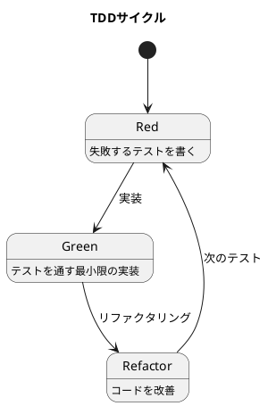

# 技術スタック

本記事シリーズで使用する技術スタックを定義します。

---

## バックエンド

| カテゴリ | 技術 | バージョン |
|---------|------|-----------|
| 言語 | Java | 25 |
| フレームワーク | Spring Boot | 4.0.0 |
| ORM | MyBatis | 4.0.0 |
| データベース | PostgreSQL | 16 |
| マイグレーション | Flyway | - |
| テスト | JUnit 5 + TestContainers | - |
| 品質管理 | JaCoCo, Checkstyle, PMD, SpotBugs | - |

---

## フロントエンド

| カテゴリ | 技術 | バージョン |
|---------|------|-----------|
| 言語 | TypeScript | 5.x |
| フレームワーク | React | 19.x |
| ビルドツール | Vite | 6.x |
| スタイリング | Tailwind CSS | 4.x |
| 状態管理 | TanStack Query | 5.x |
| HTTP クライアント | Axios | - |
| テスト | Vitest + Testing Library | - |

---

## インフラストラクチャ

| カテゴリ | 技術 |
|---------|------|
| コンテナ | Docker / Docker Compose |
| CI/CD | GitHub Actions |

---

## 命名規則

| 要素 | 言語 | 例 |
|------|------|-----|
| テーブル名 | 日本語 | `"商品マスタ"`, `"受注データ"` |
| カラム名 | 日本語 | `"商品コード"`, `"商品名"` |
| ENUM 型 | 日本語 | `商品区分`, `取引先区分` |
| ENUM 値 | 日本語 | `'商品'`, `'顧客'` |
| Java クラス名 | 英語 | `Product`, `Order`, `Customer` |
| Java フィールド名 | 英語 | `productCode`, `productName` |
| MyBatis resultMap | 日本語 ↔ 英語 | `column="商品コード" property="productCode"` |
| TypeScript 型名 | 英語 | `Product`, `Order`, `Customer` |
| TypeScript プロパティ名 | 英語 | `productCode`, `productName` |

---

## プロジェクト構成

各サブシステムは以下のディレクトリ構成に従います。

```
apps/{system}/
├── backend/
│   ├── build.gradle.kts               # Gradle ビルド設定（Kotlin DSL）
│   ├── settings.gradle.kts            # Gradle 設定
│   ├── config/                        # 品質管理ツール設定
│   │   ├── checkstyle/
│   │   │   └── checkstyle.xml
│   │   ├── pmd/
│   │   │   └── ruleset.xml
│   │   └── spotbugs/
│   │       └── exclude.xml
│   │
│   └── src/
│       ├── main/
│       │   ├── java/com/example/sms/
│       │   │   │
│       │   │   ├── domain/            # ドメイン層
│       │   │   │   ├── model/         # ドメインモデル
│       │   │   │   │   ├── master/    # マスタエンティティ
│       │   │   │   │   └── transaction/ # トランザクションエンティティ
│       │   │   │   ├── type/          # 基本型（通貨、単位、数量等）
│       │   │   │   └── exception/     # ドメイン例外
│       │   │   │
│       │   │   ├── application/       # アプリケーション層
│       │   │   │   ├── port/
│       │   │   │   │   ├── in/        # Input Port（UseCase）
│       │   │   │   │   └── out/       # Output Port（Repository）
│       │   │   │   └── service/       # Application Service
│       │   │   │
│       │   │   ├── infrastructure/    # インフラストラクチャ層
│       │   │   │   ├── in/            # Input Adapter
│       │   │   │   │   └── rest/      # REST API Controller
│       │   │   │   ├── out/           # Output Adapter
│       │   │   │   │   └── persistence/ # 永続化（MyBatis Mapper）
│       │   │   │   └── config/        # 設定クラス
│       │   │   │
│       │   │   └── Application.java   # メインクラス
│       │   │
│       │   └── resources/
│       │       ├── application.yml    # アプリケーション設定
│       │       ├── db/migration/      # Flyway マイグレーション
│       │       └── mapper/            # MyBatis XML マッパー
│       │
│       └── test/
│           ├── java/com/example/sms/
│           │   ├── testsetup/         # テスト基盤クラス
│           │   │   └── BaseIntegrationTest.java
│           │   ├── domain/            # ドメイン層テスト
│           │   ├── application/       # アプリケーション層テスト
│           │   └── infrastructure/    # インフラ層テスト
│           │
│           └── resources/
│               └── application-test.yml
│
├── frontend/                          # フロントエンド
│   └── src/
│       ├── components/                # UI コンポーネント
│       ├── pages/                     # ページコンポーネント
│       ├── hooks/                     # カスタムフック
│       ├── services/                  # API クライアント
│       └── types/                     # 型定義
│
└── docker-compose.yml                 # Docker 構成
```

---

## サブシステム一覧

| システム | ディレクトリ | 説明 |
|---------|-------------|------|
| 販売管理システム | `apps/sms` | Sales Management System |
| 財務会計システム | `apps/fas` | Financial Accounting System |
| 生産管理システム | `apps/pms` | Production Management System |

---

## 環境構築

TDD でデータベース設計を進めるための開発環境を構築します。テスト駆動開発のゴールは **動作するきれいなコード** ですが、それを実現するためには [ソフトウェア開発の三種の神器](https://t-wada.hatenablog.jp/entry/clean-code-that-works) が必要です。

> 今日のソフトウェア開発の世界において絶対になければならない3つの技術的な柱があります。
> 三本柱と言ったり、三種の神器と言ったりしていますが、それらは
>
>   - バージョン管理
>   - テスティング
>   - 自動化
>
> の3つです。

### 前提条件

以下のツールがインストールされていることを確認してください。

- Java 21 以上（推奨：Java 25）
- Gradle 8.x 以上（推奨：Gradle Wrapper 使用）
- Docker & Docker Compose
- Git
- Node.js 22.x 以上

---

## バックエンドのセットアップ

### 1. Gradle プロジェクトの初期化

```bash
cd apps/sms/backend
mkdir -p src/main/java/com/example/sms
mkdir -p src/main/resources/db/migration
mkdir -p src/test/java/com/example/sms/testsetup
mkdir -p src/test/resources
mkdir -p config/checkstyle config/pmd config/spotbugs
```

### 2. build.gradle.kts の設定

`build.gradle.kts`（Kotlin DSL）を以下のように作成します。

```kotlin
plugins {
    java
    jacoco
    checkstyle
    pmd
    id("org.springframework.boot") version "4.0.0"
    id("io.spring.dependency-management") version "1.1.7"
    id("com.github.spotbugs") version "6.0.27"
}

group = "com.example.sms"
version = "0.0.1-SNAPSHOT"

java {
    toolchain {
        languageVersion = JavaLanguageVersion.of(25)
    }
}

repositories {
    mavenCentral()
}

// バージョン管理
val mybatisVersion = "4.0.0"
val testcontainersVersion = "1.20.4"

dependencies {
    // === implementation ===
    // Spring Boot Starters
    implementation("org.springframework.boot:spring-boot-starter-web")
    implementation("org.springframework.boot:spring-boot-starter-validation")
    implementation("org.springframework.boot:spring-boot-starter-jdbc")

    // Database
    implementation("org.mybatis.spring.boot:mybatis-spring-boot-starter:$mybatisVersion")
    implementation("org.springframework.boot:spring-boot-starter-flyway")
    implementation("org.flywaydb:flyway-database-postgresql")

    // === runtimeOnly ===
    runtimeOnly("org.postgresql:postgresql")

    // === compileOnly ===
    compileOnly("org.projectlombok:lombok")

    // === annotationProcessor ===
    annotationProcessor("org.projectlombok:lombok")

    // === testImplementation ===
    testImplementation("org.springframework.boot:spring-boot-starter-test")
    testImplementation("org.springframework.boot:spring-boot-testcontainers")
    testImplementation("org.mybatis.spring.boot:mybatis-spring-boot-starter-test:$mybatisVersion")
    testImplementation(platform("org.testcontainers:testcontainers-bom:$testcontainersVersion"))
    testImplementation("org.testcontainers:junit-jupiter")
    testImplementation("org.testcontainers:postgresql")

    // === testCompileOnly ===
    testCompileOnly("org.projectlombok:lombok")

    // === testAnnotationProcessor ===
    testAnnotationProcessor("org.projectlombok:lombok")

    // === testRuntimeOnly ===
    testRuntimeOnly("org.junit.platform:junit-platform-launcher")
}

tasks.withType<Test> {
    useJUnitPlatform()
    finalizedBy(tasks.jacocoTestReport)
}

// JaCoCo
jacoco {
    toolVersion = "0.8.14" // Java 25 support
}

tasks.jacocoTestReport {
    dependsOn(tasks.test)
    reports {
        xml.required = true
        html.required = true
    }
    classDirectories.setFrom(
        files(classDirectories.files.map {
            fileTree(it) {
                exclude(
                    "**/Application.class",
                    "**/Application$*.class"
                )
            }
        })
    )
}

// Checkstyle
checkstyle {
    toolVersion = "10.20.2"
    configFile = file("${rootDir}/config/checkstyle/checkstyle.xml")
    isIgnoreFailures = false
}

// SpotBugs (Java 25 対応: 4.9.7+)
spotbugs {
    ignoreFailures = false
    excludeFilter = file("${rootDir}/config/spotbugs/exclude.xml")
    toolVersion = "4.9.8"
}

tasks.withType<com.github.spotbugs.snom.SpotBugsTask> {
    reports.create("html") {
        required = true
    }
    reports.create("xml") {
        required = true
    }
}

// PMD (Java 25 対応: 7.16.0+)
pmd {
    toolVersion = "7.16.0"
    isConsoleOutput = true
    ruleSetFiles = files("${rootDir}/config/pmd/ruleset.xml")
    ruleSets = listOf()
    isIgnoreFailures = false
}

// カスタムタスク: TDD用の継続的テスト実行
tasks.register<Test>("tdd") {
    description = "Run tests in TDD mode (always executes)"
    group = "verification"
    useJUnitPlatform()
    testLogging {
        events("passed", "skipped", "failed")
        exceptionFormat = org.gradle.api.tasks.testing.logging.TestExceptionFormat.FULL
    }
    outputs.upToDateWhen { false }
}

// カスタムタスク: 品質チェック全実行
tasks.register("qualityCheck") {
    description = "Run all quality checks (Checkstyle, PMD, SpotBugs)"
    group = "verification"
    dependsOn("checkstyleMain", "checkstyleTest", "pmdMain", "pmdTest", "spotbugsMain", "spotbugsTest")
}

// カスタムタスク: すべてのテストと品質チェックを実行
tasks.register("fullCheck") {
    description = "Run all tests and quality checks"
    group = "verification"
    dependsOn("test", "qualityCheck", "jacocoTestReport")
}
```

### 3. settings.gradle.kts の設定

```kotlin
rootProject.name = "sms-backend"
```

### 4. gradle-wrapper.properties の設定

```properties
distributionBase=GRADLE_USER_HOME
distributionPath=wrapper/dists
distributionUrl=https\://services.gradle.org/distributions/gradle-9.2.1-bin.zip
networkTimeout=10000
validateDistributionUrl=true
zipStoreBase=GRADLE_USER_HOME
zipStorePath=wrapper/dists
```

### 5. Docker Compose のセットアップ

`docker-compose.yml` を作成します。

```yaml
services:
  postgres:
    image: postgres:16-alpine
    container_name: sms-postgres
    restart: unless-stopped
    environment:
      POSTGRES_USER: ${POSTGRES_USER:-postgres}
      POSTGRES_PASSWORD: ${POSTGRES_PASSWORD:-postgres}
      POSTGRES_DB: ${POSTGRES_DB:-sms}
      TZ: 'Asia/Tokyo'
    ports:
      - "${POSTGRES_PORT:-5432}:5432"
    volumes:
      - postgres_data:/var/lib/postgresql/data
    healthcheck:
      test: ["CMD-SHELL", "pg_isready -U ${POSTGRES_USER:-postgres}"]
      interval: 10s
      timeout: 5s
      retries: 5

volumes:
  postgres_data:
```

### 6. Flyway マイグレーションのセットアップ

`src/main/resources/db/migration/V001__create_enum_types.sql` を作成します。

```sql
-- 商品区分
CREATE TYPE 商品区分 AS ENUM ('商品', '製品', 'サービス', '諸口');

-- 取引先区分
CREATE TYPE 取引先区分 AS ENUM ('顧客', '仕入先', '両方');

-- 税区分
CREATE TYPE 税区分 AS ENUM ('外税', '内税', '非課税');

-- 請求区分
CREATE TYPE 請求区分 AS ENUM ('都度', '締め');

-- 支払方法
CREATE TYPE 支払方法 AS ENUM ('現金', '振込', '手形', '小切手', 'その他');
```

### 7. TestContainers のセットアップ

テスト用のデータベースコンテナを管理する基盤クラスを作成します。

`src/test/java/com/example/sms/testsetup/BaseIntegrationTest.java`:

```java
package com.example.sms.testsetup;

import org.springframework.boot.test.context.SpringBootTest;
import org.springframework.boot.testcontainers.service.connection.ServiceConnection;
import org.testcontainers.containers.PostgreSQLContainer;
import org.testcontainers.junit.jupiter.Container;
import org.testcontainers.junit.jupiter.Testcontainers;

/**
 * 統合テストの基底クラス。
 * TestContainers を使用して PostgreSQL コンテナを起動し、
 * Spring Boot の @ServiceConnection で自動的にデータソースを設定する。
 * Flyway マイグレーションが自動実行される。
 */
@Testcontainers
@SpringBootTest
@org.springframework.test.context.ActiveProfiles("test")
@SuppressWarnings({"PMD.AbstractClassWithoutAbstractMethod", "PMD.MutableStaticState"})
public abstract class BaseIntegrationTest {

    @Container
    @ServiceConnection
    static PostgreSQLContainer<?> postgres = new PostgreSQLContainer<>("postgres:16-alpine")
            .withDatabaseName("testdb")
            .withUsername("testuser")
            .withPassword("testpass");

    /**
     * 継承のみを許可するための protected コンストラクタ。
     */
    protected BaseIntegrationTest() {
        // TestContainers の基底クラスのため空実装
    }
}
```

`src/test/resources/application-test.yml`:

```yaml
spring:
  flyway:
    enabled: true
    locations: classpath:db/migration
    baseline-on-migrate: true

logging:
  level:
    org.flywaydb: DEBUG
```

### 8. 最初のテスト：データベース接続確認

`src/test/java/com/example/sms/DatabaseConnectionTest.java`:

```java
package com.example.sms;

import com.example.sms.testsetup.BaseIntegrationTest;
import org.junit.jupiter.api.DisplayName;
import org.junit.jupiter.api.Test;
import org.springframework.beans.factory.annotation.Autowired;

import javax.sql.DataSource;
import java.sql.Connection;
import java.sql.ResultSet;
import java.sql.Statement;

import static org.assertj.core.api.Assertions.assertThat;

@DisplayName("データベース接続")
class DatabaseConnectionTest extends BaseIntegrationTest {

    @Autowired
    private DataSource dataSource;

    @Test
    @DisplayName("PostgreSQLに接続できる")
    void canConnectToPostgres() throws Exception {
        try (Connection conn = dataSource.getConnection();
             Statement stmt = conn.createStatement();
             ResultSet rs = stmt.executeQuery("SELECT 1")) {
            assertThat(rs.next()).isTrue();
            assertThat(rs.getInt(1)).isEqualTo(1);
        }
    }

    @Test
    @DisplayName("商品区分ENUMが作成されている")
    void productTypeEnumExists() throws Exception {
        try (Connection conn = dataSource.getConnection();
             Statement stmt = conn.createStatement();
             ResultSet rs = stmt.executeQuery(
                 "SELECT unnest(enum_range(NULL::商品区分))::text")) {
            assertThat(rs.next()).isTrue();
            assertThat(rs.getString(1)).isEqualTo("商品");
        }
    }

    @Test
    @DisplayName("取引先区分ENUMが作成されている")
    void partnerTypeEnumExists() throws Exception {
        try (Connection conn = dataSource.getConnection();
             Statement stmt = conn.createStatement();
             ResultSet rs = stmt.executeQuery(
                 "SELECT unnest(enum_range(NULL::取引先区分))::text")) {
            assertThat(rs.next()).isTrue();
            assertThat(rs.getString(1)).isEqualTo("顧客");
        }
    }

    @Test
    @DisplayName("税区分ENUMが作成されている")
    void taxTypeEnumExists() throws Exception {
        try (Connection conn = dataSource.getConnection();
             Statement stmt = conn.createStatement();
             ResultSet rs = stmt.executeQuery(
                 "SELECT unnest(enum_range(NULL::税区分))::text")) {
            assertThat(rs.next()).isTrue();
            assertThat(rs.getString(1)).isEqualTo("外税");
        }
    }
}
```

テストを実行します。

```bash
./gradlew test

BUILD SUCCESSFUL
```

---

## コード品質管理ツールの設定

良いコードを書き続けるためにはコードの品質を維持していく必要があります。

### Checkstyle の設定

Checkstyle は、Java のコーディング規約を検証するツールです。

`config/checkstyle/checkstyle.xml` を作成します。

```xml
<?xml version="1.0"?>
<!DOCTYPE module PUBLIC
        "-//Checkstyle//DTD Checkstyle Configuration 1.3//EN"
        "https://checkstyle.org/dtds/configuration_1_3.dtd">

<module name="Checker">
    <property name="charset" value="UTF-8"/>
    <property name="severity" value="warning"/>
    <property name="fileExtensions" value="java, properties, xml"/>

    <!-- ファイルサイズのチェック -->
    <module name="FileLength">
        <property name="max" value="500"/>
    </module>

    <!-- TreeWalker -->
    <module name="TreeWalker">
        <!-- 命名規約 -->
        <module name="ConstantName"/>
        <module name="LocalFinalVariableName"/>
        <module name="LocalVariableName"/>
        <module name="MemberName"/>
        <module name="MethodName"/>
        <module name="PackageName"/>
        <module name="ParameterName"/>
        <module name="StaticVariableName"/>
        <module name="TypeName"/>

        <!-- インポート -->
        <module name="AvoidStarImport"/>
        <module name="IllegalImport"/>
        <module name="RedundantImport"/>
        <module name="UnusedImports"/>

        <!-- サイズ制限 -->
        <module name="MethodLength">
            <property name="max" value="150"/>
        </module>
        <module name="ParameterNumber">
            <property name="max" value="7"/>
        </module>

        <!-- 空白 -->
        <module name="EmptyForIteratorPad"/>
        <module name="GenericWhitespace"/>
        <module name="MethodParamPad"/>
        <module name="NoWhitespaceAfter"/>
        <module name="NoWhitespaceBefore"/>
        <module name="OperatorWrap"/>
        <module name="ParenPad"/>
        <module name="TypecastParenPad"/>
        <module name="WhitespaceAfter"/>
        <module name="WhitespaceAround"/>

        <!-- 複雑度 -->
        <module name="CyclomaticComplexity">
            <property name="max" value="10"/>
        </module>
    </module>
</module>
```

### PMD の設定

PMD は、Java のコード品質を分析するツールです。

`config/pmd/ruleset.xml` を作成します。

```xml
<?xml version="1.0"?>
<ruleset name="Custom Rules"
         xmlns="http://pmd.sourceforge.net/ruleset/2.0.0"
         xmlns:xsi="http://www.w3.org/2001/XMLSchema-instance"
         xsi:schemaLocation="http://pmd.sourceforge.net/ruleset/2.0.0
         https://pmd.sourceforge.io/ruleset_2_0_0.xsd">

    <description>PMD Custom Ruleset</description>

    <!-- ベストプラクティス -->
    <rule ref="category/java/bestpractices.xml">
        <!-- テストでは複数アサートを許可 -->
        <exclude name="UnitTestContainsTooManyAsserts"/>
        <!-- ResultSet のチェックはテストコードでは必須ではない -->
        <exclude name="CheckResultSet"/>
    </rule>

    <!-- コードスタイル -->
    <rule ref="category/java/codestyle.xml">
        <exclude name="AtLeastOneConstructor"/>
        <exclude name="OnlyOneReturn"/>
        <exclude name="LongVariable"/>
        <exclude name="ShortVariable"/>
        <!-- final パラメータは強制しない -->
        <exclude name="MethodArgumentCouldBeFinal"/>
        <!-- デフォルトアクセス修飾子のコメントは強制しない -->
        <exclude name="CommentDefaultAccessModifier"/>
    </rule>

    <!-- 設計 -->
    <rule ref="category/java/design.xml">
        <exclude name="LawOfDemeter"/>
        <exclude name="LoosePackageCoupling"/>
        <!-- Spring Boot Application クラスは例外 -->
        <exclude name="UseUtilityClass"/>
    </rule>

    <!-- マルチスレッド -->
    <rule ref="category/java/multithreading.xml"/>

    <!-- エラープローン -->
    <rule ref="category/java/errorprone.xml"/>

    <!-- パフォーマンス -->
    <rule ref="category/java/performance.xml"/>
</ruleset>
```

### SpotBugs の設定

`config/spotbugs/exclude.xml` を作成します。

```xml
<?xml version="1.0" encoding="UTF-8"?>
<FindBugsFilter>
    <!-- Application クラスの除外 -->
    <Match>
        <Class name="com.example.sms.Application"/>
    </Match>

    <!-- Lombok 生成コードの除外 -->
    <Match>
        <Bug pattern="EI_EXPOSE_REP"/>
    </Match>
    <Match>
        <Bug pattern="EI_EXPOSE_REP2"/>
    </Match>

    <!-- テストクラスの除外 -->
    <Match>
        <Source name="~.*Test\.java"/>
    </Match>
</FindBugsFilter>
```

### コード品質チェックの実行

```bash
# Checkstyle 実行
./gradlew checkstyleMain checkstyleTest

# PMD 実行
./gradlew pmdMain pmdTest

# SpotBugs 実行
./gradlew spotbugsMain spotbugsTest

# すべての品質チェックを実行
./gradlew check
```

### テストカバレッジの確認

```bash
# テストを実行してカバレッジレポートを生成
./gradlew test jacocoTestReport

# レポートの表示
open build/reports/jacoco/test/html/index.html
```

---

## トラブルシューティング

### Java 25 と Gradle の互換性

**問題**: Gradle Kotlin DSL が Java 25 をサポートしていない

```
java.lang.IllegalArgumentException: 25.0.1
  at org.jetbrains.kotlin.com.intellij.util.lang.JavaVersion.parse
```

**解決策**: Gradle 9.2.1 以上を使用する

```properties
# gradle-wrapper.properties
distributionUrl=https\://services.gradle.org/distributions/gradle-9.2.1-bin.zip
```

### Spring Boot 4.0.0 の Flyway 自動設定

**問題**: Flyway マイグレーションが実行されない

Spring Boot 4.0.0 では auto-configuration がモジュール化され、`flyway-core` だけでは自動設定されません。

**解決策**: `spring-boot-starter-flyway` を使用する

```kotlin
// build.gradle.kts
dependencies {
    implementation("org.springframework.boot:spring-boot-starter-flyway")
    implementation("org.flywaydb:flyway-database-postgresql")
}
```

参考: [Spring Boot 4 Modularization](https://www.danvega.dev/blog/2025/12/12/spring-boot-4-modularization)

### TestContainers と Spring Boot 4.0.0

**問題**: `AutoConfigureTestDatabase` が見つからない

Spring Boot 4.0.0 では `@ServiceConnection` を使用した自動設定が推奨されます。

**解決策**: `@ServiceConnection` を使用する

```java
@Container
@ServiceConnection
static PostgreSQLContainer<?> postgres = new PostgreSQLContainer<>("postgres:16-alpine");
```

### PMD 7.x のルール変更

**問題**: PMD 7.x で除外ルール名が見つからない

PMD 7.x では一部のルールがカテゴリ間で移動されています。

**解決策**: `@SuppressWarnings` で個別に抑制するか、正しいカテゴリを指定する

```java
@SuppressWarnings({"PMD.AbstractClassWithoutAbstractMethod", "PMD.MutableStaticState"})
public abstract class BaseIntegrationTest {
```

### .gitignore での `out` ディレクトリ

**問題**: `application/port/out` が git に追跡されない

Next.js の出力ディレクトリ `out` が無視される設定がある場合、Java の `port/out` も無視されます。

**解決策**: .gitignore で Java ソースを例外にする

```gitignore
/out

# Java source out directories should not be ignored
!**/src/**/out/
```

---

## TDD アプローチの導入

### Red-Green-Refactor サイクル

TDD の基本サイクルを、データベース設計に適用します。



1. **Red（失敗）**: まず、欲しい機能のテストを書きます。この時点ではテーブルも実装もないため、テストは失敗します。
2. **Green（成功）**: テストを通すための最小限の実装（テーブル定義、リポジトリなど）を行います。
3. **Refactor（改善）**: テストが通った状態を維持しながら、コードを改善します。

### データベース設計への TDD 適用

従来のデータベース設計では、最初に完璧な ER 図を描こうとします。しかし、TDD アプローチでは：

1. **最小限のテストから始める**: 「商品を登録できる」という単純なテストから開始
2. **段階的に拡張**: テストを追加しながら、テーブル構造を進化させる
3. **リファクタリングを恐れない**: テストがあるので、安心して構造を変更できる

### MyBatis での日本語カラム対応

MyBatis では、日本語カラム名をそのまま使用できます。

```java
// エンティティクラス
@Data
public class 商品マスタ {
    private Integer id;
    private String 商品コード;
    private String 商品正式名;
    private String 商品名;
    private String 商品名カナ;
    private String 商品区分;
    private String 製品型番;
    private BigDecimal 販売単価;
    private BigDecimal 仕入単価;
    private String 税区分;
    private String 商品分類コード;
    private Boolean 雑区分;
    private Boolean 在庫管理対象区分;
    private Boolean 在庫引当区分;
    private String 仕入先コード;
    private LocalDateTime 作成日時;
    private String 作成者名;
    private LocalDateTime 更新日時;
    private String 更新者名;
}
```

```java
// Mapper インターフェース
@Mapper
public interface 商品マスタMapper {

    @Insert("""
        INSERT INTO 商品マスタ (
            商品コード, 商品正式名, 商品名, 商品名カナ, 商品区分,
            製品型番, 販売単価, 仕入単価, 税区分, 商品分類コード,
            雑区分, 在庫管理対象区分, 在庫引当区分, 仕入先コード,
            作成者名, 更新者名
        ) VALUES (
            #{商品コード}, #{商品正式名}, #{商品名}, #{商品名カナ}, #{商品区分}::商品区分,
            #{製品型番}, #{販売単価}, #{仕入単価}, #{税区分}::税区分, #{商品分類コード},
            #{雑区分}, #{在庫管理対象区分}, #{在庫引当区分}, #{仕入先コード},
            #{作成者名}, #{更新者名}
        )
        """)
    @Options(useGeneratedKeys = true, keyProperty = "id")
    void insert(商品マスタ product);

    @Select("SELECT * FROM 商品マスタ WHERE 商品コード = #{商品コード}")
    Optional<商品マスタ> findBy商品コード(String 商品コード);

    @Delete("TRUNCATE TABLE 商品マスタ CASCADE")
    void deleteAll();
}
```

---

## フロントエンドのセットアップ

### 1. Vite プロジェクトの初期化

```bash
cd apps/sms/frontend
npm create vite@latest . -- --template react-ts
npm install
```

### 2. 追加パッケージのインストール

```bash
npm install axios @tanstack/react-query
npm install -D tailwindcss postcss autoprefixer
npm install -D vitest @testing-library/react @testing-library/jest-dom
npx tailwindcss init -p
```

---

## 起動手順

```bash
# 1. Docker コンテナ起動
cd apps/sms
docker compose up -d

# 2. バックエンド起動
cd backend
./gradlew bootRun

# 3. フロントエンド起動
cd frontend
npm run dev
```
