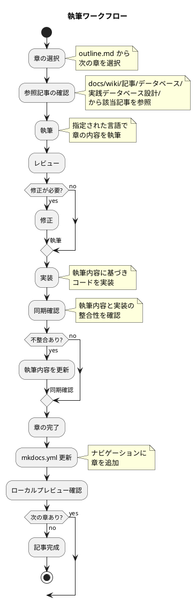
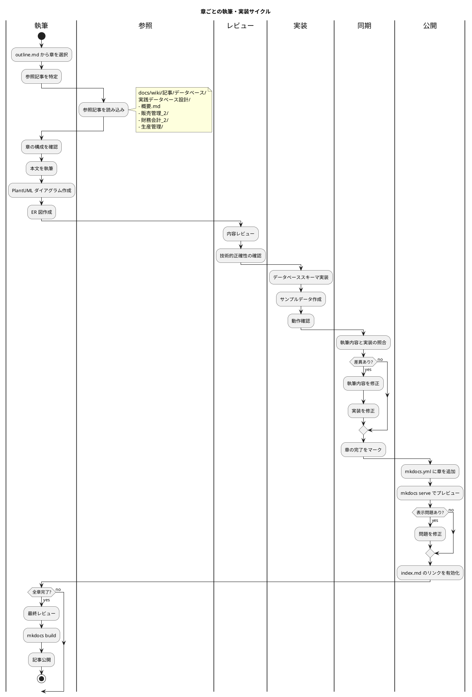
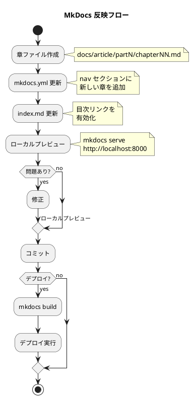

# 執筆ワークフロー

## 概要

本記事は `outline.md` に定義された構成に従い、章ごとに執筆と実装を同期しながら進める。

## ワークフロー図



## 詳細フロー



## MkDocs 反映ワークフロー



### MkDocs 更新手順

#### 1. mkdocs.yml への章追加

```yaml
nav:
  - 実践データベース設計:
      - 第N部 セクション名:
          - 第N章 章タイトル: article/partN/chapterNN.md
```

#### 2. ローカルプレビュー

```bash
# サーバー起動
mkdocs serve

# ブラウザで確認
# http://localhost:8000
```

#### 3. ビルド・デプロイ

```bash
# 静的サイト生成
mkdocs build

# GitHub Pages へデプロイ（設定済みの場合）
mkdocs gh-deploy
```

### MkDocs チェックリスト

- [ ] 章ファイルが正しいパスに配置されている
- [ ] mkdocs.yml の nav に章が追加されている
- [ ] index.md のリンクが正しい
- [ ] ローカルプレビューで表示確認済み
- [ ] PlantUML ダイアグラムが正しくレンダリングされる
- [ ] 内部リンクが正常に動作する

## 執筆ルール

### 1. 章の選択

- `outline.md` の順序に従って進める
- 依存関係がある場合は先行章を優先

### 2. 参照記事

| 部 | 参照先 |
|---|---|
| 第1部：基幹業務システムの全体像 | `概要.md` |
| 第2部：販売管理システム | `販売管理_2/` |
| 第3部：財務会計システム | `財務会計_2/` |
| 第4部：生産管理システム | `生産管理/` |
| 第5部：エンタープライズインテグレーション | 各部の連携仕様 |

### 3. 執筆フォーマット

```markdown
# 第N章：章タイトル

## N.1 セクションタイトル

本文...

### ダイアグラム

\```plantuml
@startuml
...
@enduml
\```

### ER 図

\```plantuml
@startuml
entity "テーブル名" {
  ...
}
@enduml
\```

### 実装

<details>
<summary>SQL 実装</summary>

\```sql
CREATE TABLE ...
\```

</details>
```
- タスク項目などは一行開けて記述する
- NG
  ```markdown
    **受入条件**:
    - [ ] ログアウトボタンをクリックするとログアウトできる
    - [ ] ログアウト後、ログイン画面に遷移する
    - [ ] JWT トークンが無効化される
  ```
    - OK
  ```markdown
    **受入条件**:
  
    - [ ] ログアウトボタンをクリックするとログアウトできる
    - [ ] ログアウト後、ログイン画面に遷移する
    - [ ] JWT トークンが無効化される
  ```
  
### 4. 実装同期チェックリスト

- [ ] テーブル定義が執筆内容と一致
- [ ] カラム名・型が一致
- [ ] リレーションが一致
- [ ] サンプルデータで動作確認済み

## ファイル構成

```
docs/article/
├── index.md            # 記事トップページ（目次）
├── outline.md          # 全体構成
├── workflow.md         # 本ファイル（執筆ワークフロー）
├── part1/              # 第1部
│   ├── chapter01.md
│   ├── chapter02.md
│   └── chapter03.md
├── part2/              # 第2部
│   ├── chapter04.md
│   └── ...
├── part3/              # 第3部
├── part4/              # 第4部
├── part5/              # 第5部
└── appendix/           # 付録
    ├── er-diagrams.md
    ├── table-definitions.md
    └── glossary.md
```

## 進捗管理

| 章 | ステータス | 執筆日 | 実装日 | 同期確認日 |
|---|---|---|---|---|
| 第1章 | 未着手 | - | - | - |
| 第2章 | 未着手 | - | - | - |
| ... | ... | ... | ... | ... |
