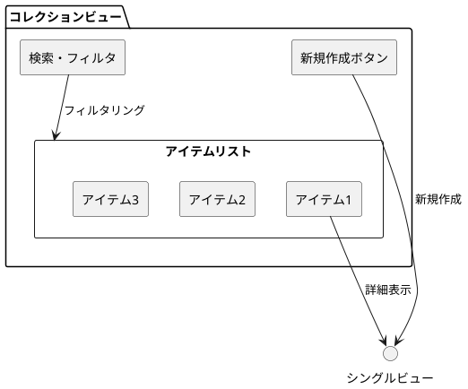
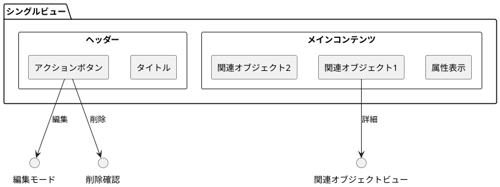
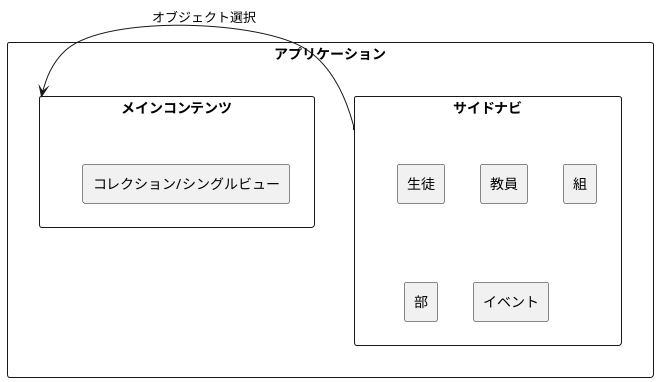
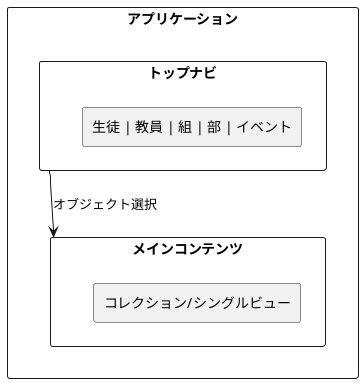

# UI設計ガイド

## オブジェクト指向UI設計（OOUX）

### 基本理念

オブジェクト指向UI設計は、ユーザーが操作する「オブジェクト」を中心にUIを設計することで、より直感的で理解しやすいユーザーエクスペリエンスを提供する設計手法です。

### 4つの主要原則

#### 1. オブジェクトの特定
- ユーザーがシステム内で操作する主要な「モノ」を特定
- 名詞で表現できるもの（例：生徒、教員、部、イベント、文書、商品など）
- ドメインモデルと密接に関連

#### 2. オブジェクト間の関係の定義
- 特定されたオブジェクトが互いにどのように関連しているかを明確化
- 関係の種類：
  - 一対一（1:1）
  - 一対多（1:N）
  - 多対多（M:N）
  - 集約・コンポジション

#### 3. オブジェクトのアクションの定義
- 各オブジェクトに対してユーザーがどのような操作を実行できるかを定義
- 基本的なCRUD操作：
  - Create（作成）
  - Read（読み取り）
  - Update（更新）
  - Delete（削除）
- ドメイン固有のアクション

#### 4. オブジェクトの属性の定義
- 各オブジェクトがどのような情報（属性）を持っているかを定義
- 表示すべき属性の優先順位
- 編集可能な属性の範囲

## UI構造パターン

### コレクションビュー
オブジェクトの一覧を表示するビューパターン



**特徴**：
- 複数のオブジェクトを一覧表示
- 検索・フィルタリング機能
- 新規作成のエントリーポイント
- 個別オブジェクトへの navigation

### シングルビュー
個別オブジェクトの詳細を表示するビューパターン



**特徴**：
- 単一オブジェクトの詳細情報表示
- 編集・削除などのアクション
- 関連オブジェクトへのナビゲーション
- モード切り替え（表示⇔編集）

## レイアウトパターン

### ナビゲーション配置

#### 左サイドナビゲーション


#### トップナビゲーション


### ビュー配置パターン

#### 単一メインオブジェクト
- 画面を2つのペインに分割
- 左：コレクションビュー、右：シングルビュー

#### タブ式切り替え
- タブでコレクションビューとシングルビューを切り替え

#### モーダル式
- コレクションビューをベースに、シングルビューをモーダルで表示

## アクションパターン

### Create（作成）アクション

#### ブランクパターン
```javascript
// 空のフォームを表示して新規作成
const createStudent = () => {
  return {
    id: null,
    name: '',
    class: '',
    clubs: [],
    relatedStudents: []
  };
};
```

#### テンプレートパターン
```javascript
// デフォルト値を持つテンプレートから作成
const createStudentFromTemplate = (template) => {
  return {
    ...template,
    id: generateNewId(),
    name: '',
    createdAt: new Date()
  };
};
```

### Update（更新）アクション

#### モードレスエディットパターン
```javascript
// 同一画面で表示と編集を切り替え
const toggleEditMode = (student, isEditing) => {
  if (isEditing) {
    return renderEditForm(student);
  } else {
    return renderDisplayView(student);
  }
};
```

#### インラインエディットパターン
```javascript
// 項目ごとに直接編集可能
const renderInlineEdit = (property, value) => {
  return `
    <div class="inline-edit" data-property="${property}">
      <span class="display">${value}</span>
      <input class="edit" value="${value}" style="display:none">
    </div>
  `;
};
```

### Delete（削除）アクション

#### モーダル確認パターン
```javascript
const deleteWithConfirmation = (student) => {
  const confirmed = confirm(`${student.name}を削除しますか？`);
  if (confirmed) {
    deleteStudent(student.id);
    refreshView();
  }
};
```

#### ソフトデリートパターン
```javascript
const softDelete = (student) => {
  student.deletedAt = new Date();
  student.isActive = false;
  updateStudent(student);
};
```

## 実装ガイドライン

### コンポーネント設計

#### 責任の分離
```javascript
// ❌ 悪い例：すべてが混在
const StudentComponent = () => {
  // データ取得、状態管理、UI描画がすべて混在
};

// ✅ 良い例：責任を分離
const StudentContainer = () => {
  // データ取得と状態管理
};

const StudentView = ({ students, onAction }) => {
  // UI描画のみ
};
```

#### 状態管理パターン
```javascript
// 状態の構造化
const studentState = {
  collection: {
    items: [],
    loading: false,
    filter: '',
    sortBy: 'name'
  },
  selected: {
    item: null,
    mode: 'READ' // READ, EDIT, CREATE
  }
};
```

### アクセシビリティ考慮事項

#### キーボードナビゲーション
```javascript
// フォーカス管理
const handleKeyDown = (event) => {
  switch (event.key) {
    case 'Enter':
      selectItem();
      break;
    case 'Escape':
      cancelEdit();
      break;
    case 'ArrowDown':
      moveToNextItem();
      break;
  }
};
```

#### スクリーンリーダー対応
```html
<!-- セマンティックなHTML構造 -->
<main role="main">
  <section aria-label="学生一覧">
    <h1>学生</h1>
    <ul role="list">
      <li role="listitem" tabindex="0">
        <span aria-label="学生名">田中太郎</span>
      </li>
    </ul>
  </section>
</main>
```

### パフォーマンス最適化

#### 仮想化
```javascript
// 大量データの表示最適化
const VirtualizedList = ({ items, itemHeight = 50 }) => {
  const [scrollTop, setScrollTop] = useState(0);
  const containerHeight = 400;
  
  const visibleStart = Math.floor(scrollTop / itemHeight);
  const visibleEnd = Math.min(
    visibleStart + Math.ceil(containerHeight / itemHeight),
    items.length
  );
  
  return (
    <div style={{ height: containerHeight, overflow: 'auto' }}>
      {items.slice(visibleStart, visibleEnd).map(renderItem)}
    </div>
  );
};
```

#### 遅延読み込み
```javascript
// 関連データの段階的読み込み
const loadStudentDetails = async (studentId) => {
  const student = await fetchStudent(studentId);
  // 基本情報をまず表示
  
  const [clubs, relatedStudents] = await Promise.all([
    fetchStudentClubs(studentId),
    fetchRelatedStudents(studentId)
  ]);
  // 関連情報を後から追加
};
```

## 品質保証

### テスト戦略

#### ユニットテスト
```javascript
describe('StudentComponent', () => {
  test('should display student list', () => {
    const students = [{ id: 1, name: '田中太郎' }];
    render(<StudentComponent students={students} />);
    expect(screen.getByText('田中太郎')).toBeInTheDocument();
  });
  
  test('should handle create action', () => {
    const onCreateMock = jest.fn();
    render(<StudentComponent onCreate={onCreateMock} />);
    fireEvent.click(screen.getByText('新規'));
    expect(onCreateMock).toHaveBeenCalled();
  });
});
```

#### 統合テスト
```javascript
describe('Student CRUD flow', () => {
  test('should complete full CRUD cycle', async () => {
    // Create
    await createStudent({ name: '田中太郎' });
    expect(await findByText('田中太郎')).toBeInTheDocument();
    
    // Read
    fireEvent.click(await findByText('田中太郎'));
    expect(await findByText('詳細情報')).toBeInTheDocument();
    
    // Update
    fireEvent.click(await findByText('編集'));
    fireEvent.change(getByDisplayValue('田中太郎'), { 
      target: { value: '田中次郎' } 
    });
    fireEvent.click(await findByText('保存'));
    expect(await findByText('田中次郎')).toBeInTheDocument();
    
    // Delete
    fireEvent.click(await findByText('削除'));
    fireEvent.click(await findByText('確認'));
    expect(queryByText('田中次郎')).not.toBeInTheDocument();
  });
});
```

### エラーハンドリング

#### ユーザーフレンドリーなエラー表示
```javascript
const ErrorBoundary = ({ children }) => {
  const [hasError, setHasError] = useState(false);
  const [error, setError] = useState(null);
  
  if (hasError) {
    return (
      <div className="error-container">
        <h2>申し訳ございません</h2>
        <p>予期しないエラーが発生しました。</p>
        <button onClick={() => window.location.reload()}>
          ページを再読み込み
        </button>
      </div>
    );
  }
  
  return children;
};
```

#### バリデーション
```javascript
const validateStudent = (student) => {
  const errors = {};
  
  if (!student.name?.trim()) {
    errors.name = '名前は必須です';
  }
  
  if (student.name?.length > 100) {
    errors.name = '名前は100文字以内で入力してください';
  }
  
  if (!student.class) {
    errors.class = '組を選択してください';
  }
  
  return {
    isValid: Object.keys(errors).length === 0,
    errors
  };
};
```

## まとめ

オブジェクト指向UI設計は、ユーザーにとって直感的で理解しやすいインターフェースを構築するための強力な手法です。4つの主要原則に従って設計することで、一貫性があり、保守性の高いUIを実現できます。

重要なポイント：
- オブジェクト中心の設計思考
- コレクション・シングルビューの適切な使い分け
- アクションパターンの統一
- アクセシビリティとパフォーマンスの考慮
- 包括的なテスト戦略