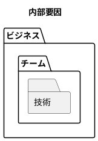
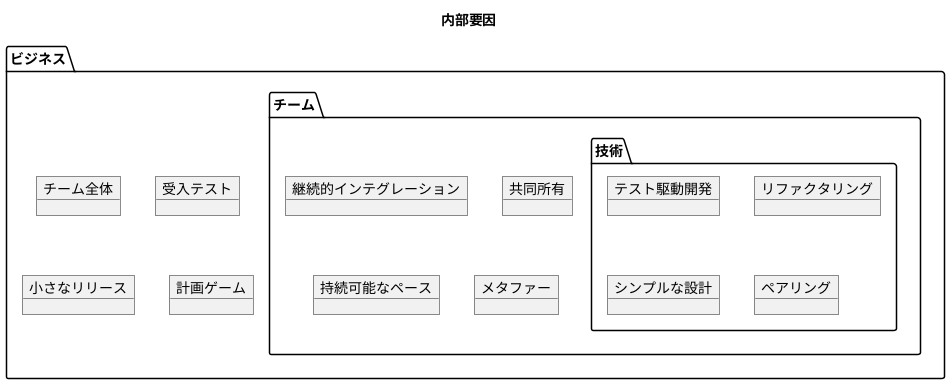
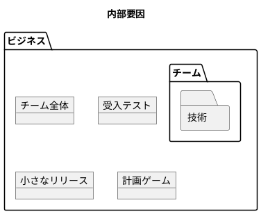
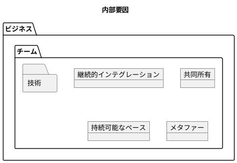
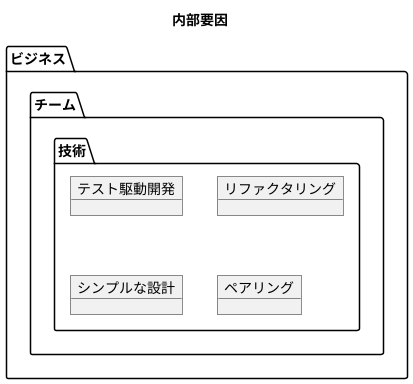
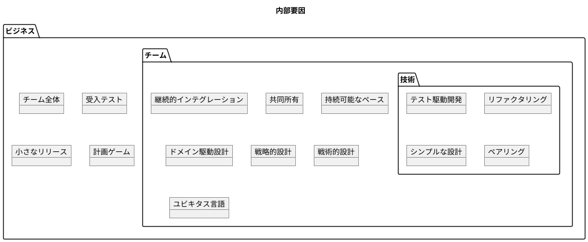

# よいソフトウェアとは

## ソフトウェアの目的

- 問題解決: 
  - 単なる「動くプログラム」ではなく問題を解決するもの
- 本質的な目的:
  - ユーザーの問題解決: 課題や不便を解消
  - ビジネス価値の創出: 組織やビジネスに利益をもたらす
  - 効率化と自動化: 時間や労力を節約
  - イノベーションの実現: 新しい体験や可能性を提供
  
## ソフトウェアの価値

- 機能性: ユーザーの問題をちゃんと解決できるか
- 使いやすさ: 優れた機能でも使いにくければ意味がない
- 信頼性: 安定して動作するか
- 保守性: 長期間にわたって改善・維持できるか

## よいソフトウェアの必要十分条件

変更を楽に安全にできて役に立つソフトウェアであることが必要十分条件である。
変更を楽に安全にできて役に立つソフトウェアであればよいソフトウェアである。

変更を楽に安全にできなくても役に立つソフトウェアはあるのではないか？

## よいソフトウェアの内部要因と外部要因

### 内部要因

内部要因:自分でコントロールできる部分

### 外部要因

外部要因:自分でコントロールできない部分

## だめなソフトウェア

### へろへろスクラム

へろへろスクラムが続くと、チームは疲弊し、顧客満足度は低下し、技術的負債が蓄積する。スクラムの名を借りた単なる「現代的な搾取システム」になりかねない。結局、アジャイルの見かけだけで本質を理解していないマネージャーの自己満足だけが残る。

### 動作するきれいなゴミ

技術的には完璧なソフトウェアのように見えるが、誰も使わないただのゴミ

## よいソフトウェア

本当に良いソフトウェアを作るには、以下のバランスが必要：

1. 技術的な卓越性 - コードの品質、保守性、拡張性
1. ビジネス価値 - 市場ニーズ、収益創出、競争優位性
1. ユーザー中心設計 - 使いやすさ、問題解決力4. 健全なチーム文化 - 心理的安全性、自己組織化、継続的改善

## よいソフトウェアを作るための規律

### 規律とは

> ”規律とは「本質的な部分」と「任意の部分」で構成される一連のルールである。”
> Clean Craftsmanship　規律、基準、倫理 (アスキードワンゴ)

本質的な部分・・・よいソフトウェアを作るパワーを与える
任意の部分・・・よいソフトウェアを作るために従うプラクティス

### ソフトウエア開発の3P(プリンシパル・パターン・プラクティス)

- SOLID原則: 単一責任、開放閉鎖、リスコフの置換、インターフェース分離、依存性逆転
- デザインパターン: 再利用可能な設計ソリューション
- アーキテクチャパターン：ソフトウェアアーキテクチャで発生する問題の解決策
- ドメイン駆動設計: ビジネスドメインに焦点を当てた設計
- テスト駆動開発: テストを先に書いてから実装
- 継続的デリバリー: 小さな変更を頻繁にリリース

### サークルオブライフ

#### ビジネスプラクティス

#### チームプラクティス

#### テクニカルプラクティス

### 拡張サークルオブライフ

## 結論

短期的には変更を楽に安全にできなくても役に立つソフトウェアを作ることはできる。
しかし、時間の経過・外部環境の変化とともに変更を楽に安全にできないため役に立つソフトウェアでなくなる。
変更を楽に安全にできて役に立つソフトウェアであることが必要十分条件である。
上記の条件を満たし外部環境の変化に適応し続けるソフトウェアこそよいソフトウェアである。
よって、良いソフトウェアとは変更を楽に安全にできて役に立つソフトウェアである。