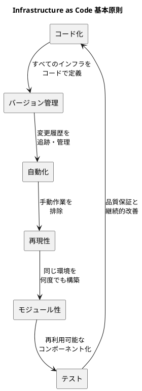
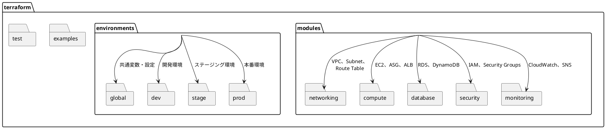
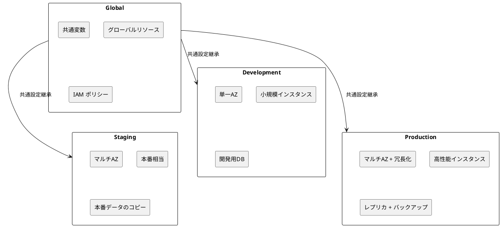
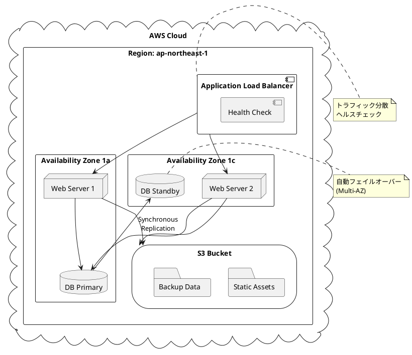
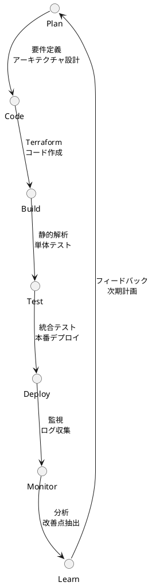

# インフラ設計ガイド

## 1. 概要

### 1.1 目的

Infrastructure as Code (IaC) によるインフラストラクチャの設計・構築・管理における規律とベストプラクティスを定義する。

### 1.2 対象システム

- システム名: 会議室予約システム
- クラウド基盤: AWS
- IaC ツール: Terraform
- アーキテクチャ: ヘキサゴナルアーキテクチャ

### 1.3 基本原則



## 2. プロジェクト構造

### 2.1 ディレクトリ構造



### 2.2 命名規則

#### 2.2.1 リソース命名

```yaml
命名パターン: "{project}-{environment}-{service}-{resource}"

例:
  - VPC: "meeting-room-prod-vpc"
  - Subnet: "meeting-room-prod-public-subnet-1a"
  - Security Group: "meeting-room-prod-web-sg"
  - RDS: "meeting-room-prod-postgres-primary"
  - ALB: "meeting-room-prod-app-alb"
```

#### 2.2.2 Terraform ファイル命名

```yaml
標準ファイル構成:
  - main.tf: メインの構成定義
  - variables.tf: 入力変数定義
  - outputs.tf: 出力値定義
  - versions.tf: プロバイダーバージョン指定
  - locals.tf: ローカル変数定義 (必要に応じて)
  - data.tf: データソース定義 (必要に応じて)
```

## 3. モジュール設計

### 3.1 モジュール化の原則

```plantuml
@startuml "モジュール設計原則"
rectangle "単一責任" as single_responsibility {
  note right : 1つのモジュールは\n1つの責任を持つ
}

rectangle "再利用性" as reusability {
  note right : 複数の環境・プロジェクトで\n利用可能
}

rectangle "構成可能性" as configurability {
  note right : 変数により動作を\nカスタマイズ可能
}

rectangle "テスト容易性" as testability {
  note right : 独立してテスト\nできる設計
}

single_responsibility --> reusability
reusability --> configurability  
configurability --> testability
testability --> single_responsibility

@enduml
```

### 3.2 会議室予約システム モジュール構成

#### 3.2.1 ネットワークモジュール

```terraform
# modules/networking/vpc/main.tf
resource "aws_vpc" "main" {
  cidr_block           = var.vpc_cidr
  enable_dns_hostnames = true
  enable_dns_support   = true

  tags = merge(var.tags, {
    Name = "${var.name_prefix}-vpc"
  })
}

resource "aws_subnet" "public" {
  count = length(var.public_subnet_cidrs)

  vpc_id                  = aws_vpc.main.id
  cidr_block              = var.public_subnet_cidrs[count.index]
  availability_zone       = var.availability_zones[count.index]
  map_public_ip_on_launch = true

  tags = merge(var.tags, {
    Name = "${var.name_prefix}-public-subnet-${count.index + 1}"
    Type = "Public"
  })
}

resource "aws_subnet" "private" {
  count = length(var.private_subnet_cidrs)

  vpc_id            = aws_vpc.main.id
  cidr_block        = var.private_subnet_cidrs[count.index]
  availability_zone = var.availability_zones[count.index]

  tags = merge(var.tags, {
    Name = "${var.name_prefix}-private-subnet-${count.index + 1}"
    Type = "Private"
  })
}

resource "aws_internet_gateway" "main" {
  vpc_id = aws_vpc.main.id

  tags = merge(var.tags, {
    Name = "${var.name_prefix}-igw"
  })
}

resource "aws_nat_gateway" "main" {
  count = var.enable_nat_gateway ? length(aws_subnet.public) : 0

  allocation_id = aws_eip.nat[count.index].id
  subnet_id     = aws_subnet.public[count.index].id

  tags = merge(var.tags, {
    Name = "${var.name_prefix}-nat-gw-${count.index + 1}"
  })

  depends_on = [aws_internet_gateway.main]
}

resource "aws_eip" "nat" {
  count = var.enable_nat_gateway ? length(aws_subnet.public) : 0

  domain = "vpc"

  tags = merge(var.tags, {
    Name = "${var.name_prefix}-nat-eip-${count.index + 1}"
  })

  depends_on = [aws_internet_gateway.main]
}
```

#### 3.2.2 コンピュートモジュール

```terraform
# modules/compute/web-app/main.tf
resource "aws_launch_template" "main" {
  name_prefix   = "${var.name_prefix}-lt"
  image_id      = var.ami_id
  instance_type = var.instance_type
  key_name      = var.key_name

  vpc_security_group_ids = [aws_security_group.web.id]

  user_data = base64encode(templatefile("${path.module}/user_data.sh", {
    database_url = var.database_url
    app_version  = var.app_version
    environment  = var.environment
  }))

  tag_specifications {
    resource_type = "instance"
    tags = merge(var.tags, {
      Name = "${var.name_prefix}-instance"
    })
  }

  lifecycle {
    create_before_destroy = true
    precondition {
      condition     = contains(["t3.micro", "t3.small", "t3.medium"], var.instance_type)
      error_message = "Instance type must be t3.micro, t3.small, or t3.medium for cost optimization."
    }
  }
}

resource "aws_autoscaling_group" "main" {
  name             = "${var.name_prefix}-asg"
  vpc_zone_identifier = var.subnet_ids
  target_group_arns   = [aws_lb_target_group.main.arn]
  health_check_type   = "ELB"
  health_check_grace_period = 300

  min_size         = var.min_size
  max_size         = var.max_size
  desired_capacity = var.desired_capacity

  launch_template {
    id      = aws_launch_template.main.id
    version = "$Latest"
  }

  instance_refresh {
    strategy = "Rolling"
    preferences {
      min_healthy_percentage = 50
      instance_warmup        = 300
    }
  }

  tag {
    key                 = "Name"
    value               = "${var.name_prefix}-asg"
    propagate_at_launch = false
  }

  dynamic "tag" {
    for_each = var.tags
    content {
      key                 = tag.key
      value               = tag.value
      propagate_at_launch = true
    }
  }

  lifecycle {
    create_before_destroy = true
    postcondition {
      condition     = length(self.availability_zones) > 1
      error_message = "Auto Scaling Group must span multiple AZs for high availability."
    }
  }
}

resource "aws_lb" "main" {
  name               = "${var.name_prefix}-alb"
  internal           = false
  load_balancer_type = "application"
  security_groups    = [aws_security_group.alb.id]
  subnets            = var.subnet_ids

  enable_deletion_protection = var.environment == "prod" ? true : false

  tags = merge(var.tags, {
    Name = "${var.name_prefix}-alb"
  })
}

resource "aws_lb_target_group" "main" {
  name     = "${var.name_prefix}-tg"
  port     = 8080
  protocol = "HTTP"
  vpc_id   = var.vpc_id

  health_check {
    enabled             = true
    healthy_threshold   = 2
    unhealthy_threshold = 2
    timeout             = 5
    interval            = 30
    path                = "/health"
    matcher             = "200"
    port                = "traffic-port"
    protocol            = "HTTP"
  }

  tags = merge(var.tags, {
    Name = "${var.name_prefix}-tg"
  })
}

resource "aws_lb_listener" "main" {
  load_balancer_arn = aws_lb.main.arn
  port              = "80"
  protocol          = "HTTP"

  default_action {
    type             = "forward"
    target_group_arn = aws_lb_target_group.main.arn
  }
}
```

#### 3.2.3 データベースモジュール

```terraform
# modules/database/postgresql/main.tf
resource "aws_db_subnet_group" "main" {
  name       = "${var.name_prefix}-db-subnet-group"
  subnet_ids = var.subnet_ids

  tags = merge(var.tags, {
    Name = "${var.name_prefix}-db-subnet-group"
  })
}

resource "aws_db_parameter_group" "main" {
  family = "postgres15"
  name   = "${var.name_prefix}-db-params"

  parameter {
    name  = "log_statement"
    value = "all"
  }

  parameter {
    name  = "log_min_duration_statement"
    value = "1000"
  }

  tags = merge(var.tags, {
    Name = "${var.name_prefix}-db-params"
  })
}

resource "aws_db_instance" "main" {
  identifier = "${var.name_prefix}-db"

  allocated_storage     = var.allocated_storage
  max_allocated_storage = var.max_allocated_storage
  storage_type          = "gp3"
  storage_encrypted     = true

  engine         = "postgres"
  engine_version = "15.4"
  instance_class = var.instance_class

  db_name  = var.database_name
  username = var.database_username
  password = var.database_password

  db_subnet_group_name   = aws_db_subnet_group.main.name
  vpc_security_group_ids = [aws_security_group.database.id]
  parameter_group_name   = aws_db_parameter_group.main.name

  backup_retention_period = var.backup_retention_period
  backup_window          = var.backup_window
  maintenance_window     = var.maintenance_window

  skip_final_snapshot       = var.environment != "prod"
  final_snapshot_identifier = var.environment == "prod" ? "${var.name_prefix}-db-final-snapshot" : null

  deletion_protection = var.environment == "prod" ? true : false

  performance_insights_enabled = var.environment == "prod" ? true : false
  monitoring_interval         = var.environment == "prod" ? 60 : 0

  tags = merge(var.tags, {
    Name = "${var.name_prefix}-db"
  })

  lifecycle {
    prevent_destroy = false
    precondition {
      condition     = var.allocated_storage >= 20
      error_message = "Database must have at least 20GB of storage."
    }
  }
}

resource "aws_db_instance" "replica" {
  count = var.create_replica ? 1 : 0

  identifier = "${var.name_prefix}-db-replica"

  replicate_source_db = aws_db_instance.main.identifier
  instance_class      = var.replica_instance_class

  skip_final_snapshot = true
  deletion_protection = false

  tags = merge(var.tags, {
    Name = "${var.name_prefix}-db-replica"
  })
}
```

### 3.3 入力検証とセキュリティ

```terraform
# modules/compute/web-app/variables.tf
variable "instance_type" {
  description = "EC2 instance type"
  type        = string
  
  validation {
    condition = contains([
      "t3.micro", "t3.small", "t3.medium", "t3.large",
      "m5.large", "m5.xlarge", "m5.2xlarge"
    ], var.instance_type)
    error_message = "Instance type must be a supported type for this application."
  }
}

variable "min_size" {
  description = "Minimum number of instances in ASG"
  type        = number
  
  validation {
    condition     = var.min_size > 0
    error_message = "Minimum size must be greater than 0 to avoid outages."
  }
  
  validation {
    condition     = var.min_size <= 10
    error_message = "Minimum size must be 10 or fewer for cost control."
  }
}

variable "environment" {
  description = "Environment name"
  type        = string
  
  validation {
    condition     = contains(["dev", "stage", "prod"], var.environment)
    error_message = "Environment must be one of: dev, stage, prod."
  }
}

variable "vpc_cidr" {
  description = "CIDR block for VPC"
  type        = string
  
  validation {
    condition     = can(cidrhost(var.vpc_cidr, 0))
    error_message = "VPC CIDR must be a valid CIDR block."
  }
}
```

## 4. 環境管理

### 4.1 環境分離戦略



### 4.2 グローバル変数管理

```terraform
# environments/global/variables.tf
locals {
  project_name = "meeting-room"
  
  common_tags = {
    Project     = local.project_name
    ManagedBy   = "terraform"
    Owner       = "platform-team"
    Repository  = "meeting-room-infrastructure"
  }
  
  environments = {
    dev = {
      name                = "dev"
      instance_type       = "t3.micro"
      min_size           = 1
      max_size           = 2
      desired_capacity   = 1
      db_instance_class  = "db.t3.micro"
      backup_retention   = 7
      multi_az          = false
      create_replica    = false
    }
    
    stage = {
      name                = "stage"
      instance_type       = "t3.small"
      min_size           = 2
      max_size           = 4
      desired_capacity   = 2
      db_instance_class  = "db.t3.small"
      backup_retention   = 7
      multi_az          = true
      create_replica    = false
    }
    
    prod = {
      name                = "prod"
      instance_type       = "t3.medium"
      min_size           = 2
      max_size           = 8
      desired_capacity   = 4
      db_instance_class  = "db.r6g.large"
      backup_retention   = 30
      multi_az          = true
      create_replica    = true
    }
  }
  
  vpc_configs = {
    dev = {
      vpc_cidr             = "10.0.0.0/16"
      public_subnet_cidrs  = ["10.0.1.0/24", "10.0.2.0/24"]
      private_subnet_cidrs = ["10.0.3.0/24", "10.0.4.0/24"]
      availability_zones   = ["ap-northeast-1a", "ap-northeast-1c"]
    }
    
    stage = {
      vpc_cidr             = "10.1.0.0/16"
      public_subnet_cidrs  = ["10.1.1.0/24", "10.1.2.0/24"]
      private_subnet_cidrs = ["10.1.3.0/24", "10.1.4.0/24"]
      availability_zones   = ["ap-northeast-1a", "ap-northeast-1c"]
    }
    
    prod = {
      vpc_cidr             = "10.2.0.0/16"
      public_subnet_cidrs  = ["10.2.1.0/24", "10.2.2.0/24"]
      private_subnet_cidrs = ["10.2.3.0/24", "10.2.4.0/24"]
      availability_zones   = ["ap-northeast-1a", "ap-northeast-1c"]
    }
  }
}

output "project_config" {
  value = {
    name        = local.project_name
    tags        = local.common_tags
    environments = local.environments
    vpc_configs = local.vpc_configs
  }
}
```

### 4.3 環境固有の構成

```terraform
# environments/prod/main.tf
terraform {
  required_version = ">= 1.0"
  
  backend "s3" {
    bucket         = "meeting-room-terraform-state"
    key            = "prod/terraform.tfstate"
    region         = "ap-northeast-1"
    dynamodb_table = "meeting-room-terraform-locks"
    encrypt        = true
  }
  
  required_providers {
    aws = {
      source  = "hashicorp/aws"
      version = "~> 5.0"
    }
  }
}

provider "aws" {
  region = "ap-northeast-1"
  
  default_tags {
    tags = local.common_tags
  }
}

# グローバル設定の読み込み
data "terraform_remote_state" "global" {
  backend = "s3"
  
  config = {
    bucket = "meeting-room-terraform-state"
    key    = "global/terraform.tfstate"
    region = "ap-northeast-1"
  }
}

locals {
  environment = "prod"
  global_config = data.terraform_remote_state.global.outputs.project_config
  env_config = local.global_config.environments[local.environment]
  vpc_config = local.global_config.vpc_configs[local.environment]
  common_tags = merge(local.global_config.tags, {
    Environment = local.environment
  })
  name_prefix = "${local.global_config.name}-${local.environment}"
}

# ネットワークモジュール
module "vpc" {
  source = "../../modules/networking/vpc"
  
  name_prefix = local.name_prefix
  
  vpc_cidr             = local.vpc_config.vpc_cidr
  public_subnet_cidrs  = local.vpc_config.public_subnet_cidrs
  private_subnet_cidrs = local.vpc_config.private_subnet_cidrs
  availability_zones   = local.vpc_config.availability_zones
  
  enable_nat_gateway = true
  
  tags = local.common_tags
}

# データベースモジュール
module "database" {
  source = "../../modules/database/postgresql"
  
  name_prefix = local.name_prefix
  
  subnet_ids = module.vpc.private_subnet_ids
  vpc_id     = module.vpc.vpc_id
  
  instance_class      = local.env_config.db_instance_class
  allocated_storage   = 100
  max_allocated_storage = 1000
  
  database_name     = "meetingroom"
  database_username = local.db_credentials.username
  database_password = local.db_credentials.password
  
  backup_retention_period = local.env_config.backup_retention
  multi_az               = local.env_config.multi_az
  create_replica         = local.env_config.create_replica
  
  environment = local.environment
  tags        = local.common_tags
}

# Webアプリケーションモジュール
module "web_app" {
  source = "../../modules/compute/web-app"
  
  name_prefix = local.name_prefix
  
  vpc_id     = module.vpc.vpc_id
  subnet_ids = module.vpc.public_subnet_ids
  
  instance_type    = local.env_config.instance_type
  min_size         = local.env_config.min_size
  max_size         = local.env_config.max_size
  desired_capacity = local.env_config.desired_capacity
  
  database_url = "postgresql://${local.db_credentials.username}:${local.db_credentials.password}@${module.database.endpoint}/meetingroom"
  app_version  = var.app_version
  
  environment = local.environment
  tags        = local.common_tags
  
  depends_on = [module.database]
}

# Secrets Managerからのデータベース認証情報取得
data "aws_secretsmanager_secret_version" "db_credentials" {
  secret_id = "${local.name_prefix}-db-credentials"
}

locals {
  db_credentials = jsondecode(data.aws_secretsmanager_secret_version.db_credentials.secret_string)
}
```

## 5. セキュリティ設計

### 5.1 シークレット管理

```terraform
# modules/security/secrets-manager/main.tf
resource "aws_secretsmanager_secret" "db_credentials" {
  name        = "${var.name_prefix}-db-credentials"
  description = "Database credentials for ${var.name_prefix}"
  
  recovery_window_in_days = var.environment == "prod" ? 30 : 0
  
  tags = merge(var.tags, {
    Name = "${var.name_prefix}-db-credentials"
    Type = "Database"
  })
}

resource "aws_secretsmanager_secret_version" "db_credentials" {
  secret_id = aws_secretsmanager_secret.db_credentials.id
  
  secret_string = jsonencode({
    username = var.database_username
    password = var.database_password
  })
  
  lifecycle {
    ignore_changes = [secret_string]
  }
}

# 自動ローテーション（本番環境のみ）
resource "aws_secretsmanager_secret_rotation" "db_credentials" {
  count = var.environment == "prod" ? 1 : 0
  
  secret_id           = aws_secretsmanager_secret.db_credentials.id
  rotation_lambda_arn = var.rotation_lambda_arn
  
  rotation_rules {
    automatically_after_days = 30
  }
}
```

### 5.2 IAM ロール設計

```terraform
# modules/security/iam/main.tf
# EC2インスタンス用のIAMロール
resource "aws_iam_role" "ec2_role" {
  name = "${var.name_prefix}-ec2-role"
  
  assume_role_policy = jsonencode({
    Version = "2012-10-17"
    Statement = [
      {
        Action = "sts:AssumeRole"
        Effect = "Allow"
        Principal = {
          Service = "ec2.amazonaws.com"
        }
      }
    ]
  })
  
  tags = var.tags
}

# Secrets Manager読み取り権限
resource "aws_iam_policy" "secrets_manager_policy" {
  name = "${var.name_prefix}-secrets-manager-policy"
  
  policy = jsonencode({
    Version = "2012-10-17"
    Statement = [
      {
        Effect = "Allow"
        Action = [
          "secretsmanager:GetSecretValue",
          "secretsmanager:DescribeSecret"
        ]
        Resource = [
          "arn:aws:secretsmanager:${var.region}:${var.account_id}:secret:${var.name_prefix}-db-credentials*"
        ]
      }
    ]
  })
}

resource "aws_iam_role_policy_attachment" "secrets_manager_attachment" {
  policy_arn = aws_iam_policy.secrets_manager_policy.arn
  role       = aws_iam_role.ec2_role.name
}

# CloudWatch Logs権限
resource "aws_iam_policy" "cloudwatch_logs_policy" {
  name = "${var.name_prefix}-cloudwatch-logs-policy"
  
  policy = jsonencode({
    Version = "2012-10-17"
    Statement = [
      {
        Effect = "Allow"
        Action = [
          "logs:CreateLogGroup",
          "logs:CreateLogStream",
          "logs:PutLogEvents",
          "logs:DescribeLogStreams"
        ]
        Resource = [
          "arn:aws:logs:${var.region}:${var.account_id}:log-group:/aws/ec2/${var.name_prefix}*"
        ]
      }
    ]
  })
}

resource "aws_iam_role_policy_attachment" "cloudwatch_logs_attachment" {
  policy_arn = aws_iam_policy.cloudwatch_logs_policy.arn
  role       = aws_iam_role.ec2_role.name
}

resource "aws_iam_instance_profile" "ec2_profile" {
  name = "${var.name_prefix}-ec2-profile"
  role = aws_iam_role.ec2_role.name
  
  tags = var.tags
}
```

### 5.3 セキュリティグループ設計

```terraform
# modules/security/security-groups/main.tf
# ALB用セキュリティグループ
resource "aws_security_group" "alb" {
  name_prefix = "${var.name_prefix}-alb-"
  vpc_id      = var.vpc_id
  
  ingress {
    description = "HTTP"
    from_port   = 80
    to_port     = 80
    protocol    = "tcp"
    cidr_blocks = ["0.0.0.0/0"]
  }
  
  ingress {
    description = "HTTPS"
    from_port   = 443
    to_port     = 443
    protocol    = "tcp"
    cidr_blocks = ["0.0.0.0/0"]
  }
  
  egress {
    description = "All outbound"
    from_port   = 0
    to_port     = 0
    protocol    = "-1"
    cidr_blocks = ["0.0.0.0/0"]
  }
  
  tags = merge(var.tags, {
    Name = "${var.name_prefix}-alb-sg"
    Type = "LoadBalancer"
  })
  
  lifecycle {
    create_before_destroy = true
  }
}

# Web層用セキュリティグループ
resource "aws_security_group" "web" {
  name_prefix = "${var.name_prefix}-web-"
  vpc_id      = var.vpc_id
  
  ingress {
    description     = "HTTP from ALB"
    from_port       = 8080
    to_port         = 8080
    protocol        = "tcp"
    security_groups = [aws_security_group.alb.id]
  }
  
  ingress {
    description = "SSH"
    from_port   = 22
    to_port     = 22
    protocol    = "tcp"
    cidr_blocks = [var.vpc_cidr]
  }
  
  egress {
    description = "All outbound"
    from_port   = 0
    to_port     = 0
    protocol    = "-1"
    cidr_blocks = ["0.0.0.0/0"]
  }
  
  tags = merge(var.tags, {
    Name = "${var.name_prefix}-web-sg"
    Type = "WebServer"
  })
  
  lifecycle {
    create_before_destroy = true
  }
}

# データベース用セキュリティグループ
resource "aws_security_group" "database" {
  name_prefix = "${var.name_prefix}-db-"
  vpc_id      = var.vpc_id
  
  ingress {
    description     = "PostgreSQL from Web"
    from_port       = 5432
    to_port         = 5432
    protocol        = "tcp"
    security_groups = [aws_security_group.web.id]
  }
  
  tags = merge(var.tags, {
    Name = "${var.name_prefix}-db-sg"
    Type = "Database"
  })
  
  lifecycle {
    create_before_destroy = true
  }
}
```

## 6. 監視・ロギング

### 6.1 CloudWatch 監視

```terraform
# modules/monitoring/cloudwatch/main.tf
# ALB監視
resource "aws_cloudwatch_metric_alarm" "alb_response_time" {
  alarm_name          = "${var.name_prefix}-alb-response-time"
  comparison_operator = "GreaterThanThreshold"
  evaluation_periods  = "2"
  metric_name         = "TargetResponseTime"
  namespace           = "AWS/ApplicationELB"
  period              = "300"
  statistic           = "Average"
  threshold           = "2.0"
  alarm_description   = "This metric monitors ALB response time"
  alarm_actions       = [aws_sns_topic.alerts.arn]
  
  dimensions = {
    LoadBalancer = var.alb_arn_suffix
  }
  
  tags = var.tags
}

resource "aws_cloudwatch_metric_alarm" "alb_healthy_hosts" {
  alarm_name          = "${var.name_prefix}-alb-healthy-hosts"
  comparison_operator = "LessThanThreshold"
  evaluation_periods  = "2"
  metric_name         = "HealthyHostCount"
  namespace           = "AWS/ApplicationELB"
  period              = "300"
  statistic           = "Average"
  threshold           = "1"
  alarm_description   = "This metric monitors healthy host count"
  alarm_actions       = [aws_sns_topic.alerts.arn]
  
  dimensions = {
    TargetGroup  = var.target_group_arn_suffix
    LoadBalancer = var.alb_arn_suffix
  }
  
  tags = var.tags
}

# データベース監視
resource "aws_cloudwatch_metric_alarm" "database_cpu" {
  alarm_name          = "${var.name_prefix}-db-cpu"
  comparison_operator = "GreaterThanThreshold"
  evaluation_periods  = "2"
  metric_name         = "CPUUtilization"
  namespace           = "AWS/RDS"
  period              = "300"
  statistic           = "Average"
  threshold           = "80"
  alarm_description   = "This metric monitors database CPU utilization"
  alarm_actions       = [aws_sns_topic.alerts.arn]
  
  dimensions = {
    DBInstanceIdentifier = var.db_instance_id
  }
  
  tags = var.tags
}

resource "aws_cloudwatch_metric_alarm" "database_connections" {
  alarm_name          = "${var.name_prefix}-db-connections"
  comparison_operator = "GreaterThanThreshold"
  evaluation_periods  = "2"
  metric_name         = "DatabaseConnections"
  namespace           = "AWS/RDS"
  period              = "300"
  statistic           = "Average"
  threshold           = "80"
  alarm_description   = "This metric monitors database connection count"
  alarm_actions       = [aws_sns_topic.alerts.arn]
  
  dimensions = {
    DBInstanceIdentifier = var.db_instance_id
  }
  
  tags = var.tags
}

# SNS通知設定
resource "aws_sns_topic" "alerts" {
  name = "${var.name_prefix}-alerts"
  
  tags = var.tags
}

resource "aws_sns_topic_subscription" "email_alerts" {
  count = length(var.alert_email_addresses)
  
  topic_arn = aws_sns_topic.alerts.arn
  protocol  = "email"
  endpoint  = var.alert_email_addresses[count.index]
}

# カスタムメトリクス
resource "aws_cloudwatch_log_group" "app_logs" {
  name              = "/aws/ec2/${var.name_prefix}/application"
  retention_in_days = var.log_retention_days
  
  tags = var.tags
}

resource "aws_cloudwatch_log_group" "access_logs" {
  name              = "/aws/ec2/${var.name_prefix}/access"
  retention_in_days = var.log_retention_days
  
  tags = var.tags
}
```

## 7. テスト戦略

### 7.1 単体テスト

```go
// test/unit/vpc_test.go
package test

import (
	"testing"

	"github.com/gruntwork-io/terratest/modules/terraform"
	"github.com/stretchr/testify/assert"
)

func TestVPCModule(t *testing.T) {
	t.Parallel()

	terraformOptions := terraform.WithDefaultRetryableErrors(t, &terraform.Options{
		TerraformDir: "../modules/networking/vpc",
		Vars: map[string]interface{}{
			"name_prefix": "test-vpc",
			"vpc_cidr":    "10.0.0.0/16",
			"public_subnet_cidrs": []string{
				"10.0.1.0/24",
				"10.0.2.0/24",
			},
			"private_subnet_cidrs": []string{
				"10.0.3.0/24",
				"10.0.4.0/24",
			},
			"availability_zones": []string{
				"ap-northeast-1a",
				"ap-northeast-1c",
			},
			"enable_nat_gateway": true,
			"tags": map[string]string{
				"Test":        "true",
				"Environment": "test",
			},
		},
	})

	defer terraform.Destroy(t, terraformOptions)
	terraform.InitAndApply(t, terraformOptions)

	// 出力値の検証
	vpcId := terraform.Output(t, terraformOptions, "vpc_id")
	assert.NotEmpty(t, vpcId, "VPC ID should not be empty")

	publicSubnetIds := terraform.OutputList(t, terraformOptions, "public_subnet_ids")
	assert.Len(t, publicSubnetIds, 2, "Should create 2 public subnets")

	privateSubnetIds := terraform.OutputList(t, terraformOptions, "private_subnet_ids")
	assert.Len(t, privateSubnetIds, 2, "Should create 2 private subnets")
}
```

### 7.2 統合テスト

```go
// test/integration/full_stack_test.go
package test

import (
	"fmt"
	"testing"
	"time"

	http_helper "github.com/gruntwork-io/terratest/modules/http-helper"
	"github.com/gruntwork-io/terratest/modules/random"
	"github.com/gruntwork-io/terratest/modules/terraform"
	test_structure "github.com/gruntwork-io/terratest/modules/test-structure"
)

const envDir = "../environments/stage"

func TestFullStackDeployment(t *testing.T) {
	t.Parallel()

	// ステージベースのテスト実行
	defer test_structure.RunTestStage(t, "cleanup", func() {
		terraformOptions := test_structure.LoadTerraformOptions(t, envDir)
		terraform.Destroy(t, terraformOptions)
	})

	test_structure.RunTestStage(t, "deploy", func() {
		uniqueId := random.UniqueId()
		terraformOptions := &terraform.Options{
			TerraformDir: envDir,
			Vars: map[string]interface{}{
				"app_version":        "test-" + uniqueId,
				"integration_test":   true,
				"environment_suffix": uniqueId,
			},
		}

		test_structure.SaveTerraformOptions(t, envDir, terraformOptions)
		terraform.InitAndApply(t, terraformOptions)
	})

	test_structure.RunTestStage(t, "validate", func() {
		terraformOptions := test_structure.LoadTerraformOptions(t, envDir)

		// ALB エンドポイントの取得
		albDnsName := terraform.Output(t, terraformOptions, "alb_dns_name")
		url := fmt.Sprintf("http://%s", albDnsName)

		// ヘルスチェック
		http_helper.HttpGetWithRetryWithCustomValidation(
			t,
			fmt.Sprintf("%s/health", url),
			nil,
			30,
			10*time.Second,
			func(statusCode int, body string) bool {
				return statusCode == 200
			},
		)

		// アプリケーション機能テスト
		http_helper.HttpGetWithRetryWithCustomValidation(
			t,
			fmt.Sprintf("%s/api/meeting-rooms", url),
			nil,
			10,
			5*time.Second,
			func(statusCode int, body string) bool {
				return statusCode == 200
			},
		)
	})
}
```

### 7.3 セキュリティテスト

```go
// test/security/security_test.go
package test

import (
	"testing"

	"github.com/gruntwork-io/terratest/modules/terraform"
	"github.com/stretchr/testify/assert"
)

func TestSecurityConfiguration(t *testing.T) {
	t.Parallel()

	terraformOptions := terraform.WithDefaultRetryableErrors(t, &terraform.Options{
		TerraformDir: "../environments/prod",
		PlanFilePath: "./tfplan",
	})

	// terraform plan の実行
	terraform.InitAndPlan(t, terraformOptions)
	plan := terraform.ShowWithStruct(t, terraformOptions)

	// セキュリティ設定の検証
	t.Run("Database encryption", func(t *testing.T) {
		dbInstances := plan.ResourcesByType["aws_db_instance"]
		for _, instance := range dbInstances {
			storageEncrypted := instance.AttributeValues["storage_encrypted"]
			assert.True(t, storageEncrypted.(bool), "Database storage should be encrypted")
		}
	})

	t.Run("Security group rules", func(t *testing.T) {
		securityGroups := plan.ResourcesByType["aws_security_group"]
		for _, sg := range securityGroups {
			ingress := sg.AttributeValues["ingress"].([]interface{})
			for _, rule := range ingress {
				ruleMap := rule.(map[string]interface{})
				cidrBlocks := ruleMap["cidr_blocks"].([]interface{})
				
				// 0.0.0.0/0 からのSSH接続を禁止
				if ruleMap["from_port"].(float64) == 22 {
					assert.NotContains(t, cidrBlocks, "0.0.0.0/0", 
						"SSH should not be open to the world")
				}
			}
		}
	})

	t.Run("Deletion protection", func(t *testing.T) {
		dbInstances := plan.ResourcesByType["aws_db_instance"]
		for _, instance := range dbInstances {
			if instance.AttributeValues["identifier"].(string) == "meeting-room-prod-db" {
				deletionProtection := instance.AttributeValues["deletion_protection"]
				assert.True(t, deletionProtection.(bool), 
					"Production database should have deletion protection enabled")
			}
		}
	})
}
```

## 8. CI/CD 統合

### 8.1 GitHub Actions ワークフロー

```yaml
# .github/workflows/terraform.yml
name: Terraform Infrastructure

on:
  push:
    branches: [main, develop]
    paths: ['terraform/**']
  pull_request:
    branches: [main]
    paths: ['terraform/**']

env:
  TF_VERSION: 1.5.0
  TF_IN_AUTOMATION: true

permissions:
  id-token: write
  contents: read
  pull-requests: write

jobs:
  validate:
    name: Validate Terraform
    runs-on: ubuntu-latest
    
    steps:
      - name: Checkout
        uses: actions/checkout@v4
      
      - name: Setup Terraform
        uses: hashicorp/setup-terraform@v3
        with:
          terraform_version: ${{ env.TF_VERSION }}
      
      - name: Terraform Format Check
        run: terraform fmt -check -recursive ./terraform/
      
      - name: Terraform Validate
        run: |
          find ./terraform -name "*.tf" -path "*/modules/*" -execdir terraform init -backend=false \;
          find ./terraform -name "*.tf" -path "*/modules/*" -execdir terraform validate \;

  plan:
    name: Plan Infrastructure
    runs-on: ubuntu-latest
    if: github.event_name == 'pull_request'
    needs: [validate]
    
    strategy:
      matrix:
        environment: [dev, stage]
    
    steps:
      - name: Checkout
        uses: actions/checkout@v4
      
      - name: Configure AWS credentials
        uses: aws-actions/configure-aws-credentials@v4
        with:
          role-to-assume: ${{ secrets.AWS_ROLE_TO_ASSUME }}
          role-session-name: terraform-${{ matrix.environment }}
          aws-region: ap-northeast-1
      
      - name: Setup Terraform
        uses: hashicorp/setup-terraform@v3
        with:
          terraform_version: ${{ env.TF_VERSION }}
      
      - name: Terraform Init
        working-directory: ./terraform/environments/${{ matrix.environment }}
        run: terraform init
      
      - name: Terraform Plan
        working-directory: ./terraform/environments/${{ matrix.environment }}
        run: |
          terraform plan -out=tfplan -var="app_version=${{ github.sha }}"
          terraform show -no-color tfplan > plan.txt
      
      - name: Comment PR with Plan
        uses: actions/github-script@v7
        with:
          script: |
            const fs = require('fs');
            const plan = fs.readFileSync('./terraform/environments/${{ matrix.environment }}/plan.txt', 'utf8');
            const truncatedPlan = plan.length > 65000 ? plan.substring(0, 65000) + "\n...truncated" : plan;
            
            github.rest.issues.createComment({
              issue_number: context.issue.number,
              owner: context.repo.owner,
              repo: context.repo.repo,
              body: `## Terraform Plan (${{ matrix.environment }})
              
              \`\`\`
              ${truncatedPlan}
              \`\`\`
              `
            });

  deploy-dev:
    name: Deploy to Development
    runs-on: ubuntu-latest
    if: github.ref == 'refs/heads/develop'
    needs: [validate]
    environment: development
    
    steps:
      - name: Checkout
        uses: actions/checkout@v4
      
      - name: Configure AWS credentials
        uses: aws-actions/configure-aws-credentials@v4
        with:
          role-to-assume: ${{ secrets.AWS_ROLE_TO_ASSUME }}
          role-session-name: terraform-dev
          aws-region: ap-northeast-1
      
      - name: Setup Terraform
        uses: hashicorp/setup-terraform@v3
        with:
          terraform_version: ${{ env.TF_VERSION }}
      
      - name: Terraform Init
        working-directory: ./terraform/environments/dev
        run: terraform init
      
      - name: Terraform Apply
        working-directory: ./terraform/environments/dev
        run: terraform apply -auto-approve -var="app_version=${{ github.sha }}"

  deploy-stage:
    name: Deploy to Staging
    runs-on: ubuntu-latest
    if: github.ref == 'refs/heads/main'
    needs: [validate]
    environment: staging
    
    steps:
      - name: Checkout
        uses: actions/checkout@v4
      
      - name: Configure AWS credentials
        uses: aws-actions/configure-aws-credentials@v4
        with:
          role-to-assume: ${{ secrets.AWS_ROLE_TO_ASSUME }}
          role-session-name: terraform-stage
          aws-region: ap-northeast-1
      
      - name: Setup Terraform
        uses: hashicorp/setup-terraform@v3
        with:
          terraform_version: ${{ env.TF_VERSION }}
      
      - name: Terraform Init
        working-directory: ./terraform/environments/stage
        run: terraform init
      
      - name: Terraform Apply
        working-directory: ./terraform/environments/stage
        run: terraform apply -auto-approve -var="app_version=${{ github.sha }}"

  deploy-prod:
    name: Deploy to Production
    runs-on: ubuntu-latest
    if: github.ref == 'refs/heads/main'
    needs: [deploy-stage]
    environment: production
    
    steps:
      - name: Checkout
        uses: actions/checkout@v4
      
      - name: Configure AWS credentials
        uses: aws-actions/configure-aws-credentials@v4
        with:
          role-to-assume: ${{ secrets.AWS_ROLE_TO_ASSUME }}
          role-session-name: terraform-prod
          aws-region: ap-northeast-1
      
      - name: Setup Terraform
        uses: hashicorp/setup-terraform@v3
        with:
          terraform_version: ${{ env.TF_VERSION }}
      
      - name: Terraform Init
        working-directory: ./terraform/environments/prod
        run: terraform init
      
      - name: Terraform Plan
        working-directory: ./terraform/environments/prod
        run: terraform plan -out=tfplan -var="app_version=${{ github.sha }}"
      
      - name: Manual Approval Required
        run: |
          echo "Production deployment requires manual approval"
          echo "Review the plan and approve in GitHub Actions"
      
      - name: Terraform Apply
        working-directory: ./terraform/environments/prod
        run: terraform apply tfplan
```

### 8.2 OIDC 設定

```terraform
# terraform/iam-oidc/main.tf
resource "aws_iam_openid_connect_provider" "github" {
  url = "https://token.actions.githubusercontent.com"

  client_id_list = [
    "sts.amazonaws.com",
  ]

  thumbprint_list = [
    "6938fd4d98bab03faadb97b34396831e3780aea1",
    "1c58a3a8518e8759bf075b76b750d4f2df264fcd"
  ]

  tags = {
    Name      = "github-actions-oidc"
    ManagedBy = "terraform"
  }
}

resource "aws_iam_role" "github_actions" {
  name = "github-actions-terraform"

  assume_role_policy = jsonencode({
    Version = "2012-10-17"
    Statement = [
      {
        Action = "sts:AssumeRoleWithWebIdentity"
        Effect = "Allow"
        Principal = {
          Federated = aws_iam_openid_connect_provider.github.arn
        }
        Condition = {
          StringEquals = {
            "token.actions.githubusercontent.com:aud" = "sts.amazonaws.com"
          }
          StringLike = {
            "token.actions.githubusercontent.com:sub" = "repo:organization/meeting-room-infrastructure:*"
          }
        }
      }
    ]
  })

  tags = {
    Name      = "github-actions-terraform"
    ManagedBy = "terraform"
  }
}

resource "aws_iam_role_policy" "github_actions_terraform" {
  name = "terraform-permissions"
  role = aws_iam_role.github_actions.id

  policy = jsonencode({
    Version = "2012-10-17"
    Statement = [
      {
        Effect = "Allow"
        Action = [
          "ec2:*",
          "rds:*",
          "elasticloadbalancing:*",
          "autoscaling:*",
          "iam:*",
          "s3:*",
          "dynamodb:*",
          "secretsmanager:*",
          "logs:*",
          "cloudwatch:*",
          "sns:*"
        ]
        Resource = "*"
      }
    ]
  })
}
```

## 9. コスト最適化

### 9.1 リソース最適化

```terraform
# modules/cost-optimization/spot-instances/main.tf
resource "aws_launch_template" "spot" {
  name_prefix = "${var.name_prefix}-spot-"
  
  image_id      = var.ami_id
  instance_type = var.instance_type
  key_name      = var.key_name
  
  vpc_security_group_ids = var.security_group_ids
  
  instance_market_options {
    market_type = "spot"
    spot_options {
      spot_instance_type = "one-time"
      max_price         = var.spot_price
    }
  }
  
  user_data = var.user_data
  
  tag_specifications {
    resource_type = "instance"
    tags = merge(var.tags, {
      Name = "${var.name_prefix}-spot-instance"
    })
  }
  
  lifecycle {
    create_before_destroy = true
  }
}

resource "aws_autoscaling_group" "spot" {
  name = "${var.name_prefix}-spot-asg"
  
  vpc_zone_identifier = var.subnet_ids
  target_group_arns   = var.target_group_arns
  health_check_type   = "ELB"
  
  min_size         = var.min_size
  max_size         = var.max_size
  desired_capacity = var.desired_capacity
  
  mixed_instances_policy {
    launch_template {
      launch_template_specification {
        launch_template_id = aws_launch_template.spot.id
        version           = "$Latest"
      }
    }
    
    instances_distribution {
      on_demand_base_capacity                  = var.on_demand_base_capacity
      on_demand_percentage_above_base_capacity = var.on_demand_percentage
      spot_allocation_strategy                 = "diversified"
      spot_instance_pools                      = 4
    }
  }
  
  tag {
    key                 = "Name"
    value               = "${var.name_prefix}-spot-asg"
    propagate_at_launch = false
  }
}
```

### 9.2 スケジューリングと自動化

```terraform
# modules/scheduling/auto-shutdown/main.tf
resource "aws_lambda_function" "auto_shutdown" {
  filename         = "auto_shutdown.zip"
  function_name    = "${var.name_prefix}-auto-shutdown"
  role            = aws_iam_role.lambda_role.arn
  handler         = "lambda_function.lambda_handler"
  runtime         = "python3.9"
  timeout         = 300

  source_code_hash = data.archive_file.auto_shutdown_zip.output_base64sha256

  environment {
    variables = {
      ENVIRONMENT = var.environment
      TAG_KEY     = "AutoShutdown"
      TAG_VALUE   = "enabled"
    }
  }

  tags = var.tags
}

resource "aws_cloudwatch_event_rule" "auto_shutdown_schedule" {
  count = var.environment == "dev" ? 1 : 0
  
  name                = "${var.name_prefix}-auto-shutdown"
  description         = "Schedule for auto shutdown of development resources"
  schedule_expression = "cron(0 18 ? * MON-FRI *)"  # 平日18時
  
  tags = var.tags
}

resource "aws_cloudwatch_event_target" "lambda_target" {
  count = var.environment == "dev" ? 1 : 0
  
  rule      = aws_cloudwatch_event_rule.auto_shutdown_schedule[0].name
  target_id = "AutoShutdownTarget"
  arn       = aws_lambda_function.auto_shutdown.arn
}

resource "aws_lambda_permission" "allow_cloudwatch" {
  count = var.environment == "dev" ? 1 : 0
  
  statement_id  = "AllowExecutionFromCloudWatch"
  action        = "lambda:InvokeFunction"
  function_name = aws_lambda_function.auto_shutdown.function_name
  principal     = "events.amazonaws.com"
  source_arn    = aws_cloudwatch_event_rule.auto_shutdown_schedule[0].arn
}
```

## 10. 災害対策・冗長化

### 10.1 マルチ AZ 構成



### 10.2 バックアップ戦略

```terraform
# modules/backup/automated-backup/main.tf
resource "aws_backup_vault" "main" {
  name        = "${var.name_prefix}-backup-vault"
  kms_key_arn = aws_kms_key.backup.arn
  
  tags = var.tags
}

resource "aws_kms_key" "backup" {
  description             = "KMS key for backup vault encryption"
  deletion_window_in_days = 30
  
  tags = merge(var.tags, {
    Name = "${var.name_prefix}-backup-kms"
  })
}

resource "aws_backup_plan" "main" {
  name = "${var.name_prefix}-backup-plan"

  rule {
    rule_name         = "daily_backup"
    target_vault_name = aws_backup_vault.main.name
    schedule          = "cron(0 2 ? * * *)"  # 毎日午前2時

    lifecycle {
      cold_storage_after = 30
      delete_after       = 120
    }

    recovery_point_tags = merge(var.tags, {
      BackupType = "Daily"
    })
  }

  rule {
    rule_name         = "weekly_backup"
    target_vault_name = aws_backup_vault.main.name
    schedule          = "cron(0 2 ? * SUN *)"  # 毎週日曜日午前2時

    lifecycle {
      cold_storage_after = 30
      delete_after       = 365
    }

    recovery_point_tags = merge(var.tags, {
      BackupType = "Weekly"
    })
  }

  tags = var.tags
}

resource "aws_backup_selection" "database" {
  iam_role_arn = aws_iam_role.backup.arn
  name         = "${var.name_prefix}-db-backup-selection"
  plan_id      = aws_backup_plan.main.id

  resources = [
    var.rds_db_instance_arn
  ]
  
  condition {
    string_equals {
      key   = "aws:ResourceTag/Environment"
      value = var.environment
    }
  }
}
```

## 11. まとめ

### 11.1 ベストプラクティス チェックリスト

```yaml
インフラコード品質:
  - [ ] すべてのリソースがコードで定義されている
  - [ ] バージョン管理されている
  - [ ] 適切なコメントとドキュメントがある
  - [ ] 命名規則に従っている
  
モジュール設計:
  - [ ] 単一責任の原則に従っている
  - [ ] 再利用可能な設計になっている
  - [ ] 入力検証が実装されている
  - [ ] 適切な出力値が定義されている
  
セキュリティ:
  - [ ] シークレット管理が適切に実装されている
  - [ ] IAM権限が最小権限になっている
  - [ ] セキュリティグループが適切に設定されている
  - [ ] 暗号化が有効になっている
  
運用:
  - [ ] 監視・アラートが設定されている
  - [ ] ログ収集が実装されている
  - [ ] バックアップ戦略が定義されている
  - [ ] 災害対策が考慮されている
  
テスト:
  - [ ] 単体テストが実装されている
  - [ ] 統合テストが実装されている
  - [ ] セキュリティテストが実装されている
  - [ ] CI/CDパイプラインが構築されている
```

### 11.2 継続的改善



このインフラ設計ガイドに従うことで、会議室予約システムの安全で効率的なインフラストラクチャを構築・運用できます。