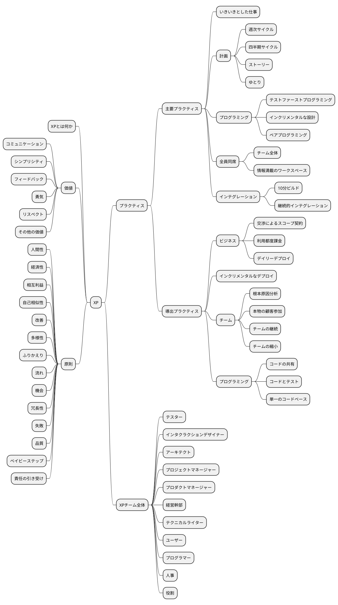
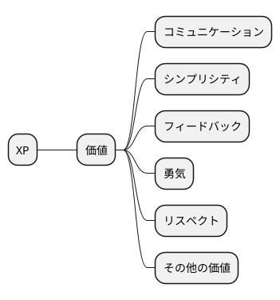
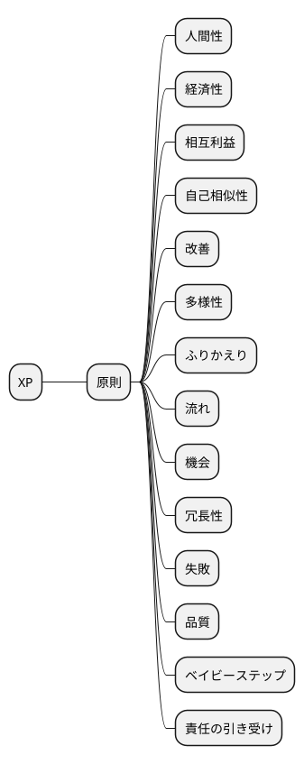
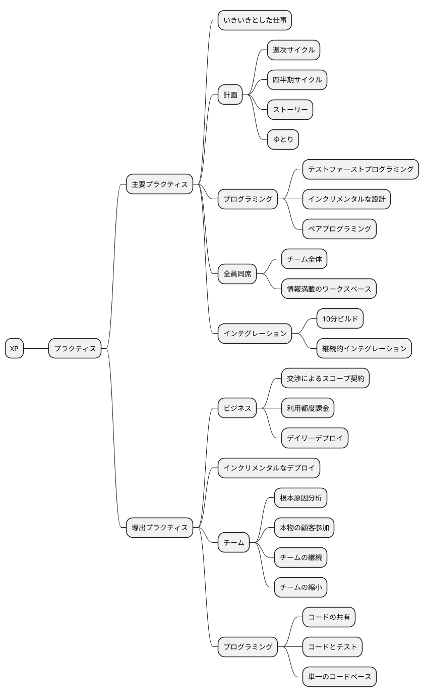
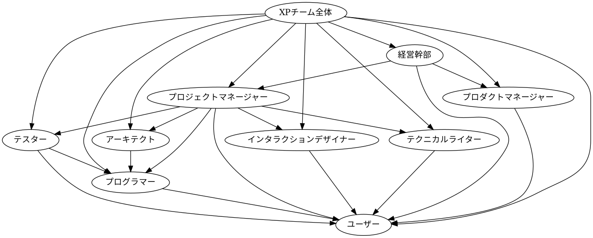

## 1. XPとは何か
> XPとは、以前はうまくいっていたかもしれないが、今では最高の仕事の邪魔になっている習慣やパターンを手放すことだ。

- **効果のある習慣を選び取ること**  
  効果のない技術的・社会的な古い習慣を捨て、効果的な新しい習慣を採用する。

- **今日やるべきことを理解すること**  
  チームや個人がやるべきことを正確に把握し、目標達成につなげる。

- **自己評価**  
  チームの目標に貢献した自分の成果を評価し、自己成長につなげる。

- **人間としての欲求を満たすこと**  
  開発を通じて達成感や協調など、人間的欲求を満たす。

---

## 2. 価値（Values）

 
**価値**とは、ある状況における好き嫌いの根源にあるものだ。

- **コミュニケーション**  
  コミュニケーションは、チーム感覚や効果的な協力関係を生み出すために重要なものである。だが、効果的なソフトウェア開発に必要なのは、コミュニケーションだけではない。

- **シンプリシティ（単純さ）**
  価値は、お互いにバランスを取り合ったり、サポートしあったりするものである。
  たとえばコミュニケーションによって、現状の観点からは必要がない、あるいは時間的猶予がある要件を削除すれば、それがシンプリシティの達成につながる。
　**シンプリシティ**を達成すれば、必要な**コミュニケーション**も少なくなる。

- **フィードバック**  
  フィードバックはコミュニケーションに欠かせない。「パフォーマンスは問題になるかな？」「わからないね。パフォーマンス測定用のプロトタイプを作って確認してみよう」。
　フィードバックはシンプリシティにも影響する。３つの解決策の中で、どれが最もシンプルになるだろうか？そんなときは、３つすべてを試して確認してみよう。
　同じものを3回実装するのはムダに思えるかもしれない。だが、シンプリシティが備わった納得できる解決差にたどり着くには、こうするのが最も効率的な方法だろう。
　それと同時に、システムがシンプルになれば、その分だけ**フィードバック**を受け取ることも簡単になる。

- **勇気**  
  **勇気**のみでは危険だが、他の価値と合わせれば強力だ。**勇気**を持って真実を語れば（たとえそれが不愉快なことであっても）、**コミュニケーション**や信頼が強化されていく。
  うまくいかない可決策を捨てて、**勇気**を持って新しい解決策を見つければ、**シンプリシティ**が促進される。
  **勇気**を持って現実の具体的な答えを求めれば、そこから**フィードバック**が生まれる。

- **リスペクト**  
  チームメンバーがお互いに関心がなく、何をしているかを気にもとめないようであれば、XPはうまくいかない。
　チームメンバーがプロジェクトを大切にしたいのであれば、何をしたところで救えるはずもない。

- **その他の価値**  
  最も重要なのは、チームの振る舞いをチームの価値に合わせることである。そうすれば、複数の価値を同時に維持する無駄を最小化することができる。

---

## 3. 原則（Principles）

**原則は**、その分野に特化した活動の指針である。

- **人間性**  
  XPのプラクティスには、ビジネスニーズと個人の欲求の両方を満たすものを選んでいる。

- **経済性**  
  ソフトウェア開発に影響を与える経済性には２つの側面がある。貨幣のタイムバリューと、システムやチームのオプションバリューだ。
  ソフトウェア開発の場合は、早めにお金を稼ぎ、あとでお金を使うほうがバリューが高い。
  ソフトウェア開発の経済性のもうひとつの源泉は、将来のオプションバリューである。たとえば、メディアのスケジューリングプログラムを開発したとしよう。
  それを他のスケジューリングのタスクにも再利用できたとすれば、本来の目的だけに使うよりもバリューが高い。 

- **相互利益**  
  あらゆる活動は、関係者全員の利益にならなければいけない。相互利益とは、最も重要であり、最も実行が難しいXPの原則である。

- **自己相似性**  
  ソフトウェア開発にも同じ原則が当てはまる。規模が違っていても、解決策の構造を新しい文脈にコピーしようとするからだ。
  たとえば、先に失敗するテストを書いてから、それを動かすという開発の基本的なリズムがある。このリズムはあらゆる規模作用する。
  四半期単位では、扱いたいテーマをテーマを一覧にして、ストーリーを使って取り組んでいく。週単位では、扱いたいストーリーを一覧にして、ストーリーを表すテストをを書いて、それを動かすようにする。
  数時間単位では、書かなければいけないテストを一覧にして、テストを書いて、動かして、別のテストを書いて、その両方を動かして、これをテストの一覧が終わるまで繰り返す。

- **改善**  
  XPのポイントは、改善によってソフトウェア開発の高みを目指すことだ。改善のライフサイクルでは、明日をよりよくするために必要な気づきや理解を追い求めながら、今日できる最高のことをやる。
  完璧になるのを待ってから始めるわけではない。

- **多様性**  
  多様性は**チーム全体**のプラクティスで表現されている。このプラクティスは、多種多様なスキルや視点を持った人たちをチームにまとめるというものだ。
　異なる視点を持った人たちが、さまざまな計画サイクルを使い、時間内に最もバリューの高いソフトウェアを作り出すという目的を達成するのである。

- **ふりかえり**  
  優れたチームは単に仕事をしているだけではない。**どうやって**仕事をしているのか、**なぜ**仕事をしているのかを考えている。なぜ成功したのか、なぜ失敗したのかを分析している。
　自分たちのミスを隠そうとしない。それを明らかにして、そこから学ぼうとするのである。偶然に優秀になれる人などいないのだ。

- **流れ**  
  流れの原則では、改善のために小さなバリューを何度もデプロイすることを提唱している。

- **機会**  
  XPの実践を始めると、必ず問題に直面する。エクストリームになるというのは、それぞれの問題を個人の成長、人間関係の深化、ソフトウェアの改善などの機会に意識的に変換することである。

- **冗長性**  
  ソフトウェア開発の重要で困難な問題は、複数の方法で解決すべきである。ひとつの解決策が完全に失敗しても、その他の解決策で惨事を食い止めることができるからだ。
　冗長にコストがかかるとしても、惨事から救われるならそのコストは支払うに値する。

- **失敗**  
  うまく成功できなければ、失敗しよう。何をすべきかわからないときには、失敗のリスクを受け入れることが成功につながる最短で確実な道である。

- **品質**  
  品質が心配だからといって、何もしないことの言い訳にしてはいけない。きれいに実装する方法がわからなければ、できる限りのことをすればいい。きれいだが時間のかかる方法を知っていれば、今の時間でできるかぎりのことをすればいい。
  そして、あとからきれいな方法で完成させるのだ。こうしたやり方は、アーキテクチャを進化させるときにもよく使う。

- **ベイビーステップ**  
  大きな変更が失敗してチームがムダに後退するよりも、小さなステップのオーバヘッドのほうが小さい。
  ベイビーステップは**テストファーストプログラミング**や**継続的インテグレーション**などのプラクティスで表現されている。

- **責任の引き受け**  
  責任は割り当てるものではなく、引き受けることしかできない。誰かがあなたに責任を担わせようとしても、責任を持つかどうかを選ぶのはあなたである。

---

## 4. プラクティス（Practices）

**プラクティス**は、日常的な取り組みである。

### 4.1 主要プラクティス（Primary Practices）
あなたが他にやっているものとは無関係に役に立つものである。
すぐに改善につながり、どれからでも安全に始められる。

- **全員同席**  
  **チーム全体**が入れる十分な広さのオープンスペースで開発すること。近くに小さなプライベート空間を用意するか、別の場所でプライバシーを確保できるように労働時間を制限するなどして、チームメンバーのプライバシーや「自分だけの」スペースといった欲求を満たせるようにすること。

- **チーム全体**  
  チームの全体感。つまり、成功に必要なすべての資源の準備を整えることが、このプラクティスの目的である。プロジェクトの健全性のために綿密なやりとりが必要なところでは、機能単位ではなく、チーム単位でやり取りすべきだ。

- **情報満載のワークスペース**    
  仕事の内容がわかるようなワークスペースをつくること。プロジェクトに関心のある人がチームのスペースを見たときに、15秒で状況を把握できるようにすべきである。
  さらに近づいて見たときには、抱えている問題や潜在的な問題に関する詳しい情報を入手できるようにしておこう。

- **いきいきとした仕事**  
  生産的になれる時間だけ働くこと。無理なく続けられる時間だけ働くこと。意味もなく燃えてきてしまい、次の２日間の作業が台無しになれば、あなたにとってもチームにとってもよろしくない。

- **ペアプログラミング**  
  ペアプログラミングとは、2人でプログラミング（および分析、設計、テスト）とプログラムの改良を同時に行うやりとりのことである。ペアプログラミングでは、以下のようなことをする。
  - お互いにタスクに集中する。
  - システムの改良について意見を出し合う。
  - アイデアを明確にする。
  - パートナーがハマったら主導権を握り、相手の失望感を軽減させる。
  - お互いにチームのプラクティスの説明責任を果たせるようにする。

- **ストーリー**  
  顧客に見える機能の単位を使って計画すること。たとえば、「これまでのレスポンスタイムで5倍のトラフィックを処理する」「よく使う番号に2クリックの短縮を提供する」などだ。
　ストーリーが書けたら、必要な開発工程をすぐに見積もること。XPスタイルの計画づくりの特徴は、ストーリーを書いたらすぐに見積もることだ。こうすることで、最小の投資で最大のリターンを得る方法を考えられる。

- **週次サイクル**  
  1週間分の仕事の計画をまとめて立てること。そして、週のはじめにミーティングを入れること。ミーティングでは、以下のことを行う。
  - 先週の進捗が期待していた進捗と合致しているかなど、これまでの進捗状況をレビューする。
  - 今週実装する1週間分のストーリーを顧客に選んでもらう。
  - ストーリーをタスクに分解する。チームメンバーはタスクにサインアップして、それぞれのタスクを見積もる。

- **四半期サイクル**  
  四半期分の計画をまとめて立てること。四半期に一度は、チーム、プロジェクト、進捗、大きなゴールの調整について、ふりかえること。四半期の計画では、以下のことを行う。
  - ボトルネックを特定する（特にチームの外側で制御されているもの）。
  - 修正作業に着手する。
  - 四半期のテーマを計画する。
  - テーマに取り組むための四半期分のストーリーを選択する。
  - プロジェクトを組織に適合させる全体像に集中する。

- **ゆとり**  
  どのような計画にも、遅れたときに外せるような重要度の低いタスクを含めること。あとからストーリーを追加したり、約束より多くのストーリーをデリバリーしたりするのは、いつでもできる。
  不信感を抱かれたり、約束を破ったりしたときは、やるべきことをきちんと果たすことが重要だ。少しでもやるべきことを果たせば、人間関係の再構築につながるはずである。

- **10分ビルド**  
  自動的にシステム全体をビルドして、すべてのテストを10分以内に実行させること。ビルドに10分以上かかるようだと使用頻度が減り、フィードバックの機会が失われてしまう。

- **継続的インテグレーション**  
  数時間以内に変更箇所のインテグレーションとテストをすること。チームプログラミングとは、分割統治の問題ではない。分割、統治、結合（インテグレーション）の問題である。

- **テストファーストプログラミング**  
  コードを変更する前に、失敗する自動テストを書くこと。テストファーストプログラミングは、以下のような多くの問題を一度に解決する。
  - スコープクリープ - プログラミングに夢中になって我を忘れてしまうと、「念のため」に余計なコードを追加しがちである。プログラムのあるべき姿を明確に客観的に記述すれば、本来のコーディングに集中できる。どうしてもコードを追加したいなら、手元の作業を終えたあとに別のテストを書くようにしよう。
  - 結合度と凝集度 - テストを書くのが難しければ、テストの問題ではなく、設計に問題があるのだろう。疎結合で凝集度の高いコードは、テストしやすい。
  - 信頼 - 動かないコードの作者を信頼するのは難しい。動くきれいなコードを書いて、自動テストで意図を示せば、チームメイトから信頼を得られるはずだ。
  - リズム - コーディングをすると何時間もさまよいがちである。テストファーストでプログラミングすれば、次に何をすべきか（別のテストを書けばいいのか、それとも失敗したテストを修正すればいいのか）が明確になる。そして、それは自然で効率的な開発のリズム（テスト、コード、リファクタ、テスト、コード、リファクタ）なっていく。

- **インクリメンタルな設計**  
  システムの設計に毎日手を入れること。システムの設計は、その日のシステムのニーズにうまく合致させること。最適だと思われる設計が理解できなくなってきたら、少しだが着実に、自分の理解できる設計に戻していくこと。
  小さくて安全なステップで稼働中のシステムを変更する経験を踏み重ねていくと、設計にかける労力を遅延させることができるようになる。そうすれば、システムはシンプルになり、進捗は早くなり、テストが書きやすくなる。システムが小さくなるので、チームのコミュニケーションも軽減できる。

### 4.2 導出プラクティス（Corollary Practices）
先に主要プラクティスを習得しておかなければ難しいだろう

- **本物の顧客参加**  
  あなたのシステムによって生活やビジネスに影響を受ける人をチームの一員にすること。明確なビジョンを持った顧客であれば、四半期や週単位の計画づくりに参加できる。
  そうした顧客は自由に使える予算を持っていることもある。予算は開発で利用可能なキャパシティーの一部だ。競合他社より半年も早く問題に気づくような顧客であれば、その顧客が必要とするシステムを構築することによって、あなたの競合他社に対する優位性にもつながる可能性がある。

- **インクリメンタルなデプロイ**  
  レガシーシステムをリプレースするときは、プロジェクトの初期段階から少しずつ引継ぎをすること。

- **チームの継続**  
  優秀なチームは継続させること。大きな組織は、ヒトをモノに抽象化する傾向がある。互換性のあるプログラミングユニットだと考えているのだ。ソフトウェアのバリューは、みんなが知っていることや行っていることだけでなく、人間関係やみんなで一緒に成し遂げることによっても生み出される。
  要員計画の問題を単純化するためだけに、人間関係や信頼の大切さを無視するのは経済的ではない。

- **チームの縮小**  
  チームの能力が高まったら、仕事量を維持しながら少しづつチームの規模を縮小すること。

- **根本原因分析**  
  開発後に欠陥が見つかるたびに、欠陥とその原因を取り除くこと。欠陥の再発防止だけではなく、同じ種類の過ちをチームが二度と犯さないようにすることが目的だ。
  以下は、欠陥に対処するためのXPのプロセスである。
  - 欠陥を実証するシステムレベルの自動テストを書く。そこには期待する挙動も含めておく。これは、顧客、顧客サポート、開発者が行える。
  - 結果を再現する最小限のスコープでユニットテストを書く。
  - ユニットテストが動くようにシステムを修正する。これにより、システムテストもパスするはずだ。パスしなければ、2へ戻る。
  - 欠陥を修正出来たら、なぜ欠陥が生み出されたのか、なぜ発見できなかったのかを見極める。今後は同様の欠陥が再発しないように、必要な変更を加える。

- **コードの共有**  
  チームの誰もが、システムのあらゆる部分をいつでも改善できる。システムに問題があり、その修正が現在作業中のスコープの範囲内なのであれば、遠慮せずに修正すべきである。

- **コードとテスト**  
  コードとテストだけを永続的な作成物として保守すること。その他のドキュメントについては、コードとテストから生成すること。プロジェクトの重要な履歴の維持については、社会的な仕組みに任せること。

- **単一のコードベース**  
  コードの流れは一つだけである。一時的なブランチで開発することもできるが、数時間以上も維持してはいけない。

- **デイリーデプロイ**  
  新しいソフトウェアを毎晩プロダクションに反映すること。プログラマーの手元にあるものとプロダクションにあるものが違うのはリスクだ。プログラマーの意思決定につながる正確なフィードバックが得られない危険性がある。

- **交渉によるスコープ契約**  
  ソフトウェア開発の契約では、期間、費用、品質を固定すること。システムの明確なスコープについては、継続的に交渉を求めること。長期的なひとつの契約ではなく、短期多岐な契約をいくつも結ぶようにして、リスクを減らすこと。

- **利用都度課金**  
  利用都度課金システムがあれば、システムが利用されるたびにお金を請求することができる。お金は究極のフィードバックだ。お金には実体があり、これから自分で使うこともできる。お金の流れをソフトウェア開発に直接接続すれば、改善を推進するための正確でタイムリーな情報を得られるはずだ。

---

## 5. XPチーム全体

- **テスター**  
  XPチームのテスターは、システムレベルの自動テストの選択や記述について開発前に顧客を支援したり、プログラマーにテスト技法をコーチしたりする。

- **インタラクションデザイナー**  
  XPチームのインタラクションデザイナーは、システム全体のメタファーを選んだり、**ストーリー**を書いたり、デプロイされたシステムの利用状況を評価して、新しいストーリーの機会を見つけたりする。
  XPチームでは、インタクラクションデザイナーは顧客と一緒に働いて、ストーリーの記述や明確化を支援する。

- **アーキテクト**  
  XPチームのアーキテクトは、大規模リファクタリングの調査や実施をしたり、アーキテクチャにストレスを与えるシステムレベルのテストを書いたり、**ストーリー**を実装したりする。
  XPチームのアーキテクトのもうひとつの仕事は、システムの分割だ。分割は事前に行う一度きりのタスクではない。XPチームは統治分割を行う。分割統治ではない。つまり、小さなチームで小さなシステムを作ってから、自然な切れ目を見つけ、比較的独立した単位に分割して、システムを拡張するのである。

- **プロジェクトマネージャー**  
  XPチームのプロジェクトマネージャーは、チーム内のコミュニケーションを円滑にしたり、顧客、サプライヤー、その他のチーム外の組織とのコミュニケーションを調整したりする。

- **プロダクトマネージャー**  
  XPのプロダクトマネージャーは、**ストーリー**を書いたり、**四半期サイクル**のテーマやストーリーを選択したり、**週次サイクル**のストーリーを選択したり、実装によって明らかになったストーリーのあいまいな部分の質問に答えたりする。

- **経営幹部**  
  経営幹部は、XPチームに勇気、自信、説明責任を提供する。

- **テクニカルライター**  
  XPチームにおけるテクニカルパブリケーションの役割は、フィーチャーのフィードバックを早期に提供したり、ユーザーとの密接な関係を築いたりすることである。

- **ユーザー**  
  XPチームのユーザーは、開発中にストーリーの記述や選択の支援をしたり、専門領域の意思決定をしたりする。構築中のシステムと類似したシステムに関する幅広い知識や経験をもっていたり、システムを実際に利用するユーザーコミュニティとの強い関係性を持っていたりすれば、そのユーザーは非常に大切な存在だ。

- **プログラマー**  
  XPチームのプログラマーは、**ストーリー**やタスクを見積もったり、ストーリーをタスクに分解したり、テストを書いたり、フィーチャーを実装するコードを書いたり、退屈な開発プロセスを自動化したり、システムの設計を少しづつ改善したりする。

- **人事**  
  XPチームのメンバーを個人として評価するといっても、XP適用前の評価の仕方を大きく変える必要はない。以下は、XPにおける重要性の高い従業員だ。
  - リスペクトを持って行動できる。
  - 他人とうまくやれる。
  - イニシアチブをとれる。
  - 約束したものデリバリーできる。

- **その他の役割**  
  必要に応じた追加役割。

---

## 6. チェックリスト

### 主要プラクティス

- [ ] **いきいきとした仕事**
  - 生産的になれる時間だけ働いていますか？

#### **計画**
- [ ] **週次サイクル**
  - 1週間分の計画を作成し、進捗をレビューしていますか？
  - ストーリーをタスクに分解していますか？

- [ ] **四半期サイクル**
  - チームの進捗やボトルネックをレビューしていますか？
  - 四半期ごとの計画テーマを設定していますか？

- [ ] **ストーリー**
  - ストーリー単位で顧客に機能を提案していますか？

- [ ] **ゆとり**
  - 計画に重要度の低いタスクを含め、余裕を持っていますか？

#### **プログラミング**
- [ ] **テストファーストプログラミング**
  - コードを書く前に失敗するテストを書く習慣がありますか？

- [ ] **インクリメンタルな設計**
  - 小さい手順でシステムの設計・改善を行っていますか？

- [ ] **ペアプログラミング**
  - 2人でアイデアを共有しながらコードを書いていますか？

#### **全員同席**
- [ ] **チーム全体**
  - 必要なスキルやリソースをチーム全体で共有していますか？

- [ ] **情報満載のワークスペース**
  - 外部の訪問者が15秒で状況を把握できるように情報を可視化していますか？

#### **インテグレーション**
- [ ] **10分ビルド**
  - すべてのテストを含むビルドが10分以内に完了しますか？

- [ ] **継続的インテグレーション**
  - 数時間おきに変更をマージしてテストを実行していますか？

---

### 導出プラクティス

#### **ビジネス**
- [ ] **交渉によるスコープ契約**
  - スコープを柔軟に交渉しながら契約内容を進めていますか？

- [ ] **利用都度課金**
  - ソフトウェアが使用されるたびに課金モデルを取り入れていますか？

- [ ] **デイリーデプロイ**
  - 毎日ソフトウェアをプロダクションにデプロイしていますか？

#### **インクリメンタルなデプロイ**
- [ ] 徐々にレガシーシステムのリプレースを進めていますか？

#### **チーム**
- [ ] **根本原因分析**
  - バグの原因を調査し、再発防止策を講じていますか？

- [ ] **本物の顧客参加**
  - 顧客が計画作成や改善に参加していますか？

- [ ] **チームの継続**
  - チームメンバーが一貫性を持って協力していますか？

- [ ] **チームの縮小**
  - チームが成長した段階で規模を縮小して効率化していますか？

#### **プログラミング**
- [ ] **コードの共有**
  - メンバー全員がシステムの任意の部分を改善できますか？

- [ ] **コードとテスト**
  - 永続する作成物としてコードとテストのみを保守していますか？

- [ ] **単一のコードベース**
  - ブランチを短期間で管理し、コードの中心ラインを保っていますか？

