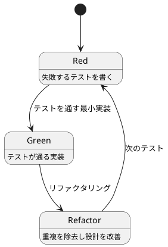
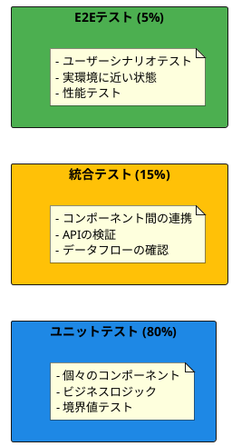
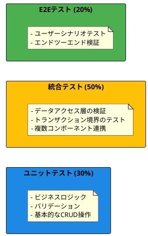
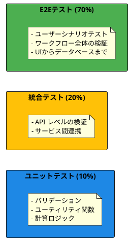
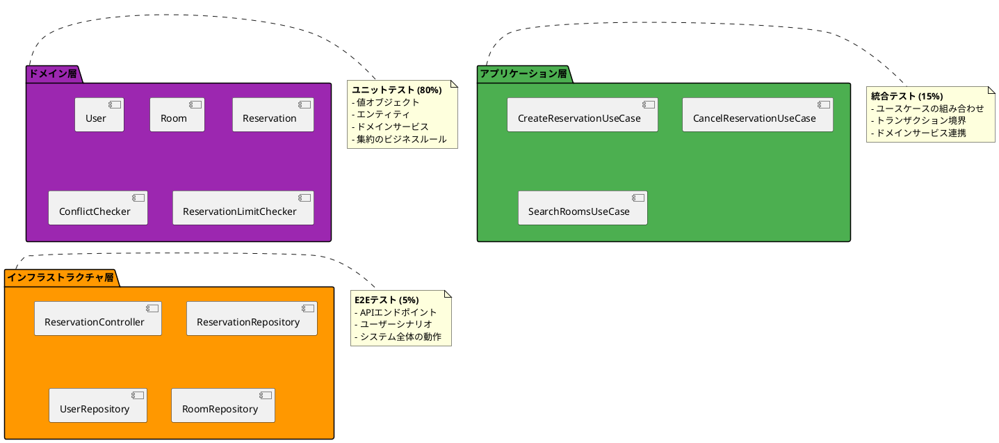
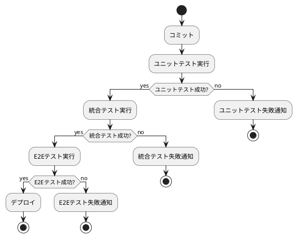

# テスト戦略ガイド

## 概要

よいソフトウェアを作るためのテスト戦略について説明する。アーキテクチャパターンに応じた適切なテスト戦略を選択し、変更を楽に安全にできて役に立つソフトウェアの実現を目指す。

## テスト戦略の基本原則

### よいソフトウェアとテスト

変更を楽に安全にできて役に立つソフトウェアを作るため、テストは以下の価値を提供する：

1. **安全な変更**: 既存機能を破壊することなく新機能を追加
2. **設計の改善**: テスタブルなコードは良い設計の指標
3. **ドキュメント**: テストコードは実行可能な仕様書
4. **品質の保証**: バグの早期発見と予防

### テスト駆動開発（TDD）



#### TDD の 3 つの法則

1. **失敗する単体テストを書くまでプロダクションコードを書かない**
2. **コンパイルが通らない、または失敗する範囲を超えて単体テストを書かない**
3. **現在失敗している単体テストを通す以上にプロダクションコードを書かない**

## テスト形態とアーキテクチャパターン

アーキテクチャパターンに応じて、最適なテスト形態を選択する。

### ピラミッド形テスト



#### 適用対象
- **ドメインモデルパターン**
- **イベント履歴式**
- **ヘキサゴナルアーキテクチャ**

#### 特徴
- **ユニットテストに重点**: 高品質なビジネスロジックの検証
- **高速なフィードバック**: 素早いテスト実行
- **保守コストが低い**: シンプルで理解しやすいテスト

#### 実装例

**ドメインモデルのユニットテスト**
```java
@Test
void 予約をキャンセルできる() {
    // Given
    TimeSlot futureTimeSlot = createFutureTimeSlot();
    Reservation reservation = Reservation.create(
        UserId.generate(), RoomId.generate(), 
        new ReservationTitle("会議"), new Purpose("定例会議"), futureTimeSlot);
    
    // When
    reservation.cancel();
    
    // Then
    assertThat(reservation.getStatus()).isEqualTo(ReservationStatus.CANCELLED);
}

@Test
void 開始2時間前を過ぎた予約はキャンセルできない() {
    // Given
    TimeSlot pastTimeSlot = createPastTimeSlot();
    Reservation reservation = Reservation.create(
        UserId.generate(), RoomId.generate(),
        new ReservationTitle("会議"), new Purpose("定例会議"), pastTimeSlot);
    
    // When & Then
    assertThatThrownBy(reservation::cancel)
        .isInstanceOf(IllegalStateException.class)
        .hasMessageContaining("2時間前まで");
}
```

### ダイヤモンド形テスト



#### 適用対象
- **アクティブレコードパターン**
- **レイヤードアーキテクチャ（データベース中心）**

#### 特徴
- **統合テストに重点**: データアクセスロジックの検証
- **データベーステスト**: 実際のデータベース操作を含む
- **中程度の実行速度**: データベースアクセスを含むため

#### 実装例

**データアクセス層の統合テスト**
```java
@SpringBootTest
@Testcontainers
@Transactional
class ReservationRepositoryTest {
    
    @Container
    static PostgreSQLContainer<?> postgres = new PostgreSQLContainer<>("postgres:15");
    
    @Autowired
    private ReservationRepository reservationRepository;
    
    @Test
    void 予約を保存して取得できる() {
        // Given
        Reservation reservation = createTestReservation();
        
        // When
        reservationRepository.save(reservation);
        Optional<Reservation> found = reservationRepository.findById(reservation.getId());
        
        // Then
        assertThat(found).isPresent();
        assertThat(found.get().getTitle()).isEqualTo(reservation.getTitle());
    }
    
    @Test
    void アクティブな予約のみ取得される() {
        // Given
        Reservation activeReservation = createActiveReservation();
        Reservation cancelledReservation = createCancelledReservation();
        reservationRepository.save(activeReservation);
        reservationRepository.save(cancelledReservation);
        
        // When
        List<Reservation> activeReservations = reservationRepository.findActiveByUserId(
            activeReservation.getUserId());
        
        // Then
        assertThat(activeReservations).hasSize(1);
        assertThat(activeReservations.get(0).getId()).isEqualTo(activeReservation.getId());
    }
}
```

### 逆ピラミッド形テスト



#### 適用対象
- **トランザクションスクリプトパターン**
- **単純なCRUDアプリケーション**

#### 特徴
- **E2Eテストに重点**: エンドツーエンドの動作検証
- **ユーザー視点**: 実際のユーザー操作をシミュレート
- **低速だが包括的**: 全体的な動作を保証

#### 実装例

**E2Eテスト（Selenium WebDriver使用）**
```java
@SpringBootTest(webEnvironment = SpringBootTest.WebEnvironment.RANDOM_PORT)
@Testcontainers
class ReservationE2ETest {
    
    @Container
    static PostgreSQLContainer<?> postgres = new PostgreSQLContainer<>("postgres:15");
    
    @Autowired
    private TestRestTemplate restTemplate;
    
    private WebDriver driver;
    
    @BeforeEach
    void setUp() {
        driver = new ChromeDriver();
    }
    
    @Test
    void 会議室を検索して予約できる() {
        // Given - ユーザーがログイン済み
        loginAsTestUser();
        
        // When - 会議室検索ページにアクセス
        driver.get("http://localhost:" + port + "/rooms/search");
        
        // 検索条件を入力
        driver.findElement(By.id("capacity")).sendKeys("10");
        driver.findElement(By.id("date")).sendKeys("2024-12-01");
        driver.findElement(By.id("startTime")).sendKeys("10:00");
        driver.findElement(By.id("endTime")).sendKeys("12:00");
        driver.findElement(By.id("searchButton")).click();
        
        // 検索結果から会議室を選択
        WebElement roomCard = driver.findElement(By.className("room-card"));
        roomCard.findElement(By.className("reserve-button")).click();
        
        // 予約情報を入力
        driver.findElement(By.id("title")).sendKeys("定例会議");
        driver.findElement(By.id("purpose")).sendKeys("週次定例会議");
        driver.findElement(By.id("submitButton")).click();
        
        // Then - 予約完了メッセージが表示される
        WebElement successMessage = driver.findElement(By.className("success-message"));
        assertThat(successMessage.getText()).contains("予約が完了しました");
    }
    
    @Test
    void 予約をキャンセルできる() {
        // Given - 事前に予約を作成
        createTestReservation();
        loginAsTestUser();
        
        // When - マイ予約ページにアクセス
        driver.get("http://localhost:" + port + "/my-reservations");
        
        // 予約をキャンセル
        WebElement reservationCard = driver.findElement(By.className("reservation-card"));
        reservationCard.findElement(By.className("cancel-button")).click();
        
        // 確認ダイアログでOK
        driver.switchTo().alert().accept();
        
        // Then - キャンセル済み表示になる
        WebElement status = reservationCard.findElement(By.className("status"));
        assertThat(status.getText()).isEqualTo("キャンセル済み");
    }
}
```

## 会議室予約システムのテスト戦略

### アーキテクチャとテスト戦略の選択

会議室予約システムは**ドメインモデルパターン**と**ヘキサゴナルアーキテクチャ**を採用するため、**ピラミッド形テスト**が最適。



### テストレベル別の詳細戦略

#### レベル1：ユニットテスト（80%）

**対象**：ドメイン層の各コンポーネント

**値オブジェクトのテスト**
```java
class TimeSlotTest {
    @Test
    void 有効な時間枠で作成できる() {
        LocalDateTime start = LocalDateTime.of(2024, 1, 1, 10, 0);
        LocalDateTime end = LocalDateTime.of(2024, 1, 1, 12, 0);
        
        assertThatCode(() -> new TimeSlot(start, end))
            .doesNotThrowAnyException();
    }
    
    @Test
    void 営業時間外は例外が発生する() {
        LocalDateTime start = LocalDateTime.of(2024, 1, 1, 7, 0);  // 営業時間前
        LocalDateTime end = LocalDateTime.of(2024, 1, 1, 9, 0);
        
        assertThatThrownBy(() -> new TimeSlot(start, end))
            .isInstanceOf(IllegalArgumentException.class)
            .hasMessageContaining("営業時間内");
    }
    
    @ParameterizedTest
    @CsvSource({
        "10:00, 12:00, 11:00, 13:00, true",   // 重複あり
        "10:00, 12:00, 12:00, 14:00, false",  // 重複なし（境界）
        "10:00, 12:00, 14:00, 16:00, false"   // 重複なし（離れている）
    })
    void 時間枠の重複判定が正しい(String start1, String end1, String start2, String end2, boolean expected) {
        TimeSlot slot1 = createTimeSlot(start1, end1);
        TimeSlot slot2 = createTimeSlot(start2, end2);
        
        assertThat(slot1.overlaps(slot2)).isEqualTo(expected);
    }
}
```

**エンティティのテスト**
```java
class ReservationTest {
    @Test
    void 予約作成時は確定状態になる() {
        Reservation reservation = createValidReservation();
        
        assertThat(reservation.getStatus()).isEqualTo(ReservationStatus.CONFIRMED);
        assertThat(reservation.getId()).isNotNull();
        assertThat(reservation.getCreatedAt()).isBeforeOrEqualTo(LocalDateTime.now());
    }
    
    @Test
    void 変更可能な予約はタイトルを変更できる() {
        Reservation reservation = createFutureReservation();
        ReservationTitle newTitle = new ReservationTitle("新しいタイトル");
        
        reservation.changeTitle(newTitle);
        
        assertThat(reservation.getTitle()).isEqualTo(newTitle);
    }
    
    @Test
    void 開始2時間前を過ぎた予約は変更できない() {
        Reservation reservation = createNearFutureReservation(); // 1時間後開始
        
        assertThatThrownBy(() -> reservation.changeTitle(new ReservationTitle("新タイトル")))
            .isInstanceOf(IllegalStateException.class)
            .hasMessageContaining("2時間前まで");
    }
    
    @Test
    void キャンセルされた予約は再キャンセルできない() {
        Reservation reservation = createValidReservation();
        reservation.cancel(); // 一度キャンセル
        
        assertThatThrownBy(reservation::cancel)
            .isInstanceOf(IllegalStateException.class);
    }
}
```

**ドメインサービスのテスト**
```java
@ExtendWith(MockitoExtension.class)
class ConflictCheckerTest {
    @Mock
    private ReservationRepository reservationRepository;
    
    private ConflictChecker conflictChecker;
    
    @BeforeEach
    void setUp() {
        conflictChecker = new ConflictChecker(reservationRepository);
    }
    
    @Test
    void 重複する予約がない場合はfalseを返す() {
        // Given
        RoomId roomId = RoomId.generate();
        TimeSlot newTimeSlot = createTimeSlot("10:00", "12:00");
        
        when(reservationRepository.findActiveByRoomId(roomId))
            .thenReturn(Collections.emptyList());
        
        // When
        boolean hasConflict = conflictChecker.hasConflict(roomId, newTimeSlot);
        
        // Then
        assertThat(hasConflict).isFalse();
    }
    
    @Test
    void 完全に重複する場合はtrueを返す() {
        // Given
        RoomId roomId = RoomId.generate();
        TimeSlot newTimeSlot = createTimeSlot("10:00", "12:00");
        Reservation existingReservation = createReservationWithTimeSlot("10:00", "12:00");
        
        when(reservationRepository.findActiveByRoomId(roomId))
            .thenReturn(List.of(existingReservation));
        
        // When
        boolean hasConflict = conflictChecker.hasConflict(roomId, newTimeSlot);
        
        // Then
        assertThat(hasConflict).isTrue();
    }
    
    @Test
    void 部分的に重複する場合はtrueを返す() {
        // Given
        RoomId roomId = RoomId.generate();
        TimeSlot newTimeSlot = createTimeSlot("10:00", "12:00");
        Reservation existingReservation = createReservationWithTimeSlot("11:00", "13:00");
        
        when(reservationRepository.findActiveByRoomId(roomId))
            .thenReturn(List.of(existingReservation));
        
        // When
        boolean hasConflict = conflictChecker.hasConflict(roomId, newTimeSlot);
        
        // Then
        assertThat(hasConflict).isTrue();
    }
}
```

#### レベル2：統合テスト（15%）

**対象**：アプリケーション層とインフラストラクチャ層の連携

**ユースケースの統合テスト**
```java
@SpringBootTest
@Testcontainers
@Transactional
class CreateReservationUseCaseIntegrationTest {
    
    @Container
    static PostgreSQLContainer<?> postgres = new PostgreSQLContainer<>("postgres:15");
    
    @Autowired
    private CreateReservationUseCase createReservationUseCase;
    
    @Autowired
    private UserRepository userRepository;
    
    @Autowired
    private RoomRepository roomRepository;
    
    @Autowired
    private ReservationRepository reservationRepository;
    
    @Test
    void 有効な条件で予約を作成できる() {
        // Given
        User user = createAndSaveTestUser();
        Room room = createAndSaveTestRoom();
        
        CreateReservationCommand command = CreateReservationCommand.builder()
            .userId(user.getId())
            .roomId(room.getId())
            .title("定例会議")
            .purpose("週次定例会議")
            .startTime(LocalDateTime.now().plusDays(1).withHour(10).withMinute(0))
            .endTime(LocalDateTime.now().plusDays(1).withHour(12).withMinute(0))
            .build();
        
        // When
        ReservationId reservationId = createReservationUseCase.execute(command);
        
        // Then
        assertThat(reservationId).isNotNull();
        
        Optional<Reservation> savedReservation = reservationRepository.findById(reservationId);
        assertThat(savedReservation).isPresent();
        assertThat(savedReservation.get().getUserId()).isEqualTo(user.getId());
        assertThat(savedReservation.get().getRoomId()).isEqualTo(room.getId());
        assertThat(savedReservation.get().getStatus()).isEqualTo(ReservationStatus.CONFIRMED);
    }
    
    @Test
    void 重複する時間帯の予約は失敗する() {
        // Given
        User user = createAndSaveTestUser();
        Room room = createAndSaveTestRoom();
        
        // 既存の予約を作成
        LocalDateTime startTime = LocalDateTime.now().plusDays(1).withHour(10).withMinute(0);
        LocalDateTime endTime = LocalDateTime.now().plusDays(1).withHour(12).withMinute(0);
        createAndSaveReservation(user.getId(), room.getId(), startTime, endTime);
        
        // 重複する新しい予約
        CreateReservationCommand command = CreateReservationCommand.builder()
            .userId(UserId.generate())
            .roomId(room.getId())
            .startTime(startTime.plusMinutes(30)) // 30分後開始（重複）
            .endTime(endTime.plusMinutes(30))
            .title("別の会議")
            .purpose("別の用途")
            .build();
        
        // When & Then
        assertThatThrownBy(() -> createReservationUseCase.execute(command))
            .isInstanceOf(ReservationConflictException.class);
    }
    
    @Test
    void 同時予約数制限を超える場合は失敗する() {
        // Given
        User user = createAndSaveTestUser();
        
        // ユーザーに既に3件の予約を作成（上限まで）
        createMaxReservationsForUser(user.getId());
        
        CreateReservationCommand command = CreateReservationCommand.builder()
            .userId(user.getId())
            .roomId(RoomId.generate())
            .startTime(LocalDateTime.now().plusDays(2).withHour(10).withMinute(0))
            .endTime(LocalDateTime.now().plusDays(2).withHour(12).withMinute(0))
            .title("4件目の予約")
            .purpose("制限超過テスト")
            .build();
        
        // When & Then
        assertThatThrownBy(() -> createReservationUseCase.execute(command))
            .isInstanceOf(ReservationLimitExceededException.class);
    }
}
```

**リポジトリの統合テスト**
```java
@DataJpaTest
@Testcontainers
class ReservationRepositoryIntegrationTest {
    
    @Container
    static PostgreSQLContainer<?> postgres = new PostgreSQLContainer<>("postgres:15");
    
    @Autowired
    private TestEntityManager entityManager;
    
    @Autowired
    private ReservationRepository reservationRepository;
    
    @Test
    void アクティブな予約のみ取得される() {
        // Given
        UserId userId = UserId.generate();
        RoomId roomId = RoomId.generate();
        
        Reservation activeReservation = createReservation(userId, roomId, ReservationStatus.CONFIRMED);
        Reservation cancelledReservation = createReservation(userId, roomId, ReservationStatus.CANCELLED);
        Reservation completedReservation = createReservation(userId, roomId, ReservationStatus.COMPLETED);
        
        entityManager.persistAndFlush(activeReservation);
        entityManager.persistAndFlush(cancelledReservation);
        entityManager.persistAndFlush(completedReservation);
        
        // When
        List<Reservation> activeReservations = reservationRepository.findActiveByUserId(userId);
        
        // Then
        assertThat(activeReservations).hasSize(1);
        assertThat(activeReservations.get(0).getId()).isEqualTo(activeReservation.getId());
    }
    
    @Test
    void 指定日時範囲の予約が取得される() {
        // Given
        RoomId roomId = RoomId.generate();
        LocalDate targetDate = LocalDate.of(2024, 1, 15);
        
        Reservation targetDateReservation = createReservationOnDate(roomId, targetDate);
        Reservation otherDateReservation = createReservationOnDate(roomId, targetDate.plusDays(1));
        
        entityManager.persistAndFlush(targetDateReservation);
        entityManager.persistAndFlush(otherDateReservation);
        
        // When
        List<Reservation> reservations = reservationRepository.findActiveByRoomIdAndDate(roomId, targetDate);
        
        // Then
        assertThat(reservations).hasSize(1);
        assertThat(reservations.get(0).getId()).isEqualTo(targetDateReservation.getId());
    }
}
```

#### レベル3：E2Eテスト（5%）

**対象**：システム全体のユーザーシナリオ

**APIエンドポイントのE2Eテスト**
```java
@SpringBootTest(webEnvironment = SpringBootTest.WebEnvironment.RANDOM_PORT)
@Testcontainers
@AutoConfigureMockMvc
class ReservationApiE2ETest {
    
    @Container
    static PostgreSQLContainer<?> postgres = new PostgreSQLContainer<>("postgres:15");
    
    @Autowired
    private MockMvc mockMvc;
    
    @Autowired
    private ObjectMapper objectMapper;
    
    @Test
    @WithMockUser(roles = "MEMBER")
    void 予約作成から確認までの一連の流れ() throws Exception {
        // Given - テストデータを準備
        setupTestData();
        
        // When 1 - 利用可能な会議室を検索
        MvcResult searchResult = mockMvc.perform(get("/api/rooms/search")
                .param("date", "2024-01-15")
                .param("startTime", "10:00")
                .param("endTime", "12:00")
                .param("minCapacity", "5"))
            .andExpect(status().isOk())
            .andReturn();
        
        List<RoomSearchResult> rooms = objectMapper.readValue(
            searchResult.getResponse().getContentAsString(), 
            new TypeReference<List<RoomSearchResult>>() {});
        assertThat(rooms).isNotEmpty();
        
        // When 2 - 会議室を予約
        String roomId = rooms.get(0).getRoomId();
        CreateReservationRequest request = CreateReservationRequest.builder()
            .roomId(roomId)
            .title("定例会議")
            .purpose("週次定例会議")
            .startTime(LocalDateTime.of(2024, 1, 15, 10, 0))
            .endTime(LocalDateTime.of(2024, 1, 15, 12, 0))
            .build();
        
        MvcResult createResult = mockMvc.perform(post("/api/reservations")
                .contentType(MediaType.APPLICATION_JSON)
                .content(objectMapper.writeValueAsString(request)))
            .andExpect(status().isCreated())
            .andReturn();
        
        ReservationResponse createdReservation = objectMapper.readValue(
            createResult.getResponse().getContentAsString(), 
            ReservationResponse.class);
        
        // When 3 - 作成した予約を確認
        mockMvc.perform(get("/api/reservations/" + createdReservation.getReservationId()))
            .andExpect(status().isOk())
            .andExpect(jsonPath("$.title").value("定例会議"))
            .andExpect(jsonPath("$.status").value("CONFIRMED"))
            .andExpect(jsonPath("$.roomId").value(roomId));
        
        // When 4 - ユーザーの予約一覧を確認
        mockMvc.perform(get("/api/reservations/my"))
            .andExpected(status().isOk())
            .andExpect(jsonPath("$").isArray())
            .andExpect(jsonPath("$[0].reservationId").value(createdReservation.getReservationId()));
    }
    
    @Test
    @WithMockUser(roles = "MEMBER")
    void 予約キャンセルの一連の流れ() throws Exception {
        // Given - 事前に予約を作成
        String reservationId = createTestReservation();
        
        // When 1 - 予約をキャンセル
        mockMvc.perform(delete("/api/reservations/" + reservationId))
            .andExpected(status().isNoContent());
        
        // Then - キャンセル状態になっていることを確認
        mockMvc.perform(get("/api/reservations/" + reservationId))
            .andExpected(status().isOk())
            .andExpect(jsonPath("$.status").value("CANCELLED"));
    }
    
    @Test
    @WithMockUser(roles = "MEMBER")
    void 重複予約のエラーハンドリング() throws Exception {
        // Given - 既存の予約を作成
        createTestReservationAt(LocalDateTime.of(2024, 1, 15, 10, 0));
        
        // When - 重複する時間で予約を試行
        CreateReservationRequest request = CreateReservationRequest.builder()
            .roomId("test-room-id")
            .title("重複する会議")
            .purpose("重複テスト")
            .startTime(LocalDateTime.of(2024, 1, 15, 11, 0)) // 1時間後開始（重複）
            .endTime(LocalDateTime.of(2024, 1, 15, 13, 0))
            .build();
        
        // Then - 適切なエラーレスポンスが返される
        mockMvc.perform(post("/api/reservations")
                .contentType(MediaType.APPLICATION_JSON)
                .content(objectMapper.writeValueAsString(request)))
            .andExpect(status().isConflict())
            .andExpect(jsonPath("$.error").value("RESERVATION_CONFLICT"))
            .andExpect(jsonPath("$.message").value("指定時間は既に予約されています"));
    }
}
```

### テスト実行戦略

#### 継続的インテグレーション（CI）



#### テスト実行時間の目標

- **ユニットテスト**: 30秒以内
- **統合テスト**: 2分以内  
- **E2Eテスト**: 10分以内
- **全テスト**: 15分以内

#### 並列実行戦略

```yml
# .github/workflows/test.yml
name: Test
on: [push, pull_request]

jobs:
  unit-tests:
    runs-on: ubuntu-latest
    steps:
      - uses: actions/checkout@v3
      - uses: actions/setup-java@v3
        with:
          java-version: '21'
      - run: ./mvnw test -Dtest="**/*Test" # ユニットテストのみ

  integration-tests:
    runs-on: ubuntu-latest
    needs: unit-tests
    steps:
      - uses: actions/checkout@v3
      - uses: actions/setup-java@v3
        with:
          java-version: '21'
      - run: ./mvnw test -Dtest="**/*IntegrationTest"

  e2e-tests:
    runs-on: ubuntu-latest
    needs: integration-tests
    steps:
      - uses: actions/checkout@v3
      - uses: actions/setup-java@v3
        with:
          java-version: '21'
      - run: ./mvnw test -Dtest="**/*E2ETest"
```

## テストデータ管理

### テストデータ戦略

#### テストフィクスチャ

**Object Mother パターン**
```java
public class ReservationFixture {
    
    public static Reservation validReservation() {
        return Reservation.create(
            UserFixture.defaultUserId(),
            RoomFixture.defaultRoomId(),
            new ReservationTitle("定例会議"),
            new Purpose("週次定例会議"),
            TimeSlotFixture.tomorrowMorning()
        );
    }
    
    public static Reservation reservationStartingAt(LocalDateTime startTime) {
        return Reservation.create(
            UserFixture.defaultUserId(),
            RoomFixture.defaultRoomId(),
            new ReservationTitle("会議"),
            new Purpose("テスト用"),
            new TimeSlot(startTime, startTime.plusHours(2))
        );
    }
    
    public static Reservation pastReservation() {
        return Reservation.create(
            UserFixture.defaultUserId(),
            RoomFixture.defaultRoomId(),
            new ReservationTitle("過去の会議"),
            new Purpose("過去のテスト"),
            TimeSlotFixture.yesterday()
        );
    }
}

public class TimeSlotFixture {
    
    public static TimeSlot tomorrowMorning() {
        LocalDateTime start = LocalDateTime.now().plusDays(1).withHour(10).withMinute(0);
        return new TimeSlot(start, start.plusHours(2));
    }
    
    public static TimeSlot yesterday() {
        LocalDateTime start = LocalDateTime.now().minusDays(1).withHour(10).withMinute(0);
        return new TimeSlot(start, start.plusHours(2));
    }
    
    public static TimeSlot nextWeek() {
        LocalDateTime start = LocalDateTime.now().plusWeeks(1).withHour(14).withMinute(0);
        return new TimeSlot(start, start.plusHours(3));
    }
}
```

#### テストビルダーパターン

```java
public class ReservationTestDataBuilder {
    private UserId userId = UserFixture.defaultUserId();
    private RoomId roomId = RoomFixture.defaultRoomId();
    private ReservationTitle title = new ReservationTitle("テスト会議");
    private Purpose purpose = new Purpose("テスト用途");
    private TimeSlot timeSlot = TimeSlotFixture.tomorrowMorning();
    
    public ReservationTestDataBuilder withUserId(UserId userId) {
        this.userId = userId;
        return this;
    }
    
    public ReservationTestDataBuilder withRoomId(RoomId roomId) {
        this.roomId = roomId;
        return this;
    }
    
    public ReservationTestDataBuilder withTitle(String title) {
        this.title = new ReservationTitle(title);
        return this;
    }
    
    public ReservationTestDataBuilder withTimeSlot(TimeSlot timeSlot) {
        this.timeSlot = timeSlot;
        return this;
    }
    
    public ReservationTestDataBuilder startingAt(LocalDateTime startTime) {
        this.timeSlot = new TimeSlot(startTime, startTime.plusHours(2));
        return this;
    }
    
    public Reservation build() {
        return Reservation.create(userId, roomId, title, purpose, timeSlot);
    }
}

// 使用例
@Test
void 特定の条件でのテスト() {
    Reservation reservation = new ReservationTestDataBuilder()
        .withTitle("重要な会議")
        .startingAt(LocalDateTime.of(2024, 1, 15, 14, 0))
        .build();
    
    // テスト実行...
}
```

### データベーステストでのデータ管理

#### Testcontainers によるデータベース環境

```java
@SpringBootTest
@Testcontainers
public abstract class DatabaseTestBase {
    
    @Container
    static PostgreSQLContainer<?> postgres = new PostgreSQLContainer<>("postgres:15")
        .withDatabaseName("testdb")
        .withUsername("test")
        .withPassword("test")
        .withInitScript("test-schema.sql");
    
    @DynamicPropertySource
    static void configureProperties(DynamicPropertyRegistry registry) {
        registry.add("spring.datasource.url", postgres::getJdbcUrl);
        registry.add("spring.datasource.username", postgres::getUsername);
        registry.add("spring.datasource.password", postgres::getPassword);
    }
}
```

#### トランザクショナルテスト

```java
@SpringBootTest
@Transactional
@Rollback
class TransactionalIntegrationTest extends DatabaseTestBase {
    
    @Test
    void データ変更テスト() {
        // テスト内でのデータ変更は自動でロールバックされる
        User user = new User(/* ... */);
        userRepository.save(user);
        
        // テスト実行...
    }
}
```

## モックとスタブの活用

### モッキング戦略

#### 依存関係の分離

```java
@ExtendWith(MockitoExtension.class)
class CreateReservationUseCaseTest {
    
    @Mock private UserRepository userRepository;
    @Mock private RoomRepository roomRepository;
    @Mock private ReservationRepository reservationRepository;
    @Mock private ConflictChecker conflictChecker;
    @Mock private ReservationLimitChecker limitChecker;
    
    @InjectMocks
    private CreateReservationService useCase;
    
    @Test
    void 正常な予約作成() {
        // Given
        User user = UserFixture.activeMember();
        Room room = RoomFixture.availableRoom();
        
        when(userRepository.findById(any(UserId.class))).thenReturn(Optional.of(user));
        when(roomRepository.findById(any(RoomId.class))).thenReturn(Optional.of(room));
        when(conflictChecker.hasConflict(any(), any())).thenReturn(false);
        when(limitChecker.canUserMakeReservation(any())).thenReturn(true);
        
        // When
        ReservationId result = useCase.execute(createValidCommand());
        
        // Then
        assertThat(result).isNotNull();
        verify(reservationRepository).save(any(Reservation.class));
    }
}
```

#### 外部システムのモック

```java
@TestConfiguration
public class TestExternalSystemConfig {
    
    @Bean
    @Primary
    public EmailService mockEmailService() {
        return Mockito.mock(EmailService.class);
    }
    
    @Bean  
    @Primary
    public NotificationService mockNotificationService() {
        return Mockito.mock(NotificationService.class);
    }
}
```

## 性能テスト

### 性能テスト戦略

#### JMeter による負荷テスト

```xml
<?xml version="1.0" encoding="UTF-8"?>
<jmeterTestPlan version="1.2">
  <TestPlan testname="会議室予約システム負荷テスト">
    <ThreadGroup testname="予約作成負荷テスト">
      <stringProp name="ThreadGroup.num_threads">100</stringProp>
      <stringProp name="ThreadGroup.ramp_time">60</stringProp>
      <stringProp name="ThreadGroup.duration">300</stringProp>
      
      <HTTPSamplerProxy testname="予約作成API">
        <stringProp name="HTTPSampler.path">/api/reservations</stringProp>
        <stringProp name="HTTPSampler.method">POST</stringProp>
        <elementProp name="HTTPsampler.Arguments" elementType="Arguments">
          <collectionProp>
            <elementProp name="" elementType="HTTPArgument">
              <stringProp name="Argument.value">{
                "roomId": "${roomId}",
                "title": "負荷テスト予約",
                "startTime": "${startTime}",
                "endTime": "${endTime}"
              }</stringProp>
            </elementProp>
          </collectionProp>
        </elementProp>
      </HTTPSamplerProxy>
    </ThreadGroup>
  </TestPlan>
</jmeterTestPlan>
```

#### JUnit による性能テスト

```java
@Test
@Timeout(value = 100, unit = TimeUnit.MILLISECONDS)
void 重複チェックは100ms以内に完了する() {
    // Given - 大量の予約データを準備
    RoomId roomId = RoomId.generate();
    setupLargeReservationDataset(roomId, 1000);
    
    // When
    TimeSlot newTimeSlot = TimeSlotFixture.tomorrowMorning();
    boolean hasConflict = conflictChecker.hasConflict(roomId, newTimeSlot);
    
    // Then - タイムアウトアノテーションにより100ms以内に完了することを検証
    assertThat(hasConflict).isFalse();
}

@ParameterizedTest
@ValueSource(ints = {10, 50, 100, 500, 1000})
void 予約数に関係なく検索性能が一定(int reservationCount) {
    // Given
    RoomId roomId = RoomId.generate();
    setupReservationDataset(roomId, reservationCount);
    
    // When - 実行時間を計測
    long startTime = System.nanoTime();
    List<Reservation> results = reservationRepository.findActiveByRoomId(roomId);
    long endTime = System.nanoTime();
    
    // Then - 実行時間が予約数に比例して増加しないことを検証
    long executionTimeMs = (endTime - startTime) / 1_000_000;
    assertThat(executionTimeMs).isLessThan(50); // 50ms以内
    assertThat(results).hasSize(reservationCount);
}
```

## カバレッジ戦略

### コードカバレッジ目標

- **ドメイン層**: 90%以上
- **アプリケーション層**: 85%以上  
- **インフラストラクチャ層**: 70%以上
- **全体**: 80%以上

### JaCoCo設定

```xml
<plugin>
    <groupId>org.jacoco</groupId>
    <artifactId>jacoco-maven-plugin</artifactId>
    <version>0.8.8</version>
    <executions>
        <execution>
            <goals>
                <goal>prepare-agent</goal>
            </goals>
        </execution>
        <execution>
            <id>report</id>
            <phase>test</phase>
            <goals>
                <goal>report</goal>
            </goals>
        </execution>
        <execution>
            <id>check</id>
            <goals>
                <goal>check</goal>
            </goals>
            <configuration>
                <rules>
                    <rule>
                        <element>PACKAGE</element>
                        <limits>
                            <limit>
                                <counter>LINE</counter>
                                <value>COVEREDRATIO</value>
                                <minimum>0.80</minimum>
                            </limit>
                        </limits>
                    </rule>
                    <rule>
                        <element>CLASS</element>
                        <includes>
                            <include>com.example.domain.*</include>
                        </includes>
                        <limits>
                            <limit>
                                <counter>LINE</counter>
                                <value>COVEREDRATIO</value>
                                <minimum>0.90</minimum>
                            </limit>
                        </limits>
                    </rule>
                </rules>
            </configuration>
        </execution>
    </executions>
</plugin>
```

### 変異テスト（Mutation Testing）

```xml
<plugin>
    <groupId>org.pitest</groupId>
    <artifactId>pitest-maven</artifactId>
    <version>1.9.0</version>
    <configuration>
        <targetClasses>
            <param>com.example.domain.*</param>
        </targetClasses>
        <targetTests>
            <param>com.example.domain.*Test</param>
        </targetTests>
        <mutators>
            <mutator>STRONGER</mutator>
        </mutators>
        <mutationThreshold>75</mutationThreshold>
    </configuration>
</plugin>
```

## まとめ

### テスト戦略の要点

1. **アーキテクチャに応じた適切な戦略選択**
   - ドメインモデル → ピラミッド形テスト
   - アクティブレコード → ダイヤモンド形テスト
   - トランザクションスクリプト → 逆ピラミッド形テスト

2. **TDD による品質向上**
   - Red-Green-Refactor サイクル
   - テストファーストによる設計改善
   - 継続的なリファクタリング

3. **効率的なテスト実行**
   - 高速なフィードバックループ
   - 並列実行による時間短縮
   - CI/CD パイプラインとの統合

4. **適切なテスト範囲**
   - ドメイン層への重点的な投資
   - 外部依存の適切な分離
   - 実用的なカバレッジ目標

### 継続的改善

テスト戦略は継続的に見直し、改善していく。以下の指標でテストの効果を測定：

- **欠陥検出率**: テストで発見できる欠陥の割合
- **回帰テスト効率**: リグレッションの早期発見
- **開発速度**: テストによる開発スピードへの影響
- **保守性**: テストコード自体の保守しやすさ

変更を楽に安全にできて役に立つソフトウェアを実現するため、テストは品質保証の手段であると同時に、設計改善のツールとして活用する。