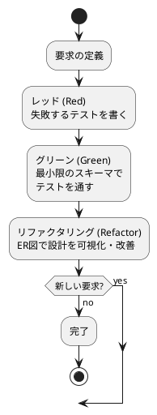
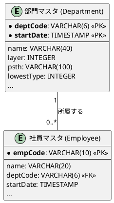

# データモデル設計ガイド

## はじめに

データベース設計は、アプリケーションの基盤となる重要な活動です。このガイドでは、テスト駆動開発（TDD）の原則をデータベース設計に応用し、要求の変化に柔軟に対応できる堅牢なデータモデルを段階的に構築する方法論を説明します。

従来の「最初に完璧なER図を描く」アプローチではなく、小さな要求から始めて徐々にデータモデルを育てていく実践的なアプローチを推奨します。

## TDDデータベース設計の基本原則

### なぜTDDでデータベース設計？

1. **要求が明確になる**: テストという形で、その時点で必要なデータ要求を具体的に定義します
2. **設計がシンプルに保たれる**: 今必要なことだけを実装するため、過剰な設計を防ぎます
3. **変更に強くなる**: テストが既存の要求を守るため、安心してリファクタリング（設計改善）を行えます

### TDDサイクル



## 設計プロセス

### 1. レッド（Red）：要求をテストコードで表現

まず、「どのようなデータを、どのように扱いたいか」を具体的なテストコードで示します。

```typescript
describe("部門マスタ", () => {
  test("部門を登録できる", async () => {
    // 1. テストデータを作成
    await prisma.department.create({ data: departments[0] });
    // 2. 取得したデータが期待通りか検証
    const result = await prisma.department.findMany();
    expect(result).toEqual(departments);
  });

  test("部門を更新できる", async () => {
    const expected = { ...departments[0], name: "更新部署" };
    await prisma.department.update({
      where: { deptCode_startDate: { 
        deptCode: departments[0].deptCode, 
        startDate: departments[0].startDate 
      }},
      data: { name: "更新部署" },
    });
    const result = await prisma.department.findUnique({ 
      where: { deptCode_startDate: { 
        deptCode: departments[0].deptCode, 
        startDate: departments[0].startDate 
      }}
    });
    expect(result).toEqual(expected);
  });
});
```

### 2. グリーン（Green）：最小限のスキーマ定義

テストをパスさせるための最小限のスキーマを定義します。

```prisma
model Department {
  deptCode   String    @map("部門コード") @db.VarChar(6)
  startDate  DateTime  @default(dbgenerated("CURRENT_DATE")) @map("開始日") @db.Timestamp(6)
  endDate    DateTime? @default(dbgenerated("'2100-12-31 00:00:00'::timestamp without time zone")) @map("終了日") @db.Timestamp(6)
  name       String?   @map("部門名") @db.VarChar(40)
  layer      Int       @default(0) @map("組織階層")
  psth       String    @map("部門パス") @db.VarChar(100)
  lowestType Int       @default(0) @map("最下層区分")
  slitYn     Int       @default(1) @map("伝票入力可否")
  createDate DateTime  @default(dbgenerated("CURRENT_DATE")) @map("作成日時") @db.Timestamp(6)
  creator    String?   @map("作成者名") @db.VarChar(12)
  updateDate DateTime  @default(dbgenerated("CURRENT_DATE")) @map("更新日時") @db.Timestamp(6)
  updater    String?   @map("更新者名") @db.VarChar(12)
  
  // 履歴管理のため、部門コードと適用開始日で複合主キー
  @@id([deptCode, startDate], map: "pk_department")
  @@map("部門マスタ")
}
```

### 3. リファクタリング（Refactor）：ER図で設計を可視化・改善

テストがパスした状態で、設計をER図で可視化し、必要に応じて改善します。



## 設計パターンとベストプラクティス

### 1. マスタデータの設計

#### 履歴管理
- 組織変更などで同じコードでも期間が異なるデータを管理する場合は複合主キーを使用
- `{コード, 開始日}`の組み合わせを主キーとする

#### 命名規則
- テーブル名：業務上の意味を表す日本語名
- カラム名：英語名（データベースレベル）と日本語名（アプリケーションレベル）の対応

### 2. トランザクションデータの設計

#### ヘッダ・明細パターン
一回の取引に複数の項目が含まれる場合、ヘッダテーブルと明細テーブルに分離します。

```prisma
model Order {
  orderNo      String        @id @map("受注番号") @db.VarChar(10)
  orderDate    DateTime      @default(dbgenerated("CURRENT_DATE")) @map("受注日")
  custCode     String        @map("顧客コード") @db.VarChar(8)
  orderDetails OrderDetail[]
  @@map("受注データ")
}

model OrderDetail {
  orderNo    String @map("受注番号") @db.VarChar(10)
  soRowNo    Int    @map("受注行番号")
  prodCode   String @map("商品コード") @db.VarChar(16)
  quantity   Int    @default(1) @map("受注数量")
  order      Order  @relation(fields: [orderNo], references: [orderNo])
  
  @@id([orderNo, soRowNo])
  @@map("受注データ明細")
}
```

### 3. リレーションシップの設計

#### パーティモデル
取引先のように複数の役割を持つエンティティは、共通部分（Party）と役割特化部分（Role）に分離します。

```prisma
// 共通情報
model Company {
  compCode  String     @id @map("取引先コード") @db.VarChar(8)
  name      String     @map("取引先名") @db.VarChar(40)
  customers Customer[]
  suppliers Supplier[]
  @@map("取引先マスタ")
}

// 顧客としての役割情報
model Customer {
  custCode   String  @map("顧客コード") @db.VarChar(8)
  custSubNo  Int     @map("顧客枝番")
  arCode     String  @map("請求先コード") @db.VarChar(8)
  company    Company @relation(fields: [custCode], references: [compCode])
  @@id([custCode, custSubNo])
  @@map("顧客マスタ")
}

// 仕入先としての役割情報
model Supplier {
  supCode   String  @map("仕入先コード") @db.VarChar(8)
  supSubNo  Int     @map("仕入先枝番")
  company   Company @relation(fields: [supCode], references: [compCode])
  @@id([supCode, supSubNo])
  @@map("仕入先マスタ")
}
```

## テスト戦略

### 1. マスタデータのテスト

```typescript
describe("マスタデータ", () => {
  beforeAll(async () => {
    // テスト前にデータをクリア
    await prisma.department.deleteMany();
  });

  test("CRUD操作が正常に動作する", async () => {
    // Create
    await prisma.department.create({ data: testData });
    
    // Read
    const result = await prisma.department.findMany();
    expect(result).toEqual([testData]);
    
    // Update
    await prisma.department.update({
      where: { id: testData.id },
      data: { name: "更新後の名前" }
    });
    
    // Delete
    await prisma.department.delete({ where: { id: testData.id } });
    const empty = await prisma.department.findMany();
    expect(empty).toEqual([]);
  });
});
```

### 2. 関連データのテスト

```typescript
describe("関連データ", () => {
  test("関連するデータを一括で取得できる", async () => {
    // 関連するマスタを先に登録
    await prisma.$transaction(async (prisma) => {
      await prisma.department.createMany({ data: departments });
      await prisma.employee.createMany({ data: employees });
    });

    // 関連データを含めて取得
    const result = await prisma.department.findMany({
      include: { employees: true }
    });
    
    expect(result[0].employees).toHaveLength(expectedEmployeeCount);
  });
});
```

## 段階的な発展プロセス

### フェーズ1：基本マスタ
1. 部門・社員
2. 商品・商品分類
3. 取引先（Company, Customer, Supplier）

### フェーズ2：基本トランザクション
1. 受注・受注明細
2. 売上・売上明細

### フェーズ3：調達プロセス
1. 発注・発注明細
2. 仕入・仕入明細
3. 在庫管理

### フェーズ4：財務プロセス
1. 請求・請求明細
2. 入金管理
3. 支払管理

### フェーズ5：補助機能
1. 与信管理
2. 自動採番
3. その他運用支援機能

## 共通設計原則

### 1. 監査証跡の設計

すべてのテーブルに以下のカラムを含めます：

```prisma
createDate DateTime @default(dbgenerated("CURRENT_DATE")) @map("作成日時") @db.Timestamp(6)
creator    String?  @map("作成者名") @db.VarChar(12)
updateDate DateTime @default(dbgenerated("CURRENT_DATE")) @map("更新日時") @db.Timestamp(6)
updater    String?  @map("更新者名") @db.VarChar(12)
```

### 2. 論理削除vs物理削除

- マスタデータ：論理削除（削除フラグ）
- トランザクションデータ：物理削除または履歴保持

### 3. パフォーマンス考慮

- 検索頻度の高いカラムにはインデックスを設定
- 大量データが予想されるテーブルは分割を検討
- 集計用のサマリテーブルを必要に応じて作成

## まとめ

TDDアプローチによるデータベース設計では：

1. **小さく始める**: 完璧な初期設計を目指さず、最小限の要求から開始
2. **テストファースト**: 要求をテストコードで明確に定義
3. **段階的改善**: テストに守られながら継続的にスキーマを改善
4. **可視化**: ER図で設計の全体像を把握
5. **一貫性**: 命名規則や設計パターンを統一

このアプローチにより、変化する要求に柔軟に対応しながら、保守性の高いデータベース設計を実現できます。