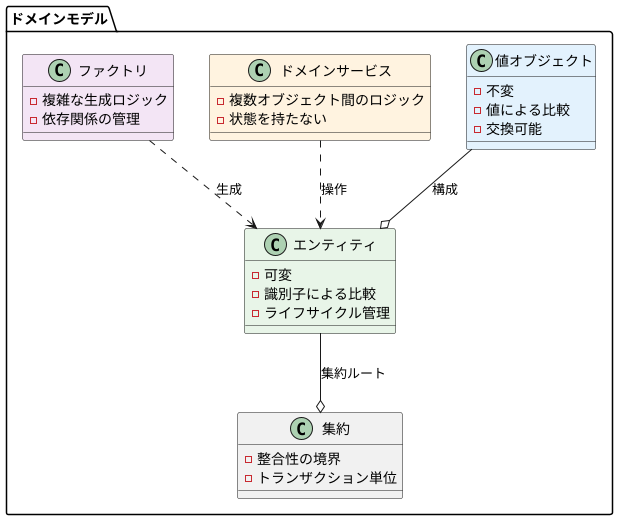
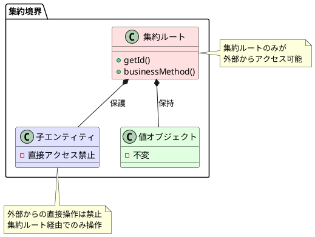
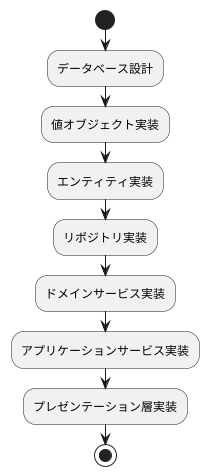
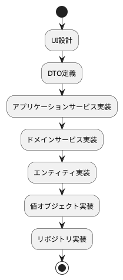

# ドメインモデル設計ガイド

## 概要

ドメインモデル設計は、ビジネスドメインの知識をソフトウェアに表現するための中核的な設計手法です。
ボトムアップアプローチを採用し、小さなパターンから始めて段階的にシステム全体を構築していきます。

## 設計原則

### よいソフトウェアの条件

変更を楽に安全にできて役に立つソフトウェアであること。

### 基本的な設計方針

1. **ビジネスロジックをドメインモデルに集約**
2. **依存関係を適切に管理**
3. **テスタビリティを確保**
4. **小さく始めて段階的に拡張**

## モデリング要素

ドメインモデルの基本構成要素は以下の通りです：



## 値オブジェクト（Value Object）

### 特徴

1. **不変性**: 一度作成されたら状態を変更できない
2. **値による等価性**: 属性が同じなら同じオブジェクト
3. **交換可能**: 値を変更する代わりに別の値オブジェクトに交換

### 実装例

```java
public class FullName {
    private final String familyName;
    private final String firstName;

    public FullName(String familyName, String firstName) {
        if (familyName == null || firstName == null) {
            throw new IllegalArgumentException("名前は必須です");
        }
        this.familyName = familyName;
        this.firstName = firstName;
    }

    public String getFamilyName() {
        return familyName;
    }

    public String getFirstName() {
        return firstName;
    }

    @Override
    public boolean equals(Object obj) {
        if (this == obj) return true;
        if (obj == null || getClass() != obj.getClass()) return false;
        FullName fullName = (FullName) obj;
        return Objects.equals(familyName, fullName.familyName) &&
               Objects.equals(firstName, fullName.firstName);
    }

    @Override
    public int hashCode() {
        return Objects.hash(familyName, firstName);
    }

    @Override
    public String toString() {
        return familyName + " " + firstName;
    }
}
```

### 値オブジェクトの利点

1. **存在しない値を存在させない**: バリデーションロジックの集約
2. **誤った代入を防ぐ**: 型安全性の向上
3. **振る舞いを持つ**: ドメインロジックの表現

### 設計ガイドライン

- **プリミティブ型への過度な依存を避ける**
- **バリデーションはコンストラクタで実装**
- **ビジネスルールを値オブジェクトに集約**

## エンティティ（Entity）

### 特徴

1. **可変性**: ライフサイクル中に状態を変更可能
2. **同一性**: 識別子による区別
3. **継続性**: 属性が変わっても同一のエンティティ

### 実装例

```java
public class User {
    private final UserId id;
    private FullName name;
    private Email email;

    public User(UserId id, FullName name, Email email) {
        this.id = Objects.requireNonNull(id);
        this.name = Objects.requireNonNull(name);
        this.email = Objects.requireNonNull(email);
    }

    public UserId getId() {
        return id;
    }

    public FullName getName() {
        return name;
    }

    public void changeName(FullName name) {
        this.name = Objects.requireNonNull(name);
    }

    public Email getEmail() {
        return email;
    }

    public void changeEmail(Email email) {
        this.email = Objects.requireNonNull(email);
    }

    @Override
    public boolean equals(Object obj) {
        if (this == obj) return true;
        if (obj == null || getClass() != obj.getClass()) return false;
        User user = (User) obj;
        return Objects.equals(id, user.id);
    }

    @Override
    public int hashCode() {
        return Objects.hash(id);
    }
}
```

### 設計ガイドライン

- **識別子は値オブジェクトで実装**
- **等価性比較は識別子のみで行う**
- **状態変更メソッドにはビジネスルールを組み込む**

## ドメインサービス（Domain Service）

### 使用する場面

1. **複数のエンティティに跨るロジック**
2. **エンティティや値オブジェクトに属さないビジネスルール**
3. **計算や変換ロジック**

### 実装例

```java
public class UserService {
    private final UserRepository userRepository;

    public UserService(UserRepository userRepository) {
        this.userRepository = userRepository;
    }

    public boolean isDuplicated(User user) {
        User duplicatedUser = userRepository.findByName(user.getName());
        return duplicatedUser != null && !duplicatedUser.getId().equals(user.getId());
    }

    public boolean canChangeEmail(User user, Email newEmail) {
        User existingUser = userRepository.findByEmail(newEmail);
        return existingUser == null || existingUser.getId().equals(user.getId());
    }
}
```

### 設計ガイドライン

- **状態を持たない**
- **エンティティや値オブジェクトを優先し、必要な場合のみ使用**
- **明確な責任を持つ**

## ファクトリ（Factory）

### 使用する場面

1. **複雑な生成ロジック**
2. **依存関係の注入が必要**
3. **独自の採番システム**

### 実装例

```java
public interface UserFactory {
    User createUser(FullName name, Email email);
}

public class UserFactoryImpl implements UserFactory {
    private final UserIdGenerator idGenerator;

    public UserFactoryImpl(UserIdGenerator idGenerator) {
        this.idGenerator = idGenerator;
    }

    @Override
    public User createUser(FullName name, Email email) {
        UserId id = idGenerator.nextId();
        return new User(id, name, email);
    }
}
```

### 設計ガイドライン

- **複雑な生成ロジックをカプセル化**
- **インターフェースを定義してテスタビリティを確保**
- **リポジトリとファクトリの責任を明確に分離**

## 集約（Aggregate）

### 概念

集約は関連するエンティティと値オブジェクトの集合で、データ変更の単位を表します。



### 集約の設計原則

1. **集約ルートのみが外部インターフェース**
2. **トランザクション境界と一致**
3. **整合性の境界を表現**

### 実装例

```java
public class Circle {
    private final CircleId id;
    private final UserId ownerId;
    private CircleName name;
    private List<UserId> memberIds;
    private static final int MAX_MEMBERS = 30;

    public Circle(CircleId id, UserId ownerId, CircleName name) {
        this.id = Objects.requireNonNull(id);
        this.ownerId = Objects.requireNonNull(ownerId);
        this.name = Objects.requireNonNull(name);
        this.memberIds = new ArrayList<>();
    }

    public void join(User user) {
        if (memberIds.size() >= MAX_MEMBERS) {
            throw new IllegalStateException("サークルの最大人数は" + MAX_MEMBERS + "人です");
        }
        if (memberIds.contains(user.getId())) {
            throw new IllegalStateException("既に参加済みです");
        }
        memberIds.add(user.getId());
    }

    public void leave(UserId userId) {
        if (!memberIds.contains(userId)) {
            throw new IllegalStateException("参加していません");
        }
        memberIds.remove(userId);
    }

    public boolean isMember(UserId userId) {
        return memberIds.contains(userId);
    }

    public int getMemberCount() {
        return memberIds.size();
    }

    public List<UserId> getMemberIds() {
        return new ArrayList<>(memberIds); // 防御的コピー
    }

    // アクセサメソッド
    public CircleId getId() { return id; }
    public UserId getOwnerId() { return ownerId; }
    public CircleName getName() { return name; }
}
```

### 設計ガイドライン

- **小さく保つ**: 必要最小限のエンティティのみ含める
- **整合性境界を明確にする**
- **集約ルート以外への直接アクセスを禁止**

## リポジトリ（Repository）

### 概念

エンティティの永続化を抽象化し、ドメイン層をインフラストラクチャ層から独立させます。

### インターフェース設計

```java
public interface UserRepository {
    User findById(UserId id);
    User findByEmail(Email email);
    List<User> findAll();
    void save(User user);
    void delete(User user);
    UserId nextIdentity(); // オプション: 採番機能
}
```

### 実装ガイドライン

1. **集約毎にリポジトリを作成**
2. **インターフェースはドメイン層に配置**
3. **実装はインフラストラクチャ層に配置**

## アプリケーションサービス

### 責任

1. **ドメインモデルのオーケストレーション**
2. **トランザクション管理**
3. **DTO変換**

### 実装例

```java
@Service
@Transactional
public class UserApplicationService {
    private final UserRepository userRepository;
    private final UserService userService;
    private final UserFactory userFactory;

    public UserApplicationService(
            UserRepository userRepository,
            UserService userService,
            UserFactory userFactory) {
        this.userRepository = userRepository;
        this.userService = userService;
        this.userFactory = userFactory;
    }

    public UserData registerUser(String familyName, String firstName, String email) {
        FullName name = new FullName(familyName, firstName);
        Email emailAddr = new Email(email);
        
        User user = userFactory.createUser(name, emailAddr);
        
        if (userService.isDuplicated(user)) {
            throw new IllegalArgumentException("重複するユーザーです");
        }
        
        userRepository.save(user);
        
        return new UserData(
            user.getId().getValue(),
            user.getName().toString(),
            user.getEmail().getValue()
        );
    }

    public void updateUserName(String userId, String familyName, String firstName) {
        UserId id = new UserId(userId);
        User user = userRepository.findById(id);
        
        if (user == null) {
            throw new IllegalArgumentException("ユーザーが見つかりません");
        }
        
        FullName newName = new FullName(familyName, firstName);
        user.changeName(newName);
        
        userRepository.save(user);
    }
}
```

## テスト戦略

### 単体テストの方針

1. **ドメインモデルの単体テスト**
2. **アプリケーションサービスの統合テスト**
3. **インメモリリポジトリによるテスタビリティ確保**

### テスト実装例

```java
class UserTest {
    @Test
    void 名前を変更できる() {
        // Given
        UserId id = new UserId("user-001");
        FullName originalName = new FullName("田中", "太郎");
        Email email = new Email("tanaka@example.com");
        User user = new User(id, originalName, email);
        
        // When
        FullName newName = new FullName("鈴木", "太郎");
        user.changeName(newName);
        
        // Then
        assertThat(user.getName()).isEqualTo(newName);
    }
    
    @Test
    void 同一性は識別子で判定される() {
        // Given
        UserId id = new UserId("user-001");
        FullName name1 = new FullName("田中", "太郎");
        FullName name2 = new FullName("鈴木", "太郎");
        Email email = new Email("tanaka@example.com");
        
        // When
        User user1 = new User(id, name1, email);
        User user2 = new User(id, name2, email);
        
        // Then
        assertThat(user1).isEqualTo(user2);
    }
}
```

## トランザクション管理

### トランザクション境界

集約がトランザクションの境界となります。

### 実装方法

1. **宣言的トランザクション（推奨）**

```java
@Service
@Transactional
public class CircleApplicationService {
    public void createCircle(String ownerId, String circleName) {
        // 自動的にトランザクション管理される
    }
}
```

2. **プログラマティックトランザクション**

```java
@Service
public class CircleApplicationService {
    private final PlatformTransactionManager transactionManager;
    
    public void createCircle(String ownerId, String circleName) {
        TransactionTemplate template = new TransactionTemplate(transactionManager);
        template.execute(status -> {
            // トランザクション内の処理
            return null;
        });
    }
}
```

## 実装段階とアプローチ

### インサイドアウトアプローチ

データモデルから実装を開始する場合：



### アウトサイドインアプローチ

UIから実装を開始する場合：



## まとめ

### 実装時のチェックリスト

- [ ] 値オブジェクトは不変で適切なバリデーションを持つ
- [ ] エンティティは識別子による等価性比較を行う
- [ ] ドメインサービスは状態を持たない
- [ ] 集約は整合性の境界を適切に表現している
- [ ] リポジトリはインターフェースを定義している
- [ ] アプリケーションサービスにビジネスロジックが漏れていない
- [ ] 適切なトランザクション境界が設定されている
- [ ] テストが充実している

### 次のステップ

このガイドで説明したパターンを習得した後は、以下の学習を推奨します：

1. **戦略的設計**: 境界付けられたコンテキスト、コンテキストマップ
2. **イベント駆動アーキテクチャ**: ドメインイベント、イベントソーシング
3. **CQRS**: コマンドクエリ責任分離
4. **実践的な設計**: レガシーコードの改善、段階的な導入

ドメインモデル設計は継続的な改善が重要です。小さく始めて、フィードバックを得ながら段階的に洗練していくことを心がけてください。