# ユースケース作成ガイド

## はじめに

このガイドは、XPプログラマ向けの実用的なユースケース作成手法を提供します。ユースケースはシステムの振る舞いに関する利害関係者との契約であり、アジャイル開発においても要求を明確化する重要なツールです。

## ユースケースの基本概念

### ユースケースとは

ユースケースは、システムの振る舞いに関する利害関係者間の契約を表現するものです。

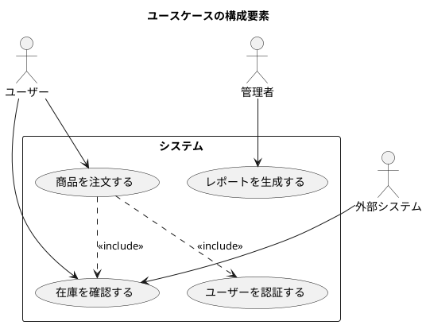

### XPとユースケース

XPのユーザーストーリーとユースケースの関係：

- **ユーザーストーリー**：イテレーション単位の小さな要求
- **ユースケース概要**：ユーザーストーリーをまとめた機能群
- **完全形式ユースケース**：詳細な振る舞いの定義

## 1. ユースケースの3つのレベル

### レベルの階層構造

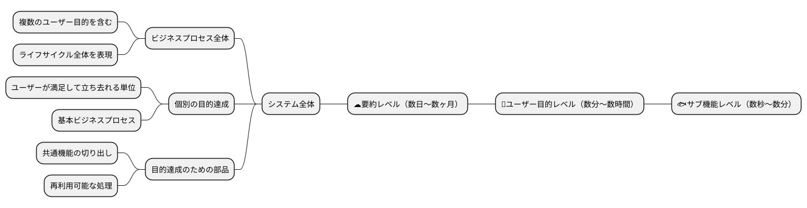

### レベル判定の質問

**ユーザー目的レベルの判定**
- 主アクターはこれを実行した後で満足して立ち去れるか？
- これは1回の作業セッションで完了するか？

**要約レベルの判定**
- 複数のユーザー目的が含まれているか？
- 時間をかけて実行される長いプロセスか？

**サブ機能レベルの判定**
- これだけでは目的が達成されないか？
- 他のユースケースから呼び出される共通処理か？

## 2. スコープの定義

### 設計スコープの種類

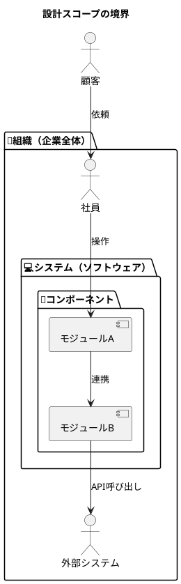

### In/Outリストの作成

スコープを明確にするために、何が範囲内で何が範囲外かを整理：

| トピック | In | Out | 備考 |
|---------|----|----|------|
| ユーザー認証 | ✓ | | システムで実装 |
| 決済処理 | | ✓ | 外部サービス利用 |
| 在庫管理 | ✓ | | コア機能 |
| 配送手配 | | ✓ | 物流会社API |
| レポート生成 | ✓ | | 管理機能 |

## 3. アクターの識別

### アクター分析チェックリスト

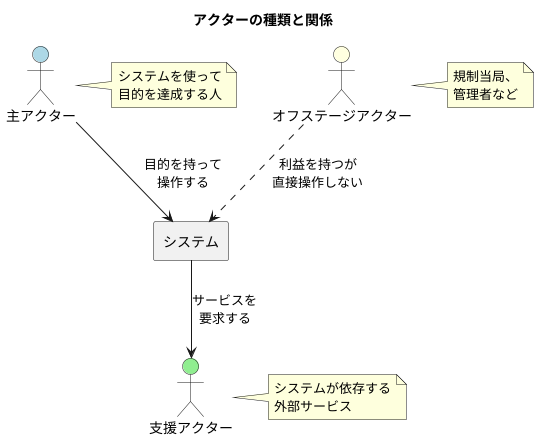

### アクター・目的リスト

優先度付きでアクターの目的を整理：

| アクター | 目的 | レベル | 優先度 | 頻度 |
|---------|------|--------|--------|------|
| 購入者 | 商品を検索する | 🌊 | 高 | 100回/日 |
| 購入者 | 注文する | 🌊 | 高 | 50回/日 |
| 購入者 | 注文履歴を確認する | 🌊 | 中 | 20回/日 |
| 管理者 | 在庫を更新する | 🌊 | 高 | 30回/日 |
| 管理者 | レポートを生成する | ☁️ | 中 | 5回/日 |
| システム | 在庫を自動補充する | 🌊 | 高 | 10回/日 |

## 4. ユースケース記述プロセス

### 段階的詳細化アプローチ

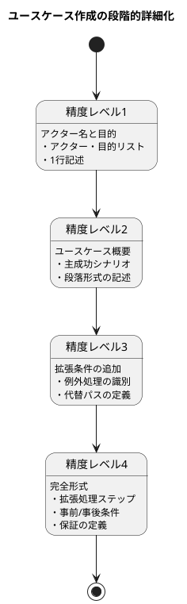

### 12ステップの作成プロセス

1. **システムのスコープと境界を識別**
2. **主アクターの一覧作成**
3. **ユーザー目的の洗い出し**
4. **要約レベルユースケースの作成**
5. **要約レベルの見直しと統合**
6. **詳細化するユースケースの選択**
7. **利害関係者と保証の定義**
8. **主成功シナリオの記述**
9. **例外条件の洗い出し**
10. **拡張処理ステップの記述**
11. **複雑なフローの分割と統合**
12. **全体の整理と見直し**

## 5. ユースケーステンプレート

### 完全形式テンプレート

```markdown
# UC-[番号]: [スコープアイコン][ユースケース名][レベルアイコン]

**コンテキスト**: [一般的に起きる条件や状況の説明]

**スコープ**: [設計対象システム]

**レベル**: [要約/ユーザー目的/サブ機能]

**主アクター**: [目的を持つアクター]

**利害関係者と利益**:

- [利害関係者1]: [その利益]
- [利害関係者2]: [その利益]

**事前条件**: 

- [すでに真であると想定している状態]

**トリガー**: [ユースケースを開始するイベント]

**最低保証**: [失敗時でも守られる利益]

**成功時保証**: [成功時に達成される状態]

**主成功シナリオ**:

1. [アクター]が[アクション]する
2. システムが[処理]する
3. ...

**拡張**:

- 1a. [条件]: 
    - 1a1. [代替処理]
- 2-4a. [いつでも発生する条件]:
    - 2-4a1. [処理]

**技術およびデータのバリエーション**:

- ステップ1: [バリエーション]
```

### 略式テンプレート（XP向け）

```markdown
# [ユースケース名]

**主アクター**: [アクター名]
**スコープ**: [システム名]
**レベル**: [レベル]

[主成功シナリオを段落形式で記述。システムの振る舞いと
アクターの相互作用を自然な文章で表現]

[代替パスや例外処理を段落形式で記述]

**頻度**: [実行頻度]
```

### ユースケース概要（ユーザーストーリー形式）

```markdown
# [機能名]

**として**: [アクター]
**したい**: [目的/機能]
**なぜなら**: [ビジネス価値]

**受入条件**:
- [ ] [条件1]
- [ ] [条件2]
```

## 6. シナリオの書き方

### 良いステップの書き方

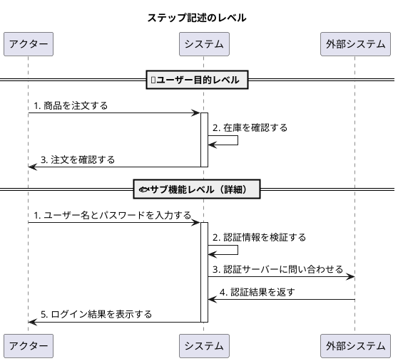

### ステップ記述のガイドライン

**やるべきこと**
- ✅ アクターの意図を表現する
- ✅ 「誰が何をする」を明確にする
- ✅ 成功する目的として記述する
- ✅ 情報の流れを明確にする

**避けるべきこと**
- ❌ UIの詳細を記述する
- ❌ 「チェックする」ではなく「確認する」
- ❌ 実装の詳細に踏み込む
- ❌ IF文を使う（拡張に記載）

### ステップ数の目安

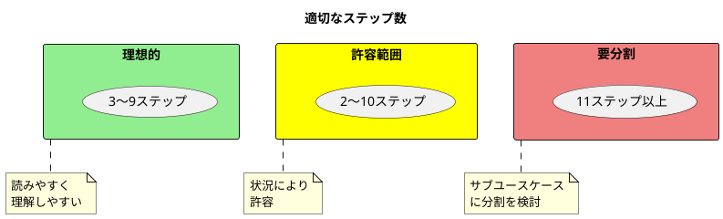

## 7. 拡張の記述

### 拡張条件の識別

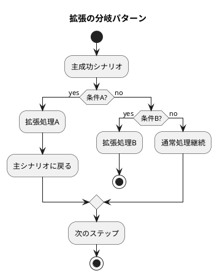

### 拡張の記述形式

```markdown
**主成功シナリオ**:

1. ユーザーが商品を選択する
2. システムが在庫を確認する
3. ユーザーが数量を指定する
4. システムが合計金額を計算する
5. ユーザーが注文を確定する

**拡張**:

- 2a. 在庫がない:
    - 2a1. システムが在庫なしを通知する
    - 2a2. ユーザーが別の商品を選択する（ステップ1へ）

- 3a. 数量が在庫を超える:
    - 3a1. システムが利用可能数量を表示する
    - 3a2. ユーザーが数量を調整する

- *a. ユーザーがキャンセル:
    - *a1. システムがトランザクションを破棄する
    - *a2. 終了
```

## 8. データ記述の精度

### 3段階のデータ精度

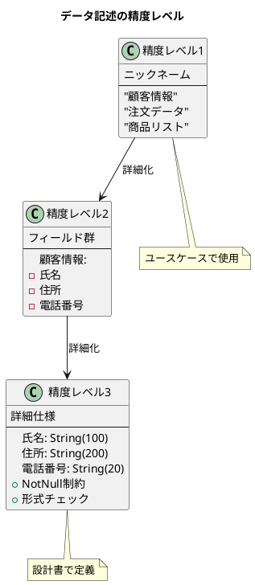

## 9. 品質チェックリスト

### ユースケース全体のチェック項目

| カテゴリ | チェック項目 | ✓ |
|---------|------------|---|
| **タイトル** | 動詞句で目的を表現しているか | □ |
| | システムが達成可能な目的か | □ |
| **スコープ** | 明確に定義されているか | □ |
| | ブラックボックスとして扱っているか | □ |
| **レベル** | 適切なレベルが選択されているか | □ |
| | 内容がレベルと一致しているか | □ |
| **主アクター** | 振る舞いを持っているか | □ |
| | システムへの明確な目的があるか | □ |
| **事前条件** | 必須かつ検証可能か | □ |
| | ユースケース内で再チェックしていないか | □ |
| **保証** | 利害関係者の利益が守られているか | □ |
| | 成功時に目的が達成されるか | □ |
| **シナリオ** | 3〜9ステップに収まっているか | □ |
| | トリガーから保証まで進んでいるか | □ |

### ステップ記述のチェック項目

- □ 成功する目的として表現されているか
- □ アクターが明確か
- □ 意図が明確か
- □ UI設計を含んでいないか
- □ 情報の流れが明確か
- □ 「確認する」を使っているか（「チェックする」ではなく）

## 10. XPプロジェクトでの活用

### ユーザーストーリーとの連携

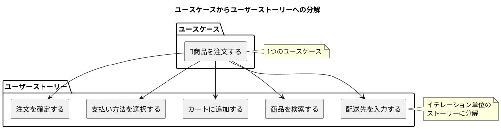

### イテレーション計画での利用

1. **リリース計画時**
   - 要約レベルのユースケースで全体像を把握
   - 大まかな規模見積もり

2. **イテレーション計画時**
   - ユーザー目的レベルをストーリーに分解
   - 詳細な見積もりと優先順位付け

3. **実装時**
   - ユースケースを設計ガイドとして利用
   - 受入テストケースの基準

### ユースケースから機能リストへ

```markdown
## UC-001: 商品を注文する

### 抽出された機能リスト

| ID | 機能 | 優先度 | ストーリーポイント |
|----|------|--------|------------------|
| F1.1 | 商品検索機能 | 必須 | 3 |
| F1.2 | カート追加機能 | 必須 | 2 |
| F1.3 | 在庫確認機能 | 必須 | 3 |
| F1.4 | 配送先入力機能 | 必須 | 2 |
| F1.5 | 支払い処理機能 | 必須 | 5 |
| F1.6 | 注文確認メール送信 | 重要 | 2 |
| F1.7 | 注文履歴保存 | 重要 | 1 |
```

## 11. テストケースへの変換

### ユースケースベースのテスト設計

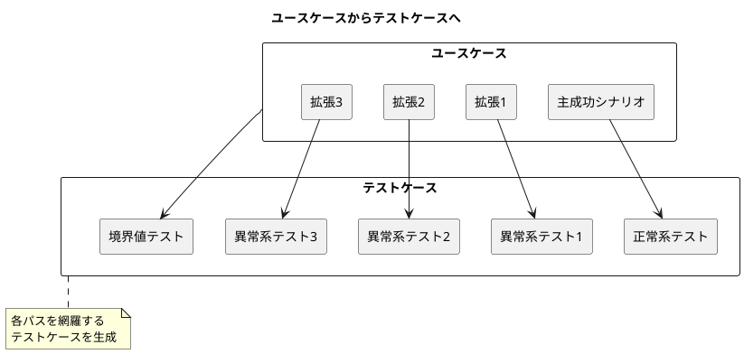

### テストケーステンプレート

```markdown
## テストケース: [ユースケース名]_[パス]

**基になるユースケース**: UC-XXX
**テストパス**: 主成功シナリオ/拡張XX

**事前条件**:
- [システムの初期状態]
- [必要なテストデータ]

**入力**:
1. [入力データ1]
2. [入力データ2]

**期待結果**:
- [期待される出力]
- [期待される状態変化]
- [期待される副作用]

**事後条件**:
- [システムの最終状態]
```

## 12. よくある問題と対策

### 問題パターンと解決策

| 問題 | 症状 | 解決策 |
|------|------|--------|
| スコープ不明確 | 要求が増え続ける | In/Outリスト作成 |
| レベル混在 | ステップが不均一 | レベルアイコン使用 |
| UI記述 | 実装に依存 | 意図の記述に変更 |
| 長すぎる | 10ステップ以上 | サブユースケース分割 |
| 曖昧な記述 | 解釈が複数 | 具体例の追加 |
| 保証なし | 目的が不明 | 利害関係者分析 |

### アンチパターン

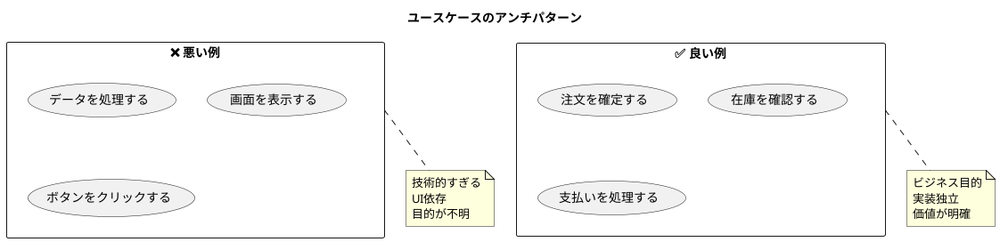

## まとめ

### ユースケース作成の原則

1. **読みやすさ優先**
   - 完璧さより理解しやすさ
   - 自然な言葉で記述

2. **段階的詳細化**
   - 広く浅くから始める
   - 必要に応じて深堀り

3. **適切なレベル選択**
   - ユーザー目的を中心に
   - サブ機能は最小限に

4. **XPとの統合**
   - ユーザーストーリーと連携
   - イテレーション計画で活用
   - テストケースの基準

### クイックリファレンス

**アイコン凡例**
- 🏢 組織スコープ
- 💻 システムスコープ
- 💾 コンポーネントスコープ
- ☁️ 要約レベル
- 🌊 ユーザー目的レベル
- 🐟 サブ機能レベル

**記述の黄金律**
- 3〜9ステップ
- アクターの意図を記述
- UI詳細は書かない
- 成功する目的として表現

このガイドを参考に、プロジェクトに適したユースケースを作成し、XP開発プロセスに統合してください。