# リリース・イテレーション計画ガイド

## はじめに

このガイドは、XPプログラマ向けのリリース計画とイテレーション計画の実用的な作成手法を提供します。アジャイルな見積もりと計画づくりの原則に基づき、現場で即座に活用できる具体的なステップとツールを含んでいます。

## 計画の基本概念

### アジャイルな計画づくりの原則

- **計画よりも計画づくりを重視**：計画は生きた文書として継続的に更新
- **変化を促進**：要件や状況の変化に柔軟に対応
- **フィーチャ中心**：顧客価値を提供するフィーチャを計画の単位に

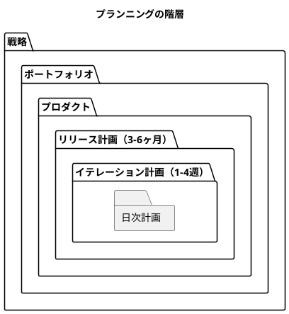

### アジャイルな計画づくりプロセス

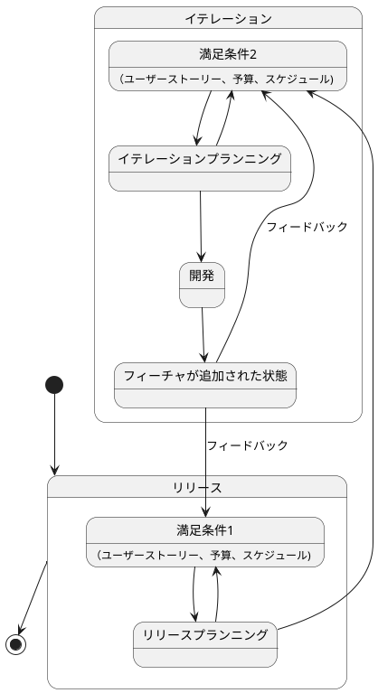

## 1. リリース計画作成プロセス

### 1.1 リリース計画の目的

リリース計画は「いつどれだけの成果が出せるか」を判断することです。

### 1.2 リリース計画作成手順

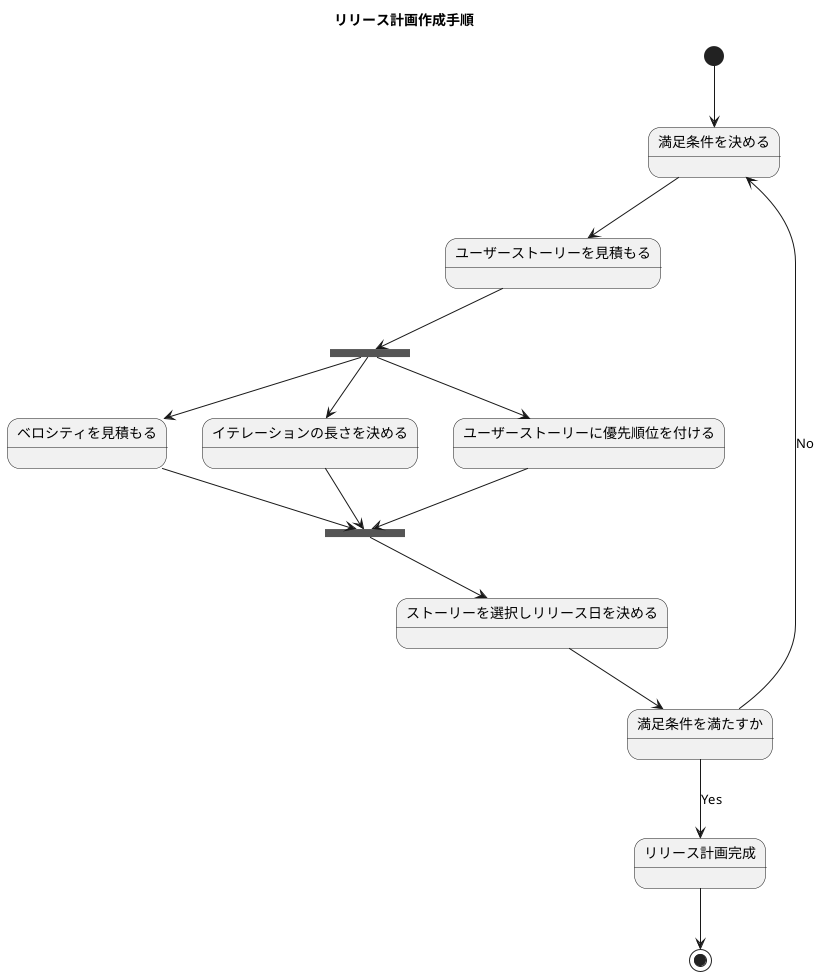

#### ステップ1：満足条件の決定

プロダクトオーナーと協力して以下を定義：

- **スコープ**：どんなフィーチャを含むか
- **スケジュール**：いつまでに完成させるか
- **リソース**：どのようなチーム構成で開発するか

#### ステップ2：ユーザーストーリーの見積もり

**ストーリーポイント法を推奨**

```markdown
# 見積もりスケール例
- 1, 2, 3, 5, 8, 13, 20, 40, 100

# プランニングポーカーの進め方
1. ストーリーを読み上げ、質疑応答
2. 全員が同時にポイントカードを提示
3. 最大値と最小値の人が理由を説明
4. 合意に至るまで議論・再見積もり
```

#### ステップ3：ベロシティの見積もり

**新チームの場合**
- 代表的なストーリーをタスクに分解
- 理想時間で見積もり
- チームの作業可能時間（1日4-6時間）と照合

**既存チームの場合**
- 過去3-8イテレーションの平均値を使用
- 以下が同じであることを確認：
  - 技術スタック
  - チームメンバー
  - 業務分野
  - 開発環境

#### ステップ4：優先順位の決定

**4つの評価軸**

1. **金銭価値**：新規売上、効率化効果
2. **コスト**：開発・運用・サポートコスト
3. **知識習得**：プロダクトナレッジ・プロジェクトナレッジ
4. **リスク軽減**：技術的・ビジネス的リスクの低減

### 1.3 リリース計画の更新

- 各イテレーション開始時に見直し
- ベロシティの実績値で調整
- スコープ変更の反映

## 2. イテレーション計画作成プロセス

### 2.1 リリース計画との違い

|項目|リリース計画|イテレーション計画|
|---|---|---|
|対象期間|3-6ヶ月|1-4週間|
|構成要素|ユーザーストーリー|タスク|
|見積単位|ストーリーポイント/理想日|理想時間|

### 2.2 イテレーション計画作成手順

#### コミットメント駆動方式（推奨）

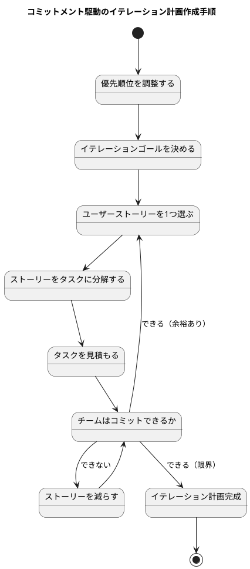

#### ステップ1：イテレーションゴールの設定

- 1-2行でイテレーションで達成することを記述
- チーム全員が理解できる明確な目標
- フィーチャの価値に焦点を当てる

#### ステップ2：ストーリーのタスク分解

**良いタスクの特徴**
- 4-16理想時間で完了可能
- 具体的で実行可能
- 測定可能（完了/未完了が判断可能）

**タスクの種類**
- 開発タスク（設計、実装、単体テスト）
- 統合タスク（システム統合、統合テスト）
- その他（ドキュメント作成、環境構築）
- スパイク（調査・検証タスク）

#### ステップ3：理想時間での見積もり

```markdown
# 理想時間の原則
- 割り込みや会議を除いた純粋な作業時間
- 個人差は考慮しない（チーム平均で考える）
- 1つの値で見積もる（幅を持たせない）

# 見積もりのガイドライン
- 1-2時間：简单な修正、設定変更
- 4-8時間：標準的な機能実装
- 12-16時間：複雑な機能、新技術の習得を伴う
```

### 2.3 イテレーションの実行

#### デイリースタンドアップ

毎日の進捗確認で以下を共有：
- 昨日やったこと
- 今日やること  
- 障害・ブロッカー

#### タスクボードの活用

```markdown
# タスクボード構成
| TODO | 作業中 | レビュー | 完了 |
|------|--------|----------|------|
| タスク1 | タスク2 | タスク3 | タスク4 |
```

## 3. 見積もりのベストプラクティス

### 3.1 ストーリーポイント vs 理想日

**ストーリーポイントの利点**
- 純粋な規模の見積もり
- チームスキル向上による再見積もりが不要
- チーム横断での比較が可能
- 相対見積もりで精度が高い

**理想日の利点**
- 初心者に理解しやすい
- 時間感覚との対応が直感的

### 3.2 見積もり精度の向上

**不確実性コーンの活用**

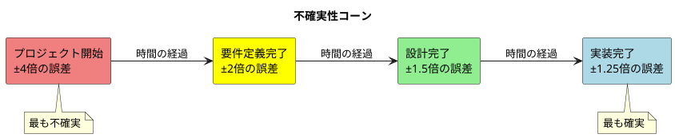

**見積もりの改善方法**
- 過去の実績データを蓄積
- 見積もりと実績の差分を分析
- チームで見積もり基準を統一

### 3.3 再見積もりのタイミング

以下の場合に再見積もりを実施：
- ストーリーの相対的な大きさが変わった
- 新しい技術・業務知識を習得した
- チーム構成が大きく変わった

**注意**：進捗の遅れのみでは再見積もりしない

## 4. 進捗管理とモニタリング

### 4.0 全体スケジュール管理

**リリース全体のガントチャート**

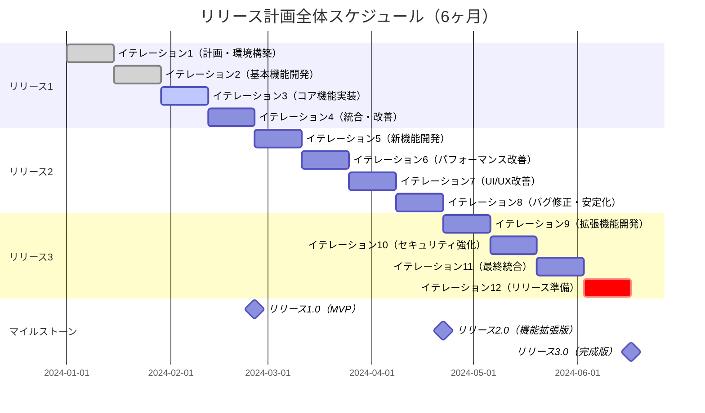

**イテレーション内のストーリー進捗ガントチャート**

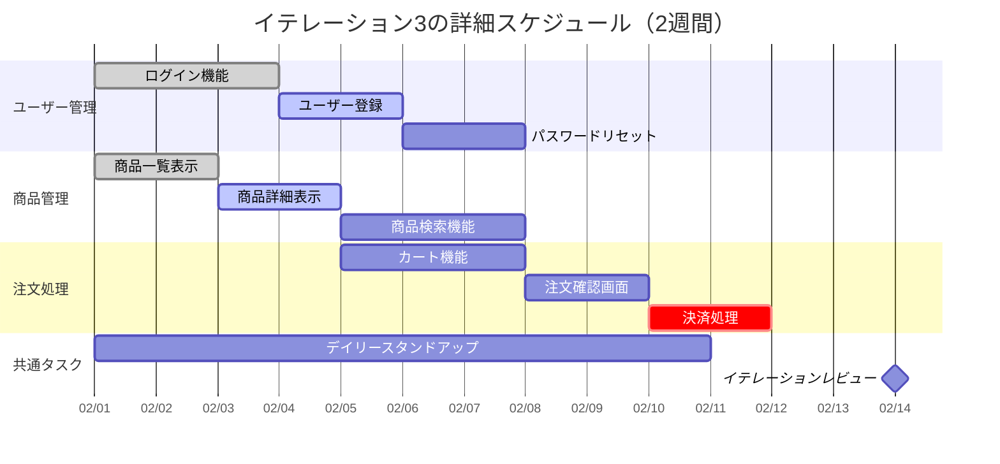

### 4.1 ベロシティの計算

**オール・オア・ナッシング方式**
- 完全に完了したストーリーのみポイント加算
- 未完了ストーリーはゼロポイント

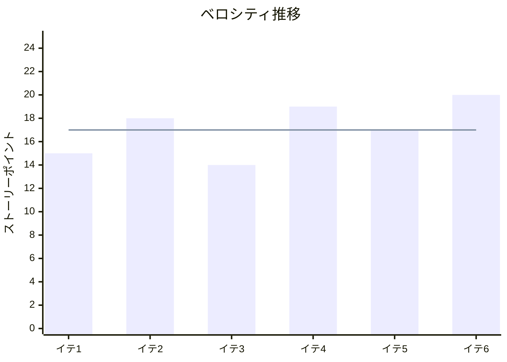

### 4.2 バーンダウンチャート

**リリースバーンダウンチャート**

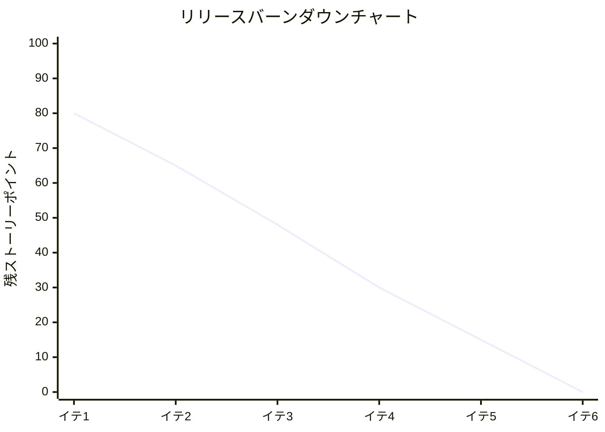

**イテレーションバーンダウンチャート**

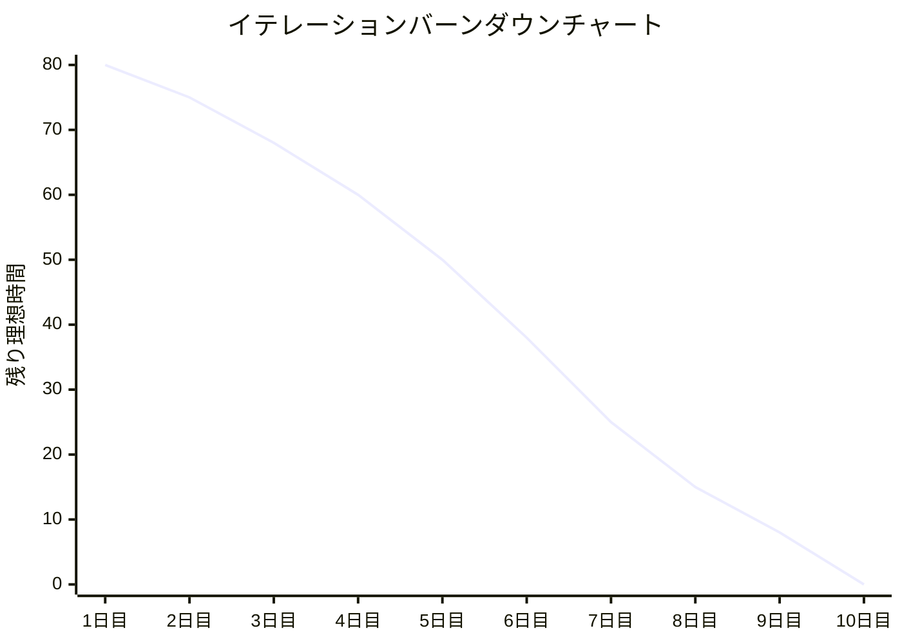

### 4.3 パーキングロットチャート

テーマ単位での進捗可視化

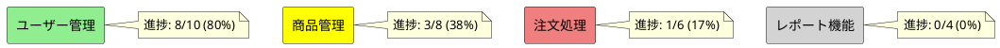

## 5. リスクマネジメント

### 5.1 バッファ計画

**フィーチャバッファ**
- 重要度の低いフィーチャを30%程度用意
- スケジュール遅延時に削除対象とする

**スケジュールバッファ**
- 各ストーリーの50%見積もりと90%見積もりの差の平方の合計の平方根
- 不確実性に対するスケジュール的余裕

### 5.2 複数チーム間の調整

**共通見積もり基準の確立**
- 全チーム共通のストーリーポイントスケール
- 基準ストーリーの共有と合意

**移動する先読み範囲**
- 今後2-3イテレーションの計画を事前共有
- チーム間の依存関係を早期に特定

## 6. コミュニケーション

### 6.1 ステークホルダーへの報告

**3つのベロシティ値で予測**
- 直近イテレーション：最新状況
- 平均：長期トレンド  
- ワースト3平均：最悪ケース

### 6.2 イテレーション終了報告

```markdown
# イテレーション終了報告テンプレート

## 基本情報
- イテレーション: 第X回
- 期間: YYYY/MM/DD - YYYY/MM/DD  
- 作業日数: X日

## 成果
| ストーリー | 状態 | ポイント |
|-----------|------|----------|
| ストーリーA | 完了 | 5 |
| ストーリーB | 完了 | 3 |
| ストーリーC | 未完了 | 0 |

## 指標
- 今回ベロシティ: Xポイント
- 平均ベロシティ: Yポイント
- 次イテレーション予定: Zポイント

## ふりかえり
### よかったこと
- ...

### 改善点  
- ...

### アクション
- ...
```

## 7. チェックリスト

### リリース計画チェックリスト

- [ ] プロダクトオーナーの満足条件が明確
- [ ] 全ストーリーにストーリーポイントを設定
- [ ] 優先順位が明確（価値・コスト・知識・リスクで評価）
- [ ] ベロシティ見積もりが妥当（過去実績または詳細見積もりベース）
- [ ] リスクバッファを考慮
- [ ] 各イテレーションの目標が明確

### イテレーション計画チェックリスト

- [ ] イテレーションゴールが1-2行で表現
- [ ] 全ストーリーをタスクに分解
- [ ] 各タスクが4-16理想時間
- [ ] チーム全員がコミット
- [ ] タスクボードを準備
- [ ] デイリースタンドアップの時間を設定

### 見積もりチェックリスト

- [ ] 相対見積もりを実施（プランニングポーカーなど）
- [ ] 見積もりスケールを統一
- [ ] 全員参加で見積もり
- [ ] 見積もり根拠を共有
- [ ] 不確実性を考慮した幅を設定

## まとめ

このガイドに従うことで、XPチームは効果的なリリース計画とイテレーション計画を作成できます。重要なのは：

1. **継続的な改善**：計画は生きた文書として更新し続ける
2. **チーム全体での合意**：見積もりと計画をチーム全員で作成
3. **価値志向**：顧客価値を最大化する優先順位付け
4. **透明性**：進捗と課題を常にオープンに共有

定期的にこのガイドを見直し、チームの状況に合わせてカスタマイズしてください。