# 要件定義ガイド - RDRAワークフロー解説

## 概要

本ガイドでは、リレーションシップ駆動要件分析(RDRA)を使った要件定義のワークフローを解説します。RDRAは決められたアイコンを使い、アイコンとアイコン、アイコンと図を関連づけ、アイコンで表現されたモデル要素と関連のつながりから要件を説明する軽量な要件分析フレームワークです。

## RDRA用語解説

### 基本概念

- **RDRA（リレーションシップ駆動要件分析）**: Relationship Driven Requirements Analysisの略。決められたアイコンとモデル要素の関連から要件を説明する手法
- **モデル要素**: RDRAで定義された各種のアイコン（アクター、ユースケース、情報など）
- **関連（リレーションシップ）**: モデル要素同士を結ぶ線や矢印で表現される関係性
- **トレーサビリティ**: 要件の追跡可能性。上位の要求から下位の実装まで関連を追えること

### システム構成要素

- **システム価値**: システムが提供する価値を定義する領域
- **システム外部環境**: システムを取り巻く業務や環境を定義する領域  
- **システム境界**: システムとユーザー・外部システムとの接点を定義する領域
- **システム**: システム内部の情報構造と状態を定義する領域

### アクター・主体

- **アクター**: システムと関わる人や外部システム。利用者、管理者、外部システムなど
- **利用者**: システムを直接使用する人
- **関係者（ステークホルダー）**: システムに関わる全ての人や組織
- **外部システム**: 連携対象となる他のシステムやサービス

### 業務・プロセス

- **業務**: 組織が行う一連の活動や作業
- **ビジネスユースケース（BUC）**: 業務を構成する具体的な作業単位
- **アクティビティ**: BUCを構成するより詳細な作業項目
- **業務フロー**: アクティビティの時系列での流れ
- **利用シーン**: システムが利用される具体的な場面や状況

### 要件・仕様

- **要求**: ステークホルダーが システムに対して望むこと
- **要件**: 要求を実現するためにシステムが満たすべき条件
- **ユースケース（UC）**: システムが提供する機能の単位
- **機能要件**: システムが実現すべき機能に関する要件
- **非機能要件**: 性能、セキュリティ、運用性などシステム品質に関する要件

### システム境界要素

- **画面**: ユーザーとのインターフェースを表す境界要素
- **帳票**: 出力される文書や報告書
- **イベント**: 外部システムとのデータ交換のきっかけ
- **プロトコル**: システム間の通信手順や規約

### 内部構造要素

- **情報（エンティティ）**: システムが管理するデータの単位
- **状態**: 情報が取りうる状況や段階
- **状態遷移**: ある状態から別の状態への変化
- **関連**: 情報同士の関係性（1対1、1対多、多対多など）

### 条件・制約

- **バリエーション**: ビジネス上重要な区分や種別（顧客種別、商品分類など）
- **条件**: システムの動作を決定する判定基準
- **ビジネスルール**: 業務上守るべき規則や制約
- **制約**: システムが満たすべき技術的・業務的な制限事項

### 作業プロセス用語

- **洗い出し**: 必要な要素を網羅的に抽出する作業
- **関係づけ**: 要素間の関連を明確にする作業  
- **精緻化**: 粗い定義をより詳細で正確にしていく作業
- **整合性**: 各要素・図の間で矛盾がないこと
- **網羅性**: 必要な要素が漏れなく定義されていること
- **表現力**: 関係者が理解しやすく表現されていること

## RDRAの全体構造

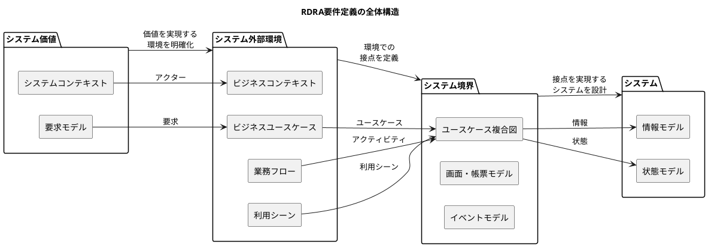

## 要件定義の3フェーズアプローチ

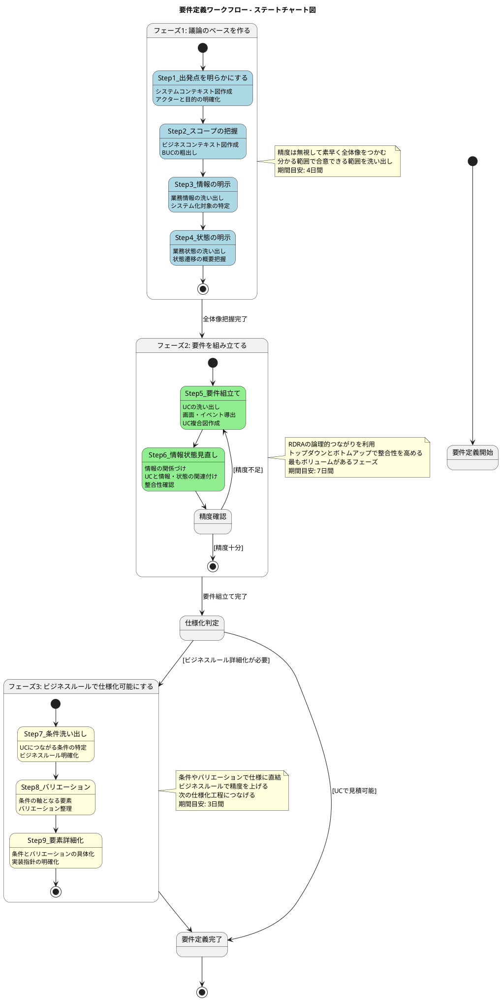

## 9ステップ詳細ワークフロー

### フェーズ1: 議論のベースを作る

#### Step1: 出発点を明らかにする

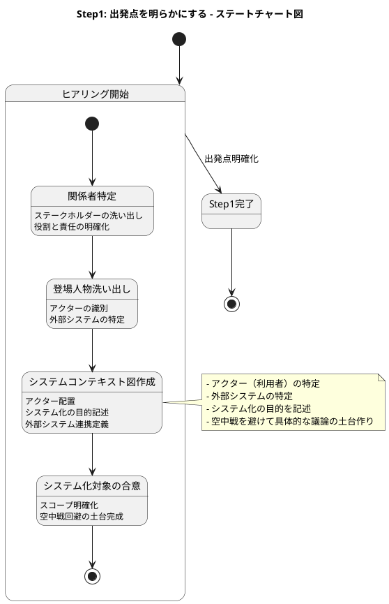

#### Step2: スコープの把握

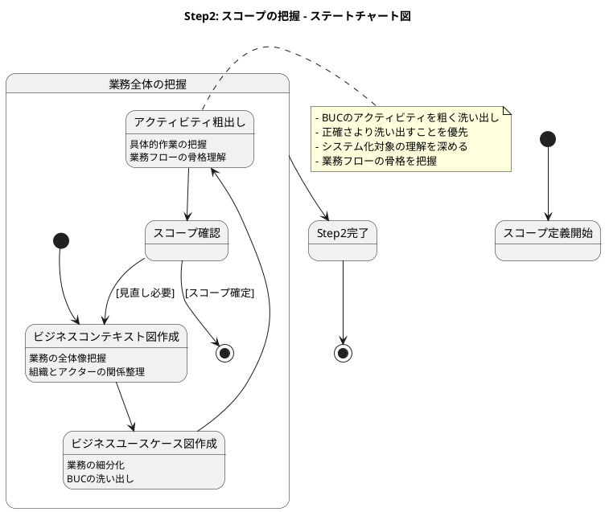

#### Step3: システムで扱う情報の明示

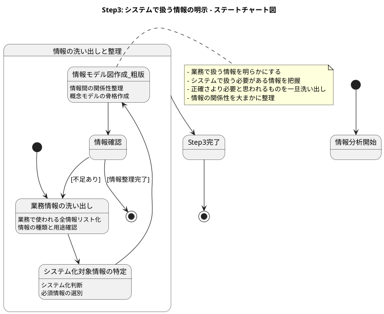

#### Step4: システムで管理する状態の明示

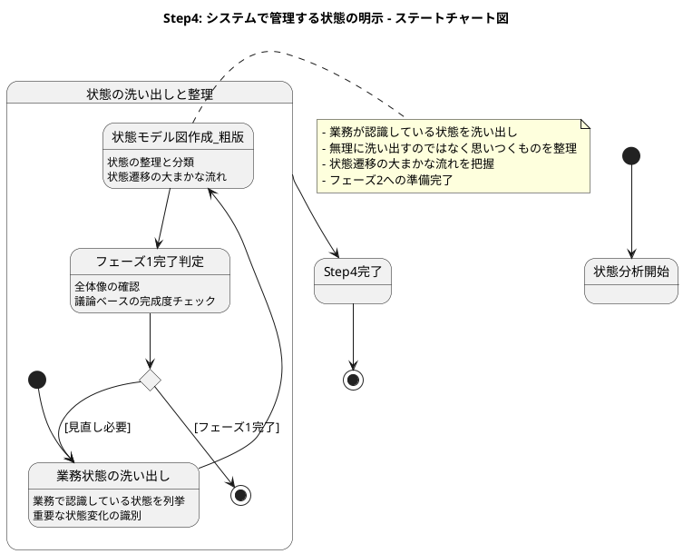

### フェーズ2: 要件を組み立てる

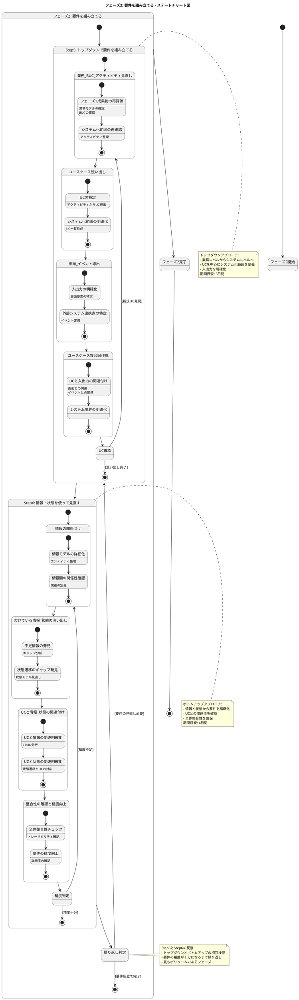

### フェーズ3: ビジネスルールで仕様化可能にする

#### Step7-9: ビジネスルール詳細化

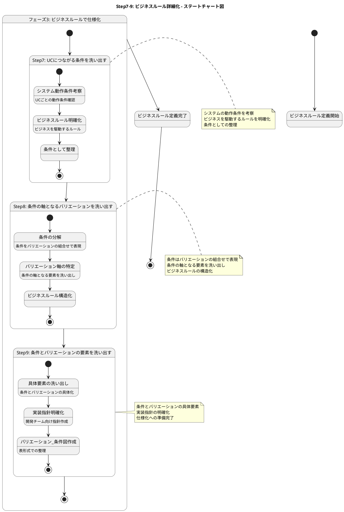

## 各図の作成順序とトレーサビリティ

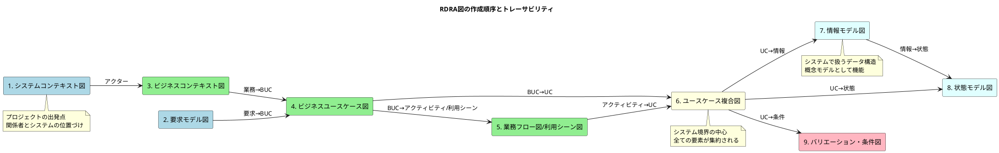

## 期間配分と工数の目安

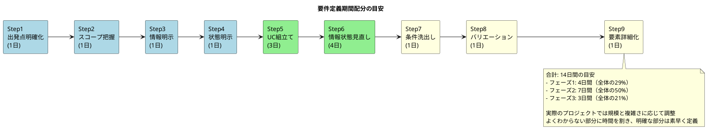

## PlantUMLでのRDRA図作成ガイド

### アイコン対応表

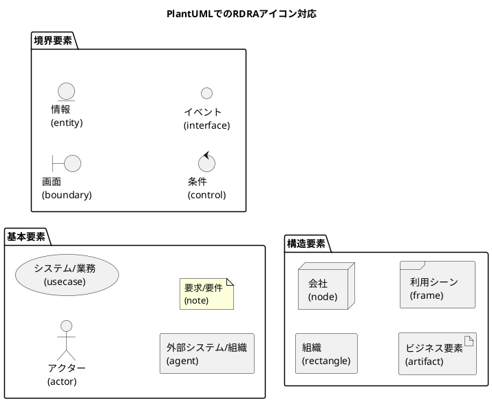

### PlantUMLテンプレート例

#### システムコンテキスト図

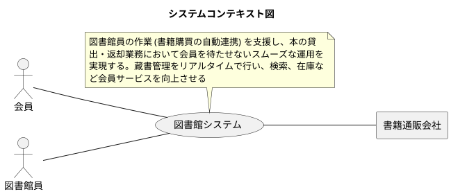

#### 要求モデル図

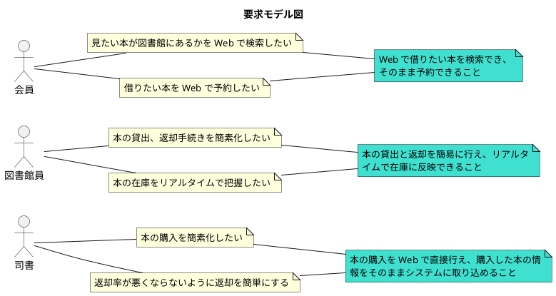

#### ビジネスコンテキスト図

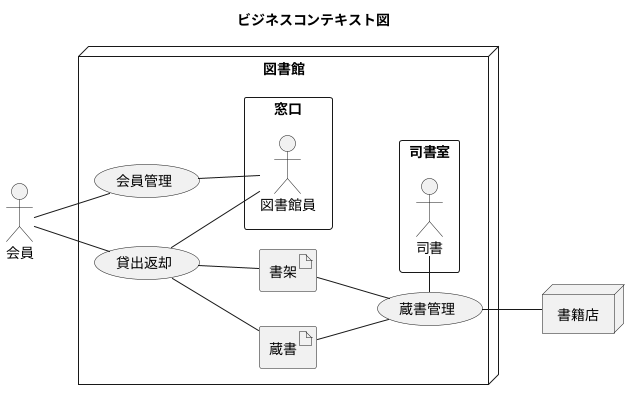

#### ビジネスユースケース図

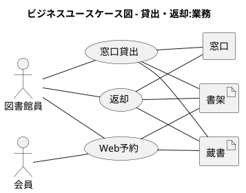

#### 業務フロー図

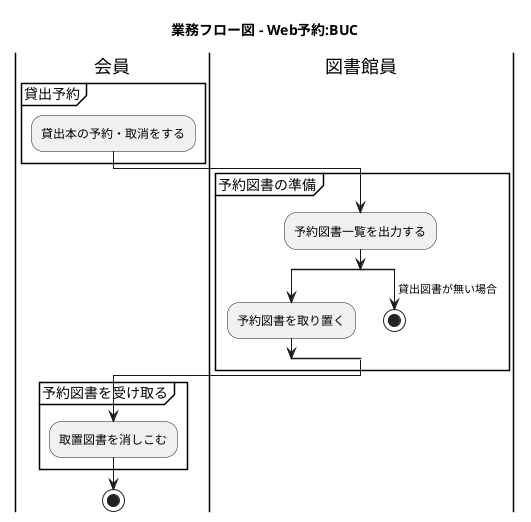

#### 利用シーン図

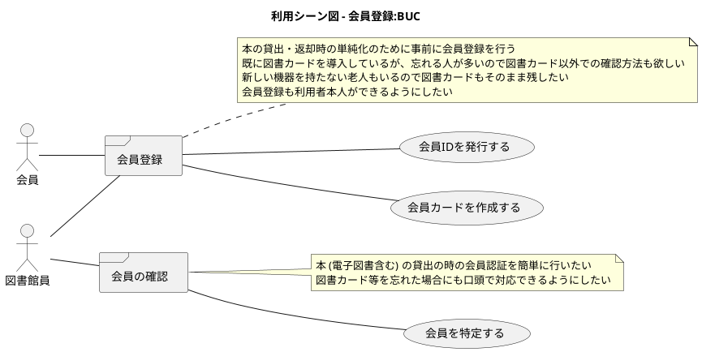

#### ユースケース複合図

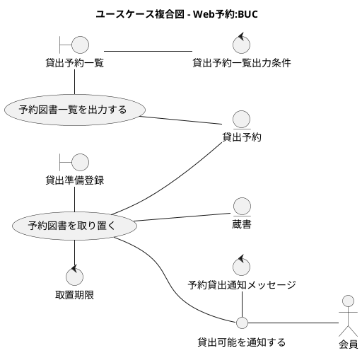

#### ユースケース複合図 + 業務フロー

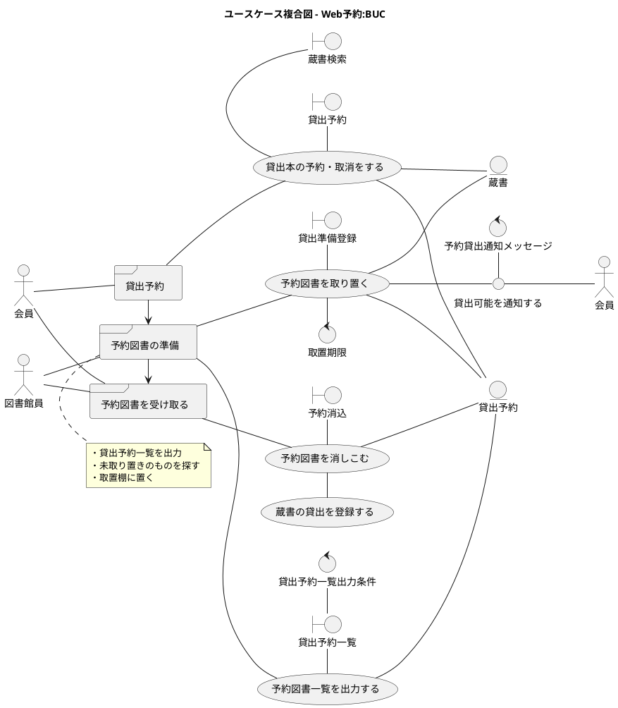

#### ユースケース複合図 + 利用シーン

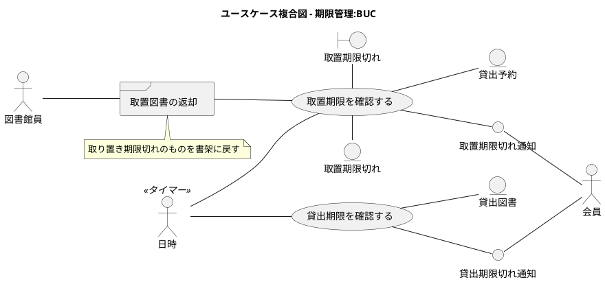

#### 情報モデル図

```plantuml
@startuml

title 情報モデル図

left to right direction

entity 会員

entity 本
entity 蔵書
entity 書架

entity 貸出予約
entity 貸出図書

entity 書籍発注

会員 -- 貸出予約
貸出予約 -- 本

会員 -- 貸出図書
貸出図書 -- 本

本 - 蔵書
蔵書 - 書架

本 -- 書籍発注

@enduml
```

#### 状態モデル図

```plantuml
@startuml

title 状態モデル図 - Web予約:情報

/'
usecase 貸出本を予約する
usecase 貸出本を予約取消する
usecase 予約図書を取り置く
usecase 取置期限を確認する
usecase 取置図書を消しこむ
'/

state 未予約

state 予約中 {
  state 未準備
  state 準備完了
}

[*] --> 未予約
未予約 --> [*]

未予約 --> 未準備: (貸出本を予約する)
予約中 --> 未予約: (貸出本を予約取消する)

未準備 --> 準備完了: (予約図書を取り置く)

準備完了 --> 準備完了: (取置期限を確認する)\n[取置期限 >= 今]
準備完了 --> 未予約: (取置期限を確認する)\n[取置期限 < 今]

準備完了 --> 未予約: (取置図書を消しこむ)

@enduml
```

## まとめ

RDRAを使った要件定義は以下の特徴があります：

1. **段階的洗練**: 3フェーズで徐々に精度を上げる
2. **網羅性**: システム価値から段階的に要素を導出
3. **整合性**: 図間の関連性で整合性を保証
4. **表現力**: 視覚的なダイアグラムで共通理解を促進
5. **トレーサビリティ**: 全ての要素が関連づけられている

このワークフローに従うことで、短時間で精度の高い要件定義が可能になります。PlantUMLを活用することで、テキストベースでの管理とバージョン管理が容易になり、チーム開発にも適用しやすくなります。

## 参考文献

- [RDRA2.0 ハンドブック](https://www.amazon.co.jp/RDRA2-0-ハンドブック-軽く柔軟で精度の高い要件定義のモデリング手法-神崎善司-ebook/dp/B07STQZFBX)
- PlantUML公式サイト: https://plantuml.com/ja/