# 運用要件定義ガイド

## 運用要件の概要

運用要件とは、システムが本番環境で稼働する際に必要となる要件のことです。これには監視、バックアップ、セキュリティ、運用手順などが含まれます。よいソフトウェアを実現するために、開発段階から運用性を考慮した設計・実装が重要です。

## 運用要件の種類

### 監視要件

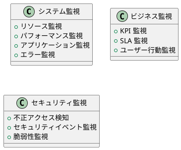

#### システム監視
- **リソース監視**: CPU、メモリ、ディスク、ネットワーク使用率
- **パフォーマンス監視**: レスポンス時間、スループット
- **可用性監視**: サービス稼働状況、ヘルスチェック
- **エラー監視**: アプリケーションエラー、システムエラー

#### ビジネス監視
- **KPI 監視**: ビジネス重要指標の追跡
- **SLA 監視**: サービスレベル合意の監視
- **ユーザー行動監視**: アクセスパターン、利用状況

#### セキュリティ監視
- **不正アクセス検知**: 異常なアクセスパターンの検知
- **セキュリティイベント監視**: セキュリティ関連ログの監視
- **脆弱性監視**: セキュリティリスクの継続的監視

### バックアップ・リカバリ要件

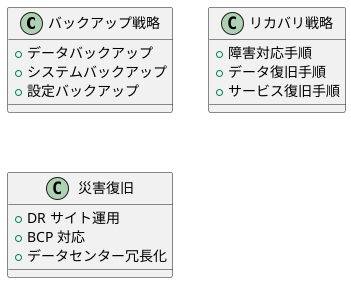

#### バックアップ要件
- **バックアップ頻度**: 日次、週次、月次バックアップ
- **保存期間**: データ保持ポリシーに基づく保存期間
- **バックアップ範囲**: データベース、ファイル、システム設定
- **バックアップ検証**: 定期的なリストアテスト

#### リカバリ要件
- **RTO (Recovery Time Objective)**: 復旧時間目標
- **RPO (Recovery Point Objective)**: 復旧ポイント目標  
- **リカバリ手順**: 段階的な復旧プロセス
- **データ整合性**: リカバリ後のデータ一貫性確保

### セキュリティ運用要件

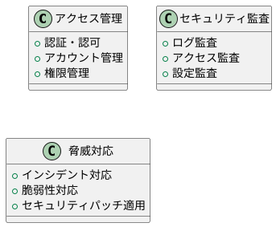

#### アクセス管理
- **認証システム**: 多要素認証、SSO 連携
- **アカウント管理**: ユーザーライフサイクル管理
- **権限管理**: 最小権限の原則、定期的な権限見直し

#### セキュリティ監査
- **アクセスログ**: すべてのアクセスの記録・監査
- **操作ログ**: 重要な操作の追跡可能性
- **設定変更**: システム設定変更の記録・承認

#### 脅威対応
- **インシデント対応**: セキュリティ事故対応手順
- **脆弱性管理**: 定期的な脆弱性スキャン・対応
- **パッチ管理**: セキュリティパッチの計画的適用

### 運用手順・保守要件

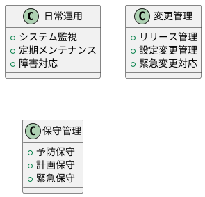

#### 日常運用
- **監視体制**: 24時間365日監視体制
- **アラート対応**: 重要度に応じたエスカレーション
- **定期点検**: システム稼働状況の定期確認

#### 変更管理
- **リリース手順**: 本番リリースの標準手順
- **ロールバック手順**: 問題発生時の切り戻し手順
- **変更承認**: 変更に対する承認プロセス

#### 保守管理
- **メンテナンス計画**: 計画的なシステムメンテナンス
- **容量管理**: リソース使用量の監視・拡張計画
- **ライフサイクル管理**: システム更改・廃止計画

## 運用要件定義のプロセス

### 1. 現状分析

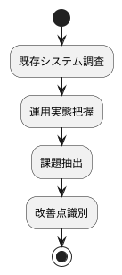

- **既存運用**: 現在の運用手順・体制の調査
- **課題識別**: 運用上の問題点・改善点の抽出
- **ベンチマーク**: 他システム・業界標準との比較

### 2. 要件定義

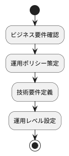

- **サービスレベル定義**: SLA、SLO、SLI の設定
- **運用ポリシー**: セキュリティ、バックアップ等のポリシー
- **技術要件**: 監視ツール、運用ツールの要件

### 3. 運用設計

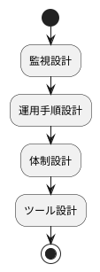

- **監視設計**: 監視項目・閾値・アラート設計
- **手順書作成**: 運用手順書・障害対応手順書
- **体制設計**: 運用体制・役割分担・エスカレーション

### 4. 運用準備

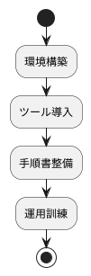

- **環境準備**: 監視環境・運用ツール環境構築
- **手順書整備**: 運用手順書・マニュアル作成
- **運用訓練**: 障害対応訓練・手順確認

## 運用要件の品質基準

### SMART 原則

運用要件は SMART 原則に従って定義します：

- **Specific (具体的)**: 曖昧さのない明確な要件
- **Measurable (測定可能)**: 数値で測定可能な要件  
- **Achievable (達成可能)**: 現実的に達成可能な要件
- **Relevant (関連性)**: ビジネス目標に関連した要件
- **Time-bound (期限)**: 明確な期限・頻度を持つ要件

### サービスレベル定義

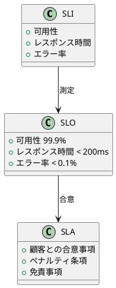

#### SLI (Service Level Indicator)
- **可用性**: システム稼働率
- **レスポンス時間**: API・画面応答時間
- **エラー率**: エラー発生率

#### SLO (Service Level Objective)  
- **目標設定**: 具体的な数値目標
- **測定期間**: 月次・四半期・年次
- **エラーバジェット**: 許容エラー範囲

#### SLA (Service Level Agreement)
- **顧客合意**: サービス提供の合意事項
- **補償条項**: SLA 未達成時の対応
- **免責条項**: 責任範囲の明確化

## 運用要件のベストプラクティス

### 1. 運用性を考慮した設計

- **Observability**: システムの内部状態を外部から観測可能に
- **Graceful Degradation**: 段階的な機能縮退
- **Circuit Breaker**: 障害の連鎖防止機能
- **Health Check**: システム状態確認機能

### 2. 自動化の推進

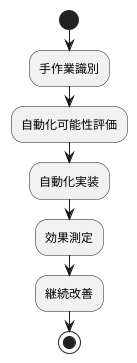

- **デプロイ自動化**: CI/CD パイプライン構築
- **監視自動化**: 自動アラート・自動復旧
- **テスト自動化**: 運用テストの自動実行

### 3. インシデント管理

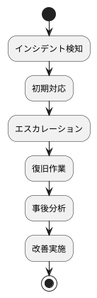

- **早期検知**: 監視による迅速な問題発見
- **迅速対応**: 明確な対応手順・体制
- **学習文化**: ポストモーテムによる継続改善

### 4. セキュリティファースト

- **Zero Trust**: すべてのアクセスを検証
- **最小権限**: 必要最小限の権限付与
- **多層防御**: 複数のセキュリティ対策
- **継続監視**: 24時間体制のセキュリティ監視

## 運用要件の管理・改善

### 継続的改善

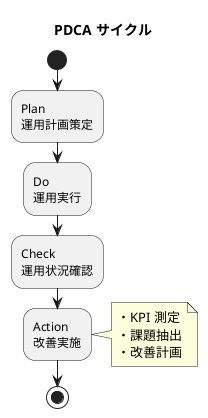

- **定期レビュー**: 運用状況・課題の定期確認
- **KPI 測定**: 運用効率・品質指標の測定
- **改善計画**: 継続的な運用改善

### ドキュメント管理

- **手順書更新**: 最新状態の維持・版数管理
- **知識共有**: 運用ナレッジの組織内共有
- **教育・訓練**: 運用スキルの継続的向上

## まとめ

運用要件は、システムの長期的な成功に直結する重要な要件です。開発初期から運用性を考慮し、継続的に改善していくことで、「変更を楽に安全にできて役に立つソフトウェア」の実現が可能になります。

よいソフトウェアを作るためには、機能要件と同等に運用要件を重視し、開発・運用が一体となって取り組むことが重要です。