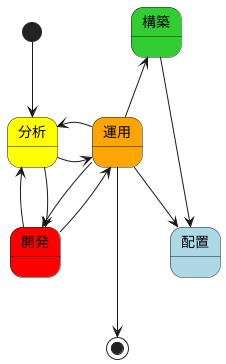
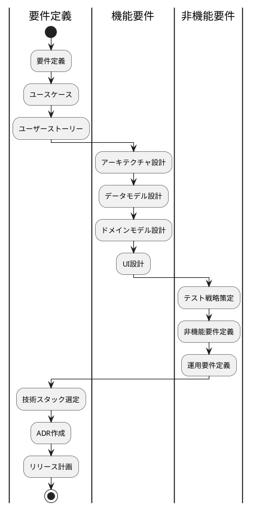
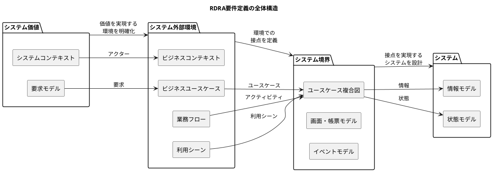
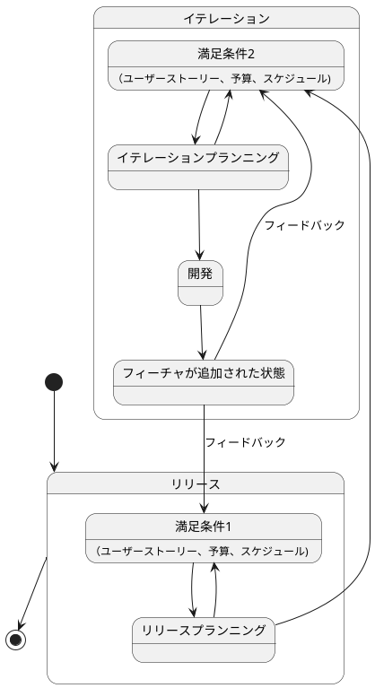
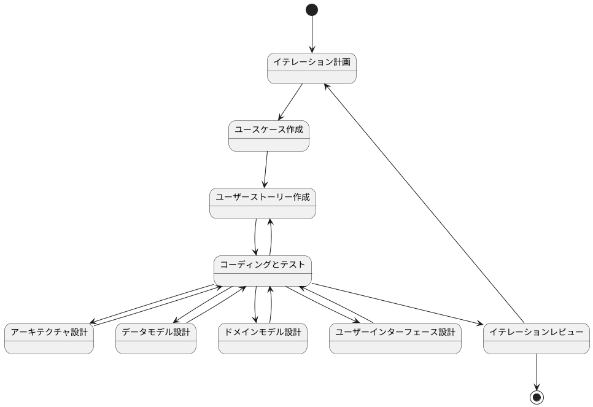
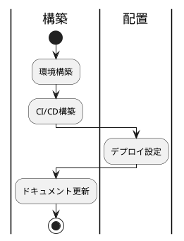

# 開発ガイド

## 開発ライフサイクル

分析では、アプリケーションの機能や性能、品質、セキュリティ、運用、保守などの要件をまとめる活動を行います。
開発では要件を満たすための設計、実装、テストなどの活動を行います。
運用では、アプリケーションの運用、保守、改善などの活動を行います。
構築では、アプリケーションの環境設定を行います。
配置では、アプリケーションのビルドとデプロイを行います。
これらの活動は相互に影響し合い、連携して行われるため、それぞれの活動において、開発者が守るべき規則やガイドラインをまとめたドキュメントを参照してください。

アプリケーション開発は、アジャイル開発手法（XP）に基づいて進めます。

詳細は [エクストリームプログラミング](エクストリームプログラミング) を参照。

## 分析

### 要件定義

要件定義の詳細は[要件定義ガイド](要件定義ガイド.md)を参照

### 機能要件

#### アーキテクチャ設計

アーキテクチャ設計の詳細は [アーキテクチャ設計ガイド](アーキテクチャ設計ガイド.md) を参照

#### データモデル設計

データモデル設計の詳細は [データモデル設計ガイド](データモデル設計ガイド.md) を参照

#### ドメインモデル設計

ドメインモデル設計の詳細は [ドメインモデル設計ガイド](ドメインモデル設計ガイド.md) を参照

#### UI設計

UI設計の詳細は [UI設計ガイド](UI設計ガイド.md) を参照

### 非機能要件

非機能要件の詳細は [非機能要件ガイド](非機能要件定義ガイド.md) を参照

#### テスト戦略

テスト戦略の詳細は [テスト戦略ガイド](テスト戦略ガイド.md) を参照

#### 非機能要件定義

非機能要件定義は [非機能要件定義ガイド](非機能要件定義ガイド.md) を参照

#### 運用要件定義

運用要件定義は [運用要件定義ガイド](運用要件定義ガイド.md) を参照

### ユースケース・ユーザーストーリー

ユースケース・ユーザーストーリーの詳細は[ユースケース作成ガイド](ユースケース作成ガイド.md)を参照

### リリース計画

計画づくりの詳細は [リリース・イテレーション計画ガイド](リリース・イテレーション計画ガイド.md)	 を参照。

## 開発

開発の詳細は [コーディングとテストガイド](コーディングとテストガイド.md) を参照

## 運用

### 構築・配置

