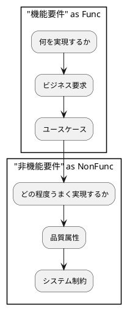
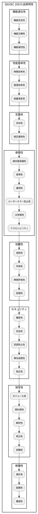
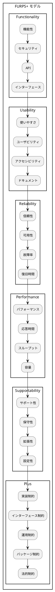
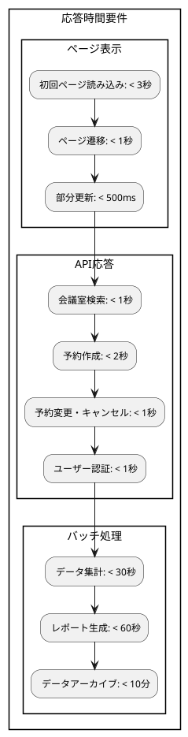
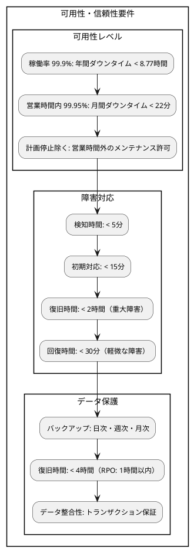
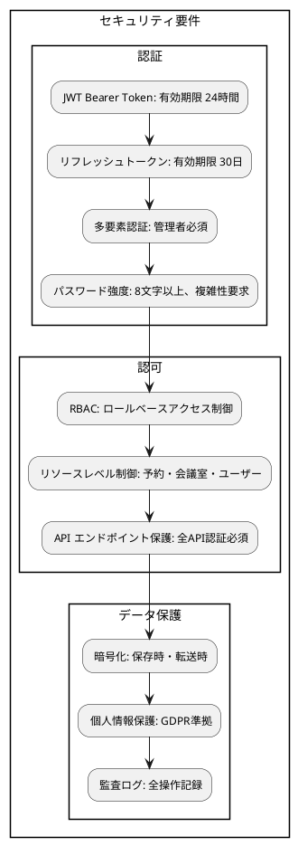
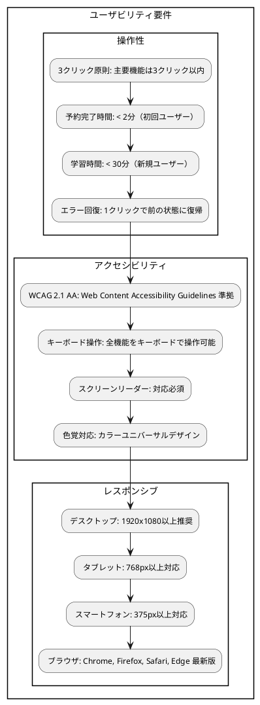
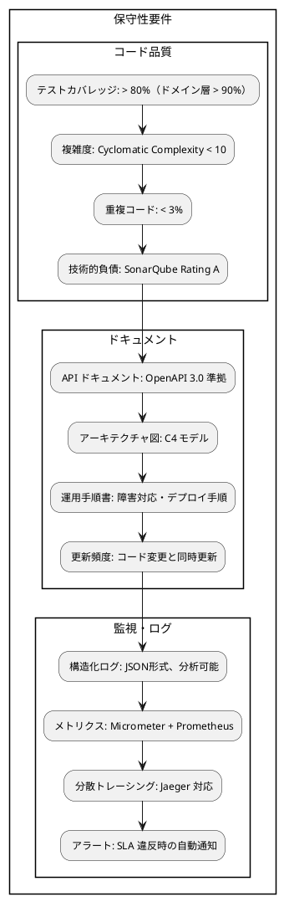

# 非機能要件定義ガイド

## 概要

よいソフトウェアを作るための非機能要件定義について説明する。変更を楽に安全にできて役に立つソフトウェアを実現するため、品質属性を明確に定義し、測定可能な指標を設定する。

## 非機能要件の基本原則

### よいソフトウェアと非機能要件

変更を楽に安全にできて役に立つソフトウェアを作るため、非機能要件は以下の価値を提供する：

1. **安全な変更**: システムが安定して動作し続ける信頼性
2. **楽な変更**: 保守性と拡張性により変更コストを最小化
3. **役に立つ**: ユーザビリティとパフォーマンスによる価値提供
4. **継続的価値**: 可用性と運用性による長期的な価値維持

### 非機能要件の重要性



## ISO/IEC 25010 品質モデル

### システム・ソフトウェア品質モデル



### 品質特性の詳細

#### 機能適合性（Functional Suitability）
- **機能完全性**: 指定されたタスクと目標をカバーする機能の度合い
- **機能正確性**: 正確な結果を提供する機能の度合い
- **機能適切性**: 指定されたタスクと目標を促進する機能の度合い

#### 性能効率性（Performance Efficiency）
- **時間効率性**: 応答時間、処理時間、スループット
- **資源効率性**: CPU、メモリ、ネットワーク、ストレージの使用量
- **容量満足性**: 最大限界値（ユーザー数、データ量など）

#### 互換性（Compatibility）
- **共存性**: 他のソフトウェアと共通環境でリソースを共有する度合い
- **相互運用性**: 他のシステムと情報交換し機能を利用する度合い

#### 使用性（Usability）
- **適切度認識性**: ユーザーが適切性を認識する度合い
- **習得性**: 学習のしやすさ
- **運用性**: 操作・制御のしやすさ
- **ユーザーエラー防止性**: エラーを防護する度合い
- **UI快美性**: 満足感を与える度合い
- **アクセシビリティ**: 幅広いユーザーが使用できる度合い

#### 信頼性（Reliability）
- **成熟性**: 通常運用下で信頼性要求を満足する度合い
- **可用性**: 運用可能で利用できる度合い
- **障害許容性**: 障害にもかかわらず動作する度合い
- **回復性**: 障害後に回復し影響データを復旧する度合い

#### セキュリティ（Security）
- **機密性**: 認可されたもののみがアクセスできる度合い
- **完全性**: データや計算方法への不正アクセスを防ぐ度合い
- **否認防止性**: アクションや事象が起きたことを証明する度合い
- **責任追跡性**: エンティティのアクションを一意に追跡する度合い
- **真正性**: 主張されたアイデンティティを証明する度合い

#### 保守性（Maintainability）
- **モジュール性**: 構成要素への変更が他に与える影響が最小限の度合い
- **再利用性**: 他のシステムで利用できる度合い
- **解析性**: 変更の影響を評価する度合い
- **修正性**: 欠陥除去や改善を効果的かつ効率的に行える度合い
- **試験性**: テスト基準を確立しテストを実行する度合い

#### 移植性（Portability）
- **適応性**: 異なるハードウェア・ソフトウェア環境に適応する度合い
- **設置性**: 指定された環境に設置する度合い
- **置換性**: 同じ目的の他のソフトウェアと置き換える度合い

## 非機能要件の分類

### FURPS+ モデル



### 会議室予約システムの非機能要件分類

#### 性能要件（Performance Requirements）
- **応答時間**: ユーザーアクションに対するレスポンス時間
- **スループット**: 同時処理可能な予約数・ユーザー数
- **容量**: 保存可能なデータ量、サポートするユーザー数

#### 可用性・信頼性要件（Availability & Reliability Requirements）
- **稼働率**: システムが利用可能な時間の割合
- **障害回復**: システム障害からの回復時間
- **データ保護**: データの損失防止とバックアップ

#### セキュリティ要件（Security Requirements）
- **認証・認可**: ユーザー識別とアクセス制御
- **データ保護**: 個人情報・機密情報の保護
- **監査**: アクセスログと操作履歴の記録

#### 使用性要件（Usability Requirements）
- **操作性**: 直感的で使いやすいインターフェース
- **アクセシビリティ**: 多様なユーザーへの対応
- **応答性**: レスポンシブデザインと快適な操作感

#### 保守性・拡張性要件（Maintainability & Scalability Requirements）
- **保守性**: コードの理解しやすさと変更容易性
- **拡張性**: 機能追加とユーザー増加への対応
- **監視性**: システム状態の把握と問題の早期発見

#### 互換性・移植性要件（Compatibility & Portability Requirements）
- **ブラウザ互換性**: 複数ブラウザでの動作保証
- **デバイス対応**: PC、タブレット、スマートフォン対応
- **システム連携**: 既存システムとの連携能力

## 会議室予約システムの非機能要件詳細

### 1. 性能要件（Performance Requirements）

#### 1.1 応答時間要件



**測定方法**:
```javascript
// フロントエンド性能測定
const observer = new PerformanceObserver((list) => {
  list.getEntries().forEach((entry) => {
    console.log(`${entry.name}: ${entry.duration}ms`);
  });
});
observer.observe({ entryTypes: ['navigation', 'measure'] });

// API応答時間測定
const startTime = performance.now();
await fetch('/api/reservations');
const endTime = performance.now();
console.log(`API応答時間: ${endTime - startTime}ms`);
```

**実装例**:
```java
// バックエンド性能監視
@RestController
@Timed // Micrometer アノテーション
public class ReservationController {
    
    @GetMapping("/reservations")
    @Timed(name = "reservation.search", description = "予約検索処理時間")
    public ResponseEntity<List<ReservationResponse>> searchReservations(
            @RequestParam ReservationSearchCriteria criteria) {
        // 処理実装
    }
}

// データベースクエリ最適化
@Repository
public class ReservationRepository {
    
    @Query(value = """
        SELECT r FROM Reservation r 
        WHERE r.roomId = :roomId 
        AND r.startTime >= :startDate 
        AND r.endTime <= :endDate 
        AND r.status IN ('CONFIRMED', 'PENDING')
        """)
    List<Reservation> findActiveByRoomAndDateRange(
        @Param("roomId") UUID roomId,
        @Param("startDate") LocalDateTime startDate,
        @Param("endDate") LocalDateTime endDate);
}
```

#### 1.2 スループット要件

- **同時ユーザー数**: 100名（ピーク時200名まで対応）
- **予約処理能力**: 毎秒10件の予約処理
- **データ容量**: 年間10,000件の予約データ、5年間保持

```java
// 負荷テスト設定例
@Test
@LoadTest(users = 100, duration = 300) // 100ユーザー、5分間
void 予約作成の負荷テスト() {
    CreateReservationRequest request = createTestRequest();
    
    ResponseEntity<ReservationResponse> response = restTemplate.postForEntity(
        "/api/reservations", request, ReservationResponse.class);
    
    assertThat(response.getStatusCode()).isEqualTo(HttpStatus.CREATED);
    assertThat(response.getBody().getReservationId()).isNotNull();
}
```

### 2. 可用性・信頼性要件（Availability & Reliability Requirements）

#### 2.1 稼働率要件



**実装例**:
```yaml
# Docker Compose でのヘルスチェック
services:
  app:
    image: meeting-room-app:latest
    healthcheck:
      test: ["CMD", "curl", "-f", "http://localhost:8080/actuator/health"]
      interval: 30s
      timeout: 10s
      retries: 3
      start_period: 60s
    restart: unless-stopped

  database:
    image: postgres:15
    healthcheck:
      test: ["CMD-SHELL", "pg_isready -U ${POSTGRES_USER}"]
      interval: 10s
      timeout: 5s
      retries: 5
```

```java
// Spring Boot Actuator によるヘルスチェック
@Component
public class DatabaseHealthIndicator implements HealthIndicator {
    
    private final DataSource dataSource;
    
    @Override
    public Health health() {
        try (Connection connection = dataSource.getConnection()) {
            if (connection.isValid(1)) {
                return Health.up()
                    .withDetail("database", "Available")
                    .withDetail("validationQuery", "SELECT 1")
                    .build();
            }
        } catch (SQLException e) {
            return Health.down(e)
                .withDetail("database", "Unavailable")
                .build();
        }
        return Health.down()
            .withDetail("database", "Unknown")
            .build();
    }
}
```

#### 2.2 障害許容性

```java
// Circuit Breaker パターン実装
@Component
public class ExternalServiceClient {
    
    private final CircuitBreaker circuitBreaker;
    
    public ExternalServiceClient() {
        this.circuitBreaker = CircuitBreaker.ofDefaults("externalService");
        circuitBreaker.getEventPublisher()
            .onStateTransition(event -> 
                log.info("Circuit breaker state transition: {}", event));
    }
    
    public Optional<String> callExternalService(String request) {
        return circuitBreaker.executeSupplier(() -> {
            // 外部サービス呼び出し
            return externalServiceCall(request);
        });
    }
}

// 再試行機能
@Retryable(
    value = {DataAccessException.class},
    maxAttempts = 3,
    backoff = @Backoff(delay = 1000, multiplier = 2)
)
public Reservation saveReservation(Reservation reservation) {
    return reservationRepository.save(reservation);
}
```

### 3. セキュリティ要件（Security Requirements）

#### 3.1 認証・認可要件



**実装例**:
```java
// JWT セキュリティ設定
@Configuration
@EnableWebSecurity
@EnableMethodSecurity
public class SecurityConfig {
    
    @Bean
    public SecurityFilterChain filterChain(HttpSecurity http) throws Exception {
        return http
            .csrf(csrf -> csrf.disable())
            .sessionManagement(session -> 
                session.sessionCreationPolicy(SessionCreationPolicy.STATELESS))
            .authorizeHttpRequests(auth -> auth
                .requestMatchers("/api/auth/**").permitAll()
                .requestMatchers(HttpMethod.GET, "/api/rooms").hasAnyRole("USER", "ADMIN")
                .requestMatchers("/api/reservations/**").hasAnyRole("USER", "ADMIN")
                .requestMatchers("/api/admin/**").hasRole("ADMIN")
                .anyRequest().authenticated())
            .oauth2ResourceServer(oauth2 -> oauth2
                .jwt(jwt -> jwt.jwtAuthenticationConverter(jwtAuthConverter())))
            .build();
    }
    
    @Bean
    public PasswordEncoder passwordEncoder() {
        return new BCryptPasswordEncoder(12); // 強度12
    }
}

// 認可制御
@PreAuthorize("hasRole('ADMIN') or @reservationSecurityService.canAccessReservation(#reservationId, authentication.name)")
public ReservationResponse getReservation(@PathVariable String reservationId) {
    // 実装
}

// 監査ログ
@EventListener
public class AuditEventListener {
    
    @Async
    @EventListener
    public void handleAuditEvent(AuditEvent event) {
        AuditLog auditLog = AuditLog.builder()
            .userId(event.getPrincipal())
            .action(event.getType())
            .resource(event.getData().toString())
            .timestamp(LocalDateTime.now())
            .ipAddress(getClientIpAddress())
            .userAgent(getUserAgent())
            .build();
        
        auditLogRepository.save(auditLog);
    }
}
```

#### 3.2 データ暗号化

```java
// 個人情報暗号化
@Entity
@Table(name = "users")
public class User {
    
    @Id
    private UUID id;
    
    @Column(name = "username")
    private String username;
    
    @Convert(converter = EncryptedStringConverter.class)
    @Column(name = "email")
    private String email; // 暗号化保存
    
    @Convert(converter = EncryptedStringConverter.class)
    @Column(name = "full_name")
    private String fullName; // 暗号化保存
    
    @Column(name = "password_hash")
    private String passwordHash; // BCrypt ハッシュ
}

// 暗号化コンバーター
@Component
public class EncryptedStringConverter implements AttributeConverter<String, String> {
    
    @Autowired
    private AESEncryptionService encryptionService;
    
    @Override
    public String convertToDatabaseColumn(String attribute) {
        return attribute == null ? null : encryptionService.encrypt(attribute);
    }
    
    @Override
    public String convertToEntityAttribute(String dbData) {
        return dbData == null ? null : encryptionService.decrypt(dbData);
    }
}
```

### 4. 使用性要件（Usability Requirements）

#### 4.1 ユーザビリティ要件



**実装例**:
```tsx
// アクセシビリティ対応コンポーネント
interface ReservationFormProps {
  onSubmit: (data: ReservationFormData) => void;
}

export const ReservationForm: React.FC<ReservationFormProps> = ({ onSubmit }) => {
  return (
    <form onSubmit={handleSubmit} role="form" aria-label="会議室予約フォーム">
      <fieldset>
        <legend>予約情報</legend>
        
        <div className="form-group">
          <label htmlFor="room-select" className="required">
            会議室選択
          </label>
          <select
            id="room-select"
            aria-required="true"
            aria-describedby="room-help"
            {...register('roomId', { required: '会議室を選択してください' })}
          >
            <option value="">選択してください</option>
            {rooms.map(room => (
              <option key={room.id} value={room.id}>
                {room.name} (収容人数: {room.capacity}名)
              </option>
            ))}
          </select>
          <div id="room-help" className="help-text">
            希望する会議室を選択してください
          </div>
          {errors.roomId && (
            <div role="alert" className="error-message">
              {errors.roomId.message}
            </div>
          )}
        </div>
        
        <div className="form-group">
          <label htmlFor="date-input" className="required">
            利用日
          </label>
          <input
            type="date"
            id="date-input"
            aria-required="true"
            min={new Date().toISOString().split('T')[0]}
            {...register('date', { required: '利用日を選択してください' })}
          />
        </div>
        
        <button 
          type="submit" 
          disabled={isSubmitting}
          aria-describedby="submit-help"
        >
          {isSubmitting ? '予約中...' : '予約する'}
        </button>
        <div id="submit-help" className="help-text">
          入力内容を確認して予約ボタンをクリックしてください
        </div>
      </fieldset>
    </form>
  );
};

// レスポンシブデザイン
const ReservationCard = styled.div`
  padding: 1rem;
  border: 1px solid #e2e8f0;
  border-radius: 0.5rem;
  
  @media (min-width: 768px) {
    padding: 1.5rem;
    display: grid;
    grid-template-columns: 1fr auto;
    gap: 1rem;
  }
  
  @media (min-width: 1024px) {
    padding: 2rem;
  }
`;
```

#### 4.2 ユーザーエクスペリエンス指標

```javascript
// Core Web Vitals 測定
import { getCLS, getFID, getFCP, getLCP, getTTFB } from 'web-vitals';

function sendToAnalytics(metric) {
  // 分析ツールへの送信
  analytics.track('Performance Metric', {
    name: metric.name,
    value: metric.value,
    rating: metric.rating
  });
}

// 各指標の測定
getCLS(sendToAnalytics); // Cumulative Layout Shift < 0.1
getFID(sendToAnalytics); // First Input Delay < 100ms
getFCP(sendToAnalytics); // First Contentful Paint < 1.8s
getLCP(sendToAnalytics); // Largest Contentful Paint < 2.5s
getTTFB(sendToAnalytics); // Time to First Byte < 0.8s

// ユーザー行動分析
const trackUserInteraction = (action, element, duration) => {
  analytics.track('User Interaction', {
    action,
    element,
    duration,
    timestamp: new Date().toISOString(),
    userId: getCurrentUserId()
  });
};

// 予約プロセス分析
const reservationFlowTracking = {
  searchStart: () => trackUserInteraction('search_start', 'room_search', 0),
  searchComplete: (duration) => trackUserInteraction('search_complete', 'room_search', duration),
  reservationStart: () => trackUserInteraction('reservation_start', 'reservation_form', 0),
  reservationComplete: (duration) => trackUserInteraction('reservation_complete', 'reservation_form', duration),
  reservationAbandoned: (step, duration) => trackUserInteraction('reservation_abandoned', step, duration)
};
```

### 5. 保守性・拡張性要件（Maintainability & Scalability Requirements）

#### 5.1 保守性要件



**実装例**:
```java
// 構造化ログ
@RestController
@Slf4j
public class ReservationController {
    
    @PostMapping("/reservations")
    public ResponseEntity<ReservationResponse> createReservation(
            @RequestBody CreateReservationRequest request,
            HttpServletRequest httpRequest) {
        
        MDC.put("userId", getCurrentUserId());
        MDC.put("correlationId", UUID.randomUUID().toString());
        MDC.put("ipAddress", getClientIpAddress(httpRequest));
        
        try {
            log.info("Creating reservation: roomId={}, startTime={}", 
                request.getRoomId(), request.getStartTime());
            
            ReservationId reservationId = createReservationUseCase.execute(
                mapToCommand(request));
            
            log.info("Reservation created successfully: reservationId={}", reservationId);
            
            return ResponseEntity.status(HttpStatus.CREATED)
                .body(ReservationResponse.from(reservationId));
                
        } catch (Exception e) {
            log.error("Failed to create reservation", e);
            throw e;
        } finally {
            MDC.clear();
        }
    }
}

// メトリクス収集
@Component
@Service
public class ReservationMetricsService {
    
    private final MeterRegistry meterRegistry;
    private final Counter reservationCreatedCounter;
    private final Counter reservationFailedCounter;
    private final Timer reservationProcessingTimer;
    
    public ReservationMetricsService(MeterRegistry meterRegistry) {
        this.meterRegistry = meterRegistry;
        this.reservationCreatedCounter = Counter.builder("reservation.created")
            .description("Created reservations count")
            .register(meterRegistry);
        this.reservationFailedCounter = Counter.builder("reservation.failed")
            .description("Failed reservations count")
            .register(meterRegistry);
        this.reservationProcessingTimer = Timer.builder("reservation.processing")
            .description("Reservation processing time")
            .register(meterRegistry);
    }
    
    public void recordReservationCreated() {
        reservationCreatedCounter.increment();
    }
    
    public void recordReservationFailed(String reason) {
        reservationFailedCounter.increment(Tags.of("reason", reason));
    }
    
    public Timer.Sample startProcessingTimer() {
        return Timer.start(meterRegistry);
    }
}
```

#### 5.2 拡張性要件

```java
// 水平スケーリング対応
@Configuration
@EnableCaching
public class CacheConfig {
    
    @Bean
    public CacheManager cacheManager() {
        RedisCacheManager.Builder builder = RedisCacheManager
            .RedisCacheManagerBuilder
            .fromConnectionFactory(jedisConnectionFactory())
            .cacheDefaults(cacheConfiguration());
            
        return builder.build();
    }
    
    private RedisCacheConfiguration cacheConfiguration() {
        return RedisCacheConfiguration.defaultCacheConfig()
            .entryTtl(Duration.ofMinutes(10))
            .serializeKeysWith(RedisSerializationContext.SerializationPair
                .fromSerializer(new StringRedisSerializer()))
            .serializeValuesWith(RedisSerializationContext.SerializationPair
                .fromSerializer(new GenericJackson2JsonRedisSerializer()));
    }
}

// データベースパーティショニング
@Entity
@Table(name = "reservations")
@PartitionKey("DATE(start_time)") // 日付によるパーティショニング
public class ReservationEntity {
    // エンティティ定義
}

// マイクロサービス化の準備
@FeignClient(name = "notification-service", url = "${services.notification.url}")
public interface NotificationServiceClient {
    
    @PostMapping("/notifications")
    ResponseEntity<Void> sendNotification(@RequestBody NotificationRequest request);
}
```

### 6. 運用要件（Operational Requirements）

#### 6.1 監視・運用要件

```yaml
# Kubernetes デプロイメント設定
apiVersion: apps/v1
kind: Deployment
metadata:
  name: meeting-room-app
spec:
  replicas: 3
  selector:
    matchLabels:
      app: meeting-room-app
  template:
    spec:
      containers:
      - name: app
        image: meeting-room-app:latest
        ports:
        - containerPort: 8080
        resources:
          requests:
            memory: "512Mi"
            cpu: "500m"
          limits:
            memory: "1Gi"
            cpu: "1000m"
        livenessProbe:
          httpGet:
            path: /actuator/health/liveness
            port: 8080
          initialDelaySeconds: 60
          periodSeconds: 30
        readinessProbe:
          httpGet:
            path: /actuator/health/readiness
            port: 8080
          initialDelaySeconds: 30
          periodSeconds: 10
        env:
        - name: JAVA_OPTS
          value: "-Xms512m -Xmx1g -XX:+UseG1GC"
        - name: SPRING_PROFILES_ACTIVE
          value: "production"
```

```java
// カスタムヘルスチェック
@Component
public class ReservationSystemHealthIndicator implements HealthIndicator {
    
    private final ReservationRepository reservationRepository;
    private final NotificationServiceClient notificationService;
    
    @Override
    public Health health() {
        Health.Builder status = Health.up();
        
        try {
            // データベース接続確認
            long activeReservationsCount = reservationRepository.countActiveReservations();
            status.withDetail("database", Map.of(
                "status", "UP",
                "activeReservations", activeReservationsCount
            ));
            
            // 外部サービス接続確認
            boolean notificationServiceUp = checkNotificationService();
            status.withDetail("notificationService", Map.of(
                "status", notificationServiceUp ? "UP" : "DOWN"
            ));
            
            // システムリソース確認
            status.withDetail("system", getSystemMetrics());
            
        } catch (Exception e) {
            return Health.down(e).build();
        }
        
        return status.build();
    }
    
    private Map<String, Object> getSystemMetrics() {
        Runtime runtime = Runtime.getRuntime();
        long maxMemory = runtime.maxMemory();
        long totalMemory = runtime.totalMemory();
        long freeMemory = runtime.freeMemory();
        
        return Map.of(
            "memory.max", maxMemory,
            "memory.total", totalMemory,
            "memory.free", freeMemory,
            "memory.used", totalMemory - freeMemory,
            "processors", runtime.availableProcessors()
        );
    }
}
```

## 非機能要件の測定と検証

### 1. パフォーマンステスト

```java
// JMeter 負荷テストシナリオ
@Test
public class PerformanceTest {
    
    @LoadTest(
        users = 100,
        rampUp = 60,  // 60秒で100ユーザーまで増加
        duration = 300 // 5分間実行
    )
    public void 予約作成負荷テスト() {
        // 予約作成APIの負荷テスト
        given()
            .contentType(ContentType.JSON)
            .body(createReservationRequest())
        .when()
            .post("/api/reservations")
        .then()
            .statusCode(201)
            .time(lessThan(2000L)); // 2秒以内
    }
    
    @PerformanceTest
    @JvmOptions({"-Xms1g", "-Xmx2g", "-XX:+UseG1GC"})
    public void メモリ使用量テスト() {
        // メモリ使用量とGCの影響を測定
        for (int i = 0; i < 10000; i++) {
            createAndProcessReservation();
        }
        
        // メモリ使用量を確認
        assertThat(getUsedMemoryMB()).isLessThan(1500); // 1.5GB以下
        assertThat(getGcPauseTimeMs()).isLessThan(100); // GC停止時間100ms以下
    }
}
```

### 2. セキュリティテスト

```java
// セキュリティテスト
@SpringBootTest
@AutoConfigureMockMvc
public class SecurityTest {
    
    @Test
    public void 認証なしでアクセスすると401エラー() throws Exception {
        mockMvc.perform(get("/api/reservations"))
            .andExpect(status().isUnauthorized());
    }
    
    @Test
    public void 無効なJWTトークンで401エラー() throws Exception {
        mockMvc.perform(get("/api/reservations")
                .header("Authorization", "Bearer invalid-token"))
            .andExpected(status().isUnauthorized());
    }
    
    @Test
    @WithMockUser(roles = "USER")
    public void 管理者権限なしで管理APIにアクセスすると403エラー() throws Exception {
        mockMvc.perform(get("/api/admin/users"))
            .andExpect(status().isForbidden());
    }
    
    @Test
    public void SQLインジェクション攻撃をブロック() throws Exception {
        String maliciousInput = "'; DROP TABLE users; --";
        
        mockMvc.perform(get("/api/reservations")
                .param("search", maliciousInput))
            .andExpect(status().isBadRequest())
            .andExpect(jsonPath("$.error").value("INVALID_INPUT"));
    }
}
```

### 3. ユーザビリティテスト

```javascript
// Cypress E2Eテスト
describe('予約作成フロー', () => {
  it('新規ユーザーでも2分以内に予約完了できる', () => {
    const startTime = Date.now();
    
    cy.visit('/login');
    cy.get('[data-cy=username]').type('newuser@example.com');
    cy.get('[data-cy=password]').type('password123');
    cy.get('[data-cy=login-button]').click();
    
    // 会議室検索
    cy.get('[data-cy=room-search]').click();
    cy.get('[data-cy=capacity-filter]').select('10');
    cy.get('[data-cy=date-picker]').type('2024-12-01');
    cy.get('[data-cy=search-button]').click();
    
    // 予約作成
    cy.get('[data-cy=room-card]').first().click();
    cy.get('[data-cy=time-slot]').contains('10:00-12:00').click();
    cy.get('[data-cy=purpose]').type('定例会議');
    cy.get('[data-cy=reserve-button]').click();
    
    // 完了確認
    cy.get('[data-cy=success-message]').should('be.visible');
    
    const endTime = Date.now();
    const duration = (endTime - startTime) / 1000; // 秒換算
    
    expect(duration).to.be.lessThan(120); // 2分以内
  });
  
  it('アクセシビリティ基準を満たす', () => {
    cy.visit('/reservations');
    cy.injectAxe(); // axe-core ライブラリ
    
    cy.checkA11y(null, {
      rules: {
        'color-contrast': { enabled: true },
        'keyboard-navigation': { enabled: true },
        'focus-management': { enabled: true }
      }
    });
  });
});
```

### 4. 継続的監視

```yaml
# Prometheus 監視ルール
groups:
- name: meeting-room-system
  rules:
  - alert: HighResponseTime
    expr: histogram_quantile(0.95, rate(http_request_duration_seconds_bucket[5m])) > 2
    for: 2m
    labels:
      severity: warning
    annotations:
      summary: "API応答時間が遅延"
      description: "95パーセンタイルの応答時間が2秒を超えています"
  
  - alert: HighErrorRate
    expr: rate(http_requests_total{status=~"5.."}[5m]) > 0.05
    for: 1m
    labels:
      severity: critical
    annotations:
      summary: "エラー率が高い"
      description: "5xx エラーの発生率が5%を超えています"
  
  - alert: DatabaseConnectionFailure
    expr: health_database_status != 1
    for: 30s
    labels:
      severity: critical
    annotations:
      summary: "データベース接続失敗"
      description: "データベースへの接続が失敗しています"
```

## 非機能要件のライフサイクル管理

### 1. 要件定義フェーズ

- ステークホルダー特定
- 品質属性の優先順位付け
- 測定可能な目標値設定
- 検証方法の決定
- 受け入れ基準の合意

### 2. 設計・実装フェーズ

- アーキテクチャ設計への反映
- 非機能要件を満たす技術選択
- 測定・監視機能の実装
- テスト戦略への組み込み

### 3. テスト・検証フェーズ

- パフォーマンステスト実行
- セキュリティテスト実行
- ユーザビリティテスト実行
- 受け入れ基準の検証
- 改善点の特定と対策

### 4. 運用フェーズ

- 監視システム構築
- SLAの設定
- 定期的なパフォーマンス測定
- ユーザーフィードバック収集
- 継続的改善

## まとめ

### 非機能要件定義の要点

1. **品質属性の明確化**
   - ISO/IEC 25010 に基づく体系的な分類
   - 測定可能な目標値の設定
   - ステークホルダーとの合意形成

2. **実装と検証の統合**
   - アーキテクチャ設計への反映
   - 自動テストによる継続的検証
   - 運用監視との連携

3. **継続的改善**
   - 実運用データに基づく評価
   - ユーザーフィードバックの活用
   - 技術進歩に応じた要件見直し

4. **リスク管理**
   - 品質属性間のトレードオフの認識
   - 優先順位に基づく段階的実装
   - 早期の問題発見と対策

### 非機能要件がもたらす価値

**短期的価値**:
- システムの安定性と信頼性の確保
- ユーザー満足度の向上
- 運用コストの削減

**長期的価値**:
- 保守性による開発効率の維持
- 拡張性による事業成長への対応
- セキュリティによるリスク回避

非機能要件は、変更を楽に安全にできて役に立つソフトウェアを実現するための基盤である。適切な定義と継続的な管理により、持続的な価値提供を可能にする。