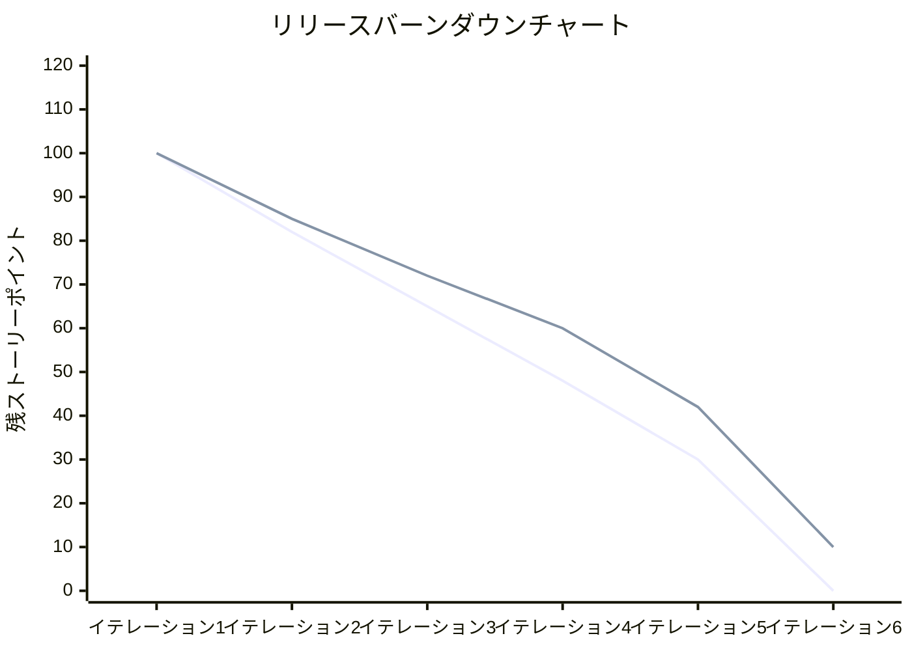
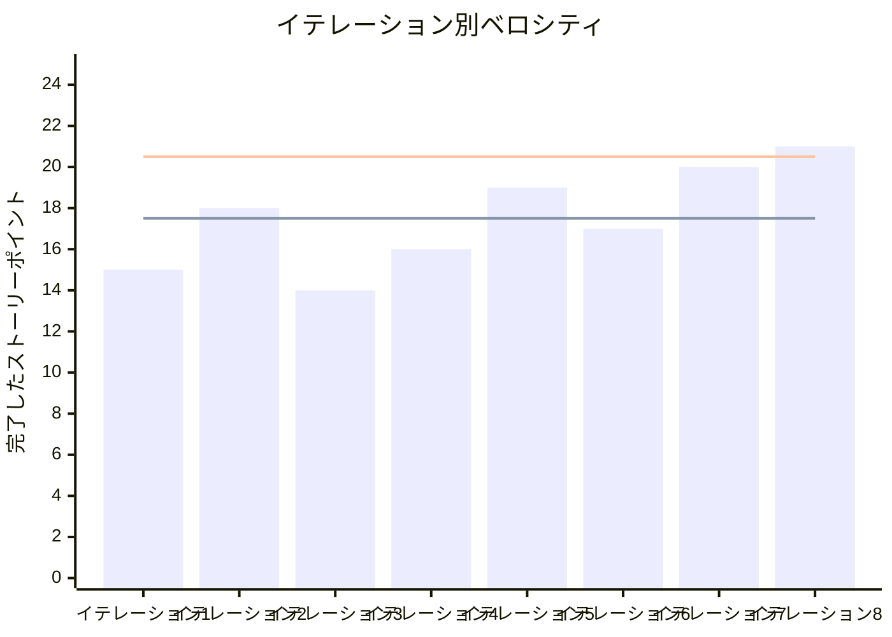

# プロジェクト概要

## 日程

- イテレーション開始日
- イテレーション終了日
- 作業日数

## 要員

|名前|予定作業日数|実績作業日数|
|---|---|---|
|A|5|5|

## 指標

### ナイトリービルド結果

|日付|結果|
|---|---|
|9月1日(月) |Build failed|

### イテレーションバーンダウン

### ベロシティ

## 実施内容と評価

|ストーリー|結果|予定ポイント|ベロシティ加算ポイント|
|---|---|---|---|
|ユーザーとして、私は...|完了|5|5|
|ユーザーとして、私は...|完了|3|3|
|ユーザーとして、私は...|完了|8|8|
|合計| |16|16|

### イテレーションレビュー

|アクションアイテム|担当|
|---|---|
|ユーザーとして、私は...のレビュー|A|