# 要件定義 - [システム名]

## システム価値

### システムコンテキスト

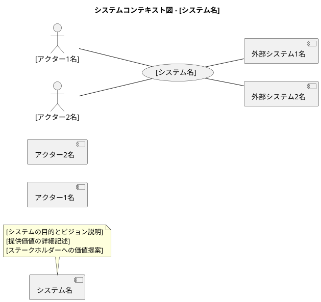

### 要求モデル

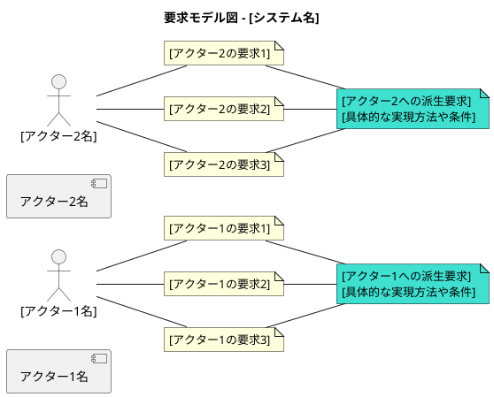

## システム外部環境

### ビジネスコンテキスト

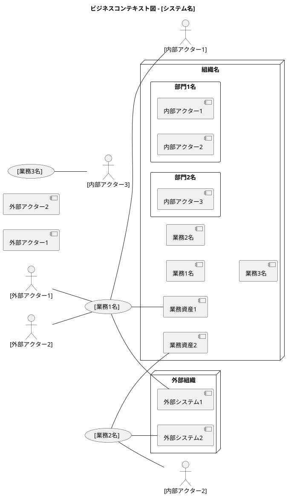

### ビジネスユースケース

#### [業務1名]

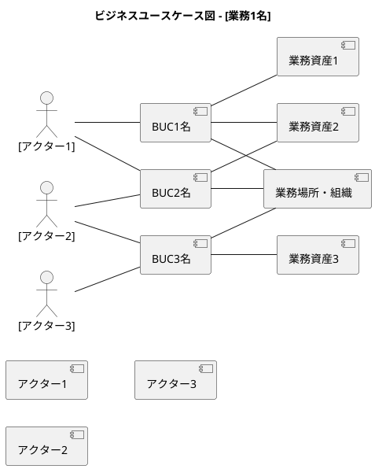

#### [業務2名]

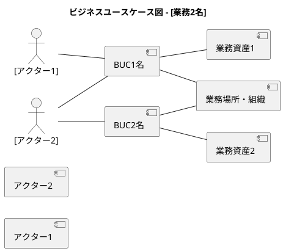

### 業務フロー

#### [BUC名1]の業務フロー

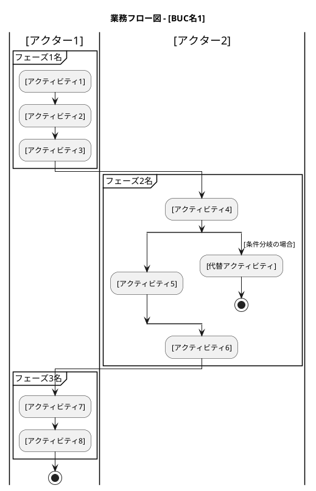

#### [BUC名2]の業務フロー

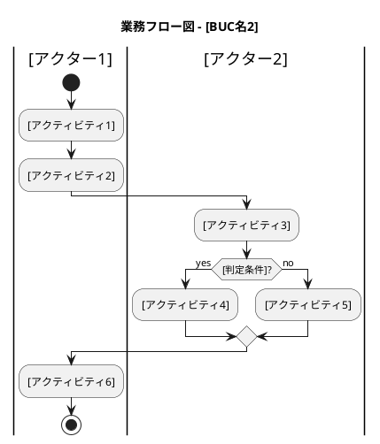

### 利用シーン

#### [BUC名1]の利用シーン

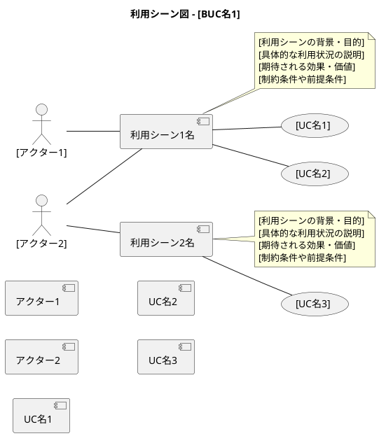

#### [BUC名2]の利用シーン

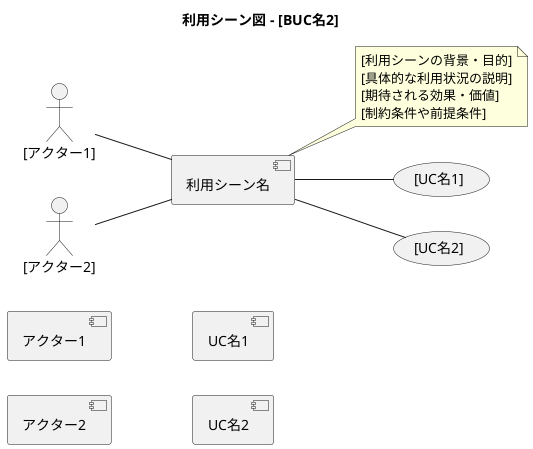

### バリエーション・条件

#### [分類軸1名]

| [分類名] | 説明 |
|----------|------|
| [分類値1] | [分類値1の説明] |
| [分類値2] | [分類値2の説明] |
| [分類値3] | [分類値3の説明] |

#### [分類軸2名]

| [分類名] | 説明 |
|----------|------|
| [分類値1] | [分類値1の説明] |
| [分類値2] | [分類値2の説明] |

#### [分類軸3名]

| [分類名] | 説明 |
|----------|------|
| [分類値1] | [分類値1の説明] |
| [分類値2] | [分類値2の説明] |
| [分類値3] | [分類値3の説明] |

## システム境界

### ユースケース複合図

#### [BUC名1]

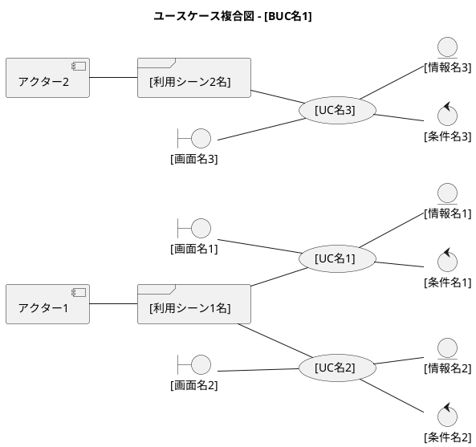

#### [BUC名2]

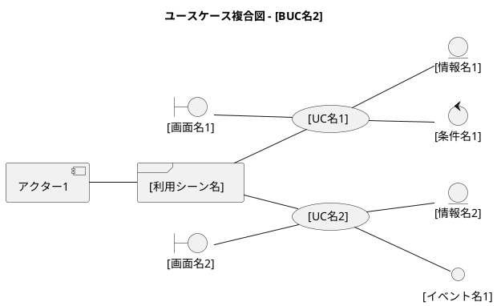

## システム

### 情報モデル

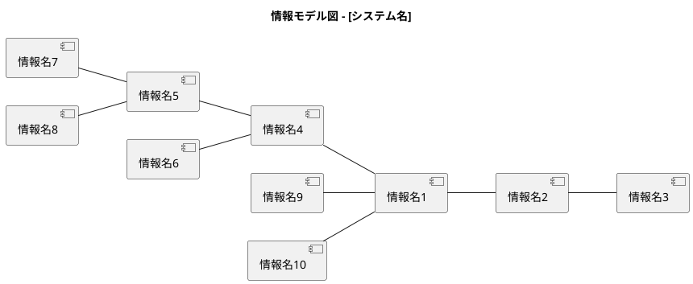

### 状態モデル

#### [情報名1]の状態遷移

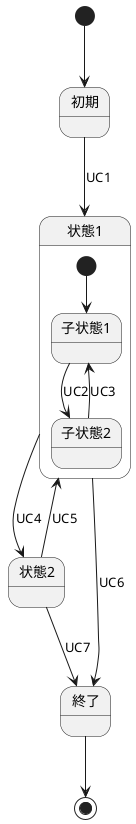

#### [情報名2]の状態遷移

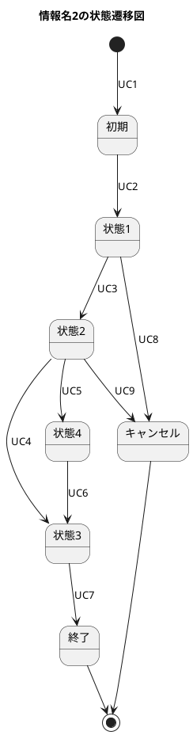

---

## 記入ガイド

### 1. システムコンテキスト図の記入方法

- **[システム名]**: 開発対象システムの名前
- **[アクター名]**: システムを利用する人や組織
- **[外部システム名]**: 連携する外部システムやサービス
- **システムの目的とビジョン**: システムが解決する課題と提供価値を簡潔に記述

### 2. 要求モデル図の記入方法

- **[アクターの要求]**: 各アクターがシステムに求めること
- **[派生要求]**: 複数の要求から導出される具体的な要件
- 要求は「〜したい」形式で記述
- 派生要求は「〜できること」形式で記述

### 3. ビジネスコンテキスト図の記入方法

- **[組織名]**: システムを利用する組織全体
- **[部門名]**: 組織内の各部門
- **[業務名]**: 各部門で行われる業務
- **[業務資産]**: 業務で扱う重要な物理的・情報的資産
- **[外部組織]**: 連携する外部の組織やシステム

### 4. ビジネスユースケース図の記入方法

- **[BUC名]**: ビジネスユースケース（業務の作業単位）
- 業務を実行する場所や組織をagentで表現
- 業務で扱う資産をartifactで表現
- BUCは動詞形で記述（例：「商品を登録する」）

### 5. 業務フロー図の記入方法

- **[アクティビティ名]**: BUCを構成する具体的な作業
- **[フェーズ名]**: 作業のまとまりやグループ
- **[判定条件]**: 業務の分岐点での判定基準
- レーン（|アクター|）でアクターごとの責任を明確化
- partitionで作業フェーズを整理
- split/split againで並行処理や条件分岐を表現
- アクティビティは動詞形で記述

### 6. 利用シーン図の記入方法

- **[利用シーン名]**: システムが利用される具体的な場面
- **利用シーンの説明**: 背景、目的、期待効果、制約条件
- frameで利用シーンをグループ化
- noteで詳細な説明を付加
- 利用シーンからUCへの関連を明示
- ステークホルダーの視点で記述

### 7. ユースケース複合図の記入方法

- **[UC名]**: システムユースケース（システム機能）
- **[画面名]**: ユーザーインターフェース（boundary）
- **[情報名]**: システムが管理するデータ（entity）
- **[条件名]**: システムの動作条件（control）
- **[イベント名]**: 外部との連携点（interface）
- **[利用シーン名]**: UCが実行される具体的な場面（frame）

### 8. 情報モデル図の記入方法

- **[情報名]**: システムが管理するエンティティ
- 関連線で情報間の関係を表現
- エンティティ群ごとにコメントで分類
- ビジネス概念をそのまま情報名に使用

### 9. 状態モデル図の記入方法

- **[状態名]**: 情報が取りうる状態
- **[UC名]**: 状態を変更するユースケース
- 複合状態は state {} で表現
- 各状態にはnoteで説明を付加
- 状態名は名詞形で記述

### 10. バリエーション・条件の記入方法

- **[分類軸名]**: ビジネス上重要な区分の軸
- **[分類値]**: 各軸での具体的な値
- システムの動作を左右する重要な区分を定義
- 将来の拡張性を考慮した分類を設定

### 11. 記入時の注意点

1. **段階的詳細化**: 最初は大まかに記入し、徐々に詳細化
2. **一貫性の確保**: 図間での用語統一と関連性の整合性
3. **ステークホルダー視点**: 業務担当者が理解できる用語を使用
4. **トレーサビリティ**: 上位要求から下位実装までの追跡可能性
5. **適切な抽象化レベル**: 設計詳細ではなく要件レベルで記述

### 12. PlantUML記法の基本

- `actor`: 人や組織
- `usecase`: システムや業務
- `agent`: 外部システムや場所
- `entity`: 情報やデータ
- `boundary`: 画面や入出力
- `control`: 条件や制御
- `interface`: イベントや通信
- `frame`: 利用シーンやグループ化
- `artifact`: 物理的資産や成果物
- `note`: 説明文

このテンプレートを使用して、プロジェクト固有の要件定義書を作成してください。