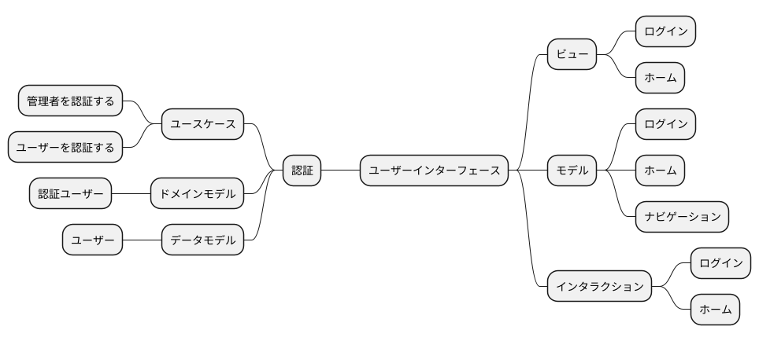
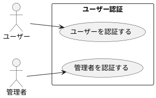
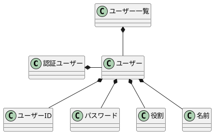
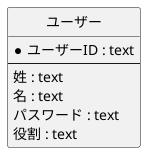
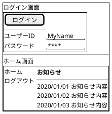
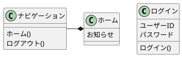
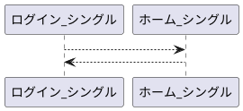

## ユーザーストーリー

- 管理者としてログインできる
- ユーザーとしてログインできる

## TODOリスト

- [x] 認証APIを作成する
- [x] ログイン画面を作成する
- [x] ホーム画面を作成する

## ユースケース

## ドメインモデル

## データモデル

## ユーザーインターフェース

### ビュー

### モデル

### インタラクション

